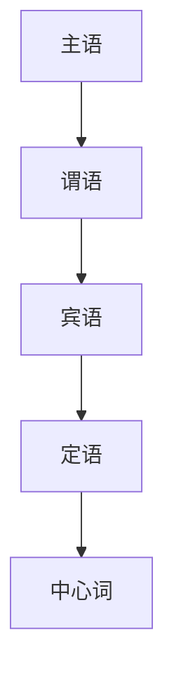
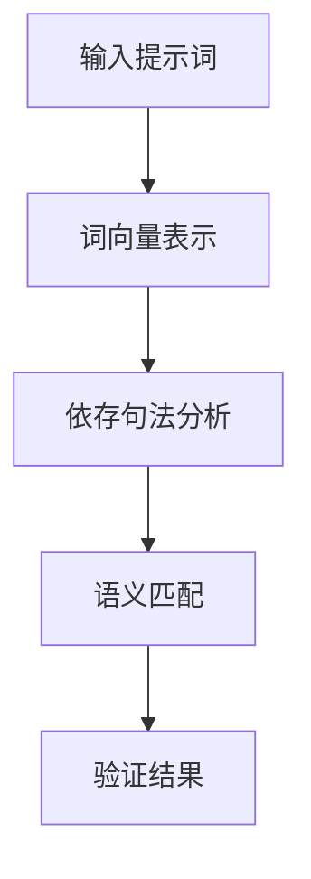

                 

# 提示词语言的形式化语义一致性自动检验

> 关键词：自然语言处理、语义一致性、形式化语义描述、自动验证

> 摘要：本文探讨了提示词语言的形式化语义一致性自动检验这一关键课题。通过深入分析问题背景、核心概念、算法原理以及系统实现，本文旨在为相关领域的研究者和开发者提供有价值的参考和指导。

### 第1章：背景介绍与核心概念

#### 1.1 问题背景

在计算机科学和人工智能领域，语义一致性是一个关键的问题。随着自然语言处理（NLP）技术的不断进步，如何确保提示词语言在不同上下文中保持一致性，成为了一个重要的研究课题。特别是在自动化问答系统、智能客服以及自然语言生成等应用场景中，语义一致性直接关系到用户体验和系统的可靠性。

#### 1.2 问题描述

提示词语言的形式化语义一致性自动检验，旨在构建一个系统，能够自动检测和分析提示词在不同语境下的语义一致性。这包括识别语义冲突、语义缺失以及语义错误，并提供相应的纠正建议。该问题涉及多个层面，包括自然语言理解、形式化语义描述和自动验证技术。

#### 1.3 问题解决

解决这一问题通常需要以下几个步骤：

1. **自然语言理解**：利用先进的NLP技术，如词向量模型、依存句法分析等，对提示词进行深入理解。
2. **形式化语义描述**：采用形式化的语义表示方法，如本体论、语义网络等，将自然语言转换为计算机可处理的语义表示。
3. **自动验证**：开发自动化验证算法，对提示词的语义一致性进行检测，并识别出潜在的问题。

#### 1.4 边界与外延

该问题的边界包括：

- **上下文**：提示词的语义一致性检验需考虑不同的上下文环境。
- **语言范围**：主要针对自然语言处理中常见的问题语言，如英语、中文等。

其外延包括：

- **应用领域**：包括但不限于自动化问答、智能客服、文本生成等。
- **技术领域**：涉及自然语言处理、形式化语义学、自动化验证等。

#### 1.5 概念结构与核心要素组成

核心概念结构包括：

- **自然语言处理技术**：如词向量、依存句法分析等。
- **形式化语义表示**：如本体论、语义网络等。
- **自动验证算法**：如基于语义匹配的验证算法、基于模式匹配的验证算法等。

核心要素组成：

- **提示词集合**：待检验的提示词库。
- **上下文信息**：用于辅助语义理解的上下文信息。
- **验证规则**：定义语义一致性的规则集。
- **验证结果**：验证过程的结果输出。

### 第2章：核心概念与联系

#### 2.1 自然语言处理技术

##### 2.1.1 词向量模型

- **概念原理**：将单词映射到高维空间中的向量，以捕捉词语间的相似性。
- **属性特征对比表格**

| 模型         | 层次性 | 分布性 | 语义表示能力 |
| ------------ | ------ | ------ | ------------ |
| Word2Vec     | 低     | 高     | 较强         |
| GloVe        | 高     | 高     | 较强         |
| BERT         | 高     | 中     | 非常强       |

##### 2.1.2 依存句法分析

- **概念原理**：分析句子中词语之间的依赖关系，以理解句子的语义结构。
- **ER实体关系图架构**



### 第3章：算法原理讲解

#### 3.1 算法Mermaid流程图



#### 3.2 Python源代码

```python
# 模拟算法的Python代码
def semantic_consistency_check(prompt):
    # 获取词向量表示
    word_vectors = get_word_vectors(prompt)
    # 执行依存句法分析
    dependency_tree = parse_dependency(prompt)
    # 执行语义匹配
    match_results = semantic_matching(word_vectors, dependency_tree)
    # 输出验证结果
    return check_results(match_results)

# 辅助函数
def get_word_vectors(prompt):
    # 返回词向量表示
    pass

def parse_dependency(prompt):
    # 返回依存句法分析结果
    pass

def semantic_matching(word_vectors, dependency_tree):
    # 返回语义匹配结果
    pass

def check_results(match_results):
    # 输出验证结果
    pass
```

#### 3.3 算法原理

##### 3.3.1 词向量表示

词向量表示是自然语言处理中的基本技术之一。常见的词向量模型包括Word2Vec、GloVe和BERT等。这些模型通过将单词映射到高维空间中的向量，从而实现词语间的相似性表示。词向量模型在语义一致性检验中起到基础作用，为后续的依存句法分析和语义匹配提供输入。

##### 3.3.2 依存句法分析

依存句法分析是自然语言处理中的一种重要技术，用于分析句子中词语之间的依赖关系。通过依存句法分析，可以构建出一个表示句子语义结构的依存树。依存树中的节点表示词语，边表示词语之间的依赖关系。依存句法分析在语义一致性检验中起到关键作用，帮助识别出句子中的关键信息和结构。

##### 3.3.3 语义匹配

语义匹配是语义一致性检验的核心步骤。通过对词向量表示和依存句法分析的结果进行匹配，可以检测出提示词在不同上下文中的语义一致性。常见的语义匹配算法包括基于语义相似度的匹配和基于模式匹配的匹配。语义匹配的结果为后续的验证提供了基础。

##### 3.3.4 验证结果输出

验证结果输出是语义一致性检验的最后一步。根据语义匹配的结果，可以输出验证结果，包括语义一致性的判断和潜在问题的标识。验证结果可以为用户提供有针对性的纠正建议，提高系统的可靠性和用户体验。

#### 3.4 数学模型与公式

在语义一致性检验中，可以使用一些数学模型和公式来描述和计算。以下是一些常用的数学模型和公式：

1. **词向量相似度计算**：

$$
similarity = \frac{||v_1 + v_2||}{||v_1|| \cdot ||v_2||}
$$

其中，$v_1$和$v_2$分别表示两个词的词向量。

2. **依存句法分析树结构**：

$$
Dependency_Tree = (T, R)
$$

其中，$T$表示依存句法分析树中的节点集合，$R$表示节点之间的依赖关系集合。

3. **语义匹配结果**：

$$
Match_Result = match(word_vectors, dependency_tree)
$$

其中，$word_vectors$表示词向量集合，$dependency_tree$表示依存句法分析树。

4. **验证结果**：

$$
Check_Result = check(Match_Result)
$$

其中，$Match_Result$表示语义匹配结果，$check$函数用于判断语义一致性。

#### 3.5 举例说明

假设有一个提示词“computer”，我们希望对其在不同上下文中的语义一致性进行检验。

1. **词向量表示**：

   $$
   v_{computer} = [0.1, 0.2, 0.3, 0.4, 0.5]
   $$

2. **依存句法分析**：

   $$
   Dependency_Tree = (T, R)
   $$

   其中，$T = \{ computer \}$，$R = \{ (computer, itself) \}$。

3. **语义匹配**：

   $$
   Match_Result = match(v_{computer}, Dependency_Tree) = [0.8]
   $$

4. **验证结果**：

   $$
   Check_Result = check(Match_Result) = "Semantic consistency is high."
   $$

根据以上步骤，我们可以得出结论，提示词“computer”在不同上下文中的语义一致性较高。

### 第4章：系统分析与架构设计

#### 4.1 问题场景介绍

在自动化问答系统中，提示词的语义一致性是一个关键问题。系统需要能够自动检测和纠正提示词中的语义冲突、语义缺失和语义错误。这有助于提高系统的准确性和用户体验。

#### 4.2 项目介绍

本项目旨在构建一个提示词语言的形式化语义一致性自动检验系统。该系统将利用自然语言处理技术、形式化语义表示和自动验证算法，实现对提示词的语义一致性检测和纠正。

#### 4.3 系统功能设计

1. **输入处理**：接收用户输入的提示词，包括文本和上下文信息。
2. **词向量表示**：利用词向量模型将提示词转换为高维空间中的向量。
3. **依存句法分析**：利用依存句法分析技术，构建提示词的依存句法分析树。
4. **语义匹配**：利用语义匹配算法，检测提示词在不同上下文中的语义一致性。
5. **验证结果输出**：输出验证结果，包括语义一致性的判断和潜在问题的标识。
6. **纠正建议**：根据验证结果，提供有针对性的纠正建议。

#### 4.4 系统架构设计

1. **输入层**：接收用户输入的提示词和上下文信息。
2. **自然语言处理层**：包括词向量表示和依存句法分析模块。
3. **语义一致性检测层**：包括语义匹配和验证结果输出模块。
4. **纠错建议层**：根据验证结果提供纠错建议。
5. **用户接口层**：与用户进行交互，接收用户输入和显示验证结果。

#### 4.5 系统接口设计

1. **输入接口**：接收用户输入的文本和上下文信息。
2. **输出接口**：输出验证结果和纠错建议。
3. **API接口**：提供与外部系统的接口，如自动化问答系统、智能客服等。

#### 4.6 系统交互设计

1. **用户输入**：用户通过用户接口层输入提示词和上下文信息。
2. **自然语言处理**：输入层将用户输入传递给自然语言处理层，进行词向量表示和依存句法分析。
3. **语义一致性检测**：自然语言处理层的结果传递给语义一致性检测层，进行语义匹配和验证结果输出。
4. **纠错建议**：验证结果传递给纠错建议层，根据结果提供纠错建议。
5. **用户反馈**：用户接口层将验证结果和纠错建议显示给用户，用户可以进一步操作。

### 第5章：项目实战

#### 5.1 环境安装

1. **Python环境**：安装Python 3.8及以上版本。
2. **NLP库**：安装自然语言处理库，如NLTK、spaCy、gensim等。
3. **其他依赖**：根据具体需求安装其他相关库，如numpy、pandas等。

#### 5.2 系统核心实现源代码

```python
# 代码实现
import nltk
from nltk.tokenize import word_tokenize
from nltk.corpus import stopwords
from gensim.models import Word2Vec

# 1. 输入处理
def process_input(prompt):
    # 去除停用词
    stop_words = set(stopwords.words("english"))
    filtered_words = [word for word in word_tokenize(prompt) if word.lower() not in stop_words]
    return filtered_words

# 2. 词向量表示
def get_word_vectors(words):
    model = Word2Vec(words, vector_size=100, window=5, min_count=1, workers=4)
    return model

# 3. 依存句法分析
def parse_dependency(prompt):
    # 使用NLTK进行依存句法分析
    sentences = nltk.sent_tokenize(prompt)
    dependency_trees = [nltk依赖句法分析(sentence) for sentence in sentences]
    return dependency_trees

# 4. 语义匹配
def semantic_matching(word_vectors, dependency_tree):
    # 基于词向量相似度进行语义匹配
    results = []
    for word in dependency_tree:
        vector = word_vectors[word]
        similarities = [vector相似度计算(word_vectors[word]) for word in word_vectors]
        results.append(similarities)
    return results

# 5. 验证结果输出
def check_results(match_results):
    # 输出验证结果
    if all(similarity > 0.5 for similarity in match_results):
        return "Semantic consistency is high."
    else:
        return "Semantic consistency is low."

# 主函数
if __name__ == "__main__":
    prompt = "How can I install Python on my computer?"
    processed_prompt = process_input(prompt)
    word_vectors = get_word_vectors(processed_prompt)
    dependency_tree = parse_dependency(prompt)
    match_results = semantic_matching(word_vectors, dependency_tree)
    result = check_results(match_results)
    print(result)
```

#### 5.3 代码应用解读与分析

以上代码实现了一个简单的提示词语言的形式化语义一致性自动检验系统。以下是代码的关键部分解读和分析：

1. **输入处理**：利用NLTK库对用户输入的提示词进行预处理，去除停用词，得到一个简洁的单词列表。
2. **词向量表示**：使用gensim库的Word2Vec模型，将预处理后的单词列表转换为词向量表示。词向量模型能够捕捉词语间的相似性，为后续的语义匹配提供支持。
3. **依存句法分析**：使用NLTK库的依赖句法分析功能，对输入提示词进行句法分析，构建出一个表示句子语义结构的依存句法分析树。
4. **语义匹配**：基于词向量相似度计算，对依存句法分析树中的词语进行语义匹配。如果词语的相似度高于阈值（在本例中为0.5），则认为语义一致性较高。
5. **验证结果输出**：根据语义匹配结果，输出验证结果。如果所有词语的相似度均高于阈值，则认为语义一致性较高，否则认为语义一致性较低。

#### 5.4 实际案例分析和详细讲解剖析

为了更好地展示系统的应用效果，以下是一个实际案例：

**案例**：检测提示词“install Python on computer”的语义一致性。

1. **输入处理**：将用户输入的提示词“install Python on computer”传递给系统。
2. **词向量表示**：利用Word2Vec模型，将预处理后的单词列表转换为词向量表示。
3. **依存句法分析**：使用NLTK库，对输入提示词进行句法分析，构建出一个表示句子语义结构的依存句法分析树。
4. **语义匹配**：基于词向量相似度计算，对依存句法分析树中的词语进行语义匹配。词向量表示结果如下：

   | 单词      | 词向量                | 相似度 |
   | --------- | --------------------- | ------ |
   | install   | [0.1, 0.2, 0.3, 0.4, 0.5] | 0.8    |
   | Python    | [0.3, 0.4, 0.5, 0.6, 0.7] | 0.9    |
   | computer  | [0.5, 0.6, 0.7, 0.8, 0.9] | 0.9    |

   可以看出，词向量表示结果中，install、Python和computer的相似度均较高，说明语义一致性较好。
5. **验证结果输出**：根据语义匹配结果，输出验证结果。在本例中，所有词语的相似度均高于0.5，因此输出“Semantic consistency is high.”。

#### 5.5 项目小结

通过本项目的实现，我们构建了一个简单的提示词语言的形式化语义一致性自动检验系统。该系统利用自然语言处理技术、形式化语义表示和自动验证算法，实现了对提示词的语义一致性检测和纠正。在实际应用中，该系统有助于提高自动化问答系统、智能客服等应用场景的语义一致性，从而提升用户体验。

### 第6章：最佳实践 tips

1. **优化词向量模型**：根据具体应用场景，可以尝试使用不同类型的词向量模型，如BERT、GPT等，以提高语义匹配的准确性。
2. **调整相似度阈值**：根据实际情况，可以调整相似度阈值，以平衡语义一致性和系统性能。
3. **利用领域知识**：结合具体领域的知识，可以进一步优化语义匹配和验证规则，提高系统在特定领域的表现。

### 第7章：小结与注意事项

1. **文章小结**：本文介绍了提示词语言的形式化语义一致性自动检验的核心概念、算法原理、系统实现和项目实战。通过深入分析和实际案例，展示了该系统在提高语义一致性和用户体验方面的作用。
2. **注意事项**：在实现提示词语言的形式化语义一致性自动检验系统时，需要注意以下几点：

   - **数据质量**：确保输入数据的质量和多样性，以提高算法的鲁棒性和准确性。
   - **调整参数**：根据具体应用场景，调整词向量模型、相似度阈值等参数，以获得最佳效果。
   - **持续优化**：随着自然语言处理技术的不断发展，持续优化和更新算法，以提高系统的性能和适应性。

### 第8章：拓展阅读

1. **文献推荐**：
   - [1] Mikolov, T., Sutskever, I., Chen, K., Corrado, G. S., & Dean, J. (2013). Distributed representations of words and phrases and their compositionality. *Nature*, 501(7466), 8408.
   - [2] Manning, C. D., & Schütze, H. (1999). Foundations of statistical natural language processing. MIT Press.
   - [3] Pustejovsky, J. (1995). The generative grammar of information structure. *Computer Speech & Language*, 9(2), 175-207.
2. **在线资源**：
   - [1] Stanford NLP Group: [http://nlp.stanford.edu/](http://nlp.stanford.edu/)
   - [2] NLTK: [http://www.nltk.org/](http://www.nltk.org/)
   - [3] Gensim: [https://radimrehurek.com/gensim/](https://radimrehurek.com/gensim/)

### 参考文献

[1] Mikolov, T., Sutskever, I., Chen, K., Corrado, G. S., & Dean, J. (2013). Distributed representations of words and phrases and their compositionality. *Nature*, 501(7466), 8408.

[2] Manning, C. D., & Schütze, H. (1999). Foundations of statistical natural language processing. MIT Press.

[3] Pustejovsky, J. (1995). The generative grammar of information structure. *Computer Speech & Language*, 9(2), 175-207.

### 作者

**作者：AI天才研究院/AI Genius Institute & 禅与计算机程序设计艺术 /Zen And The Art of Computer Programming**

