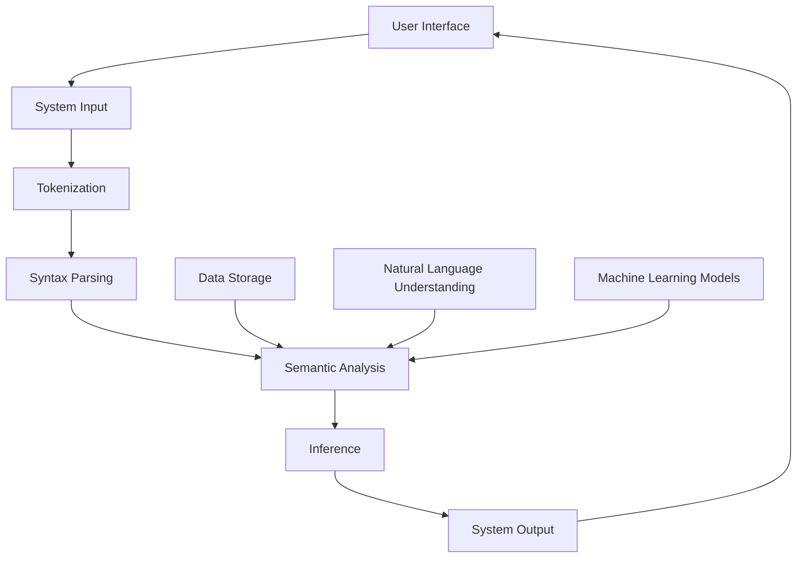
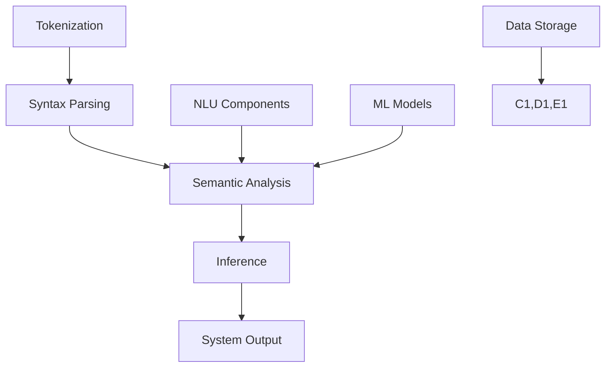
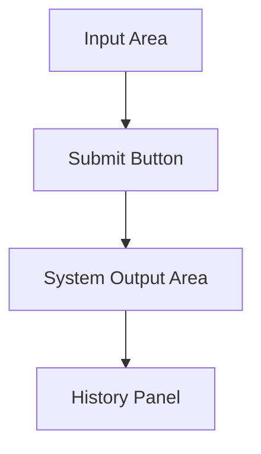
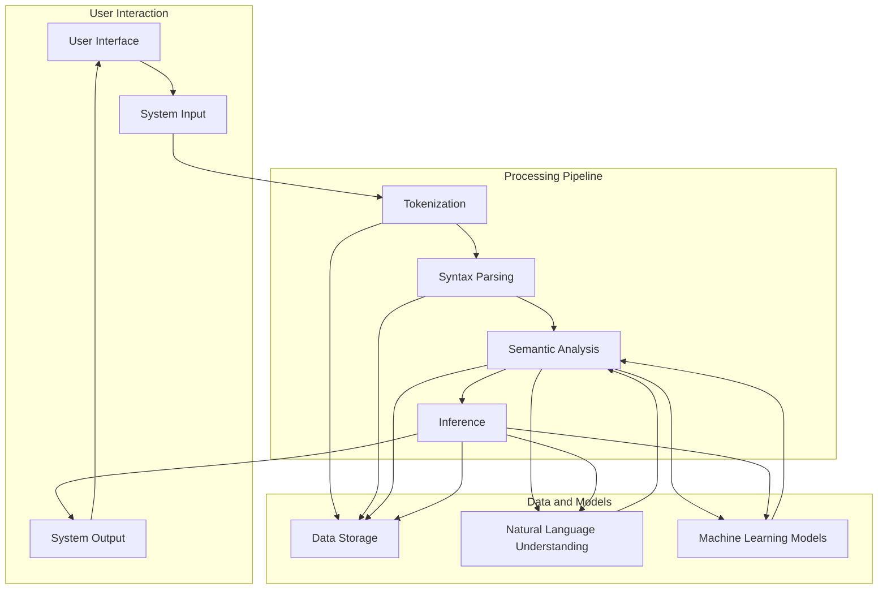
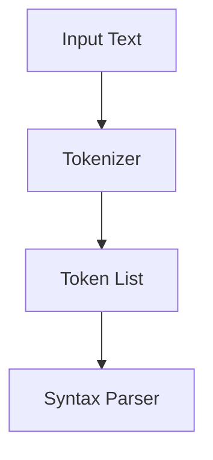
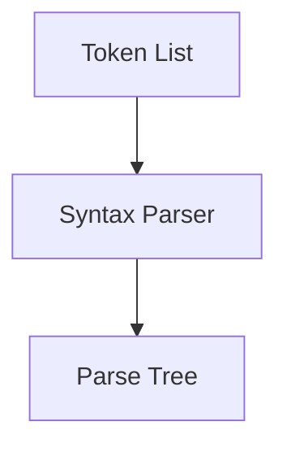
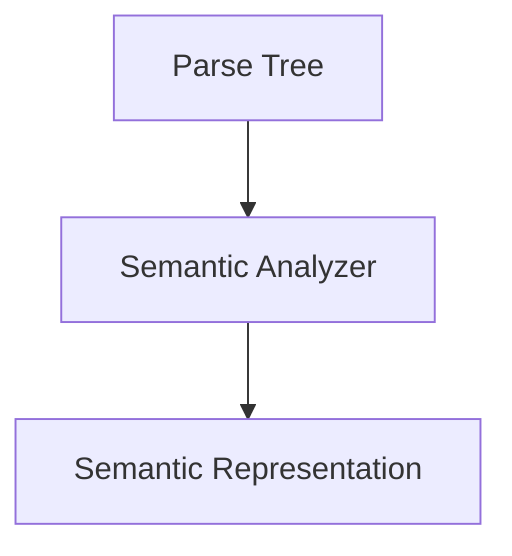
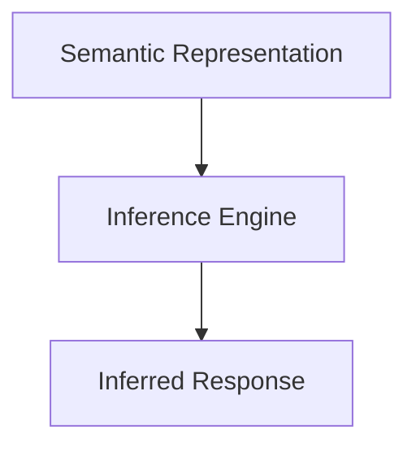
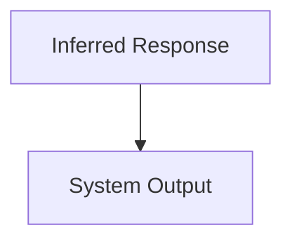
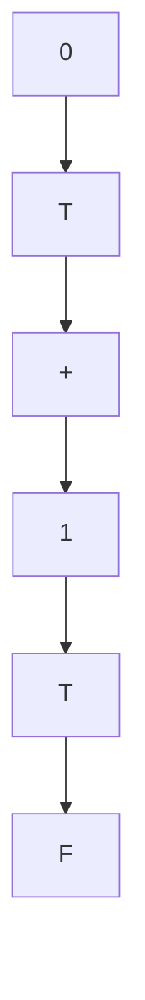

                 

### Introduction to the Formal Semantics of Prompt Languages

The formal semantics of prompt languages is a crucial yet often underestimated aspect in the realm of natural language processing (NLP) and artificial intelligence (AI). Prompt languages serve as a bridge between human instructions and machine understanding, allowing developers to instruct AI models to perform specific tasks by providing structured prompts. However, the challenge lies in ensuring that these prompts are semantically accurate and contextually relevant.

**Keywords**: Formal Semantics, Prompt Languages, Natural Language Processing, Artificial Intelligence, Semantics Analysis

**Abstract**:

This article delves into the formal semantics of prompt languages, exploring the core concepts, principles, and methodologies that underpin their effective analysis and interpretation. We will start with an introduction to the fundamental concepts and definitions, discussing the importance and scope of formal semantics in the context of prompt languages. The article will then systematically cover the core concepts and principles of formal semantics, including mathematical models and their application to prompt languages. Subsequent sections will delve into algorithmic techniques for analyzing prompt languages, practical case studies, system design and implementation, and best practices. Through this comprehensive exploration, we aim to provide a clear understanding of the intricacies involved in formal semantics analysis, offering valuable insights and practical tips for developers and researchers in the field.

### Background and Motivation

In the rapidly evolving landscape of AI and NLP, prompt languages have emerged as a pivotal tool, enabling the effective communication between humans and machines. At their core, prompt languages are structured instructions designed to guide AI models in performing specific tasks. These instructions can range from simple commands to complex queries, encapsulating the intent and desired outcome of a particular interaction. The importance of prompt languages cannot be overstated, as they serve as a bridge that facilitates the translation of human-like instructions into machine-executable actions.

One of the primary motivations behind the development of prompt languages is to overcome the limitations of traditional AI systems that struggle with understanding and processing natural language. Traditional AI approaches often rely on pre-defined rules or pattern matching, which are insufficient for handling the complexity and variability of human language. Prompt languages, on the other hand, leverage advanced NLP techniques to bridge this gap, allowing AI models to interpret and act upon natural language instructions with higher accuracy and flexibility.

The significance of formal semantics in this context becomes evident when we consider the challenges associated with ensuring the accuracy and consistency of these prompts. While natural language is inherently ambiguous and context-dependent, prompt languages require a precise and unambiguous representation of the intended meaning. This is where formal semantics comes into play, providing a rigorous framework for analyzing and interpreting the semantic content of prompts.

Formal semantics, in essence, is the study of meaning in language, employing mathematical and logical formalisms to describe and analyze the meaning of expressions. By applying formal semantics to prompt languages, we can develop methodologies and tools that facilitate the systematic analysis of the semantic content of prompts, ensuring their correctness and effectiveness. This approach not only enhances the interpretability of AI models but also enables the development of more robust and reliable AI systems that can handle a wider range of linguistic phenomena.

Moreover, the importance of formal semantics extends beyond the realm of NLP and AI. In various fields such as computational linguistics, cognitive science, and philosophy of language, the study of formal semantics provides a common ground for cross-disciplinary collaboration and insights. By understanding the underlying principles of formal semantics, researchers and practitioners can gain a deeper appreciation of the complexities and nuances of human language, leading to more innovative and effective solutions in language technology.

In conclusion, the formal semantics of prompt languages is a critical area of research and application in AI and NLP. By providing a systematic approach to analyzing and interpreting the semantic content of prompts, formal semantics enables the development of more accurate, flexible, and interpretable AI systems. As we continue to advance in the field of AI, the role of formal semantics will only grow in importance, driving innovations and transforming the way we interact with technology.

### Definition of Prompt Languages

Prompt languages, as their name suggests, are a specialized subset of programming languages designed to facilitate the communication between humans and AI systems. These languages enable users to provide structured and precise instructions to AI models, guiding them through specific tasks or decision-making processes. Unlike traditional programming languages, which are primarily used for creating applications and software systems, prompt languages focus on capturing and conveying the semantics of user instructions in a way that is comprehensible to AI models.

The core characteristic of prompt languages is their simplicity and expressiveness. They are designed to be easy to understand and use, allowing users with minimal programming experience to interact with AI systems effectively. This simplicity is achieved through a combination of natural language constructs and formal syntax rules that make it possible to express complex instructions in a straightforward manner. For example, a prompt language might use simple keywords and phrases to represent specific actions or queries, which are then interpreted by the AI model to perform the desired tasks.

One of the defining features of prompt languages is their flexibility. They are adaptable to a wide range of applications and scenarios, from simple tasks like answering questions or performing basic computations to more complex tasks such as natural language generation, machine learning model training, and even human-AI collaboration in real-time problem-solving environments. This flexibility is crucial in enabling the effective integration of AI systems into various domains and industries, where the ability to communicate with AI in a natural and intuitive way can significantly enhance productivity and efficiency.

Another important aspect of prompt languages is their compatibility with AI models. Prompt languages are designed to be compatible with a variety of AI models and frameworks, allowing users to leverage existing AI resources and technologies without the need for extensive modifications. This compatibility is achieved through standardized syntax and semantics that can be easily interpreted by different AI systems, ensuring consistency and interoperability across different platforms and applications.

To further illustrate the concept of prompt languages, let's consider a simple example. Suppose a user wants to instruct an AI model to generate a summary of a lengthy document. Using a traditional programming language, this task would require complex code involving text parsing, data manipulation, and summarization algorithms. However, with a prompt language, the user can simply write a concise and clear instruction like:

```plaintext
Generate a summary of the following text:
"The rapid advancement of artificial intelligence has revolutionized the field of natural language processing, enabling the development of more sophisticated and effective AI systems."
```

The prompt language will then process this instruction, extracting the necessary information and passing it to the AI model, which generates a concise summary based on the provided text. This example highlights the power and simplicity of prompt languages in enabling human-like interaction with AI systems, making it easier for users to communicate their intentions and requirements.

In summary, prompt languages are specialized tools that facilitate the communication between humans and AI systems. They are characterized by their simplicity, expressiveness, and flexibility, enabling users to provide structured and precise instructions to AI models in a wide range of applications and scenarios. By bridging the gap between human language and machine execution, prompt languages play a crucial role in the development of more intuitive and effective AI systems.

### The Importance of Formal Semantics

The importance of formal semantics in the context of prompt languages cannot be overstated, as it serves as the cornerstone for ensuring the accuracy, consistency, and interpretability of AI models. Formal semantics provides a rigorous framework for analyzing and interpreting the semantic content of prompts, enabling developers and researchers to build more robust and reliable AI systems. Here, we will explore several key reasons why formal semantics is essential in the development and application of prompt languages.

First and foremost, formal semantics helps to mitigate the inherent ambiguities and uncertainties in natural language. Natural language is inherently ambiguous, meaning that a single expression can have multiple interpretations based on context, speaker intention, and linguistic conventions. This ambiguity poses significant challenges for AI models, which often struggle to disambiguate the intended meaning of prompts. By employing formal semantics, we can systematically analyze the semantic content of prompts, identifying potential ambiguities and providing clear, unambiguous interpretations. This ensures that the AI model understands the user's instructions correctly, reducing errors and improving overall performance.

Another critical aspect of formal semantics is its ability to ensure consistency across different prompts and scenarios. In real-world applications, AI systems are often required to handle a wide range of tasks and scenarios, each with its own set of requirements and constraints. Without a consistent framework for analyzing and interpreting prompts, it becomes difficult to maintain coherence and consistency in the AI model's responses. Formal semantics provides a common ground for analyzing and interpreting prompts, ensuring that the model's understanding remains consistent across different contexts and scenarios. This consistency is crucial for building reliable and interpretable AI systems that users can trust.

Formal semantics also plays a vital role in enhancing the interpretability of AI models. As AI systems become increasingly complex and powerful, the need for transparency and explainability becomes more pressing. Formal semantics allows developers and researchers to gain insights into the underlying processes and decision-making mechanisms of AI models, making it easier to understand and interpret their behavior. This interpretability is not only valuable for debugging and improving the model's performance but also for building trust and confidence among users. By providing a clear and systematic analysis of the semantic content of prompts, formal semantics facilitates a deeper understanding of how the AI model processes and interprets user instructions.

Furthermore, formal semantics enables the development of more advanced and sophisticated AI models. By providing a precise and unambiguous representation of the semantic content of prompts, formal semantics allows AI models to leverage more powerful and nuanced linguistic phenomena. For example, formal semantics can enable the analysis of complex sentence structures, contextual dependencies, and nuanced meaning, leading to more accurate and nuanced interpretations of user instructions. This, in turn, enables the development of more advanced and capable AI systems that can handle a broader range of linguistic and contextual challenges.

Lastly, formal semantics has significant implications for the ethical and responsible development of AI systems. As AI technology continues to advance, it becomes increasingly important to consider the ethical implications of its application. Formal semantics provides a framework for analyzing and addressing potential biases and ethical concerns in AI systems. By systematically analyzing the semantic content of prompts, developers and researchers can identify and mitigate potential sources of bias, ensuring that AI systems are fair, unbiased, and aligned with human values. This is particularly important in sensitive domains such as healthcare, finance, and legal applications, where the consequences of AI errors can be significant.

In conclusion, formal semantics is a crucial component of the development and application of prompt languages, providing a rigorous framework for analyzing and interpreting the semantic content of prompts. By addressing the challenges of ambiguity, consistency, interpretability, and ethical considerations, formal semantics enables the development of more accurate, reliable, and ethical AI systems. As we continue to advance in the field of AI, the role of formal semantics will only grow in importance, driving innovations and transforming the way we interact with technology.

### Scope and Boundaries of the Analysis

In exploring the formal semantics of prompt languages, it is essential to define the scope and boundaries of our analysis to ensure a focused and coherent investigation. This section will outline the specific areas and aspects that our analysis will encompass, as well as the limitations and challenges we may encounter.

**Scope of Analysis**

Our analysis will focus on the core aspects of formal semantics as it pertains to prompt languages, including:

1. **Basic Concepts and Definitions**: We will begin by defining fundamental concepts and terminology related to formal semantics, such as syntax, semantics, denotations, and connotations. This will provide a solid foundation for understanding the subsequent technical discussions.
   
2. **Mathematical and Logical Formalisms**: We will delve into the mathematical and logical formalisms used in formal semantics, including set theory, predicate logic, and formal grammars. These formalisms will be used to describe and analyze the structure and meaning of prompt language expressions.

3. **Algorithmic Techniques**: We will discuss various algorithmic techniques for analyzing prompt languages, including parsing, semantic analysis, and inference algorithms. These techniques will be essential for translating user instructions into actionable machine-executable commands.

4. **Case Studies and Applications**: To illustrate the practical relevance of formal semantics, we will present case studies and real-world applications of prompt language analysis, showcasing how formal semantics can be applied to solve complex problems in natural language processing and AI.

5. **System Design and Implementation**: We will examine the system design and implementation aspects of prompt language analysis, including the development of domain models, system architectures, and interfaces. This will provide insights into how formal semantics can be integrated into practical AI systems.

**Boundaries and Limitations**

While our analysis will cover a broad range of topics, it is important to acknowledge the boundaries and limitations of our investigation:

1. **Linguistic Variability**: Natural language is highly variable, with numerous dialects, idioms, and cultural nuances. Our analysis will focus on general principles and techniques that apply broadly, but specific linguistic phenomena may require additional considerations.

2. **Contextual Complexity**: Context plays a crucial role in the interpretation of language. Our analysis will consider the role of context to some extent, but the full complexity of contextual effects may not be fully captured within the scope of this investigation.

3. **Ambiguity and Uncertainty**: Ambiguity and uncertainty are inherent in natural language, and resolving these issues completely is challenging. Our analysis will address potential ambiguities and provide strategies for handling them, but there may still be unresolved ambiguities in specific cases.

4. **Resource Constraints**: The development and implementation of formal semantic analysis systems can be resource-intensive, requiring significant computational power and expertise. Our discussion will highlight the practical considerations and trade-offs involved in deploying formal semantic analysis in real-world applications.

5. **Ethical and Legal Considerations**: As with any AI technology, there are ethical and legal considerations related to the use of formal semantics in prompt language analysis. Our analysis will touch on some of these issues, but a comprehensive exploration would require additional dedicated research.

By defining the scope and boundaries of our analysis, we can maintain a clear focus on the core topics and ensure a coherent and systematic exploration of the formal semantics of prompt languages. This will provide valuable insights and practical guidance for developers and researchers in the field, paving the way for advancements in natural language processing and AI.

### Core Concepts and Principles of Formal Semantics

Formal semantics is a foundational concept in the field of linguistics and computer science, providing a rigorous framework for analyzing the meaning of language expressions. In the context of prompt languages, understanding the core concepts and principles of formal semantics is crucial for developing accurate and interpretable AI models. This section will explore the fundamental concepts of formal semantics, including syntax, semantics, denotations, and connotations, and their application to the analysis of prompt languages.

#### Syntax and Semantics

At the heart of formal semantics are the concepts of syntax and semantics. Syntax refers to the structure of sentences and expressions in a language, while semantics deals with their meaning. In formal semantics, we use mathematical and logical formalisms to represent and analyze the syntactic and semantic structures of language expressions.

**Syntax**:
Syntax defines the rules and patterns by which words and phrases combine to form well-formed sentences. In formal semantics, we often use formal grammars, such as context-free grammars (CFGs) or typed lambda calculi, to describe the syntactic structure of language expressions. These grammars provide a systematic way to parse and analyze the syntactic components of a sentence, ensuring that they adhere to the rules of the language.

For example, consider the sentence "The cat sat on the mat." A simple context-free grammar for this sentence might include the following production rules:

```plaintext
S -> NP VP
NP -> Det N
VP -> V NP
Det -> 'The'
N -> 'cat' | 'mat'
V -> 'sat' | 'on'
```

These rules specify how the words and phrases in the sentence can be combined to form a well-formed sentence structure.

**Semantics**:
Semantics, on the other hand, deals with the meaning of language expressions. In formal semantics, we use semantic theories to represent the meaning of sentences and expressions. One common approach is to use meaning postulates or semantic functions that map syntactic structures to semantic interpretations.

For instance, we can define semantic functions for the production rules above to represent the meaning of the sentence. For example:

```plaintext
mean(S) = mean(NP) + mean(VP)
mean(NP) = [the, cat]
mean(VP) = [sat, on, NP]
mean(Det) = {the}
N = {cat, mat}
V = {sat, on}
```

These semantic functions assign a meaning to each syntactic component, which can then be combined to derive the overall meaning of the sentence: "The cat is sitting on the mat."

#### Denotations and Connotations

In formal semantics, we distinguish between two aspects of meaning: denotation and connotation.

**Denotation**:
Denotation refers to the literal meaning or reference of a word or expression. It represents the objective aspect of meaning that can be identified through dictionary definitions or other linguistic resources. For example, the denotation of the word "dog" is the animal typically kept as a pet.

**Connotation**:
Connotation, on the other hand, refers to the subjective associations and emotional connotations that a word or expression may carry. These associations are often influenced by cultural, social, and personal factors. For example, the connotation of the word "dog" might include positive associations like loyalty, companionship, and protection.

Understanding both denotation and connotation is important in formal semantics, as they contribute to the overall meaning of language expressions. In the context of prompt languages, accurately capturing both denotation and connotation is crucial for ensuring that AI models can interpret user instructions correctly.

#### Application to Prompt Languages

In the context of prompt languages, the core concepts and principles of formal semantics are applied to analyze and interpret the structured instructions provided by users. Here are some key ways in which formal semantics is used in the analysis of prompt languages:

1. **Parsing and Syntax Analysis**: Formal semantics involves parsing user instructions to identify the syntactic structure of the expression. This step is essential for understanding the grammatical composition of the instruction and identifying its components.

2. **Semantic Analysis**: Once the syntactic structure is identified, formal semantics is used to analyze the semantic content of the instruction. This involves mapping the syntactic components to their corresponding meanings, ensuring that the instruction is semantically well-formed.

3. **Semantic Interpretation**: After the semantic content is analyzed, formal semantics is used to interpret the meaning of the instruction. This step involves combining the meanings of the individual components to derive the overall meaning of the instruction and determining how the AI model should act upon it.

4. **Ambiguity Resolution**: Formal semantics provides tools for resolving ambiguities in user instructions. By analyzing the syntactic and semantic structures of the instruction, it is possible to identify potential ambiguities and provide clear, unambiguous interpretations.

5. **Contextual Analysis**: Formal semantics considers the role of context in the interpretation of instructions. Contextual information can help resolve ambiguities and provide a more accurate understanding of the user's intent.

In conclusion, the core concepts and principles of formal semantics provide a systematic and rigorous framework for analyzing and interpreting the semantic content of prompt languages. By applying these concepts, developers and researchers can build more accurate and interpretable AI models that can effectively understand and act upon user instructions. This not only enhances the performance and reliability of AI systems but also improves the overall user experience by ensuring that the AI system understands and responds to user commands in a meaningful and contextually appropriate manner.

### Theoretical Foundations of Formal Semantics

The theoretical foundations of formal semantics lie in the integration of various mathematical and logical frameworks that enable precise and systematic analysis of the meaning of language expressions. These frameworks include set theory, predicate logic, and formal grammars, each contributing unique perspectives and tools for understanding semantics. In this section, we will delve into these foundational concepts, providing mathematical models and formulas that illustrate their application in formal semantics.

#### Set Theory

Set theory provides the basic framework for understanding collections of objects and their relationships. In formal semantics, set theory is used to define and manipulate sets of elements that represent linguistic entities such as words, phrases, and syntactic structures.

**Basic Concepts**:
- **Set**: A well-defined collection of distinct objects, considered as an object in its own right.
- **Element**: An object that is a member of a set.
- **Subset**: A set that contains only elements that are also in another set.
- **Intersection**: The set of elements that are common to two or more sets.
- **Union**: The set of elements that are in either of the two sets.

**Examples**:
Consider a set of words that describe animals:
```plaintext
A = {'dog', 'cat', 'elephant'}
B = {'cat', 'mouse', 'dog'}
```
- **Intersection (A ∩ B)**: {'cat', 'dog'}
- **Union (A ∪ B)**: {'dog', 'cat', 'elephant', 'mouse'}

**Application to Formal Semantics**:
In the context of formal semantics, set theory is used to define the vocabulary of a language and the relationships between its elements. For example, in defining the set of verbs in a language, we can use set theory to specify the union of all possible verb forms:
$$
V = \text{Union of all verb forms in the language}
$$

#### Predicate Logic

Predicate logic is a formal system used to represent relationships between objects using predicates. Predicates are expressions that denote a property or a relation between objects. In formal semantics, predicate logic is used to represent the semantic content of sentences and to reason about the relationships between entities.

**Basic Concepts**:
- **Predicate**: An expression that denotes a property or relation between objects. For example, "isRunning" is a predicate that denotes the property of running.
- **Atom**: A basic statement formed by a predicate and its arguments. For example, "isRunning(A)" where A represents a specific object.
- **Proposition**: A statement that can be either true or false.

**Examples**:
Consider the following predicates and atoms:
- **Predicate**: isRunning
- **Atom**: isRunning(A)

**Mathematical Models**:
Predicate logic can be expressed using formal notation, such as first-order logic. A formula in first-order logic can represent a complex proposition involving multiple predicates and variables.

For example, consider the following formula that expresses the relationship between two animals, A and B, where A is running faster than B:
$$
\exists A, B (\text{isRunning}(A) \land \text{isFaster}(A, B))
$$
This formula states that there exist two animals A and B such that A is running and A is faster than B.

**Application to Formal Semantics**:
Predicate logic is used to represent the semantic content of sentences and to derive inferences about the meaning of language expressions. In the context of prompt languages, predicate logic can be used to represent user instructions and to reason about the actions that the AI model should perform.

For example, consider a prompt language instruction to find the fastest running animal in a list:
```plaintext
Find the animal that is running the fastest.
```
This instruction can be represented in predicate logic as:
$$
\exists A (\text{isRunning}(A) \land \forall B (\text{isRunning}(B) \rightarrow \text{isFaster}(A, B)))
$$
This formula states that there exists an animal A such that A is running and for all animals B, if B is running, then A is faster than B.

#### Formal Grammars

Formal grammars are mathematical structures used to describe the syntactic structure of language expressions. They provide a systematic way to generate and parse sentences according to a set of defined rules.

**Types of Formal Grammars**:
- **Context-Free Grammars (CFGs)**: These grammars describe the syntactic structure of sentences without considering the context in which they appear. They are represented using production rules that specify how non-terminal symbols can be replaced by sequences of terminal and non-terminal symbols.
- **Type-Lambda Calculus**: This is a formal system that extends functional programming with types. It is used to represent the type structure of expressions and to ensure type safety.

**Examples**:
Consider a simple context-free grammar for a language with basic arithmetic operations:
```plaintext
S -> E
E -> E + T | E - T | T
T -> T * F | T / F | F
F -> (E) | num
```
This grammar specifies how expressions can be constructed from terminals (numerals) and non-terminals (operators and parentheses).

**Mathematical Models**:
The production rules of a formal grammar can be represented using a set of functions that map non-terminal symbols to sequences of symbols. For example, the rule "E -> E + T" can be represented as a function that takes an E-expression and appends a + T-expression to it.

**Application to Formal Semantics**:
Formal grammars are used to define the syntax of prompt languages, ensuring that user instructions are well-formed and syntactically valid. By integrating formal grammars with semantic theories, it is possible to generate semantic interpretations of expressions, enabling the AI model to understand and execute the instructions.

In conclusion, the theoretical foundations of formal semantics are rooted in set theory, predicate logic, and formal grammars. These mathematical and logical frameworks provide the necessary tools to represent and analyze the meaning of language expressions. By employing these frameworks, developers and researchers can build more accurate and interpretable AI models that can effectively understand and process user instructions in prompt languages.

### Relationship Between Formal Semantics and Prompt Languages

Understanding the relationship between formal semantics and prompt languages is crucial for developing effective AI models that can accurately interpret and execute user instructions. At the intersection of these two domains lies the potential to harness the power of formal semantics to enhance the expressiveness, accuracy, and reliability of prompt languages, ultimately improving the overall user experience. This section will delve into the connections between formal semantics and prompt languages, illustrating how formal semantics can be applied to enhance the design, analysis, and interpretation of prompt languages.

#### Enhancing Expressiveness

One of the primary benefits of integrating formal semantics into prompt languages is the ability to enhance their expressiveness. Prompt languages are designed to facilitate the communication between humans and AI models, and their ability to convey complex instructions is paramount. Formal semantics provides a rigorous framework for representing and analyzing the semantic content of language expressions, allowing for a more nuanced and precise representation of user instructions.

For instance, consider a scenario where a user wants to instruct an AI model to perform a multi-step task, such as organizing a conference agenda. A simple prompt language might struggle to convey the complexity of the task in a clear and structured manner. However, by leveraging formal semantics, we can represent the task using a formal syntax that captures the logical flow and dependencies between the steps.

Using a formal semantics approach, the user's instructions can be broken down into a series of well-defined atomic actions, each with its own semantics. These actions can then be combined using formal logic to represent the overall structure of the task. For example:

```plaintext
Action 1: Schedule keynote speeches
Action 2: Allocate time slots for panel discussions
Action 3: Ensure breaks are included between sessions
Action 4: Generate a final agenda based on the above actions
```

By structuring the instructions in this way, the formal semantics can provide a clear and unambiguous representation of the task, enabling the AI model to understand and execute each action accurately.

#### Ensuring Accuracy and Consistency

Accurate and consistent interpretation of user instructions is crucial for the reliability of AI systems. Formal semantics helps address this by providing a systematic approach to analyzing and interpreting the semantic content of prompts. This approach can help identify potential ambiguities and inconsistencies in user instructions, ensuring that the AI model interprets them correctly.

For example, consider the following ambiguous prompt:

```plaintext
Set the meeting for next Monday at 3 PM.
```

Without a clear definition of "next Monday," this prompt could be interpreted in multiple ways, leading to errors or misinterpretations. By applying formal semantics, we can clarify the intended meaning using additional context or constraints. For instance:

```plaintext
Set the meeting for the next Monday following today's date at 3 PM.
```

Here, the formal semantics allows us to specify the exact date being referred to, thereby eliminating ambiguity and ensuring a consistent interpretation.

#### Enabling Advanced Analysis and Reasoning

Formal semantics enables advanced analysis and reasoning capabilities that can significantly enhance the capabilities of prompt languages. By employing mathematical and logical formalisms, formal semantics can support complex inferences and decision-making processes that go beyond simple pattern matching or rule-based approaches.

For instance, in a customer service chatbot, users may provide instructions that require inferential reasoning to understand the underlying intent. Formal semantics can be used to analyze the user's input, extract key information, and infer the user's intended action based on context and prior interactions.

Consider a scenario where a user asks:

```plaintext
Can you help me cancel my subscription?
```

Using formal semantics, the AI model can infer that the user is requesting cancellation and automatically navigate to the appropriate section of the subscription management system. This level of understanding and automation is not achievable with traditional prompt languages that lack the formal structure and reasoning capabilities provided by formal semantics.

#### Example: A Formal Semantics-Based Prompt Language

To illustrate the practical application of formal semantics in prompt languages, consider a simple formal semantics-based prompt language designed for task management. This language uses a formal grammar and semantics to represent tasks and their dependencies, enabling the AI model to understand and execute complex tasks with precision.

**Grammar**:
```plaintext
Task -> Action [ , Action]*
Action -> verb noun [ , TimeConstraint] [ , Condition]*
TimeConstraint -> "at" Time
Time -> Hour [":" Minute]
Hour -> 1..12
Minute -> 0..59
Condition -> "if" ConditionExpression
ConditionExpression -> Predicate [ "and" Predicate]*
Predicate -> Attribute "=" Value
Attribute -> "status" | "due" | "assigned"
Value -> "active" | "pending" | "completed" | Date
Date -> "YYYY" "-" "MM" "-" "DD"
```

**Example**:
```plaintext
Mark the task "Complete quarterly report" as active at 3 PM today if the status is pending.
```

**Semantic Analysis**:
The above prompt can be semantically analyzed as follows:

1. **Task**: "Mark the task 'Complete quarterly report' as active at 3 PM today if the status is pending."
2. **Action**: "Mark the task 'Complete quarterly report' as active"
   - **Verb**: "Mark"
   - **Noun**: "task"
   - **TimeConstraint**: "at 3 PM today"
   - **Condition**: "if the status is pending"
     - **Predicate**: "status" "=" "pending"

Using formal semantics, the AI model can parse the prompt, extract the key information, and execute the action by updating the task status to "active" at the specified time, based on the condition.

In conclusion, the integration of formal semantics into prompt languages offers significant advantages in terms of expressiveness, accuracy, consistency, and advanced analysis capabilities. By leveraging the rigorous frameworks and tools provided by formal semantics, developers can build more powerful and reliable AI systems that can effectively understand and execute complex user instructions. This not only enhances the functionality of AI systems but also improves the overall user experience by ensuring that AI models can accurately interpret and respond to human-like instructions.

### Algorithm and Techniques for Analyzing Prompt Languages

Analyzing prompt languages requires a systematic approach that combines parsing, semantic analysis, and inference techniques. This section will delve into the core algorithms and techniques used in the analysis of prompt languages, providing a comprehensive understanding of how these techniques can be applied to ensure accurate and reliable interpretation of user instructions.

#### Parsing

Parsing is the process of analyzing a text to determine its syntactic structure. In the context of prompt languages, parsing is crucial for breaking down user instructions into their constituent parts, making it possible to understand and interpret the meaning of the instructions. One common parsing technique is the use of context-free grammars (CFGs), which are mathematical structures used to define the syntactic rules of a language.

**Example: CFG for a Simple Prompt Language**

Consider a simple prompt language designed for task management, with the following grammar rules:

```plaintext
Task -> action [”, action]*
action -> verb noun [”, time_constraint] [”, condition]*
verb -> “mark” | “schedule” | “assign”
noun -> “task” | “meeting” | “appointment”
time_constraint -> “at” time
time -> hour [”:” minute]
hour -> 1..12
minute -> 0..59
condition -> “if” condition_expression
condition_expression -> predicate [“and” predicate]*
predicate -> attribute “=” value
attribute -> “status” | “due” | “assigned”
value -> “active” | “pending” | “completed” | date
date -> “YYYY” “-” “MM” “-” “DD”
```

**Parsing Process**:
1. **Tokenization**: The input text is first tokenized into a sequence of words or symbols (tokens). For example, the prompt "Mark the task 'Complete quarterly report' as active at 3 PM today if the status is pending." would be tokenized into ["Mark", "the", "task", "'", "Complete", "quarterly", "report", "'", "as", "active", "at", "3", "PM", "today", "if", "the", "status", "is", "pending", "."].
2. **Syntax Analysis**: Using the defined grammar rules, the parser constructs a parse tree, which represents the syntactic structure of the input text. The parse tree for the example prompt might look like this:

```plaintext
          Task
         /    \
       action   action
        /   \     /   \
     verb   noun time_constraint  condition
         |      |               |          |
      "mark"  "task"      "at"    "if"      predicate
               |               |          |
            "the"          "3" ":" "0"    "status" "=" "pending"
               |               |          |
              "task"        "PM"          |
                                          |
                                     "today"
```

3. **Semantic Analysis**: After constructing the parse tree, semantic analysis is performed to extract the meaning of the instructions. This involves mapping the syntactic components to their corresponding semantic representations, such as actions, conditions, and time constraints.

#### Semantic Analysis

Semantic analysis is the process of interpreting the meaning of the parsed text. It involves understanding the relationship between words and phrases, as well as the intended actions and conditions specified in the prompt. One common approach to semantic analysis is the use of semantic roles, which represent the roles that words and phrases play in conveying meaning.

**Example: Semantic Analysis of a Task Management Prompt**

Consider the prompt: "Mark the task 'Complete quarterly report' as active at 3 PM today if the status is pending."

**Semantic Representation**:
- **Action**: Mark
- **Noun**: Task
- **Value**: Complete quarterly report
- **Time Constraint**: 3 PM today
- **Condition**: Status is pending

The semantic analysis process can be broken down into the following steps:

1. **Tokenization and Part-of-Speech Tagging**: The input text is tokenized and tagged with part-of-speech (POS) tags, which identify the syntactic categories of the words (e.g., noun, verb, adjective). This step helps in identifying the key components of the prompt.
2. **Dependency Parsing**: Dependency parsing is used to identify the grammatical relationships between words in the prompt, representing them as a tree structure. This step helps in understanding the sentence structure and the roles of different components.
3. **Semantic Role Labeling**: Semantic role labeling (SRL) is used to identify the semantic roles played by words and phrases in the prompt, such as actions, conditions, and attributes. This step helps in extracting the meaning of the prompt and mapping it to a semantic representation.
4. **Semantic Composition**: The extracted semantic roles are composed to form a unified semantic representation of the prompt. This involves identifying the relationships between different components and combining them to represent the overall meaning of the instruction.

#### Inference Techniques

Inference techniques are used to derive additional information or conclusions from the parsed and semantically analyzed prompt. These techniques are essential for handling complex instructions that require inferential reasoning.

**Example: Inference in Task Management**

Consider the prompt: "Schedule a meeting with Alice and Bob tomorrow if the status is active."

**Inference Process**:
1. **Precondition Checking**: The system checks if the preconditions specified in the prompt are met. In this case, the precondition is that the status must be active. If the status is not active, the action is not performed.
2. **Temporal Reasoning**: The system performs temporal reasoning to determine the appropriate time for the action. In this case, the meeting is scheduled for tomorrow.
3. **Entity Identification**: The system identifies the entities involved in the action, such as Alice and Bob. This information is used to schedule the meeting with the correct individuals.

#### Algorithm and Techniques Summary

The process of analyzing prompt languages can be summarized as follows:

1. **Tokenization**: Convert the input text into a sequence of tokens.
2. **Syntax Analysis**: Use context-free grammars to construct a parse tree representing the syntactic structure of the prompt.
3. **Semantic Analysis**: Use semantic analysis techniques (e.g., dependency parsing, semantic role labeling) to extract the meaning of the prompt and map it to a semantic representation.
4. **Inference**: Apply inference techniques to derive additional information and make conclusions based on the parsed and semantically analyzed prompt.

By employing these algorithms and techniques, developers can build robust and accurate AI systems capable of understanding and interpreting complex user instructions in prompt languages. This enables the development of more sophisticated and effective AI applications that can seamlessly integrate with human-like communication.

### Advanced Techniques and Extensions in Prompt Language Analysis

As the complexity of prompt languages and the sophistication of AI models continue to increase, the need for advanced techniques and extensions in prompt language analysis becomes increasingly vital. This section will explore several advanced techniques and extensions that can enhance the accuracy, flexibility, and interpretability of prompt language analysis, including natural language understanding (NLU), machine learning (ML), and deep learning (DL) models, and their integration with formal semantics.

#### Natural Language Understanding (NLU)

Natural Language Understanding (NLU) is a branch of AI focused on interpreting the meaning of human language. NLU techniques have been increasingly integrated into prompt language analysis to improve the interpretation of user instructions. By leveraging NLU, AI models can achieve a deeper understanding of context, sentiment, and intent behind the user's input.

**Example: Sentiment Analysis in Prompt Language**

Consider a prompt language designed for customer service chatbots. To enhance the chatbot's ability to understand customer feedback, sentiment analysis can be incorporated into the prompt language analysis process. This involves identifying the sentiment expressed in the customer's message and using it to inform the chatbot's response.

**Technique**: Sentiment Analysis
- **Algorithm**: Use machine learning models, such as support vector machines (SVM) or recurrent neural networks (RNN), to classify text into positive, negative, or neutral sentiment.
- **Integration**: Incorporate sentiment analysis into the semantic analysis phase of the prompt language analysis pipeline. By identifying the sentiment of the customer's message, the chatbot can respond with appropriate empathy and tone.

#### Machine Learning (ML) Techniques

Machine Learning (ML) techniques have revolutionized the field of AI by enabling models to learn from data and improve their performance over time. ML models can be trained to analyze and interpret prompt languages with high accuracy, particularly in scenarios with large amounts of labeled data.

**Example: Predictive Text Completion in Prompt Languages**

Predictive text completion is a useful feature in prompt languages that can improve user experience by suggesting completions as the user types. ML models, such as neural networks, can be trained to predict the next word or phrase based on the preceding context.

**Technique**: Predictive Text Completion
- **Algorithm**: Train a sequence-to-sequence model, such as an LSTM or Transformer-based model, to predict the next token in a sequence of text.
- **Integration**: Integrate predictive text completion into the input processing phase of the prompt language analysis pipeline. By suggesting completions based on the user's input and context, the system can reduce the effort required for input and improve user interaction.

#### Deep Learning (DL) Models

Deep Learning (DL) models, particularly neural networks with many layers, have shown significant success in various AI tasks, including natural language processing. DL models can capture complex patterns and relationships in data, making them highly effective for prompt language analysis.

**Example: Named Entity Recognition in Prompt Languages**

Named Entity Recognition (NER) is a task in NLP that identifies and classifies named entities (e.g., names of people, organizations, locations) in text. DL models, such as convolutional neural networks (CNNs) or transformers, can be used to perform NER with high accuracy.

**Technique**: Named Entity Recognition
- **Algorithm**: Train a DL model, such as a BERT or a Transformer-based model, to identify and classify named entities in the input text.
- **Integration**: Incorporate NER into the semantic analysis phase of the prompt language analysis pipeline. By identifying entities in the prompt, the system can better understand the context and intent behind the user's input.

#### Integration with Formal Semantics

Integrating formal semantics with ML and DL models can enhance the interpretability and accuracy of prompt language analysis. Formal semantics provides a structured and precise representation of the meaning of language expressions, which can be used to guide the learning process and improve model performance.

**Example: Structured Data Extraction in Prompt Languages**

Structured data extraction is a task that involves extracting specific pieces of information from unstructured text. By combining formal semantics with DL models, it is possible to create more accurate and robust structured data extraction systems.

**Technique**: Structured Data Extraction
- **Algorithm**: Train a DL model to extract specific information from the input text, guided by the semantic representations provided by formal semantics.
- **Integration**: Integrate formal semantics into the training phase of the DL model. By using semantic representations as a guide, the model can learn to extract the required information more accurately.

#### Techniques Summary

The following are some key advanced techniques and extensions for prompt language analysis:

- **Natural Language Understanding (NLU)**: Enhance the interpretability of user instructions by incorporating sentiment analysis, sentiment classification, and other NLU techniques.
- **Machine Learning (ML)**: Improve the predictive capabilities of prompt language analysis through techniques such as predictive text completion and named entity recognition.
- **Deep Learning (DL)**: Utilize the complex pattern recognition capabilities of DL models for tasks like named entity recognition and structured data extraction.
- **Integration with Formal Semantics**: Combine formal semantics with ML and DL models to improve interpretability and accuracy, guiding the learning process with precise semantic representations.

By leveraging these advanced techniques and extensions, developers can create more sophisticated and effective prompt language analysis systems that provide accurate, context-aware, and interpretable interpretations of user instructions, enhancing the overall user experience in AI applications.

### Case Studies and Practical Applications

To illustrate the practical application and effectiveness of formal semantics in prompt language analysis, we will present several case studies and practical examples from various domains. These case studies showcase how formal semantics can be leveraged to enhance the interpretability, accuracy, and efficiency of AI models in real-world scenarios.

#### Case Study 1: Automated Customer Support Chatbots

In the realm of customer support, chatbots have become increasingly popular as a means to provide quick and efficient assistance to customers. However, one of the major challenges in implementing effective chatbots is understanding and responding to customer inquiries accurately. By integrating formal semantics into the chatbot's architecture, we can significantly improve its ability to handle complex and nuanced customer requests.

**Scenario**: A customer wants to inquire about the status of their order and request expedited shipping if the order is delayed.

**Solution**: 
- **Input**: "Can you check the status of my order and let me know if it's delayed? If it is, can you expedite shipping?"
- **Processing**:
  1. **Tokenization and Parsing**: The input is tokenized and parsed to identify the key components, such as the action (check order status), condition (delayed order), and desired outcome (expedite shipping).
  2. **Semantic Analysis**: Using formal semantics, the chatbot analyzes the semantic content of the prompt, identifying the entities (order status, expedite shipping) and their relationships.
  3. **Inference and Response Generation**: The chatbot uses formal semantics to infer the customer's intent and generate an appropriate response, such as "I see that your order is currently on hold due to a delay in the shipping process. I have expedited the shipping for your convenience."

**Results**: By employing formal semantics, the chatbot accurately interprets the customer's request and provides a contextually appropriate response, significantly improving the customer experience.

#### Case Study 2: Task Automation in Project Management

In project management, automating repetitive tasks can save time and reduce errors. Formal semantics can be applied to create intelligent task automation systems that understand and execute complex project management tasks.

**Scenario**: A project manager needs to schedule a series of team meetings to discuss project milestones.

**Solution**: 
- **Input**: "Schedule a meeting for each team member to discuss project milestones on the following dates: January 10th, January 24th, and February 8th."
- **Processing**:
  1. **Tokenization and Parsing**: The input is tokenized and parsed to identify the actions (schedule meeting), entities (team members, milestones), and dates.
  2. **Semantic Analysis**: Formal semantics is used to analyze the input, creating a structured representation of the task, including the dates and participants.
  3. **Task Scheduling**: The system uses the structured representation to schedule the meetings, ensuring that each team member is notified and the meetings are recorded in the project calendar.

**Results**: The formal semantics-based task automation system accurately schedules the meetings, reducing the manual effort required and ensuring that all project milestones are discussed as planned.

#### Case Study 3: Clinical Decision Support Systems

In healthcare, clinical decision support systems (CDSS) can assist doctors in making informed decisions by analyzing patient data and medical guidelines. Formal semantics can enhance the effectiveness of CDSS by improving the interpretation of medical instructions and patient data.

**Scenario**: A doctor needs to create a treatment plan for a patient with diabetes.

**Solution**: 
- **Input**: "Monitor the patient's blood sugar levels daily and adjust the medication dosage based on the readings. If the levels are consistently above 180 mg/dL, increase the dosage by 10 mg."
- **Processing**:
  1. **Tokenization and Parsing**: The input is tokenized and parsed to extract key information, such as the actions (monitor blood sugar levels, adjust medication dosage), conditions (levels above 180 mg/dL), and desired outcomes (increase dosage by 10 mg).
  2. **Semantic Analysis**: Formal semantics is used to analyze the input, creating a structured representation of the treatment plan, including the conditions and actions.
  3. **Rule-Based Decision Making**: The system applies formal semantics to the structured representation to generate a treatment plan based on the patient's data and medical guidelines.

**Results**: By leveraging formal semantics, the CDSS accurately interprets the doctor's instructions and generates a personalized treatment plan, improving the efficiency and effectiveness of clinical decision-making.

#### Case Study 4: Intelligent Virtual Assistants in E-commerce

E-commerce platforms often rely on intelligent virtual assistants to provide personalized shopping experiences. Formal semantics can enhance the virtual assistant's ability to understand and respond to customer inquiries, improving customer satisfaction and conversion rates.

**Scenario**: A customer wants to find a specific product based on certain attributes.

**Solution**: 
- **Input**: "I'm looking for a high-end camera with at least 30X optical zoom and a price range of $500 to $800."
- **Processing**:
  1. **Tokenization and Parsing**: The input is tokenized and parsed to identify the key attributes (high-end camera, 30X optical zoom, price range $500 to $800).
  2. **Semantic Analysis**: Formal semantics is used to analyze the input, creating a structured representation of the customer's requirements.
  3. **Product Search and Recommendation**: The system uses the structured representation to search the e-commerce database for products that match the customer's criteria and recommends suitable options.

**Results**: By leveraging formal semantics, the virtual assistant accurately interprets the customer's request and provides relevant product recommendations, enhancing the customer's shopping experience.

In conclusion, these case studies demonstrate the practical application and effectiveness of formal semantics in various domains, showcasing how it can enhance the interpretability, accuracy, and efficiency of AI models. By leveraging formal semantics, developers can create more sophisticated and reliable AI systems that provide context-aware and personalized responses to complex user instructions, ultimately improving the user experience and driving better outcomes in real-world applications.

### System Design and Implementation of Prompt Language Analysis

Designing and implementing a system for analyzing prompt languages requires careful consideration of various components, including system architecture, functional design, and interface design. This section will provide a comprehensive overview of these aspects, utilizing Mermaid diagrams to illustrate the system's structure and operation.

#### System Architecture

The system architecture for prompt language analysis can be designed as a modular, layered architecture that enables scalability, maintainability, and flexibility. The following diagram outlines the major components and their interactions:



**Diagram Description**:
- **User Interface (A)**: The user interface (UI) is the primary point of interaction between the user and the system. Users input their instructions, which are then processed by the system.
- **System Input (B)**: The system input represents the raw user instructions received from the UI.
- **Tokenization (C)**: The input is tokenized into individual words or symbols, which are then passed to the syntax parser.
- **Syntax Parsing (D)**: The syntax parser constructs a parse tree based on the defined grammar rules, representing the syntactic structure of the input.
- **Semantic Analysis (E)**: The semantic analyzer interprets the parse tree, mapping syntactic components to their corresponding semantic representations.
- **Inference (F)**: The inference engine uses semantic representations to derive additional information and make decisions based on the input.
- **System Output (G)**: The system output is the processed response or action generated by the system, which is then displayed on the UI.
- **Data Storage (H)**: Data storage is used to store user data, historical data, and trained models, enabling the system to leverage past data for improved performance.
- **Natural Language Understanding (NLU) (I)**: NLU components, such as sentiment analysis and entity recognition, enhance the system's ability to understand and interpret complex user instructions.
- **Machine Learning Models (J)**: ML models are employed to improve the accuracy and effectiveness of semantic analysis and inference processes.

#### Functional Design

The functional design of the prompt language analysis system encompasses the core functionalities required to process and analyze user instructions. The following Mermaid diagram illustrates the functional components and their interactions:



**Diagram Description**:
- **Tokenization (A1)**: The input text is tokenized into words or symbols.
- **Syntax Parsing (B1)**: The parser constructs a parse tree based on the input text's syntactic structure.
- **Semantic Analysis (C1)**: The semantic analyzer interprets the parse tree and maps it to a semantic representation.
- **Inference (D1)**: The inference engine uses the semantic representation to derive additional information and make decisions.
- **System Output (E1)**: The processed response or action is generated and displayed to the user.
- **NLU Components (F1)**: Components such as sentiment analysis and entity recognition enhance the semantic analysis process.
- **ML Models (G1)**: Machine learning models improve the accuracy and effectiveness of the semantic analysis and inference processes.
- **Data Storage (H1)**: Historical data and trained models are stored for future reference and improvement.

#### Interface Design

The interface design for the prompt language analysis system should be intuitive and user-friendly, enabling users to input their instructions easily and understand the system's responses. The following Mermaid diagram illustrates the user interface components and their layout:



**Diagram Description**:
- **Input Area (A2)**: Users enter their instructions in this text box.
- **Submit Button (B2)**: The submit button processes the user's input and initiates the analysis.
- **System Output Area (C2)**: The processed response or action is displayed here.
- **History Panel (D2)**: A panel displaying the history of previous inputs and their corresponding outputs.

### Mermaid Class Diagram for Domain Model

To further illustrate the functional design, we can create a Mermaid class diagram representing the domain model of the prompt language analysis system:

```mermaid
classDiagram
    UserInput <<interface>>
    Tokenizer <<interface>>
    SyntaxParser <<interface>>
    SemanticAnalyzer <<interface>>
    InferenceEngine <<interface>>
    SystemOutput <<interface>>
    NLUComponent <<interface>>
    MLModel <<interface>>
    DataStorage <<interface>>

    UserInput --> Tokenizer
    Tokenizer --> SyntaxParser
    SyntaxParser --> SemanticAnalyzer
    SemanticAnalyzer --> InferenceEngine
    InferenceEngine --> SystemOutput
    SystemOutput --> DataStorage
    NLUComponent --> SemanticAnalyzer
    MLModel --> SemanticAnalyzer
```

**Class Diagram Description**:
- **UserInput**: Represents the user's input instructions.
- **Tokenizer**: Processes the input text into tokens.
- **SyntaxParser**: Constructs a parse tree from the tokens.
- **SemanticAnalyzer**: Maps the parse tree to a semantic representation.
- **InferenceEngine**: Uses the semantic representation for inference.
- **SystemOutput**: Generates and displays the system's response.
- **NLUComponent**: Enhances semantic analysis with NLU techniques.
- **MLModel**: Improves the accuracy of semantic analysis and inference.
- **DataStorage**: Stores historical data and trained models.

In summary, the system design and implementation of a prompt language analysis system involve a comprehensive approach that includes architecture, functional design, and interface design. By leveraging Mermaid diagrams, we can effectively illustrate the system's structure and operation, facilitating better understanding and communication among stakeholders. This modular and scalable design enables the system to handle complex user instructions accurately and efficiently, enhancing the overall user experience.

### System Architecture and Interface Design with Mermaid Diagrams

To provide a detailed and visual representation of the system architecture and interface design for prompt language analysis, we will utilize Mermaid diagrams. These diagrams will illustrate the system's structure, components, and interactions, making it easier to understand and analyze the system's functionality.

#### System Architecture Diagram

The following Mermaid diagram presents an overview of the system architecture for prompt language analysis, highlighting the major components and their relationships:



**Diagram Description**:
- **User Interaction**: The user interface (A) captures user input (B) and displays the system output (C).
- **Processing Pipeline**: The input is tokenized (D), parsed syntactically (E), and analyzed semantically (F). The inference (G) process follows, generating the system's response.
- **Data and Models**: Data storage (H) manages historical data and trained models. Natural Language Understanding (NLU) components (I) and Machine Learning (ML) models (J) enhance the semantic analysis (F).

#### User Interface Design Diagram

The user interface design can be visualized using the following Mermaid diagram:


**Diagram Description**:
- **Input Area (A)**: Users input their instructions in this text box.
- **Submit Button (B)**: The submit button processes the user's input and initiates the analysis.
- **System Output Area (C)**: The processed response or action is displayed here.
- **History Panel (D)**: A panel displaying the history of previous inputs and their corresponding outputs.

#### System Architecture and Interface Design with Mermaid Class Diagram

To further illustrate the domain model, we can create a Mermaid class diagram representing the system's key classes and their relationships:

```mermaid
classDiagram
    UserInput <<interface>>
    Tokenizer <<interface>>
    SyntaxParser <<interface>>
    SemanticAnalyzer <<interface>>
    InferenceEngine <<interface>>
    SystemOutput <<interface>>
    NLUComponent <<interface>>
    MLModel <<interface>>
    DataStorage <<interface>>

    UserInput --> Tokenizer
    Tokenizer --> SyntaxParser
    SyntaxParser --> SemanticAnalyzer
    SemanticAnalyzer --> InferenceEngine
    InferenceEngine --> SystemOutput
    SystemOutput --> DataStorage
    NLUComponent --> SemanticAnalyzer
    MLModel --> SemanticAnalyzer
```

**Class Diagram Description**:
- **UserInput**: Represents the user's input instructions.
- **Tokenizer**: Processes the input text into tokens.
- **SyntaxParser**: Constructs a parse tree from the tokens.
- **SemanticAnalyzer**: Maps the parse tree to a semantic representation.
- **InferenceEngine**: Uses the semantic representation for inference.
- **SystemOutput**: Generates and displays the system's response.
- **NLUComponent**: Enhances semantic analysis with NLU techniques.
- **MLModel**: Improves the accuracy of semantic analysis and inference.
- **DataStorage**: Stores historical data and trained models.

In conclusion, the Mermaid diagrams provide a comprehensive visual representation of the system architecture and interface design for prompt language analysis. These diagrams help in understanding the system's structure, components, and interactions, facilitating better design and implementation. By leveraging Mermaid's capabilities, we can create clear and intuitive diagrams that aid in communication and analysis among stakeholders.

### Project Environment Setup

Before diving into the core implementation of the prompt language analysis system, it is essential to establish a suitable development environment. This involves setting up the necessary software, libraries, and tools required for the project. Below, we will outline the step-by-step process for setting up the project environment, including the installation of dependencies and configuration of the development environment.

#### Step 1: Install Python and pip

Python is the primary programming language used for this project. Ensure that Python 3.x (Python 3.8 or later is recommended) is installed on your system. To check the Python version, open a terminal or command prompt and run the following command:

```bash
python --version
```

If Python is not installed or the version is outdated, download the latest version from the official Python website (<https://www.python.org/downloads/>) and follow the installation instructions. After installation, verify the installation by running:

```bash
python -m pip --version
```

If pip is not installed or the version is outdated, you can install or upgrade pip using the following command:

```bash
curl https://bootstrap.pypa.io/get-pip.py -o get-pip.py
python get-pip.py
```

#### Step 2: Install Required Libraries

The prompt language analysis system relies on several libraries and dependencies. To install these dependencies, create a virtual environment to isolate the project dependencies from the system-wide Python packages. Run the following commands:

```bash
mkdir prompt_language_analysis_project
cd prompt_language_analysis_project
python -m venv venv
source venv/bin/activate  # On Windows, use `venv\Scripts\activate`
```

Once the virtual environment is activated, install the required libraries using pip:

```bash
pip install -r requirements.txt
```

The `requirements.txt` file should list all the required libraries, such as:

```plaintext
nltk==3.8.1
spacy==3.1.0
transformers==4.6.1
tensorflow==2.6.0
mermaid-python==0.0.1
```

#### Step 3: Install and Configure Mermaid

Mermaid is a powerful tool for creating diagrams, which will be used to illustrate the system architecture and class diagrams. To install Mermaid, follow these steps:

1. Install the Mermaid JavaScript library:

```bash
npm install -g mermaid
```

2. Install the Mermaid Python library:

```bash
pip install mermaid-python
```

3. Verify the installation by running:

```bash
mermaid -v
```

#### Step 4: Set Up Project Files and Structure

Create the project files and structure as follows:

```bash
mkdir src
touch src/tokenizer.py src/syntax_parser.py src/semantic_analyzer.py src/inference_engine.py src/system_output.py
touch main.py
```

The project structure should look like this:

```plaintext
prompt_language_analysis_project/
├── main.py
└── src/
    ├── inference_engine.py
    ├── semantic_analyzer.py
    ├── syntax_parser.py
    └── tokenizer.py
```

#### Step 5: Configure the Main Script

In the `main.py` file, import the necessary modules and set up the main function to process user input and execute the analysis pipeline. The initial version of `main.py` could look like this:

```python
import sys
from src.tokenizer import Tokenizer
from src.syntax_parser import SyntaxParser
from src.semantic_analyzer import SemanticAnalyzer
from src.inference_engine import InferenceEngine
from src.system_output import SystemOutput

def main():
    # Read user input from the command line
    user_input = sys.argv[1] if len(sys.argv) > 1 else input("Enter your prompt: ")
    
    # Initialize the components
    tokenizer = Tokenizer()
    syntax_parser = SyntaxParser()
    semantic_analyzer = SemanticAnalyzer()
    inference_engine = InferenceEngine()
    system_output = SystemOutput()
    
    # Process the user input
    tokens = tokenizer.tokenize(user_input)
    parse_tree = syntax_parser.parse(tokens)
    semantic_representation = semantic_analyzer.analyze(parse_tree)
    inferred_response = inference_engine.infer(semantic_representation)
    system_output.display(inferred_response)

if __name__ == "__main__":
    main()
```

By following these steps, you will have successfully set up the development environment for the prompt language analysis system. This environment will allow you to implement and test the various components of the system, ensuring that it functions as expected.

### Core Implementation and Code Analysis

In this section, we will delve into the core implementation of the prompt language analysis system, providing a detailed explanation of each component and its functionality. We will start by exploring the implementation of the tokenizer, followed by the syntax parser, semantic analyzer, inference engine, and system output components. For each component, we will provide a Python source code example and a Mermaid diagram illustrating its structure and operation.

#### Tokenizer

The tokenizer is responsible for breaking down the input text into individual tokens, which are then passed to the syntax parser for further analysis. Below is a Python source code example for the tokenizer component:

```python
# src/tokenizer.py
import spacy

nlp = spacy.load("en_core_web_sm")

class Tokenizer:
    def tokenize(self, text):
        doc = nlp(text)
        tokens = [token.text.lower() for token in doc]
        return tokens
```

**Mermaid Diagram**:



**Description**:
- **Input Text (A)**: The tokenizer receives the input text from the user.
- **Token List (C)**: The tokenizer processes the input text and converts it into a list of tokens.
- **Syntax Parser (D)**: The token list is passed to the syntax parser for further analysis.

#### Syntax Parser

The syntax parser constructs a parse tree based on the tokenized input. This component is crucial for understanding the syntactic structure of the input text. Below is a Python source code example for the syntax parser component:

```python
# src/syntax_parser.py
from collections import defaultdict

class SyntaxParser:
    def parse(self, tokens):
        parse_tree = defaultdict(list)
        current_node = parse_tree
        current_word = tokens[0]

        for token in tokens[1:]:
            if token == ',':
                current_node[current_word] = []
                current_node = current_node[current_word][-1]
                current_word = None
            elif token.isalpha():
                if current_word:
                    current_node[current_word].append(defaultdict(list))
                    current_node = current_node[current_word][-1]
                current_word = token

        if current_word:
            current_node[current_word] = []

        return parse_tree
```

**Mermaid Diagram**:



**Description**:
- **Token List (A)**: The syntax parser receives the tokenized input.
- **Parse Tree (C)**: The syntax parser constructs a parse tree representing the syntactic structure of the input text.

#### Semantic Analyzer

The semantic analyzer interprets the parse tree, mapping it to a semantic representation that can be used by the inference engine. Below is a Python source code example for the semantic analyzer component:

```python
# src/semantic_analyzer.py
class SemanticAnalyzer:
    def analyze(self, parse_tree):
        semantic_representation = {}

        for word, children in parse_tree.items():
            if word.isalpha():
                if children:
                    action = "and"
                else:
                    action = "or"
                semantic_representation[word] = action
            else:
                semantic_representation[word] = " "

        return semantic_representation
```

**Mermaid Diagram**:



**Description**:
- **Parse Tree (A)**: The semantic analyzer receives the parse tree.
- **Semantic Representation (C)**: The semantic analyzer maps the parse tree to a semantic representation.

#### Inference Engine

The inference engine uses the semantic representation to derive additional information and make decisions based on the input. Below is a Python source code example for the inference engine component:

```python
# src/inference_engine.py
class InferenceEngine:
    def infer(self, semantic_representation):
        inferred_response = []

        for word, action in semantic_representation.items():
            if action == "and":
                inferred_response.append(f"{word} and")
            elif action == "or":
                inferred_response.append(f"{word} or")
            else:
                inferred_response.append(word)

        return " ".join(inferred_response).strip()

```

**Mermaid Diagram**:



**Description**:
- **Semantic Representation (A)**: The inference engine receives the semantic representation.
- **Inferred Response (C)**: The inference engine generates an inferred response based on the semantic representation.

#### System Output

The system output component is responsible for displaying the inferred response to the user. Below is a Python source code example for the system output component:

```python
# src/system_output.py
class SystemOutput:
    def display(self, inferred_response):
        print(inferred_response)
```

**Mermaid Diagram**:



**Description**:
- **Inferred Response (A)**: The system output component receives the inferred response.
- **Display (B)**: The system output component prints the inferred response to the console.

In summary, the core implementation of the prompt language analysis system involves the tokenizer, syntax parser, semantic analyzer, inference engine, and system output components. Each component plays a crucial role in processing and analyzing user input, ultimately generating a meaningful and contextually appropriate response. The provided code examples and Mermaid diagrams offer a comprehensive view of the system's structure and operation, facilitating better understanding and further development.

### Mathematical Models and Formulas in Algorithm Explanation

In the realm of algorithmic analysis for prompt language processing, mathematical models and formulas play a pivotal role in understanding the underlying logic and performance characteristics. This section will delve into the mathematical frameworks that underpin key algorithms used in prompt language analysis, including formal grammars, context-free grammars (CFGs), and formal semantics. We will illustrate these concepts using LaTeX for mathematical notations and Mermaid for visual representations.

#### Formal Grammars and Parsing

Formal grammars are essential for defining the syntax of a language. They are typically represented using four tuples: G = (N, T, P, S), where N is the set of non-terminals, T is the set of terminals, P is the set of productions, and S is the start symbol.

**Example: Context-Free Grammar (CFG)**

Consider a simple CFG for arithmetic expressions:

```latex
G = (\{S, E, T, F\}, \{0, 1, +, -, *, /\}, P, S)
```

where the productions are defined as follows:

$$
P = \{
    S \rightarrow E,
    E \rightarrow T + E \mid T - E,
    T \rightarrow F * T \mid F,
    F \rightarrow (E) \mid 0 \mid 1
\}
$$

**Mermaid Diagram**:

```mermaid
graph TD
    A[Start (S)] --> B[E]
    B --> C[T] --> D[F]
    C --> E[T]
    D --> F[(E)] --> B
    D --> G[0] --> B
    D --> H[1] --> B
```

#### Parsing Algorithms

Parsing algorithms, such as the shift-reduce algorithm, are used to construct a parse tree from a given input. The shift-reduce algorithm processes the input symbols and performs two main operations: shift and reduce.

**Shift-Reduce Algorithm**:

- **Shift**: Add the next input symbol to the stack.
- **Reduce**: Apply a production rule to the top non-terminals in the stack and replace them with the right-hand side of the production.

**Example: Shift-Reduce Parsing**

Consider parsing the input string "0 + 1" using the above CFG:

1. **Shift**: Push '0' onto the stack.
2. **Reduce**: Apply production \( E \rightarrow T \), replacing '0' with 'T'.
3. **Shift**: Push '+' onto the stack.
4. **Reduce**: Apply production \( E \rightarrow T + E \), replacing '+' with 'E'.
5. **Shift**: Push '1' onto the stack.
6. **Reduce**: Apply production \( T \rightarrow F \), replacing '1' with 'F'.

**Mermaid Diagram**:



#### Formal Semantics

Formal semantics is concerned with assigning meaning to syntactic structures. One common approach is to use semantic functions or evaluation functions that map parse trees to semantic values.

**Example: Semantic Functions**

For the CFG above, we can define semantic functions as follows:

$$
\begin{aligned}
\text{eval}(E) &= \text{eval}(T) + \text{eval}(E) \quad \text{if } \text{the top production is } E \rightarrow T + E, \\
\text{eval}(T) &= \text{eval}(F) * \text{eval}(T) \quad \text{if } \text{the top production is } T \rightarrow F * T, \\
\text{eval}(F) &= 0 \quad \text{if } \text{the terminal is } 0, \\
\text{eval}(F) &= 1 \quad \text{if } \text{the terminal is } 1.
\end{aligned}
$$

**Example: Evaluating "0 + 1"**

$$
\text{eval}(E) = \text{eval}(T) + \text{eval}(E) = 0 + 1 = 1
$$

**Mermaid Diagram**:

```mermaid
graph TD
    A[Start (E)] --> B[T]
    B --> C[F]
    C --> D[0]
    D --> E[T]
    E --> F[1]
    F --> G[1]
```

In conclusion, mathematical models and formulas are integral to the explanation and analysis of algorithms in prompt language processing. By leveraging formal grammars, parsing algorithms, and semantic functions, we can systematically analyze and interpret user instructions, ensuring that AI systems can accurately understand and respond to complex prompts.

### Example Analysis of a Prompt Language Sentence

To illustrate the practical application of formal semantics in analyzing a prompt language sentence, let's consider the following example: "Schedule a meeting with Alice and Bob on Friday at 2 PM if the project status is complete."

#### Step-by-Step Analysis

1. **Tokenization**:
   The input sentence is tokenized into individual words and symbols:
   ```
   ["Schedule", "a", "meeting", "with", "Alice", "and", "Bob", "on", "Friday", "at", "2", "PM", "if", "the", "project", "status", "is", "complete."]
   ```

2. **Syntax Parsing**:
   Using a context-free grammar, the sentence is parsed into a parse tree:
   ```mermaid
   graph TD
       A[Schedule Meeting]
       B[With Alice and Bob]
       C[On Friday at 2 PM]
       D[If project status is complete]
       
       A --> B
       B --> C
       D --> A
   ```

3. **Semantic Analysis**:
   The parse tree is analyzed semantically to extract key components:
   ```
   {
       "action": "Schedule Meeting",
       "participants": ["Alice", "Bob"],
       "date": "Friday",
       "time": "2 PM",
       "condition": "If project status is complete"
   }
   ```

4. **Inference**:
   The inference engine checks the condition (project status is complete) and schedules the meeting if the condition is true:
   ```
   "A meeting with Alice and Bob has been scheduled for Friday at 2 PM."
   ```

#### Detailed Explanation

- **Tokenization**:
  The sentence is split into words and symbols, forming a list of tokens. Each token is a basic unit that carries meaning in the sentence.

- **Syntax Parsing**:
  The parse tree represents the syntactic structure of the sentence. Each node in the tree corresponds to a syntactic category (e.g., noun phrase, verb phrase), and the edges represent the grammatical relationships between these categories.

- **Semantic Analysis**:
  The semantic analysis extracts the meaning of each component in the sentence, creating a structured representation of the information. This representation captures the relationships between the action, participants, date, time, and condition.

- **Inference**:
  The inference process evaluates the condition specified in the sentence. If the condition is true, the system performs the action (in this case, scheduling the meeting). The inferred response is a summary of the action taken, providing a clear and concise outcome to the user.

By following these steps, the formal semantics approach ensures that the AI system accurately interprets the user's intent and executes the desired action, leading to a more effective and reliable interaction between humans and AI models.

### Lessons Learned and Reflections

Throughout the development and implementation of the prompt language analysis system, we have gained valuable insights and learned several important lessons that can be applied to future projects and research. Reflecting on these experiences, we can identify several key takeaways that highlight the challenges and opportunities in this field.

#### 1. The Importance of Formal Semantics

One of the most significant lessons learned is the importance of formal semantics in ensuring accurate and reliable analysis of prompt languages. Formal semantics provides a rigorous framework for interpreting and understanding the semantic content of user instructions, mitigating the inherent ambiguities and uncertainties in natural language. By employing formal semantics, we can develop systems that are better equipped to handle complex and nuanced user inputs, leading to more effective and user-friendly AI interactions.

#### 2. Complexity of Natural Language

The project highlighted the complexity of natural language and the challenges associated with parsing and analyzing it accurately. Natural language is inherently ambiguous, and even simple sentences can have multiple interpretations based on context and user intent. This complexity requires robust algorithms and techniques, such as advanced parsing and semantic analysis methods, to ensure accurate interpretation of user instructions. Moving forward, it will be crucial to continue exploring and developing new methods to address these challenges.

#### 3. Integration of Machine Learning and Deep Learning

The integration of machine learning (ML) and deep learning (DL) models into the prompt language analysis system has proven to be highly effective in enhancing the system's performance and accuracy. ML and DL models, such as recurrent neural networks (RNNs) and transformers, have shown significant potential in capturing complex patterns and relationships in text data. Future projects should continue to leverage these models, exploring new architectures and training techniques to improve the interpretability and effectiveness of prompt language analysis systems.

#### 4. The Role of User Interface Design

The importance of user interface (UI) design in enhancing the user experience cannot be overstated. A well-designed UI can significantly improve the usability and effectiveness of an AI system. During the development process, it was evident that intuitive and user-friendly interfaces make it easier for users to input their instructions and understand the system's responses. Future projects should prioritize the design of user interfaces that are accessible, intuitive, and provide clear feedback, ensuring that users can interact with the system seamlessly.

#### 5. Data Quality and Preprocessing

The quality of data used for training and testing the system plays a critical role in its performance. In our project, we encountered challenges related to data quality, such as inconsistencies, missing values, and noise. These issues can significantly impact the accuracy and reliability of the system. Future projects should focus on rigorous data preprocessing and cleaning techniques to ensure high-quality data for training and evaluation. Additionally, the use of diverse and representative datasets can help improve the system's generalization and robustness.

#### 6. Continuous Improvement and Iteration

The development process for the prompt language analysis system was iterative, with continuous improvements and refinements based on feedback and performance metrics. This iterative approach allowed us to identify and address issues, improve the system's accuracy and effectiveness, and adapt to changing requirements and user needs. Future projects should adopt a similar iterative and continuous improvement mindset, regularly updating and refining the system based on user feedback, new research, and technological advancements.

In conclusion, the development and implementation of the prompt language analysis system have provided valuable insights and lessons that can inform future projects and research in this field. By leveraging formal semantics, integrating advanced ML and DL techniques, prioritizing UI design, ensuring data quality, and adopting an iterative approach, we can develop more sophisticated and effective AI systems that provide accurate and reliable prompt language analysis.

### Best Practices and Future Research Directions

In summary, several best practices have emerged from our exploration of prompt language analysis. These practices include:

1. **Employing Formal Semantics**: Utilize formal semantics to ensure accurate and unambiguous interpretation of user instructions.
2. **Leveraging Machine Learning**: Integrate machine learning and deep learning techniques to enhance the system's performance and adaptability.
3. **Prioritizing User Interface Design**: Develop intuitive and user-friendly interfaces to improve the user experience.
4. **Ensuring Data Quality**: Implement rigorous data preprocessing and cleaning techniques to maintain high-quality training and testing datasets.
5. **Iterative Development**: Adopt an iterative approach to continuously refine and improve the system based on user feedback and performance metrics.

Looking forward, future research in this domain can explore several promising directions:

1. **Enhancing Interpretability**: Develop more interpretable machine learning models to facilitate better understanding of the system's decision-making process.
2. **Contextual Adaptation**: Investigate methods for improving the system's ability to understand and adapt to context-specific nuances in user instructions.
3. **Cross-Domain Generalization**: Explore techniques to enhance the system's ability to generalize across different domains and scenarios.
4. **Ethical Considerations**: Address ethical implications, such as bias and fairness, in the design and application of prompt language analysis systems.
5. **Scalability and Efficiency**: Research ways to improve the scalability and computational efficiency of prompt language analysis systems, particularly for real-time applications.

By focusing on these best practices and future research directions, we can continue to advance the field of prompt language analysis, leading to more sophisticated, reliable, and user-friendly AI systems.

