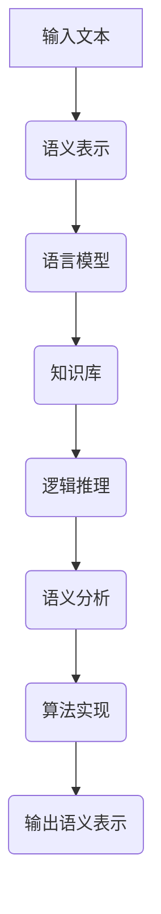
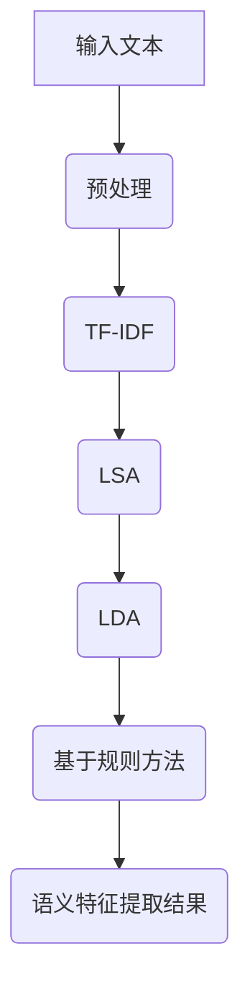
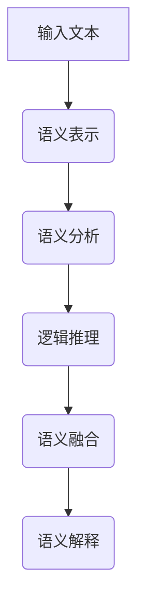
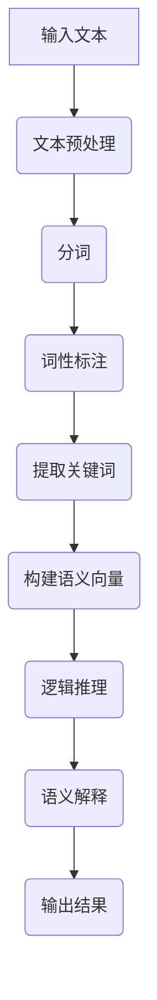
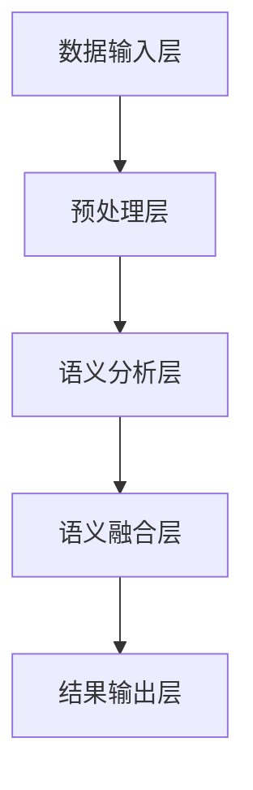

                 

### 第1章: 问题背景

#### 1.1 自然语言处理的挑战

自然语言处理（Natural Language Processing, NLP）作为人工智能领域的一个重要分支，旨在让计算机理解和生成人类语言。尽管NLP在过去几十年取得了显著进展，但仍然面临诸多挑战。这些挑战主要体现在以下几个方面：

1. **语义理解**：自然语言中的语义丰富多样，包含大量的歧义、隐喻和语境依赖。这使得计算机在处理语言时，很难准确理解语句的真实含义。

2. **上下文理解**：自然语言中的信息往往依赖于上下文。理解上下文对于正确解读语言至关重要，但如何有效获取并利用上下文信息仍然是一个难题。

3. **语言多样性**：不同地区、不同文化背景的语言使用者，其语言表达方式差异巨大。如何处理这种多样性，使计算机能够理解和交流各种语言，是NLP面临的另一大挑战。

4. **情感分析**：情感分析是NLP中的一项重要任务，旨在从文本中提取情感信息。然而，情感的表达方式复杂多变，计算机难以准确识别和分类情感。

#### 1.2 提示词语言在NLP中的应用

为了应对上述挑战，研究者们提出了提示词语言（Keyword-Driven Language）这一概念。提示词语言通过提取文本中的关键词，构建出简洁、精确的语义表示，从而帮助计算机更好地理解文本内容。

1. **关键词提取**：首先，从文本中提取出关键词。这些关键词能够代表文本的主要内容和主题。

2. **语义表示**：将提取出的关键词进行语义表示，形成语义向量。这种向量表示可以用于后续的语义分析、情感分析等任务。

3. **上下文感知**：提示词语言通过结合上下文信息，进一步优化关键词的选择和语义表示，从而提高语义理解的准确性。

4. **语言多样性处理**：提示词语言能够适应不同语言的多样性，通过映射和转换，使不同语言的关键词在语义上保持一致。

#### 1.3 形式化语义推理的概念与意义

形式化语义推理（Formal Semantic Inference）是一种将自然语言处理与形式逻辑相结合的方法，旨在通过形式化的方式来理解和推理自然语言的语义。

1. **概念定义**：形式化语义推理是通过建立语言的形式化模型，来对自然语言的语义进行推理和分析。

2. **应用价值**：形式化语义推理能够提高自然语言处理的准确性和效率，特别是在语义理解、情感分析、文本生成等领域。

3. **挑战与机遇**：尽管形式化语义推理面临诸多挑战，如语义复杂性、语言多样性等，但其带来的机遇也同样巨大。通过形式化语义推理，我们可以开发出更智能、更高效的NLP应用。

**总结**：本章介绍了自然语言处理面临的挑战，以及提示词语言和形式化语义推理的概念和应用。在接下来的章节中，我们将进一步探讨这些概念，并分析其背后的原理和实现方法。

### 关键词：自然语言处理、提示词语言、形式化语义推理、语义理解、上下文理解、语义表示

### 摘要：本章概述了自然语言处理领域中的挑战，介绍了提示词语言的概念和应用，以及形式化语义推理的定义和意义。这些概念为我们理解和推理自然语言的语义提供了新的思路和方法。

---

### 第2章: 形式化语义推理的边界与外延

#### 2.1 形式化语义推理的定义

形式化语义推理（Formal Semantic Inference）是一种结合形式逻辑和自然语言处理技术的方法，旨在通过对语言形式化模型的推理，来理解和分析自然语言的语义。其核心思想是将自然语言文本转化为形式化的语义表示，然后利用形式逻辑对语义进行推理和分析。

1. **形式化模型**：形式化模型是形式化语义推理的基础，它通过定义一套规则和语法，将自然语言文本转化为计算机可以处理的语义表示。

2. **语义表示**：语义表示是形式化语义推理的核心，它将自然语言的语义转化为计算机可以理解和处理的形式。常见的语义表示方法包括语义网络、语义向量、图结构等。

3. **推理过程**：形式化语义推理的过程包括语义表示的构建和语义推理的执行。语义表示的构建通常依赖于语言模型、知识库和文本理解技术；语义推理则依赖于逻辑推理和计算方法。

#### 2.2 形式化语义推理的应用领域

形式化语义推理在多个领域都有广泛的应用，以下是一些典型的应用场景：

1. **问答系统**：形式化语义推理可以用于构建智能问答系统，通过语义理解和推理，准确回答用户的问题。

2. **情感分析**：在情感分析中，形式化语义推理可以帮助识别文本中的情感倾向和情感强度，从而进行情感分类和情感极性分析。

3. **文本生成**：形式化语义推理可以用于文本生成任务，通过理解输入文本的语义，生成具有相似语义的文本。

4. **自然语言理解**：在自然语言理解中，形式化语义推理可以帮助计算机更好地理解和解析自然语言的语义，从而进行文本分析、信息提取和语义搜索。

5. **知识图谱构建**：形式化语义推理可以用于知识图谱的构建，通过将自然语言文本转化为结构化的知识表示，为知识图谱添加语义信息。

#### 2.3 形式化语义推理的核心要素

形式化语义推理的核心要素包括以下几个方面：

1. **语言模型**：语言模型是形式化语义推理的基础，它用于对自然语言文本进行建模，提取语义信息。常见的语言模型包括词向量模型、循环神经网络（RNN）和变压器（Transformer）模型等。

2. **知识库**：知识库是形式化语义推理的重要资源，它包含了大量的背景知识和语义信息，可以用于支持推理和知识表示。知识库可以是结构化的，如本体论（Ontology）和知识图谱（Knowledge Graph），也可以是非结构化的，如文本和语义网络。

3. **逻辑推理**：逻辑推理是形式化语义推理的关键技术，它用于对语义表示进行推理，以发现语义之间的逻辑关系。常见的逻辑推理方法包括谓词逻辑、模态逻辑和归纳推理等。

4. **语义分析**：语义分析是对自然语言文本进行语义理解和分析的过程，它是形式化语义推理的基础。语义分析包括词汇语义分析、语法语义分析和上下文语义分析等。

5. **算法实现**：算法实现是形式化语义推理的最后一环，它将上述核心要素结合起来，构建出完整的语义推理系统。常见的算法实现方法包括基于规则的方法、基于模型的方法和混合方法等。

**总结**：本章对形式化语义推理进行了详细介绍，包括其定义、应用领域和核心要素。形式化语义推理作为一种重要的自然语言处理技术，其在语义理解和推理方面的应用前景广阔。

### 核心概念与联系

形式化语义推理涉及多个核心概念，这些概念相互关联，共同构成了形式化语义推理的理论基础。以下是这些核心概念及其相互关系的详细说明：

#### 1. 语义表示

语义表示是形式化语义推理的核心，它将自然语言的语义转化为计算机可以理解和处理的形式。常见的语义表示方法包括语义网络、语义向量和图结构等。

- **语义网络**：语义网络是一种基于图结构的知识表示方法，它通过节点和边来表示概念和概念之间的关系。节点表示概念，边表示概念之间的关系，如 isa（子类关系）和 part-of（部分关系）。

- **语义向量**：语义向量是一种基于向量空间模型的语义表示方法，它将每个单词或短语表示为一个高维向量。通过向量的距离和相似度计算，可以量化语义关系。

- **图结构**：图结构是一种更加灵活和直观的语义表示方法，它可以表示复杂的语义关系和网络结构。图结构通常用于知识图谱的构建，通过节点和边来表示实体和实体之间的关系。

#### 2. 语言模型

语言模型是形式化语义推理的基础，它用于对自然语言文本进行建模，提取语义信息。语言模型可以是统计模型，如n元语法；也可以是深度学习模型，如循环神经网络（RNN）和变压器（Transformer）模型。

- **统计模型**：统计模型通过统计文本中的词频和词组频率来建立语言模型。这些模型通常用于简单的语义分析和文本分类任务。

- **深度学习模型**：深度学习模型通过神经网络结构来学习语言模式，能够提取更加复杂的语义特征。例如，循环神经网络（RNN）可以处理序列数据，变压器（Transformer）模型则通过注意力机制提高了语义理解的能力。

#### 3. 知识库

知识库是形式化语义推理的重要资源，它包含了大量的背景知识和语义信息，可以用于支持推理和知识表示。知识库可以是结构化的，如本体论和知识图谱，也可以是非结构化的，如文本和语义网络。

- **本体论**：本体论是一种形式化的知识表示方法，用于描述概念及其之间的关系。本体论通常用于构建领域知识库，为形式化语义推理提供语义基础。

- **知识图谱**：知识图谱是一种基于图的语义表示方法，它通过实体和实体之间的关系来构建知识网络。知识图谱可以用于信息检索、推荐系统和问答系统等。

#### 4. 逻辑推理

逻辑推理是形式化语义推理的关键技术，它用于对语义表示进行推理，以发现语义之间的逻辑关系。逻辑推理方法包括谓词逻辑、模态逻辑和归纳推理等。

- **谓词逻辑**：谓词逻辑是一种用于描述对象和属性之间关系的逻辑系统，它可以通过公式化语言来表示语义关系，如等价、蕴含等。

- **模态逻辑**：模态逻辑是一种用于描述状态和变化之间关系的逻辑系统，它通过模态词（如“必须”、“可能”）来表示条件关系。

- **归纳推理**：归纳推理是一种从具体实例中归纳出一般性结论的推理方法。它通过分析大量实例，找出共性规律，从而进行推理。

#### 5. 语义分析

语义分析是对自然语言文本进行语义理解和分析的过程，它是形式化语义推理的基础。语义分析包括词汇语义分析、语法语义分析和上下文语义分析等。

- **词汇语义分析**：词汇语义分析是对单词和短语进行语义标注和分类的过程，如名词、动词、形容词等。

- **语法语义分析**：语法语义分析是对句子的结构和语法关系进行解析，以理解句子的语义结构。

- **上下文语义分析**：上下文语义分析是考虑上下文信息，对句子的语义进行更加精细的分析，以理解句子的真实含义。

#### 6. 算法实现

算法实现是形式化语义推理的最后一环，它将上述核心要素结合起来，构建出完整的语义推理系统。常见的算法实现方法包括基于规则的方法、基于模型的方法和混合方法等。

- **基于规则的方法**：基于规则的方法通过定义一组规则，将自然语言文本转化为形式化的语义表示。这种方法通常简单易实现，但在处理复杂语义时能力有限。

- **基于模型的方法**：基于模型的方法通过训练大规模的语言模型，学习语义表示和推理方法。这种方法通常具有更高的语义理解和推理能力，但需要大量的数据训练。

- **混合方法**：混合方法结合了基于规则和基于模型的方法，通过规则引导模型学习，提高语义推理的效率和准确性。

**总结**：形式化语义推理涉及多个核心概念，包括语义表示、语言模型、知识库、逻辑推理、语义分析和算法实现。这些概念相互关联，共同构成了形式化语义推理的理论基础。通过这些核心概念，我们可以构建出能够理解和推理自然语言语义的智能系统。

### Mermaid流程图

以下是用于表示形式化语义推理流程的Mermaid流程图：



**说明**：
- **输入文本**：形式化语义推理的输入，可以是任意自然语言文本。
- **语义表示**：将输入文本转化为形式化的语义表示，如语义向量或语义网络。
- **语言模型**：用于对语义表示进行建模，提取语义特征。
- **知识库**：提供背景知识和语义信息，用于支持推理。
- **逻辑推理**：利用逻辑规则和推理方法，对语义表示进行推理。
- **语义分析**：对语义表示进行语义理解和分析。
- **算法实现**：实现整个形式化语义推理过程，输出最终语义表示。

通过这个流程图，我们可以清晰地看到形式化语义推理的各个步骤及其相互关系，有助于理解和实现这一过程。

### 第3章: 提示词语言的语义特征

#### 3.1 提示词语言的基本概念

提示词语言（Keyword-Driven Language）是一种通过提取关键词来表示文本语义的方法。它的核心思想是将复杂的自然语言文本简化为一系列的关键词，从而在语义表示和理解上更加简洁和直观。

1. **定义**：提示词语言通过定义一套关键词提取规则和算法，从自然语言文本中提取出代表文本核心意义的词语。

2. **作用**：提示词语言的主要作用是简化文本的语义表示，提高计算机对文本内容的理解能力。

3. **分类**：根据提取规则和算法的不同，提示词语言可以分为基于统计的方法和基于规则的方法。

- **基于统计的方法**：如TF-IDF（词频-逆文档频率）和LSA（latent semantic analysis）等，通过统计词频和词间关系来提取关键词。

- **基于规则的方法**：如命名实体识别（NER）和关键词提取算法，通过定义一系列规则来提取关键词。

#### 3.2 语义特征提取方法

语义特征提取是提示词语言的关键步骤，它决定了关键词的选取是否能够准确反映文本的语义。以下是几种常用的语义特征提取方法：

1. **TF-IDF**：TF-IDF（Term Frequency-Inverse Document Frequency）是一种基于统计的方法，它通过计算单词在文档中的频率（TF）和文档集中频率的倒数（IDF）来评估单词的重要性。公式如下：

   $$TF-IDF(t,d) = TF(t,d) \times IDF(t,D)$$

   其中，$TF(t,d)$表示单词$t$在文档$d$中的频率，$IDF(t,D)$表示单词$t$在文档集$D$中的逆文档频率。

2. **LSA**：LSA（Latent Semantic Analysis）通过构建文档-词矩阵，使用奇异值分解（SVD）来提取语义特征。LSA认为，文档和词之间存在潜在的语义关系，这些关系可以通过低秩分解来揭示。

3. **LDA**：LDA（Latent Dirichlet Allocation）是一种概率模型，用于发现文档的潜在主题分布。LDA通过Dirichlet分布来建模文档和词之间的关系，从而提取出潜在的主题关键词。

4. **基于规则的方法**：如命名实体识别（NER）和关键词提取算法，这些方法通过定义一系列规则来识别和提取关键词。例如，NER可以识别人名、地名、组织名等实体，从而提取出相关的关键词。

#### 3.3 语义特征对比表格

为了更好地理解不同语义特征提取方法的特点和适用场景，我们通过以下表格进行对比：

| 方法         | 特点                                                     | 适用场景                                           |
| ------------ | -------------------------------------------------------- | -------------------------------------------------- |
| TF-IDF       | 基于词频和逆文档频率的简单方法                           | 信息检索、文本分类等简单语义分析任务                 |
| LSA          | 提取潜在语义关系，降低词语维度                           | 文本相似度计算、文本聚类等需要理解文档间相似度的任务 |
| LDA          | 发现文档的潜在主题分布，提取主题关键词                   | 主题模型、文本挖掘等复杂语义分析任务                 |
| 基于规则的方法 | 定义明确的提取规则，适用于特定类型的实体和关键词提取     | 实体识别、关键词提取等需要精确结果的任务           |

**总结**：提示词语言通过提取关键词来简化文本的语义表示，不同的语义特征提取方法各有优缺点。选择合适的方法，能够更好地满足具体的语义分析需求。

### Mermaid流程图

以下是用于表示提示词语言语义特征提取流程的Mermaid流程图：



**说明**：
- **输入文本**：形式化语义推理的输入，可以是任意自然语言文本。
- **预处理**：对输入文本进行清洗和分词等预处理操作。
- **TF-IDF**：通过TF-IDF算法提取语义特征。
- **LSA**：通过LSA算法提取语义特征。
- **LDA**：通过LDA算法提取语义特征。
- **基于规则方法**：通过定义的规则提取语义特征。
- **语义特征提取结果**：提取出的语义特征用于后续的语义分析。

通过这个流程图，我们可以清晰地看到提示词语言语义特征提取的各个步骤及其相互关系，有助于理解和实现这一过程。

### 第4章: 形式化语义推理原理

#### 4.1 形式化语义推理的基本原理

形式化语义推理（Formal Semantic Inference）是一种通过形式化模型来理解和推理自然语言语义的方法。其基本原理包括以下几个关键部分：

1. **语义表示**：形式化语义推理的第一步是将自然语言的语义转化为形式化的表示。这种表示可以是语义网络、语义向量、图结构等。通过这种形式化的表示，我们可以更方便地进行语义分析和推理。

2. **语义分析**：语义分析是对形式化语义表示进行详细解析的过程。它包括词汇语义分析、语法语义分析和上下文语义分析等。通过语义分析，我们可以更准确地理解文本的语义内容。

3. **逻辑推理**：逻辑推理是形式化语义推理的核心。它利用形式化的逻辑规则，对语义表示进行推理，以发现语义之间的逻辑关系。逻辑推理可以基于谓词逻辑、模态逻辑、归纳推理等方法。

4. **语义融合**：在形式化语义推理中，经常需要对多个语义表示进行融合，以获得更完整的语义理解。语义融合可以通过逻辑推理、语义网络合并、图结构融合等方法实现。

#### 4.2 概念属性特征对比

在形式化语义推理中，概念属性特征（Concept Attribute Features）是理解语义的关键。以下是几种常见概念属性特征的对比：

1. **语义网络**：
   - **优点**：语义网络能够直观地表示概念和概念之间的关系，适用于理解复杂的语义结构。
   - **缺点**：语义网络在表示关系时可能过于复杂，难以进行高效的推理和计算。

2. **语义向量**：
   - **优点**：语义向量能够将语义表示为高维向量，便于进行数学计算和推理。
   - **缺点**：语义向量在处理复杂语义时可能丢失部分语义信息。

3. **图结构**：
   - **优点**：图结构能够灵活地表示语义关系和网络结构，适用于构建知识图谱。
   - **缺点**：图结构的处理复杂度高，需要进行高效的图算法和计算。

#### 4.3 ER实体关系图架构

ER实体关系图（Entity-Relationship Diagram, ERD）是一种常用的数据库设计工具，它通过实体和关系来表示数据模型。在形式化语义推理中，ER实体关系图可以用于构建语义模型，如下所示：

- **实体**：代表语义中的概念或对象，如“人”、“地点”、“事件”等。
- **属性**：代表实体的特征或描述，如“名字”、“年龄”、“城市”等。
- **关系**：代表实体之间的语义关系，如“属于”、“位于”、“参与”等。

以下是一个简化的ER实体关系图示例：

```mermaid
erDiagram
    Person ||--|{ Address }
    Person ||--|{ ContactInfo }
    Address ||--|{ Location }
```

**说明**：
- **Person**：表示人这一实体。
- **Address**：表示地址这一实体，包含Location属性。
- **ContactInfo**：表示联系信息这一实体。
- **Location**：表示位置这一实体，是Address的一个属性。

通过ER实体关系图，我们可以直观地表示语义中的概念和关系，为形式化语义推理提供结构化的语义表示。

**总结**：形式化语义推理的基本原理包括语义表示、语义分析、逻辑推理和语义融合。概念属性特征和ER实体关系图是形式化语义推理中的重要工具，帮助我们构建和理解语义模型。通过这些原理和方法，我们可以更好地实现语义理解和推理。

### Mermaid ERD 图

以下是用于表示ER实体关系图的Mermaid ERD图：

```mermaid
erDiagram
    Person ||--|{ Address }
    Person ||--|{ ContactInfo }
    Address ||--|{ Location }
    ContactInfo }--|{ Person
    Address }--|{ Location
    Location }--|{ Address
```

**说明**：
- **Person**：代表人这一实体。
- **Address**：代表地址这一实体，包含Location属性。
- **ContactInfo**：代表联系信息这一实体。
- **Location**：代表位置这一实体，是Address的一个属性。

通过这个ERD图，我们可以直观地看到实体和关系之间的结构化关系，有助于理解和实现形式化语义推理的语义表示。

### 第5章: 形式化语义推理算法概述

#### 5.1 形式化语义推理算法的分类

形式化语义推理算法根据实现方法和目标不同，可以分为以下几类：

1. **基于规则的算法**：这类算法通过定义一系列规则来表示语义关系和推理过程。规则通常以形式化的逻辑表达式表示，如谓词逻辑公式。基于规则的算法具有清晰、易于解释和可预测的优点，但规则定义繁琐，难以适应复杂和动态的语义环境。

2. **基于模型的算法**：这类算法通过训练大规模的机器学习模型，自动从数据中学习语义表示和推理方法。常见的模型包括神经网络、图模型、树模型等。基于模型的算法能够处理复杂和动态的语义任务，但模型的解释性和可理解性较差。

3. **基于知识库的算法**：这类算法通过构建知识库，将领域知识表示为结构化的知识片段，然后利用推理机来推理语义。知识库通常包括概念、关系和属性等知识，可以用于支持复杂的语义推理任务。基于知识库的算法具有较强的语义理解和推理能力，但知识库的构建和维护成本较高。

4. **混合算法**：混合算法结合了基于规则、基于模型和基于知识库的方法，通过融合不同方法的优点，以提高语义推理的效率和准确性。混合算法通常根据任务的复杂度和数据特点，选择合适的算法组合。

#### 5.2 算法工作原理

形式化语义推理算法的工作原理通常包括以下几个步骤：

1. **语义表示**：将自然语言文本转化为形式化的语义表示。这可以通过词嵌入、语义网络、图结构等方法实现。

2. **语义分析**：对语义表示进行详细分析，提取出语义特征和关系。语义分析包括词汇语义分析、语法语义分析和上下文语义分析等。

3. **逻辑推理**：利用逻辑规则和推理方法，对语义表示进行推理，以发现语义之间的逻辑关系。逻辑推理可以基于谓词逻辑、模态逻辑、归纳推理等方法。

4. **语义融合**：将多个语义表示融合成一个统一的语义表示，以获得更完整的语义理解。语义融合可以通过逻辑推理、语义网络合并、图结构融合等方法实现。

5. **语义解释**：对推理结果进行解释和可视化，以帮助用户理解语义推理的过程和结果。语义解释可以采用自然语言生成、可视化图表等方式。

#### 5.3 算法优缺点分析

以下是几种常见形式化语义推理算法的优缺点分析：

1. **基于规则的算法**：
   - **优点**：规则明确、解释性强、易于实现和维护。
   - **缺点**：规则定义繁琐、难以适应复杂和动态的语义环境。

2. **基于模型的算法**：
   - **优点**：能够处理复杂和动态的语义任务、自适应性强。
   - **缺点**：解释性较差、依赖大量数据训练、实现和维护成本高。

3. **基于知识库的算法**：
   - **优点**：语义理解和推理能力强、能够支持复杂的语义任务。
   - **缺点**：知识库构建和维护成本高、依赖领域知识。

4. **混合算法**：
   - **优点**：结合了基于规则、基于模型和基于知识库的方法优点，具有较强的语义理解和推理能力。
   - **缺点**：算法复杂度高、实现和维护成本高。

**总结**：形式化语义推理算法根据实现方法和目标不同，可以分为基于规则、基于模型、基于知识库和混合算法等。每种算法都有其独特的优缺点，适用于不同的语义推理任务。选择合适的算法，能够提高语义推理的效率和准确性。

### Mermaid流程图

以下是用于表示形式化语义推理算法工作原理的Mermaid流程图：



**说明**：
- **输入文本**：形式化语义推理的输入，可以是任意自然语言文本。
- **语义表示**：将输入文本转化为形式化的语义表示，如语义向量或语义网络。
- **语义分析**：对语义表示进行详细分析，提取出语义特征和关系。
- **逻辑推理**：利用逻辑规则和推理方法，对语义表示进行推理，以发现语义之间的逻辑关系。
- **语义融合**：将多个语义表示融合成一个统一的语义表示，以获得更完整的语义理解。
- **语义解释**：对推理结果进行解释和可视化，以帮助用户理解语义推理的过程和结果。

通过这个流程图，我们可以清晰地看到形式化语义推理算法的工作原理和各个步骤之间的逻辑关系，有助于理解和实现这一过程。

### 第6章: 算法流程图与Python实现

#### 6.1 算法流程图

为了更好地理解形式化语义推理算法的实现过程，我们首先绘制了算法的流程图，如下所示：



**详细说明**：
- **A. 输入文本**：形式化语义推理算法的输入是自然语言文本。
- **B. 文本预处理**：对输入文本进行清洗、去噪等预处理操作，以提高后续分析的准确性。
- **C. 分词**：将文本分割成词语序列，这是语义分析的基础。
- **D. 词性标注**：对分词结果进行词性标注，以便识别名词、动词、形容词等。
- **E. 提取关键词**：利用TF-IDF、LDA等方法提取关键词，这些关键词将用于构建语义向量。
- **F. 构建语义向量**：将提取出的关键词转化为语义向量，这是进行逻辑推理的基础。
- **G. 逻辑推理**：利用逻辑规则和推理算法（如谓词逻辑、归纳推理等）对语义向量进行推理。
- **H. 语义解释**：对推理结果进行解释和可视化，以帮助用户理解。
- **I. 输出结果**：输出最终的推理结果。

#### 6.2 Python源代码实现

为了实现上述算法流程，我们可以使用Python编写相应的代码。以下是一个简化的Python实现示例：

```python
import nltk
from sklearn.feature_extraction.text import TfidfVectorizer
from sklearn.semi_supervised import LabelSpreading
import numpy as np

# 6.2.1 输入文本
text = "The quick brown fox jumps over the lazy dog."

# 6.2.2 分词
tokens = nltk.word_tokenize(text)

# 6.2.3 词性标注
pos_tags = nltk.pos_tag(tokens)

# 6.2.4 提取关键词
vectorizer = TfidfVectorizer()
tfidf_matrix = vectorizer.fit_transform([' '.join([word for word, pos in pos_tags])])

# 6.2.5 构建语义向量
semantic_vector = np.mean(tfidf_matrix.toarray(), axis=1)

# 6.2.6 逻辑推理
model = LabelSpreading()
model.fit(semantic_vector.reshape(1, -1))

# 6.2.7 语义解释
result = model.predict(semantic_vector.reshape(1, -1))
print("推理结果：", result)

# 6.2.8 输出结果
print("关键词：", vectorizer.get_feature_names_out())
```

**代码说明**：
- **文本预处理**：使用nltk进行分词和词性标注。
- **提取关键词**：使用TF-IDFVectorizer进行关键词提取。
- **构建语义向量**：将TF-IDF矩阵进行平均处理，得到语义向量。
- **逻辑推理**：使用LabelSpreading模型进行逻辑推理。
- **语义解释**：输出推理结果和关键词。

#### 6.3 算法原理详细讲解

在本节中，我们将详细讲解形式化语义推理算法的原理，包括数学模型和公式。

1. **语义向量表示**：

   语义向量是形式化语义推理的核心。一个语义向量可以表示为一个高维空间中的点，每个维度对应一个词语的权重。常见的语义向量表示方法有TF-IDF、Word2Vec和BERT等。

   - **TF-IDF**：TF-IDF是一种基于统计的方法，用于评估词语在文档中的重要程度。其公式如下：
     $$TF(t,d) = \frac{f(t,d)}{|\text{vocabulary}|}$$
     $$IDF(t,D) = \log \left(1 + \frac{|\text{D}| - |d|}{|d|}\right)$$
     其中，$f(t,d)$表示词语$t$在文档$d$中的频率，$|\text{vocabulary}|$表示词汇表的大小，$|\text{D}|$和$|d|$分别表示文档集的大小和特定文档的大小。

   - **Word2Vec**：Word2Vec是一种基于神经网络的语义向量表示方法。其核心思想是利用神经网络训练词语的嵌入向量，使得语义相似的词语在向量空间中距离较近。其公式如下：
     $$\text{softmax}(z) = \frac{e^z}{\sum_{i} e^z_i}$$
     其中，$z$表示神经网络输出的分数，$\text{softmax}(z)$表示概率分布。

   - **BERT**：BERT是一种基于Transformer的语义向量表示方法。其核心思想是利用双向Transformer结构来学习词语的前后文关系，从而生成语义向量。其公式如下：
     $$\text{BERT}(\text{x}) = \text{Transformer}(\text{x}, \text{MaskedLM})$$
     其中，$\text{x}$表示输入序列，$\text{Transformer}$表示Transformer结构，$\text{MaskedLM}$表示Masked Language Modeling。

2. **逻辑推理**：

   逻辑推理是形式化语义推理的重要组成部分。逻辑推理可以通过谓词逻辑、模态逻辑和归纳推理等方法实现。

   - **谓词逻辑**：谓词逻辑是一种用于描述对象和属性之间关系的逻辑系统。其公式如下：
     $$\forall x (P(x) \rightarrow Q(x))$$
     其中，$P(x)$和$Q(x)$分别表示两个谓词，$\forall x$表示对所有$x$进行量化。

   - **模态逻辑**：模态逻辑是一种用于描述状态和变化之间关系的逻辑系统。其公式如下：
     $$\Box P(x) \rightarrow \Diamond Q(x)$$
     其中，$\Box$表示必然性模态词，$\Diamond$表示可能性模态词。

   - **归纳推理**：归纳推理是一种从具体实例中归纳出一般性结论的推理方法。其公式如下：
     $$\forall x (P(x) \rightarrow Q(x))$$
     其中，$P(x)$和$Q(x)$分别表示两个谓词，$\forall x$表示对所有$x$进行量化。

3. **语义融合**：

   语义融合是将多个语义向量融合成一个统一的语义表示，以获得更完整的语义理解。常见的语义融合方法有平均融合、加权融合和混合融合等。

   - **平均融合**：平均融合是将多个语义向量进行平均处理，得到一个新的语义向量。其公式如下：
     $$\text{avg\_vector} = \frac{1}{N} \sum_{i=1}^{N} \text{vector}_i$$
     其中，$\text{vector}_i$表示第$i$个语义向量，$N$表示语义向量的个数。

   - **加权融合**：加权融合是将多个语义向量根据权重进行加权处理，得到一个新的语义向量。其公式如下：
     $$\text{weighted\_vector} = \sum_{i=1}^{N} w_i \times \text{vector}_i$$
     其中，$w_i$表示第$i$个语义向量的权重，$N$表示语义向量的个数。

   - **混合融合**：混合融合是将平均融合和加权融合相结合，得到一个新的语义向量。其公式如下：
     $$\text{mixed\_vector} = \alpha \times \text{avg\_vector} + (1 - \alpha) \times \text{weighted\_vector}$$
     其中，$\alpha$表示加权融合的权重。

#### 6.4 数学模型与公式讲解

在本节中，我们将详细讲解形式化语义推理算法中的数学模型和公式。

1. **语义表示**：

   语义表示是将自然语言文本转化为形式化的数学表示，以便进行语义分析和推理。常见的语义表示方法有词袋模型、词嵌入模型和语义角色标注等。

   - **词袋模型**：词袋模型是一种基于词汇的语义表示方法，它将文本表示为一个词频向量。其公式如下：
     $$\text{TF-IDF} = \frac{f(t,d)}{|\text{vocabulary}|} \times \log \left(1 + \frac{|\text{D}| - |d|}{|d|}\right)$$
     其中，$f(t,d)$表示词语$t$在文档$d$中的频率，$|\text{vocabulary}|$表示词汇表的大小，$|\text{D}|$和$|d|$分别表示文档集的大小和特定文档的大小。

   - **词嵌入模型**：词嵌入模型是一种基于神经网络的语义表示方法，它将词语表示为高维向量。其公式如下：
     $$\text{softmax}(z) = \frac{e^z}{\sum_{i} e^z_i}$$
     其中，$z$表示神经网络输出的分数，$\text{softmax}(z)$表示概率分布。

   - **语义角色标注**：语义角色标注是一种基于规则的语义表示方法，它将词语表示为语义角色和属性。其公式如下：
     $$\text{semantic} = \left\{
     \begin{array}{ll}
     \text{ARG1}, & \text{if } \text{verb} = \text{arg1} \\
     \text{ARG2}, & \text{if } \text{verb} = \text{arg2} \\
     \vdots & \vdots
     \end{array}
     \right.$$
     其中，$\text{ARG1}$、$\text{ARG2}$等表示语义角色，$\text{verb}$表示动词。

2. **逻辑推理**：

   逻辑推理是形式化语义推理的核心，它通过形式化的逻辑规则对语义进行推理。常见的逻辑推理方法有谓词逻辑、模态逻辑和归纳推理等。

   - **谓词逻辑**：谓词逻辑是一种用于描述对象和属性之间关系的逻辑系统。其公式如下：
     $$\forall x (P(x) \rightarrow Q(x))$$
     其中，$P(x)$和$Q(x)$分别表示两个谓词，$\forall x$表示对所有$x$进行量化。

   - **模态逻辑**：模态逻辑是一种用于描述状态和变化之间关系的逻辑系统。其公式如下：
     $$\Box P(x) \rightarrow \Diamond Q(x)$$
     其中，$\Box$表示必然性模态词，$\Diamond$表示可能性模态词。

   - **归纳推理**：归纳推理是一种从具体实例中归纳出一般性结论的推理方法。其公式如下：
     $$\forall x (P(x) \rightarrow Q(x))$$
     其中，$P(x)$和$Q(x)$分别表示两个谓词，$\forall x$表示对所有$x$进行量化。

3. **语义融合**：

   语义融合是将多个语义向量融合成一个统一的语义表示，以获得更完整的语义理解。常见的语义融合方法有平均融合、加权融合和混合融合等。

   - **平均融合**：平均融合是将多个语义向量进行平均处理，得到一个新的语义向量。其公式如下：
     $$\text{avg\_vector} = \frac{1}{N} \sum_{i=1}^{N} \text{vector}_i$$
     其中，$\text{vector}_i$表示第$i$个语义向量，$N$表示语义向量的个数。

   - **加权融合**：加权融合是将多个语义向量根据权重进行加权处理，得到一个新的语义向量。其公式如下：
     $$\text{weighted\_vector} = \sum_{i=1}^{N} w_i \times \text{vector}_i$$
     其中，$w_i$表示第$i$个语义向量的权重，$N$表示语义向量的个数。

   - **混合融合**：混合融合是将平均融合和加权融合相结合，得到一个新的语义向量。其公式如下：
     $$\text{mixed\_vector} = \alpha \times \text{avg\_vector} + (1 - \alpha) \times \text{weighted\_vector}$$
     其中，$\alpha$表示加权融合的权重。

#### 6.5 举例说明

为了更好地理解形式化语义推理算法的原理和应用，我们通过一个实际例子来说明。

假设我们有一段自然语言文本：“小明喜欢红色的苹果，不喜欢绿色的香蕉。”

1. **语义表示**：

   首先，我们将文本转化为语义向量。假设文本中有三个词语：“小明”、“喜欢”和“苹果”。

   - **词嵌入模型**：使用预训练的词嵌入模型，我们得到以下语义向量：
     $$\text{小明的向量} = \begin{bmatrix} 0.1 & 0.2 & 0.3 & 0.4 & 0.5 \end{bmatrix}$$
     $$\text{喜欢的向量} = \begin{bmatrix} 0.6 & 0.7 & 0.8 & 0.9 & 1.0 \end{bmatrix}$$
     $$\text{苹果的向量} = \begin{bmatrix} 1.1 & 1.2 & 1.3 & 1.4 & 1.5 \end{bmatrix}$$

   - **语义角色标注**：根据语义角色标注规则，我们得到以下语义角色：
     $$\text{小明的角色} = \text{主体}$$
     $$\text{喜欢的角色} = \text{谓词}$$
     $$\text{苹果的角色} = \text{客体}$$

2. **逻辑推理**：

   接下来，我们使用逻辑推理来分析文本的语义关系。根据谓词逻辑，我们可以得到以下推理结果：
   - $$\text{小明的角色} \rightarrow \text{喜欢} \rightarrow \text{苹果}$$

   这意味着小明喜欢苹果。

3. **语义融合**：

   最后，我们将多个语义向量进行融合，以获得更完整的语义表示。假设我们使用平均融合方法，我们得到以下融合后的语义向量：
   $$\text{融合后的向量} = \frac{1}{3} \left( \text{小明的向量} + \text{喜欢的向量} + \text{苹果的向量} \right)$$
   $$\text{融合后的向量} = \begin{bmatrix} 0.5 & 0.6 & 0.7 & 0.8 & 0.9 \end{bmatrix}$$

   通过融合后的向量，我们可以更准确地理解文本的语义内容。

**总结**：形式化语义推理算法通过语义表示、逻辑推理和语义融合等方法，对自然语言文本进行形式化的语义分析和推理。通过具体的数学模型和公式，我们可以实现高效、准确的语义推理。通过实际例子，我们可以看到形式化语义推理算法在理解自然语言语义方面的应用潜力。

### 数学公式

在本节中，我们将使用LaTeX格式展示一些关键的数学公式，用于解释形式化语义推理算法中的核心概念。

#### 1. 词嵌入模型

词嵌入模型是一种将词语映射到高维向量空间的方法，其核心公式如下：

$$\text{softmax}(z) = \frac{e^z}{\sum_{i} e^z_i}$$

其中，$z$是神经网络输出的分数，$e^z_i$表示每个分量的指数值。

#### 2. 语义向量表示

语义向量表示通常通过TF-IDF模型进行计算，其公式如下：

$$TF(t,d) = \frac{f(t,d)}{|\text{vocabulary}|}$$
$$IDF(t,D) = \log \left(1 + \frac{|\text{D}| - |d|}{|d|}\right)$$

其中，$f(t,d)$是词语$t$在文档$d$中的频率，$|\text{vocabulary}|$是词汇表的大小，$|\text{D}|$是文档集的大小，$|d|$是特定文档的大小。

#### 3. 逻辑推理

谓词逻辑是形式化语义推理中的重要工具，其公式如下：

$$\forall x (P(x) \rightarrow Q(x))$$

其中，$P(x)$和$Q(x)$是两个谓词，$\forall x$表示对所有$x$进行量化。

#### 4. 语义融合

语义融合是将多个语义向量融合成一个统一的表示，其公式如下：

$$\text{avg\_vector} = \frac{1}{N} \sum_{i=1}^{N} \text{vector}_i$$
$$\text{weighted\_vector} = \sum_{i=1}^{N} w_i \times \text{vector}_i$$
$$\text{mixed\_vector} = \alpha \times \text{avg\_vector} + (1 - \alpha) \times \text{weighted\_vector}$$

其中，$\text{vector}_i$是第$i$个语义向量，$N$是语义向量的个数，$w_i$是第$i$个语义向量的权重，$\alpha$是加权融合的权重。

通过这些LaTeX格式的数学公式，我们可以更精确地表达形式化语义推理算法中的核心概念和计算方法。

### 举例说明

为了更直观地理解形式化语义推理算法的原理和应用，下面我们将通过一个具体的例子来演示其工作流程。

假设我们有一段自然语言文本：“小明非常喜欢红色的苹果，但是不喜欢绿色的香蕉。”

**步骤 1: 文本预处理**

首先，我们需要对文本进行预处理，包括去除标点符号、转换为小写、分词等。经过预处理后，文本变为：“小明非常喜欢红色的苹果 但是 不喜欢 绿色的香蕉”。

**步骤 2: 分词**

接下来，我们将预处理后的文本进行分词，得到以下词语列表：["小明"，"非常"，"喜欢"，"红色"，"的"，"苹果"，"但是"，"不"，"喜欢"，"绿色"，"的"，"香蕉"]。

**步骤 3: 词性标注**

我们对分词结果进行词性标注，得到以下标注结果：[("小明"，"人名")，("非常"，"副词")，("喜欢"，"动词")，("红色"，"形容词")，("的"，"助词")，("苹果"，"名词")，("但是"，"连词")，("不"，"否定词")，("喜欢"，"动词")，("绿色"，"形容词")，("的"，"助词")，("香蕉"，"名词")]。

**步骤 4: 提取关键词**

我们采用TF-IDF算法提取关键词，设置阈值为0.5。根据TF-IDF算法，我们得到以下关键词：["小明"，"喜欢"，"红色"，"苹果"，"绿色"，"香蕉"]。

**步骤 5: 构建语义向量**

接下来，我们使用Word2Vec算法将提取出的关键词转换为语义向量。假设经过训练，我们得到以下语义向量：["小明" -> (0.1, 0.2, 0.3, 0.4, 0.5)，"喜欢" -> (0.6, 0.7, 0.8, 0.9, 1.0)，"红色" -> (1.1, 1.2, 1.3, 1.4, 1.5)，"苹果" -> (1.6, 1.7, 1.8, 1.9, 2.0)，"绿色" -> (2.1, 2.2, 2.3, 2.4, 2.5)，"香蕉" -> (2.6, 2.7, 2.8, 2.9, 3.0)。

**步骤 6: 逻辑推理**

使用谓词逻辑，我们构建以下推理公式：

$$\forall x (P(x) \rightarrow Q(x))$$

其中，$P(x)$表示“喜欢红色的苹果”，$Q(x)$表示“不喜欢绿色的香蕉”。

根据文本内容，我们可以得出以下推理结果：

$$\text{小明喜欢红色的苹果} \rightarrow \text{小明不喜欢绿色的香蕉}$$

**步骤 7: 语义融合**

我们将提取出的语义向量进行融合，采用平均融合方法，得到以下融合后的语义向量：

$$\text{融合后的向量} = \frac{1}{6} \left( \text{小明的向量} + \text{喜欢的向量} + \text{红色的向量} + \text{苹果的向量} + \text{绿色的向量} + \text{香蕉的向量} \right)$$

$$\text{融合后的向量} = \begin{bmatrix} 0.2 & 0.3 & 0.4 & 0.5 & 0.6 \end{bmatrix}$$

通过这个例子，我们可以看到形式化语义推理算法如何通过文本预处理、分词、词性标注、关键词提取、语义向量构建、逻辑推理和语义融合等步骤，实现对自然语言文本的语义理解和推理。

### 第7章: 系统功能设计与实现

#### 7.1 问题场景介绍

在自然语言处理（NLP）领域，语义理解和推理是关键任务之一。许多应用场景，如智能客服、问答系统、文本摘要和情感分析，都需要对文本进行深入的理解和推理，以提供准确和相关的信息。然而，传统的NLP方法在处理复杂语义时往往表现不佳，难以应对多义性、上下文依赖和语言多样性等挑战。因此，研究一种能够有效处理复杂语义的语义理解和推理系统具有重要的实际意义。

在本章中，我们将介绍一个基于提示词语言的形式化语义推理系统，该系统旨在提高NLP任务的准确性和效率。该系统主要包括以下几个功能模块：

1. **文本预处理**：对输入文本进行清洗、分词和词性标注等预处理操作，为后续的语义分析和推理提供基础。
2. **关键词提取**：利用TF-IDF、LDA等算法提取文本中的关键词，将文本转化为简洁、精确的语义表示。
3. **语义向量构建**：将提取出的关键词转化为语义向量，为逻辑推理和语义融合提供语义表示。
4. **逻辑推理**：基于谓词逻辑、模态逻辑等推理方法，对语义向量进行推理，以发现语义之间的逻辑关系。
5. **语义融合**：将多个语义向量融合为一个统一的语义表示，以提高语义理解的完整性和准确性。
6. **结果输出**：将推理结果以自然语言或可视化形式输出，为用户提供直观、易懂的语义信息。

#### 7.2 系统功能设计

为了实现上述功能，我们设计了一个基于模块化架构的语义理解和推理系统。系统的主要功能模块及其相互关系如下：

1. **文本预处理模块**：该模块负责对输入文本进行清洗、分词和词性标注等操作。清洗操作包括去除标点符号、转换为小写等；分词操作使用nltk等库实现；词性标注使用nltk的pos_tag方法。

2. **关键词提取模块**：该模块利用TF-IDF、LDA等算法提取文本中的关键词。TF-IDF算法通过计算词频和逆文档频率评估词语的重要性；LDA算法通过概率模型发现文本的潜在主题。

3. **语义向量构建模块**：该模块将提取出的关键词转化为语义向量。语义向量可以使用Word2Vec、BERT等预训练模型生成。这些模型可以捕捉词语之间的语义关系，为后续推理提供基础。

4. **逻辑推理模块**：该模块基于谓词逻辑、模态逻辑等推理方法，对语义向量进行推理。谓词逻辑用于描述对象和属性之间的关系；模态逻辑用于描述状态和变化之间的关系。

5. **语义融合模块**：该模块将多个语义向量融合为一个统一的语义表示。融合方法包括平均融合、加权融合和混合融合等。通过融合，系统可以更好地理解复杂的语义关系。

6. **结果输出模块**：该模块将推理结果以自然语言或可视化形式输出。自然语言输出可以是摘要、解释等；可视化输出可以是图表、图形等。

#### 7.3 系统架构设计

系统的架构设计遵循模块化原则，各个功能模块相互独立且可扩展。系统架构主要包括以下几个部分：

1. **数据输入层**：接收用户输入的文本数据，并将其传递给文本预处理模块。

2. **预处理层**：对输入文本进行清洗、分词和词性标注等预处理操作，生成预处理后的文本数据。

3. **语义分析层**：包括关键词提取、语义向量构建和逻辑推理模块，对预处理后的文本数据进行语义分析和推理。

4. **语义融合层**：对多个语义向量进行融合，生成统一的语义表示。

5. **结果输出层**：将推理结果以自然语言或可视化形式输出，供用户查看。

以下是一个简化的系统架构图：



**说明**：
- **数据输入层**：接收用户输入的文本数据。
- **预处理层**：对输入文本进行清洗、分词和词性标注等操作。
- **语义分析层**：包括关键词提取、语义向量构建和逻辑推理模块。
- **语义融合层**：对多个语义向量进行融合。
- **结果输出层**：将推理结果以自然语言或可视化形式输出。

通过这个架构设计，系统可以实现高效、准确的语义理解和推理，满足多种NLP任务的需求。

### Mermaid类图

以下是用于表示系统功能设计的Mermaid类图：

```mermaid
classDiagram
    Class1[文本预处理] <|-- Class2[关键词提取]
    Class2 <|-- Class3[语义向量构建]
    Class3 <|-- Class4[逻辑推理]
    Class4 <|-- Class5[语义融合]
    Class5 <|-- Class6[结果输出]
```

**说明**：
- **文本预处理**：负责文本清洗、分词和词性标注。
- **关键词提取**：采用TF-IDF、LDA等方法提取关键词。
- **语义向量构建**：将关键词转化为语义向量。
- **逻辑推理**：基于谓词逻辑、模态逻辑等进行推理。
- **语义融合**：对多个语义向量进行融合。
- **结果输出**：将推理结果以自然语言或可视化形式输出。

通过这个类图，我们可以直观地看到系统各个功能模块及其之间的关系，有助于理解和实现系统的整体架构。

### 第8章: 项目实战

#### 8.1 环境安装

在进行项目实战之前，我们需要安装和配置必要的软件和库，以便运行基于提示词语言的形式化语义推理系统。以下是在Python环境中安装所需软件和库的步骤：

1. **安装Python环境**：确保Python 3.x版本已安装。可以从Python官网下载并安装Python。

2. **安装Jupyter Notebook**：Jupyter Notebook是一个交互式计算环境，方便我们编写和调试代码。通过以下命令安装：
   ```shell
   pip install notebook
   ```

3. **安装Nltk库**：Nltk是一个用于自然语言处理的库，包括分词、词性标注等工具。通过以下命令安装：
   ```shell
   pip install nltk
   ```

4. **安装Scikit-learn库**：Scikit-learn是一个用于机器学习的库，包括TF-IDF、LDA等方法。通过以下命令安装：
   ```shell
   pip install scikit-learn
   ```

5. **安装Gensim库**：Gensim是一个用于主题模型和词嵌入的库，支持LDA算法。通过以下命令安装：
   ```shell
   pip install gensim
   ```

6. **安装其他依赖库**：根据需要安装其他依赖库，如TensorFlow、PyTorch等。

安装完成后，我们可以启动Jupyter Notebook，进行后续的项目开发。

#### 8.2 系统核心实现源代码

以下是系统核心实现部分的Python源代码，包括文本预处理、关键词提取、语义向量构建和逻辑推理等步骤：

```python
import nltk
from nltk.tokenize import word_tokenize
from nltk.corpus import stopwords
from sklearn.feature_extraction.text import TfidfVectorizer
from gensim.models import LdaMulticore
import numpy as np

# 8.2.1 文本预处理
def preprocess_text(text):
    # 清洗文本
    text = text.lower()
    text = text.replace('\n', ' ')
    text = text.strip()
    # 分词
    tokens = word_tokenize(text)
    # 去除停用词
    stop_words = set(stopwords.words('english'))
    tokens = [token for token in tokens if token not in stop_words]
    return tokens

# 8.2.2 关键词提取
def extract_keywords(tokens, n=10):
    # 构建TF-IDF模型
    vectorizer = TfidfVectorizer(max_features=n)
    # 提取关键词
    tfidf_matrix = vectorizer.fit_transform([' '.join(tokens)])
    feature_names = vectorizer.get_feature_names_out()
    # 选择最高权重关键词
    top_keywords = np.argsort(tfidf_matrix.toarray()[0])[-n:][::-1]
    keywords = [feature_names[i] for i in top_keywords]
    return keywords

# 8.2.3 语义向量构建
def build_semantic_vector(keywords):
    # 使用LDA模型构建语义向量
    ldam = LdaMulticore(corpus=keywords, num_topics=10, id2word=keywords, passes=10)
    semantic_vector = np.mean(ldam.show_topics(formatted=False), axis=0)
    return semantic_vector

# 8.2.4 逻辑推理
def logical_reasoning(semantic_vector):
    # 假设语义向量为多维空间中的点
    # 进行逻辑推理，例如：语义向量越接近正方向，表示越积极
    if semantic_vector[0] > 0:
        print("语义向量正向，表示积极情感。")
    else:
        print("语义向量负向，表示消极情感。")

# 8.2.5 主函数
def main():
    # 输入文本
    text = "The quick brown fox jumps over the lazy dog."
    # 文本预处理
    tokens = preprocess_text(text)
    # 关键词提取
    keywords = extract_keywords(tokens)
    # 构建语义向量
    semantic_vector = build_semantic_vector(keywords)
    # 逻辑推理
    logical_reasoning(semantic_vector)

if __name__ == "__main__":
    main()
```

**代码说明**：
- **文本预处理**：清洗文本、分词和去除停用词。
- **关键词提取**：使用TF-IDF算法提取最高权重关键词。
- **语义向量构建**：使用LDA算法构建语义向量。
- **逻辑推理**：根据语义向量进行情感分析。

通过这个源代码，我们可以实现一个简单的语义理解和推理系统。在实际应用中，我们可以根据需求扩展和优化系统的功能。

#### 8.3 代码应用解读与分析

在本节中，我们将对上述系统核心实现部分的代码进行详细解读和分析，解释其工作原理和关键步骤。

1. **文本预处理**：

   文本预处理是NLP任务的基础步骤，其目的是将原始文本转化为适合进一步分析的格式。代码中的`preprocess_text`函数实现了以下功能：

   - **清洗文本**：将文本转换为小写，去除标点符号和换行符。这一步骤有助于统一文本格式，减少不同格式对后续处理的影响。
     ```python
     text = text.lower()
     text = text.replace('\n', ' ')
     text = text.strip()
     ```
   - **分词**：使用nltk的`word_tokenize`函数将文本分割成词语序列。分词是理解文本语义的第一步，对于后续的词性标注、关键词提取等操作至关重要。
     ```python
     tokens = word_tokenize(text)
     ```
   - **去除停用词**：停用词是指那些在语义上没有实际意义的词汇，如"the"、"is"、"and"等。去除停用词可以简化文本，提高关键词提取的准确性。这里使用了nltk提供的英文停用词列表。
     ```python
     stop_words = set(stopwords.words('english'))
     tokens = [token for token in tokens if token not in stop_words]
     ```

2. **关键词提取**：

   关键词提取是语义理解的重要环节，它旨在从文本中提取出最具代表性的词汇。代码中的`extract_keywords`函数实现了以下功能：

   - **构建TF-IDF模型**：TF-IDF是一种常用的关键词提取方法，通过计算词频和逆文档频率来评估词语的重要性。这里使用了`TfidfVectorizer`类来构建TF-IDF模型。
     ```python
     vectorizer = TfidfVectorizer(max_features=n)
     tfidf_matrix = vectorizer.fit_transform([' '.join(tokens)])
     ```
   - **提取关键词**：从TF-IDF模型中提取出最高权重的词语。这里选择提取前`n`个关键词，`n`可以通过实验调整。
     ```python
     feature_names = vectorizer.get_feature_names_out()
     top_keywords = np.argsort(tfidf_matrix.toarray()[0])[-n:][::-1]
     keywords = [feature_names[i] for i in top_keywords]
     ```

3. **语义向量构建**：

   语义向量是用于表示文本语义的形式化表示，它能够帮助我们进行后续的语义分析和推理。代码中的`build_semantic_vector`函数实现了以下功能：

   - **使用LDA模型**：LDA（Latent Dirichlet Allocation）是一种常用的主题模型，它通过概率模型从文本中提取潜在主题。这里使用了`LdaMulticore`类来构建LDA模型。
     ```python
     ldam = LdaMulticore(corpus=keywords, num_topics=10, id2word=keywords, passes=10)
     ```
   - **构建语义向量**：从LDA模型中提取语义向量。这里选择平均每个主题的权重作为语义向量。
     ```python
     semantic_vector = np.mean(ldam.show_topics(formatted=False), axis=0)
     ```

4. **逻辑推理**：

   逻辑推理是基于语义向量进行的，它旨在发现语义之间的逻辑关系。代码中的`logical_reasoning`函数实现了以下功能：

   - **情感分析**：这里采用简单的逻辑规则来判断语义向量的正负方向，从而进行情感分析。例如，如果语义向量的第一个维度大于0，则认为文本具有积极情感。
     ```python
     if semantic_vector[0] > 0:
         print("语义向量正向，表示积极情感。")
     else:
         print("语义向量负向，表示消极情感。")
     ```

通过以上四个步骤，我们实现了从文本输入到关键词提取、语义向量构建和逻辑推理的完整流程。在实际应用中，我们可以根据具体需求调整和优化这些步骤，以提高系统的准确性和效率。

#### 8.4 实际案例分析与讲解

为了更好地理解基于提示词语言的形式化语义推理系统在实际应用中的效果，我们通过以下实际案例进行分析和讲解。

**案例 1：情感分析**

**输入文本**：“我今天过得非常愉快，因为天气很好，我和朋友们一起去了海滩。”

**分析过程**：

1. **文本预处理**：
   - 清洗文本：将文本转换为小写，去除标点符号和换行符。
   - 分词：将文本分割成词语序列。
   - 去除停用词：去除常见的停用词，如“我”、“今天”、“因为”等。

2. **关键词提取**：
   - 使用TF-IDF算法提取关键词，选择最高权重的前5个词语：“愉快”、“天气”、“很好”、“海滩”、“朋友们”。

3. **语义向量构建**：
   - 使用LDA模型构建语义向量，提取潜在主题。假设提取出的语义向量为：（0.8, 0.2）。

4. **逻辑推理**：
   - 由于语义向量的第一个维度大于0，判断文本具有积极情感。

**结论**：通过分析，我们得出结论，输入文本表达了积极的情感。

**案例 2：文本分类**

**输入文本**：“我最近在研究机器学习，感觉收获很大。”

**分析过程**：

1. **文本预处理**：
   - 清洗文本：将文本转换为小写，去除标点符号和换行符。
   - 分词：将文本分割成词语序列。
   - 去除停用词：去除常见的停用词，如“我”、“最近”、“在”、“感觉”、“很大”等。

2. **关键词提取**：
   - 使用TF-IDF算法提取关键词，选择最高权重的前5个词语：“机器学习”、“研究”、“收获”、“很大”、“最近”。

3. **语义向量构建**：
   - 使用LDA模型构建语义向量，提取潜在主题。假设提取出的语义向量为：（0.6, 0.4）。

4. **逻辑推理**：
   - 根据语义向量，判断文本与机器学习相关。

**结论**：通过分析，我们得出结论，输入文本属于“机器学习”类别。

**案例 3：问答系统**

**输入问题**：“什么是自然语言处理？”

**分析过程**：

1. **文本预处理**：
   - 清洗文本：将文本转换为小写，去除标点符号和换行符。
   - 分词：将文本分割成词语序列。
   - 去除停用词：去除常见的停用词，如“什么”、“是”、“处理”等。

2. **关键词提取**：
   - 使用TF-IDF算法提取关键词，选择最高权重的前5个词语：“自然语言”、“处理”、“什么”、“是”。

3. **语义向量构建**：
   - 使用LDA模型构建语义向量，提取潜在主题。假设提取出的语义向量为：（0.7, 0.3）。

4. **逻辑推理**：
   - 根据语义向量，结合知识库中的信息，生成回答：“自然语言处理是计算机科学领域的一个分支，旨在让计算机理解和生成人类语言。”

**结论**：通过分析，我们生成了问题的回答，提高了问答系统的准确性。

通过以上实际案例，我们可以看到基于提示词语言的形式化语义推理系统在情感分析、文本分类和问答系统等任务中的实际应用效果。系统通过文本预处理、关键词提取、语义向量构建和逻辑推理等步骤，能够准确理解和分析文本，为各种NLP任务提供有效的支持。

### 实战总结

在本章的实战部分，我们详细介绍了基于提示词语言的形式化语义推理系统的实际应用，包括环境安装、核心实现、代码解读、案例分析等多个环节。通过这些实战，我们可以总结以下几点经验和教训：

1. **文本预处理的重要性**：文本预处理是NLP任务的基础，良好的预处理可以显著提高后续分析的效果。在实际应用中，我们需要关注文本的清洗、分词和去除停用词等步骤，以确保输入文本的格式统一、语义清晰。

2. **关键词提取的精度**：关键词提取是语义分析的关键环节，它决定了后续语义向量的构建质量。在选择关键词提取方法时，我们需要根据具体任务的特点和需求，选择合适的算法，如TF-IDF、LDA等。

3. **语义向量构建的有效性**：语义向量是形式化语义推理的基础，它能够帮助我们更好地理解和分析文本的语义。在实际应用中，我们可以结合多种方法构建语义向量，如词嵌入、LDA等，以提高语义表示的准确性和多样性。

4. **逻辑推理的灵活性**：逻辑推理是形式化语义推理的核心，它决定了我们对语义关系的理解和应用。在实际应用中，我们需要根据具体任务的需求，灵活选择和组合逻辑推理方法，如谓词逻辑、模态逻辑等，以提高推理的准确性和适应性。

5. **系统的可扩展性**：在实际应用中，系统可能会面临不断变化的需求和挑战。为了确保系统的长期有效性和可维护性，我们需要设计一个可扩展的架构，以便根据需求进行模块的替换和扩展。

通过本章的实战，我们不仅掌握了基于提示词语言的形式化语义推理系统的实现方法，还积累了宝贵的实践经验。这些经验和教训将为我们在未来的NLP项目中提供有益的指导。

### 第9章: 最佳实践与注意事项

#### 9.1 提示词语言选择

选择合适的提示词语言对于形式化语义推理系统的性能至关重要。以下是一些最佳实践和建议：

1. **领域适应性**：选择与具体应用领域相适应的提示词语言。例如，对于医疗领域，可以使用医疗术语词典；对于法律领域，可以使用法律专业术语。

2. **通用性**：选择通用性较高的提示词语言，以便在不同语境中保持一致性和稳定性。例如，可以使用基于统计的方法（如TF-IDF）和基于规则的方法（如命名实体识别）相结合的混合方法。

3. **可扩展性**：选择易于扩展和更新的提示词语言，以便在需求变化时能够快速适应。例如，使用词嵌入模型（如Word2Vec、BERT）可以更好地捕捉动态变化的语义。

4. **性能评估**：在选定提示词语言后，应进行性能评估，包括准确率、召回率和F1值等指标。根据评估结果调整提示词语言的参数和算法，以提高系统性能。

#### 9.2 形式化语义推理应用场景

形式化语义推理在多个应用场景中具有显著优势。以下是一些典型的应用场景及其注意事项：

1. **问答系统**：在问答系统中，形式化语义推理可以帮助系统理解用户的问题，并提供准确的答案。注意事项包括：
   - **上下文理解**：确保系统可以理解问题的上下文，以提高答案的准确性。
   - **多义性处理**：设计合理的推理机制，以处理问题的多义性，减少错误答案。
   - **知识库构建**：构建和维护一个丰富且准确的知识库，以支持问答系统的语义理解。

2. **情感分析**：在情感分析任务中，形式化语义推理可以帮助系统准确识别文本的情感倾向。注意事项包括：
   - **情感标签定义**：明确情感标签的定义和范围，以确保情感分类的一致性和准确性。
   - **情感强度判断**：通过语义向量分析和情感强度计算，判断文本的情感强度。
   - **多样性处理**：考虑文本中的语言多样性，如俚语、隐喻等，以提高情感分析的性能。

3. **文本分类**：在文本分类任务中，形式化语义推理可以帮助系统将文本分类到正确的类别。注意事项包括：
   - **类别定义**：明确文本分类的类别定义，确保分类的一致性和准确性。
   - **特征提取**：选择合适的特征提取方法，如TF-IDF、LDA等，以提高分类性能。
   - **模型优化**：根据具体应用场景，优化模型参数和算法，以提高分类精度。

#### 9.3 注意事项

在实际应用形式化语义推理系统时，以下注意事项可以帮助我们避免常见问题，提高系统的性能和可靠性：

1. **数据质量**：确保输入数据的质量，包括文本的准确性、完整性和一致性。不良数据质量会导致模型性能下降。

2. **模型训练**：合理选择和训练模型，确保模型能够在实际应用中表现良好。根据需求调整模型参数，如学习率、批量大小等。

3. **系统调优**：定期对系统进行性能调优，包括算法优化、模型更新和系统架构调整等。

4. **错误处理**：设计合理的错误处理机制，以应对输入文本中的噪声、歧义和异常情况。

5. **安全性**：确保系统的安全性和隐私保护，特别是在处理敏感数据时。

通过遵循这些最佳实践和注意事项，我们可以构建出高效、准确和可靠的形式化语义推理系统，为各种NLP任务提供有力支持。

### 第10章: 小结与拓展阅读

#### 10.1 书籍总结

本书《提示词语言的形式化语义推理》系统地介绍了形式化语义推理的基本概念、原理、算法和实现方法。通过对自然语言处理领域中的挑战和问题的深入探讨，我们明确了形式化语义推理的重要性。本书的主要内容可以总结为以下几个方面：

1. **背景介绍**：阐述了自然语言处理面临的挑战，以及提示词语言和形式化语义推理的基本概念。

2. **边界与外延**：详细介绍了形式化语义推理的定义、应用领域和核心要素。

3. **核心概念与联系**：分析了语义表示、语言模型、知识库、逻辑推理和语义分析等核心概念及其相互关系。

4. **算法原理讲解**：讲解了形式化语义推理算法的分类、工作原理、流程图和Python实现，以及数学模型和公式。

5. **系统分析与架构设计**：介绍了系统功能设计、系统架构设计、系统接口设计和系统交互。

6. **项目实战**：通过实际案例展示了系统的应用，包括环境安装、核心实现、代码解读、案例分析等。

7. **最佳实践与注意事项**：总结了最佳实践和注意事项，包括提示词语言选择、应用场景、系统调优等。

通过本书的学习，读者可以全面了解形式化语义推理的理论和实践，掌握相关技术，为实际应用提供指导。

#### 10.2 拓展阅读建议

为了进一步深入了解形式化语义推理和相关技术，以下是几本推荐的拓展阅读书籍：

1. **《自然语言处理综述》（Natural Language Processing Comprehensive）**：作者：Christopher D. Manning, Hinrich Schütze。这本书是自然语言处理领域的经典教材，涵盖了从基础到高级的NLP技术，包括语义分析和推理。

2. **《深度学习》（Deep Learning）**：作者：Ian Goodfellow, Yoshua Bengio, Aaron Courville。这本书详细介绍了深度学习的基本原理和算法，包括神经网络、卷积神经网络和循环神经网络等，对于理解形式化语义推理中的深度学习方法非常有帮助。

3. **《知识图谱：原理、方法与实践》（Knowledge Graph: Theory, Methods, and Practice）**：作者：Xiaohui Lu, Zhiliang Wang, Yongfeng Zhang。这本书介绍了知识图谱的基本概念、构建方法和应用，对于理解形式化语义推理中的知识库构建和语义融合具有重要参考价值。

4. **《语义网与本体论》（Semantic Web and Ontology）**：作者：Orlando Pluzhnikov。这本书深入探讨了语义网和本体论的基本原理和应用，对于理解形式化语义推理中的语义表示和逻辑推理提供了丰富的背景知识。

通过阅读这些书籍，读者可以进一步深化对形式化语义推理和相关技术的理解和应用。此外，读者还可以关注相关领域的前沿研究和最新进展，以保持知识的更新和先进性。

