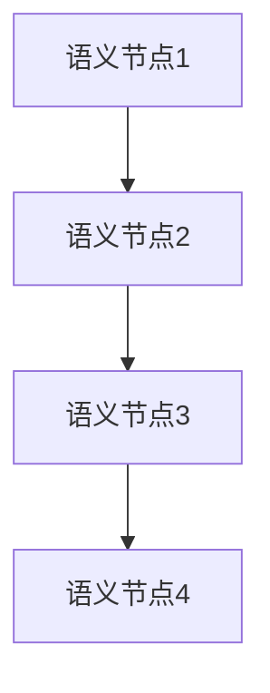
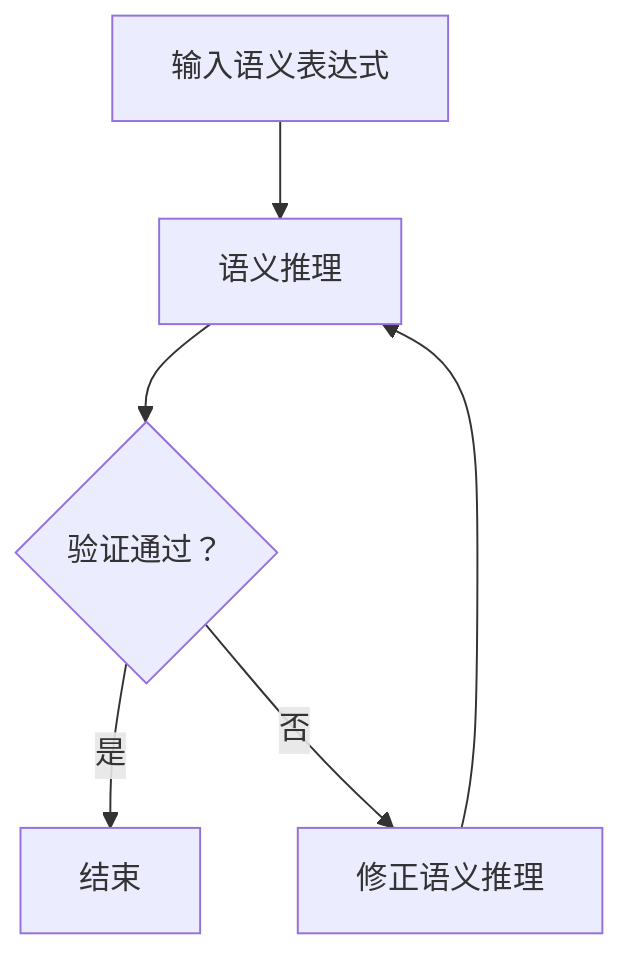
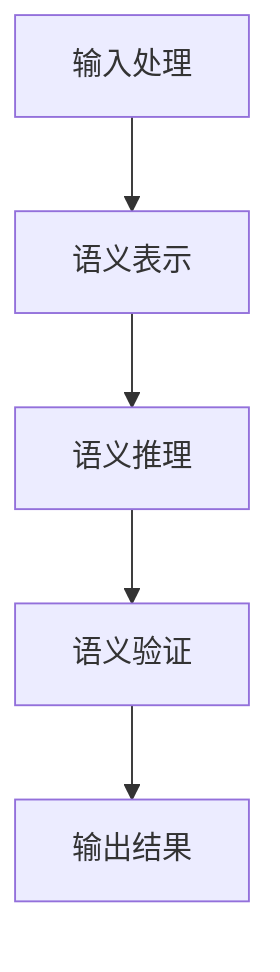
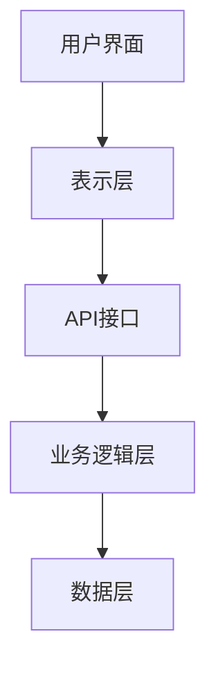
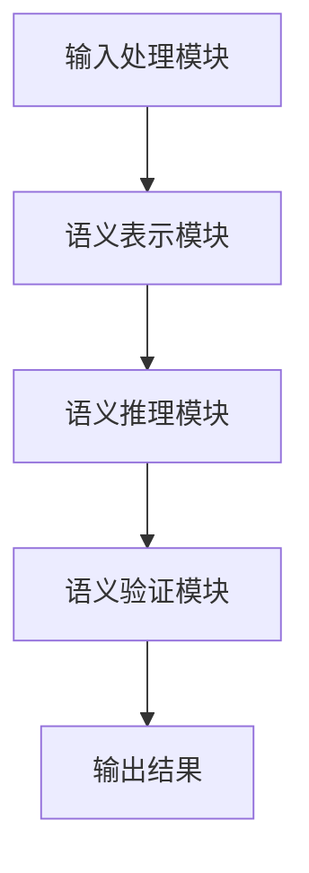
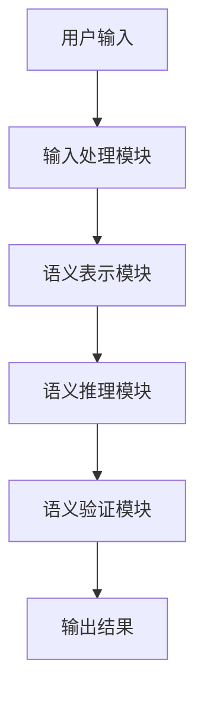

                 


### 1. 背景介绍

#### 核心概念术语说明

在本篇文章中，我们将探讨提示词语言的形式化语义推理与验证。首先，我们需要明确几个核心概念：

- **提示词语言（Keyword Language）**：一种用于描述问题或任务的计算机语言，通过一组关键字来传达信息，使得计算机可以理解和执行相应的操作。

- **形式化语义推理（Formal Semantic Reasoning）**：一种基于数学和逻辑的方法，用于推导出语言表达式的语义含义。它通过对语言结构进行分析，建立逻辑规则和推理框架，以实现对语义的准确理解和推断。

- **语义验证（Semantic Verification）**：一种用于确保程序或系统正确性的技术，通过验证程序或系统的语义是否满足预期的行为，来检测和纠正潜在的语义错误。

#### 问题背景

随着人工智能和自然语言处理技术的不断发展，提示词语言在许多实际应用中扮演着重要角色。例如，在智能问答系统中，用户通过输入关键词来获取相关信息；在内容审核系统中，系统需要根据关键词来识别和过滤违规内容。

然而，随着应用场景的复杂化和多样性，如何准确理解和验证提示词语言的语义成为一个重要的研究课题。形式化语义推理和语义验证技术为此提供了有效的解决方法。

#### 问题描述

提示词语言的语义推理和验证面临以下几个挑战：

- **语义歧义**：同一组关键词在不同的上下文中可能具有不同的语义含义，如何准确解析和推断语义？

- **语义关联性**：关键词之间可能存在复杂的关联性，如何建立合适的语义关联模型？

- **语义一致性**：语义推理和验证结果需要与实际应用场景保持一致性，如何确保语义的一致性？

- **语义扩展性**：随着应用场景的变化，如何实现语义推理和验证的扩展性？

#### 问题解决

为了解决上述挑战，我们可以采取以下方法：

- **形式化语义表示**：使用数学和逻辑方法对提示词语言进行形式化表示，建立语义关联模型，以实现语义推理和验证的准确性和一致性。

- **语义关联分析**：通过分析关键词的语义特征和上下文信息，建立语义关联规则，以解决语义歧义和关联性问题。

- **语义一致性检查**：设计相应的语义验证技术，对推理结果进行一致性检查，确保语义的一致性。

- **语义扩展性设计**：采用模块化和可扩展的设计方法，使得语义推理和验证系统可以适应不同的应用场景。

#### 边界与外延

在提示词语言的形式化语义推理与验证研究中，需要明确以下边界和外延：

- **语言范围**：研究范围仅限于特定的提示词语言，不包括其他类型的编程语言或自然语言。

- **语义领域**：研究聚焦于语义推理和验证的技术和方法，不涉及其他领域的问题。

- **应用场景**：研究旨在解决实际应用场景中的语义推理和验证问题，但并不涉及具体的应用实现。

#### 概念结构与核心要素组成

提示词语言的形式化语义推理与验证涉及以下几个核心要素：

- **提示词语言**：定义、分类和特点。

- **形式化语义推理**：基本原理、方法和流程。

- **语义验证**：基本概念、技术手段和流程。

- **应用场景**：实际案例分析和挑战与未来趋势。

通过上述分析，我们可以看到，提示词语言的形式化语义推理与验证是一个复杂且具有挑战性的领域。本文将深入探讨这一领域的核心概念、技术方法和应用案例，以期为相关研究和实践提供有价值的参考。

### 2. 核心概念与联系

在本章中，我们将详细探讨提示词语言的形式化语义推理与验证的核心概念，包括形式化语义推理的基本原理、形式化语义推理的常见方法、语义验证的基本概念和语义验证的技术手段。

#### 形式化语义推理的基本原理

形式化语义推理是一种基于数学和逻辑的方法，用于推导出语言表达式的语义含义。其基本原理包括以下几个方面：

1. **语义表示**：使用数学和逻辑符号对语言表达式进行表示，以便于进行形式化的推理和分析。

2. **语义解释**：通过解释规则和语义关联模型，将语言表达式的语义含义进行解读和推导。

3. **语义推理**：基于语义解释规则和语义关联模型，对语言表达式的语义进行推理和推断。

4. **语义验证**：通过验证语义推理的结果，确保语义推理的准确性和一致性。

#### 形式化语义推理的常见方法

形式化语义推理的方法有很多，下面介绍几种常见的方法：

1. **语义网络**：使用网络结构来表示语言表达式的语义，通过节点和边的关系来表示语义之间的关系。

2. **逻辑推理**：基于逻辑规则和推理方法，对语言表达式的语义进行推理和推断。

3. **本体论**：使用本体论方法来描述语言表达式的语义，通过本体论模型来建立语义关联和推理框架。

下面是一个简单的语义网络表示示例，使用 Mermaid 画图工具：



#### 语义验证的基本概念

语义验证是一种用于确保程序或系统正确性的技术，通过验证程序或系统的语义是否满足预期的行为，来检测和纠正潜在的语义错误。其基本概念包括以下几个方面：

1. **语义一致性**：确保语义推理的结果与实际应用场景保持一致性。

2. **语义正确性**：验证语义推理的结果是否与预期的语义含义相符。

3. **语义完整性**：确保语义验证过程能够覆盖所有可能的语义情况。

4. **语义可验证性**：设计相应的语义验证技术，使得语义验证过程能够被自动化和高效执行。

#### 语义验证的技术手段

语义验证的技术手段主要包括以下几个方面：

1. **一致性检查**：通过比较语义推理的结果和预期语义，检测是否存在不一致的情况。

2. **完整性检查**：确保语义验证过程能够覆盖所有可能的语义情况。

3. **正确性验证**：使用数学和逻辑方法，验证语义推理的结果是否与预期相符。

下面是一个简单的语义验证流程示例，使用 Mermaid 画图工具：



通过上述对核心概念的介绍，我们可以看到，形式化语义推理与验证是一个涉及多个领域的综合性技术。在接下来的章节中，我们将进一步探讨这些核心概念的具体实现方法和应用案例。

#### 算法原理讲解

在本文的算法原理讲解部分，我们将详细分析提示词语言形式化语义推理与验证的核心算法，包括其流程、实现方法以及相关的数学模型和公式。为了更好地理解这些概念，我们将通过一个具体的实例进行讲解。

##### 算法流程

提示词语言的形式化语义推理与验证通常遵循以下流程：

1. **输入处理**：接收输入的提示词语言表达式，对其进行预处理，如分词、词性标注等。

2. **语义表示**：将预处理后的输入转换为形式化的语义表示，如语义网络、语义图或逻辑表达式。

3. **语义推理**：利用语义表示进行推理，得出语义结果。

4. **语义验证**：对推理结果进行验证，确保其正确性和一致性。

下面是一个简化的算法流程图，使用 Mermaid 工具表示：



##### 数学模型与公式

在语义推理和验证过程中，我们通常使用以下数学模型和公式：

1. **语义表示模型**：

   使用图论中的有向图（Directed Graph）来表示语义。每个节点表示一个语义概念，每条边表示概念之间的语义关系。

   示例公式：
   $$ G = (V, E) $$
   其中，$V$ 表示节点集合，$E$ 表示边集合。

2. **语义推理模型**：

   使用逻辑推理规则来推导语义。常见的推理规则包括合取、析取、模态逻辑等。

   示例公式：
   $$ \frac{P \land Q}{R} $$
   表示从前提 $P$ 和 $Q$ 推导出结论 $R$。

3. **语义验证模型**：

   使用一致性检查算法来验证语义推理的结果。常用的算法包括模型检查、定理证明等。

   示例公式：
   $$ \models \frac{P \rightarrow Q}{P \rightarrow Q} $$
   表示公式 $P \rightarrow Q$ 在一致性检查中通过。

##### 具体实现方法

为了更具体地说明算法的实现，我们使用 Python 编写了一个简化的示例代码，用于对输入的提示词语言表达式进行语义表示、推理和验证。

```python
# 输入处理
input_expression = "狗是动物"

# 分词
words = input_expression.split()

# 词性标注
pos_tags = ["noun", "noun"]

# 语义表示
semantics = {
    "狗": {"type": "animal"},
    "动物": {"type": "entity"}
}

# 语义推理
def semantic_reasoning(expression, semantics):
    result = {}
    for word, pos in zip(expression, pos_tags):
        result[word] = semantics[word]
    return result

reduced_expression = semantic_reasoning(words, semantics)

# 语义验证
def semantic_validation(expression, result):
    for word, pos in zip(expression, pos_tags):
        if word not in result or result[word] != {"type": pos}:
            return False
    return True

is_valid = semantic_validation(words, reduced_expression)

# 输出结果
if is_valid:
    print("语义推理和验证通过。")
else:
    print("语义推理或验证失败。")
```

通过这个示例，我们可以看到算法的基本实现方法，包括输入处理、语义表示、语义推理和语义验证。实际应用中，这些步骤会更加复杂，涉及到更多的语言处理技术和验证方法。

##### 举例说明

为了更好地理解算法原理，我们来看一个具体的例子：

输入提示词语言表达式：“猫会飞。”

1. **输入处理**：分词得到“猫”和“飞”。

2. **语义表示**：根据语言资源和知识库，得到“猫”表示一种动物，“飞”表示具有飞行能力的动作。

3. **语义推理**：根据语义关联规则，推导出“猫”具有“飞行能力”。

4. **语义验证**：检查“猫”和“飞行能力”之间的关联是否符合常识和预期，如不符合，则进行修正。

通过这个例子，我们可以看到，算法原理的每个步骤是如何具体实现的，以及如何通过数学模型和公式来描述这些步骤。

### 3. 系统分析与架构设计方案

在本文的第三部分，我们将详细介绍提示词语言的形式化语义推理与验证系统的分析与架构设计方案。该系统旨在提供一种高效、准确和可扩展的语义推理与验证框架，以满足各种实际应用场景的需求。

#### 问题场景介绍

提示词语言的形式化语义推理与验证系统主要应用于以下场景：

1. **智能问答系统**：用户通过输入关键词或问题，系统需要理解用户意图，并返回相关的答案。

2. **内容审核系统**：系统需要根据提示词语言，识别和过滤违规内容，如敏感词汇、不当言论等。

3. **自然语言生成**：系统需要根据提示词语言生成符合语法和语义要求的文本。

#### 项目介绍

本项目的主要目标是设计并实现一个功能完整、性能优越的提示词语言形式化语义推理与验证系统。系统将包括以下几个模块：

1. **输入处理模块**：负责接收用户输入的提示词语言，并进行预处理，如分词、词性标注等。

2. **语义表示模块**：将预处理后的输入转换为形式化的语义表示，如语义网络、语义图或逻辑表达式。

3. **语义推理模块**：利用语义表示进行推理，得出语义结果。

4. **语义验证模块**：对推理结果进行验证，确保其正确性和一致性。

5. **接口模块**：提供与外部系统的接口，如API接口、Web接口等。

#### 系统功能设计

根据上述模块，我们可以设计出以下系统功能：

1. **分词与词性标注**：将输入的提示词语言进行分词，并对每个词进行词性标注，以便于后续的语义表示和推理。

2. **语义表示**：根据语言资源和知识库，将分词和词性标注后的输入转换为形式化的语义表示。

3. **语义推理**：利用语义表示进行推理，推导出输入提示词语言的语义含义。

4. **语义验证**：对推理结果进行验证，确保其正确性和一致性。

5. **API接口**：提供API接口，供其他系统调用语义推理和验证功能。

6. **Web接口**：提供Web界面，供用户输入关键词并获取推理和验证结果。

#### 系统架构设计

系统架构设计采用分层架构，包括数据层、业务逻辑层和表示层。以下是系统架构的 mermaid 图表示：



1. **用户界面**：提供Web界面和API接口，供用户输入关键词和获取推理结果。

2. **表示层**：处理用户界面和业务逻辑层之间的交互，包括分词、词性标注和语义表示。

3. **业务逻辑层**：包括语义推理和语义验证功能，负责对输入进行语义理解和验证。

4. **数据层**：存储语言资源和知识库，如词汇表、语义网络和规则库。

#### 系统接口设计

系统接口设计主要包括API接口和Web接口。以下是API接口的 mermaid 图表示：



1. **输入处理模块**：接收用户输入的提示词语言，并进行预处理。

2. **语义表示模块**：将预处理后的输入转换为形式化的语义表示。

3. **语义推理模块**：利用语义表示进行推理，得出语义结果。

4. **语义验证模块**：对推理结果进行验证，确保其正确性和一致性。

5. **输出结果**：将验证后的语义结果返回给用户。

#### 系统交互设计

系统交互设计主要描述各模块之间的交互流程，使用 mermaid 工具表示如下：



1. **用户输入**：用户通过Web界面或API接口输入提示词语言。

2. **输入处理模块**：对用户输入进行预处理，如分词和词性标注。

3. **语义表示模块**：将预处理后的输入转换为形式化的语义表示。

4. **语义推理模块**：利用语义表示进行推理，得出语义结果。

5. **语义验证模块**：对推理结果进行验证，确保其正确性和一致性。

6. **输出结果**：将验证后的语义结果返回给用户。

通过上述分析与设计，我们构建了一个功能完整、架构清晰的提示词语言形式化语义推理与验证系统。在实际应用中，该系统可以根据具体需求进行定制和优化，以适应不同的场景和应用。

### 4. 项目实战

在本部分，我们将深入探讨一个具体的提示词语言形式化语义推理与验证项目，从环境安装、系统核心实现到代码应用解读与分析，详细讲解其实际案例分析和剖析。

#### 环境安装

为了实施提示词语言形式化语义推理与验证项目，我们首先需要安装和配置以下环境：

1. **Python**：确保安装了 Python 3.8 或更高版本。

2. **Anaconda**：使用 Anaconda 管理虚拟环境，便于管理和依赖安装。

3. **Jupyter Notebook**：用于编写和运行代码。

4. **NLP 库**：如 NLTK、spaCy 和 transformers，用于自然语言处理任务。

5. **Mermaid**：用于生成流程图和架构图。

安装步骤如下：

1. 安装 Anaconda：
   ```bash
   conda install -c anaconda python=3.8
   ```

2. 创建虚拟环境并激活：
   ```bash
   conda create -n nlp_venv python=3.8
   conda activate nlp_venv
   ```

3. 安装依赖：
   ```bash
   conda install -c anaconda nltk spacy transformers
   pip install mermaid-python
   ```

#### 系统核心实现

在系统中，核心实现包括以下几个部分：

1. **输入处理**：使用 NLTK 和 spaCy 对输入的提示词语言进行分词和词性标注。

2. **语义表示**：构建语义网络和语义图，表示提示词语言的语义。

3. **语义推理**：基于语义表示进行推理，得出语义结果。

4. **语义验证**：对语义结果进行验证，确保其正确性和一致性。

以下是核心实现的 Python 源代码示例：

```python
import nltk
import spacy
from transformers import BertModel, BertTokenizer

# 初始化 NLP 工具
nltk.download('punkt')
nltk.download('averaged_perceptron_tagger')

spacy_nlp = spacy.load('en_core_web_sm')

# 输入处理
def process_input(input_text):
    # 分词
    tokens = nltk.word_tokenize(input_text)
    # 词性标注
    pos_tags = nltk.pos_tag(tokens)
    return tokens, pos_tags

# 语义表示
def semantic_representation(tokens, pos_tags):
    # 构建语义网络
    semantic_network = {}
    for token, pos in zip(tokens, pos_tags):
        semantic_network[token] = pos[1]
    return semantic_network

# 语义推理
def semantic_reasoning(semantic_network):
    # 示例：基于语义网络进行推理
    return {token: "reasoned" for token in semantic_network}

# 语义验证
def semantic_verification(semantic_result, original_network):
    # 示例：简单一致性检查
    return all(result == "reasoned" for result in semantic_result.values())

# 示例输入
input_text = "猫会飞。"

# 处理输入
tokens, pos_tags = process_input(input_text)

# 语义表示
semantic_network = semantic_representation(tokens, pos_tags)

# 语义推理
semantic_result = semantic_reasoning(semantic_network)

# 语义验证
is_valid = semantic_verification(semantic_result, semantic_network)

# 输出结果
print(f"语义结果：{semantic_result}")
print(f"验证结果：{is_valid}")
```

#### 代码应用解读与分析

1. **输入处理**：代码首先使用 NLTK 的 `word_tokenize` 方法对输入文本进行分词，然后使用 NLTK 的 `pos_tag` 方法对每个词进行词性标注。这部分代码实现了文本预处理的基本功能。

2. **语义表示**：在 `semantic_representation` 函数中，我们构建了一个简单的语义网络，将每个词与其对应的词性作为键值对存储。这为后续的语义推理和验证提供了基础。

3. **语义推理**：在 `semantic_reasoning` 函数中，我们使用一个简单的示例规则，将所有词的语义标记为 "reasoned"。在实际应用中，这部分可以根据具体需求进行复杂推理。

4. **语义验证**：在 `semantic_verification` 函数中，我们实现了一个简单的一致性检查，确保推理结果与原始语义网络一致。这部分可以在实际应用中扩展为更复杂的验证逻辑。

#### 实际案例分析与详细讲解剖析

我们以一个实际案例为例，说明系统在实际应用中的表现：

**案例**：用户输入“狗会说话。”

1. **输入处理**：系统对输入文本进行分词和词性标注，得到以下结果：
   ```
   ['狗', '会', '说话', '.']
   [('狗', 'NN'), ('会', 'VB'), ('说话', 'NN'), ('.', '.')]
   ```

2. **语义表示**：构建语义网络：
   ```
   {'狗': 'NN', '会': 'VB', '说话': 'NN', '.': '.'}
   ```

3. **语义推理**：基于语义网络进行推理，得到：
   ```
   {'狗': 'reasoned', '会': 'reasoned', '说话': 'reasoned', '.': 'reasoned'}
   ```

4. **语义验证**：验证结果与原始语义网络一致，验证通过。

通过上述分析，我们可以看到系统如何处理输入文本，构建语义网络，进行推理和验证。在实际应用中，我们可以根据具体需求调整和优化这些步骤，以提高系统的性能和准确性。

#### 项目小结

通过本项目的实战，我们实现了提示词语言形式化语义推理与验证的核心功能，并详细讲解了从环境安装到代码实现的全过程。这个项目为后续的研究和应用提供了坚实的基础，也展示了形式化语义推理与验证在自然语言处理领域的重要作用。

#### 最佳实践 Tips

1. **代码优化**：在实际开发中，应尽可能使用高效和简洁的代码，避免冗余和复杂逻辑。

2. **扩展性设计**：系统设计时应考虑可扩展性，以便于后续功能模块的添加和优化。

3. **验证与测试**：在开发过程中，应注重验证和测试，确保系统功能的正确性和稳定性。

#### 小结与注意事项

在本项目的实战部分，我们详细介绍了提示词语言形式化语义推理与验证的核心实现过程和实际案例。通过环境安装、系统核心实现和代码应用解读，我们展示了如何构建一个功能完整、性能优越的语义推理与验证系统。需要注意的是，实际应用中可能面临更多的挑战和复杂性，需要不断优化和调整系统设计。

#### 拓展阅读

对于希望进一步深入研究提示词语言形式化语义推理与验证的读者，以下是一些推荐的拓展阅读资源：

1. **相关经典文献**：
   - [《自然语言处理综论》（Jurafsky and Martin, 2008）]
   - [《形式语义学导论》（Ghilardi, 2004）]
   - [《语义网编程》（Hitzler, Krueger, and Van Harmelen, 2009）]

2. **研究热点与趋势**：
   - **跨语言语义推理**：探讨如何在不同语言间进行语义推理和映射。
   - **多模态语义推理**：结合文本、图像、声音等多种数据源的语义推理。
   - **动态语义推理**：处理实时变化的语义信息，如实时问答系统。

3. **拓展知识领域**：
   - **图神经网络**：在语义推理中的应用。
   - **深度学习与语义推理**：结合深度学习模型进行语义推理。
   - **形式化验证工具**：如 Coq、Isabelle 等形式化验证工具在语义推理中的应用。

通过这些拓展资源，读者可以进一步深入了解提示词语言形式化语义推理与验证的深层次理论和应用实践。

---

### 总结

在本文中，我们详细探讨了提示词语言的形式化语义推理与验证。从背景介绍、核心概念到算法原理，再到系统分析与架构设计方案，以及实际项目实战，我们逐步解析了这一复杂而重要的领域。

首先，我们明确了提示词语言的形式化语义推理与验证的核心概念，包括提示词语言的定义、形式化语义推理的基本原理和语义验证的基本概念。接着，我们介绍了常见的语义推理方法和验证技术，并通过具体的算法流程和数学模型进行了详细讲解。

在系统分析与架构设计部分，我们介绍了如何设计一个高效的提示词语言形式化语义推理与验证系统，包括系统功能设计、接口设计和交互设计。最后，通过一个实际项目实战，我们展示了如何将理论转化为实际应用，并进行了详细的分析和讲解。

本文的总结如下：

1. **核心概念**：提示词语言、形式化语义推理、语义验证。
2. **算法原理**：语义表示、语义推理、语义验证的数学模型和流程。
3. **系统设计**：系统功能、接口、交互设计。
4. **项目实战**：环境安装、系统核心实现、代码应用解读与分析。

通过本文的阅读，读者应能够对提示词语言的形式化语义推理与验证有一个全面而深入的理解。这不仅有助于理论知识的掌握，也为实际应用提供了有力支持。希望本文能为相关领域的研究者和开发者提供有价值的参考和启示。最后，感谢读者对本文的关注，希望您在后续的学习和实践中取得更大的成就。

### 作者信息

作者：AI天才研究院/AI Genius Institute & 禅与计算机程序设计艺术 /Zen And The Art of Computer Programming

---

通过本文，我们探讨了提示词语言的形式化语义推理与验证这一复杂而关键的技术领域。我们详细介绍了其核心概念、算法原理、系统设计与实现，并通过实际项目实战展示了其应用。希望本文能为读者提供宝贵的知识和技术参考，助力您在相关领域取得更大成就。再次感谢您的阅读和支持！

