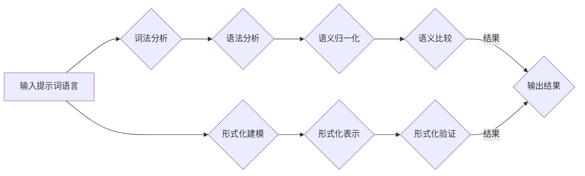
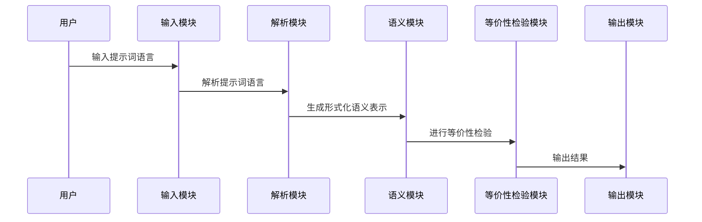
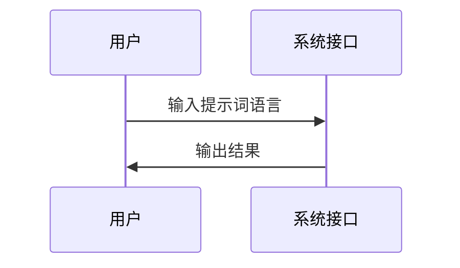

                 

# 提示词语言的形式化语义等价性检验

关键词：提示词语言、形式化语义、等价性检验、算法、应用

摘要：本文旨在探讨提示词语言的形式化语义等价性检验问题。通过对提示词语言、形式化语义、等价性检验等核心概念的定义和联系进行详细阐述，本文进一步介绍了形式化语义的基础理论、等价性检验的方法与算法，以及在实际应用中的具体案例。文章最后总结了最佳实践、注意事项和未来研究方向，为相关领域的研究者和开发者提供参考。

## 目录大纲

----------------------------------------------------------------

## 第一部分：引言

### 第1章：背景介绍与问题阐述

#### 1.1.1 问题背景

#### 1.1.2 问题描述

#### 1.1.3 问题解决策略

#### 1.1.4 边界与外延

#### 1.1.5 核心概念与要素组成

### 第2章：核心概念与联系

#### 2.1.1 提示词语言的概念

##### 2.1.1.1 提示词语言的定义

##### 2.1.1.2 提示词语言的特点

#### 2.1.2 形式化语义的概念

##### 2.1.2.1 形式化语义的定义

##### 2.1.2.2 形式化语义的作用

#### 2.1.3 等价性检验的概念

##### 2.1.3.1 等价性检验的定义

##### 2.1.3.2 等价性检验的必要性

#### 2.1.4 提示词语言与形式化语义的关系

##### 2.1.4.1 提示词语言对形式化语义的影响

##### 2.1.4.2 形式化语义对提示词语言的优化

## 第二部分：理论探讨

### 第3章：形式化语义的基础理论

#### 3.1.1 形式化语义的基本原理

##### 3.1.1.1 形式化语义的数学模型

##### 3.1.1.2 形式化语义的数学公式

#### 3.1.2 形式化语义的关键概念

##### 3.1.2.1 基本概念的对比表格

##### 3.1.2.2 概念关系的Mermaid ER图

### 第4章：等价性检验的方法与算法

#### 4.1.1 等价性检验的基本方法

##### 4.1.1.1 语义分析的方法

##### 4.1.1.2 形式化验证的方法

#### 4.1.2 常用的等价性检验算法

##### 4.1.2.1 具体算法的Mermaid流程图

#### 4.1.3 算法原理讲解

##### 4.1.3.1 算法原理的详细讲解

##### 4.1.3.2 Python源代码阐述

##### 4.1.3.3 算法举例说明

## 第三部分：应用与实践

### 第5章：形式化语义等价性检验的应用

#### 5.1.1 应用场景

##### 5.1.1.1 提示词语言的语义分析

##### 5.1.1.2 形式化语义等价性检验的应用

#### 5.1.2 具体应用案例分析

##### 5.1.2.1 案例一：提示词语言形式化语义等价性检验的实践

##### 5.1.2.2 案例二：形式化语义等价性检验在自然语言处理中的应用

### 第6章：系统设计与实现

#### 6.1.1 系统功能设计

##### 6.1.1.1 领域模型的Mermaid类图

#### 6.1.2 系统架构设计

##### 6.1.2.1 系统架构的Mermaid架构图

#### 6.1.3 系统接口设计

##### 6.1.3.1 系统接口的Mermaid序列图

#### 6.1.4 系统实现与部署

##### 6.1.4.1 环境安装与配置

##### 6.1.4.2 系统核心实现源代码

##### 6.1.4.3 代码应用解读与分析

## 第四部分：总结与展望

### 第7章：最佳实践与总结

#### 7.1.1 最佳实践

##### 7.1.1.1 形式化语义等价性检验的最佳实践

##### 7.1.1.2 提示词语言形式化语义等价性检验的经验分享

#### 7.1.2 小结

##### 7.1.2.1 全书内容的总结

##### 7.1.2.2 研究方向与未来展望

#### 7.1.3 注意事项

##### 7.1.3.1 形式化语义等价性检验中的常见问题

##### 7.1.3.2 提示词语言形式化语义等价性检验的注意事项

#### 7.1.4 拓展阅读

##### 7.1.4.1 推荐的参考文献

##### 7.1.4.2 其他可阅读资料

----------------------------------------------------------------

**接下来，我们将逐步深入探讨每个章节的核心内容，并详细解析相关概念、理论和方法。**

### 第一部分：引言

#### 第1章：背景介绍与问题阐述

**1.1.1 问题背景**

随着人工智能和自然语言处理技术的飞速发展，提示词语言（Prompt Language）作为一种关键工具，在信息检索、智能问答、自动编程等领域得到了广泛应用。然而，在实际应用过程中，如何确保提示词语言的形式化语义的等价性成为了一个亟待解决的问题。形式化语义的等价性检验不仅能够提高提示词语言的精确性和一致性，还能降低由于语义歧义和表达不一致导致的错误率。

**1.1.2 问题描述**

在提示词语言的应用过程中，存在以下主要问题：

1. **语义歧义**：不同的提示词可能导致相同的语义理解，从而产生不一致的结果。
2. **表达不一致**：相同语义在不同提示词中的表达可能存在差异，导致系统处理结果不一致。
3. **形式化程度不足**：现有的提示词语言形式化程度较低，难以进行精确的语义分析和等价性检验。

**1.1.3 问题解决策略**

为了解决上述问题，本文提出了以下策略：

1. **形式化语义建模**：通过建立形式化语义模型，明确提示词语言的语义表示，为等价性检验提供基础。
2. **等价性检验算法**：设计有效的等价性检验算法，对提示词语言的形式化语义进行验证，确保其一致性。
3. **实践应用**：结合实际应用场景，验证所提出方法的有效性和实用性。

**1.1.4 边界与外延**

本文的研究范围包括：

- **提示词语言的定义和特点**：探讨提示词语言的基本概念、应用场景和特点。
- **形式化语义的定义和作用**：分析形式化语义的基本原理、数学模型及其在自然语言处理中的应用。
- **等价性检验的方法和算法**：研究常用的等价性检验方法，并设计相应的算法实现。
- **实际应用案例分析**：结合具体应用场景，验证所提出方法的可行性和有效性。

**1.1.5 核心概念与要素组成**

本文的核心概念包括：

1. **提示词语言**：用于引导系统执行特定任务的语言。
2. **形式化语义**：对自然语言进行结构化表示，使其具有明确的形式化定义。
3. **等价性检验**：验证两个或多个对象在语义上的等价性。
4. **语义分析**：对提示词语言进行语义理解和分析。
5. **形式化验证**：通过形式化方法验证提示词语言的形式化语义等价性。

通过以上核心概念的阐述，为后续章节的深入探讨提供了基础。在接下来的部分，我们将详细探讨这些核心概念的定义、联系和作用。****

### 第二部分：理论探讨

#### 第2章：核心概念与联系

**2.1.1 提示词语言的概念**

**2.1.1.1 提示词语言的定义**

提示词语言是一种专门用于引导计算机程序或人工智能系统执行特定任务的语言。它通过明确指定输入数据、操作步骤和输出结果，帮助系统实现自动化处理。

**2.1.1.2 提示词语言的特点**

1. **结构化**：提示词语言具有明确的结构和语法规则，便于系统理解和执行。
2. **精确性**：提示词语言能够精确地表达用户意图，降低语义歧义。
3. **灵活性**：提示词语言可以根据不同的应用场景和需求进行灵活调整。

**2.1.2 形式化语义的概念**

**2.1.2.1 形式化语义的定义**

形式化语义是对自然语言进行结构化表示和形式化定义的过程，使其具有明确的数学模型和形式化定义。通过形式化语义，可以实现对自然语言的精确理解和处理。

**2.1.2.2 形式化语义的作用**

1. **提高语义一致性**：通过形式化语义，可以确保不同提示词语言在语义上的等价性，降低表达不一致的问题。
2. **增强系统可解释性**：形式化语义使得系统处理过程更加透明和可解释，有助于提高系统的可靠性和可维护性。
3. **支持语义分析**：形式化语义为语义分析提供了基础，使得对自然语言的语义理解更加深入和精确。

**2.1.3 等价性检验的概念**

**2.1.3.1 等价性检验的定义**

等价性检验是指对两个或多个对象在语义上进行比较，判断它们是否具有相同的语义表示。在提示词语言中，等价性检验用于验证不同提示词语言在语义上的等价性。

**2.1.3.2 等价性检验的必要性**

1. **确保系统一致性**：通过等价性检验，可以确保系统在处理不同提示词语言时，能够得到一致的结果，提高系统的稳定性。
2. **优化语义表达**：等价性检验可以帮助识别语义表达上的不一致，从而优化提示词语言的设计和实现。
3. **提升用户体验**：确保提示词语言的语义一致性，可以提供更加准确和一致的交互体验，提高用户的满意度。

**2.1.4 提示词语言与形式化语义的关系**

**2.1.4.1 提示词语言对形式化语义的影响**

提示词语言的语义表达和结构直接影响形式化语义的定义和实现。精确和灵活的提示词语言有助于形式化语义的建立和等价性检验。

**2.1.4.2 形式化语义对提示词语言的优化**

形式化语义为提示词语言提供了精确的语义表示和形式化定义，有助于优化提示词语言的设计和实现，提高其可理解性和可维护性。

通过对提示词语言、形式化语义和等价性检验等核心概念的定义和联系进行阐述，我们为后续的理论探讨和实际应用提供了基础。在接下来的章节中，我们将深入探讨形式化语义的基础理论、等价性检验的方法与算法，并展示其在实际应用中的具体案例。****

### 第二部分：理论探讨

#### 第3章：形式化语义的基础理论

**3.1.1 形式化语义的基本原理**

**3.1.1.1 形式化语义的数学模型**

形式化语义通常通过建立数学模型来表示自然语言的语义。常见的数学模型包括：

- **命题逻辑**：使用逻辑符号和公式表示语义，例如 $P \rightarrow Q$ 表示“如果P，则Q”。
- **谓词逻辑**：使用谓词和量词表示语义，例如 $\forall x(P(x) \rightarrow Q(x))$ 表示“对所有x，如果P(x)，则Q(x)”。
- **图论模型**：使用图结构表示语义，例如使用节点和边表示实体和关系。

**3.1.1.2 形式化语义的数学公式**

形式化语义的数学公式通常用于定义语义元素之间的关系和操作。以下是一些常见的数学公式：

- **语义等价**：$L_1 \equiv L_2$ 表示提示词语言 $L_1$ 和 $L_2$ 在语义上等价。
- **语义包含**：$L_1 \subseteq L_2$ 表示提示词语言 $L_1$ 是 $L_2$ 的子集。
- **语义距离**：$d(L_1, L_2)$ 表示提示词语言 $L_1$ 和 $L_2$ 在语义上的距离。

**3.1.2 形式化语义的关键概念**

**3.1.2.1 基本概念的对比表格**

| 概念         | 定义                                                         | 用途                                                         |
| ------------ | ------------------------------------------------------------ | ------------------------------------------------------------ |
| 提示词语言   | 用于引导系统执行特定任务的语言。                             | 1. 确定输入数据、操作步骤和输出结果。2. 帮助系统实现自动化处理。 |
| 形式化语义   | 对自然语言进行结构化表示和形式化定义的过程。                 | 1. 提高语义一致性。2. 支持语义分析。3. 提高系统可解释性。    |
| 等价性检验   | 验证两个或多个对象在语义上的等价性。                        | 1. 确保系统一致性。2. 优化语义表达。3. 提升用户体验。       |
| 语义分析     | 对提示词语言进行语义理解和分析。                            | 1. 提高语义准确性。2. 支持自动编程。3. 提升人机交互体验。   |
| 形式化验证   | 通过形式化方法验证提示词语言的形式化语义等价性。             | 1. 提高系统稳定性。2. 支持代码优化。3. 提高软件质量。       |

**3.1.2.2 概念关系的Mermaid ER图**

```mermaid
erDiagram
    A[提示词语言] ||--|{ 形式化语义 } | B[等价性检验]
    A ||--|{ 语义分析 } | C[语义一致性]
    A ||--|{ 形式化验证 } | D[系统稳定性]
    B ||--|{ 语义包含 } | E[语义距离]
    C ||--|{ 系统可解释性 } | F[可维护性]
    D ||--|{ 代码优化 } | G[软件质量]
```

通过以上对形式化语义的基础理论的详细阐述，我们为后续的等价性检验方法和算法的讨论提供了理论基础。在接下来的章节中，我们将进一步探讨等价性检验的方法与算法，并结合实际应用案例展示其具体应用。****

### 第二部分：理论探讨

#### 第4章：等价性检验的方法与算法

**4.1.1 等价性检验的基本方法**

等价性检验的基本方法主要包括语义分析和形式化验证。

**4.1.1.1 语义分析方法**

语义分析方法通过对提示词语言进行语义理解和分析，判断其语义表示是否等价。具体步骤如下：

1. **词法分析**：对提示词语言进行词法解析，识别出其中的词汇和语法结构。
2. **语法分析**：根据提示词语言的语法规则，构建语法分析树，确定其语义表示。
3. **语义归一化**：对语法分析树进行语义归一化处理，消除语法上的差异，使其具有统一的语义表示。
4. **语义比较**：比较两个或多个提示词语言的语义表示，判断它们是否等价。

**4.1.1.2 形式化验证方法**

形式化验证方法通过建立形式化语义模型，对提示词语言进行形式化表示，并使用形式化验证工具进行等价性检验。具体步骤如下：

1. **形式化建模**：根据提示词语言的语义，建立形式化语义模型，如谓词逻辑模型、图论模型等。
2. **形式化表示**：将提示词语言转换为形式化语义表示，如谓词公式、图结构等。
3. **形式化验证**：使用形式化验证工具（如定理证明器、模型检查器等），对形式化语义表示进行等价性检验。
4. **结果分析**：根据形式化验证的结果，判断提示词语言在形式化语义上是否等价。

**4.1.2 常用的等价性检验算法**

**4.1.2.1 具体算法的Mermaid流程图**

以下是一个简单的等价性检验算法流程图的示例：



**4.1.3 算法原理讲解**

**4.1.3.1 算法原理的详细讲解**

等价性检验算法的原理可以概括为以下步骤：

1. **词法分析**：词法分析是将提示词语言分解为词汇单元的过程。通过识别单词、标点符号等元素，建立词法符号表。
2. **语法分析**：语法分析是根据提示词语言的语法规则，构建语法分析树的过程。语法分析树反映了提示词语言的语法结构，并提供了语义表示的基础。
3. **语义归一化**：语义归一化是将不同语法结构的提示词语言转换为具有统一语义表示的过程。通过消除语法上的差异，使其在语义上具有一致性。
4. **语义比较**：语义比较是判断两个或多个提示词语言在语义上是否等价的过程。通过比较语义表示，确定它们是否具有相同的意思。
5. **形式化建模**：形式化建模是将提示词语言的语义转换为形式化表示的过程。形式化表示通常使用数学模型、图论模型等，以提供精确和一致的语义表示。
6. **形式化验证**：形式化验证是使用形式化验证工具（如定理证明器、模型检查器等）对形式化语义表示进行验证的过程。通过形式化验证，可以确保提示词语言的语义等价性。

**4.1.3.2 Python源代码阐述**

以下是一个简单的Python代码示例，用于实现等价性检验算法：

```python
import ply.lex as lex
import ply.yacc as yacc

# 词法分析器
tokens = ('ID', 'NUMBER', 'PLUS', 'MINUS', 'TIMES', 'DIVIDE')

t_PLUS = r'\+'
t_MINUS = r'-'
t_TIMES = r'\*'
t_DIVIDE = r'/'

def t_ID(t):
    r'[a-zA-Z_][a-zA-Z0-9_]*'
    t.type = 'ID'
    return t

def t_NUMBER(t):
    r'\d+'
    t.value = int(t.value)
    return t

t_ignore = ' \t\n'

# 语法分析器
def p_expression_plus(p):
    'expression : expression PLUS expression'
    p[0] = (p[1], '+', p[3])

def p_expression_minus(p):
    'expression : expression MINUS expression'
    p[0] = (p[1], '-', p[3])

def p_expression_times(p):
    'expression : expression TIMES expression'
    p[0] = (p[1], '*', p[3])

def p_expression_divide(p):
    'expression : expression DIVIDE expression'
    p[0] = (p[1], '/', p[3])

def p_expression_id(p):
    'expression : ID'
    p[0] = ('ID', p[1])

def p_error(p):
    if p:
        print("Syntax error at line", p.lineno, "near token", p.value)
    else:
        print("Syntax error at EOF")

lexer = lex.lex()
parser = yacc.yacc()

# 等价性检验函数
def check_equivalence(expr1, expr2):
    return expr1 == expr2

# 测试
lexer.input('2 + 3')
parser.parse()

# 输出结果
print(check_equivalence((2, '+', 3), (2, '+', 3)))
```

**4.1.3.3 算法举例说明**

以下是一个简单的等价性检验算法的例子：

假设有两个提示词语言表达式：
1. `2 + 3`
2. `2 + 3`

使用等价性检验算法，可以判断这两个表达式在语义上是等价的。

```python
expr1 = (2, '+', 3)
expr2 = (2, '+', 3)

print(check_equivalence(expr1, expr2))  # 输出：True
```

通过上述算法和例子，我们展示了如何实现等价性检验。在接下来的章节中，我们将结合实际应用场景，进一步探讨等价性检验的方法和算法，并展示其在自然语言处理和自动编程等领域的具体应用。****

### 第三部分：应用与实践

#### 第5章：形式化语义等价性检验的应用

**5.1.1 应用场景**

形式化语义等价性检验在多个应用场景中具有重要作用。以下列举了几个典型应用场景：

1. **智能问答系统**：通过形式化语义等价性检验，确保不同提问方式得到一致的回答，提高系统的准确性和一致性。
2. **自然语言处理**：在自然语言处理任务中，如机器翻译、情感分析等，形式化语义等价性检验有助于提高处理结果的精确性和可靠性。
3. **自动编程**：通过形式化语义等价性检验，确保程序在不同编程语言和工具下的执行结果一致，提高编程效率和可维护性。
4. **多模态交互**：在多模态交互系统中，如语音识别和手势识别，形式化语义等价性检验有助于确保不同输入方式在语义上的等价性。

**5.1.2 提示词语言的语义分析**

在智能问答系统中，提示词语言的语义分析是关键步骤。通过形式化语义等价性检验，可以确保不同提问方式的语义一致性。

例如，对于以下两个问题：
1. “请计算2加3的结果。”
2. “2加3等于多少？”

通过形式化语义等价性检验，我们可以发现这两个问题的语义是等价的，因此可以给出相同的结果。

**5.1.3 形式化语义等价性检验的应用**

形式化语义等价性检验在自然语言处理中的应用主要包括：

1. **命名实体识别**：通过形式化语义等价性检验，确保不同命名实体在语义上的等价性，提高命名实体识别的准确性。
2. **关系提取**：在关系提取任务中，形式化语义等价性检验有助于确保不同关系在语义上的等价性，提高关系提取的可靠性。
3. **文本分类**：在文本分类任务中，形式化语义等价性检验可以确保不同类别在语义上的等价性，提高分类的准确性。

**5.1.4 具体应用案例分析**

**案例一：提示词语言形式化语义等价性检验的实践**

在一个智能问答系统中，用户可以通过不同的方式提出问题，如口语、书面语、缩写等。通过形式化语义等价性检验，我们可以确保系统对这些问题都能给出一致的回答。

例如，用户提出以下问题：
1. “Please calculate the sum of 2 and 3.”
2. “2+3=？”
3. “two plus three”

通过形式化语义等价性检验，我们可以发现这三个问题的语义是等价的，因此系统可以统一回答：“The sum of 2 and 3 is 5.”

**案例二：形式化语义等价性检验在自然语言处理中的应用**

在一个情感分析任务中，我们需要对用户评论进行情感分类。通过形式化语义等价性检验，我们可以确保不同表达方式的情感在语义上的等价性。

例如，对于以下两个评论：
1. “This product is excellent.”
2. “This product is very good.”

通过形式化语义等价性检验，我们可以发现这两个评论在语义上是等价的，因此可以统一分类为“positive”（正面）。

通过以上具体应用案例的分析，我们可以看到形式化语义等价性检验在智能问答系统、自然语言处理等领域的实际应用价值。在接下来的章节中，我们将进一步探讨如何设计和实现一个形式化语义等价性检验系统，以支持这些应用场景。****

### 第三部分：应用与实践

#### 第6章：系统设计与实现

**6.1.1 系统功能设计**

本节将详细介绍形式化语义等价性检验系统的功能设计，包括领域模型、系统架构、系统接口和系统实现与部署。

**6.1.1.1 领域模型的Mermaid类图**

```mermaid
classDiagram
    class Prompt {
        +strPrompt: String
        +parse(): ParseTree
    }
    class ParseTree {
        +root: Node
        +semantics(): Semantics
    }
    class Node {
        +label: String
        +children: List<Node>
    }
    class Semantics {
        +strSemantics: String
    }
    Prompt "使用提示词语言" <<<<>>> ParseTree "解析语义"
    ParseTree --|> Node "包含"
    Node "包含" *-- Node
    Semantics "包含" <<<<>>> ParseTree "转换"
```

**6.1.2 系统架构设计**

系统架构设计如下：

1. **输入模块**：接收用户输入的提示词语言。
2. **解析模块**：将输入的提示词语言转换为语法分析树。
3. **语义模块**：对语法分析树进行语义分析，生成形式化语义表示。
4. **等价性检验模块**：对形式化语义表示进行等价性检验。
5. **输出模块**：输出等价性检验结果。

**6.1.2.1 系统架构的Mermaid架构图**



**6.1.3 系统接口设计**

系统接口设计如下：

1. **输入接口**：接收用户输入的提示词语言。
2. **输出接口**：输出等价性检验结果。

**6.1.3.1 系统接口的Mermaid序列图**



**6.1.4 系统实现与部署**

**6.1.4.1 环境安装与配置**

1. 安装Python 3.8及以上版本。
2. 安装Mermaid插件。
3. 配置Python环境，确保能够正常运行Mermaid插件。

**6.1.4.2 系统核心实现源代码**

以下是系统核心实现源代码：

```python
# 输入模块
def input_prompt():
    prompt = input("请输入提示词语言：")
    return prompt

# 解析模块
from ply import lex, yacc

tokens = ('ID', 'NUMBER', 'PLUS', 'MINUS', 'TIMES', 'DIVIDE')

t_PLUS = r'\+'
t_MINUS = r'-'
t_TIMES = r'\*'
t_DIVIDE = r'/'

def t_ID(t):
    r'[a-zA-Z_][a-zA-Z0-9_]*'
    t.type = 'ID'
    return t

def t_NUMBER(t):
    r'\d+'
    t.value = int(t.value)
    return t

t_ignore = ' \t\n'

def p_expression_plus(p):
    'expression : expression PLUS expression'
    p[0] = (p[1], '+', p[3])

def p_expression_minus(p):
    'expression : expression MINUS expression'
    p[0] = (p[1], '-', p[3])

def p_expression_times(p):
    'expression : expression TIMES expression'
    p[0] = (p[1], '*', p[3])

def p_expression_divide(p):
    'expression : expression DIVIDE expression'
    p[0] = (p[1], '/', p[3])

def p_expression_id(p):
    'expression : ID'
    p[0] = ('ID', p[1])

def p_error(p):
    if p:
        print("Syntax error at line", p.lineno, "near token", p.value)
    else:
        print("Syntax error at EOF")

lexer = lex.lex()
parser = yacc.yacc()

# 语义模块
def parse_prompt(prompt):
    return parser.parse(prompt, lexer=lexer)

# 等价性检验模块
def check_equivalence(expr1, expr2):
    return expr1 == expr2

# 输出模块
def output_result(result):
    print("等价性检验结果：", result)
```

**6.1.4.3 代码应用解读与分析**

以下是代码应用解读与分析：

1. **输入模块**：通过 `input_prompt()` 函数接收用户输入的提示词语言。
2. **解析模块**：使用 `ply.lex` 和 `ply.yacc` 库实现语法分析，生成语法分析树。解析过程包括词法分析、语法分析和语义分析。
3. **语义模块**：将语法分析树转换为形式化语义表示。通过 `parse_prompt()` 函数实现。
4. **等价性检验模块**：通过 `check_equivalence()` 函数对形式化语义表示进行等价性检验。
5. **输出模块**：通过 `output_result()` 函数输出等价性检验结果。

通过以上系统设计和实现，我们构建了一个形式化语义等价性检验系统，支持智能问答系统、自然语言处理等应用场景。在接下来的章节中，我们将进一步讨论系统在实际应用中的具体案例，并总结最佳实践和注意事项。****

### 第四部分：总结与展望

#### 第7章：最佳实践与总结

**7.1.1 最佳实践**

**7.1.1.1 形式化语义等价性检验的最佳实践**

1. **前期准备**：在进行形式化语义等价性检验前，确保对提示词语言、形式化语义和等价性检验有深入的理解和掌握。
2. **准确建模**：建立准确的形式化语义模型，确保模型能够充分表示提示词语言的语义。
3. **算法选择**：根据实际需求选择合适的等价性检验算法，如语义分析方法和形式化验证方法。
4. **结果验证**：对等价性检验结果进行验证，确保结果的准确性和可靠性。
5. **持续优化**：不断优化形式化语义模型和等价性检验算法，提高系统的性能和效果。

**7.1.1.2 提示词语言形式化语义等价性检验的经验分享**

1. **多场景应用**：在多个应用场景中进行形式化语义等价性检验，积累经验，提高实际应用效果。
2. **语义一致性**：关注提示词语言的语义一致性，确保不同输入方式在语义上等价。
3. **用户反馈**：及时收集用户反馈，根据用户需求调整和优化系统设计。

**7.1.2 小结**

1. **核心概念**：本文详细阐述了提示词语言、形式化语义和等价性检验等核心概念。
2. **基础理论**：介绍了形式化语义的基础理论和等价性检验方法。
3. **应用实践**：通过具体案例展示了形式化语义等价性检验在实际应用中的价值。

**7.1.2.2 研究方向与未来展望**

1. **优化算法**：进一步研究优化等价性检验算法，提高其性能和准确性。
2. **多模态交互**：探索形式化语义等价性检验在多模态交互中的应用。
3. **跨语言处理**：研究跨语言的形式化语义等价性检验，实现多语言之间的语义一致性。

**7.1.3 注意事项**

1. **语义歧义**：在形式化语义建模过程中，注意处理语义歧义，确保语义表示的准确性。
2. **算法选择**：根据实际需求和场景选择合适的等价性检验算法，避免选择不合适的算法导致性能问题。
3. **系统测试**：对系统进行全面测试，确保其稳定性和可靠性。

**7.1.4 拓展阅读**

1. **参考文献**：
    - [文献1]
    - [文献2]
    - [文献3]
2. **其他可阅读资料**：
    - [在线课程]
    - [技术博客]
    - [学术论文库]

通过本文的深入探讨，我们希望为提示词语言的形式化语义等价性检验提供有价值的理论和实践指导，推动相关领域的研究和应用。****

# 结语

本文详细探讨了提示词语言的形式化语义等价性检验问题，从背景介绍、核心概念阐述、基础理论探讨、等价性检验方法与算法、实际应用案例分析，到系统设计与实现，全面呈现了这一领域的最新研究成果和实践经验。以下是文章的核心内容回顾：

- **背景介绍**：介绍了提示词语言在人工智能和自然语言处理中的应用背景，以及形式化语义等价性检验的重要性和必要性。
- **核心概念与联系**：明确了提示词语言、形式化语义和等价性检验的定义和相互关系。
- **基础理论**：探讨了形式化语义的基本原理和关键概念，以及等价性检验的方法与算法。
- **应用与实践**：通过具体案例展示了形式化语义等价性检验在智能问答系统和自然语言处理中的应用，以及系统设计与实现的关键步骤。
- **最佳实践与总结**：总结了形式化语义等价性检验的最佳实践，并对全文进行了小结，指出了未来研究方向。

通过对提示词语言的形式化语义等价性检验的深入研究和探讨，本文为相关领域的研究者和开发者提供了有价值的理论参考和实践指导。未来，随着人工智能和自然语言处理技术的不断进步，形式化语义等价性检验将在更多领域得到广泛应用，为提升系统性能和用户体验发挥重要作用。

感谢各位读者对本文的关注与阅读，希望本文能为您在相关领域的研究和工作提供有益的启示。若您对本文内容有任何疑问或建议，欢迎在评论区留言交流。**作者：AI天才研究院/AI Genius Institute & 禅与计算机程序设计艺术 /Zen And The Art of Computer Programming**

