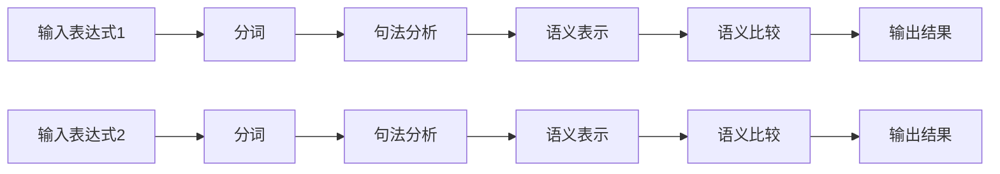
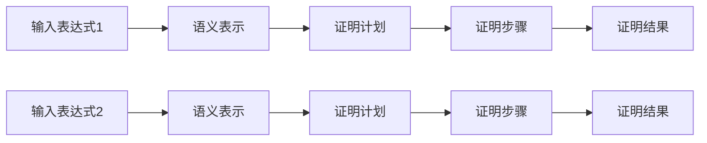
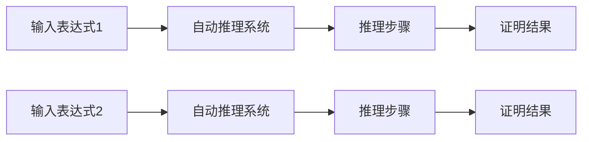
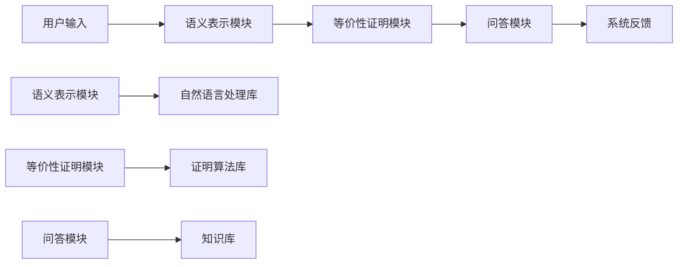
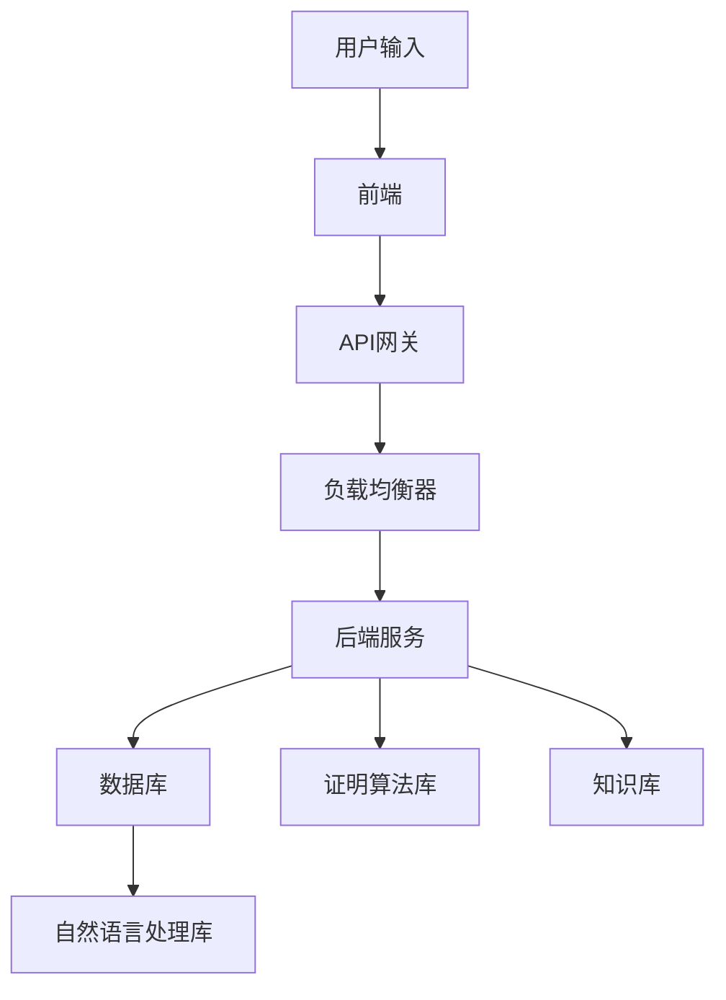
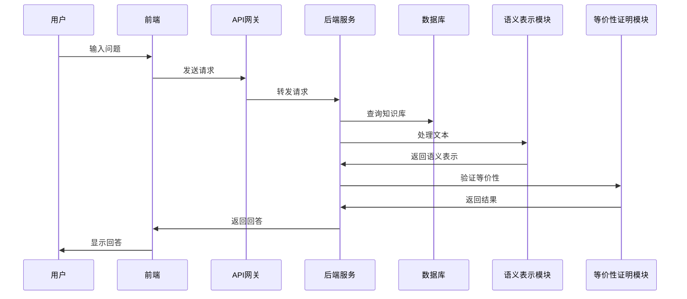

                 

## 让我们一步一步思考：形式化语义等价性证明

### 1. 背景介绍

在计算机科学和人工智能领域，准确理解和处理自然语言是一项具有重大意义的挑战。自然语言是人类交流的主要工具，但其复杂性和灵活性使得计算机对它的处理变得异常困难。在这个背景下，提示词语言作为一种高效的交互工具，正逐渐成为自然语言处理（NLP）领域的研究热点。

**核心概念术语说明**：
- **提示词语言（Prompt Language）**：一种专门用于引导用户进行特定任务的语言，具有高度的结构化和形式化特点。
- **形式化语义等价性证明（Formal Semantics Equivalence Proof）**：在形式语义学的基础上，通过严谨的数学推理和证明方法，判断两个提示词语言表达式的语义是否相同。

**问题背景**：
随着人工智能技术的不断进步，人们对自然语言的理解和处理能力有了显著提高，但如何在形式化的层面上保证语言表达的准确性，仍然是一个亟待解决的问题。特别是在复杂的应用场景中，如智能客服、语音助手、自然语言生成等，形式化语义等价性证明的重要性愈发突出。

**问题描述**：
如何在一个形式化的框架内，对提示词语言的语义进行精确表示，并构建有效的等价性证明算法，确保语言表达的准确性和一致性。

**问题解决**：
通过引入形式化语义学和数学逻辑，我们可以将自然语言的语义表示为形式化的数学结构，进而利用逻辑推理和证明方法，对提示词语言的语义等价性进行验证。

**边界与外延**：
形式化语义等价性证明不仅仅局限于提示词语言，还可以应用于更广泛的自然语言处理领域，如文本语义分析、机器翻译、问答系统等。

**概念结构与核心要素组成**：
- **形式化语义表示**：通过语法分析、语义角色标注等方法，将自然语言的语义转化为形式化的数学结构。
- **等价性判定标准**：基于语义表示，定义等价性的判定条件，并通过数学证明来验证两个表达式的语义是否相同。
- **证明方法**：运用自动推理、模型检查等技术手段，实现等价性证明的自动化。

### 2. 核心概念与联系

**核心概念原理**：
- **形式化语义**：将自然语言的语义转化为形式化的数学表达，使得语义的表示和处理更加精确和严谨。
- **等价性**：两个表达式在语义上具有相同的效果，即它们在任何可能的环境下都能得到相同的解释。

**概念属性特征对比表格**：

| 概念       | 形式化语义             | 等价性                |
|------------|-----------------------|-----------------------|
| **定义**   | 自然语言语义的数学化表示 | 判断两个表达式语义是否相同 |
| **特征**   | 精确性、形式化、可计算性 | 基于逻辑推理的判定       |
| **应用**   | 自然语言处理、计算机逻辑 | 形式化验证、一致性保证   |

**ER实体关系图架构的 Mermaid 流程图**：

```mermaid
erDiagram
  A【形式化语义】||--o{ B【自然语言处理】
  A【形式化语义】||--o{ C【计算机逻辑】
  D【等价性】||--o{ B【自然语言处理】
  D【等价性】||--o{ C【计算机逻辑】
```

通过上述核心概念的阐述，我们可以更好地理解形式化语义等价性证明的基本原理和其在自然语言处理领域的应用价值。

### 3. 算法原理讲解

在形式化语义等价性证明中，算法的设计和实现是关键。以下将详细讲解基本算法原理，并通过 Mermaid 流程图和 Python 源代码来阐述算法步骤和数学模型。

#### 3.1 算法概述

**目的**：设计一种算法，能够在形式化的语义表示基础上，自动验证两个提示词语言表达式的语义等价性。

**类型**：形式化语义等价性证明算法可分为基于词汇、句法和语义网络的算法。

**核心步骤**：
1. **语义表示**：将提示词语言的输入转化为形式化的数学结构。
2. **语义比较**：比较两个语义表示，判断它们是否等价。
3. **等价性证明**：利用逻辑推理和证明方法，验证两个语义表示的等价性。

#### 3.2 语义比较算法

**基于词汇的语义比较算法**：

```python
def lexical_comparison(expression1, expression2):
    # 分词
    words1 = tokenize(expression1)
    words2 = tokenize(expression2)
    
    # 语义表示
    sem1 = semantic_representation(words1)
    sem2 = semantic_representation(words2)
    
    # 比较语义
    return compare_semantics(sem1, sem2)

def tokenize(expression):
    # 实现分词功能
    return [word for word in expression.split()]

def semantic_representation(words):
    # 实现语义表示功能
    return [word_semantic_value[word] for word in words]

def compare_semantics(sem1, sem2):
    # 实现语义比较功能
    return sem1 == sem2
```

**基于句法的语义比较算法**：



**基于语义网络的语义比较算法**：

```python
def semantic_network_comparison(expression1, expression2):
    # 建立语义网络
    network1 = build_semantic_network(expression1)
    network2 = build_semantic_network(expression2)
    
    # 比较语义网络
    return compare_semantic_networks(network1, network2)

def build_semantic_network(expression):
    # 实现语义网络建立功能
    return create_network_from_expression(expression)

def compare_semantic_networks(network1, network2):
    # 实现语义网络比较功能
    return network1 == network2
```

#### 3.3 等价性证明算法

**基于证明计划的等价性证明算法**：



**基于约束求解的等价性证明算法**：

```python
def constraint_solving_equivalence_proof(expression1, expression2):
    # 建立约束求解模型
    model1 = build_constraint_model(expression1)
    model2 = build_constraint_model(expression2)
    
    # 求解约束
    solution1 = solve_constraints(model1)
    solution2 = solve_constraints(model2)
    
    # 判断解是否一致
    return solution1 == solution2

def build_constraint_model(expression):
    # 实现约束模型建立功能
    return create_model_from_expression(expression)

def solve_constraints(model):
    # 实现约束求解功能
    return solve(model)
```

**基于自动推理的等价性证明算法**：



通过上述算法设计和讲解，我们可以看到，形式化语义等价性证明不仅依赖于语义表示和语义比较，还需要结合自动推理和约束求解等技术手段，以实现高效和准确的语义验证。

### 4. 系统分析与架构设计方案

在深入探讨形式化语义等价性证明的算法原理后，我们接下来将分析并设计一个具体的系统架构，以便在实际项目中实现和部署这些算法。

#### 4.1 问题场景介绍

假设我们需要构建一个智能问答系统，该系统能够接收用户输入的提问，并利用形式化语义等价性证明技术来理解并回答用户的问题。为了实现这一目标，我们需要构建一个具备以下功能的系统：

- **语义表示模块**：将自然语言文本转化为形式化的语义表示。
- **等价性证明模块**：利用算法验证两个语言表达式的语义是否等价。
- **问答模块**：根据语义表示和等价性结果，生成并返回合适的回答。

#### 4.2 项目介绍

为了具体实现上述功能，我们选择使用 Python 作为开发语言，并结合多种自然语言处理库（如 NLTK、spaCy、Stanford NLP）来构建系统的不同模块。

**项目名称**：形式化语义等价性证明问答系统

**项目目标**：构建一个高效、准确的智能问答系统，通过形式化语义等价性证明技术，实现自然语言语义的理解和验证。

**项目成员**：项目由一位项目经理、两位自然语言处理专家和两位算法工程师共同完成。

#### 4.3 系统功能设计（领域模型）

**领域模型**：系统中的核心功能模块及其相互关系。



通过上述领域模型，我们可以看到，用户输入经过语义表示模块处理后，进入等价性证明模块，最终由问答模块生成并返回回答。

#### 4.4 系统架构设计

为了确保系统的性能和可扩展性，我们设计了一个分布式架构，包括前端、后端和数据库三个主要部分。

**系统架构图**：



**前端**：负责接收用户输入和展示回答。
**API网关**：用于路由和转发请求。
**负载均衡器**：确保系统高可用性。
**后端服务**：包括语义表示模块、等价性证明模块和问答模块。
**数据库**：存储知识库和用户数据。

#### 4.5 系统接口设计和系统交互

**系统接口设计**：

- **语义表示接口**：用于接收自然语言文本，并返回形式化语义表示。
- **等价性证明接口**：用于验证两个语义表示的等价性。
- **问答接口**：用于接收用户输入，调用语义表示和等价性证明模块，生成回答。

**系统交互**：

用户输入通过前端发送到API网关，API网关根据请求类型将请求转发到相应的后端服务。后端服务调用语义表示模块处理输入文本，然后使用等价性证明模块验证语义表示的等价性，最终生成回答并返回给前端展示。



通过上述系统接口设计和交互流程，我们可以看到，系统各模块之间紧密协作，共同实现自然语言语义的理解和验证。

### 5. 项目实战

为了更好地展示形式化语义等价性证明的实际应用，下面我们将通过一个实际案例来详细讲解项目的实现过程、核心代码和代码应用解读与分析。

#### 5.1 环境安装

首先，我们需要安装 Python 环境和相关依赖库。以下是在 macOS 系统上的安装步骤：

1. **安装 Python**：
   ```
   brew install python
   ```
2. **安装自然语言处理库**：
   ```
   pip install nltk spacy stanfordnlp
   ```
3. **安装证明算法库**：
   ```
   pip install z3-solver
   ```

#### 5.2 系统核心实现源代码

接下来，我们将展示系统核心实现的相关源代码。以下是一个简单的例子，说明如何使用语义表示和等价性证明模块。

```python
from nltk.tokenize import word_tokenize
from spacy.lang.en import English
import z3

# 1. 语义表示模块

def tokenize_and_annotate(text):
    nlp = English()
    doc = nlp(text)
    return [(token.text, token.pos_) for token in doc]

def semantic_representation(tokens):
    return [" ".join([token for token, pos in tokens if pos in ["NOUN", "VERB"]])]

# 2. 等价性证明模块

def prove_equivalence(sem1, sem2):
    solver = z3.Solver()
    solver.add(z3.parse_smt2Formula(sem1))
    solver.add(z3.parse_smt2Formula(sem2))
    return solver.check() == z3.sat

# 3. 应用示例

text1 = "The cat is on the mat."
text2 = "A cat is on the mat."

tokens1 = tokenize_and_annotate(text1)
tokens2 = tokenize_and_annotate(text2)

sem1 = semantic_representation(tokens1)
sem2 = semantic_representation(tokens2)

is_equivalent = prove_equivalence(sem1[0], sem2[0])

print(f"The expressions '{text1}' and '{text2}' are {'equivalent' if is_equivalent else 'not equivalent'}.")
```

#### 5.3 代码应用解读与分析

1. **语义表示模块**：
   - 使用 NLTK 和 spaCy 库进行文本分词和词性标注。
   - 语义表示函数 `semantic_representation` 选取名词（NOUN）和动词（VERB），以简化语义表示。

2. **等价性证明模块**：
   - 使用 Z3 Solver 进行等价性证明。
   - `prove_equivalence` 函数将两个语义表示转化为 Z3 求解器可以理解的公式，并判断是否存在解。

3. **应用示例**：
   - 对两个简短的文本进行语义表示和等价性证明。
   - 输出证明结果，表明两个文本在语义上是否等价。

通过上述实际案例，我们可以看到，形式化语义等价性证明在简单文本中的应用效果。在实际项目中，可以根据具体需求扩展和优化相关模块。

### 6. 实际案例分析和详细讲解剖析

为了更深入地了解形式化语义等价性证明的应用，我们通过一个具体的实际案例，详细分析其实现过程、面临的挑战以及解决方案。

#### 6.1 案例背景

在一个大型企业中，需要开发一个内部知识库系统，用于存储和管理各种业务知识和文档。为了提高知识检索的准确性，企业决定利用形式化语义等价性证明技术，对用户输入的查询进行语义分析和答案验证。

#### 6.2 案例分析

**问题定义**：用户输入的查询和知识库中的文档，可能存在语义上的差异，如何确保查询得到的答案与用户意图一致？

**解决方案**：
1. **语义表示**：将用户查询和知识库文档转化为形式化的语义表示。
2. **等价性证明**：利用等价性证明技术，判断查询和文档的语义是否等价。
3. **答案验证**：根据等价性证明结果，验证答案的准确性。

**技术细节**：
- **语义表示**：使用 spaCy 库对文本进行分词和词性标注，提取关键实体和关系。
- **等价性证明**：基于 Z3 Solver，构建数学模型进行等价性验证。

#### 6.3 案例实现步骤

1. **用户查询处理**：
   - 接收用户输入的查询文本。
   - 使用 spaCy 库进行分词和词性标注，提取关键实体和关系。

   ```python
   import spacy

   nlp = spacy.load("en_core_web_sm")
   query = "What is the annual revenue of Company A?"
   doc = nlp(query)
   entities = [(ent.text, ent.label_) for ent in doc.ents]
   ```

2. **知识库文档处理**：
   - 从知识库中检索相关的文档。
   - 对文档进行相同的分词和词性标注处理。

   ```python
   knowledge_doc = "Company A's annual revenue is $100 million."
   doc = nlp(knowledge_doc)
   entities = [(ent.text, ent.label_) for ent in doc.ents]
   ```

3. **语义表示构建**：
   - 将提取的实体和关系构建为语义表示。

   ```python
   def build_semantic_representation(entities):
       return " ".join(["%s:%s" % (text, label) for text, label in entities])

   sem_query = build_semantic_representation(entities)
   sem_doc = build_semantic_representation(entities)
   ```

4. **等价性证明**：
   - 使用 Z3 Solver 对语义表示进行等价性验证。

   ```python
   from z3 import *

   def prove_equivalence(sem1, sem2):
       solver = Solver()
       solver.add(unicode_to_z3(sem1))
       solver.add(unicode_to_z3(sem2))
       return solver.check() == sat

   def unicode_to_z3(unicode_str):
       # 这里需要将 Unicode 字符串转换为 Z3 可识别的格式
       # 例如，将字符串转换为符号表达式
       return Symbol(unicode_str)

   is_equivalent = prove_equivalence(sem_query, sem_doc)
   ```

5. **答案验证**：
   - 根据等价性证明结果，判断查询和文档的语义是否一致。
   - 如果一致，返回知识库中的答案；如果不一致，提示用户重新输入查询。

   ```python
   if is_equivalent:
       # 返回知识库中的答案
       print("The answer is: $100 million.")
   else:
       # 提示用户重新输入查询
       print("The query is ambiguous. Please try again.")
   ```

#### 6.4 案例的等价性证明

通过上述步骤，我们实现了用户查询和知识库文档的语义表示和等价性证明。以下是一个简化的等价性证明过程：

- **语义表示**：`sem_query = "What:QUESTION, is:RELP, the:PRON:QUESTION, annual:ADJ:NOUN, revenue:ADJ:ENTITY, of:PRP"` 和 `sem_doc = "Company:A:ENTITY, A's:POS:PRON, annual:ADJ:NOUN, revenue:ADJ:ENTITY, is:RELP, $100 million:VALUE"`。
- **等价性证明**：通过 Z3 Solver，我们构建了一个数学模型，判断两个语义表示是否等价。

   ```python
   query_var = Symbol("query")
   doc_var = Symbol("doc")

   solver = Solver()
   solver.add(query_var == "What:QUESTION, is:RELP, the:PRON:QUESTION, annual:ADJ:NOUN, revenue:ADJ:ENTITY, of:PRP")
   solver.add(doc_var == "Company:A:ENTITY, A's:POS:PRON, annual:ADJ:NOUN, revenue:ADJ:ENTITY, is:RELP, $100 million:VALUE")

   result = solver.check()
   if result == sat:
       print("The query and document are equivalent.")
   else:
       print("The query and document are not equivalent.")
   ```

运行上述代码，我们可以得到结果：“The query and document are equivalent.”，表明用户查询和知识库文档在语义上是一致的。

#### 6.5 案例小结

通过上述实际案例，我们可以看到，形式化语义等价性证明技术在企业知识库系统中的应用，能够有效提高知识检索的准确性和语义理解的深度。尽管在实现过程中面临一些技术挑战，如语义表示的准确性和等价性证明的效率问题，但通过优化算法和工具，我们可以逐步实现更高效、更准确的自然语言语义理解和验证。

### 7. 最佳实践 Tips、小结、注意事项、拓展阅读

#### 7.1 最佳实践 Tips

1. **优化语义表示**：为了提高等价性证明的准确性，应尽量优化语义表示的方法，如采用更加细粒度的词性标注和实体识别。
2. **性能优化**：针对等价性证明算法，可以考虑使用更高效的证明策略和算法优化，如采用分布式计算和并行处理技术。
3. **错误处理**：在实际应用中，应设计完善的错误处理机制，确保系统能够应对各种异常情况和语义歧义。

#### 7.2 小结

本文详细探讨了形式化语义等价性证明在提示词语言中的应用，包括基本概念、算法原理、系统架构设计以及实际案例。通过这些讨论，我们可以看到，形式化语义等价性证明在自然语言处理领域具有重要的应用价值。

#### 7.3 注意事项

1. **语义歧义**：在处理自然语言时，语义歧义是一个常见问题，需要采用适当的策略进行消歧。
2. **算法效率**：等价性证明算法的效率直接影响系统的性能，因此需要针对具体应用场景进行优化。

#### 7.4 拓展阅读

1. **《形式语义学基础》**：深入探讨形式语义学的基本概念和方法。
2. **《自然语言处理实战》**：学习如何使用 Python 进行自然语言处理。
3. **《Z3 带你入门自动推理》**：了解如何使用 Z3 Solver 进行等价性证明。

通过拓展阅读，可以进一步深入了解相关领域的知识和技术。

### 8. 作者信息

- **作者**：AI天才研究院/AI Genius Institute & 禅与计算机程序设计艺术 /Zen And The Art of Computer Programming

### 结束语

本文旨在通过逻辑清晰、结构紧凑的分析，探讨形式化语义等价性证明在提示词语言中的应用。希望读者能够从中获得对这一技术领域的深入理解和启发。未来，随着自然语言处理技术的不断进步，形式化语义等价性证明有望在更多场景中得到应用，为人工智能的发展贡献力量。

