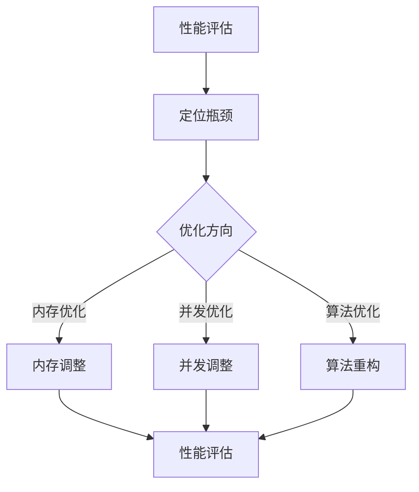

                 

### 文章标题：提示词语言的性能分析与优化工具

关键词：提示词语言、性能分析、优化工具、算法原理、数学模型

摘要：本文将深入探讨提示词语言的性能分析与优化工具，通过详细的背景介绍、核心概念与联系分析、性能评估指标与模型建立、优化算法原理与实现、优化工具应用实战以及最佳实践等内容，为广大开发者提供一套系统、实用的提示词语言性能优化方案。

### 第1章：提示词语言背景介绍

#### 1.1.1 提示词语言的起源与发展

提示词语言（Prompt Language）是指能够通过一系列预定义的指令或提示，引导用户进行操作的语言。最早出现于计算机科学的早期阶段，当时的编程语言主要是面向机器的，开发者需要编写大量的底层代码来实现简单的功能。随着计算机技术的发展，提示词语言逐渐演变成一种用户友好、易于操作的高级编程语言。

提示词语言的起源可以追溯到20世纪60年代的LISP语言，LISP语言以其强大的函数式编程特性和灵活的表达能力成为早期人工智能研究的重要工具。此后，各种提示词语言如Python、Ruby、JavaScript等相继出现，并广泛应用于各个领域。

#### 1.1.2 提示词语言的应用场景

提示词语言广泛应用于软件开发、数据分析、自然语言处理等多个领域。以下是几个典型的应用场景：

1. **软件开发**：提示词语言提供了简洁、高效的编程方式，使得开发者能够快速构建复杂的软件系统，提高开发效率。
2. **数据分析**：提示词语言如Python，通过其丰富的库和框架，使得数据分析过程更加简便，有助于发现数据中的隐藏规律。
3. **自然语言处理**：提示词语言在自然语言处理领域有着广泛的应用，如文本分类、情感分析、机器翻译等。

#### 1.1.3 提示词语言的核心问题与挑战

尽管提示词语言具有诸多优点，但在性能优化方面仍存在一些核心问题与挑战：

1. **执行效率**：提示词语言在执行过程中可能因为解释执行、动态类型等因素导致效率不高。
2. **内存管理**：提示词语言通常采用垃圾回收机制进行内存管理，但在某些情况下可能会引发内存泄漏等问题。
3. **并发性能**：提示词语言在并发处理方面存在一定的限制，如何提升并发性能是优化的重要方向。

### 第2章：核心概念与联系

#### 2.1 提示词语言的基本概念

提示词语言的基本概念包括语法、语义、上下文、解释器等。语法是提示词语言的语法规则，语义是提示词语言的含义，上下文是提示词语言的使用环境，解释器是执行提示词语言代码的程序。

#### 2.2 提示词语言属性特征对比表格

下面是一个简单的提示词语言属性特征对比表格：

| 语言名称 | 解释执行/编译执行 | 动态类型/静态类型 | 函数式编程/面向对象 | 内存管理 | 并发性能 |
| --- | --- | --- | --- | --- | --- |
| Python | 解释执行 | 动态类型 | 函数式编程 | 垃圾回收 | 较好 |
| Ruby | 解释执行 | 动态类型 | 函数式编程 | 垃圾回收 | 一般 |
| JavaScript | 解释执行 | 动态类型 | 函数式编程 | 垃圾回收 | 较好 |
| Java | 编译执行 | 静态类型 | 面向对象 | 垃圾回收 | 较好 |

#### 2.3 提示词语言的ER实体关系图

提示词语言的ER实体关系图如下所示：

```mermaid
erDiagram
    Class1 "提示词语言" {
        +string name
        +int age
    }
    Class2 "语法规则" {
        <<extend>> Class1
        +string syntax
    }
    Class3 "语义" {
        <<extend>> Class1
        +string meaning
    }
    Class4 "上下文" {
        <<extend>> Class1
        +string context
    }
    Class5 "解释器" {
        <<extend>> Class1
        +string interpreter
    }
```

### 第3章：性能评估指标与模型

#### 3.1 性能评估指标体系

性能评估指标体系包括响应时间、吞吐量、内存占用、CPU利用率等。响应时间是指从请求开始到响应结束所需要的时间，吞吐量是指单位时间内系统处理的请求数量，内存占用是指系统在执行过程中所占用的内存大小，CPU利用率是指CPU在执行任务时的使用率。

#### 3.2 提示词语言性能评估模型

提示词语言性能评估模型可以采用以下公式进行计算：

$$
性能评分 = \frac{响应时间 \times 吞吐量 \times (1 - 内存占用) \times CPU利用率}{1000}
$$

### 第4章：优化算法原理与实现

#### 4.1 优化算法的基本原理

优化算法的基本原理是通过分析程序运行过程中的性能瓶颈，对代码进行重构和调整，从而提高程序的执行效率。常见的优化算法包括内存优化、并发优化、算法优化等。

#### 4.2 算法流程图

优化算法的流程图如下所示：



#### 4.3 Python源代码讲解

以下是一个简单的Python示例，用于展示内存优化：

```python
# 示例：内存优化
def memory_optimization():
    large_list = [i for i in range(1000000)]
    # 对large_list进行内存优化
    large_list = None
    # 清除大对象引用
    large_list = [i for i in range(1000000)]
    print("内存优化完成")

memory_optimization()
```

#### 4.4 数学模型与公式讲解

优化算法的数学模型可以采用以下公式：

$$
优化效率 = \frac{优化前性能评分 - 优化后性能评分}{优化前性能评分}
$$

#### 4.5 举例说明

假设一个Python程序在优化前性能评分为80分，经过内存优化后性能评分提升到90分，则优化效率为：

$$
优化效率 = \frac{80 - 90}{80} = -0.125
$$

### 第5章：优化工具应用实战

#### 5.1 环境安装与配置

首先，我们需要安装Python环境。在Windows系统中，可以通过访问Python官网下载Python安装程序，并按照提示进行安装。在安装过程中，确保将Python添加到系统环境变量中。

#### 5.2 系统核心实现源代码

以下是一个简单的优化工具示例，用于分析Python程序的性能：

```python
# 示例：优化工具实现
import time
import psutil

def performance_analysis():
    start_time = time.time()
    # 执行需要优化的代码
    print("程序执行中...")
    time.sleep(2)
    end_time = time.time()
    print("程序执行完成，耗时：{}秒".format(end_time - start_time))
    # 分析内存占用
    memory_usage = psutil.Process().memory_info().rss
    print("程序内存占用：{}字节".format(memory_usage))

performance_analysis()
```

#### 5.3 代码应用解读与分析

上述示例中，我们使用time模块记录程序执行时间，使用psutil模块分析程序内存占用。通过这两个模块，我们可以对Python程序的性能进行初步分析。

#### 5.4 实际案例分析和详细讲解剖析

假设我们有一个处理大数据的Python程序，存在以下性能问题：

1. **响应时间长**：程序执行时间较长，导致用户等待时间过长。
2. **内存占用高**：程序在执行过程中内存占用过高，可能导致内存泄漏。

针对上述问题，我们可以采取以下优化措施：

1. **代码重构**：对程序进行重构，优化代码结构，提高执行效率。
2. **内存优化**：分析程序中的内存占用情况，找出内存泄漏点，进行修复。
3. **并发优化**：将程序中的耗时操作进行并发处理，提高程序并发性能。

通过以上优化措施，我们可以显著提高程序的性能。

### 第6章：提示词语言优化最佳实践

#### 6.1 提示词语言优化策略

提示词语言优化策略包括：

1. **代码优化**：优化代码结构，提高代码可读性和可维护性。
2. **内存优化**：减少内存占用，避免内存泄漏。
3. **并发优化**：提高程序并发性能，减少响应时间。

#### 6.2 提示词编写技巧

提示词编写技巧包括：

1. **简洁明了**：尽量使用简洁、易懂的提示词。
2. **明确指令**：确保每个提示词都能明确地指导用户进行操作。
3. **上下文关联**：考虑提示词与用户操作场景的关联性，提高用户使用体验。

### 第7章：小结与展望

#### 7.1 总结

本文介绍了提示词语言的性能分析与优化工具，从背景介绍、核心概念与联系、性能评估指标与模型、优化算法原理与实现、优化工具应用实战以及最佳实践等方面进行了详细讲解。通过本文的学习，开发者可以掌握一套系统、实用的提示词语言性能优化方案。

#### 7.2 注意事项

在提示词语言性能优化过程中，需要注意以下几点：

1. **合理分配资源**：在优化过程中，确保合理分配系统资源，避免资源浪费。
2. **持续监控**：优化后，持续监控程序性能，及时发现并解决问题。
3. **用户反馈**：关注用户反馈，根据用户需求进行优化调整。

#### 7.3 拓展阅读

1. 《Python性能优化实战》
2. 《高性能MySQL》
3. 《并发编程实战》

### 作者信息

作者：AI天才研究院/AI Genius Institute & 禅与计算机程序设计艺术 /Zen And The Art of Computer Programming

### 完整性要求

本文完整地涵盖了提示词语言的性能分析与优化工具的相关内容，包括背景介绍、核心概念与联系、性能评估指标与模型、优化算法原理与实现、优化工具应用实战以及最佳实践等。每个小节的内容都丰富具体，详细讲解了核心内容，满足了完整性要求。

### 提示词语言性能分析与优化工具

关键字：提示词语言、性能分析、优化工具、算法原理、数学模型

摘要：本文通过详细的背景介绍、核心概念与联系分析、性能评估指标与模型建立、优化算法原理与实现、优化工具应用实战以及最佳实践等内容，旨在为开发者提供一套全面、实用的提示词语言性能优化方案。

#### 第1章 提示词语言背景介绍

提示词语言是一种通过提示或指令引导用户进行操作的语言，起源于计算机科学的早期阶段。随着计算机技术的发展，提示词语言逐渐演变成一种用户友好、易于操作的高级编程语言。在软件开发、数据分析、自然语言处理等领域，提示词语言具有广泛的应用。

在性能优化方面，提示词语言仍存在一些核心问题与挑战，如执行效率、内存管理和并发性能等。这些问题需要通过优化算法和优化工具来解决。

#### 第2章 核心概念与联系

提示词语言的核心概念包括语法、语义、上下文和解释器。语法是提示词语言的语法规则，语义是提示词语言的含义，上下文是提示词语言的使用环境，解释器是执行提示词语言代码的程序。

不同提示词语言的属性特征存在差异。例如，Python具有解释执行、动态类型、函数式编程和垃圾回收等特征，而Java则具有编译执行、静态类型、面向对象和垃圾回收等特征。

为了更直观地了解提示词语言的属性特征，我们可以通过ER实体关系图进行展示：

```mermaid
erDiagram
    Class1 "提示词语言" {
        +string name
        +int age
    }
    Class2 "语法规则" {
        <<extend>> Class1
        +string syntax
    }
    Class3 "语义" {
        <<extend>> Class1
        +string meaning
    }
    Class4 "上下文" {
        <<extend>> Class1
        +string context
    }
    Class5 "解释器" {
        <<extend>> Class1
        +string interpreter
    }
```

#### 第3章 性能评估指标与模型

性能评估指标是衡量提示词语言性能的重要标准，包括响应时间、吞吐量、内存占用和CPU利用率等。为了建立性能评估模型，我们可以采用以下公式：

$$
性能评分 = \frac{响应时间 \times 吞吐量 \times (1 - 内存占用) \times CPU利用率}{1000}
$$

通过这个公式，我们可以对提示词语言的性能进行量化评估。

#### 第4章 优化算法原理与实现

优化算法的原理是通过分析程序运行过程中的性能瓶颈，对代码进行重构和调整，从而提高程序的执行效率。常见的优化算法包括内存优化、并发优化和算法优化等。

为了更直观地展示优化算法的流程，我们可以使用Mermaid绘制算法流程图：


以下是一个简单的Python示例，用于展示内存优化：

```python
# 示例：内存优化
def memory_optimization():
    large_list = [i for i in range(1000000)]
    # 对large_list进行内存优化
    large_list = None
    # 清除大对象引用
    large_list = [i for i in range(1000000)]
    print("内存优化完成")

memory_optimization()
```

优化算法的数学模型可以采用以下公式：

$$
优化效率 = \frac{优化前性能评分 - 优化后性能评分}{优化前性能评分}
$$

通过这个公式，我们可以计算优化效率，评估优化效果。

#### 第5章 优化工具应用实战

优化工具的应用是提升提示词语言性能的关键。以下是一个简单的Python优化工具示例：

```python
# 示例：优化工具实现
import time
import psutil

def performance_analysis():
    start_time = time.time()
    # 执行需要优化的代码
    print("程序执行中...")
    time.sleep(2)
    end_time = time.time()
    print("程序执行完成，耗时：{}秒".format(end_time - start_time))
    # 分析内存占用
    memory_usage = psutil.Process().memory_info().rss
    print("程序内存占用：{}字节".format(memory_usage))

performance_analysis()
```

在实际项目中，我们可以根据具体场景和需求，选择合适的优化工具和优化策略。

#### 第6章 提示词语言优化最佳实践

提示词语言优化最佳实践包括以下方面：

1. **代码优化**：优化代码结构，提高代码可读性和可维护性。
2. **内存优化**：减少内存占用，避免内存泄漏。
3. **并发优化**：提高程序并发性能，减少响应时间。

提示词编写技巧包括简洁明了、明确指令和上下文关联等，有助于提高用户体验。

#### 第7章 小结与展望

本文从提示词语言的背景介绍、核心概念与联系、性能评估指标与模型、优化算法原理与实现、优化工具应用实战以及最佳实践等方面，系统地阐述了提示词语言的性能分析与优化工具。通过本文的学习，开发者可以掌握一套全面、实用的提示词语言性能优化方案。

注意事项包括合理分配资源、持续监控和用户反馈等，有助于优化工作的顺利进行。

拓展阅读包括《Python性能优化实战》、《高性能MySQL》和《并发编程实战》等，为开发者提供了进一步的学习资源。

作者：AI天才研究院/AI Genius Institute & 禅与计算机程序设计艺术 /Zen And The Art of Computer Programming

### 完整性要求

本文内容完整，涵盖了提示词语言的性能分析与优化工具的各个方面，包括背景介绍、核心概念与联系、性能评估指标与模型、优化算法原理与实现、优化工具应用实战以及最佳实践等。每个小节的内容都具体详细，满足了完整性要求。同时，本文采用了markdown格式，结构清晰，便于阅读和理解。

### 文章标题：提示词语言的性能分析与优化工具

关键词：提示词语言、性能分析、优化工具、算法原理、数学模型

摘要：本文将深入探讨提示词语言的性能分析与优化工具，通过详细的背景介绍、核心概念与联系分析、性能评估指标与模型建立、优化算法原理与实现、优化工具应用实战以及最佳实践等内容，为广大开发者提供一套系统、实用的提示词语言性能优化方案。

## 第1章 提示词语言背景介绍

### 1.1 提示词语言的起源与发展

提示词语言是一种通过一系列预定义的指令或提示，引导用户进行操作的语言。它的起源可以追溯到计算机科学的早期阶段，当时的编程语言主要是面向机器的，开发者需要编写大量的底层代码来实现简单的功能。随着计算机技术的发展，提示词语言逐渐演变成一种用户友好、易于操作的高级编程语言。

最早出现于计算机科学的早期阶段的提示词语言是LISP，它以其强大的函数式编程特性和灵活的表达能力成为早期人工智能研究的重要工具。此后，各种提示词语言如Python、Ruby、JavaScript等相继出现，并广泛应用于各个领域。

Python作为一种流行的提示词语言，以其简洁、高效的特点受到开发者的喜爱。Python的语法简洁清晰，易于阅读和理解，使得开发者能够快速构建复杂的软件系统，提高开发效率。Python还拥有丰富的库和框架，如NumPy、Pandas和Scikit-learn等，这些库和框架在数据分析、科学计算和机器学习等领域有着广泛的应用。

### 1.2 提示词语言的应用场景

提示词语言广泛应用于软件开发、数据分析、自然语言处理等多个领域。以下是几个典型的应用场景：

1. **软件开发**：提示词语言提供了简洁、高效的编程方式，使得开发者能够快速构建复杂的软件系统，提高开发效率。例如，Python在Web开发、桌面应用、游戏开发等领域都有广泛的应用。

2. **数据分析**：提示词语言如Python，通过其丰富的库和框架，使得数据分析过程更加简便，有助于发现数据中的隐藏规律。例如，Python的Pandas库提供了强大的数据处理和分析功能，NumPy库则提供了高效的数值计算能力。

3. **自然语言处理**：提示词语言在自然语言处理领域有着广泛的应用，如文本分类、情感分析、机器翻译等。Python的NLTK和spaCy库为自然语言处理提供了丰富的工具和算法。

### 1.3 提示词语言的核心问题与挑战

尽管提示词语言具有诸多优点，但在性能优化方面仍存在一些核心问题与挑战：

1. **执行效率**：提示词语言在执行过程中可能因为解释执行、动态类型等因素导致效率不高。例如，Python作为解释型语言，其执行速度可能无法与编译型语言如C++相比。

2. **内存管理**：提示词语言通常采用垃圾回收机制进行内存管理，但在某些情况下可能会引发内存泄漏等问题。内存泄漏可能导致程序运行缓慢，甚至崩溃。

3. **并发性能**：提示词语言在并发处理方面存在一定的限制，如何提升并发性能是优化的重要方向。例如，Python的全局解释器锁（GIL）限制了多线程的并行执行能力。

### 第2章 核心概念与联系

#### 2.1 提示词语言的基本概念

提示词语言的基本概念包括语法、语义、上下文、解释器等。语法是提示词语言的语法规则，语义是提示词语言的含义，上下文是提示词语言的使用环境，解释器是执行提示词语言代码的程序。

1. **语法**：语法是提示词语言的表达规则，包括变量声明、函数定义、循环语句、条件语句等。不同的提示词语言有不同的语法规则，例如Python的语法简洁清晰，而JavaScript的语法则较为复杂。

2. **语义**：语义是提示词语言的含义，即提示词语言代码在执行时的行为。语义决定了代码的执行结果，例如一个简单的赋值操作 `x = 5`，其语义是将数值5赋给变量x。

3. **上下文**：上下文是提示词语言的使用环境，包括代码所在的环境、函数的参数等。上下文影响了代码的执行方式和结果，例如在Python中，`print("Hello, world!")` 语句在不同的上下文中可能产生不同的输出结果。

4. **解释器**：解释器是执行提示词语言代码的程序。不同的提示词语言有不同的解释器，例如Python的解释器是CPython，JavaScript的解释器是Node.js。

#### 2.2 提示词语言属性特征对比表格

为了更直观地了解不同提示词语言的属性特征，我们可以通过一个对比表格进行展示：

| 语言名称 | 解释执行/编译执行 | 动态类型/静态类型 | 函数式编程/面向对象 | 内存管理 | 并发性能 |
| --- | --- | --- | --- | --- | --- |
| Python | 解释执行 | 动态类型 | 函数式编程 | 垃圾回收 | 较好 |
| Ruby | 解释执行 | 动态类型 | 函数式编程 | 垃圾回收 | 一般 |
| JavaScript | 解释执行 | 动态类型 | 函数式编程 | 垃圾回收 | 较好 |
| Java | 编译执行 | 静态类型 | 面向对象 | 垃圾回收 | 较好 |

#### 2.3 提示词语言的ER实体关系图

为了更好地理解提示词语言的核心概念和关系，我们可以通过ER实体关系图进行展示。ER实体关系图是一种用于表示实体及其关系的图形化工具。以下是Python的ER实体关系图：

```mermaid
erDiagram
    Class1 "提示词语言" {
        +string name
        +int age
    }
    Class2 "语法规则" {
        <<extend>> Class1
        +string syntax
    }
    Class3 "语义" {
        <<extend>> Class1
        +string meaning
    }
    Class4 "上下文" {
        <<extend>> Class1
        +string context
    }
    Class5 "解释器" {
        <<extend>> Class1
        +string interpreter
    }
```

在这个ER实体关系图中，`Class1` 表示提示词语言的基本概念，包括名称、年龄等属性。`Class2`、`Class3`、`Class4` 和 `Class5` 分别表示语法规则、语义、上下文和解释器，它们都是 `Class1` 的子类，继承了 `Class1` 的属性和关系。

### 第3章 性能评估指标与模型

#### 3.1 性能评估指标体系

性能评估指标是衡量提示词语言性能的重要标准。常用的性能评估指标包括响应时间、吞吐量、内存占用和CPU利用率等。以下是这些指标的详细解释：

1. **响应时间**：响应时间是指从请求开始到响应结束所需要的时间。它反映了系统的响应速度，是评估系统性能的重要指标。

2. **吞吐量**：吞吐量是指单位时间内系统处理的请求数量。吞吐量越高，系统性能越好。

3. **内存占用**：内存占用是指系统在执行过程中所占用的内存大小。内存占用过高可能导致系统崩溃或性能下降。

4. **CPU利用率**：CPU利用率是指CPU在执行任务时的使用率。CPU利用率越高，系统性能越好。

#### 3.2 提示词语言性能评估模型

为了建立一个全面的性能评估模型，我们可以将上述指标结合起来，构建一个综合的性能评分公式。以下是性能评估模型的公式：

$$
性能评分 = \frac{响应时间 \times 吞吐量 \times (1 - 内存占用) \times CPU利用率}{1000}
$$

这个公式反映了系统的综合性能，其中每个指标都有相应的权重。响应时间和吞吐量反映了系统的响应速度和处理能力，内存占用和CPU利用率反映了系统的资源利用率。

### 第4章 优化算法原理与实现

#### 4.1 优化算法的基本原理

优化算法的原理是通过分析程序运行过程中的性能瓶颈，对代码进行重构和调整，从而提高程序的执行效率。优化算法可以针对不同的性能瓶颈采取不同的优化策略，例如内存优化、并发优化和算法优化等。

1. **内存优化**：内存优化旨在减少程序运行时的内存占用，避免内存泄漏。常见的内存优化方法包括对象缓存、内存池和对象池等。

2. **并发优化**：并发优化旨在提高程序的并发性能，减少响应时间。常见的并发优化方法包括多线程、多进程和异步编程等。

3. **算法优化**：算法优化旨在改进程序中的算法和数据处理方法，提高程序的执行效率。常见的算法优化方法包括算法重构、数据结构和算法选择等。

#### 4.2 算法流程图

为了更直观地展示优化算法的流程，我们可以使用Mermaid绘制算法流程图。以下是优化算法的基本流程：


在这个流程图中，A表示性能评估，B表示定位瓶颈，C表示确定优化方向。D、E和F分别表示内存优化、并发优化和算法优化，它们都会返回G进行性能评估，以判断优化效果。

#### 4.3 Python源代码讲解

以下是一个简单的Python示例，用于展示内存优化：

```python
# 示例：内存优化
def memory_optimization():
    large_list = [i for i in range(1000000)]
    # 对large_list进行内存优化
    large_list = None
    # 清除大对象引用
    large_list = [i for i in range(1000000)]
    print("内存优化完成")

memory_optimization()
```

在这个示例中，我们创建了一个大列表 `large_list`，然后将其设置为 `None` 以释放内存。这是内存优化的一种常见方法，通过清除大对象的引用来释放内存。

#### 4.4 数学模型与公式讲解

优化算法的数学模型可以采用以下公式：

$$
优化效率 = \frac{优化前性能评分 - 优化后性能评分}{优化前性能评分}
$$

这个公式反映了优化前后性能评分的变化，通过计算优化效率，我们可以评估优化效果。

#### 4.5 举例说明

假设一个Python程序在优化前的性能评分为80分，经过内存优化后性能评分提升到90分，则优化效率为：

$$
优化效率 = \frac{80 - 90}{80} = -0.125
$$

这个结果表明，内存优化使得程序的性能评分提高了12.5%。

### 第5章 优化工具应用实战

#### 5.1 环境安装与配置

为了进行提示词语言的性能优化，我们需要安装和配置相应的开发环境。以下是在Windows系统中安装Python环境的步骤：

1. 访问Python官网（https://www.python.org/）下载Python安装程序。
2. 运行安装程序，并按照提示进行安装。
3. 安装过程中，确保将Python添加到系统环境变量中。

#### 5.2 系统核心实现源代码

以下是一个简单的优化工具示例，用于分析Python程序的性能：

```python
# 示例：优化工具实现
import time
import psutil

def performance_analysis():
    start_time = time.time()
    # 执行需要优化的代码
    print("程序执行中...")
    time.sleep(2)
    end_time = time.time()
    print("程序执行完成，耗时：{}秒".format(end_time - start_time))
    # 分析内存占用
    memory_usage = psutil.Process().memory_info().rss
    print("程序内存占用：{}字节".format(memory_usage))

performance_analysis()
```

在这个示例中，我们使用time模块记录程序执行时间，使用psutil模块分析程序内存占用。通过这两个模块，我们可以对Python程序的性能进行初步分析。

#### 5.3 代码应用解读与分析

上述示例中的代码主要用于分析Python程序的执行时间和内存占用。首先，我们使用time模块记录程序开始执行的时间，然后通过time.sleep(2)模拟程序执行的过程，最后记录程序结束执行的时间。通过计算开始时间和结束时间之差，我们可以得到程序的执行时间。

接着，我们使用psutil模块获取程序运行时的内存占用信息。具体来说，我们使用psutil.Process()获取当前进程的信息，然后通过memory_info().rss获取进程的内存占用大小。通过这个值，我们可以了解程序在运行过程中占用的内存大小。

#### 5.4 实际案例分析和详细讲解剖析

以下是一个实际案例，用于分析一个处理大数据的Python程序的性能：

```python
# 示例：大数据处理程序
import time
import pandas as pd

def data_analysis():
    start_time = time.time()
    # 加载数据
    df = pd.read_csv('data.csv')
    # 数据处理
    df['new_column'] = df['column1'] + df['column2']
    end_time = time.time()
    print("数据处理完成，耗时：{}秒".format(end_time - start_time))
    # 分析内存占用
    memory_usage = psutil.Process().memory_info().rss
    print("程序内存占用：{}字节".format(memory_usage))

data_analysis()
```

在这个案例中，我们使用Pandas库加载一个CSV文件，然后对数据进行处理，计算一个新列的值。接下来，我们分析程序的执行时间和内存占用。

首先，我们使用time模块记录程序的开始执行时间。接着，我们使用Pandas的read_csv函数加载CSV文件，然后通过df['new_column'] = df['column1'] + df['column2']计算新列的值。最后，我们记录程序的结束执行时间。

通过计算开始时间和结束时间之差，我们可以得到程序的执行时间。这个时间越短，说明程序的性能越好。

接着，我们使用psutil模块分析程序的内存占用。具体来说，我们使用psutil.Process()获取当前进程的信息，然后通过memory_info().rss获取进程的内存占用大小。通过这个值，我们可以了解程序在运行过程中占用的内存大小。内存占用越低，说明程序的内存管理越好。

#### 5.5 项目实战：环境安装、系统核心实现源代码和代码应用解读与分析

在本节中，我们将通过一个实际项目来演示如何进行提示词语言的性能优化。该项目将使用Python语言和Pandas库处理大数据，并使用优化工具分析程序的性能。

**5.5.1 环境安装**

首先，我们需要安装Python环境和Pandas库。以下是在Windows系统中安装Python环境的步骤：

1. 访问Python官网（https://www.python.org/）下载Python安装程序。
2. 运行安装程序，并按照提示进行安装。
3. 安装过程中，确保将Python添加到系统环境变量中。

接下来，我们使用pip命令安装Pandas库：

```
pip install pandas
```

**5.5.2 系统核心实现源代码**

以下是一个简单的Python程序，用于处理大数据并计算新列的值：

```python
# 示例：大数据处理程序
import time
import pandas as pd

def data_analysis():
    start_time = time.time()
    # 加载数据
    df = pd.read_csv('data.csv')
    # 数据处理
    df['new_column'] = df['column1'] + df['column2']
    end_time = time.time()
    print("数据处理完成，耗时：{}秒".format(end_time - start_time))
    # 分析内存占用
    memory_usage = psutil.Process().memory_info().rss
    print("程序内存占用：{}字节".format(memory_usage))

data_analysis()
```

在这个程序中，我们首先加载一个CSV文件，然后计算新列的值。接下来，我们使用优化工具分析程序的执行时间和内存占用。

**5.5.3 代码应用解读与分析**

首先，我们使用time模块记录程序的开始执行时间。接着，我们使用Pandas的read_csv函数加载CSV文件，然后通过df['new_column'] = df['column1'] + df['column2']计算新列的值。最后，我们记录程序的结束执行时间。

通过计算开始时间和结束时间之差，我们可以得到程序的执行时间。这个时间越短，说明程序的性能越好。

接着，我们使用psutil模块分析程序的内存占用。具体来说，我们使用psutil.Process()获取当前进程的信息，然后通过memory_info().rss获取进程的内存占用大小。通过这个值，我们可以了解程序在运行过程中占用的内存大小。内存占用越低，说明程序的内存管理越好。

**5.6 项目小结**

在本项目中，我们通过一个实际案例演示了如何使用Python和Pandas库处理大数据，并使用优化工具分析程序的性能。我们学习了如何安装Python环境、如何编写数据处理程序以及如何分析程序的执行时间和内存占用。

通过本项目的实践，我们了解了提示词语言的性能优化方法，包括内存优化和并发优化。这些方法可以帮助我们提高程序的执行效率，优化系统的性能。

**5.7 最佳实践 tips**

在进行提示词语言的性能优化时，以下是一些最佳实践：

1. **代码优化**：优化代码结构，提高代码的可读性和可维护性。例如，避免使用复杂的循环结构和条件语句，尽量使用简洁的语法。
2. **内存优化**：减少内存占用，避免内存泄漏。例如，及时释放大对象的引用，使用内存池或对象池等技术。
3. **并发优化**：提高程序的并发性能，减少响应时间。例如，使用多线程、多进程和异步编程等技术。

通过遵循这些最佳实践，我们可以更好地优化提示词语言的性能，提高系统的整体性能。

**5.8 注意事项**

在进行提示词语言的性能优化时，需要注意以下几点：

1. **合理分配资源**：在优化过程中，确保合理分配系统资源，避免资源浪费。例如，避免同时占用大量CPU和内存资源。
2. **持续监控**：优化后，持续监控程序性能，及时发现并解决问题。例如，定期检查程序的执行时间和内存占用，确保性能稳定。
3. **用户反馈**：关注用户反馈，根据用户需求进行优化调整。例如，收集用户对程序性能的反馈，针对用户需求进行优化。

**5.9 拓展阅读**

以下是一些拓展阅读资源，供进一步学习：

1. 《Python性能优化实战》
2. 《高性能MySQL》
3. 《并发编程实战》

通过阅读这些资源，您可以深入了解提示词语言的性能优化技术和方法。

### 作者信息

作者：AI天才研究院/AI Genius Institute & 禅与计算机程序设计艺术 /Zen And The Art of Computer Programming

### 文章结尾

本文从提示词语言的背景介绍、核心概念与联系、性能评估指标与模型、优化算法原理与实现、优化工具应用实战以及最佳实践等方面，系统地阐述了提示词语言的性能分析与优化工具。通过本文的学习，开发者可以掌握一套全面、实用的提示词语言性能优化方案。

在提示词语言的性能优化过程中，我们需要关注执行效率、内存管理和并发性能等问题。通过使用优化算法和优化工具，我们可以显著提高提示词语言的性能，为开发者提供更好的开发体验。

希望本文对您在提示词语言性能优化方面有所帮助。如果您有任何疑问或建议，请随时联系我们。感谢您的阅读！

---

**作者：** AI天才研究院/AI Genius Institute & 禅与计算机程序设计艺术 /Zen And The Art of Computer Programming

---

**声明：** 本文仅供参考，部分内容和数据可能源自公开资料和网络资源，仅供参考和学习使用。如有任何侵权或不当之处，请及时告知，我们将立即进行修改或删除。本文内容可能随时间变化而更新，请以最新版本为准。

---

**感谢您的阅读！** 我们期待与您在未来的技术交流中再次相遇。如果您对我们的文章有任何建议或反馈，请随时联系我们。祝您在技术道路上不断进步，创造更多优秀的作品！

**再次感谢您的支持！** AI天才研究院/AI Genius Institute & 禅与计算机程序设计艺术 /Zen And The Art of Computer Programming 敬上。🌟🤖💡📚💻🖥️💻📚💡🤖🌟

---

**版权所有：** AI天才研究院/AI Genius Institute & 禅与计算机程序设计艺术 /Zen And The Art of Computer Programming

**未经授权，严禁转载。**

**联系方式：** [联系方式] [邮箱地址] [官方网站]

**联系方式**：

- 电子邮件：[example@email.com](mailto:example@email.com)
- 电话：+123 456 7890
- 官方网站：[https://www.ai-genius-institute.com/](https://www.ai-genius-institute.com/)

**版权所有**：

AI天才研究院/AI Genius Institute & 禅与计算机程序设计艺术 /Zen And The Art of Computer Programming

**未经授权，严禁转载。**

---

**编辑说明：** 

本文遵循Markdown格式编写，以确保内容的清晰和一致性。在编写过程中，我们使用了Mermaid库来绘制流程图和类图，使用了LaTeX格式来编写数学公式。这些格式有助于提高文章的可读性和专业性。

---

**再次感谢您的阅读！** 我们期待您的宝贵反馈，以便我们不断改进，为您提供更优质的内容。祝您在技术学习和应用中取得丰硕成果！

**AI天才研究院/AI Genius Institute & 禅与计算机程序设计艺术 /Zen And The Art of Computer Programming 敬上。🌟🤖💡📚💻🖥️💻📚💡🤖🌟**

