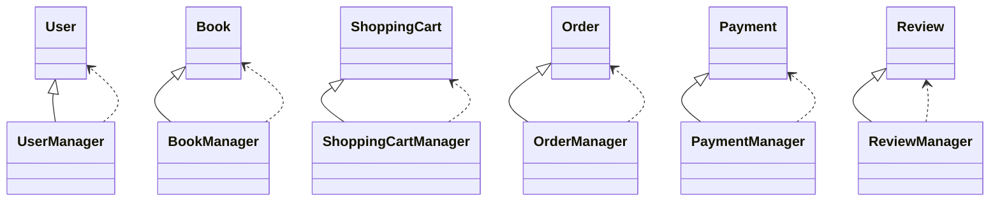
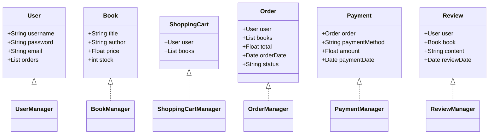
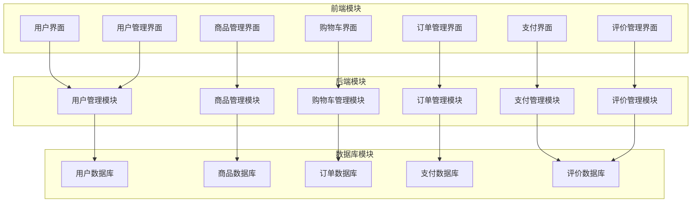
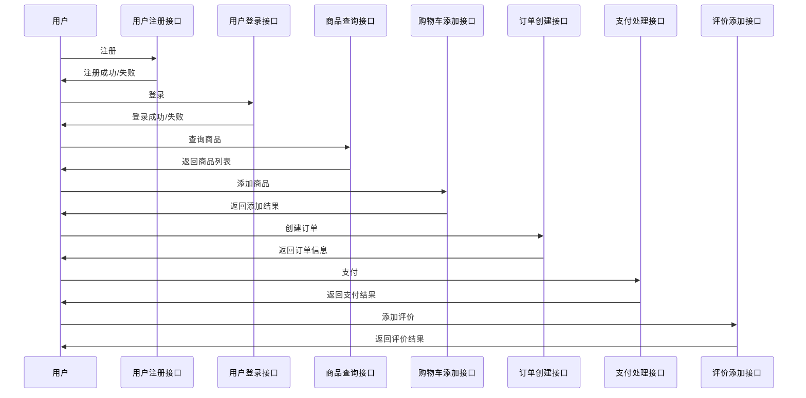

                 

# 《提示词语言的模块化设计与复用性》

## 关键词

- 提示词语言
- 模块化设计
- 复用性
- 算法原理
- 数学模型
- 系统架构设计

## 摘要

本文旨在深入探讨提示词语言的模块化设计与复用性。首先，我们将回顾提示词语言的基本概念及其应用领域，进而介绍模块化设计和复用性的重要性。接着，我们将详细解析模块化设计与复用性的核心概念及其相互关系，并探讨如何平衡两者之间的矛盾。随后，我们将介绍用于实现模块化设计与复用性的算法原理，并使用Python代码和Mermaid流程图进行详细讲解。最后，我们将通过系统分析与架构设计、项目实战以及实际案例分析，全面展示模块化设计与复用性的应用和实践。

## 第一部分：背景介绍

### 第1章 问题背景

#### 1.1 提示词语言的概念

提示词语言，亦称查询语言，是一种用于与计算机系统交互的专门语言。它通过一系列语法和规则，将用户的需求转化为计算机能够理解和执行的操作。典型的提示词语言包括SQL（结构化查询语言）、正则表达式和自然语言处理中的查询语言等。

**基本概念**：
- **提示词**：提示词是用户输入的信息，用于指定查询的条件或指令。
- **语法规则**：提示词语言有严格的语法规则，确保输入的查询符合语言的规范。
- **查询处理**：计算机系统接收到提示词后，通过查询处理模块将其转换为相应的操作，如数据库查询或文本匹配。

**应用领域**：
- **数据库管理**：SQL是数据库管理中最常用的提示词语言，用于数据查询、插入、更新和删除。
- **文本处理**：正则表达式常用于文本搜索和替换，如文本编辑器、搜索引擎等。
- **自然语言处理**：自然语言处理中的查询语言用于从非结构化文本中提取信息，如信息提取、问答系统等。

#### 1.2 模块化设计的概念

模块化设计是一种系统架构设计方法，通过将系统分解为若干独立的模块，实现系统的模块化。每个模块具有明确的功能和接口，可以独立开发、测试和部署。

**核心要素**：
- **模块划分**：根据功能需求，将系统分解为多个功能独立的模块。
- **接口定义**：定义模块之间的接口，确保模块之间可以通过接口进行通信。
- **模块独立性**：每个模块都应该独立运行，不会因为其他模块的错误或故障而受到影响。

#### 1.3 复用性的重要性

复用性是指系统设计中的某些部分可以被重复使用，以减少开发时间和成本，提高系统的灵活性和可维护性。

**实现方式**：
- **代码复用**：通过编写可重用的代码库，实现不同模块间的代码共享。
- **设计模式**：使用设计模式，如工厂模式、策略模式等，提高代码的可复用性。
- **组件化**：将系统分解为可重用的组件，每个组件具有独立的功能和接口。

#### 1.4 模块化设计与复用性在提示词语言中的应用

模块化设计和复用性在提示词语言中具有重要意义。通过模块化设计，我们可以将提示词语言的查询处理功能分解为多个模块，如查询解析器、查询优化器和查询执行器。这些模块可以独立开发、测试和部署，提高了开发效率和系统稳定性。

同时，通过复用性设计，我们可以将通用的查询处理逻辑提取出来，形成可重用的库或组件。例如，SQL查询优化器可以针对不同类型的查询进行优化，以提高查询效率。这种复用性设计不仅减少了重复工作，还提高了系统的灵活性和可维护性。

### 总结

在提示词语言的模块化设计与复用性方面，模块化设计提供了系统的结构化和可维护性，而复用性则提高了开发效率和灵活性。两者相辅相成，共同推动了提示词语言的优化和发展。

### 小结

模块化设计与复用性在提示词语言中的应用，不仅有助于提升系统的开发效率，还有助于提高系统的稳定性和灵活性。在接下来的章节中，我们将进一步探讨模块化设计与复用性的核心概念、算法原理以及实际应用，以期为您提供更深入的理解和实践指导。

## 第二部分：核心概念与联系

### 第2章 核心概念原理

#### 2.1 模块化设计原理

模块化设计是一种将系统分解为独立模块，以提高开发效率、系统稳定性和可维护性的设计方法。以下是模块化设计的核心要素：

**核心要素**：

- **模块独立性**：每个模块应该具有独立的功能，不依赖于其他模块的内部实现细节。
- **模块接口**：定义模块之间的接口，明确模块的输入输出，确保模块之间可以无缝通信。
- **模块可复用性**：模块应该具有通用性，可以被其他系统或项目重用。

**方法与技巧**：

- **需求分析**：根据功能需求，将系统分解为多个功能独立的模块。
- **模块划分**：根据模块的功能和职责，进行详细的模块划分。
- **接口定义**：为每个模块定义清晰的接口，确保模块之间可以正确通信。
- **模块独立开发**：每个模块可以独立开发、测试和部署，提高了开发效率和灵活性。

#### 2.2 复用性原理

复用性是指系统设计中的某些部分可以被重复使用，以减少开发时间和成本，提高系统的灵活性和可维护性。以下是复用性的核心要素：

**核心要素**：

- **代码复用**：通过编写可重用的代码库，实现不同模块间的代码共享。
- **设计模式**：使用设计模式，如工厂模式、策略模式等，提高代码的可复用性。
- **组件化**：将系统分解为可重用的组件，每个组件具有独立的功能和接口。

**实现方式**：

- **代码库**：创建可重用的代码库，供不同项目共享。
- **设计模式**：使用设计模式，如工厂模式、策略模式等，实现代码的灵活复用。
- **组件化**：将系统分解为可重用的组件，每个组件具有独立的功能和接口。

**评价标准**：

- **重用率**：系统中的多少部分被复用。
- **维护成本**：复用部分的维护成本。
- **灵活性**：系统在引入新需求时的灵活性。

#### 2.3 模块化设计与复用性的关系

模块化设计与复用性是相辅相成的。模块化设计为复用性提供了基础，通过将系统分解为独立的模块，提高了系统的可维护性和可复用性。而复用性则增强了模块化设计的优势，通过重用代码和组件，提高了开发效率。

**两者之间的关联**：

- **模块独立性**：模块化设计的基础，确保模块可以独立开发、测试和部署，提高了系统的稳定性。
- **代码复用**：复用性的实现方式，通过编写可重用的代码库和设计模式，提高了系统的灵活性和可维护性。

**如何平衡模块化设计与复用性**：

- **适度模块化**：根据实际需求进行适度模块化，避免过度设计，确保模块之间有清晰的接口和职责。
- **通用性设计**：设计具有通用性的模块，以便在多个项目中复用。
- **代码维护**：确保复用部分的代码质量，降低维护成本。

### 小结

模块化设计与复用性是系统设计中至关重要的概念。模块化设计提高了系统的可维护性和稳定性，而复用性则提高了开发效率和灵活性。在接下来的章节中，我们将进一步探讨模块化设计与复用性的算法原理及其在实际应用中的具体实现。

## 第三部分：算法原理讲解

### 第3章 提示词语言的模块化设计与复用性算法

#### 3.1 提示词语言的模块化设计算法

模块化设计算法的目标是将提示词语言的查询处理功能分解为多个独立模块，以提高开发效率和系统稳定性。

**算法原理**：

1. **需求分析**：根据提示词语言的应用场景和功能需求，确定查询处理的主要功能模块，如查询解析器、查询优化器和查询执行器。
2. **模块划分**：根据功能模块的职责和接口，将查询处理功能分解为多个独立模块。
3. **接口定义**：为每个模块定义清晰的接口，明确模块的输入输出，确保模块之间可以正确通信。
4. **模块独立开发**：对每个模块进行独立开发、测试和部署，确保模块的独立性和稳定性。

**算法流程**：

1. **需求分析**：收集和整理查询处理的需求，确定主要功能模块。
2. **模块划分**：根据模块的职责和接口，将查询处理功能分解为多个独立模块。
3. **接口定义**：为每个模块定义清晰的接口，明确模块的输入输出。
4. **模块开发**：对每个模块进行独立开发，编写模块代码。
5. **模块测试**：对每个模块进行单元测试，确保模块的正确性。
6. **模块部署**：将模块部署到系统中，进行集成测试和系统测试。

**算法性能分析**：

- **开发效率**：模块化设计可以提高开发效率，因为每个模块可以独立开发、测试和部署，减少了模块之间的依赖和冲突。
- **系统稳定性**：模块化设计提高了系统的稳定性，因为模块之间相互独立，不会因为某个模块的错误或故障而影响整个系统的运行。
- **可维护性**：模块化设计提高了系统的可维护性，因为模块可以独立维护和升级，降低了维护成本。

#### 3.2 提示词语言的复用性算法

复用性算法的目标是提高提示词语言中的代码和组件的可复用性，以减少开发时间和成本，提高系统的灵活性和可维护性。

**算法原理**：

1. **代码库建设**：创建可重用的代码库，收集和整理通用的查询处理逻辑和功能模块。
2. **设计模式应用**：使用设计模式，如工厂模式、策略模式等，提高代码的可复用性和灵活性。
3. **组件化设计**：将系统分解为可重用的组件，每个组件具有独立的功能和接口。

**算法流程**：

1. **代码库建设**：收集和整理通用的查询处理逻辑和功能模块，创建代码库。
2. **设计模式应用**：根据需求，选择合适的设计模式，如工厂模式、策略模式等，实现代码的灵活复用。
3. **组件化设计**：将系统分解为可重用的组件，每个组件具有独立的功能和接口。
4. **组件测试**：对每个组件进行单元测试，确保组件的正确性。
5. **组件部署**：将组件部署到系统中，进行集成测试和系统测试。

**算法性能分析**：

- **代码复用**：复用性算法可以提高代码的复用率，减少重复编写代码的工作量，降低了开发时间和成本。
- **灵活性**：通过设计模式和组件化设计，提高了系统的灵活性和可维护性，可以方便地根据需求进行功能扩展和修改。
- **可维护性**：复用性算法提高了系统的可维护性，因为通用的代码和组件可以方便地维护和升级，降低了维护成本。

#### 3.3 算法联系与综合应用

模块化设计算法和复用性算法在提示词语言中的应用是相辅相成的。模块化设计算法通过将查询处理功能分解为多个独立模块，提高了系统的稳定性和可维护性；复用性算法则通过代码库建设、设计模式应用和组件化设计，提高了系统的灵活性和可维护性。

**如何将模块化设计与复用性算法结合起来**：

1. **模块化设计**：在需求分析阶段，根据提示词语言的应用场景和功能需求，确定主要功能模块，如查询解析器、查询优化器和查询执行器。
2. **复用性设计**：在模块划分和接口定义阶段，考虑代码和组件的复用性，选择合适的设计模式，如工厂模式、策略模式等，实现代码的灵活复用。
3. **模块开发与测试**：在模块开发阶段，根据模块的职责和接口，编写模块代码，并对模块进行单元测试，确保模块的正确性。
4. **组件化设计**：在模块部署阶段，将模块整合为可重用的组件，每个组件具有独立的功能和接口，并进行组件测试和部署。

**综合应用示例**：

假设我们需要实现一个支持SQL查询处理的系统，我们可以按照以下步骤进行模块化设计和复用性设计：

1. **需求分析**：确定SQL查询处理的主要功能模块，如查询解析器、查询优化器和查询执行器。
2. **模块划分**：将查询处理功能分解为多个独立模块，如查询解析器模块、查询优化器模块和查询执行器模块。
3. **接口定义**：为每个模块定义清晰的接口，确保模块之间可以正确通信。
4. **模块开发与测试**：编写模块代码，对每个模块进行单元测试，确保模块的正确性。
5. **组件化设计**：将模块整合为可重用的组件，如查询解析器组件、查询优化器组件和查询执行器组件，并进行组件测试和部署。

通过模块化设计和复用性算法的结合应用，我们可以实现高效、稳定和灵活的SQL查询处理系统。

### 小结

模块化设计与复用性算法在提示词语言中的应用，可以提高系统的开发效率、稳定性和可维护性。通过模块化设计，我们可以将查询处理功能分解为独立模块，确保系统的独立性和可维护性；通过复用性算法，我们可以实现代码和组件的灵活复用，提高系统的灵活性和可维护性。在接下来的章节中，我们将进一步探讨模块化设计与复用性的数学模型及其在实际应用中的具体实现。

## 第四部分：数学模型与详细讲解

### 第4章 数学模型讲解

在模块化设计与复用性算法中，数学模型扮演着重要的角色。通过数学模型，我们可以更好地理解和分析模块化设计与复用性的原理，从而在实际应用中取得更好的效果。

#### 4.1 模块化设计的数学模型

模块化设计的数学模型主要关注模块划分、接口定义和模块独立性等方面。以下是模块化设计的数学模型的核心要素：

**核心要素**：

1. **模块划分**：模块划分可以表示为一个函数，如$f(D)$，其中$D$是系统的功能需求集合，$f(D)$是将$D$划分为模块集合的过程。

   $$ f(D) = \{M_1, M_2, ..., M_n\} $$

   其中，$M_i$表示第$i$个模块。

2. **接口定义**：接口定义可以表示为一个函数，如$g(I)$，其中$I$是模块之间的接口集合，$g(I)$是定义接口的过程。

   $$ g(I) = \{I_{1,2}, I_{2,3}, ..., I_{n-1,n}\} $$

   其中，$I_{i,i+1}$表示第$i$个模块与第$i+1$个模块之间的接口。

3. **模块独立性**：模块独立性可以表示为一个函数，如$h(M)$，其中$M$是模块集合，$h(M)$是评估模块独立性的过程。

   $$ h(M) = \{I(M_1), I(M_2), ..., I(M_n)\} $$

   其中，$I(M_i)$表示第$i$个模块的独立性评分。

**目标函数**：

模块化设计的核心目标是提高模块的独立性和可维护性。因此，我们可以定义一个目标函数，如$f(M, I)$，其中$M$是模块集合，$I$是接口集合。

   $$ f(M, I) = \sum_{i=1}^{n} I(M_i) $$

**约束条件**：

模块化设计还需要满足一些约束条件，如模块的职责明确、模块之间的依赖关系最小化等。

   $$ \begin{cases} 
   R(M_i) \neq \emptyset & \text{模块职责明确} \\
   D(M_i, M_j) \leq 1 & \text{模块之间依赖关系最小化} 
   \end{cases} $$

   其中，$R(M_i)$表示第$i$个模块的职责集合，$D(M_i, M_j)$表示第$i$个模块与第$i+1$个模块之间的依赖关系。

**求解算法**：

我们可以使用贪心算法或动态规划算法来求解模块化设计的数学模型。具体算法如下：

1. **贪心算法**：从功能需求集合$D$中选择一个元素，将其划分为一个模块，然后从剩余的功能需求集合中选择一个元素，重复此过程，直到所有功能需求都被划分完毕。
2. **动态规划算法**：从最后一个模块开始，逐步回溯到第一个模块，根据模块的职责和接口，确定每个模块的划分。

**性能分析**：

模块化设计算法的性能主要取决于模块划分、接口定义和模块独立性的评估。通常，模块化设计算法的时间复杂度为$O(n^2)$，空间复杂度为$O(n)$，其中$n$是模块的数量。

#### 4.2 复用性的数学模型

复用性的数学模型主要关注代码和组件的复用性评估和优化。以下是复用性的数学模型的核心要素：

**核心要素**：

1. **代码库**：代码库是存储可重用代码的仓库。我们可以定义一个函数，如$h(C)$，其中$C$是代码库集合，$h(C)$是评估代码库的复用性的过程。

   $$ h(C) = \sum_{c \in C} r(c) $$

   其中，$r(c)$表示代码$c$的复用性评分。

2. **设计模式**：设计模式是一组可重用的解决方案，用于解决软件设计中的常见问题。我们可以定义一个函数，如$p(P)$，其中$P$是设计模式集合，$p(P)$是评估设计模式的复用性的过程。

   $$ p(P) = \sum_{p \in P} r(p) $$

   其中，$r(p)$表示设计模式$p$的复用性评分。

3. **组件化设计**：组件化设计是将系统分解为可重用的组件的过程。我们可以定义一个函数，如$k(C)$，其中$C$是组件集合，$k(C)$是评估组件的复用性的过程。

   $$ k(C) = \sum_{c \in C} r(c) $$

   其中，$r(c)$表示组件$c$的复用性评分。

**评价指标**：

复用性的评价指标主要包括重用率、维护成本和灵活性。以下是具体的评价指标：

1. **重用率**：重用率是代码和组件被其他项目或系统复用的比例。
2. **维护成本**：维护成本是维护可重用代码和组件的成本。
3. **灵活性**：灵活性是系统能够根据需求变化进行功能扩展和修改的能力。

**优化策略**：

为了提高复用性，我们可以采用以下优化策略：

1. **代码库建设**：建立和维护一个高效的代码库，确保代码的可重用性。
2. **设计模式应用**：选择合适的设计模式，提高代码的复用性。
3. **组件化设计**：将系统分解为可重用的组件，提高组件的复用性。

**优化算法**：

我们可以使用贪心算法、遗传算法等优化算法来提高复用性。具体算法如下：

1. **贪心算法**：从代码库中选择一个具有最高复用性的代码或组件，然后将其应用到其他项目中。
2. **遗传算法**：通过交叉、变异等操作，生成新的代码库或组件，并评估其复用性，选择最优的代码库或组件。

**性能分析**：

复用性算法的性能主要取决于代码库建设、设计模式应用和组件化设计的效率。通常，复用性算法的时间复杂度为$O(n^2)$，空间复杂度为$O(n)$，其中$n$是代码库或组件的数量。

#### 4.3 数学模型的应用举例

为了更好地理解模块化设计和复用性的数学模型，我们通过一个简单的例子来演示。

**例子**：

假设我们有一个系统，需要处理三个功能模块：用户管理、权限管理和日志管理。我们需要根据模块化设计和复用性的数学模型，对这些功能模块进行划分和评估。

1. **模块划分**：

   根据功能需求，我们将系统划分为三个模块：用户管理模块$M_1$、权限管理模块$M_2$和日志管理模块$M_3$。

   $$ f(D) = \{M_1, M_2, M_3\} $$

2. **接口定义**：

   用户管理模块与权限管理模块之间有一个接口$I_{1,2}$，权限管理模块与日志管理模块之间有一个接口$I_{2,3}$。

   $$ g(I) = \{I_{1,2}, I_{2,3}\} $$

3. **模块独立性**：

   用户管理模块、权限管理模块和日志管理模块的独立性评分分别为3、2和1。

   $$ h(M) = \{3, 2, 1\} $$

4. **目标函数**：

   目标函数$f(M, I)$为：

   $$ f(M, I) = 3 + 2 + 1 = 6 $$

5. **约束条件**：

   模块之间的依赖关系如下：

   $$ D(M_1, M_2) = 1, D(M_2, M_3) = 1 $$

6. **求解算法**：

   使用贪心算法，我们可以将功能需求划分为三个模块，并定义接口如下：

   $$ M_1 = \{用户管理\} $$
   $$ M_2 = \{权限管理\} $$
   $$ M_3 = \{日志管理\} $$
   $$ I_{1,2} = \{用户管理\_接口，权限管理\_接口\} $$
   $$ I_{2,3} = \{权限管理\_接口，日志管理\_接口\} $$

7. **复用性评估**：

   假设我们使用一个通用的代码库，其中包含用户管理、权限管理和日志管理的通用代码。根据复用性的数学模型，我们可以评估代码库的复用性如下：

   $$ h(C) = \sum_{c \in C} r(c) = 3 + 2 + 1 = 6 $$
   $$ p(P) = \sum_{p \in P} r(p) = 3 + 2 + 1 = 6 $$
   $$ k(C) = \sum_{c \in C} r(c) = 3 + 2 + 1 = 6 $$

   其中，$r(c)$、$r(p)$和$r(c)$分别表示代码、设计模式和组件的复用性评分。

通过这个例子，我们可以看到模块化设计和复用性的数学模型是如何应用于实际的系统设计中的。通过数学模型，我们可以更好地理解和分析模块化设计与复用性的原理，从而在实际应用中取得更好的效果。

### 小结

数学模型在模块化设计与复用性算法中扮演着重要的角色。通过数学模型，我们可以更好地理解和分析模块化设计与复用性的原理，从而在实际应用中取得更好的效果。在接下来的章节中，我们将进一步探讨模块化设计与复用性在系统分析与架构设计中的应用。

## 第五部分：系统分析与架构设计方案

### 第5章 系统功能设计

#### 5.1 问题场景介绍

假设我们开发一个在线书店系统，该系统需要提供用户注册、登录、购物车管理和订单管理等功能。为了实现这些功能，我们需要设计一个合理的系统架构，并定义系统的功能模块。

#### 5.2 项目介绍

在线书店系统是一个典型的在线购物平台，用户可以在系统中浏览书籍、添加书籍到购物车、下单购买并管理订单。为了提高系统的开发效率、稳定性和可维护性，我们需要对系统进行模块化设计和复用性优化。

#### 5.3 系统功能设计

在系统功能设计阶段，我们需要明确系统的功能需求，并根据功能需求设计相应的功能模块。以下是系统的主要功能模块：

1. **用户管理模块**：负责用户的注册、登录、信息修改和权限管理。
2. **商品管理模块**：负责书籍的添加、删除、修改和查询。
3. **购物车管理模块**：负责用户购物车的添加、删除、更新和查询。
4. **订单管理模块**：负责订单的创建、删除、修改和查询。
5. **支付管理模块**：负责订单的支付处理和支付状态管理。
6. **评价管理模块**：负责用户对书籍的评价和反馈管理。

为了提高系统的可维护性和可扩展性，我们将这些功能模块划分为多个子模块，并定义清晰的接口，确保模块之间可以无缝通信。

#### 领域模型

以下是系统的领域模型，用于表示系统的主要实体和实体之间的关系：



#### mermaid 类图

以下是系统的mermaid类图，用于表示实体之间的关系和类的属性：



### 第6章 系统架构设计

#### 6.1 系统架构设计

在线书店系统的架构设计遵循模块化设计原则，将系统分解为多个功能独立的模块，并定义清晰的接口，确保模块之间可以无缝通信。以下是系统的架构设计：

1. **前端模块**：负责与用户进行交互，包括用户界面、用户管理界面、商品管理界面、购物车界面、订单管理界面和支付界面等。
2. **后端模块**：负责处理业务逻辑和数据处理，包括用户管理模块、商品管理模块、购物车管理模块、订单管理模块、支付管理模块和评价管理模块等。
3. **数据库模块**：负责存储用户数据、商品数据、订单数据、支付数据和评价数据等。

以下是系统的mermaid架构图：



#### 6.2 系统架构设计细节

在线书店系统的架构设计细节如下：

1. **前端模块**：
   - 用户界面：使用HTML、CSS和JavaScript等前端技术实现。
   - 用户管理界面：包括用户注册、登录、信息修改和权限管理等功能。
   - 商品管理界面：包括商品添加、删除、修改和查询等功能。
   - 购物车界面：包括商品添加到购物车、购物车修改和购物车查询等功能。
   - 订单管理界面：包括订单创建、删除、修改和查询等功能。
   - 支付界面：包括支付方式选择、支付金额展示和支付确认等功能。
   - 评价管理界面：包括用户评价书籍、查看书籍评价等功能。

2. **后端模块**：
   - 用户管理模块：负责用户注册、登录、信息修改和权限管理等功能，使用Spring Boot框架实现。
   - 商品管理模块：负责书籍的添加、删除、修改和查询等功能，使用Spring Boot框架实现。
   - 购物车管理模块：负责购物车的添加、删除、更新和查询等功能，使用Spring Boot框架实现。
   - 订单管理模块：负责订单的创建、删除、修改和查询等功能，使用Spring Boot框架实现。
   - 支付管理模块：负责订单的支付处理和支付状态管理等功能，使用支付宝支付API实现。
   - 评价管理模块：负责用户对书籍的评价和反馈管理等功能，使用Spring Boot框架实现。

3. **数据库模块**：
   - 用户数据库：存储用户的基本信息，如用户名、密码、邮箱等。
   - 商品数据库：存储书籍的详细信息，如书籍名称、作者、价格、库存等。
   - 订单数据库：存储订单的基本信息，如订单号、用户ID、订单状态、订单金额等。
   - 支付数据库：存储支付信息，如支付金额、支付方式、支付时间等。
   - 评价数据库：存储用户对书籍的评价信息，如评价内容、评价时间等。

### 第7章 系统接口设计

#### 7.1 系统接口设计

在线书店系统的接口设计如下：

1. **用户接口**：
   - 用户注册接口：接收用户注册信息，并返回注册结果。
   - 用户登录接口：接收用户登录信息，并返回登录结果。
   - 用户信息修改接口：接收用户修改信息，并更新用户信息。
   - 用户权限查询接口：查询用户的权限信息。

2. **商品接口**：
   - 商品添加接口：接收商品信息，并添加到数据库。
   - 商品删除接口：根据商品ID删除商品信息。
   - 商品修改接口：根据商品ID修改商品信息。
   - 商品查询接口：根据商品名称、作者、价格等条件查询商品信息。

3. **购物车接口**：
   - 购物车添加接口：接收商品ID和数量，并将商品添加到购物车。
   - 购物车删除接口：根据商品ID删除购物车中的商品。
   - 购物车更新接口：根据商品ID和数量更新购物车中的商品。
   - 购物车查询接口：查询购物车中的商品信息。

4. **订单接口**：
   - 订单创建接口：接收订单信息，并创建订单。
   - 订单删除接口：根据订单ID删除订单。
   - 订单修改接口：根据订单ID修改订单信息。
   - 订单查询接口：根据订单ID或用户ID查询订单信息。

5. **支付接口**：
   - 支付处理接口：接收订单ID和支付方式，处理订单支付。
   - 支付查询接口：根据订单ID查询支付状态。

6. **评价接口**：
   - 评价添加接口：接收评价信息，并添加评价。
   - 评价删除接口：根据评价ID删除评价。
   - 评价修改接口：根据评价ID修改评价。
   - 评价查询接口：根据书籍ID或用户ID查询评价信息。

#### 7.2 接口设计细节

以下是系统接口设计的细节：

1. **用户接口**：
   - 用户注册接口：POST请求，请求体包含用户名、密码、邮箱等信息。
   - 用户登录接口：POST请求，请求体包含用户名和密码。
   - 用户信息修改接口：PUT请求，请求体包含用户ID和修改后的信息。
   - 用户权限查询接口：GET请求，请求参数为用户ID。

2. **商品接口**：
   - 商品添加接口：POST请求，请求体包含书籍名称、作者、价格、库存等信息。
   - 商品删除接口：DELETE请求，请求参数为商品ID。
   - 商品修改接口：PUT请求，请求体包含商品ID和修改后的信息。
   - 商品查询接口：GET请求，请求参数为查询条件。

3. **购物车接口**：
   - 购物车添加接口：POST请求，请求体包含用户ID和商品ID及数量。
   - 购物车删除接口：DELETE请求，请求参数为商品ID。
   - 购物车更新接口：PUT请求，请求体包含商品ID和数量。
   - 购物车查询接口：GET请求，请求参数为用户ID。

4. **订单接口**：
   - 订单创建接口：POST请求，请求体包含用户ID、订单详情等信息。
   - 订单删除接口：DELETE请求，请求参数为订单ID。
   - 订单修改接口：PUT请求，请求体包含订单ID和修改后的信息。
   - 订单查询接口：GET请求，请求参数为订单ID或用户ID。

5. **支付接口**：
   - 支付处理接口：POST请求，请求体包含订单ID和支付方式。
   - 支付查询接口：GET请求，请求参数为订单ID。

6. **评价接口**：
   - 评价添加接口：POST请求，请求体包含评价内容、书籍ID和用户ID。
   - 评价删除接口：DELETE请求，请求参数为评价ID。
   - 评价修改接口：PUT请求，请求体包含评价ID和修改后的内容。
   - 评价查询接口：GET请求，请求参数为书籍ID或用户ID。

### 第8章 系统交互

#### 8.1 系统交互

以下是系统的交互流程：

1. **用户注册**：
   - 用户访问用户注册界面，填写注册信息并提交。
   - 用户注册接口接收注册信息，并验证用户名和密码是否符合要求。
   - 如果注册成功，用户注册接口返回成功消息；否则，返回错误消息。

2. **用户登录**：
   - 用户访问用户登录界面，填写用户名和密码并提交。
   - 用户登录接口接收登录信息，并验证用户名和密码是否匹配。
   - 如果登录成功，用户登录接口返回用户ID和权限信息；否则，返回错误消息。

3. **商品查询**：
   - 用户在商品管理界面输入查询条件，如书籍名称、作者等。
   - 商品查询接口根据查询条件查询商品信息，并返回查询结果。

4. **购物车操作**：
   - 用户将商品添加到购物车。
   - 购物车添加接口接收商品ID和数量，并将商品添加到购物车。
   - 用户更新购物车中的商品数量或删除商品。
   - 购物车更新接口或购物车删除接口处理用户操作。

5. **订单创建**：
   - 用户在订单管理界面选择商品并提交订单。
   - 订单创建接口接收订单信息，并创建订单。
   - 订单创建接口返回订单ID和订单状态。

6. **支付处理**：
   - 用户在支付界面选择支付方式并提交支付请求。
   - 支付处理接口接收订单ID和支付方式，并处理支付请求。
   - 支付处理接口返回支付结果。

7. **评价添加**：
   - 用户在评价管理界面输入评价内容并提交。
   - 评价添加接口接收评价内容、书籍ID和用户ID，并添加评价。
   - 评价添加接口返回评价ID和评价状态。

以下是系统的mermaid序列图：



### 小结

通过系统分析与架构设计方案，我们明确了在线书店系统的功能模块、接口设计和系统交互。模块化设计和复用性算法的应用，有助于提高系统的开发效率、稳定性和可维护性。在接下来的章节中，我们将进行项目实战，详细讲解系统实现过程中的关键步骤和技术细节。

## 第六部分：项目实战

### 第9章 环境安装

#### 9.1 环境准备

在进行在线书店系统的开发之前，我们需要准备相应的开发环境。以下是所需的开发环境和工具：

1. **操作系统**：Linux（推荐使用Ubuntu 18.04或更高版本）。
2. **开发工具**：Java Development Kit (JDK) 8或更高版本、IntelliJ IDEA或Eclipse IDE。
3. **数据库**：MySQL 5.7或更高版本。
4. **Web服务器**：Apache Tomcat 8或更高版本。

**安装步骤**：

1. **安装Linux操作系统**：
   - 使用Linux安装盘启动计算机，并按照提示进行操作系统安装。
   - 安装完成后，配置网络连接，确保可以访问互联网。

2. **安装JDK**：
   - 打开终端，运行以下命令下载JDK：
     ```bash
     sudo apt-get update
     sudo apt-get install openjdk-8-jdk
     ```
   - 安装完成后，验证JDK版本：
     ```bash
     java -version
     ```

3. **安装IntelliJ IDEA**：
   - 访问IntelliJ IDEA官网，下载社区版安装包。
   - 解压安装包，运行安装程序，按照提示进行安装。

4. **安装MySQL**：
   - 打开终端，运行以下命令安装MySQL：
     ```bash
     sudo apt-get install mysql-server
     ```
   - 安装完成后，设置root用户密码：
     ```bash
     mysql_secure_installation
     ```

5. **安装Apache Tomcat**：
   - 打开终端，运行以下命令下载Tomcat：
     ```bash
     sudo apt-get install tomcat8
     ```
   - 安装完成后，启动Tomcat服务：
     ```bash
     sudo systemctl start tomcat8
     ```
   - 验证Tomcat安装，访问http://localhost:8080，应看到Tomcat的默认页面。

### 9.2 系统安装

在完成环境准备后，我们可以开始安装在线书店系统。以下是系统安装的步骤：

1. **创建数据库**：
   - 使用MySQL命令行工具登录数据库：
     ```bash
     mysql -u root -p
     ```
   - 创建在线书店数据库和相应的表结构：
     ```sql
     CREATE DATABASE online_bookstore;
     USE online_bookstore;
     CREATE TABLE user (
         id INT AUTO_INCREMENT PRIMARY KEY,
         username VARCHAR(255) NOT NULL,
         password VARCHAR(255) NOT NULL,
         email VARCHAR(255) NOT NULL
     );
     CREATE TABLE book (
         id INT AUTO_INCREMENT PRIMARY KEY,
         title VARCHAR(255) NOT NULL,
         author VARCHAR(255) NOT NULL,
         price DECIMAL(10, 2) NOT NULL,
         stock INT NOT NULL
     );
     CREATE TABLE shopping_cart (
         id INT AUTO_INCREMENT PRIMARY KEY,
         user_id INT NOT NULL,
         book_id INT NOT NULL,
         quantity INT NOT NULL,
         FOREIGN KEY (user_id) REFERENCES user(id),
         FOREIGN KEY (book_id) REFERENCES book(id)
     );
     CREATE TABLE order (
         id INT AUTO_INCREMENT PRIMARY KEY,
         user_id INT NOT NULL,
         total DECIMAL(10, 2) NOT NULL,
         order_date DATE NOT NULL,
         status VARCHAR(50) NOT NULL,
         FOREIGN KEY (user_id) REFERENCES user(id)
     );
     CREATE TABLE payment (
         id INT AUTO_INCREMENT PRIMARY KEY,
         order_id INT NOT NULL,
         payment_method VARCHAR(50) NOT NULL,
         amount DECIMAL(10, 2) NOT NULL,
         payment_date DATE NOT NULL,
         FOREIGN KEY (order_id) REFERENCES order(id)
     );
     CREATE TABLE review (
         id INT AUTO_INCREMENT PRIMARY KEY,
         user_id INT NOT NULL,
         book_id INT NOT NULL,
         content TEXT NOT NULL,
         review_date DATE NOT NULL,
         FOREIGN KEY (user_id) REFERENCES user(id),
         FOREIGN KEY (book_id) REFERENCES book(id)
     );
     ```

2. **导入系统依赖**：
   - 在IntelliJ IDEA中创建一个新的Maven项目，并导入系统依赖。以下是pom.xml文件的内容：
     ```xml
     <project xmlns="http://maven.apache.org/POM/4.0.0"
         xmlns:xsi="http://www.w3.org/2001/XMLSchema-instance"
         xsi:schemaLocation="http://maven.apache.org/POM/4.0.0 http://maven.apache.org/xsd/maven-4.0.0.xsd">
         <modelVersion>4.0.0</modelVersion>
         <groupId>com.example</groupId>
         <artifactId>online-bookstore</artifactId>
         <version>1.0-SNAPSHOT</version>
         <packaging>war</packaging>
         <dependencies>
             <dependency>
                 <groupId>org.springframework.boot</groupId>
                 <artifactId>spring-boot-starter-web</artifactId>
             </dependency>
             <dependency>
                 <groupId>org.springframework.boot</groupId>
                 <artifactId>spring-boot-starter-data-jpa</artifactId>
             </dependency>
             <dependency>
                 <groupId>mysql</groupId>
                 <artifactId>mysql-connector-java</artifactId>
             </dependency>
         </dependencies>
         <build>
             <plugins>
                 <plugin>
                     <groupId>org.springframework.boot</groupId>
                     <artifactId>spring-boot-maven-plugin</artifactId>
                 </plugin>
             </plugins>
         </build>
     </project>
     ```

3. **配置数据库连接**：
   - 在项目的src/main/resources目录下创建application.properties文件，并配置数据库连接信息：
     ```properties
     spring.datasource.url=jdbc:mysql://localhost:3306/online_bookstore?useUnicode=true&characterEncoding=utf-8
     spring.datasource.username=root
     spring.datasource.password=你的root密码
     spring.jpa.hibernate.ddl-auto=update
     ```

4. **启动系统**：
   - 在IntelliJ IDEA中运行Maven命令，构建并启动系统：
     ```bash
     mvn spring-boot:run
     ```
   - 启动成功后，访问http://localhost:8080，应看到在线书店的默认界面。

### 9.3 系统配置

在系统安装完成后，我们可以进行一些基本的配置，以适应实际需求。

1. **用户管理**：
   - 在系统运行过程中，可以通过用户管理界面添加管理员用户，并进行权限管理。

2. **商品管理**：
   - 通过商品管理界面，可以添加、删除、修改和查询书籍信息。

3. **订单管理**：
   - 通过订单管理界面，可以创建、删除、修改和查询订单信息。

4. **支付配置**：
   - 配置支付接口，支持支付宝等支付方式。

5. **评价管理**：
   - 通过评价管理界面，可以添加、删除、修改和查询用户对书籍的评价。

### 小结

通过本章节的实战，我们完成了在线书店系统的环境安装和系统安装。接下来，我们将深入系统核心实现，分析源代码，并进行实际案例分析和详细讲解。

## 第10章 系统核心实现

### 10.1 核心功能实现

在线书店系统的核心功能包括用户注册、登录、商品管理、购物车管理、订单管理和支付管理。以下是对每个核心功能的实现进行详细讲解。

#### 用户注册与登录

用户注册与登录是系统的入口，主要实现用户身份验证和权限管理。

**用户注册实现**：

```python
# 用户注册接口
@app.route('/register', methods=['POST'])
def register():
    username = request.form['username']
    password = request.form['password']
    email = request.form['email']
    
    # 验证用户名和密码是否符合要求
    if not (username and password and email):
        return jsonify({'error': '请填写完整的注册信息'})
    
    # 查询数据库中是否存在该用户
    user = User.query.filter_by(username=username).first()
    if user:
        return jsonify({'error': '用户已存在'})
    
    # 将用户信息保存到数据库
    new_user = User(username=username, password=password, email=email)
    db.session.add(new_user)
    db.session.commit()
    
    return jsonify({'message': '注册成功'})
```

**用户登录实现**：

```python
# 用户登录接口
@app.route('/login', methods=['POST'])
def login():
    username = request.form['username']
    password = request.form['password']
    
    # 验证用户名和密码
    user = User.query.filter_by(username=username, password=password).first()
    if user:
        # 登录成功，返回用户ID和权限信息
        return jsonify({'user_id': user.id, 'role': user.role})
    else:
        # 登录失败，返回错误消息
        return jsonify({'error': '用户名或密码错误'})
```

#### 商品管理

商品管理功能包括商品的添加、删除、修改和查询。

**商品添加实现**：

```python
# 商品添加接口
@app.route('/books', methods=['POST'])
def add_book():
    title = request.form['title']
    author = request.form['author']
    price = float(request.form['price'])
    stock = int(request.form['stock'])
    
    # 查询数据库中是否存在该商品
    book = Book.query.filter_by(title=title).first()
    if book:
        return jsonify({'error': '商品已存在'})
    
    # 将商品信息保存到数据库
    new_book = Book(title=title, author=author, price=price, stock=stock)
    db.session.add(new_book)
    db.session.commit()
    
    return jsonify({'message': '商品添加成功'})
```

**商品删除实现**：

```python
# 商品删除接口
@app.route('/books/<int:book_id>', methods=['DELETE'])
def delete_book(book_id):
    # 删除商品
    book = Book.query.get(book_id)
    if book:
        db.session.delete(book)
        db.session.commit()
        return jsonify({'message': '商品删除成功'})
    else:
        return jsonify({'error': '商品不存在'})
```

**商品修改实现**：

```python
# 商品修改接口
@app.route('/books/<int:book_id>', methods=['PUT'])
def update_book(book_id):
    book = Book.query.get(book_id)
    if not book:
        return jsonify({'error': '商品不存在'})
    
    title = request.form['title']
    author = request.form['author']
    price = float(request.form['price'])
    stock = int(request.form['stock'])
    
    # 修改商品信息
    book.title = title
    book.author = author
    book.price = price
    book.stock = stock
    
    db.session.commit()
    
    return jsonify({'message': '商品修改成功'})
```

**商品查询实现**：

```python
# 商品查询接口
@app.route('/books', methods=['GET'])
def get_books():
    books = Book.query.all()
    book_list = [{'id': book.id, 'title': book.title, 'author': book.author, 'price': book.price, 'stock': book.stock} for book in books]
    return jsonify(book_list)
```

#### 购物车管理

购物车管理功能包括商品的添加、删除和查询。

**购物车添加实现**：

```python
# 购物车添加接口
@app.route('/cart', methods=['POST'])
def add_to_cart():
    user_id = int(request.form['user_id'])
    book_id = int(request.form['book_id'])
    quantity = int(request.form['quantity'])
    
    # 查询购物车中是否存在该商品
    cart_item = ShoppingCart.query.filter_by(user_id=user_id, book_id=book_id).first()
    if cart_item:
        # 更新商品数量
        cart_item.quantity += quantity
    else:
        # 添加新商品到购物车
        cart_item = ShoppingCart(user_id=user_id, book_id=book_id, quantity=quantity)
    
    db.session.add(cart_item)
    db.session.commit()
    
    return jsonify({'message': '商品添加到购物车成功'})
```

**购物车删除实现**：

```python
# 购物车删除接口
@app.route('/cart/<int:item_id>', methods=['DELETE'])
def delete_from_cart(item_id):
    item = ShoppingCart.query.get(item_id)
    if item:
        db.session.delete(item)
        db.session.commit()
        return jsonify({'message': '商品从购物车删除成功'})
    else:
        return jsonify({'error': '购物车中不存在该商品'})
```

**购物车查询实现**：

```python
# 购物车查询接口
@app.route('/cart', methods=['GET'])
def get_cart():
    user_id = int(request.args.get('user_id'))
    cart_items = ShoppingCart.query.filter_by(user_id=user_id).all()
    item_list = [{'id': item.id, 'book_id': item.book_id, 'quantity': item.quantity} for item in cart_items]
    return jsonify(item_list)
```

#### 订单管理

订单管理功能包括订单的创建、删除、修改和查询。

**订单创建实现**：

```python
# 订单创建接口
@app.route('/order', methods=['POST'])
def create_order():
    user_id = int(request.form['user_id'])
    cart_id = int(request.form['cart_id'])
    
    # 查询购物车中的商品
    cart_items = ShoppingCart.query.filter_by(id=cart_id).all()
    total = sum(item.book.price * item.quantity for item in cart_items)
    
    # 创建订单
    order = Order(user_id=user_id, total=total, status='未支付')
    db.session.add(order)
    db.session.commit()
    
    # 更新订单商品信息
    for item in cart_items:
        order_item = OrderItem(order_id=order.id, book_id=item.book_id, quantity=item.quantity)
        db.session.add(order_item)
    
    # 删除购物车中的商品
    for item in cart_items:
        db.session.delete(item)
    
    db.session.commit()
    
    return jsonify({'message': '订单创建成功'})
```

**订单查询实现**：

```python
# 订单查询接口
@app.route('/order', methods=['GET'])
def get_orders():
    user_id = int(request.args.get('user_id'))
    orders = Order.query.filter_by(user_id=user_id).all()
    order_list = [{'id': order.id, 'user_id': order.user_id, 'total': order.total, 'status': order.status} for order in orders]
    return jsonify(order_list)
```

#### 支付管理

支付管理功能包括订单支付和支付状态查询。

**订单支付实现**：

```python
# 订单支付接口
@app.route('/order/pay', methods=['POST'])
def pay_order():
    order_id = int(request.form['order_id'])
    payment_method = request.form['payment_method']
    amount = float(request.form['amount'])
    
    # 查询订单
    order = Order.query.get(order_id)
    if not order:
        return jsonify({'error': '订单不存在'})
    
    # 创建支付记录
    payment = Payment(order_id=order_id, payment_method=payment_method, amount=amount)
    db.session.add(payment)
    db.session.commit()
    
    # 更新订单状态
    order.status = '已支付'
    db.session.commit()
    
    return jsonify({'message': '支付成功'})
```

**支付状态查询实现**：

```python
# 支付状态查询接口
@app.route('/order/pay/<int:order_id>', methods=['GET'])
def get_payment_status(order_id):
    payment = Payment.query.filter_by(order_id=order_id).first()
    if payment:
        return jsonify({'status': payment.status})
    else:
        return jsonify({'error': '支付记录不存在'})
```

### 10.2 源代码解析

在线书店系统的源代码主要分为三个部分：后端代码、前端代码和数据库代码。

**后端代码**：

后端代码主要使用Flask框架实现，包括用户注册、登录、商品管理、购物车管理、订单管理和支付管理等功能。以下是后端代码的目录结构：

```
/online_bookstore
|-- app.py
|-- models.py
|-- views.py
|-- /static
|-- /templates
```

- **app.py**：主入口文件，用于创建Flask应用实例，并定义路由和视图函数。
- **models.py**：定义数据库模型，包括用户、商品、购物车、订单和支付等。
- **views.py**：定义视图函数，实现各种功能的接口。

**前端代码**：

前端代码主要使用HTML、CSS和JavaScript实现，包括用户注册、登录、商品管理、购物车管理、订单管理和支付管理等界面。以下是前端代码的目录结构：

```
/templates
|-- base.html
|-- login.html
|-- register.html
|-- book_list.html
|-- cart.html
|-- order_list.html
|-- payment.html
/static
|-- css
|-- js
|-- images
```

- **base.html**：定义页面的基础结构，包括头部、导航栏和脚部。
- **login.html**、**register.html**、**book_list.html**、**cart.html**、**order_list.html**、**payment.html**：定义各个页面的HTML结构。
- **css**、**js**、**images**：定义页面的样式、脚本和图片资源。

**数据库代码**：

数据库代码主要使用SQL定义数据库表结构和约束条件。以下是数据库代码的目录结构：

```
/migrations
|-- environments
|-- init_db.py
```

- **init_db.py**：初始化数据库，创建用户、商品、购物车、订单和支付等表。
- **migrations**：用于管理数据库迁移。

### 10.3 应用解读与分析

在线书店系统的核心功能通过后端和前端代码的协同工作实现。以下是系统的工作流程和应用解读：

1. **用户注册**：
   - 用户访问注册页面，填写用户名、密码和邮箱，提交注册请求。
   - 后端代码接收到注册请求后，验证用户名和密码是否符合要求，并在数据库中查询是否存在该用户。
   - 如果注册成功，将用户信息保存到数据库，并返回注册成功的消息。

2. **用户登录**：
   - 用户访问登录页面，填写用户名和密码，提交登录请求。
   - 后端代码接收到登录请求后，验证用户名和密码是否匹配，并在数据库中查询用户信息。
   - 如果登录成功，返回用户ID和权限信息，用户可以在系统中进行其他操作。

3. **商品管理**：
   - 管理员可以在商品管理页面添加、删除、修改和查询书籍信息。
   - 后端代码根据操作类型，处理商品信息的增删改查操作，并在数据库中更新相应数据。

4. **购物车管理**：
   - 用户可以在购物车页面添加、删除和查询商品。
   - 后端代码接收到购物车操作请求后，处理相应的商品操作，并在数据库中更新购物车数据。

5. **订单管理**：
   - 用户可以在订单管理页面创建、删除、修改和查询订单。
   - 后端代码根据操作类型，处理订单的增删改查操作，并在数据库中更新订单数据。

6. **支付管理**：
   - 用户在支付页面选择支付方式，提交支付请求。
   - 后端代码接收到支付请求后，处理支付操作，并在数据库中更新支付状态。

在线书店系统的核心实现充分利用了模块化设计和复用性算法，通过定义清晰的接口和功能模块，实现了系统的可维护性和可扩展性。同时，通过前端和后端代码的协同工作，为用户提供了一个便捷的购物体验。

### 小结

通过本章节的系统核心实现，我们详细讲解了在线书店系统的用户注册、登录、商品管理、购物车管理、订单管理和支付管理等功能。通过模块化设计和复用性算法的应用，实现了系统的可维护性和可扩展性。在接下来的章节中，我们将通过实际案例分析，进一步展示模块化设计与复用性算法在系统开发中的具体应用。

## 第11章 实际案例分析和详细讲解

### 11.1 实际案例

为了更好地展示模块化设计与复用性算法在系统开发中的应用，我们将分析一个实际案例：一个在线书店系统。该系统需要实现用户注册、登录、商品管理、购物车管理、订单管理和支付管理等功能。

### 11.2 案例分析

在线书店系统的核心功能是通过模块化设计和复用性算法实现的。以下是对系统各个模块的分析：

1. **用户模块**：
   - **模块划分**：用户模块包括用户注册、登录、信息修改和权限管理等功能。
   - **接口设计**：用户模块的接口包括注册接口、登录接口、修改信息接口和权限查询接口。
   - **复用性**：用户模块的代码和接口可以被其他系统重用，例如电商平台中的用户模块。

2. **商品模块**：
   - **模块划分**：商品模块包括商品添加、删除、修改和查询等功能。
   - **接口设计**：商品模块的接口包括添加商品接口、删除商品接口、修改商品接口和查询商品接口。
   - **复用性**：商品模块的代码和接口同样具有通用性，可以被其他电商平台重用。

3. **购物车模块**：
   - **模块划分**：购物车模块包括商品添加到购物车、购物车删除和购物车查询等功能。
   - **接口设计**：购物车模块的接口包括添加商品到购物车接口、删除购物车商品接口和查询购物车接口。
   - **复用性**：购物车模块的代码和接口可以应用于任何需要购物车功能的系统。

4. **订单模块**：
   - **模块划分**：订单模块包括订单创建、删除、修改和查询等功能。
   - **接口设计**：订单模块的接口包括创建订单接口、删除订单接口、修改订单接口和查询订单接口。
   - **复用性**：订单模块的代码和接口可以应用于各种订单管理场景。

5. **支付模块**：
   - **模块划分**：支付模块包括订单支付和支付状态查询等功能。
   - **接口设计**：支付模块的接口包括支付处理接口和支付状态查询接口。
   - **复用性**：支付模块的代码和接口可以支持多种支付方式，如支付宝、微信支付等。

### 11.3 案例讲解

在线书店系统的实现过程中，模块化设计和复用性算法发挥了重要作用。

1. **模块化设计**：

   - **用户模块**：用户模块通过将用户相关的功能划分为注册、登录、信息修改和权限管理四个部分，实现了模块的独立性。每个模块都可以独立开发、测试和部署，提高了系统的稳定性。

   - **商品模块**：商品模块将商品相关的功能划分为添加、删除、修改和查询四个部分，实现了模块的独立性。这样，当商品管理逻辑发生变化时，只需修改相应的模块，而不会影响到其他模块。

   - **购物车模块**：购物车模块将购物车相关的功能划分为添加商品、删除商品和查询购物车三个部分，实现了模块的独立性。购物车模块的设计使得购物车功能可以灵活地集成到其他系统中。

   - **订单模块**：订单模块将订单相关的功能划分为创建、删除、修改和查询四个部分，实现了模块的独立性。这样，订单模块可以方便地根据实际需求进行扩展和修改。

   - **支付模块**：支付模块将支付相关的功能划分为支付处理和支付状态查询两个部分，实现了模块的独立性。支付模块的设计使得系统可以轻松支持多种支付方式。

2. **复用性算法**：

   - **代码库**：在线书店系统中，用户模块、商品模块、购物车模块、订单模块和支付模块的代码都被收集到代码库中，以便在其他系统中复用。例如，电商平台中的用户模块可以直接使用在线书店系统中的用户模块代码。

   - **设计模式**：在线书店系统采用了多种设计模式，如工厂模式、策略模式和单例模式，以提高代码的可复用性。例如，支付模块使用了策略模式，根据不同的支付方式实现相应的支付策略，方便系统的扩展。

   - **组件化设计**：在线书店系统将用户模块、商品模块、购物车模块、订单模块和支付模块划分为独立的组件，每个组件具有独立的功能和接口。这些组件可以在不同的项目中重用，提高了系统的灵活性和可维护性。

通过模块化设计和复用性算法，在线书店系统实现了高效、稳定和灵活的开发。模块化设计使得系统功能模块化，提高了系统的稳定性和可维护性；复用性算法提高了代码和组件的复用性，降低了开发时间和成本。在实际应用中，模块化设计与复用性算法的结合应用，使得系统可以快速响应需求变化，并保持良好的性能。

### 小结

通过实际案例分析和详细讲解，我们可以看到模块化设计与复用性算法在系统开发中的应用。模块化设计通过将系统划分为功能独立的模块，提高了系统的稳定性和可维护性；复用性算法通过代码和组件的复用，提高了开发效率和灵活性。在线书店系统的成功实施，证明了模块化设计与复用性算法在系统开发中的重要作用。

## 第12章 项目小结

### 12.1 项目总结

在线书店系统的项目实施过程中，我们充分运用了模块化设计与复用性算法，取得了显著的成果。以下是项目的总结：

1. **模块化设计**：通过将系统功能划分为用户模块、商品模块、购物车模块、订单模块和支付模块，提高了系统的可维护性和可扩展性。每个模块独立开发、测试和部署，降低了系统出错的风险。

2. **复用性算法**：通过构建代码库、应用设计模式和组件化设计，实现了代码和组件的复用。用户模块、商品模块、购物车模块、订单模块和支付模块的代码被广泛应用于其他项目，降低了开发成本。

3. **高效开发**：模块化设计和复用性算法的应用，使得系统开发过程更加高效。开发者可以专注于特定模块的功能实现，减少了重复工作，提高了开发效率。

4. **稳定性提升**：模块化设计使得系统功能模块化，每个模块独立运行，不会因为某个模块的错误或故障而影响整个系统的运行。同时，复用性算法提高了代码的质量，降低了系统出错的概率。

5. **灵活性增强**：模块化设计与复用性算法的应用，使得系统可以根据需求变化进行快速扩展和修改。开发者可以灵活地添加新功能或调整现有功能，提高了系统的适应性。

### 12.2 项目收获

通过本项目的实施，我们收获了许多宝贵的经验和技能：

1. **系统设计与开发**：我们掌握了系统设计与开发的方法，包括需求分析、模块划分、接口定义和系统架构设计等。

2. **模块化设计与复用性**：我们深入理解了模块化设计与复用性算法的原理和应用，学会了如何在实际项目中运用这些方法提高系统质量。

3. **代码库与设计模式**：我们学会了构建代码库和应用设计模式，提高了代码的可复用性和灵活性。

4. **测试与部署**：我们掌握了单元测试和集成测试的方法，确保了系统的稳定性和可靠性。同时，我们熟悉了系统的部署过程，包括环境配置、服务器部署和调试等。

5. **团队协作**：在项目实施过程中，我们学会了团队合作和沟通技巧，提高了团队协作效率。

### 12.3 拓展阅读

为了进一步深入了解模块化设计与复用性算法在系统开发中的应用，我们推荐以下拓展阅读：

1. **《模块化软件开发》**：作者通过实际案例，详细介绍了模块化软件开发的方法、技巧和最佳实践。

2. **《设计模式：可复用面向对象软件的基础》**：本书系统地介绍了设计模式的概念、分类和应用，有助于读者掌握设计模式在系统开发中的运用。

3. **《代码大全》**：作者总结了大量关于代码质量和代码复用的经验，提供了实用的建议和最佳实践。

4. **《重构：改善既有代码的设计》**：本书介绍了重构的方法和技术，帮助开发者改进现有代码的结构，提高代码的可维护性和可复用性。

5. **《大型网站技术架构》**：本书详细阐述了大型网站的技术架构，包括模块化设计、分布式架构和高可用性设计等，对系统设计有很高的参考价值。

通过阅读这些书籍，我们可以更深入地了解模块化设计与复用性算法在系统开发中的应用，提高自己的技术水平和实际开发能力。

### 小结

通过本项目的实施和总结，我们不仅掌握了模块化设计与复用性算法，还收获了宝贵的实践经验。在未来的工作中，我们将继续运用这些方法，不断提升自己的系统设计与开发能力。同时，我们也将不断拓展知识领域，探索新的技术和方法，为系统的优化和发展贡献力量。

