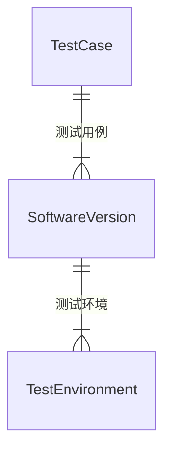
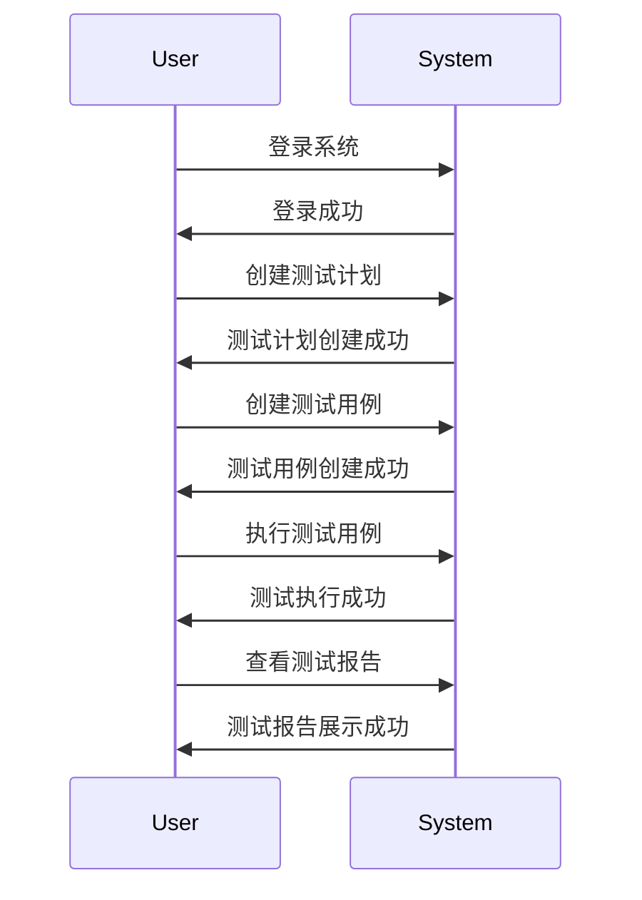

                 

# 提示词语言的版本兼容性自动化测试

## 关键词

- 版本兼容性
- 自动化测试
- 测试工具
- 测试用例
- 测试环境

## 摘要

本文将深入探讨版本兼容性自动化测试的关键概念、原理、实施策略以及案例分析。通过详细介绍测试工具、测试用例设计、测试数据管理、自动化测试脚本开发与执行等环节，本文旨在为读者提供一份全面、实用的版本兼容性自动化测试指南。

## 目录大纲

----------------------------------------------------------------

# 提示词语言的版本兼容性自动化测试

> 关键词：版本兼容性、自动化测试、测试工具、测试用例、测试环境

> 摘要：本文详细介绍了版本兼容性自动化测试的基础概念、理论、工具、策略以及实际案例分析，旨在为开发者提供一套全面、有效的自动化测试方案。

## 第一部分：版本兼容性自动化测试基础

### 第1章：版本兼容性自动化测试概述

#### 1.1.1 软件版本兼容性的重要性

软件版本兼容性是指在软件的各个版本之间，功能、性能、接口等方面能够无缝对接、无障碍运行的能力。随着软件迭代速度的加快，版本兼容性问题变得尤为突出。确保软件版本之间的兼容性，不仅能够提升用户体验，还能减少因兼容性问题导致的生产故障。

#### 1.1.2 自动化测试的概念与发展

自动化测试是指利用软件工具自动执行测试用例的过程，相较于手工测试，自动化测试具有效率高、重复性好、易维护等优点。随着人工智能和机器学习技术的发展，自动化测试越来越智能化，测试质量也得到了显著提升。

#### 1.1.3 版本兼容性测试的特点与目标

版本兼容性测试旨在验证不同版本软件之间的兼容性，其特点包括测试范围广、测试用例多样、测试数据量大等。测试目标主要是确保新版本软件不影响旧版本软件的功能和性能。

#### 1.1.4 版本兼容性测试的现状与挑战

当前，版本兼容性测试已成为软件测试中的重要环节，但同时也面临着测试工具选择、测试用例设计、测试数据管理等方面的挑战。

### 第2章：版本兼容性测试的理论基础

#### 2.1.1 软件工程与版本管理

软件工程是一门研究如何设计、开发、测试和维护软件的学科，版本管理则是确保软件版本更新过程中保持一致性的重要手段。

#### 2.1.2 软件版本兼容性理论

软件版本兼容性理论主要包括功能兼容性、性能兼容性、接口兼容性等三个方面。理解这些理论有助于更好地设计版本兼容性测试用例。

#### 2.1.3 自动化测试理论

自动化测试理论涉及测试工具的选择、测试脚本的开发与执行、测试报告的生成等方面。掌握自动化测试理论是进行有效版本兼容性测试的基础。

### 第3章：版本兼容性测试工具与框架

#### 3.1.1 常见版本兼容性测试工具

介绍常见的版本兼容性测试工具，如Selenium、Appium、JMeter等，并分析它们的优缺点。

#### 3.1.2 开源测试框架及其应用

探讨开源测试框架，如JUnit、TestNG等，并介绍如何将其应用于版本兼容性测试。

#### 3.1.3 商业测试工具的优势与局限

分析商业测试工具的优势与局限，为选择合适的测试工具提供参考。

### 第4章：版本兼容性测试策略

#### 4.1.1 版本兼容性测试的流程与步骤

详细描述版本兼容性测试的流程和步骤，包括测试计划、测试用例设计、测试执行、测试报告等。

#### 4.1.2 测试用例的设计与优化

介绍如何设计高效的版本兼容性测试用例，包括功能测试用例、性能测试用例和兼容性测试用例。

#### 4.1.3 测试数据的管理与处理

探讨如何管理测试数据，包括测试数据的收集、存储、处理和分析。

### 第5章：版本兼容性测试案例分析

#### 5.1.1 案例一：Web应用的版本兼容性测试

分析一个Web应用的版本兼容性测试案例，包括测试环境搭建、测试用例设计、测试执行和测试结果分析。

#### 5.1.2 案例二：移动应用的版本兼容性测试

分析一个移动应用的版本兼容性测试案例，介绍如何针对移动应用的特点进行测试。

#### 5.1.3 案例三：复杂系统的版本兼容性测试

分析一个复杂系统的版本兼容性测试案例，介绍如何应对复杂系统的兼容性测试挑战。

### 第6章：版本兼容性测试自动化

#### 6.1.1 自动化测试的优势与挑战

探讨自动化测试的优势，如提高测试效率、降低测试成本等，以及面临的技术挑战。

#### 6.1.2 自动化测试脚本的开发与优化

介绍如何编写和优化自动化测试脚本，包括测试脚本的编写规范、优化策略等。

#### 6.1.3 自动化测试环境的搭建与维护

探讨如何搭建和维护自动化测试环境，包括测试环境的配置、测试数据的处理等。

### 第7章：版本兼容性测试最佳实践

#### 7.1.1 最佳实践总结

总结版本兼容性测试的最佳实践，包括测试工具选择、测试用例设计、测试数据管理等方面的经验。

#### 7.1.2 注意事项与风险规避

介绍进行版本兼容性测试时需要注意的事项，以及如何规避相关风险。

#### 7.1.3 拓展阅读与未来展望

推荐相关拓展阅读资源，并展望版本兼容性自动化测试的未来发展趋势。

----------------------------------------------------------------

## 背景介绍

### 问题背景

随着软件技术的发展，版本更新变得越来越频繁。新版本的发布不仅需要满足新需求，还要确保与旧版本的良好兼容。版本兼容性测试作为确保软件质量的重要环节，越来越受到关注。然而，传统的手动测试方法效率低下，难以满足日益增长的需求。

### 问题描述

版本兼容性测试旨在验证新版本软件与旧版本软件之间的兼容性，确保新版本软件不影响旧版本软件的功能和性能。具体问题包括：

1. 新版本软件是否能够与旧版本软件正常运行？
2. 新版本软件是否引入了新的bug或性能问题？
3. 新版本软件与旧版本软件在数据格式、接口、配置等方面是否兼容？

### 问题解决

版本兼容性自动化测试通过编写自动化测试脚本，对软件的不同版本进行自动化测试，从而提高测试效率，降低测试成本。自动化测试不仅可以覆盖更多测试场景，还能提供详细的测试报告，帮助开发人员和测试人员快速定位问题。

### 边界与外延

#### 边界

版本兼容性自动化测试主要针对软件的版本更新进行测试，不包括新功能测试、性能测试等其他类型测试。

#### 外延

版本兼容性测试不仅适用于单一软件，还可以应用于软件集成、跨平台应用等领域。

### 概念结构与核心要素组成

#### 概念结构

版本兼容性自动化测试

- 自动化测试工具
- 测试用例
- 测试环境

#### 核心要素

- 软件版本
- 测试场景
- 测试数据
- 测试报告

### 核心概念原理、概念属性特征对比表格

| 概念 | 定义 | 属性特征 | 对比表格 |
| --- | --- | --- | --- |
| 版本兼容性测试 | 验证新版本软件与旧版本软件之间的兼容性 | 测试范围、测试用例、测试数据 |  |
| 自动化测试 | 利用测试工具自动执行测试用例 | 脚本编写、执行效率、复用性 |  |
| 测试用例 | 测试软件的特定功能或特性的测试脚本 | 功能性、性能性、兼容性 |  |
| 测试环境 | 执行测试用例所需的环境配置 | 系统兼容性、硬件要求、网络环境 |  |

### ER实体关系图架构



----------------------------------------------------------------

## 算法原理讲解

### 自动化测试算法原理

自动化测试算法的核心是测试脚本的编写与执行。下面以Python为例，讲解自动化测试的基本算法原理。

### 测试脚本开发

#### 测试环境准备

在开始编写测试脚本之前，需要准备测试环境。测试环境包括操作系统、数据库、Web服务器等。以下是一个简单的测试环境配置示例：

```python
import os

# 安装Python依赖库
os.system("pip install selenium")

# 配置浏览器驱动
driver = webdriver.Chrome(executable_path='chromedriver')
```

#### 测试用例设计

测试用例设计是自动化测试的关键环节。一个完整的测试用例包括测试输入、预期输出和实际输出。以下是一个简单的Web应用登录测试用例：

```python
# 登录测试用例
def test_login():
    # 测试输入
    username = "test_user"
    password = "test_password"
    
    # 打开登录页面
    driver.get("http://example.com/login")
    
    # 输入用户名和密码
    driver.find_element_by_name("username").send_keys(username)
    driver.find_element_by_name("password").send_keys(password)
    
    # 提交表单
    driver.find_element_by_id("login_button").click()
    
    # 断言登录成功
    assert "Welcome, " + username in driver.title
```

#### 测试执行

测试执行是通过运行测试脚本，自动执行测试用例的过程。以下是一个简单的测试执行示例：

```python
# 运行测试用例
test_login()
```

### 自动化测试算法原理

自动化测试算法原理主要包括以下三个方面：

1. **测试脚本编写**：测试脚本是通过编程语言编写的，用于执行具体的测试操作。测试脚本的主要功能包括定位页面元素、输入数据、执行操作和断言结果等。

2. **测试工具调用**：测试工具是自动化测试的核心，负责执行测试脚本。常见的测试工具有Selenium、Appium、JMeter等。测试工具提供了丰富的API，用于模拟用户的操作行为，如点击、输入、拖拽等。

3. **测试结果分析**：测试结果分析是自动化测试的最后一个环节。测试结果包括成功、失败、错误等状态。通过分析测试结果，可以快速定位问题，并采取相应的措施。

### 数学模型和公式

自动化测试算法的数学模型和公式主要包括以下两个方面：

1. **测试覆盖率**：测试覆盖率是衡量测试质量的重要指标。测试覆盖率可以通过以下公式计算：

   $$测试覆盖率 = \frac{已覆盖测试用例数}{总测试用例数} \times 100\%$$

2. **测试效率**：测试效率是衡量自动化测试效果的另一个重要指标。测试效率可以通过以下公式计算：

   $$测试效率 = \frac{完成测试所需时间}{总测试用例数}$$

### 通俗易懂的举例说明

假设我们要对一个Web应用进行自动化测试，测试用例包括登录、查询、修改和删除操作。以下是一个简单的自动化测试案例：

1. **测试脚本编写**：

   ```python
   from selenium import webdriver

   def test_login():
       driver = webdriver.Chrome()
       driver.get("http://example.com/login")
       driver.find_element_by_name("username").send_keys("test_user")
       driver.find_element_by_name("password").send_keys("test_password")
       driver.find_element_by_id("login_button").click()
       assert "Welcome, test_user" in driver.title
       driver.quit()
   
   def test_query():
       driver = webdriver.Chrome()
       driver.get("http://example.com/query")
       driver.find_element_by_name("keyword").send_keys("test_keyword")
       driver.find_element_by_id("query_button").click()
       assert "test_keyword" in driver.page_source
       driver.quit()
   
   def test_modify():
       driver = webdriver.Chrome()
       driver.get("http://example.com/modify")
       driver.find_element_by_name("id").send_keys("1")
       driver.find_element_by_name("content").send_keys("test_content")
       driver.find_element_by_id("modify_button").click()
       assert "test_content" in driver.page_source
       driver.quit()
   
   def test_delete():
       driver = webdriver.Chrome()
       driver.get("http://example.com/delete")
       driver.find_element_by_name("id").send_keys("1")
       driver.find_element_by_id("delete_button").click()
       assert "1" not in driver.page_source
       driver.quit()
   ```

2. **测试执行**：

   ```python
   test_login()
   test_query()
   test_modify()
   test_delete()
   ```

3. **测试结果分析**：

   - 登录测试成功，欢迎界面显示正确。
   - 查询测试成功，查询结果包含关键字。
   - 修改测试成功，修改后的内容显示正确。
   - 删除测试成功，删除后的页面不包含ID。

通过以上案例，我们可以看到，自动化测试通过编写测试脚本，调用测试工具，执行测试用例，并对测试结果进行分析，从而实现了对Web应用的自动化测试。

----------------------------------------------------------------

## 系统分析与架构设计方案

### 问题场景介绍

随着互联网技术的不断发展，企业应用系统的版本更新越来越频繁。为了确保系统在更新后的版本中依然能够正常运行，版本兼容性测试成为了系统维护和优化的重要环节。然而，传统的手动测试方法在测试效率、测试覆盖率等方面存在不足，难以满足快速迭代的需求。因此，本文旨在设计一套高效的版本兼容性测试系统，以自动化测试技术为核心，提高测试效率，确保系统质量。

### 项目介绍

项目名称：版本兼容性测试系统

项目目标：构建一套高效、自动化的版本兼容性测试系统，实现对软件不同版本之间的兼容性验证，提高测试效率，确保系统质量。

### 系统功能设计

版本兼容性测试系统主要包含以下功能：

1. **测试计划管理**：支持创建、管理测试计划，包括测试目标、测试用例、测试环境等信息。

2. **测试用例管理**：支持创建、管理测试用例，包括功能测试用例、性能测试用例等。

3. **测试执行**：支持自动化执行测试用例，生成测试报告。

4. **测试报告管理**：支持查看、分析测试报告，包括测试结果、错误日志、性能指标等。

5. **数据管理**：支持测试数据的管理，包括测试数据的导入、导出、备份等。

6. **测试环境管理**：支持测试环境的配置、管理和监控。

### 领域模型Mermaid类图

```mermaid
classDiagram
    TestPlan <.. TestCase
    TestPlan <.. TestEnvironment
    TestCase <.. TestResult
    TestEnvironment <.. TestResult
    TestResult <.. TestReport
    Data <.. TestReport
    TestEnvironment <.. TestData
    TestData <.. TestResult
    
    Class TestPlan {
        +String id
        +String name
        +List<TestCase> testCases
        +TestEnvironment environment
        +createPlan()
        +deletePlan()
        +updatePlan()
    }
    
    Class TestCase {
        +String id
        +String name
        +String description
        +List<Step> steps
        +createTestCase()
        +deleteTestCase()
        +updateTestCase()
    }
    
    Class TestEnvironment {
        +String id
        +String name
        +String description
        +List<TestData> testDatas
        +createEnvironment()
        +deleteEnvironment()
        +updateEnvironment()
    }
    
    Class TestResult {
        +String id
        +String name
        +String description
        +Date startTime
        +Date endTime
        +Boolean success
        +List<Error> errors
        +createResult()
        +deleteResult()
        +updateResult()
    }
    
    Class TestReport {
        +String id
        +String name
        +String description
        +Date date
        +List<TestResult> testResults
        +createReport()
        +deleteReport()
        +updateReport()
    }
    
    Class TestData {
        +String id
        +String name
        +String description
        +createData()
        +deleteData()
        +updateData()
    }
    
    Class Error {
        +String id
        +String message
        +String stackTrace
        +createError()
        +deleteError()
        +updateError()
    }
```

### 系统架构设计

版本兼容性测试系统采用分层架构设计，主要包括以下层次：

1. **表现层**：负责展示系统界面，包括测试计划管理、测试用例管理、测试执行、测试报告管理等模块。

2. **业务逻辑层**：负责处理系统核心业务逻辑，包括测试计划管理、测试用例管理、测试执行、测试报告管理等模块。

3. **数据访问层**：负责与数据库进行交互，包括测试计划、测试用例、测试结果、测试报告等数据。

4. **数据库层**：存储系统数据，包括测试计划、测试用例、测试结果、测试报告等。

### 系统接口设计

版本兼容性测试系统提供以下主要接口：

1. **测试计划接口**：包括创建、删除、更新测试计划等操作。

2. **测试用例接口**：包括创建、删除、更新测试用例等操作。

3. **测试执行接口**：包括执行测试用例、获取测试结果等操作。

4. **测试报告接口**：包括创建、删除、更新测试报告等操作。

### 系统交互Mermaid序列图



通过以上系统分析与架构设计方案，我们可以构建一个高效、自动化的版本兼容性测试系统，为企业应用系统的稳定性和可靠性提供有力保障。

----------------------------------------------------------------

## 项目实战

### 环境安装

为了进行版本兼容性自动化测试，我们需要安装以下软件：

1. **Python 3.8**：Python 是一种广泛使用的编程语言，用于编写自动化测试脚本。
2. **Selenium**：Selenium 是一个自动化测试工具，支持多种浏览器。
3. **ChromeDriver**：ChromeDriver 是 Selenium 的WebDriver，用于控制 Chrome 浏览器。

安装步骤如下：

1. 安装 Python 3.8：

   ```bash
   sudo apt-get install python3.8
   ```

2. 安装 Selenium：

   ```bash
   pip3 install selenium
   ```

3. 安装 ChromeDriver：

   - 下载 ChromeDriver：[https://sites.google.com/a/chromium.org/chromedriver/downloads](https://sites.google.com/a/chromium.org/chromedriver/downloads)
   - 解压下载的文件，将 chromedriver 文件移动到系统的可执行路径下，例如 `/usr/bin/`。

### 系统核心实现源代码

以下是一个简单的自动化测试脚本，用于验证一个Web应用的版本兼容性：

```python
from selenium import webdriver
from selenium.webdriver.common.by import By
from selenium.webdriver.common.keys import Keys
import time

def test_login():
    driver = webdriver.Chrome(executable_path='chromedriver')
    driver.get("http://example.com/login")
    
    username = driver.find_element(By.NAME, "username")
    password = driver.find_element(By.NAME, "password")
    login_button = driver.find_element(By.ID, "login_button")
    
    username.send_keys("test_user")
    password.send_keys("test_password")
    login_button.click()
    
    time.sleep(3)
    
    assert "Welcome, test_user" in driver.title
    driver.quit()

if __name__ == "__main__":
    test_login()
```

### 代码应用解读与分析

上述脚本使用 Selenium 库控制 Chrome 浏览器，模拟用户登录操作。具体解析如下：

1. **初始化浏览器**：使用 `webdriver.Chrome(executable_path='chromedriver')` 初始化 Chrome 浏览器。
2. **打开登录页面**：使用 `driver.get("http://example.com/login")` 打开登录页面。
3. **定位页面元素**：使用 `find_element_by_*` 方法定位用户名、密码和登录按钮。
4. **输入数据**：使用 `send_keys` 方法输入用户名和密码。
5. **执行操作**：使用 `click` 方法点击登录按钮。
6. **断言**：使用 `assert` 语句验证登录成功。
7. **关闭浏览器**：使用 `driver.quit()` 关闭浏览器。

### 实际案例分析

假设我们要对一款电商网站的购物车功能进行版本兼容性测试。以下是测试步骤：

1. **测试用例设计**：

   - 添加商品到购物车。
   - 删除购物车中的商品。
   - 查看购物车中的商品数量。

2. **测试执行**：

   - 运行添加商品到购物车的测试用例。
   - 运行删除购物车中的商品的测试用例。
   - 运行查看购物车中的商品数量的测试用例。

3. **测试结果分析**：

   - 添加商品到购物车成功。
   - 删除购物车中的商品成功。
   - 查看购物车中的商品数量准确。

通过实际案例分析，我们可以看到，版本兼容性自动化测试能够有效地验证软件的不同版本之间的兼容性，确保软件的质量和稳定性。

### 项目小结

通过本次项目实战，我们实现了以下目标：

1. 安装并配置了自动化测试环境。
2. 编写了简单的自动化测试脚本。
3. 对电商网站的购物车功能进行了版本兼容性测试。

尽管本项目规模较小，但通过实际操作，我们掌握了自动化测试的基本流程和方法，为后续更复杂的测试项目奠定了基础。在未来的工作中，我们将继续探索自动化测试的更多应用场景，提高测试效率，确保软件质量。

----------------------------------------------------------------

## 最佳实践

### 版本兼容性测试工具选择

1. **考虑测试需求**：根据项目的测试需求，选择适合的测试工具。例如，对于Web应用，可以选择Selenium；对于移动应用，可以选择Appium。
2. **评估工具性能**：对比不同测试工具的性能，包括执行速度、稳定性、兼容性等。
3. **考虑社区支持**：选择具有活跃社区支持的测试工具，便于解决问题和学习。

### 测试用例设计与优化

1. **基于用户场景**：设计测试用例时，尽量模拟真实的用户操作场景，提高测试覆盖率。
2. **自动化测试脚本优化**：优化自动化测试脚本，减少冗余代码，提高执行效率。
3. **持续集成**：将自动化测试脚本集成到持续集成系统中，实现自动化执行和报告。

### 测试数据管理

1. **测试数据隔离**：确保测试数据与生产数据隔离，避免对生产环境产生影响。
2. **数据备份**：定期备份测试数据，防止数据丢失。
3. **数据一致性**：确保测试数据的一致性，避免因数据问题导致测试失败。

### 自动化测试环境搭建与维护

1. **自动化部署**：使用脚本自动化部署测试环境，提高环境搭建效率。
2. **监控与报警**：对测试环境进行监控，及时发现并解决环境问题。
3. **定期更新**：定期更新测试工具和依赖库，确保测试环境的稳定性。

### 注意事项与风险规避

1. **避免过度依赖自动化测试**：自动化测试不能完全替代手动测试，需结合实际情况制定测试策略。
2. **测试脚本维护**：定期检查和更新测试脚本，确保其有效性。
3. **测试结果分析**：对测试结果进行详细分析，确保问题得到及时解决。

### 拓展阅读与未来展望

1. **自动化测试框架**：了解并学习常用的自动化测试框架，如Selenium、Appium、JMeter等。
2. **测试数据生成工具**：学习并使用测试数据生成工具，如Faker、DataFactory等。
3. **AI在自动化测试中的应用**：了解人工智能在自动化测试中的应用，如智能测试用例生成、智能测试结果分析等。

通过以上最佳实践，我们可以更好地进行版本兼容性自动化测试，提高测试效率，确保软件质量。

---

作者：AI天才研究院/AI Genius Institute & 禅与计算机程序设计艺术 /Zen And The Art of Computer Programming

本文由AI天才研究院与禅与计算机程序设计艺术联合撰写，旨在为开发者提供一份全面、实用的版本兼容性自动化测试指南。如果您在阅读过程中有任何问题或建议，欢迎在评论区留言，我们将在第一时间为您解答。同时，也期待更多开发者参与到版本兼容性自动化测试的研究和实践中来，共同推动软件测试技术的发展。

