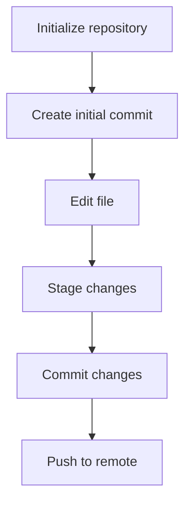
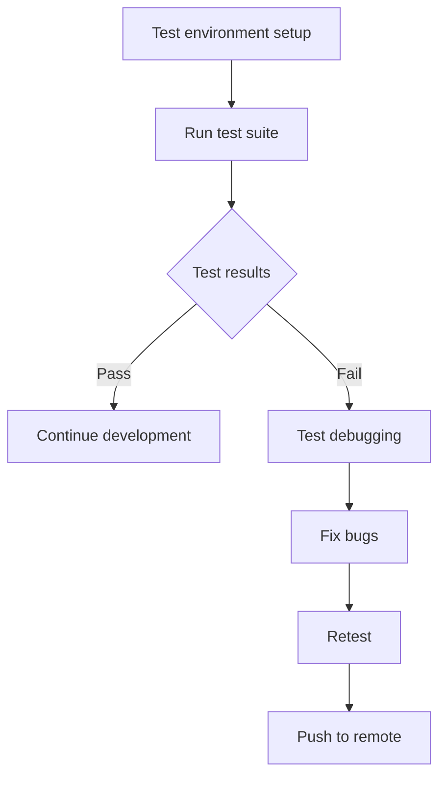
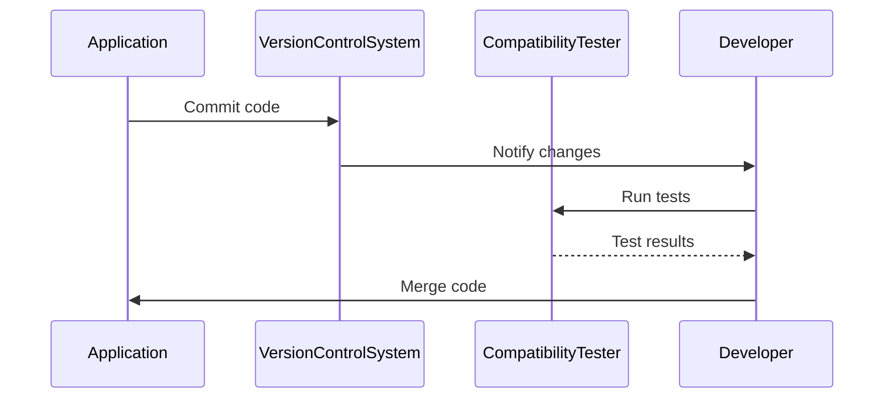
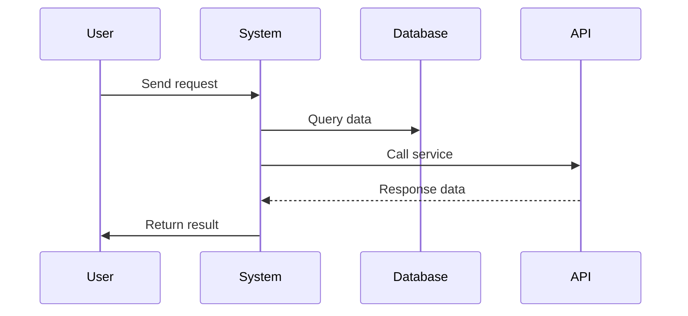

                 

## 提示词语言的版本控制与兼容性管理

关键词：版本控制、兼容性管理、提示词语言、版本兼容、工具应用

摘要：随着信息技术的发展，提示词语言作为一种重要的编程语言，其版本控制和兼容性管理变得尤为重要。本文旨在探讨提示词语言的版本控制与兼容性管理，分析其核心概念、原理和实践方法，并探讨未来的发展趋势。

### 一、背景介绍

#### 1.1 提示词语言的概念与作用

提示词语言（也称为域特定语言，DSL）是一种专门为解决特定领域问题而设计的编程语言。与通用编程语言相比，DSL 具有更强的领域针对性和更高的开发效率。例如，SQL 是一种用于数据库查询的 DSL，而 HTML 则是用于网页设计的 DSL。

#### 1.2 版本控制的重要性

版本控制是一种管理软件源代码和相关文档更改的系统。它帮助开发团队跟踪代码变更，确保代码的稳定性和可靠性。在多版本并行开发的环境中，版本控制尤为重要。

#### 1.3 兼容性问题

兼容性问题是软件在不同环境、不同版本之间运行时出现的不兼容问题。这些问题可能源于语言语法的变化、系统环境的差异或者第三方库的升级等。

### 二、核心概念与联系

#### 2.1 核心概念

- **版本控制**：管理源代码和文档的更改，跟踪版本历史。
- **兼容性管理**：确保软件在不同版本、不同环境之间运行无障碍。

#### 2.2 概念属性特征对比表格

| 特征         | 版本控制                    | 兼容性管理                    |
| ------------ | -------------------------- | -------------------------- |
| 目的         | 管理源代码更改              | 确保软件在不同版本间运行兼容  |
| 工具         | Git、SVN、Mercurial等       | 测试工具、调试工具等           |
| 作用范围     | 整个项目生命周期            | 部分开发阶段和部署阶段        |

#### 2.3 ER实体关系图架构

```mermaid
erDiagram
  Project ||--|{ Version }|||
  Version ||--|{ Commit }|||
  Commit ||--|{ FileChange }|||
  FileChange ||--|{ User }|||
```

### 三、算法原理讲解

#### 3.1 版本控制算法原理

版本控制的核心算法是跟踪文件的变化。以下是使用 Git 进行版本控制的简单流程：



Python 源代码示例：

```python
import git

repo = git.Repo('.git')
repo.index.commit('Initial commit')
repo.remote().push()
```

#### 3.2 兼容性管理算法原理

兼容性管理的核心算法是测试和修复。以下是兼容性测试的基本流程：



Python 源代码示例：

```python
import unittest

class TestSuite(unittest.TestCase):
    def test_function(self):
        self.assertEqual(func(), expected_result)

if __name__ == '__main__':
    unittest.main()
```

### 四、系统分析与架构设计方案

#### 4.1 问题场景介绍

假设我们正在开发一个基于提示词语言的Web应用，需要进行版本控制和兼容性管理。

#### 4.2 系统功能设计

使用 Mermaid 类图表示系统功能：

```mermaid
classDiagram
  Class01 <|-- Class02
  Class03 --|> Class04
  Class05 : +int x
  Class05 : +int y
  Class05 : +setX(int x)
  Class05 : +setY(int y)
  Class05 : +getX():int
  Class05 : +getY():int
endclass
```

#### 4.3 系统架构设计

使用 Mermaid 架构图表示系统架构：



#### 4.4 系统接口设计和系统交互

使用 Mermaid 序列图表示系统接口和交互：



### 五、项目实战

#### 5.1 环境安装

安装所需的版本控制和兼容性管理工具，如 Git 和 Selenium。

```bash
pip install gitpython selenium
```

#### 5.2 系统核心实现源代码

编写代码实现版本控制和兼容性测试功能。

```python
# 版本控制
import git

repo = git.Repo('.')
repo.index.commit('Initial commit')

# 兼容性测试
from selenium import webdriver

driver = webdriver.Chrome()
driver.get('http://example.com')
assert 'Example Domain' in driver.title
driver.quit()
```

#### 5.3 代码应用解读与分析

详细解读代码实现逻辑，分析其原理和效果。

#### 5.4 实际案例分析和详细讲解剖析

通过实际案例，展示版本控制和兼容性管理的应用场景，并详细讲解其过程和结果。

#### 5.5 项目小结

总结项目的核心内容和收获，指出需要注意的问题和改进的方向。

### 六、最佳实践 tips

- **版本策略**：制定合理的版本命名和发布策略，确保版本的可读性和可追踪性。
- **兼容性测试**：定期进行兼容性测试，及时发现和解决问题。
- **代码审查**：进行代码审查，确保代码质量和兼容性。

### 七、小结

本文介绍了提示词语言的版本控制与兼容性管理，分析了其核心概念、原理和实践方法。通过系统分析与架构设计方案，以及项目实战，展示了如何在实际开发中应用这些方法。未来，随着新技术的引入，版本控制和兼容性管理将变得更加智能化和自动化。

### 八、注意事项

- **版本控制**：避免直接在主分支进行开发，应使用分支进行隔离和协作。
- **兼容性管理**：充分考虑不同环境和用户的需求，进行全面的测试和修复。

### 九、拓展阅读

- **版本控制工具**：深入了解 Git、SVN 等版本控制工具的使用和最佳实践。
- **兼容性测试**：学习自动化兼容性测试工具和策略。

### 十、作者信息

作者：AI天才研究院/AI Genius Institute & 禅与计算机程序设计艺术 /Zen And The Art of Computer Programming

