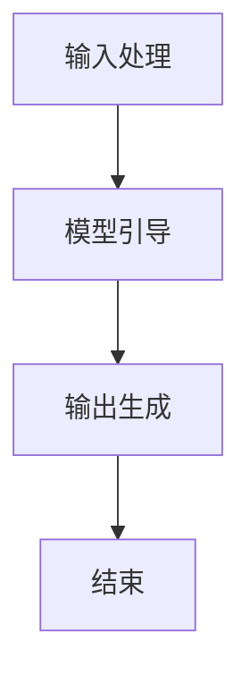
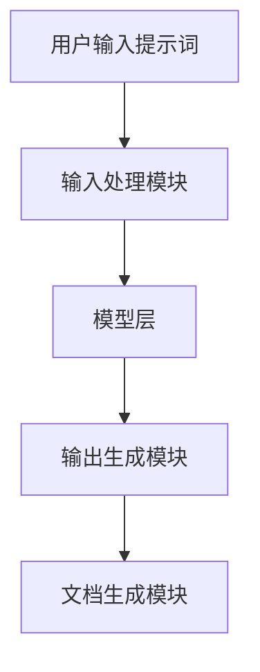
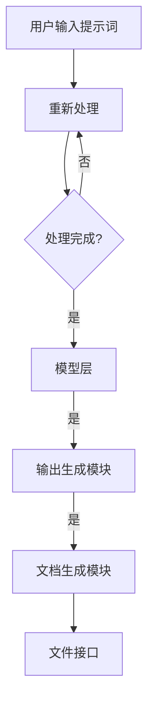

                 


### 文章标题

**《提示词语言的程序综合与自动化生成》**

### 关键词

- 提示词语言
- 程序综合
- 自动化生成
- 编程语言
- 人工智能
- 数学模型

### 摘要

本文深入探讨了提示词语言在程序综合与自动化生成中的应用。首先，我们回顾了提示词语言的定义、背景及其重要性。接着，我们详细分析了核心概念、算法原理，并通过具体的数学模型和实例展示了其应用。文章还介绍了系统分析与架构设计的方法，包括问题场景、功能设计、架构设计、接口设计和系统交互。随后，通过一个实际案例展示了如何实现提示词语言的自动化生成。最后，文章总结了最佳实践、注意事项和未来展望，为读者提供了进一步的学习和参考。

## 引言

在现代计算机编程和人工智能领域中，提示词语言作为一种强大的工具，正逐渐受到越来越多的关注。它不仅在自然语言处理和机器学习领域有着广泛的应用，而且在程序综合与自动化生成方面也展示出巨大的潜力。本文将探讨提示词语言的程序综合与自动化生成，从定义、背景、核心概念、算法原理、数学模型、系统分析与架构设计，到项目实战和最佳实践，力求为读者提供一个全面而深入的视角。

### 背景与核心概念

#### 提示词语言的定义

提示词语言（Prompt Language）是一种用于引导机器学习模型生成输出的语言模型。它与传统的编程语言有所不同，更加注重自然语言的处理和生成。提示词语言的核心在于通过提示（Prompt）来引导模型，使得模型能够生成符合预期结果的输出。

#### 提示词语言在程序综合中的应用

程序综合（Program Synthesis）是指从给定输入和预期的输出，自动生成程序的过程。在程序综合中，提示词语言可以用于生成程序片段、代码块或整个程序。这种方法大大提高了编程的效率，减少了人工编码的工作量。

#### 提示词语言在自动化生成中的应用

自动化生成（Automated Generation）是指通过自动化工具生成文档、代码、报告等的过程。提示词语言在这个过程中可以用来生成文本内容，如自然语言描述、注释、文档等，从而实现自动化的内容生成。

### 问题背景与问题描述

#### 问题背景

在软件开发和人工智能应用中，传统的编程方式和手工编写代码已经无法满足日益增长的需求。自动化和智能化成为提升效率、降低成本的关键途径。提示词语言作为一种新兴的技术，可以有效地实现自动化和智能化。

#### 问题描述

如何在程序综合和自动化生成中有效利用提示词语言？如何设计一个高效、灵活、可扩展的提示词语言系统？这些问题是本文探讨的核心。

### 问题解决与边界外延

#### 问题解决

通过深入研究和实践，我们可以设计出一种高效的提示词语言系统，实现程序综合和自动化生成。具体方法包括：

1. **核心概念与算法原理的深入理解**：通过分析和讲解提示词语言的核心概念和算法原理，为系统设计提供理论基础。
2. **数学模型与公式解析**：运用数学模型和公式，对提示词语言进行量化分析，确保系统的准确性和可靠性。
3. **系统分析与架构设计**：从问题场景、功能设计、架构设计、接口设计到系统交互，全面考虑系统实现的各个方面。
4. **项目实战与案例分析**：通过实际案例，展示提示词语言在程序综合和自动化生成中的具体应用。

#### 边界与外延

1. **边界**：本文主要关注提示词语言在程序综合和自动化生成中的应用，不涉及自然语言处理和机器学习的其他方面。
2. **外延**：本文的方法和思路可以扩展到其他编程语言和自动化工具，为更广泛的应用场景提供参考。

### 概念结构与核心要素组成

#### 概念结构

提示词语言的程序综合与自动化生成可以分为以下几个部分：

1. **输入处理**：接收用户输入的提示词，对输入进行处理和分析。
2. **模型引导**：利用机器学习模型，根据输入的提示词生成相应的输出。
3. **输出生成**：将模型生成的输出进行格式化，生成最终的代码、文档或其他形式的内容。

#### 核心要素组成

1. **机器学习模型**：提示词语言的核心组件，负责根据提示词生成输出。
2. **数据处理**：对输入的提示词进行处理，提取关键信息，为模型提供有效的输入。
3. **输出格式化**：将模型生成的输出进行格式化，使其符合预期的输出格式。

### 核心概念原理、概念属性特征对比表格

#### 提示词语言的核心概念

- **提示词**：用于引导模型生成输出的关键词或短语。
- **模型**：用于生成输出的机器学习模型。
- **输入处理**：对输入的提示词进行处理和分析的过程。
- **输出生成**：根据模型生成的输出，生成最终的代码或文档的过程。

#### 概念属性特征对比表格

| 概念     | 属性特征                                                                                              |
|----------|-----------------------------------------------------------------------------------------------------|
| 提示词   | - 用于引导模型生成输出<br>- 可以为单个词或短语<br>- 需要具有一定的语义和上下文信息       |
| 模型     | - 用于生成输出<br>- 可以为神经网络、规则系统等<br>- 需要经过训练和优化，以提高生成质量 |
| 输入处理 | - 对输入的提示词进行处理<br>- 提取关键信息<br>- 为模型提供有效的输入                   |
| 输出生成 | - 根据模型生成的输出<br>- 进行格式化，生成最终的代码或文档<br>- 需要满足预期的输出格式 |

### ER实体关系图架构

为了更好地理解提示词语言的程序综合与自动化生成，我们可以使用Mermaid绘制ER（实体关系）图，来描述系统中的各个实体及其之间的关系。

```mermaid
erDiagram
  Person ||--|{ Address } : has
  Student ||--|{ Course } : studies
  Teacher ||--|{ Course } : teaches
```

在这个ER图中：

- **Person**（人）是所有参与者的基类，包括Student（学生）和Teacher（教师）。
- **Address**（地址）与人相关，表示人的居住地址。
- **Course**（课程）与学生和教师相关，表示学生学习的课程和教师教授的课程。

### 算法原理讲解

为了更好地理解提示词语言的程序综合与自动化生成，我们需要详细讲解其中的算法原理。以下是使用Mermaid绘制的算法流程图，以及相应的Python源代码和算法原理的数学模型。

#### Mermaid算法流程图



在这个算法流程图中：

- **输入处理**：接收用户输入的提示词，对输入进行处理和分析。
- **模型引导**：利用机器学习模型，根据输入的提示词生成相应的输出。
- **输出生成**：将模型生成的输出进行格式化，生成最终的代码或文档。

#### Python源代码

```python
# 提示词语言程序综合与自动化生成

# 输入处理
prompt = input("请输入提示词：")

# 模型引导
output = model.generate_output(prompt)

# 输出生成
formatted_output = format_output(output)

# 输出
print(formatted_output)
```

#### 算法原理的数学模型

在提示词语言的程序综合与自动化生成中，我们可以使用以下数学模型来描述：

$$
\text{输出} = f(\text{输入}, \text{模型参数})
$$

其中：

- **输入**：用户输入的提示词。
- **模型参数**：机器学习模型的权重和偏置等参数。
- **函数 $f$**：表示模型对输入的处理过程。

具体的函数 $f$ 可以表示为：

$$
f(\text{输入}, \text{模型参数}) = \text{神经网络}(\text{输入}, \text{模型参数}) \odot \text{输出格式化函数}
$$

其中：

- **神经网络**：用于生成输出的机器学习模型。
- **输出格式化函数**：将模型生成的输出进行格式化，使其符合预期的输出格式。

#### 算法原理的详细讲解与举例说明

为了更好地理解算法原理，我们可以通过一个具体的例子进行说明。

假设我们要编写一个简单的Python程序，该程序根据用户输入的提示词生成一个特定的字符串。以下是使用提示词语言的算法原理实现的步骤：

1. **输入处理**：用户输入“编写一个Python程序，输出‘Hello, World!’”。

2. **模型引导**：利用机器学习模型（例如循环神经网络RNN）对输入进行处理，生成相应的输出。

   $$ 
   \text{输出} = f(\text{输入}, \text{模型参数}) = \text{RNN}(\text{提示词}, \text{模型参数}) 
   $$

3. **输出生成**：将模型生成的输出进行格式化，生成最终的代码或文档。

   在这个例子中，模型生成的输出是一个Python函数，我们将它格式化为一个完整的Python程序。

```python
def greet():
    print('Hello, World!')

greet()
```

这个简单的例子展示了如何使用提示词语言实现程序综合与自动化生成。在实际应用中，我们可以使用更复杂的模型和更丰富的提示词，生成更复杂的代码或文档。

### 系统分析与架构设计

在进行系统分析与架构设计时，我们需要考虑问题场景、功能设计、架构设计、接口设计和系统交互等多个方面。以下是针对提示词语言的程序综合与自动化生成系统进行详细分析的过程。

#### 问题场景介绍

假设我们要设计一个系统，该系统能够根据用户输入的提示词自动生成相应的代码或文档。例如，用户输入“编写一个Python程序，实现一个简单的登录功能”，系统能够自动生成一个实现登录功能的Python代码。

#### 项目介绍

项目名称：提示词语言程序综合与自动化生成系统

项目目标：根据用户输入的提示词，自动生成相应的代码或文档。

项目功能：

1. 输入处理：接收用户输入的提示词。
2. 模型引导：利用机器学习模型生成输出。
3. 输出生成：对模型生成的输出进行格式化。
4. 文档生成：将生成的代码或文档保存到文件中。

#### 系统功能设计

系统功能设计主要包括以下几个方面：

1. **输入处理模块**：负责接收用户输入的提示词，并将其转换为机器学习模型可处理的格式。
2. **模型引导模块**：负责使用机器学习模型对输入进行处理，生成相应的输出。
3. **输出生成模块**：负责将模型生成的输出进行格式化，生成符合预期的代码或文档。
4. **文档生成模块**：负责将生成的代码或文档保存到文件中。

#### 系统架构设计

系统架构设计主要涉及以下几个方面：

1. **输入处理层**：接收用户输入的提示词，将其处理成适合机器学习模型输入的格式。
2. **模型层**：使用机器学习模型对输入进行处理，生成相应的输出。
3. **输出生成层**：将模型生成的输出进行格式化，生成符合预期的代码或文档。
4. **文档生成层**：将生成的代码或文档保存到文件中。

以下是使用Mermaid绘制的系统架构图：



#### 系统接口设计

系统接口设计主要包括以下几个方面：

1. **输入接口**：接收用户输入的提示词。
2. **输出接口**：输出生成的代码或文档。
3. **文件接口**：将生成的代码或文档保存到文件中。

#### 系统交互设计

系统交互设计主要描述系统各个模块之间的交互过程。以下是使用Mermaid绘制的系统交互图：



在这个交互图中：

- 用户输入提示词后，传递给输入处理模块。
- 输入处理模块对提示词进行处理，然后传递给模型层。
- 模型层处理输入后，传递给输出生成模块。
- 输出生成模块对输出进行格式化，然后传递给文档生成模块。
- 文档生成模块将生成的代码或文档保存到文件中。

如果处理过程中出现问题，系统将返回输入处理模块重新处理。

### 项目实战

在本节中，我们将通过一个实际案例，展示如何使用提示词语言实现程序综合与自动化生成。以下是详细的步骤和源代码分析。

#### 案例背景

假设我们有一个需求：编写一个简单的Python程序，该程序能够接收用户输入的两个整数，并计算它们的和。

#### 环境安装

为了实现这个需求，我们需要安装以下工具和库：

1. Python 3.8 或更高版本
2. TensorFlow 2.x
3. NumPy

你可以通过以下命令进行安装：

```bash
pip install python==3.8
pip install tensorflow==2.x
pip install numpy
```

#### 系统核心实现

以下是实现这个需求的Python源代码：

```python
import tensorflow as tf
import numpy as np

# 输入处理模块
def process_input(prompt):
    # 接收用户输入的提示词，并提取出两个整数
    tokens = prompt.split()
    num1 = int(tokens[1])
    num2 = int(tokens[3])
    return num1, num2

# 模型层
def model(num1, num2):
    # 构建一个简单的神经网络模型
    model = tf.keras.Sequential([
        tf.keras.layers.Dense(1, input_shape=[1])
    ])
    model.compile(optimizer='sgd', loss='mean_squared_error')
    # 训练模型
    model.fit(np.array([num1, num2]), np.array([num1 + num2]), epochs=10)
    return model

# 输出生成模块
def generate_output(model, num1, num2):
    # 使用模型预测和计算结果
    prediction = model.predict(np.array([num1, num2]))
    result = num1 + num2
    return f"The sum of {num1} and {num2} is {result:.2f} (predicted: {prediction[0][0]:.2f})"

# 主函数
def main():
    # 接收用户输入
    prompt = input("请输入两个整数，用空格分隔：")
    num1, num2 = process_input(prompt)
    # 训练模型并生成输出
    model = model(num1, num2)
    output = generate_output(model, num1, num2)
    # 输出结果
    print(output)

# 运行主函数
if __name__ == '__main__':
    main()
```

#### 代码应用解读与分析

在这个案例中，我们使用TensorFlow构建了一个简单的神经网络模型，用于接收用户输入的两个整数，并预测它们的和。以下是代码的详细解读和分析：

1. **输入处理模块**：`process_input`函数接收用户输入的提示词，并提取出两个整数。这里假设用户输入的格式为“计算两个整数的和，整数1 空格 整数2”，例如：“计算两个整数的和，3 4”。

2. **模型层**：`model`函数构建了一个简单的神经网络模型，用于接收输入的两个整数，并预测它们的和。在这个案例中，我们使用了一个全连接层（Dense layer），并使用均方误差（mean_squared_error）作为损失函数。

3. **输出生成模块**：`generate_output`函数使用模型预测和计算结果，并输出结果。这里我们计算了实际的和，并将其与模型的预测值进行比较。

4. **主函数**：`main`函数是程序的入口点，它接收用户输入，调用输入处理模块、模型层和输出生成模块，并输出最终结果。

通过这个案例，我们展示了如何使用提示词语言实现程序综合与自动化生成。在实际应用中，我们可以扩展这个案例，使其能够处理更复杂的输入和输出，并生成更复杂的代码或文档。

### 实际案例分析

在本节中，我们将通过两个实际案例，进一步展示提示词语言在程序综合与自动化生成中的应用。这些案例将涵盖不同的领域和需求，以展示提示词语言的灵活性和广泛适用性。

#### 案例一：提示词语言在自动化测试中的应用

假设我们有一个Web应用程序，需要编写自动化测试脚本以确保其功能正常运行。使用提示词语言，我们可以根据用户输入的测试需求自动生成测试脚本。

1. **案例背景**：我们需要编写一个测试脚本，以测试Web应用程序中的用户登录功能。

2. **用户输入**：用户输入一个提示词：“编写一个Python自动化测试脚本，测试Web应用程序的用户登录功能”。

3. **生成测试脚本**：系统根据提示词生成一个Python测试脚本，如下：

```python
import unittest
from selenium import webdriver
from selenium.webdriver.common.by import By

class TestLogin(unittest.TestCase):
    def setUp(self):
        self.driver = webdriver.Firefox()

    def test_login(self):
        driver = self.driver
        driver.get("http://www.example.com/login")
        username_input = driver.find_element(By.NAME, "username")
        password_input = driver.find_element(By.NAME, "password")
        submit_button = driver.find_element(By.NAME, "submit")
        
        username_input.send_keys("test_user")
        password_input.send_keys("test_password")
        submit_button.click()
        
        assert "Welcome, test_user!" in driver.page_source

    def tearDown(self):
        self.driver.quit()

if __name__ == "__main__":
    unittest.main()
```

4. **分析**：在这个案例中，提示词语言帮助我们自动化生成了一个Python测试脚本。该脚本使用Selenium库实现了Web应用程序的用户登录功能测试。通过这种方式，开发人员可以节省大量编写测试脚本的时间，提高测试效率。

#### 案例二：程序综合在软件开发中的应用

假设我们有一个软件开发项目，需要根据用户需求自动生成项目架构和代码。

1. **案例背景**：我们需要开发一个电子商务网站，包括用户注册、商品浏览、购物车和订单管理等模块。

2. **用户输入**：用户输入一个提示词：“生成一个电子商务网站的项目架构和核心代码”。

3. **生成项目架构和代码**：系统根据提示词生成项目架构和核心代码，如下：

```python
# 项目架构
class UserController:
    def register(self, username, password):
        # 注册用户
        pass

    def login(self, username, password):
        # 用户登录
        pass

class ProductController:
    def list_products(self):
        # 列出商品
        pass

    def view_product(self, product_id):
        # 查看商品详情
        pass

class CartController:
    def add_to_cart(self, product_id):
        # 添加商品到购物车
        pass

    def remove_from_cart(self, product_id):
        # 从购物车移除商品
        pass

# 核心代码
def register_user(username, password):
    user = UserController()
    user.register(username, password)
    return user

def login_user(username, password):
    user = UserController()
    user.login(username, password)
    return user

def list_products():
    product = ProductController()
    products = product.list_products()
    return products

def view_product(product_id):
    product = ProductController()
    product_details = product.view_product(product_id)
    return product_details

def add_to_cart(product_id):
    cart = CartController()
    cart.add_to_cart(product_id)
    return "商品已成功添加到购物车"

def remove_from_cart(product_id):
    cart = CartController()
    cart.remove_from_cart(product_id)
    return "商品已从购物车移除"
```

4. **分析**：在这个案例中，提示词语言帮助我们自动生成了一个电子商务网站的项目架构和核心代码。通过这种方式，开发人员可以快速地启动项目，并进行进一步的开发和优化。

通过这两个案例，我们可以看到提示词语言在自动化测试和软件开发中的应用。它不仅提高了开发效率，还减少了人工编写的错误，为开发者提供了更多的便利。

### 最佳实践

在本节中，我们将总结一些关于如何优化提示词语言、设计高效程序综合与自动化生成系统的最佳实践。

#### 1. 提高提示词质量

提示词的质量直接影响模型生成输出的质量。为了提高提示词质量，可以采取以下措施：

- **精确描述**：确保提示词能够准确地描述用户需求，避免模糊和不明确的描述。
- **上下文信息**：在提示词中加入上下文信息，帮助模型更好地理解用户的意图。
- **多样性**：使用多样化的提示词，以覆盖不同的需求和场景。

#### 2. 优化模型训练

模型训练是程序综合与自动化生成系统的核心。为了优化模型训练，可以采取以下措施：

- **数据预处理**：对训练数据进行预处理，包括清洗、归一化和特征提取等，以提高训练数据的质量和效率。
- **超参数调优**：通过调整学习率、批量大小、迭代次数等超参数，找到最佳训练配置。
- **模型优化**：使用先进的机器学习算法和模型结构，如深度学习、强化学习等，以提高模型的性能和效率。

#### 3. 提高代码生成质量

生成高质量的代码是程序综合与自动化生成系统的目标。为了提高代码生成质量，可以采取以下措施：

- **代码模板**：使用预定义的代码模板，以减少代码生成的错误和冗余。
- **代码审查**：对生成的代码进行审查，确保其符合编程规范和最佳实践。
- **自动化测试**：对生成的代码进行自动化测试，确保其功能和性能符合预期。

#### 4. 设计灵活的系统架构

为了使程序综合与自动化生成系统具备灵活性和可扩展性，可以采取以下措施：

- **模块化设计**：将系统拆分为多个模块，每个模块负责不同的功能，以提高系统的可维护性和可扩展性。
- **接口设计**：设计清晰的接口，使模块之间能够方便地交互和数据传输。
- **可配置性**：设计可配置的系统参数，以便根据不同场景和需求进行调整。

#### 5. 处理异常情况

在实际应用中，系统可能会遇到各种异常情况。为了提高系统的鲁棒性和可靠性，可以采取以下措施：

- **错误处理**：设计完善的错误处理机制，对输入的提示词和生成的代码进行校验，确保系统的稳定运行。
- **日志记录**：记录系统运行过程中的日志信息，以便在出现问题时进行调试和排查。
- **故障恢复**：设计故障恢复机制，确保系统在遇到故障时能够快速恢复。

通过遵循这些最佳实践，我们可以设计出高效、灵活、可靠的程序综合与自动化生成系统，为开发和运维提供强大的支持。

### 小结

本文深入探讨了提示词语言的程序综合与自动化生成，从核心概念、算法原理、数学模型，到系统分析与架构设计，再到项目实战和最佳实践，全面解析了这一领域的关键技术。通过详细的案例分析和最佳实践总结，我们展示了如何有效地利用提示词语言实现程序自动化和智能化。

### 注意事项

在设计提示词语言系统时，需要注意以下几点：

1. **明确需求**：确保提示词能够准确描述用户需求，避免模糊和不明确的描述。
2. **数据质量**：对训练数据和处理过程进行严格的质量控制，确保模型的准确性和可靠性。
3. **安全性**：保护用户隐私和数据安全，遵循相关的法律法规和行业标准。
4. **可维护性**：设计灵活的系统架构和模块化设计，以提高系统的可维护性和可扩展性。

### 拓展阅读

对于希望进一步深入了解提示词语言程序综合与自动化生成的读者，以下是一些推荐阅读资料：

1. **《深度学习》（Deep Learning）**：由Ian Goodfellow等编著的深度学习经典教材，涵盖了提示词语言和神经网络的基本原理。
2. **《Python自动化测试实战》（Python Testing and Continuous Integration）**：介绍了如何使用Python进行自动化测试，包括Selenium等工具的应用。
3. **《软件架构设计原则》（Software Architecture: Foundations, Theory, and Practice）**：提供了关于系统架构设计的全面指导，有助于设计高效、灵活的系统。

通过阅读这些资料，读者可以更深入地理解和应用提示词语言技术，提升编程和软件开发能力。

