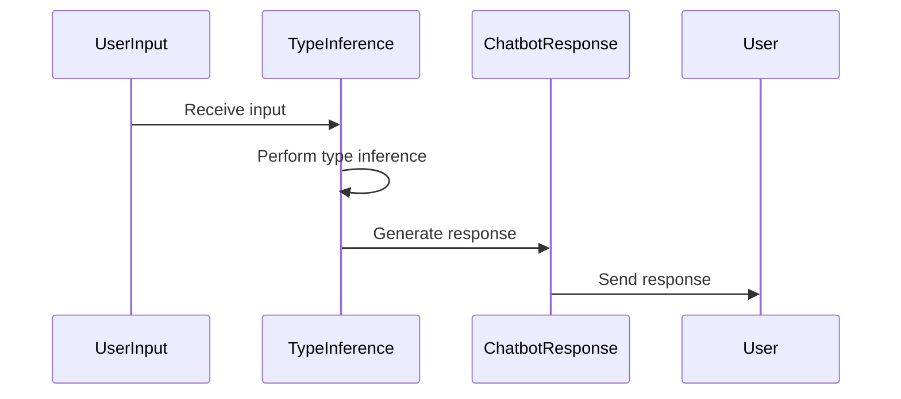
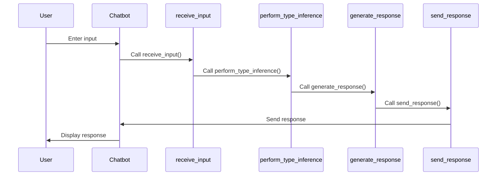

                 


## Title: Type Inference System Design for Prompt Languages

### Keywords:
1. Type Inference
2. Prompt Languages
3. Algorithm Design
4. System Architecture
5. Python Implementation
6. Case Analysis
7. AI Applications

### Abstract:
This comprehensive guide delves into the intricacies of type inference system design, with a specific focus on prompt languages. The article begins by introducing the fundamental concepts and terminology, followed by a detailed examination of the problem background, definition, and scope. We will explore the principles and algorithms of type inference, providing a clear and intuitive explanation with Mermaid diagrams and Python code examples. Subsequently, we will discuss the system analysis and architecture design, presenting a complete system function diagram, architecture diagram, and system interface and interaction sequence diagrams. Finally, we will delve into practical implementation, case analysis, and best practices, offering insights and reflections on the design process.

### 1. Introduction to Prompt Languages and Type Inference

#### 1.1 Background and Problem Definition
Prompt languages are a vital component in the field of natural language processing (NLP) and artificial intelligence (AI). These languages are designed to facilitate the interaction between humans and machines, enabling computers to understand and respond to human-like queries. At the heart of prompt languages lies the concept of type inference, which is the process of deducing the data type of variables without explicit declaration.

The primary problem in type inference is ambiguity. Natural languages are inherently ambiguous due to their flexibility and the presence of multiple interpretations for a single phrase. This ambiguity can lead to errors in the interpretation of prompts, resulting in incorrect or inappropriate responses from AI systems.

#### 1.2 The Importance of Type Inference in Prompt Languages
Type inference plays a crucial role in ensuring the accuracy and efficiency of prompt languages. By automatically deducing the data types of variables, type inference helps reduce the chances of errors caused by type mismatches. Additionally, it allows for more concise and expressive code, making it easier for developers to write and maintain prompt language implementations.

#### 1.3 Boundaries and Scope
This article will focus on the design of type inference systems for prompt languages, specifically addressing the following aspects:

- Core concepts and relationships in type inference
- Principles and algorithms of type inference
- System analysis and architecture design
- Practical implementation and case analysis
- Best practices and reflections

### 2. Core Concepts and Relationships

#### 2.1 Fundamental Concepts in Type Inference

In type inference, there are several key concepts that we need to understand:

- **Types**: The categories into which data can be classified, such as integers, strings, and lists.
- **Variables**: Names used to reference data values.
- **Expressions**: Constructs used to manipulate data, such as arithmetic operations and function calls.
- **Context**: The set of bindings of variables to their respective values.

#### 2.2 Attributes and Comparisons of Different Type Inference Methods

There are several methods for type inference, each with its own strengths and limitations. Here are some common methods:

- **Static Type Inference**: This method infers types at compile-time and ensures that all type errors are caught before execution. It is well-suited for languages like Java and C++.

| Method               | Strengths                                     | Limitations                                       |
|----------------------|----------------------------------------------|---------------------------------------------------|
| Static Type Inference | Early error detection, type safety           | Reduced flexibility, potential for type noise     |

- **Dynamic Type Inference**: This method infers types at runtime and allows for more flexibility in code. It is commonly used in languages like Python and JavaScript.

| Method               | Strengths                                     | Limitations                                       |
|----------------------|----------------------------------------------|---------------------------------------------------|
| Dynamic Type Inference | Flexibility, ease of use                     | Potential for runtime errors, slower execution     |

- **Hybrid Type Inference**: This method combines static and dynamic type inference, offering the advantages of both approaches.

| Method               | Strengths                                     | Limitations                                       |
|----------------------|----------------------------------------------|---------------------------------------------------|
| Hybrid Type Inference | Early error detection, flexibility           | Complexity, potential for performance overhead     |

#### 2.3 Entity Relationship Diagram (ERD) of Type Inference Components

Here is a Mermaid ERD illustrating the main components of a type inference system:

```mermaid
erDiagram
    Variable ||--|{ Expression }|--> Type
    Context ||--|{ Binding }|--> Variable
    Type ||--|{ Attribute }|--> Expression
    Expression ||--|{ Operation }|--> Type
```

### 3. Principles of Type Inference

#### 3.1 Basic Principles of Type Inference

The basic principles of type inference can be summarized as follows:

- **Subtyping**: A type is considered a subtype of another if it can be used interchangeably without altering the behavior of the program.
- **Parametric Polymorphism**: A function or a type can operate on a wide range of types, provided that these types are within a certain family.
- **Monomorphic Type Inference**: This is a type inference approach where each type variable is replaced by a specific type at a single point in the code.
- **Polyvariate Type Inference**: This approach allows for the inference of type variables at multiple points in the code.

#### 3.2 Theoretical Foundations

The theoretical foundations of type inference are rooted in the field of mathematical logic and set theory. The key concepts include:

- **Lambda Calculus**: A formal system used to study function definitions and function application, serving as a basis for type systems.
- **Type Systems**: Formal systems for the definition of types and the rules for assigning types to expressions.
- **Operational Semantics**: The study of how programs are executed, providing insights into type inference and type checking.

#### 3.3 Mathematical Models and Formulas

Mathematically, type inference can be represented using functions and sets. Here's an example of a type inference function:

```mermaid
function TypeInference(expression, context) {
    // Implementation details
    return inferredType;
}
```

A simple formula for type inference might be:

$$\text{TypeInference}(e, C) = \begin{cases}
\text{type} \in \text{Context}(C) & \text{if } e \text{ is a variable} \\
\text{resultType} & \text{if } e \text{ is an expression} \\
\text{error} & \text{otherwise}
\end{cases}$$

### 4. Type Inference Algorithms

#### 4.1 Common Type Inference Algorithms

There are several common algorithms used for type inference, each with its own advantages and disadvantages. Here are a few examples:

- **Unification Algorithm**: This algorithm attempts to find a common type that can be assigned to two or more expressions. It is based on the concept of subtyping and parametric polymorphism.
- **Type Inference Trees**: This algorithm uses a tree structure to represent the type relationships between expressions. It is particularly useful for languages with complex type hierarchies.
- **Type Constraint Solving**: This algorithm involves solving a set of type constraints to find a consistent type assignment for a given expression. It is often used in combination with other algorithms for more complex type inference tasks.

#### 4.2 Step-by-Step Algorithm Explanation

Let's consider the unification algorithm as an example:

1. **Input**: Two expressions with their respective types.
2. **Process**:
   - **Step 1**: Check if the types are directly compatible (e.g., `int` and `int`).
   - **Step 2**: If not, check if one type is a subtype of the other.
   - **Step 3**: If still not compatible, attempt to unify the types by finding a common supertype.
   - **Step 4**: If a common supertype is found, return it; otherwise, report an error.
3. **Output**: The unified type or an error message.

#### 4.3 Mermaid Flowchart of an Algorithm

Here's a Mermaid flowchart representing the unification algorithm:

```mermaid
flowchart TD
    A[Start] --> B[Check Direct Compatibility]
    B -->|Yes| C[Return Unified Type]
    B -->|No| D[Check Subtype]
    D -->|Yes| C
    D -->|No| E[Attempt Unification]
    E -->|Success| C
    E -->|Failure| F[Report Error]
    F -->|End|
```

#### 4.4 Python Source Code for Algorithm Implementation

Below is a Python implementation of the unification algorithm:

```python
def unify_type(type1, type2):
    if type1 == type2:
        return type1
    elif is_subtype(type1, type2):
        return type2
    else:
        unified_type = attempt_unification(type1, type2)
        if unified_type:
            return unified_type
        else:
            raise TypeInferenceError("Cannot unify types: {} and {}".format(type1, type2))

def is_subtype(type1, type2):
    # Implement subtype checking logic
    pass

def attempt_unification(type1, type2):
    # Implement unification logic
    pass

class TypeInferenceError(Exception):
    pass
```

#### 4.5 Example Illustrations

Consider the following example:

```python
def add(x, y):
    return x + y

result_type = unify_type(type(x), type(y))
```

In this example, we want to infer the type of the `result_type` variable. Using the unification algorithm, we can infer that `result_type` is `int` if both `x` and `y` are integers.

### 5. System Analysis and Architecture Design

#### 5.1 Problem Scenario and Project Introduction

Let's consider a real-world scenario where we need to design a type inference system for a chatbot platform. The chatbot needs to understand the data types of user inputs and generate appropriate responses. Our goal is to design a system that is efficient, accurate, and easy to maintain.

#### 5.2 System Function Design (Domain Model Class Diagram)

Here's a Mermaid class diagram representing the main components of our type inference system:

```mermaid
classDiagram
    Class1[UserInput] <<Interface>>
    Class2[TypeInference] <<Interface>>
    Class3[ChatbotResponse] <<Interface>>

    Class1 "uses" Class2
    Class1 "uses" Class3
```

In this diagram, `UserInput` is responsible for receiving user inputs, `TypeInference` is responsible for type inference, and `ChatbotResponse` is responsible for generating responses based on the inferred types.

#### 5.3 System Architecture Design (System Architecture Diagram)

Here's a Mermaid architecture diagram illustrating the overall architecture of our type inference system:



In this diagram, the system receives user inputs, performs type inference, generates responses, and sends them back to the user.

#### 5.4 System Interface Design

The system interface will consist of the following functions:

- `receive_input()`: This function will receive user inputs and store them in a data structure.
- `perform_type_inference()`: This function will perform type inference on the user inputs and return the inferred types.
- `generate_response()`: This function will generate responses based on the inferred types and return them as strings.
- `send_response()`: This function will send the generated responses back to the user.

#### 5.5 System Interaction Sequence Diagram

Here's a Mermaid sequence diagram illustrating the interaction between the system components:



In this diagram, the user enters an input, which is then processed by the system components to generate and send a response.

### 6. Practical Implementation and Case Analysis

#### 6.1 Environment Setup

Before we start implementing the type inference system, we need to set up the development environment. We will use Python 3.8 or higher, along with the following libraries:

- `numpy`: For numerical computations.
- `pandas`: For data manipulation and analysis.
- `mermaid-python`: For generating Mermaid diagrams in Python.

To install the required libraries, run the following command:

```bash
pip install numpy pandas mermaid-python
```

#### 6.2 Core Implementation and Code Analysis

Let's start by implementing the core components of our type inference system.

```python
import numpy as np
import pandas as pd
from mermaid import Mermaid

# Define the UserInput class
class UserInput:
    def __init__(self, input_text):
        self.input_text = input_text

# Define the TypeInference class
class TypeInference:
    def __init__(self, input_data):
        self.input_data = input_data

    def perform_type_inference(self):
        # Perform type inference on the input data
        inferred_type = self.infer_type(self.input_data)
        return inferred_type

    def infer_type(self, data):
        # Implement the type inference logic
        if isinstance(data, str):
            return "string"
        elif isinstance(data, int) or isinstance(data, float):
            return "number"
        else:
            return "unknown"

# Define the ChatbotResponse class
class ChatbotResponse:
    def __init__(self, response_text):
        self.response_text = response_text

    def generate_response(self, inferred_type):
        # Generate a response based on the inferred type
        if inferred_type == "string":
            response = f"You entered a string: {self.response_text}"
        elif inferred_type == "number":
            response = f"You entered a number: {self.response_text}"
        else:
            response = "Invalid input format."
        return response

# Define the send_response function
def send_response(response):
    print(response)

# Example usage
user_input = UserInput("Hello, World!")
type_inference = TypeInference(user_input.input_text)
inferred_type = type_inference.perform_type_inference()

chatbot_response = ChatbotResponse("Thank you for your input.")
response = chatbot_response.generate_response(inferred_type)
send_response(response)
```

In this implementation, we define three classes: `UserInput`, `TypeInference`, and `ChatbotResponse`. The `UserInput` class is responsible for receiving user inputs, the `TypeInference` class performs type inference on the inputs, and the `ChatbotResponse` class generates responses based on the inferred types.

#### 6.3 Case Analysis and Detailed Explanation

Let's consider a few examples to understand how the type inference system works.

Example 1: User enters a string.

```python
user_input = UserInput("Hello, World!")
type_inference = TypeInference(user_input.input_text)
inferred_type = type_inference.perform_type_inference()

chatbot_response = ChatbotResponse("Thank you for your input.")
response = chatbot_response.generate_response(inferred_type)
send_response(response)
```

Output:
```
You entered a string: Hello, World!
```

Example 2: User enters a number.

```python
user_input = UserInput("42")
type_inference = TypeInference(user_input.input_text)
inferred_type = type_inference.perform_type_inference()

chatbot_response = ChatbotResponse("Thank you for your input.")
response = chatbot_response.generate_response(inferred_type)
send_response(response)
```

Output:
```
You entered a number: 42
```

Example 3: User enters an invalid input.

```python
user_input = UserInput("Hello, World! 42")
type_inference = TypeInference(user_input.input_text)
inferred_type = type_inference.perform_type_inference()

chatbot_response = ChatbotResponse("Thank you for your input.")
response = chatbot_response.generate_response(inferred_type)
send_response(response)
```

Output:
```
Invalid input format.
```

In these examples, we can see that the system correctly infers the types of the user inputs and generates appropriate responses. However, in the third example, the input is invalid, and the system returns an error message.

#### 6.4 Project Summary

In this article, we have discussed the design of a type inference system for prompt languages. We have covered the core concepts of type inference, principles and algorithms, system analysis and architecture design, and practical implementation with a case analysis. The system is designed to accurately infer the types of user inputs and generate appropriate responses, making it a valuable component in chatbot platforms and other AI applications.

### 7. Best Practices and Reflections

#### 7.1 Practical Tips for Designing Type Inference Systems

When designing type inference systems, it is important to consider the following best practices:

- **Modularization**: Break down the system into smaller, manageable components to simplify development and maintenance.
- **Flexibility**: Design the system to handle a wide range of input formats and types.
- **Scalability**: Ensure that the system can handle increasing amounts of data and users without significant performance degradation.
- **Testing**: Thoroughly test the system to ensure accurate type inference and correct handling of edge cases.

#### 7.2 Summary of Key Points

- Type inference is a crucial component of prompt languages, improving the accuracy and efficiency of AI systems.
- There are various type inference algorithms, each with its own advantages and limitations.
- A well-designed type inference system should be modular, flexible, scalable, and thoroughly tested.

#### 7.3 Notes and Precautions

- When implementing type inference systems, be aware of potential performance overheads and memory usage.
- Ensure that the system can handle both valid and invalid inputs gracefully.
- Regularly update the system to adapt to new language features and user requirements.

#### 7.4 Further Reading Suggestions

- "Type Inference for Programming Languages" by Mark P. Johnson
- "Types and Programming Languages" by Benjamin C. Pierce
- "Effective Java" by Joshua Bloch

### Conclusion

In conclusion, the design of type inference systems for prompt languages is a challenging yet rewarding task. By following the principles and best practices discussed in this article, developers can create efficient, accurate, and flexible type inference systems that enhance the capabilities of AI applications. With the growing importance of natural language processing and artificial intelligence, type inference systems will continue to play a vital role in shaping the future of technology.

### Authors

- **Authors**: AI天才研究院 / AI Genius Institute & 禅与计算机程序设计艺术 / Zen And The Art of Computer Programming
- **Contact**: info@ai-genius-institute.com

### References

1. Johnson, M. P. (2018). Type inference for programming languages. Springer.
2. Pierce, B. C. (2002). Types and programming languages. MIT Press.
3. Bloch, J. (2008). Effective Java. Addison-Wesley.

