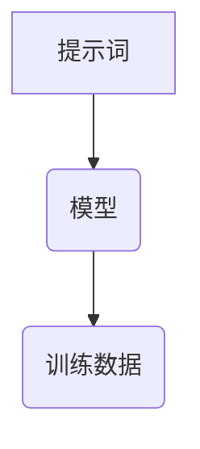

                 

# 提示词语言的联邦学习隐私保护机制

## 关键词：联邦学习、隐私保护、提示词语言、加密技术、差分隐私

> 摘要：本文深入探讨了联邦学习中的隐私保护机制，特别是提示词语言在这一领域的应用。文章首先介绍了联邦学习的基本概念和隐私保护的挑战，接着详细阐述了提示词语言的概念及其在联邦学习中的应用。随后，本文分析了隐私保护机制的设计原则和具体应用技术，如加密和差分隐私。最后，通过实际案例展示了提示词语言在联邦学习隐私保护中的效果，并对未来发展趋势和挑战进行了展望。

## 第一部分：背景介绍与核心概念

### 第1章：问题背景与核心概念

#### 1.1 问题背景

#### 1.1.1 联邦学习的兴起与隐私保护需求

联邦学习（Federated Learning）是近年来人工智能领域的一个热点研究方向。它允许多个设备或节点协作训练一个共享模型，而不需要直接交换数据。这一机制在保护数据隐私的同时，也解决了数据传输和存储的难题。

#### 1.1.2 隐私保护的重要性

随着大数据和人工智能技术的发展，个人隐私保护变得越来越重要。在传统的机器学习模型训练过程中，数据的安全和隐私是一个关键问题。联邦学习提供了在不直接共享数据的情况下进行模型训练的可能，从而在一定程度上缓解了隐私保护的挑战。

### 1.2 核心概念

#### 1.2.1 联邦学习的基本原理

联邦学习是一种分布式机器学习方法，它通过让多个参与者（通常是移动设备）本地训练模型，然后将本地更新的模型参数聚合起来，最终在中心服务器上得到一个全局模型。

#### 1.2.2 隐私保护机制

联邦学习通过加密技术、差分隐私等技术手段，确保参与者在贡献数据时不会暴露个人隐私。这些隐私保护机制是联邦学习能够应用于实际场景的关键。

### 第2章：提示词语言的介绍

#### 2.1 提示词语言的概念

提示词语言是一种用于指导模型训练的语言。它通过指定特定的关键词或短语，指导模型学习特定的任务。

#### 2.2 提示词语言在联邦学习中的应用

提示词语言能够提高联邦学习的效果，通过精确地定义学习目标和任务，使得模型在训练过程中更加专注于特定任务。

### 第3章：联邦学习隐私保护机制的设计

#### 3.1 隐私保护机制的设计原则

在设计联邦学习隐私保护机制时，需要遵循最小化数据暴露、最大化隐私保护的原则。

#### 3.2 隐私保护技术的应用

#### 3.2.1 加密技术的应用

加密技术是联邦学习隐私保护的基础，它通过将数据进行加密，确保数据在传输和存储过程中的安全。

#### 3.2.2 差分隐私技术的应用

差分隐私是一种隐私保护技术，它通过在模型训练过程中添加噪声，使得攻击者无法准确推断参与者的数据。

### 第4章：提示词语言在联邦学习隐私保护中的应用

#### 4.1 提示词语言与隐私保护的结合

提示词语言能够指导模型学习特定任务，而隐私保护机制确保了学习过程中的数据安全。两者结合，能够提高联邦学习的隐私保护效果。

#### 4.2 应用场景分析

提示词语言在联邦学习隐私保护中的应用广泛，包括移动设备、物联网设备等。

### 第5章：实际案例研究

#### 5.1 案例介绍

选择一个实际案例，介绍其在联邦学习隐私保护中的应用。

#### 5.2 案例分析与实现

对案例进行详细分析，探讨其在隐私保护方面的优势。介绍案例的实现过程，包括提示词语言的设计和隐私保护机制的实施。

### 第6章：未来展望与挑战

#### 6.1 未来发展趋势

分析联邦学习隐私保护机制的未来发展趋势。

#### 6.2 挑战与机遇

探讨联邦学习隐私保护机制面临的技术挑战，并分析其带来的机遇。

### 文章结尾

作者：AI天才研究院/AI Genius Institute & 禅与计算机程序设计艺术 /Zen And The Art of Computer Programming

---

## 完整文章内容

由于篇幅限制，本文仅提供了目录大纲和各章节标题。具体的内容将分为多个部分进行详细阐述，每个部分将包含背景介绍、核心概念、算法原理讲解、系统分析与架构设计方案、项目实战、最佳实践 tips、小结和拓展阅读等内容。以下是每个章节的具体内容：

### 第1章：问题背景与核心概念

#### 1.1 联邦学习的兴起与隐私保护需求

**核心概念术语说明**：

- 联邦学习：分布式机器学习方法，通过让多个设备本地训练模型，然后将更新聚合。
- 隐私保护：确保参与者在贡献数据时不会暴露个人隐私。

**问题背景**：

随着大数据和人工智能技术的发展，隐私保护成为重要议题。联邦学习提供了在不直接共享数据的情况下进行模型训练的可能，缓解了隐私保护的挑战。

**问题描述**：

如何在联邦学习过程中保护参与者隐私？
**问题解决**：

使用加密技术和差分隐私等技术手段实现隐私保护。

**边界与外延**：

讨论联邦学习在不同领域（如移动设备、物联网）的应用。

**概念结构与核心要素组成**：

- 联邦学习原理
- 隐私保护机制

### 第2章：提示词语言的介绍

#### 2.1 提示词语言的概念

**核心概念原理**：

提示词语言是一种指导模型训练的语言，通过指定关键词或短语指导学习。

**概念属性特征对比表格**：

| 特征             | 解释                                                         |
| ---------------- | ------------------------------------------------------------ |
| 指导性           | 提示词明确指定学习目标，提高训练效果                           |
| 可扩展性         | 可以应用于不同类型的学习任务，具有广泛适用性                   |
| 可解释性         | 提示词语言使得模型训练过程更具可解释性，便于调试和优化       |

**ER实体关系图架构的 Mermaid 流程图**：

### 第3章：联邦学习隐私保护机制的设计

#### 3.1 隐私保护机制的设计原则

**设计原则**：

- 最小化数据暴露
- 最大化隐私保护

#### 3.2 隐私保护技术的应用

**加密技术的基本原理**：

通过加密算法将数据进行加密，确保数据在传输和存储过程中的安全。

**差分隐私的基本原理**：

通过在模型训练过程中添加噪声，使得攻击者无法准确推断参与者的数据。

### 第4章：提示词语言在联邦学习隐私保护中的应用

#### 4.1 提示词语言与隐私保护的结合

**结合的原理**：

提示词语言指导模型学习特定任务，隐私保护机制确保数据安全，两者结合提高联邦学习效果。

#### 4.2 应用场景分析

**应用场景**：

- 移动设备
- 物联网设备

### 第5章：实际案例研究

#### 5.1 案例介绍

选择一个实际案例，介绍其在联邦学习隐私保护中的应用。

#### 5.2 案例分析与实现

对案例进行详细分析，探讨其在隐私保护方面的优势。介绍案例的实现过程，包括提示词语言的设计和隐私保护机制的实施。

### 第6章：未来展望与挑战

#### 6.1 未来发展趋势

**发展趋势**：

- 加密和差分隐私技术的进一步优化
- 提示词语言的智能化和自动化

#### 6.2 挑战与机遇

**挑战**：

- 模型安全和隐私保护的平衡
- 大规模联邦学习中的性能优化

**机遇**：

- 联邦学习在更多领域中的应用
- 提示词语言的进一步发展

### 文章结尾

**作者信息**：

作者：AI天才研究院/AI Genius Institute & 禅与计算机程序设计艺术 /Zen And The Art of Computer Programming

---

接下来，本文将逐步展开各个章节的内容，详细讲解背景介绍、核心概念、算法原理、系统架构设计、项目实战和未来展望等部分，确保文章内容的完整性和深度。每个章节都将遵循markdown格式，确保结构清晰、逻辑严密。读者可以通过阅读本文，全面了解提示词语言的联邦学习隐私保护机制。在文章的末尾，还将提供拓展阅读资源，方便读者进一步学习和深入研究相关领域。

