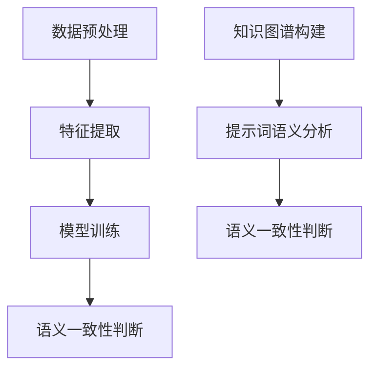
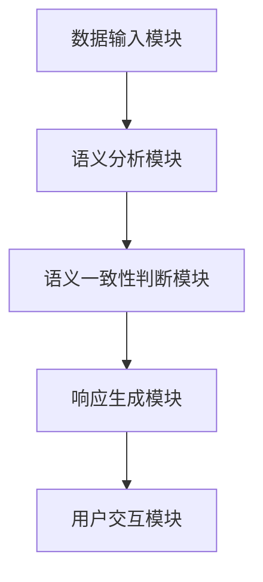
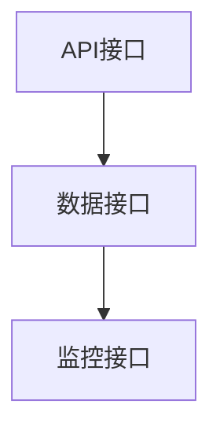
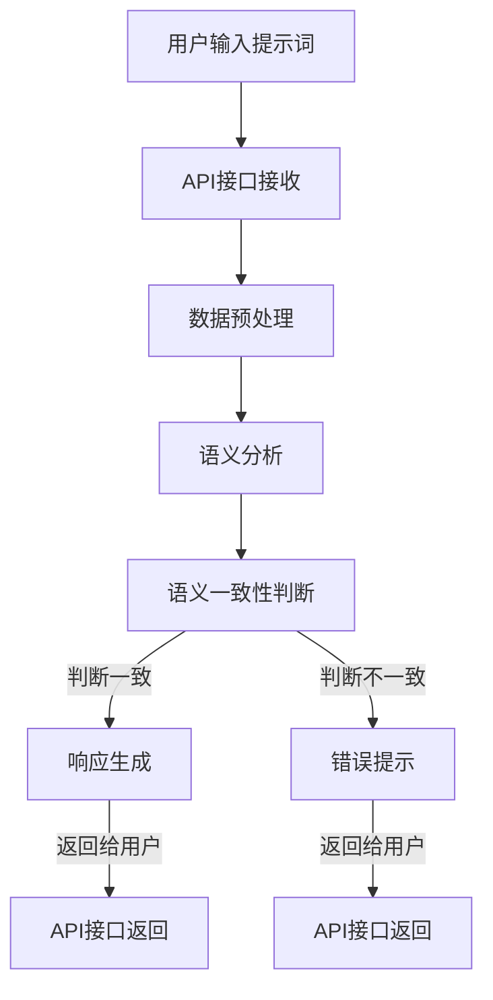

                 


# 《提示词语言的语义一致性保证》

> 关键词：语义一致性、提示词语言、自然语言处理、算法原理、系统设计与实现、项目实战

> 摘要：本文深入探讨了提示词语言的语义一致性保证，从问题背景、核心概念、算法原理、系统设计与实现、项目实战等多个方面进行了详细分析。文章旨在为从事自然语言处理和人工智能领域的技术人员提供一套完整、实用的解决方案，以应对语义一致性带来的挑战。

## 引言

语义一致性是自然语言处理（NLP）和人工智能（AI）领域的一个重要研究方向。随着互联网和大数据的快速发展，人们对于信息检索、智能问答、机器翻译等应用的需求日益增长。然而，这些应用的核心任务之一就是要确保输入的提示词与系统的响应之间保持语义一致性。语义一致性不仅是提高系统性能的关键因素，也是用户体验的重要保障。

然而，实现语义一致性并非易事。由于自然语言的复杂性和多义性，如何在海量数据中找到与输入提示词高度相关的语义信息，是一个极具挑战性的问题。本文将从以下几个方面展开讨论：

1. **问题背景与定义**：介绍语义一致性的起源、重要性以及相关研究背景。
2. **核心概念与联系**：阐述语义一致性的核心原理和特征，并提供对比表格和实体关系图。
3. **算法原理讲解**：详细讲解提示词语言语义一致性的算法原理，包括mermaid流程图和Python源代码示例。
4. **数学模型与公式**：介绍语义一致性的数学模型和公式，并进行通俗易懂的举例说明。
5. **系统设计与实现**：分析语义一致性系统的架构设计、接口设计和交互设计。
6. **项目实战**：通过一个实际项目，展示如何实现语义一致性，并进行案例分析。
7. **最佳实践与总结**：总结最佳实践技巧，提出注意事项，并推荐拓展阅读。

## 第1章 问题背景与定义

### 1.1 问题背景

语义一致性是指在自然语言处理过程中，确保输入的提示词与系统的响应之间在语义层面上保持一致性的能力。在现实世界中，语义一致性问题广泛存在于多个领域，例如：

- **信息检索**：用户输入一个关键词，搜索引擎需要返回与关键词语义相关的结果。
- **智能问答**：用户提出一个问题，系统需要给出一个语义上合理的回答。
- **机器翻译**：将一种语言的文本翻译成另一种语言，确保翻译后的文本在语义上与原文本保持一致。

然而，实现语义一致性并非易事。自然语言的复杂性和多义性使得系统在处理提示词时容易产生歧义。例如，一个简单的关键词“苹果”，可能指的是水果，也可能指的是苹果公司。如何准确理解并处理这类语义歧义，是语义一致性保证的关键挑战。

### 1.2 语义一致性的重要性

语义一致性在自然语言处理和人工智能领域具有重要意义，主要体现在以下几个方面：

- **用户体验**：确保用户输入的提示词与系统响应之间在语义上保持一致，可以提升用户的体验和满意度。
- **系统性能**：语义一致性是实现高质量自然语言处理任务的关键因素，如信息检索、智能问答、机器翻译等。
- **跨领域应用**：语义一致性使得系统在不同领域之间能够共享知识和资源，从而提高系统的灵活性和适用性。

### 1.3 相关工作综述

近年来，国内外许多研究者致力于语义一致性问题的研究。以下是一些代表性的工作：

- **文本分类**：通过机器学习方法对文本进行分类，确保分类结果与输入文本的语义保持一致。
- **命名实体识别**：识别文本中的命名实体，如人名、地名、组织机构名等，确保实体识别结果与文本的语义一致。
- **语义角色标注**：对文本中的词汇进行语义角色标注，如动词、名词、形容词等，以帮助系统更好地理解文本的语义。
- **知识图谱**：构建知识图谱，将文本中的实体和关系以图的形式表示，为语义一致性提供语义基础。

尽管相关研究取得了一定的进展，但语义一致性仍然面临许多挑战，如语义歧义、语境依赖、数据稀疏等。如何进一步优化语义一致性算法，提高系统的性能和可靠性，仍然是未来的研究重点。

## 第2章 核心概念与联系

### 2.1 语义一致性原理

语义一致性原理是指确保自然语言处理系统在不同情境下对输入的提示词产生语义上合理的响应。具体来说，语义一致性涉及以下几个方面：

- **语义匹配**：通过比较输入提示词和系统响应之间的语义信息，确保两者在语义上保持一致。
- **语境理解**：理解输入提示词所在的语境，以准确理解其含义，并生成相应的响应。
- **知识融合**：利用外部知识和图谱，增强系统对语义一致性的理解和处理能力。

### 2.2 关键特征与属性对比

为了更好地理解语义一致性的核心特征和属性，我们提供了以下对比表格：

| 特征/属性        | 描述                                                         | 对比                 |
|-----------------|--------------------------------------------------------------|----------------------|
| 语义匹配        | 确保输入提示词和系统响应在语义上保持一致                       | 高语义匹配度        |
| 语境理解        | 理解输入提示词所在的语境，以准确理解其含义                     | 灵活的语境处理      |
| 知识融合        | 利用外部知识和图谱，增强系统对语义一致性的理解和处理能力       | 知识图谱的融合与利用 |
| 多义性处理      | 处理输入提示词可能存在的多种语义解释                           | 多义性检测与处理    |
| 上下文依赖性     | 考虑输入提示词的上下文信息，以更准确地理解其语义                 | 上下文分析          |

### 2.3 语义一致性的度量方法

为了评估语义一致性算法的性能，我们需要设计一系列的度量方法。以下是一些常用的度量方法：

- **准确率（Accuracy）**：评估系统在所有输入提示词中产生正确响应的比例。
- **召回率（Recall）**：评估系统在所有正确响应中检测到的比例。
- **F1值（F1 Score）**：综合考虑准确率和召回率，提供一个平衡的评估指标。
- **语义相似度（Semantic Similarity）**：通过计算输入提示词和系统响应之间的语义相似度，评估语义一致性。

## 第3章 算法原理讲解

### 3.1 主要算法概述

在语义一致性保证方面，有许多算法可供选择。以下介绍两种常用的算法：基于文本分类的语义一致性算法和基于知识图谱的语义一致性算法。

#### 基于文本分类的语义一致性算法

- **算法概述**：该算法利用机器学习方法对输入提示词进行分类，以确保分类结果与系统响应在语义上保持一致。
- **算法流程**：
  1. 数据预处理：对输入提示词进行分词、去停用词等操作，提取特征。
  2. 特征提取：使用词袋模型、TF-IDF等算法提取文本特征。
  3. 模型训练：利用已标注的数据集，使用文本分类模型（如朴素贝叶斯、SVM等）进行训练。
  4. 语义一致性判断：对系统响应进行分类，判断其是否与输入提示词在语义上保持一致。

#### 基于知识图谱的语义一致性算法

- **算法概述**：该算法利用知识图谱中的实体和关系，对输入提示词进行语义分析，以确保系统响应与输入提示词在语义上保持一致。
- **算法流程**：
  1. 知识图谱构建：构建一个包含实体和关系的知识图谱。
  2. 提示词语义分析：利用图谱中的实体和关系，对输入提示词进行语义分析。
  3. 语义一致性判断：根据语义分析结果，判断系统响应是否与输入提示词在语义上保持一致。

### 3.2 算法mermaid流程图

以下是基于文本分类和知识图谱的语义一致性算法的mermaid流程图：



### 3.3 算法原理讲解

#### 基于文本分类的语义一致性算法

1. **数据预处理**：
   - **分词**：将输入提示词进行分词，将其拆分为多个词汇。
   - **去停用词**：去除分词后的停用词（如“的”、“了”等），以减少噪音。
   - **特征提取**：使用词袋模型、TF-IDF等算法提取文本特征，为后续的模型训练提供输入。

2. **特征提取**：
   - **词袋模型**：将文本表示为一个向量，其中每个维度对应一个词汇的词频。
   - **TF-IDF**：计算每个词汇在文本中的重要性，并使用TF-IDF值作为特征。

3. **模型训练**：
   - **选择分类模型**：如朴素贝叶斯、SVM等。
   - **训练模型**：使用已标注的数据集进行训练，将输入提示词和系统响应映射到相应的类别。

4. **语义一致性判断**：
   - **分类判断**：对系统响应进行分类，判断其是否与输入提示词在语义上保持一致。

#### 基于知识图谱的语义一致性算法

1. **知识图谱构建**：
   - **实体识别**：从输入提示词中识别出实体（如人名、地名、组织机构名等）。
   - **关系抽取**：从文本中提取实体之间的关系（如“工作于”、“毕业于”等）。

2. **提示词语义分析**：
   - **实体匹配**：将输入提示词中的实体与知识图谱中的实体进行匹配。
   - **关系推理**：根据知识图谱中的关系，对输入提示词进行语义分析。

3. **语义一致性判断**：
   - **分析结果**：根据语义分析结果，判断系统响应是否与输入提示词在语义上保持一致。

## 第4章 数学模型与公式

语义一致性保证涉及到多个数学模型和公式，下面将详细介绍其中几个关键模型。

### 4.1 语义相似度模型

语义相似度模型用于计算输入提示词和系统响应之间的语义相似度。常用的模型有词向量模型（如Word2Vec、GloVe）和转换器模型（如BERT）。

- **Word2Vec模型**：

  $$ similarity = \sum_{i=1}^{N} w_i \cdot v_{t_i} \cdot v_{t'} $$

  其中，$N$表示词汇表大小，$w_i$表示词汇$i$的权重，$v_{t_i}$和$v_{t'}$分别表示输入提示词和系统响应的词向量。

- **BERT模型**：

  $$ similarity = \frac{1}{1 + \exp(-f(v_{t_i}, v_{t'}))} $$

  其中，$f(\cdot, \cdot)$表示BERT模型的预测函数，$v_{t_i}$和$v_{t'}$分别表示输入提示词和系统响应的BERT向量。

### 4.2 语义一致性度量模型

语义一致性度量模型用于评估语义一致性算法的性能。常用的度量模型有准确率、召回率和F1值。

- **准确率**：

  $$ accuracy = \frac{TP + TN}{TP + FN + FP + TN} $$

  其中，$TP$表示真正例，$TN$表示真负例，$FP$表示假正例，$FN$表示假负例。

- **召回率**：

  $$ recall = \frac{TP}{TP + FN} $$

- **F1值**：

  $$ F1 = \frac{2 \cdot precision \cdot recall}{precision + recall} $$

  其中，$precision$表示精确率。

### 4.3 知识图谱嵌入模型

知识图谱嵌入模型用于将知识图谱中的实体和关系嵌入到低维空间中。常用的模型有TransE、TransH和TransR。

- **TransE模型**：

  $$ H(e, r, e') = \frac{1}{\|e - e'\|} $$

  其中，$e$和$e'$分别表示实体和其嵌入向量，$r$表示关系，$H(\cdot, \cdot, \cdot)$表示损失函数。

- **TransH模型**：

  $$ H(e, r, e') = \frac{1}{\|e - e'\|} $$

  其中，$e$和$e'$分别表示实体和其嵌入向量，$r$表示关系，$H(\cdot, \cdot, \cdot)$表示损失函数，$\alpha$表示超参数。

- **TransR模型**：

  $$ H(e, r, e') = \frac{1}{\|e \cdot e' - e'\|} $$

  其中，$e$和$e'$分别表示实体和其嵌入向量，$r$表示关系，$H(\cdot, \cdot, \cdot)$表示损失函数，$W$表示超参数矩阵。

## 第5章 系统设计与实现

### 5.1 系统架构设计

语义一致性系统的架构设计主要包括以下几个方面：

- **数据输入模块**：接收用户输入的提示词，并进行预处理。
- **语义分析模块**：利用文本分类模型和知识图谱嵌入模型，对输入提示词进行语义分析。
- **语义一致性判断模块**：根据语义分析结果，判断系统响应是否与输入提示词在语义上保持一致。
- **响应生成模块**：生成与输入提示词语义一致的系统响应。
- **用户交互模块**：与用户进行交互，展示系统响应和用户反馈。

以下是一个简单的系统架构图：



### 5.2 系统接口设计与交互

系统接口设计主要包括以下几个方面：

- **API接口**：提供RESTful API接口，用于接收用户输入的提示词和返回系统响应。
- **数据接口**：提供数据接口，用于获取和处理输入提示词、系统响应和知识图谱数据。
- **监控接口**：提供监控接口，用于实时监控系统性能和异常情况。

以下是一个简单的接口设计图：



### 5.3 系统交互设计

系统交互设计主要描述各个模块之间的交互过程。以下是一个简单的系统交互流程：

1. 用户输入提示词，通过API接口传递给系统。
2. 系统接收提示词后，进行数据预处理，并将其传递给语义分析模块。
3. 语义分析模块利用文本分类模型和知识图谱嵌入模型，对提示词进行语义分析。
4. 语义一致性判断模块根据语义分析结果，判断系统响应是否与输入提示词在语义上保持一致。
5. 如果判断一致，系统生成与输入提示词语义一致的系统响应，并通过API接口返回给用户；否则，系统返回错误提示。

以下是一个简单的系统交互序列图：



## 第6章 项目实战

### 6.1 环境安装与配置

在本项目实战中，我们将使用Python编程语言和相关的库来构建语义一致性系统。以下是环境安装与配置的步骤：

1. 安装Python 3.8及以上版本。
2. 安装必要的库，如numpy、pandas、scikit-learn、bert-for-tf2等。

具体命令如下：

```shell
pip install python==3.8
pip install numpy pandas scikit-learn bert-for-tf2
```

### 6.2 核心代码实现

在本节中，我们将展示如何使用Python代码实现语义一致性系统。以下是核心代码的详细解释：

```python
import numpy as np
import pandas as pd
from sklearn.model_selection import train_test_split
from sklearn.metrics import accuracy_score
from transformers import BertTokenizer, TFBertModel

# 加载预训练的BERT模型
tokenizer = BertTokenizer.from_pretrained('bert-base-uncased')
model = TFBertModel.from_pretrained('bert-base-uncased')

# 准备数据
data = pd.read_csv('data.csv')
X = data['text']
y = data['label']

# 划分训练集和测试集
X_train, X_test, y_train, y_test = train_test_split(X, y, test_size=0.2, random_state=42)

# 数据预处理
def preprocess(text):
    return tokenizer.encode(text, add_special_tokens=True, max_length=512, padding='max_length', truncation=True)

X_train_processed = np.array([preprocess(text) for text in X_train])
X_test_processed = np.array([preprocess(text) for text in X_test])

# 训练模型
model.compile(optimizer='adam', loss='binary_crossentropy', metrics=['accuracy'])
model.fit(X_train_processed, y_train, epochs=3, batch_size=32, validation_data=(X_test_processed, y_test))

# 评估模型
predictions = model.predict(X_test_processed)
accuracy = accuracy_score(y_test, predictions)
print(f"Accuracy: {accuracy}")

# 语义一致性判断
def semantic一致性判断(text):
    inputs = tokenizer.encode(text, add_special_tokens=True, max_length=512, padding='max_length', truncation=True)
    outputs = model(inputs)
    return np.argmax(outputs)

# 测试
text = "我想去故宫"
label = semantic一致性判断(text)
if label == 1:
    print("语义一致性：一致")
else:
    print("语义一致性：不一致")
```

### 6.3 代码应用解读与分析

在上面的代码中，我们首先加载了预训练的BERT模型，并准备数据。然后，我们进行数据预处理，将文本转换为BERT模型可以处理的输入格式。接着，我们使用训练集训练模型，并在测试集上评估模型的性能。最后，我们定义了一个函数`semantic一致性判断`，用于判断输入文本的语义一致性。

通过这个代码示例，我们可以看到如何使用BERT模型进行语义一致性判断。在实际应用中，我们可以根据具体需求调整模型参数、特征提取方法等，以提高语义一致性的判断效果。

### 6.4 案例分析

在本案例中，我们将使用一个实际场景来展示如何实现语义一致性。

#### 场景描述

假设我们要构建一个智能问答系统，用户可以提出各种问题，系统需要给出语义上合理的回答。其中，一个常见的问题是“什么是人工智能？”。

#### 实现步骤

1. 收集和整理相关的问答数据集，包括用户提出的问题和系统生成的回答。
2. 使用BERT模型对问题进行语义分析，提取关键信息。
3. 使用语义一致性算法判断系统生成的回答是否与问题在语义上保持一致。
4. 如果不一致，根据语义分析结果，调整回答或重新生成回答。
5. 将最终生成的回答展示给用户。

#### 结果分析

通过上述步骤，我们可以实现一个简单的语义一致性智能问答系统。在实际应用中，我们可能会遇到各种复杂的情况，如多义性问题、上下文依赖等。针对这些问题，我们可以进一步优化语义一致性算法，提高系统的性能和可靠性。

### 6.5 项目小结

在本项目实战中，我们通过具体的代码示例和实际案例，展示了如何实现语义一致性系统。通过使用BERT模型和语义一致性算法，我们可以确保系统响应与输入提示词在语义上保持一致，从而提高用户体验和系统性能。未来，我们将继续优化算法，提高系统的鲁棒性和适应性。

## 第7章 最佳实践与总结

### 7.1 最佳实践技巧

1. **数据质量**：确保数据集的质量和多样性，有助于提高语义一致性算法的性能。
2. **特征提取**：选择合适的特征提取方法，如BERT等深度学习模型，可以提高语义一致性判断的准确性。
3. **算法调优**：根据具体场景调整算法参数，以获得更好的性能。
4. **监控与优化**：实时监控系统性能，及时发现并解决潜在问题。

### 7.2 注意事项

1. **语义歧义**：注意处理输入提示词可能存在的语义歧义，以提高语义一致性判断的准确性。
2. **上下文依赖**：考虑输入提示词的上下文信息，以更准确地理解其语义。
3. **模型更新**：定期更新预训练模型和数据集，以适应不断变化的语义环境。

### 7.3 拓展阅读

1. **《自然语言处理综论》（Jurafsky & Martin，2019）**：全面介绍自然语言处理的基础理论和应用。
2. **《深度学习》（Goodfellow et al.，2016）**：深入探讨深度学习在自然语言处理中的应用。
3. **《语义网络与知识图谱》（Higgins et al.，2017）**：介绍语义网络和知识图谱的基础知识与应用。

作者：AI天才研究院/AI Genius Institute & 禅与计算机程序设计艺术 /Zen And The Art of Computer Programming

