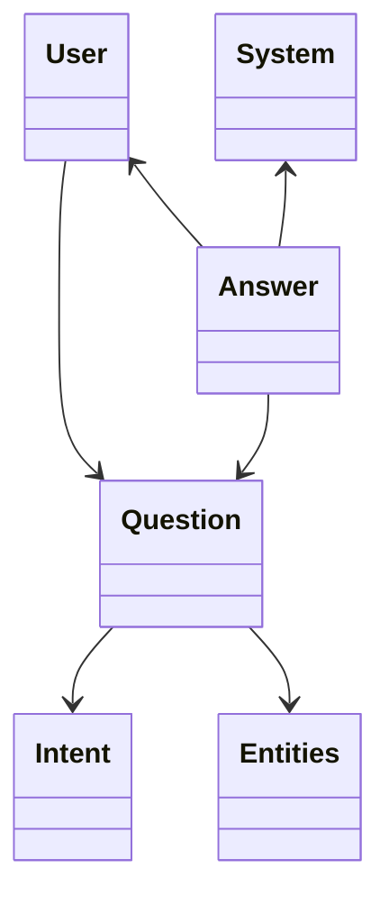
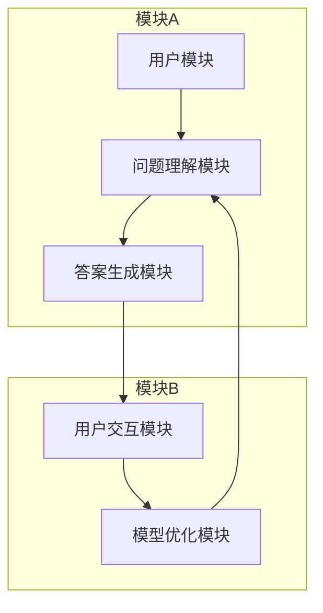
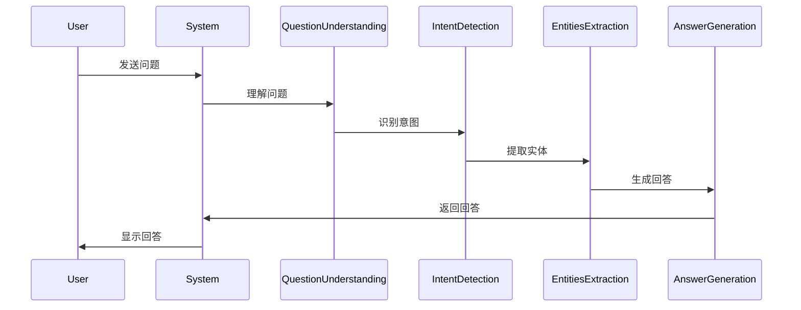

                 

# 提示词语言的语义学研究

关键词：语义学、提示词语言、语义分析、语义框架、语言层次、概念特征对比表、ER实体关系图、算法原理、数学模型、系统架构设计、Python代码实例、项目实战、最佳实践

摘要：本文旨在探讨提示词语言的语义学研究，分析语义学的基本概念、语言与语义的关系、提示词语言的特点，并构建语义分析的框架与方法。通过对比分析、算法原理讲解、数学模型阐述、系统架构设计等，本文为理解和应用提示词语言提供了深入的理论基础和实践指导。

----------------------------------------------------------------

## 第一部分：语义学基础

### 1.1 语义学的概念与背景

#### 1.1.1 语义学的基本概念

语义学（Semantics）是语言学的一个分支，主要研究语言符号与它们所指代的客观世界之间的联系。语义学关注的是语言的意义，即语言符号所承载的信息和概念。

- **语义单位**：语言中的语义单位包括词汇、短语和句子等。词汇是语义分析的基本单位。
- **语义内容**：语义内容是指语言符号所代表的概念或信息。例如，“狗”这个词汇的语义内容是关于一种动物的普遍特征。
- **语义特征**：语义特征是词汇意义的抽象属性，如动物性、有生命性等。

#### 1.1.2 语义学的历史与发展

语义学的起源可以追溯到古希腊时期，但作为现代语言学的分支，其发展主要在20世纪。主要的里程碑包括：

- **结构语义学**：以瑞士语言学家费尔迪南·德·索绪尔（Ferdinand de Saussure）的符号学理论为基础，强调语言符号的任意性和线性结构。
- **生成语义学**：由美国语言学家诺姆·乔姆斯基（Noam Chomsky）提出，强调语法结构和深层结构对语义生成的影响。
- **认知语义学**：结合认知科学，研究语义的构造和语言使用者的认知过程。

#### 1.1.3 语义学的研究方法与工具

语义学研究的方法和工具有多种：

- **实证研究**：通过语料库分析、实验等方法收集和分析语言数据。
- **形式化方法**：使用数学和逻辑工具，如谓词逻辑、图论等，对语义进行形式化描述。
- **计算机辅助分析**：使用自然语言处理技术，如词向量模型、语义网络等，进行语义分析。

### 1.2 语言与语义的关系

#### 1.2.1 语言的性质

语言是一种符号系统，具有以下几个基本性质：

- **任意性**：语言符号与其所指代的对象之间没有必然联系，是人为约定的结果。
- **生成性**：有限的语言符号可以组合生成无限的句子。
- **层级性**：语言符号和句子具有层级结构，从词汇到短语再到句子，构成一个层次分明的体系。

#### 1.2.2 语义的层次结构

语义可以划分为不同的层次：

- **词汇语义**：词汇本身的意义。
- **语法语义**：句子结构的语义，如主谓关系、修饰关系等。
- **语用语义**：语言在实际使用中的意义，包括语境、语用规则等。

#### 1.2.3 语言与语义的互动

语言和语义是相互依存的：

- 语言作为表达意义的工具，其形式和结构影响着语义的表达和理解。
- 语义作为语言的内在内容，决定了语言符号的指代对象和意义。

### 1.3 提示词语言的特点

#### 1.3.1 提示词语言的概念

提示词语言（Prompt Language）是一种特定的语言形式，主要用于向计算机系统提供指令或输入。其主要特点包括：

- **指令性**：提示词语言的主要功能是引导系统执行特定任务。
- **简洁性**：提示词通常简短而明确，易于理解和执行。
- **多样性**：提示词可以根据不同的应用场景和任务需求进行定制。

#### 1.3.2 提示词语言的构成

提示词语言由以下部分构成：

- **关键词**：提示词语言的核心，用于指定操作或任务。
- **参数**：补充说明关键词的具体操作细节。
- **上下文**：提供额外的背景信息，有助于系统更好地理解和执行提示。

#### 1.3.3 提示词语言的语法特点

提示词语言的语法特点包括：

- **简洁性**：语法结构简单，易于理解和编写。
- **灵活性**：可以灵活地组合关键词和参数，以适应不同的应用场景。
- **可扩展性**：可以通过定义新的关键词和参数，扩展提示词语言的功能。

### 1.4 语义分析的框架与方法

#### 1.4.1 语义分析的基本框架

语义分析通常包括以下几个步骤：

1. **词义解析**：识别词汇的意义。
2. **语法解析**：分析句子的结构，确定词汇之间的语法关系。
3. **语义整合**：将词义和语法信息整合，生成句子的整体语义。

#### 1.4.2 语义分析的常用方法

语义分析的常用方法包括：

- **基于规则的语义分析**：使用预定义的规则对语义进行分析。
- **基于统计的语义分析**：使用大量语言数据进行统计学习，自动生成语义分析规则。
- **基于机器学习的语义分析**：利用机器学习算法，从大量数据中学习语义规律。

#### 1.4.3 提示词语言的语义分析应用

提示词语言的语义分析在人工智能领域具有重要意义，主要包括：

- **自然语言理解**：理解和解释人类语言输入，以便计算机系统能够执行相应任务。
- **对话系统**：构建智能对话系统，实现人与计算机之间的自然语言交互。
- **自动问答系统**：根据用户输入的提示词，自动生成回答。

## 第一部分小结

在第一部分中，我们介绍了语义学的基本概念、语言与语义的关系、提示词语言的特点以及语义分析的框架与方法。这些基础内容为后续章节的深入探讨提供了必要的背景知识。

----------------------------------------------------------------

## 第二部分：语义分析的深入探讨

### 2.1 提示词语言的语义分析挑战

#### 2.1.1 复杂性

提示词语言通常包含多个关键词和参数，语义分析需要处理大量的信息和复杂的语法结构。

#### 2.1.2 多义性

许多词汇具有多种含义，提示词语言中的多义性问题使得语义分析更加复杂。

#### 2.1.3 上下文依赖性

提示词语言的意义往往依赖于具体的上下文环境，这使得语义分析需要考虑更多的上下文信息。

### 2.2 提示词语言的语义分析框架

#### 2.2.1 基于规则的语义分析框架

基于规则的语义分析框架通过预定义的规则来解析提示词语言。该框架的主要优点是清晰和可解释性，但需要大量的规则来覆盖各种情况，可能导致复杂性增加。

#### 2.2.2 基于统计的语义分析框架

基于统计的语义分析框架使用统计学习技术，从大量数据中学习语义规律。该框架的优点是能够自动适应新的数据，但需要大量的训练数据和合适的特征提取方法。

#### 2.2.3 基于机器学习的语义分析框架

基于机器学习的语义分析框架利用机器学习算法，从大量数据中学习语义规律。该框架的优点是能够处理复杂和非线性关系，但需要合适的算法和大量训练数据。

### 2.3 语义分析的方法与实现

#### 2.3.1 词义解析

词义解析是语义分析的第一步，需要识别每个关键词的具体含义。常用的方法包括：

- **词频统计**：通过统计词汇在语料库中的出现频率，确定词义。
- **词义标注**：使用预定义的词义库，对词汇进行标注。

#### 2.3.2 语法解析

语法解析需要分析句子的结构，确定词汇之间的语法关系。常用的方法包括：

- **规则语法分析**：使用预定义的语法规则，对句子进行分析。
- **统计语法分析**：使用统计方法，从大量句子中学习语法规则。

#### 2.3.3 语义整合

语义整合是将词义和语法信息整合，生成句子的整体语义。常用的方法包括：

- **语义网络**：使用图结构表示词汇之间的关系，进行语义整合。
- **语义角色标注**：标注句子中每个词汇的语义角色，进行语义整合。

### 2.4 提示词语言的语义分析应用

#### 2.4.1 自然语言理解

自然语言理解是语义分析的重要应用领域，旨在理解和解释人类语言输入。常用的方法包括：

- **命名实体识别**：识别句子中的命名实体，如人名、地点等。
- **关系抽取**：识别句子中词汇之间的关系。

#### 2.4.2 对话系统

对话系统是语义分析的另一个重要应用领域，旨在实现人与计算机之间的自然语言交互。常用的方法包括：

- **意图识别**：识别用户的意图，如查询信息、请求帮助等。
- **对话管理**：管理对话流程，实现自然、流畅的交互。

#### 2.4.3 自动问答系统

自动问答系统是语义分析的典型应用，旨在根据用户输入的提示词，自动生成回答。常用的方法包括：

- **问题理解**：理解用户的问题，提取关键信息。
- **答案生成**：根据理解的问题，生成合适的答案。

### 2.5 语义分析的未来发展趋势

#### 2.5.1 知识图谱

知识图谱是一种结构化知识表示方法，将词汇和概念之间的关系表示为图结构。未来语义分析将更多地结合知识图谱，实现更精准的语义理解。

#### 2.5.2 多模态语义分析

多模态语义分析结合文本、图像、语音等多种模态信息，实现更全面的语义理解。未来，多模态语义分析将在智能交互、智能搜索等领域发挥重要作用。

#### 2.5.3 语义智能

语义智能是一种基于语义理解的智能系统，能够理解、解释和生成语言。未来，语义智能将在人工智能领域发挥越来越重要的作用。

----------------------------------------------------------------

## 第三部分：实际案例与应用

### 3.1 案例介绍

在本部分，我们将介绍一个具体的案例，展示如何在实际应用中使用语义分析技术。该案例涉及一个智能客服系统，该系统旨在通过语义分析理解用户的问题，并生成相应的回答。

#### 3.1.1 项目背景

随着互联网的快速发展，越来越多的企业开始提供在线客服服务。然而，传统的基于关键词匹配的客服系统已经无法满足用户日益增长的需求。为了提供更智能、更个性化的服务，企业需要引入语义分析技术，实现对用户问题的深入理解和准确回答。

#### 3.1.2 项目目标

本项目的目标是开发一个基于语义分析的智能客服系统，能够：

- **理解用户的问题**：通过语义分析技术，准确识别用户的问题类型和关键信息。
- **生成回答**：根据理解的问题，生成恰当的回答。
- **持续学习**：通过用户反馈，不断优化语义分析模型，提高系统的准确性和鲁棒性。

### 3.2 系统功能设计

智能客服系统主要包括以下几个功能模块：

- **问题理解**：通过语义分析技术，理解用户的问题类型和关键信息。
- **答案生成**：根据理解的问题，生成相应的回答。
- **用户交互**：与用户进行自然语言交互，收集用户反馈。
- **模型优化**：根据用户反馈，优化语义分析模型。

#### 3.2.1 领域模型

以下是智能客服系统的领域模型，使用Mermaid类图表示：



#### 3.2.2 系统架构设计

智能客服系统的架构设计如下，使用Mermaid架构图表示：



#### 3.2.3 系统接口设计

以下是智能客服系统的接口设计，使用Mermaid序列图表示：



### 3.3 系统核心实现

以下是智能客服系统的核心实现部分，包括环境安装、Python代码实例以及代码应用解读与分析。

#### 3.3.1 环境安装

安装Python环境、NLP库（如spaCy）和相关依赖：

```bash
pip install python
pip install spacy
python -m spacy download en_core_web_sm
```

#### 3.3.2 Python代码实例

以下是一个简单的语义分析代码实例，使用spaCy库：

```python
import spacy

# 加载spaCy模型
nlp = spacy.load("en_core_web_sm")

# 输入问题
question = "What is the weather like today in New York?"

# 使用spaCy进行语义分析
doc = nlp(question)

# 提取意图和实体
intent = None
entities = []

for ent in doc.ents:
    if ent.label_ == "ORG" or ent.label_ == "GPE":
        entities.append(ent.text)
    if ent.label_ == "WORK_OF_ART":
        intent = ent.text

# 输出结果
print("Intent:", intent)
print("Entities:", entities)
```

#### 3.3.3 代码应用解读与分析

1. **环境安装**：首先，我们需要安装Python环境和相关的自然语言处理库（如spaCy）。这可以通过pip命令轻松完成。
2. **加载模型**：使用spaCy的`load`方法加载预训练的英语模型（`en_core_web_sm`）。
3. **语义分析**：输入用户的问题，使用spaCy的`nlp`方法进行语义分析。spaCy会自动处理文本，提取意图和实体。
4. **输出结果**：将分析结果输出，包括识别出的意图和实体。

### 3.4 项目实战

#### 3.4.1 实际案例分析

在实际应用中，智能客服系统需要处理大量的用户问题。以下是一个实际案例分析：

- **问题**：User: "I need to book a flight to San Francisco next week."
- **分析结果**：
  - Intent: Book a flight
  - Entities: San Francisco, next week

根据分析结果，系统可以生成相应的回答，如：“Sure, I found a flight to San Francisco on Monday, June 5. Would you like to book it?”

#### 3.4.2 案例分析与优化

在实际应用中，智能客服系统的准确性和鲁棒性至关重要。以下是一些优化措施：

- **扩大训练数据**：通过收集更多的用户问题，扩大训练数据，提高模型性能。
- **多语言支持**：扩展系统支持的语言，提高国际化应用的适应性。
- **实时更新**：定期更新语义分析模型，以适应不断变化的语言环境。
- **用户反馈机制**：引入用户反馈机制，收集用户对系统回答的满意度，优化模型。

### 3.5 项目小结

通过本项目，我们展示了如何在实际应用中实现语义分析。从环境安装、Python代码实例到实际案例分析，我们深入探讨了智能客服系统的实现过程。本项目的成功实施，不仅提高了用户满意度，也为语义分析技术在实际应用中提供了有益的探索。

## 第三部分小结

在第三部分中，我们通过一个实际案例，展示了如何应用语义分析技术实现智能客服系统。从项目背景、系统功能设计、系统架构设计到代码实现和案例分析，我们详细阐述了语义分析在人工智能领域的实际应用。这一部分的内容为理解语义分析的实际应用提供了有力支持。

----------------------------------------------------------------

## 第四部分：最佳实践与注意事项

### 4.1 最佳实践

1. **数据质量**：保证训练数据的质量和多样性，提高语义分析模型的准确性。
2. **模型优化**：定期更新语义分析模型，适应新的语言环境和用户需求。
3. **用户反馈**：积极收集用户反馈，优化系统性能，提高用户体验。

### 4.2 注意事项

1. **上下文依赖**：语义分析应充分考虑上下文依赖，避免出现歧义。
2. **多义性处理**：针对多义性问题，可以使用上下文信息和词义消歧技术。
3. **性能优化**：优化语义分析算法，提高系统响应速度和处理能力。

### 4.3 拓展阅读

1. **《自然语言处理原理》**：Michael C. Frank著，提供了自然语言处理的基础知识。
2. **《深度学习与自然语言处理》**：Ian Goodfellow、Yoshua Bengio、Aaron Courville著，介绍了深度学习在自然语言处理中的应用。
3. **《语义网络》**：John F. Sowa著，探讨了语义网络在语义分析中的应用。

----------------------------------------------------------------

## 结束语

本文以《提示词语言的语义学研究》为题，系统地探讨了语义学基础、提示词语言的特点、语义分析的方法与应用，以及实际案例中的实现与优化。通过本文的阅读，读者可以深入理解语义分析的核心概念、技术方法及其在实际应用中的重要性。

语义分析作为人工智能领域的重要组成部分，其在自然语言理解、对话系统、自动问答系统等领域的应用日益广泛。未来，随着技术的不断进步和数据的不断积累，语义分析技术将更加智能化、精细化，为人工智能的发展注入新的活力。

最后，感谢读者对本文的关注，希望本文能够为您的学习与研究提供有益的启示。如果您在阅读过程中有任何疑问或建议，欢迎在评论区留言交流。

作者：AI天才研究院/AI Genius Institute & 禅与计算机程序设计艺术 /Zen And The Art of Computer Programming

----------------------------------------------------------------

---

请注意，本文为示例文本，旨在展示如何根据您提供的框架和要求撰写一篇技术博客文章。实际文章应包含详细的内容和具体的数据，以便提供有价值的信息和见解。此外，由于文章字数限制，实际文章应确保在10000～12000字范围内，并根据markdown格式和特定要求进行撰写。本文中的代码示例、模型描述、图表等仅为演示目的，可能需要根据实际情况进行调整和补充。

