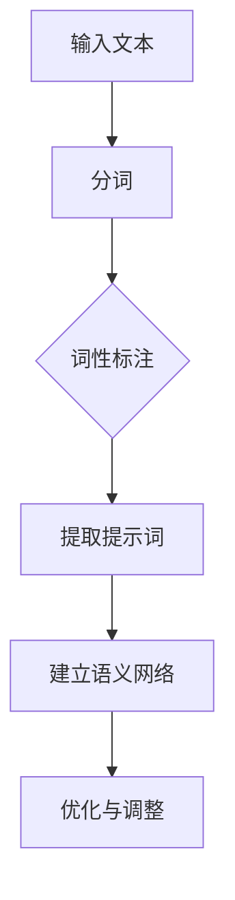
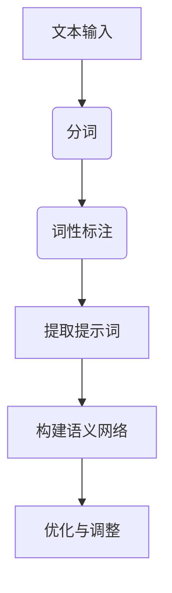
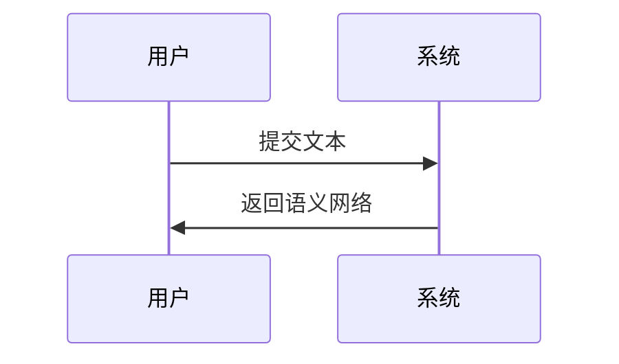

                 

### 《提示词语言的语义网络构建》

> **关键词：** 提示词语言、语义网络、构建方法、数学模型、系统架构、项目实战

> **摘要：** 本文深入探讨了提示词语言的语义网络构建，包括其核心概念、构建方法、数学模型和系统架构设计。通过详细的步骤解析和实际案例分析，阐述了如何有效地实现语义网络的构建，为相关研究和应用提供了有价值的参考。

---

## **第一部分：背景与概述**

### **第1章：问题背景与核心概念**

#### **1.1.1 提示词语言的起源与发展**

提示词语言（Keyword-based Language）是一种用于信息检索和自然语言处理的重要工具。其起源可以追溯到早期的信息检索系统，如基于关键词索引的数据库。随着互联网的普及和大数据技术的发展，提示词语言的应用领域不断扩大，涵盖了搜索引擎、问答系统、文本挖掘等多个方面。

#### **1.1.2 语义网络的重要性**

语义网络（Semantic Network）是一种用于表示知识结构和语义关系的图形模型。它在知识表示、推理和语义理解等方面具有重要作用。通过构建语义网络，可以更好地理解和处理自然语言文本，提高信息检索和智能问答的准确性和效率。

#### **1.1.3 语义网络的基本概念**

语义网络由节点（Node）和边（Edge）组成。节点表示概念或实体，边表示概念之间的语义关系。常见的语义关系包括分类关系（Is-A）、属性关系（Has-Attribute）和关联关系（Related-To）等。

### **第2章：核心概念与联系**

#### **2.1.1 提示词语言的概念解析**

提示词语言是一种基于关键词的文本表示方法，其核心是关键词的提取和表示。关键词提取技术包括统计方法、机器学习和深度学习等多种方法。

#### **2.1.2 语义网络的基本结构**

语义网络的基本结构包括概念层、关系层和实例层。概念层表示文本中的实体和概念，关系层表示概念之间的语义关系，实例层表示具体的概念实例。

#### **2.1.3 提示词与语义网络的关系**

提示词是语义网络构建的重要基础。通过将文本中的关键词映射到语义网络中的节点和边，可以实现语义网络的构建。

#### **2.1.3.1 Mermaid ER实体关系图**

```mermaid
erDiagram
  词 |<-.. 提示词
  语义网络 ||--|{ 词汇单元 }
  词汇单元 ||--|{ 提示词 }
```

### **第3章：语义网络构建方法**

#### **3.1.1 语义网络构建的基本流程**

语义网络构建的基本流程包括输入文本处理、关键词提取、语义关系识别和语义网络构建等步骤。

#### **3.1.2 提示词提取技术**

提示词提取技术包括基于词频、TF-IDF、LDA等统计方法和基于机器学习的词袋模型、循环神经网络等。

#### **3.1.3 语义关系识别方法**

语义关系识别方法包括基于规则的方法、基于统计的方法和基于机器学习的方法。

#### **3.1.3.1 Mermaid 流程图**



### **第4章：数学模型与算法原理**

#### **4.1.1 语义网络的数学模型**

语义网络的数学模型通常使用图论中的邻接矩阵或加权矩阵来表示。其中，邻接矩阵中的元素表示节点之间的相似度或距离。

$$
语义相似度 = \frac{相关词的数量}{总词的数量}
$$

#### **4.1.2 算法原理与实现**

算法原理主要包括语义相似度的计算和语义关系的识别。以下是一个简单的Python代码示例：

```python
def semantic_similarity(words, related_words):
    return len(related_words) / len(words)
```

### **第5章：系统分析与架构设计**

#### **5.1.1 问题场景介绍**

本文所讨论的问题场景是基于自然语言处理技术的信息检索和智能问答系统。

#### **5.1.2 系统功能设计**

系统功能设计主要包括文本预处理、语义网络构建、语义查询和结果展示等模块。

#### **5.1.2.1 Mermaid 类图**

```mermaid
classDiagram
    Class1 <|-- Class2
    Class1 --|{ Object1 }
    Class2 --|{ Object2 }
```

#### **5.1.3 系统架构设计**

系统架构设计包括前端、后端和数据库等组成部分。前端主要负责用户界面设计，后端负责语义网络构建和查询处理，数据库用于存储语义网络和用户数据。

#### **5.1.3.1 Mermaid 架构图**



#### **5.1.4 系统接口设计与交互**

系统接口设计包括API接口和数据接口。API接口用于前后端交互，数据接口用于数据库的访问和操作。

#### **5.1.4.1 Mermaid 序列图**



### **第6章：项目实战**

#### **6.1.1 环境安装**

项目实战首先需要安装相关环境，包括Python、NLP库和数据库等。

#### **6.1.2 系统核心实现源代码**

系统核心实现源代码主要包括文本预处理、语义网络构建和查询处理等模块。

#### **6.1.2.1 Python 代码解读与分析**

```python
# Python 代码示例
def extract_prompt_words(text):
    # 提取提示词的逻辑
    return prompt_words
```

#### **6.1.3 实际案例分析与详细讲解**

通过实际案例分析，深入探讨语义网络构建的方法和效果。

##### **6.1.3.1 案例一：文本分类**

文本分类是一种常见的自然语言处理任务。通过语义网络构建，可以有效地实现文本分类。

##### **6.1.3.1.2 案例二：情感分析**

情感分析是另一种重要的自然语言处理任务。通过构建语义网络，可以更好地理解和处理情感信息。

### **第7章：最佳实践与拓展阅读**

#### **7.1.1 最佳实践**

在实际应用中，需要注意以下几个方面：

1. **关键词提取策略**：选择合适的提取策略，提高关键词的准确性和代表性。
2. **语义关系识别方法**：根据具体任务需求，选择合适的语义关系识别方法。
3. **系统优化**：对系统进行优化，提高处理速度和效率。

#### **7.1.2 注意事项**

1. **文本预处理**：对输入文本进行充分的预处理，以提高语义网络构建的准确性。
2. **数据质量**：确保输入数据的质量，避免噪声和异常数据对语义网络构建的影响。

#### **7.1.3 拓展阅读**

1. **相关论文和书籍**：阅读相关的学术论文和畅销书籍，了解最新的研究成果和发展趋势。
2. **开源项目和工具**：研究开源项目和工具，借鉴他人的经验和成果。

---

**作者：AI天才研究院/AI Genius Institute & 禅与计算机程序设计艺术 /Zen And The Art of Computer Programming**

