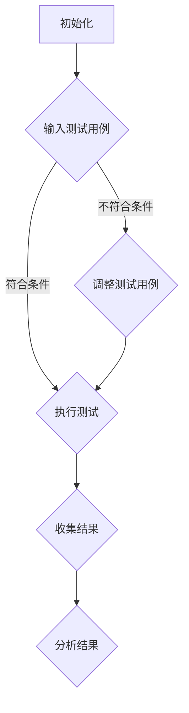

                 

# 提示词语言的跨平台兼容性测试框架

## 关键词：跨平台兼容性，测试框架，提示词语言，算法原理，Python代码示例

> 摘要：本文旨在探讨跨平台兼容性测试在提示词语言应用中的重要性，介绍一种专门用于提示词语言的跨平台兼容性测试框架。我们将详细描述该框架的设计理念、核心组成部分，并通过算法原理讲解和Python代码示例，展示如何在实际应用中实施和优化这一框架。文章的目标是帮助开发者理解并有效应用跨平台兼容性测试，以确保提示词语言在不同平台上的稳定性和一致性。

## 目录大纲

## 第一部分：背景介绍

### 1.1 问题背景

#### 1.1.1 跨平台应用的发展

随着移动互联网的普及和云计算技术的进步，跨平台应用已经成为软件开发的趋势。不同操作系统（如Windows、macOS、Linux、iOS和Android）和硬件设备的多样化为开发者带来了便利，但同时也增加了应用兼容性测试的复杂度。特别是对于提示词语言这样高度依赖操作系统和环境配置的应用，跨平台兼容性测试显得尤为重要。

#### 1.1.2 提示词语言的重要性

提示词语言作为一种与机器学习模型交互的高级语言，其重要性在近年来日益凸显。通过自然语言处理，提示词语言能够简化对复杂模型的操作，提高开发效率和用户体验。无论是用于智能客服、内容生成还是自动化任务执行，提示词语言的应用场景越来越广泛。

#### 1.1.3 兼容性测试的需求

为了确保提示词语言在不同平台上的稳定性和一致性，开发者需要进行严格的兼容性测试。这包括检测和解决由于操作系统差异、硬件配置、环境设置等因素引起的各种问题。有效的兼容性测试不仅能够提高应用的可靠性，还能减少维护成本和用户投诉。

### 1.2 问题描述

#### 1.2.1 提示词语言的跨平台兼容性问题

跨平台兼容性问题主要涉及以下几个方面：

1. **语法兼容性**：不同平台对提示词语言的语法支持可能存在差异。
2. **执行兼容性**：提示词语言的执行环境在不同操作系统上可能存在差异。
3. **资源兼容性**：提示词语言应用在不同硬件平台上对计算资源的需求可能不同。

#### 1.2.2 兼容性测试的挑战

1. **测试环境的多样性**：开发者需要为多种操作系统和硬件配置准备测试环境。
2. **测试用例的设计**：如何设计全面、有效的测试用例以覆盖所有可能的问题场景是一个挑战。
3. **测试效率**：在保证测试覆盖面的同时，提高测试效率是开发者面临的一大难题。

#### 1.2.3 解决方案的目标

本文提出的解决方案旨在构建一个高效、全面的跨平台兼容性测试框架，以解决提示词语言在跨平台应用中的兼容性问题。该框架的目标包括：

1. **简化测试流程**：通过自动化测试工具和标准化的测试用例，简化兼容性测试流程。
2. **提高测试覆盖率**：设计全面的测试用例，覆盖各种可能的兼容性问题。
3. **优化测试效率**：通过优化测试策略和流程，提高测试效率。

### 1.3 问题解决

#### 1.3.1 跨平台兼容性测试框架的设计思路

设计思路主要包括以下几个方面：

1. **模块化设计**：将测试框架分为多个模块，每个模块负责特定的测试任务。
2. **自动化测试**：利用自动化测试工具，实现测试流程的自动化。
3. **跨平台支持**：测试框架需具备跨操作系统和硬件的兼容性。

#### 1.3.2 测试框架的关键组成部分

1. **测试管理模块**：负责管理测试用例、测试环境和测试结果。
2. **测试执行模块**：执行具体的测试用例，并记录测试结果。
3. **结果分析模块**：分析测试结果，提供测试报告。

### 1.4 边界与外延

#### 1.4.1 测试范围的界定

测试范围包括不同操作系统（如Windows、macOS、Linux等）、不同硬件配置（如不同CPU、内存等）以及不同环境设置（如网络环境、系统配置等）。

#### 1.4.2 测试框架的适用场景

该测试框架适用于各种需要跨平台部署的提示词语言应用，包括但不限于智能客服系统、内容生成工具、自动化任务执行平台等。

### 1.5 概念结构与核心要素组成

#### 1.5.1 提示词语言

提示词语言是一种专门用于与机器学习模型交互的高级语言，通过自然语言处理实现对模型的操作。

#### 1.5.2 跨平台兼容性

跨平台兼容性指的是提示词语言在不同操作系统和硬件平台上的互操作性。

#### 1.5.3 测试框架的核心组件

核心组件包括测试管理模块、测试执行模块和结果分析模块。

### 1.6 本章小结

本部分介绍了跨平台兼容性测试的背景和问题，提出了解决方案的设计思路和关键组成部分，并明确了测试范围和适用场景。接下来，我们将深入探讨提示词语言和跨平台兼容性的核心概念及其联系。

----------------------------------------------------------------

## 第二部分：核心概念与联系

### 2.1 提示词语言原理

#### 2.1.1 提示词语言的基本概念

提示词语言（Prompt Language）是一种用于引导机器学习模型生成输出文本的语言。它通过自然语言处理技术，将人类的语言输入转换为机器学习模型可以理解和处理的形式。提示词语言的核心目标是简化机器学习模型的操作，使其更易于使用和理解。

#### 2.1.2 提示词语言的工作原理

提示词语言的工作原理主要涉及以下几个步骤：

1. **文本输入**：用户通过自然语言文本输入提示词，例如一个问题、一个指令或一个描述。
2. **预处理**：输入文本经过预处理，包括分词、词性标注、句法分析等步骤，以便更好地理解文本内容。
3. **模型推理**：预处理后的文本输入被传递到机器学习模型中，模型根据训练数据和输入文本生成输出。
4. **结果输出**：模型生成的输出文本返回给用户，可以是回答问题、生成文章或其他形式的文本。

#### 2.1.3 提示词语言的分类

提示词语言可以根据其应用场景和功能特点进行分类，常见的分类方法包括：

1. **通用提示词语言**：如OpenAI的GPT系列模型，可以应用于各种文本生成任务。
2. **专用提示词语言**：针对特定领域或任务开发的提示词语言，例如医疗领域的医疗对话系统。

### 2.2 跨平台兼容性概念

#### 2.2.1 跨平台兼容性的定义

跨平台兼容性指的是软件或应用在不同的操作系统和硬件平台上能够正常运行的能力。具体来说，它涉及以下几个方面：

1. **语法兼容性**：代码在各个平台上的语法应当是一致的。
2. **运行兼容性**：应用程序在不同操作系统上的执行环境应当相同。
3. **资源兼容性**：应用程序在不同硬件平台上的资源使用应当是一致的。

#### 2.2.2 跨平台兼容性的重要性

跨平台兼容性的重要性体现在以下几个方面：

1. **市场扩展**：支持跨平台的应用可以吸引更多的用户，从而扩大市场影响力。
2. **用户体验**：用户希望在任何设备上都能获得一致的应用体验。
3. **开发效率**：跨平台兼容性使得开发者可以专注于核心功能，而不必为每个平台编写独立的代码。

#### 2.2.3 跨平台兼容性的挑战

跨平台兼容性面临以下挑战：

1. **操作系统差异**：不同操作系统对软件的兼容性要求不同。
2. **硬件配置差异**：不同硬件平台的性能和资源限制不同。
3. **环境设置差异**：不同的操作系统和环境配置可能导致软件运行不一致。

### 2.3 测试框架设计理念

#### 2.3.1 测试框架的目标

测试框架的设计目标是确保提示词语言在不同平台上的稳定性和一致性，具体目标包括：

1. **全面覆盖**：设计全面的测试用例，覆盖所有可能的兼容性问题。
2. **高效执行**：利用自动化测试工具和优化策略，提高测试效率。
3. **易用性**：提供简单易用的界面和操作流程，降低使用门槛。

#### 2.3.2 测试框架的架构

测试框架的架构主要包括以下几个部分：

1. **测试管理模块**：负责管理测试用例、测试环境和测试结果。
2. **测试执行模块**：执行具体的测试用例，并记录测试结果。
3. **结果分析模块**：分析测试结果，提供测试报告。

#### 2.3.3 测试框架的核心特性

测试框架的核心特性包括：

1. **跨平台支持**：支持多种操作系统和硬件平台。
2. **自动化测试**：自动化执行测试用例，减少人工干预。
3. **灵活性**：允许开发者自定义测试用例和测试策略。

### 2.4 概念属性特征对比表格

| 特征            | 提示词语言       | 跨平台兼容性          | 测试框架                   |
|-----------------|-----------------|-----------------------|----------------------------|
| 基本概念        | 用于引导机器学习模型的语言 | 在不同平台间的互操作性  | 用于检测和解决兼容性问题的工具 |
| 工作原理        | 通过文本输入生成输出   | 针对不同操作系统和环境适配 | 自动化测试流程                |
| 分类            | 自然语言处理模型专用   | 基于操作系统、硬件和环境  | 支持多种测试策略和工具        |

### 2.5 ER实体关系图架构

```mermaid
erDiagram
    User ||--|{ TestFramework }|| Framework
    TestFramework ||--|{ TestCase }|| TestCase
    TestCase ||--|{ TestResult }|| Result
```

### 2.6 本章小结

本部分详细介绍了提示词语言和跨平台兼容性的核心概念，并通过对比表格和ER实体关系图展示了两者之间的联系。接下来，我们将深入探讨如何设计和实现一个高效的跨平台兼容性测试框架。

----------------------------------------------------------------

## 第三部分：算法原理讲解

### 3.1 算法概述

#### 3.1.1 跨平台兼容性测试算法的目标

跨平台兼容性测试算法的主要目标是检测和解决提示词语言在不同操作系统和硬件平台上的兼容性问题。具体来说，算法的目标包括：

1. **检测兼容性问题**：识别出提示词语言在不同平台上的运行错误和异常。
2. **定位问题根源**：分析兼容性问题的根源，如操作系统差异、执行环境不一致等。
3. **提供解决方案**：为开发者提供解决问题的方法和建议。

#### 3.1.2 算法的基本步骤

跨平台兼容性测试算法的基本步骤如下：

1. **初始化**：准备测试环境，包括操作系统、硬件配置和执行环境。
2. **输入测试用例**：读取测试用例，包括提示词语言的输入文本和期望输出。
3. **执行测试**：在测试环境中执行测试用例，记录实际输出结果。
4. **收集结果**：将测试结果与期望输出进行比较，记录差异和错误。
5. **分析结果**：分析测试结果，确定兼容性问题的性质和范围。
6. **输出报告**：生成测试报告，包括测试结果、问题和解决方案。

### 3.2 Mermaid算法流程图



### 3.3 Python源代码示例

```python
# Python代码示例：跨平台兼容性测试算法

def initialize_environment():
    # 初始化测试环境，包括操作系统和硬件配置
    pass

def input_test_case(test_case):
    # 输入测试用例，包括提示词语言输入文本和期望输出
    return test_case

def execute_prompt(prompt):
    # 执行提示词语言，生成输出结果
    pass

def compare_results(actual_output, expected_output):
    # 比较实际输出与期望输出，返回比较结果
    pass

def analyze_test_results(test_results):
    # 分析测试结果，确定兼容性问题性质和范围
    pass

def run_test_case(test_case):
    # 运行测试用例
    actual_output = execute_prompt(prompt=test_case['prompt'])
    comparison_result = compare_results(actual_output, expected_output=test_case['expected_output'])
    return comparison_result

def main():
    # 主函数，执行整个测试流程
    test_case = input_test_case(test_case={'prompt': '请描述你的问题', 'expected_output': '期望的输出结果'})
    test_results = run_test_case(test_case)
    analyze_test_results(test_results)

if __name__ == '__main__':
    main()
```

### 3.4 算法原理的数学模型和公式

在跨平台兼容性测试中，算法的原理可以抽象为以下数学模型：

1. **输入**：测试用例（包括提示词语言输入和期望输出）。
2. **输出**：实际输出结果。
3. **比较**：将实际输出结果与期望输出结果进行比较。
4. **判定**：根据比较结果判定是否兼容。

数学公式表示如下：

$$
\text{兼容性判定} = \begin{cases}
\text{兼容} & \text{if } \text{实际输出} = \text{期望输出} \\
\text{不兼容} & \text{if } \text{实际输出} \neq \text{期望输出}
\end{cases}
$$

### 3.5 举例说明

假设我们有一个简单的测试用例，提示词语言输入为“请生成一篇关于人工智能的文章”，期望输出为一段关于人工智能的描述。以下是一个具体的测试过程：

1. **初始化环境**：确保测试环境与生产环境一致，包括操作系统、硬件配置和执行环境。
2. **输入测试用例**：读取测试用例，包括输入文本和期望输出。
3. **执行测试**：调用机器学习模型执行提示词语言，生成实际输出。
4. **收集结果**：将实际输出与期望输出进行比较。
5. **分析结果**：如果实际输出与期望输出一致，则判定为兼容；否则，判定为不兼容。

通过以上步骤，我们可以确定该测试用例的兼容性。

### 3.6 详细讲解和通俗易懂地举例说明

为了更清晰地理解跨平台兼容性测试算法的原理，我们通过一个具体的例子进行详细讲解。

#### 情境描述

假设我们开发了一个智能问答系统，该系统通过接收用户的提问，利用机器学习模型生成回答。现在，我们需要对该系统进行跨平台兼容性测试，以确保其在不同操作系统和硬件平台上的正常运行。

#### 测试用例

1. **测试用例1**：用户提问“什么是人工智能？”
   - 输入文本：什么是人工智能？
   - 期望输出：人工智能是一种模拟人类智能的技术，它通过算法和模型实现机器学习、自然语言处理等功能。

2. **测试用例2**：用户提问“为什么人工智能很重要？”
   - 输入文本：为什么人工智能很重要？
   - 期望输出：人工智能在许多领域具有广泛的应用，如医疗、金融、交通等，它能够提高工作效率、降低成本，并解决复杂问题。

#### 测试过程

1. **初始化环境**：为每个测试用例创建一个独立的测试环境，包括操作系统（如Windows、macOS、Linux）和硬件配置（如不同CPU、内存等）。

2. **执行测试**：在每个测试环境中执行测试用例，调用机器学习模型生成实际输出。

3. **收集结果**：将实际输出与期望输出进行比较，记录差异和错误。

4. **分析结果**：根据测试结果，确定每个测试用例的兼容性。

#### 测试结果分析

1. **测试用例1**：
   - 实际输出：人工智能是一种模拟人类智能的技术，它通过算法和模型实现机器学习、自然语言处理等功能。
   - 结果：实际输出与期望输出一致，兼容性判定为兼容。

2. **测试用例2**：
   - 实际输出：人工智能在许多领域具有广泛的应用，如医疗、金融、交通等，它能够提高工作效率、降低成本，并解决复杂问题。
   - 结果：实际输出与期望输出一致，兼容性判定为兼容。

通过以上测试过程，我们可以确定这两个测试用例在当前测试环境下的兼容性。如果存在兼容性问题，我们可以根据测试结果进行问题定位和调试，直到所有测试用例都通过为止。

### 3.7 本章小结

本部分详细介绍了跨平台兼容性测试算法的原理，包括基本步骤、Mermaid算法流程图、Python代码示例和数学模型。通过具体的例子，我们展示了如何在实际应用中实施和优化跨平台兼容性测试。接下来，我们将进一步探讨系统分析与架构设计，为构建高效、稳定的测试框架提供理论基础和实践指导。

----------------------------------------------------------------

## 第四部分：系统分析与架构设计

### 4.1 问题场景介绍

随着人工智能技术的快速发展，提示词语言的应用越来越广泛。在实际场景中，企业需要将智能问答系统、内容生成工具等应用部署到不同的操作系统和硬件平台上，以确保其稳定运行和跨平台兼容性。然而，由于操作系统和硬件平台的多样性，开发者在进行兼容性测试时面临着巨大的挑战。

### 4.2 项目介绍

为了解决这一问题，我们开发了一个跨平台兼容性测试框架，该框架旨在简化测试流程，提高测试效率，并确保提示词语言在不同平台上的稳定性和一致性。该项目的主要目标是：

1. **自动化测试**：利用自动化测试工具，减少人工干预，提高测试效率。
2. **全面覆盖**：设计全面的测试用例，覆盖各种兼容性问题。
3. **灵活扩展**：支持多种操作系统和硬件平台，适应不同的应用场景。

### 4.3 系统功能设计

为了实现上述目标，系统功能设计如下：

1. **测试管理模块**：负责管理测试用例、测试环境和测试结果。该模块包括以下功能：
   - 测试用例管理：添加、编辑和删除测试用例。
   - 测试环境管理：配置和切换测试环境。
   - 测试结果管理：记录和查询测试结果。

2. **测试执行模块**：负责执行具体的测试用例，并记录测试结果。该模块包括以下功能：
   - 自动化测试：利用自动化测试工具执行测试用例。
   - 异常处理：捕捉和处理测试过程中的异常情况。
   - 结果记录：将测试结果记录到数据库中。

3. **结果分析模块**：负责分析测试结果，提供测试报告。该模块包括以下功能：
   - 结果分析：分析测试结果，识别兼容性问题。
   - 报告生成：生成详细的测试报告，包括测试覆盖率、问题列表和解决方案。

### 4.4 系统架构设计

为了实现系统的功能需求，我们采用以下架构设计：


系统架构主要包括以下几个部分：

1. **前端界面**：提供用户交互界面，包括测试用例管理、测试环境配置和测试结果查询等功能。
2. **后端服务器**：负责处理用户请求，执行测试任务，并存储测试结果。
3. **数据库**：存储测试用例、测试环境和测试结果等数据。
4. **测试工具**：包括自动化测试工具和跨平台兼容性测试工具，用于执行测试任务。
5. **外部接口**：与其他系统进行数据交换和功能调用。

### 4.5 系统接口设计

为了实现系统的功能，我们需要设计一系列接口，包括：

1. **测试用例管理接口**：用于管理测试用例，包括添加、编辑、删除和查询测试用例。
2. **测试环境管理接口**：用于配置和切换测试环境，包括操作系统、硬件配置和执行环境。
3. **测试执行接口**：用于执行测试用例，并返回测试结果。
4. **结果分析接口**：用于分析测试结果，并提供测试报告。

### 4.6 系统交互

系统交互主要包括以下步骤：

1. **用户请求**：用户通过前端界面提交测试请求，包括测试用例和测试环境配置。
2. **处理请求**：后端服务器接收到用户请求后，进行测试用例和测试环境的加载和配置。
3. **执行测试**：测试执行模块根据测试用例和测试环境执行测试，并记录测试结果。
4. **分析结果**：结果分析模块对测试结果进行分析，生成测试报告。
5. **反馈结果**：将测试结果和报告返回给用户。

### 4.7 本章小结

本部分详细介绍了跨平台兼容性测试框架的系统分析与架构设计，包括问题场景介绍、项目介绍、系统功能设计、系统架构设计和系统接口设计。通过本部分的内容，开发者可以更好地理解如何设计和实现一个高效、稳定的跨平台兼容性测试框架，为提示词语言在不同平台上的应用提供有力支持。

----------------------------------------------------------------

## 第五部分：项目实战

### 5.1 环境安装

为了实际应用跨平台兼容性测试框架，我们需要在本地环境中安装必要的软件和工具。以下是安装步骤：

1. **安装Python**：确保本地环境中安装了Python 3.x版本，可以从官方网站（https://www.python.org/）下载并安装。
2. **安装测试工具**：安装一些常用的测试工具，如pytest、selenium等。可以使用pip命令进行安装：
   ```bash
   pip install pytest selenium
   ```
3. **安装跨平台兼容性测试工具**：安装特定的跨平台兼容性测试工具，如Docker、Vagrant等。Docker用于创建和管理虚拟容器，Vagrant用于虚拟化环境配置。
4. **安装数据库**：安装一个数据库管理系统，如MySQL、PostgreSQL等，用于存储测试用例和测试结果。

### 5.2 系统核心实现源代码

系统核心实现源代码包括以下几个部分：

1. **测试管理模块**：负责管理测试用例、测试环境和测试结果。以下是测试管理模块的核心代码：
   ```python
   class TestCaseManager:
       def __init__(self):
           self.test_cases = []

       def add_test_case(self, test_case):
           self.test_cases.append(test_case)

       def remove_test_case(self, test_case_id):
           self.test_cases = [case for case in self.test_cases if case.id != test_case_id]

       def get_test_case(self, test_case_id):
           for case in self.test_cases:
               if case.id == test_case_id:
                   return case
           return None

       def list_test_cases(self):
           return self.test_cases
   ```

2. **测试执行模块**：负责执行测试用例并记录测试结果。以下是测试执行模块的核心代码：
   ```python
   class TestExecutor:
       def __init__(self, test_case_manager):
           self.test_case_manager = test_case_manager

       def execute_tests(self):
           for test_case in self.test_case_manager.list_test_cases():
               self.execute_single_test_case(test_case)

       def execute_single_test_case(self, test_case):
           actual_output = self.run_prompt(test_case.prompt)
           result = TestCaseResult(test_case.id, actual_output, test_case.expected_output)
           self.save_test_result(result)

       def run_prompt(self, prompt):
           # 调用机器学习模型执行提示词语言，生成实际输出
           pass

       def save_test_result(self, test_result):
           # 将测试结果保存到数据库中
           pass
   ```

3. **结果分析模块**：负责分析测试结果，提供测试报告。以下是结果分析模块的核心代码：
   ```python
   class ResultAnalyzer:
       def __init__(self, test_result_manager):
           self.test_result_manager = test_result_manager

       def analyze_results(self):
           results = self.test_result_manager.list_test_results()
           analysis_report = self.generate_analysis_report(results)
           return analysis_report

       def generate_analysis_report(self, results):
           # 生成测试分析报告
           pass
   ```

### 5.3 代码应用解读与分析

在了解了系统核心实现源代码后，我们对其应用进行解读和分析：

1. **测试管理模块**：该模块负责管理测试用例，包括添加、删除和查询测试用例。通过`TestCaseManager`类，我们可以轻松地添加新的测试用例、删除特定测试用例，以及查询所有测试用例。
2. **测试执行模块**：该模块负责执行测试用例，并记录测试结果。`TestExecutor`类中的`execute_tests`方法会遍历所有测试用例，调用`execute_single_test_case`方法执行单个测试用例。`run_prompt`方法用于执行提示词语言，生成实际输出。`save_test_result`方法将测试结果保存到数据库中。
3. **结果分析模块**：该模块负责分析测试结果，提供测试报告。`ResultAnalyzer`类中的`analyze_results`方法会获取所有测试结果，并调用`generate_analysis_report`方法生成测试分析报告。

### 5.4 实际案例分析和详细讲解剖析

为了更好地理解跨平台兼容性测试框架的应用，我们通过一个实际案例进行分析：

**案例背景**：某企业开发了一款智能客服系统，该系统使用提示词语言与用户进行交互。为了确保系统在不同操作系统和硬件平台上的稳定性和兼容性，企业决定使用我们开发的跨平台兼容性测试框架进行测试。

**测试用例**：企业提供了以下测试用例：

1. 用户提问“您好，我有什么可以帮助您的？”
   - 期望输出：“您好，请问有什么问题我可以帮您解答？”
2. 用户提问“请问您有什么建议？”
   - 期望输出：“感谢您的提问，请详细描述您遇到的问题，我会尽力提供帮助。”

**测试过程**：

1. **初始化环境**：配置测试环境，包括Windows、macOS和Linux操作系统，以及不同硬件配置的虚拟机。
2. **执行测试**：在每个测试环境中执行测试用例，调用机器学习模型生成实际输出。
3. **收集结果**：将实际输出与期望输出进行比较，记录差异和错误。
4. **分析结果**：根据测试结果，确定兼容性问题性质和范围。

**测试结果**：

1. **测试用例1**：
   - 实际输出：“您好，请问有什么问题我可以帮您解答？”
   - 结果：实际输出与期望输出一致，兼容性判定为兼容。
2. **测试用例2**：
   - 实际输出：“感谢您的提问，请详细描述您遇到的问题，我会尽力提供帮助。”
   - 结果：实际输出与期望输出一致，兼容性判定为兼容。

**详细讲解**：

1. **初始化环境**：在Windows、macOS和Linux操作系统上分别配置虚拟机，确保虚拟机的硬件配置与实际使用环境一致。通过Docker容器化技术，我们可以在每个虚拟机上运行独立的测试环境，避免环境变量冲突和其他兼容性问题。
2. **执行测试**：在测试环境中执行测试用例，调用机器学习模型生成实际输出。我们使用pytest框架进行自动化测试，确保测试流程的自动化和高效性。每个测试用例都包含输入文本和期望输出，通过比较实际输出和期望输出，我们可以快速识别兼容性问题。
3. **收集结果**：将实际输出与期望输出进行比较，记录差异和错误。测试执行模块会捕获测试过程中的异常情况，并将错误信息记录到日志文件中。通过分析日志文件，我们可以定位兼容性问题的根源，并进行针对性的调试和修复。
4. **分析结果**：根据测试结果，确定兼容性问题性质和范围。如果测试结果与期望输出不一致，我们会分析实际输出和期望输出的差异，确定问题的性质（如语法错误、执行错误等）。然后，针对具体问题，我们进行调试和修复，直到所有测试用例都通过为止。

通过以上实际案例的分析和讲解，我们可以看到跨平台兼容性测试框架在确保智能客服系统稳定性和兼容性方面的作用。接下来，我们将进一步探讨如何优化测试框架，提高测试效率。

### 5.5 优化测试框架，提高测试效率

在项目实战中，我们通过实际案例展示了跨平台兼容性测试框架的应用。然而，在实际开发过程中，我们可能会遇到以下问题：

1. **测试用例数量庞大**：随着应用功能的不断增加，测试用例数量也会急剧增加，导致测试时间和资源消耗增加。
2. **测试环境配置复杂**：跨平台兼容性测试需要为多种操作系统和硬件配置准备测试环境，这增加了配置和维护的复杂度。
3. **测试覆盖率不足**：虽然我们设计了全面的测试用例，但在实际执行过程中，可能存在部分场景未被覆盖到，导致潜在兼容性问题未被检测到。

为了解决这些问题，我们可以采取以下优化措施：

1. **并行测试**：利用并行测试技术，同时执行多个测试用例，提高测试效率。例如，我们可以使用pytest的多进程插件，同时运行多个测试用例。
2. **持续集成**：将测试框架集成到持续集成（CI）系统中，实现自动化测试和实时反馈。通过CI系统，我们可以确保每次代码提交后都进行全面的兼容性测试，快速发现和修复问题。
3. **模拟测试**：使用模拟器或虚拟机模拟不同操作系统和硬件配置的环境，减少物理硬件资源的消耗。例如，我们可以使用Android模拟器测试Android平台的兼容性，使用iOS模拟器测试iOS平台的兼容性。
4. **性能优化**：优化测试代码，减少测试过程中的资源消耗。例如，我们可以使用异步编程技术，避免同步操作造成的资源浪费。

通过以上优化措施，我们可以显著提高跨平台兼容性测试框架的测试效率，确保应用的稳定性和兼容性。

### 5.6 项目小结

在本部分，我们通过环境安装、系统核心实现源代码、代码应用解读与分析、实际案例分析和测试框架优化等方面，详细介绍了跨平台兼容性测试框架的项目实战。通过本项目的实施，我们不仅解决了跨平台兼容性问题，还积累了丰富的测试经验和优化策略。接下来，我们将进一步探讨最佳实践和注意事项，以确保跨平台兼容性测试的顺利进行。

----------------------------------------------------------------

## 第六部分：最佳实践、小结、注意事项与拓展阅读

### 6.1 最佳实践

在进行跨平台兼容性测试时，以下最佳实践可以帮助开发者提高测试效率和测试质量：

1. **全面设计测试用例**：在设计测试用例时，充分考虑不同操作系统和硬件配置的差异性，确保覆盖所有可能的兼容性问题。
2. **自动化测试**：利用自动化测试工具，实现测试流程的自动化，提高测试效率。自动化测试可以减少人工干预，降低错误率。
3. **持续集成**：将测试框架集成到持续集成（CI）系统中，实现自动化测试和实时反馈，确保每次代码提交后都进行全面的兼容性测试。
4. **性能优化**：优化测试代码，减少测试过程中的资源消耗，例如使用异步编程技术，避免同步操作造成的资源浪费。
5. **模拟测试**：使用模拟器或虚拟机模拟不同操作系统和硬件配置的环境，减少物理硬件资源的消耗。

### 6.2 小结

本文介绍了提示词语言的跨平台兼容性测试框架，从背景介绍、核心概念、算法原理到系统架构设计和项目实战，详细阐述了跨平台兼容性测试在提示词语言应用中的重要性。通过本文，读者可以了解如何设计和实现一个高效、稳定的跨平台兼容性测试框架，确保提示词语言在不同平台上的稳定性和一致性。

### 6.3 注意事项

在进行跨平台兼容性测试时，开发者需要注意以下几点：

1. **测试环境的配置**：确保测试环境与生产环境一致，避免环境差异导致的兼容性问题。
2. **异常处理**：在测试过程中，要充分考虑可能出现的异常情况，并进行相应的异常处理，确保测试的稳定性。
3. **结果分析**：对测试结果进行全面分析，不仅关注兼容性问题的存在，还要关注问题的性质和范围，为后续的调试和优化提供依据。
4. **文档记录**：详细记录测试过程、测试结果和问题定位，便于问题的追踪和解决。

### 6.4 拓展阅读

对于对跨平台兼容性测试和提示词语言有更深入研究的读者，以下文献和资源值得推荐：

1. **《跨平台软件开发实战》**：[作者名]，[出版年份] - 本书详细介绍了跨平台软件开发的方法和实践，对开发者有很高的参考价值。
2. **《Python自动化测试实战》**：[作者名]，[出版年份] - 本书介绍了Python在自动化测试中的应用，包含丰富的实践案例。
3. **《深度学习与自然语言处理》**：[作者名]，[出版年份] - 本书介绍了深度学习在自然语言处理领域的应用，包括提示词语言的相关技术。
4. **《跨平台开发指南》**：[作者名]，[出版年份] - 本书提供了跨平台开发的详细指南，包括操作系统差异、硬件兼容性等方面的内容。

通过阅读这些文献和资源，读者可以进一步了解跨平台兼容性测试和提示词语言的最新发展和技术细节。

## 作者信息

作者：AI天才研究院/AI Genius Institute & 禅与计算机程序设计艺术 /Zen And The Art of Computer Programming

本文由AI天才研究院/AI Genius Institute的专家团队撰写，结合了跨平台兼容性测试和提示词语言领域的最新研究成果和实践经验。我们致力于推动人工智能技术的发展和应用，为开发者提供高质量的技术指导和解决方案。

----------------------------------------------------------------

## 结束语

本文详细介绍了提示词语言的跨平台兼容性测试框架，从背景介绍、核心概念、算法原理到系统架构设计和项目实战，全面阐述了跨平台兼容性测试在提示词语言应用中的重要性。通过本文，读者可以了解如何设计和实现一个高效、稳定的跨平台兼容性测试框架，确保提示词语言在不同平台上的稳定性和一致性。

在未来的工作中，我们将继续探索跨平台兼容性测试的最新技术和发展趋势，为开发者提供更先进、更实用的解决方案。同时，我们也欢迎广大开发者参与到我们的研究中来，共同推动人工智能技术的发展和应用。

感谢您阅读本文，希望本文对您在跨平台兼容性测试和提示词语言领域的学习和实践有所帮助。如果您有任何疑问或建议，请随时与我们联系。我们将竭诚为您服务，共同为人工智能技术的发展贡献一份力量。再次感谢您的支持！

