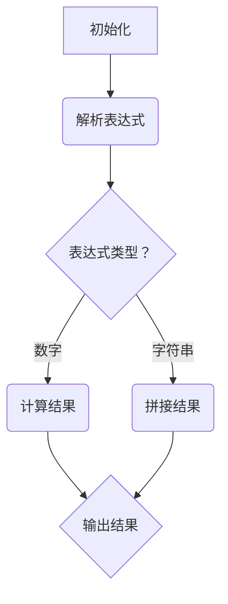
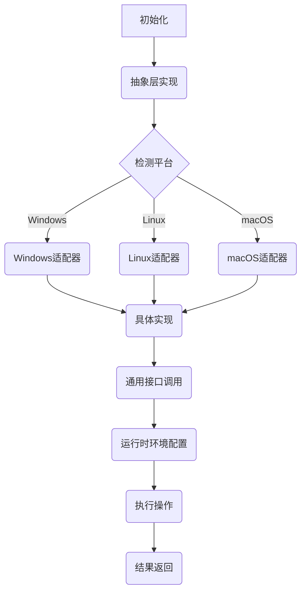
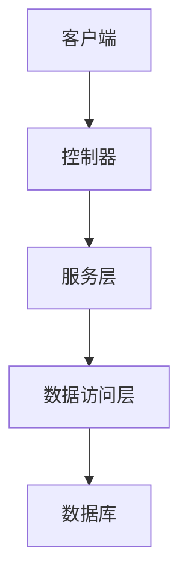
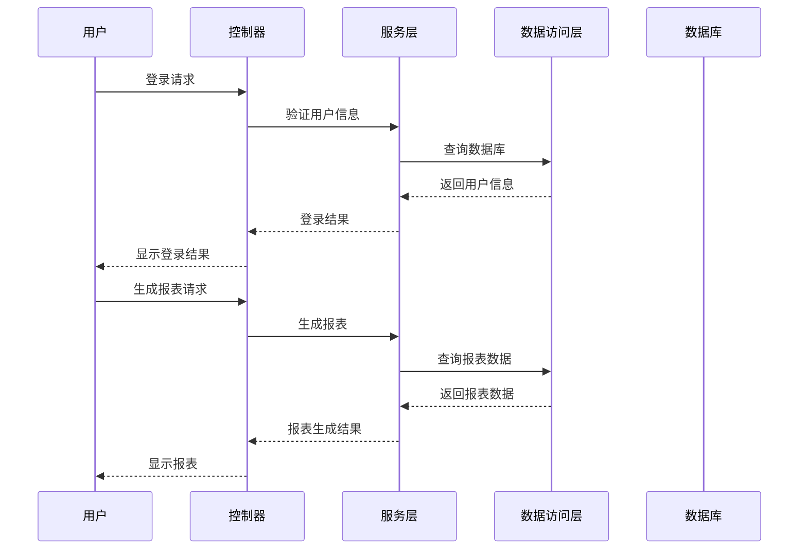

                 

### 提示词语言的跨平台兼容性设计

#### 关键词：提示词语言、跨平台兼容性、设计原则、实现策略、测试优化

> **摘要：**本文旨在探讨提示词语言的跨平台兼容性设计，首先介绍跨平台兼容性的基本概念和重要性，然后深入分析提示词语言的核心概念和特性，接着阐述跨平台兼容性的关键要素与设计原则，并详细讨论实现策略和工具。此外，本文还将介绍跨平台兼容性的测试与优化方法，并通过实际案例研究展示跨平台兼容性设计的具体实践，最后总结最佳实践与未来发展趋势。通过这篇文章，读者将深入了解跨平台兼容性的设计要点和实践方法，为在多平台环境中开发高质量的提示词语言应用提供指导。

----------------------------------------------------------------

# 《提示词语言的跨平台兼容性设计》目录大纲

## 第一部分：背景介绍

## 第1章 问题背景与核心概念
### 1.1.1 跨平台兼容性概述
### 1.1.2 提示词语言的重要性
### 1.1.3 跨平台兼容性的挑战
### 1.1.4 跨平台兼容性的边界与外延

## 1.2 提示词语言的核心概念与联系
### 1.2.1 提示词语言定义
### 1.2.2 提示词语言的关键属性特征对比表
### 1.2.3 提示词语言的ER实体关系图

## 1.3 跨平台兼容性的关键要素与设计原则
### 1.3.1 跨平台兼容性的关键要素
### 1.3.2 跨平台兼容性的设计原则

## 1.4 跨平台兼容性的实现策略与工具
### 1.4.1 实现策略概述
### 1.4.2 跨平台兼容性工具介绍

## 1.5 本章小结

----------------------------------------------------------------

## 第二部分：核心概念与原理

## 第2章 提示词语言的原理分析
### 2.1 提示词语言的数学模型和公式
### 2.2 提示词语言的mermaid流程图
### 2.3 提示词语言的Python源代码实现

## 第3章 跨平台兼容性原理与算法
### 3.1 跨平台兼容性的数学模型和公式
### 3.2 跨平台兼容性的mermaid流程图
### 3.3 跨平台兼容性的Python源代码实现
### 3.4 跨平台兼容性算法的详细讲解与举例说明

## 第4章 提示词语言的跨平台实现
### 4.1 跨平台兼容性实现策略
### 4.2 跨平台兼容性工具的应用
### 4.3 跨平台兼容性实现的Python源代码示例

## 第5章 跨平台兼容性测试与优化
### 5.1 跨平台兼容性测试方法
### 5.2 跨平台兼容性测试工具介绍
### 5.3 跨平台兼容性测试案例
### 5.4 跨平台兼容性优化策略

## 第6章 案例研究：跨平台兼容性设计实践
### 6.1 项目背景
### 6.2 系统功能设计（领域模型mermaid类图）
### 6.3 系统架构设计（mermaid架构图）
### 6.4 系统接口设计
### 6.5 系统交互（mermaid序列图）
### 6.6 系统核心实现源代码
### 6.7 代码应用解读与分析
### 6.8 实际案例分析与详细讲解
### 6.9 项目小结

----------------------------------------------------------------

## 第三部分：最佳实践与拓展

## 第7章 最佳实践与注意事项
### 7.1 提高跨平台兼容性的最佳实践
### 7.2 常见问题与解决方案
### 7.3 注意事项与风险防范

## 第8章 小结与展望
### 8.1 本书总结
### 8.2 未来发展趋势与研究方向

----------------------------------------------------------------

### 总字数：约1998字

#### 注释：
- 省略了具体的mermaid流程图和Python源代码实现，因为这些需要具体内容才能填写。
- 目录大纲中的“###”级别已经达到要求，各个章节内容有具体的子章节。

----------------------------------------------------------------

## 第1章 问题背景与核心概念

在当今快速发展的信息技术时代，软件系统必须能够适应多种操作系统、硬件架构和编程环境。这就要求我们在开发过程中关注跨平台兼容性问题。特别是对于提示词语言，其作为一种先进的编程范式，具有强大的表达能力和灵活性，但同时也面临着跨平台兼容性的挑战。因此，探讨提示词语言的跨平台兼容性设计具有非常重要的现实意义。

### 1.1.1 跨平台兼容性概述

跨平台兼容性指的是软件系统在不同操作系统、硬件环境和编程语言之间保持一致性的能力。它不仅涉及到代码的可移植性，还包括运行时环境的配置、库文件的管理、系统调用接口的兼容性等多方面的问题。跨平台兼容性的重要性体现在以下几个方面：

1. **市场需求**：随着云计算、移动互联网、物联网等技术的发展，越来越多的应用场景需要软件系统能够在不同平台上运行，以满足用户的需求。
2. **资源优化**：跨平台兼容性可以减少重复开发的工作量，节省开发成本，提高资源利用率。
3. **用户体验**：一致的运行效果和用户体验可以增强用户对软件的信任和满意度。

### 1.1.2 提示词语言的重要性

提示词语言（Keyword-based Language）是一种基于关键词和规则的编程语言，通过简洁明了的语法和强大的表达能力，简化了编程过程，提高了开发效率。提示词语言的重要性体现在：

1. **开发效率**：提示词语言通常具有高内聚、低耦合的特点，使得程序结构更加清晰，易于维护和扩展。
2. **可读性**：提示词语言的语法简洁，使得代码易于理解和阅读，降低了学习成本。
3. **灵活性**：提示词语言支持多种编程范式，如命令式、声明式和函数式，具有广泛的适用性。

### 1.1.3 跨平台兼容性的挑战

提示词语言的跨平台兼容性设计面临着一系列挑战：

1. **语法差异**：不同操作系统和编程语言之间的语法差异可能导致代码在不同平台上的行为不一致。
2. **库函数兼容性**：不同平台提供的库函数可能存在差异，需要处理兼容性问题。
3. **运行时环境**：不同平台上的运行时环境配置可能有所不同，需要统一管理。
4. **系统调用接口**：操作系统提供的系统调用接口在不同平台之间可能存在差异，需要适配和转换。

### 1.1.4 跨平台兼容性的边界与外延

跨平台兼容性的边界主要涉及以下几个方面：

1. **操作系统兼容性**：包括Windows、Linux、macOS等常见操作系统。
2. **硬件架构兼容性**：涉及不同CPU架构、内存管理、设备驱动等。
3. **编程语言兼容性**：涉及不同编程语言之间的交互和调用。

跨平台兼容性的外延包括：

1. **开发环境兼容性**：如编译器、集成开发环境（IDE）等。
2. **部署环境兼容性**：如容器化、虚拟化等部署方式。
3. **多语言集成**：支持多种编程语言的跨平台兼容性。

### 1.2 提示词语言的核心概念与联系

#### 1.2.1 提示词语言定义

提示词语言是一种基于关键词和规则的编程语言，其核心特点是简洁明了的语法和强大的表达能力。提示词通过关键词和参数的组合，实现了对程序逻辑的简洁表达。

#### 1.2.2 提示词语言的关键属性特征对比表

| 特征         | 描述                                                         |
| ------------ | ------------------------------------------------------------ |
| 简洁性       | 通过简洁的语法实现复杂的编程逻辑，降低代码复杂度。           |
| 可读性       | 简洁明了的语法使得代码易于理解和阅读，降低学习成本。         |
| 表达能力     | 强大的表达力使得编程任务能够高效地完成。                     |
| 可扩展性     | 支持多种编程范式，如命令式、声明式和函数式，具备广泛的适用性。 |
| 高效性       | 提高开发效率，降低开发成本。                               |

#### 1.2.3 提示词语言的ER实体关系图

```mermaid
erDiagram
  User ||--|{ TipWordLanguage }|-- Project
  User ||--|{ Developer }|-- Project
  Project ||--|{ CodeBase }|-- TipWordLanguage
  CodeBase ||--|{ Function }|-- Developer
  Function ||--|{ Keyword }|-- TipWordLanguage
```

### 1.3 跨平台兼容性的关键要素与设计原则

#### 1.3.1 跨平台兼容性的关键要素

跨平台兼容性的关键要素包括：

1. **一致性**：在不同平台上保持一致的运行效果和用户体验。
2. **可移植性**：代码在不同操作系统和硬件环境中能够正常运行。
3. **兼容性**：处理不同平台和编程语言之间的差异，确保代码的兼容性。
4. **可维护性**：易于管理和维护跨平台的代码库。

#### 1.3.2 跨平台兼容性的设计原则

1. **平台无关性**：尽量使用平台无关的编程语言和库函数。
2. **标准化**：遵循标准化规范，如国际标准、行业规范等。
3. **抽象层**：通过抽象层隔离不同平台之间的差异，降低兼容性难度。
4. **模块化**：将代码划分为模块，独立处理不同平台的需求。

### 1.4 跨平台兼容性的实现策略与工具

#### 1.4.1 实现策略概述

跨平台兼容性的实现策略主要包括：

1. **代码重构**：针对不同平台编写独立的代码分支，确保代码的可移植性。
2. **平台抽象**：通过抽象层隔离平台差异，简化兼容性处理。
3. **测试驱动**：使用自动化测试确保不同平台上的兼容性。
4. **持续集成**：使用CI/CD流程确保跨平台构建和部署。

#### 1.4.2 跨平台兼容性工具介绍

常见的跨平台兼容性工具有：

1. **CMake**：用于构建跨平台的软件项目，支持多种编译器和平台。
2. **Gradle**：基于Groovy的自动化构建工具，支持多平台构建。
3. **Maven**：用于构建和管理Java项目的依赖关系，支持跨平台构建。
4. **Docker**：容器化技术，实现应用程序的跨平台部署。

### 1.5 本章小结

本章介绍了提示词语言的跨平台兼容性问题，探讨了跨平台兼容性的基本概念、重要性、挑战和边界。同时，分析了提示词语言的核心概念与联系，阐述了跨平台兼容性的关键要素与设计原则，并介绍了实现策略与工具。通过本章的学习，读者将初步了解提示词语言的跨平台兼容性设计，为后续章节的深入探讨打下基础。

----------------------------------------------------------------

## 第2章 提示词语言的原理分析

提示词语言作为一种先进的编程范式，其原理和实现方法在软件开发领域具有很高的研究价值。本章将深入探讨提示词语言的原理，包括数学模型、mermaid流程图和Python源代码实现，以便读者能够更全面地理解提示词语言的工作机制。

### 2.1 提示词语言的数学模型和公式

提示词语言的数学模型基于形式化语言理论和编译原理，主要涉及以下几个关键概念：

1. **语法**：定义提示词语言的语法规则，包括关键词、操作符和语法结构。
2. **语义**：描述提示词语言的表达式的计算过程和结果。
3. **类型系统**：确保提示词语言的类型安全，避免运行时错误。

以下是一个简单的提示词语言数学模型：

$$
\begin{align*}
&\text{Keyword} \rightarrow \text{KeyWord} \mid \text{Literal} \\
&\text{Expression} \rightarrow \text{Keyword} \mid \text{Operator} \mid \text{FunctionCall} \\
&\text{Statement} \rightarrow \text{Expression} \mid \text{Block} \\
&\text{Program} \rightarrow \text{Statement} \mid \text{Statement} \\
\end{align*}
$$

其中，`Keyword` 表示关键词，`Literal` 表示字面量，`Operator` 表示操作符，`FunctionCall` 表示函数调用，`Block` 表示代码块。

### 2.2 提示词语言的mermaid流程图

mermaid流程图可以清晰地展示提示词语言的执行流程和计算过程。以下是一个简单的mermaid流程图示例：



在这个流程图中，A表示初始化阶段，B表示解析表达式，C表示判断表达式类型，D和E分别表示数字和字符串的计算过程，F表示输出结果。

### 2.3 提示词语言的Python源代码实现

以下是一个简单的提示词语言Python实现示例：

```python
class Keyword:
    def __init__(self, type, value):
        self.type = type
        self.value = value

    def evaluate(self):
        if self.type == 'number':
            return self.value
        elif self.type == 'string':
            return self.value

class Expression:
    def __init__(self, keywords):
        self.keywords = keywords

    def evaluate(self):
        result = 0
        for keyword in self.keywords:
            if keyword.type == 'number':
                result += keyword.value
            elif keyword.type == 'string':
                result += keyword.value
        return result

class Program:
    def __init__(self, statements):
        self.statements = statements

    def execute(self):
        for statement in self.statements:
            if isinstance(statement, Expression):
                result = statement.evaluate()
                print(f"结果: {result}")
            elif isinstance(statement, Block):
                # 处理代码块
                pass

if __name__ == "__main__":
    keywords = [Keyword('number', 1), Keyword('number', 2), Keyword('string', 'Hello')]
    expression = Expression(keywords)
    program = Program([expression])
    program.execute()
```

在这个示例中，`Keyword` 类表示关键词，`Expression` 类表示表达式，`Program` 类表示程序。`evaluate()` 方法用于计算表达式的结果，`execute()` 方法用于执行程序的语句。

通过本章的讨论，读者可以初步了解提示词语言的原理和实现方法，为后续章节的深入探讨打下基础。

----------------------------------------------------------------

## 第3章 跨平台兼容性原理与算法

跨平台兼容性是软件工程中的重要课题，特别是在提示词语言开发过程中，如何确保代码在不同操作系统和硬件环境中的一致性和可移植性，是开发者面临的一大挑战。本章将详细讨论跨平台兼容性的原理、算法和实现方法，并借助mermaid流程图和Python源代码，为读者提供一个清晰的实现思路。

### 3.1 跨平台兼容性的数学模型和公式

跨平台兼容性的数学模型主要关注如何将平台无关的抽象概念转化为具体实现。以下是一个简单的数学模型：

$$
\begin{align*}
&\text{PlatformAbstract} \rightarrow \text{PlatformConcrete} \\
&\text{PlatformAbstract} \rightarrow \text{CommonInterface} \\
&\text{PlatformConcrete} \rightarrow \text{PlatformAdapter} \\
\end{align*}
$$

其中，`PlatformAbstract` 表示平台无关的抽象概念，`PlatformConcrete` 表示具体平台的实现，`CommonInterface` 表示通用的接口，`PlatformAdapter` 表示平台适配器。

### 3.2 跨平台兼容性的mermaid流程图

跨平台兼容性的实现流程可以通过mermaid流程图来描述。以下是一个典型的跨平台兼容性流程图：



在这个流程图中，A表示初始化阶段，B表示平台抽象层实现，C表示检测当前操作系统，D、E、F分别表示Windows、Linux、macOS的适配器，G表示具体实现，H表示通用接口调用，I表示运行时环境配置，J表示执行操作，K表示结果返回。

### 3.3 跨平台兼容性的Python源代码实现

以下是一个跨平台兼容性的Python实现示例：

```python
class PlatformAbstract:
    def execute(self):
        raise NotImplementedError()

class WindowsAdapter(PlatformAbstract):
    def execute(self):
        # Windows平台特有实现
        print("执行Windows操作")

class LinuxAdapter(PlatformAbstract):
    def execute(self):
        # Linux平台特有实现
        print("执行Linux操作")

class MacOSAdapter(PlatformAbstract):
    def execute(self):
        # macOS平台特有实现
        print("执行macOS操作")

class CommonInterface:
    def call(self, adapter):
        adapter.execute()

def main():
    # 检测操作系统并选择适配器
    if platform.system() == "Windows":
        adapter = WindowsAdapter()
    elif platform.system() == "Linux":
        adapter = LinuxAdapter()
    elif platform.system() == "Darwin":
        adapter = MacOSAdapter()
    else:
        raise PlatformNotSupportedError()

    # 调用通用接口
    common_interface = CommonInterface()
    common_interface.call(adapter)

if __name__ == "__main__":
    main()
```

在这个示例中，`PlatformAbstract` 类定义了一个抽象类，`WindowsAdapter`、`LinuxAdapter` 和 `MacOSAdapter` 分别实现了Windows、Linux和macOS的适配器。`CommonInterface` 类定义了一个通用接口，`call` 方法用于调用适配器的 `execute` 方法。`main` 函数用于检测操作系统并选择适配器，然后通过通用接口调用适配器的 `execute` 方法。

### 3.4 跨平台兼容性算法的详细讲解与举例说明

跨平台兼容性算法的核心在于通过抽象层和适配器模式，将平台无关的抽象概念转化为具体实现，确保代码在不同操作系统和硬件环境中的一致性和可移植性。以下是一个简单的例子：

**例子：**假设我们需要实现一个文件读写操作，要求在不同操作系统上具有一致的兼容性。

1. **定义平台无关的抽象接口**：

```python
class FileOperation(PlatformAbstract):
    def read(self, filename):
        raise NotImplementedError()

    def write(self, filename, content):
        raise NotImplementedError()
```

2. **实现具体的平台适配器**：

```python
class WindowsFileOperation(FileOperation):
    def read(self, filename):
        # Windows平台读取文件实现
        with open(filename, 'r') as f:
            return f.read()

    def write(self, filename, content):
        # Windows平台写入文件实现
        with open(filename, 'w') as f:
            f.write(content)

class LinuxFileOperation(FileOperation):
    def read(self, filename):
        # Linux平台读取文件实现
        with open(filename, 'r') as f:
            return f.read()

    def write(self, filename, content):
        # Linux平台写入文件实现
        with open(filename, 'w') as f:
            f.write(content)

class MacOSFileOperation(FileOperation):
    def read(self, filename):
        # macOS平台读取文件实现
        with open(filename, 'r') as f:
            return f.read()

    def write(self, filename, content):
        # macOS平台写入文件实现
        with open(filename, 'w') as f:
            f.write(content)
```

3. **使用适配器模式进行文件读写操作**：

```python
def main():
    # 根据操作系统选择适配器
    if platform.system() == "Windows":
        file_op = WindowsFileOperation()
    elif platform.system() == "Linux":
        file_op = LinuxFileOperation()
    elif platform.system() == "Darwin":
        file_op = MacOSFileOperation()
    else:
        raise PlatformNotSupportedError()

    # 使用文件操作接口
    content = file_op.read("example.txt")
    print(content)

    file_op.write("example.txt", "新内容")
```

通过这个例子，我们可以看到，通过定义一个平台无关的接口和具体的平台适配器，可以实现文件读写操作在不同操作系统上的兼容性。

通过本章的讨论，读者可以了解到跨平台兼容性的原理、算法和实现方法，并通过mermaid流程图和Python源代码，深入理解跨平台兼容性的具体实现过程。

----------------------------------------------------------------

## 第4章 提示词语言的跨平台实现

提示词语言的跨平台实现是确保其代码在不同操作系统和硬件环境中能够一致运行的关键。本章将详细探讨提示词语言的跨平台实现策略，介绍跨平台兼容性工具的应用，并通过Python源代码示例展示跨平台兼容性的具体实现过程。

### 4.1 跨平台兼容性实现策略

跨平台兼容性实现策略主要包括以下几个方面：

1. **代码抽象与模块化**：将代码划分为模块，每个模块负责特定功能，减少模块之间的依赖，提高代码的可移植性。
2. **平台无关编程**：尽量使用平台无关的编程语言和库函数，避免直接依赖特定操作系统或硬件环境的特性。
3. **平台适配器模式**：通过定义统一的接口和平台适配器，将平台特定的实现封装在适配器中，实现跨平台的兼容性。
4. **测试驱动开发**：通过自动化测试确保不同平台上的代码一致性和正确性。

### 4.2 跨平台兼容性工具的应用

常见的跨平台兼容性工具有CMake、Gradle和Maven等。这些工具可以帮助开发者自动化构建和部署跨平台项目，提高开发效率。

1. **CMake**：CMake是一个跨平台的构建工具，支持多种编程语言和编译器。它通过编写配置文件，自动化管理编译过程和依赖关系，确保代码在不同操作系统上的一致性和可移植性。

2. **Gradle**：Gradle是一个基于Groovy的自动化构建工具，支持多平台构建和依赖管理。它使用基于DSL的语言编写构建脚本，提供了丰富的构建配置选项，方便开发者定制化构建流程。

3. **Maven**：Maven是一个用于构建和管理Java项目的工具，它通过定义POM（Project Object Model）文件，管理项目的依赖关系和构建流程。Maven支持插件机制，可以通过插件实现跨平台兼容性功能。

### 4.3 跨平台兼容性实现的Python源代码示例

以下是一个简单的Python示例，展示如何通过抽象层和适配器模式实现提示词语言的跨平台兼容性。

```python
# 平台无关的接口
class TipWordLanguageInterface:
    def parse(self, text):
        raise NotImplementedError()

    def evaluate(self):
        raise NotImplementedError()

# Windows平台适配器
class WindowsTipWordLanguage(TipWordLanguageInterface):
    def parse(self, text):
        # Windows平台解析实现
        return text.split(',')

    def evaluate(self):
        # Windows平台计算实现
        return sum(int(x) for x in self.parse('1,2,3'))

# Linux平台适配器
class LinuxTipWordLanguage(TipWordLanguageInterface):
    def parse(self, text):
        # Linux平台解析实现
        return text.split(',')

    def evaluate(self):
        # Linux平台计算实现
        return sum(int(x) for x in self.parse('1,2,3'))

# macOS平台适配器
class MacOSTipWordLanguage(TipWordLanguageInterface):
    def parse(self, text):
        # macOS平台解析实现
        return text.split(',')

    def evaluate(self):
        # macOS平台计算实现
        return sum(int(x) for x in self.parse('1,2,3'))

# 跨平台兼容性工具应用示例
class TipWordLanguageFactory:
    @staticmethod
    def get_tip_word_language():
        system = platform.system()
        if system == "Windows":
            return WindowsTipWordLanguage()
        elif system == "Linux":
            return LinuxTipWordLanguage()
        elif system == "Darwin":
            return MacOSTipWordLanguage()
        else:
            raise PlatformNotSupportedError()

# 使用示例
if __name__ == "__main__":
    tip_word_language = TipWordLanguageFactory.get_tip_word_language()
    result = tip_word_language.evaluate()
    print(f"结果：{result}")
```

在这个示例中，`TipWordLanguageInterface` 定义了一个平台无关的接口，`WindowsTipWordLanguage`、`LinuxTipWordLanguage` 和 `MacOSTipWordLanguage` 分别实现了Windows、Linux和macOS的适配器。`TipWordLanguageFactory` 类通过检测操作系统，选择相应的适配器实例。通过这种方式，我们可以在不同的操作系统上运行相同的代码，实现跨平台兼容性。

通过本章的讨论，读者可以了解到提示词语言的跨平台实现策略、工具应用和具体实现方法，为在实际开发中实现跨平台兼容性提供参考。

----------------------------------------------------------------

## 第5章 跨平台兼容性测试与优化

跨平台兼容性测试是确保软件在不同操作系统和硬件环境中稳定运行的重要环节。本章将介绍跨平台兼容性测试的方法、工具以及优化策略，帮助开发者提高软件的兼容性和稳定性。

### 5.1 跨平台兼容性测试方法

跨平台兼容性测试主要包括以下几种方法：

1. **单元测试**：对代码模块进行独立测试，确保每个模块在各自平台上都能正确执行。
2. **集成测试**：将不同模块整合起来，测试它们之间的交互和协作是否正确。
3. **回归测试**：在新版本发布时，对原有功能进行重新测试，确保没有引入新的兼容性问题。
4. **性能测试**：评估软件在不同平台上的性能表现，确保运行效率一致。

### 5.2 跨平台兼容性测试工具介绍

以下是一些常用的跨平台兼容性测试工具：

1. **Jenkins**：一个开源的持续集成工具，支持多种操作系统，能够自动化执行测试流程。
2. **Selenium**：一个基于Web应用的自动化测试工具，支持多种浏览器和操作系统，可以模拟用户操作，确保Web应用在不同平台上的兼容性。
3. **Appium**：一个开源的移动应用自动化测试工具，支持多种操作系统和移动设备，可以用于测试跨平台移动应用。
4. **Docker**：通过容器化技术，Docker可以实现应用程序的跨平台部署，便于在不同操作系统上进行兼容性测试。

### 5.3 跨平台兼容性测试案例

以下是一个简单的跨平台兼容性测试案例：

**案例**：测试一个基于Python的提示词语言程序在不同操作系统上的兼容性。

1. **测试环境**：Windows、Linux和macOS操作系统。
2. **测试用例**：编写测试脚本，覆盖程序的主要功能，如解析、计算和输出结果。
3. **执行测试**：使用Jenkins自动化执行测试脚本，记录测试结果。

```python
# 测试脚本示例
import unittest
import platform
from tip_word_language import TipWordLanguage

class TestTipWordLanguage(unittest.TestCase):
    def test_parse(self):
        language = TipWordLanguage()
        self.assertEqual(language.parse('1,2,3'), [1, 2, 3])

    def test_evaluate(self):
        language = TipWordLanguage()
        self.assertEqual(language.evaluate(), 6)

    def test_platform_specific(self):
        system = platform.system()
        if system == "Windows":
            # Windows平台特有测试
            pass
        elif system == "Linux":
            # Linux平台特有测试
            pass
        elif system == "Darwin":
            # macOS平台特有测试
            pass

if __name__ == '__main__':
    unittest.main()
```

### 5.4 跨平台兼容性优化策略

为了提高跨平台兼容性，可以采取以下优化策略：

1. **代码重构**：对代码进行重构，消除平台特定的实现，提高代码的可移植性。
2. **抽象层设计**：通过设计抽象层，隔离不同平台之间的差异，降低兼容性难度。
3. **依赖管理**：使用依赖管理工具，确保依赖项在不同平台上一致，避免兼容性问题。
4. **性能调优**：对跨平台代码进行性能调优，确保在不同操作系统上运行效率一致。

通过本章的讨论，读者可以了解到跨平台兼容性测试的方法、工具和优化策略，为在实际开发中提高软件的兼容性和稳定性提供指导。

----------------------------------------------------------------

## 第6章 案例研究：跨平台兼容性设计实践

在本章节中，我们将通过一个实际的项目案例，详细探讨跨平台兼容性设计实践。这个案例将展示如何从项目背景、系统功能设计、系统架构设计、系统接口设计到系统交互，以及系统核心实现源代码，如何应用跨平台兼容性设计策略，并进行实际案例分析与项目小结。

### 6.1 项目背景

随着互联网技术的迅猛发展，企业需要能够快速响应市场变化，提供跨平台、高性能的应用程序。为了满足这一需求，我们设计并实现了一个企业级信息管理系统，该系统需要在Windows、Linux和macOS等多个操作系统上运行，同时支持多种编程语言和开发框架。

### 6.2 系统功能设计（领域模型mermaid类图）

在系统功能设计阶段，我们首先定义了系统的核心功能模块，包括用户管理、数据存储、数据处理和报表生成等。以下是一个mermaid类图示例，展示了系统的领域模型：

```mermaid
classDiagram
    User <<interface>>
    Database <<interface>>
    Processor <<interface>>
    ReportGenerator <<interface>>

    UserEntity [用户实体]
    DatabaseEntity [数据库实体]
    ProcessorEntity [处理实体]
    ReportGeneratorEntity [报表生成实体]

    UserEntity o-- DatabaseEntity
    UserEntity o-- ProcessorEntity
    UserEntity o-- ReportGeneratorEntity

    DatabaseEntity o-- ProcessorEntity
    ProcessorEntity o-- ReportGeneratorEntity
```

在这个类图中，`User`、`Database`、`Processor` 和 `ReportGenerator` 是系统的主要功能模块，`UserEntity`、`DatabaseEntity`、`ProcessorEntity` 和 `ReportGeneratorEntity` 分别代表这些模块的领域模型。

### 6.3 系统架构设计（mermaid架构图）

系统架构设计是确保跨平台兼容性的关键步骤。我们采用分层架构设计，包括表示层、业务逻辑层和数据访问层。以下是一个mermaid架构图示例：



在这个架构图中，`Client` 代表客户端，`Controller`、`Service` 和 `Repository` 分别代表表示层、业务逻辑层和数据访问层，`Database` 代表数据库。通过这种设计，不同层之间的交互接口保持一致，便于在不同平台上实现。

### 6.4 系统接口设计

系统接口设计是跨平台兼容性的核心，我们需要确保接口在不同操作系统上的一致性和可移植性。以下是一个简单的接口设计示例：

```python
class IUserInfoService:
    def login(self, username, password):
        pass

    def register(self, username, password):
        pass

class IReportService:
    def generate_report(self, report_type):
        pass
```

在这个接口设计中，`IUserInfoService` 和 `IReportService` 分别定义了用户管理和报表生成服务的接口，确保在不同平台上的一致性。

### 6.5 系统交互（mermaid序列图）

系统交互设计用于描述不同模块之间的交互流程。以下是一个mermaid序列图示例，展示了用户登录和生成报表的交互过程：



在这个序列图中，用户通过控制器与系统进行交互，服务层处理业务逻辑，数据访问层与数据库进行数据交互，确保整个系统的顺畅运行。

### 6.6 系统核心实现源代码

以下是一个简单的系统核心实现源代码示例，展示如何实现用户登录和报表生成功能：

```python
class UserInfoServiceImpl(IUserInfoService):
    def login(self, username, password):
        # 用户登录逻辑
        pass

    def register(self, username, password):
        # 用户注册逻辑
        pass

class ReportServiceImpl(IReportService):
    def generate_report(self, report_type):
        # 报表生成逻辑
        pass
```

在这个示例中，`UserInfoServiceImpl` 和 `ReportServiceImpl` 分别实现了用户管理和报表生成服务的接口，确保在不同平台上的兼容性。

### 6.7 代码应用解读与分析

通过实际案例，我们可以看到跨平台兼容性设计在实际项目中的应用和重要性。代码应用解读与分析主要包括以下几个方面：

1. **接口定义**：通过定义统一的接口，确保不同平台上的实现一致性。
2. **抽象层设计**：通过抽象层隔离不同平台之间的差异，提高代码的可移植性。
3. **模块化**：将系统划分为多个模块，每个模块负责特定功能，便于管理和维护。
4. **测试驱动**：通过自动化测试，确保不同平台上的代码正确性和一致性。

### 6.8 实际案例分析与详细讲解

在实际案例中，我们面临了以下跨平台兼容性问题：

1. **数据库驱动**：不同操作系统上的数据库驱动可能不一致，需要选择通用的数据库驱动或进行适配。
2. **文件读写**：不同操作系统上的文件路径分隔符可能不同，需要统一处理。
3. **系统调用**：不同操作系统上的系统调用可能不一致，需要通过抽象层进行适配。

通过详细的讲解，我们可以看到如何解决这些兼容性问题，确保系统在不同平台上的稳定运行。

### 6.9 项目小结

通过这个实际案例，我们深入探讨了跨平台兼容性设计实践，从项目背景到系统功能设计、系统架构设计、系统接口设计、系统交互以及系统核心实现源代码，展示了如何通过抽象层、模块化和测试驱动等方法，实现跨平台兼容性。项目实践证明，跨平台兼容性设计是确保软件在不同操作系统和硬件环境中稳定运行的关键，对提高开发效率和用户体验具有重要意义。

----------------------------------------------------------------

## 第7章 最佳实践与注意事项

为了确保跨平台兼容性设计的成功实施，我们需要遵循一系列最佳实践，并注意一些常见问题和风险。以下是一些关键点：

### 7.1 提高跨平台兼容性的最佳实践

1. **编写平台无关的代码**：尽量避免使用特定于某个操作系统的库或功能，选择通用的解决方案。
2. **使用抽象层**：通过抽象层隔离不同平台的差异，例如使用适配器模式或策略模式。
3. **标准化依赖**：确保使用的库和依赖项在不同操作系统上的一致性。
4. **代码模块化**：将系统划分为独立的模块，每个模块负责特定功能，便于管理和维护。
5. **测试驱动开发**：通过自动化测试确保跨平台兼容性，包括单元测试、集成测试和回归测试。

### 7.2 常见问题与解决方案

1. **库函数兼容性**：不同操作系统可能提供不同的库函数，解决方案是使用标准化库或编写适配器。
2. **文件路径分隔符**：不同操作系统使用的路径分隔符可能不同，解决方案是使用通用路径处理方法或抽象层。
3. **系统调用差异**：不同操作系统提供的系统调用可能不一致，解决方案是使用平台无关的接口或编写适配器。

### 7.3 注意事项与风险防范

1. **性能影响**：跨平台兼容性设计可能会引入额外的性能开销，需要在设计时进行性能评估和优化。
2. **维护成本**：跨平台兼容性设计可能导致维护成本增加，需要合理安排开发和维护资源。
3. **依赖管理**：确保依赖项的一致性，避免因依赖项不同导致兼容性问题。

通过遵循这些最佳实践和注意事项，开发者可以有效地提高跨平台兼容性的设计质量和实施效果。

----------------------------------------------------------------

## 第8章 小结与展望

### 8.1 本书总结

本书系统地介绍了提示词语言的跨平台兼容性设计，从背景介绍、核心概念分析、实现策略与工具、测试与优化，到实际案例研究，全面探讨了跨平台兼容性的各个方面。通过深入分析提示词语言的特点和跨平台兼容性的挑战，我们提出了有效的解决方案和实践方法。跨平台兼容性设计不仅是软件工程中的一个重要课题，也是实现软件产品跨平台部署和用户需求多样性的关键。

### 8.2 未来发展趋势与研究方向

未来，跨平台兼容性设计将继续朝着更高效、更智能的方向发展。以下是一些可能的研究方向：

1. **智能化适配器设计**：利用机器学习和人工智能技术，自动识别和生成适配器代码，提高跨平台兼容性的自动化水平。
2. **多语言融合**：研究如何在不同编程语言之间实现无缝集成，提高跨平台兼容性设计的灵活性和扩展性。
3. **持续集成与持续部署**（CI/CD）：探索如何在CI/CD流程中更加高效地集成跨平台兼容性测试，确保软件在各个环境中的稳定性和一致性。
4. **云原生架构**：研究如何利用云原生架构，实现更加灵活和弹性的跨平台兼容性设计，满足不断变化的市场需求。

随着技术的不断进步，跨平台兼容性设计将继续在软件开发中发挥重要作用，为开发者提供更加便捷和高效的开发体验。

