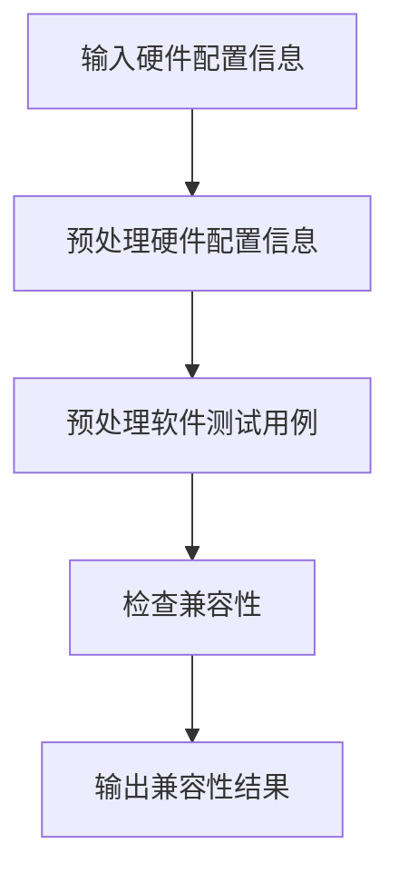
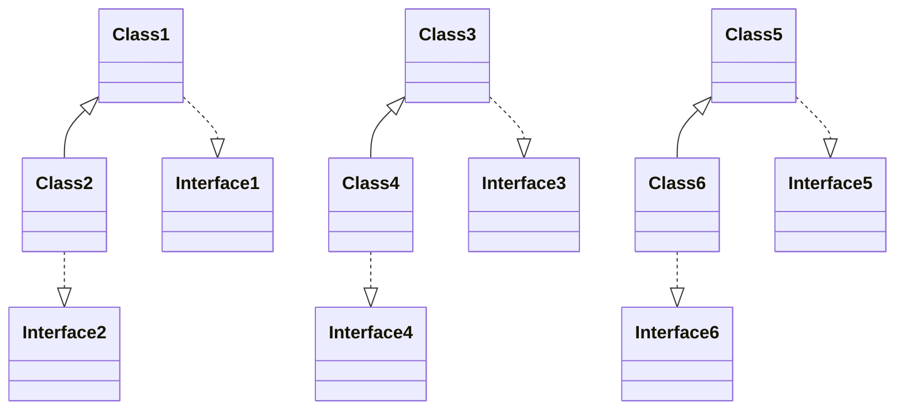
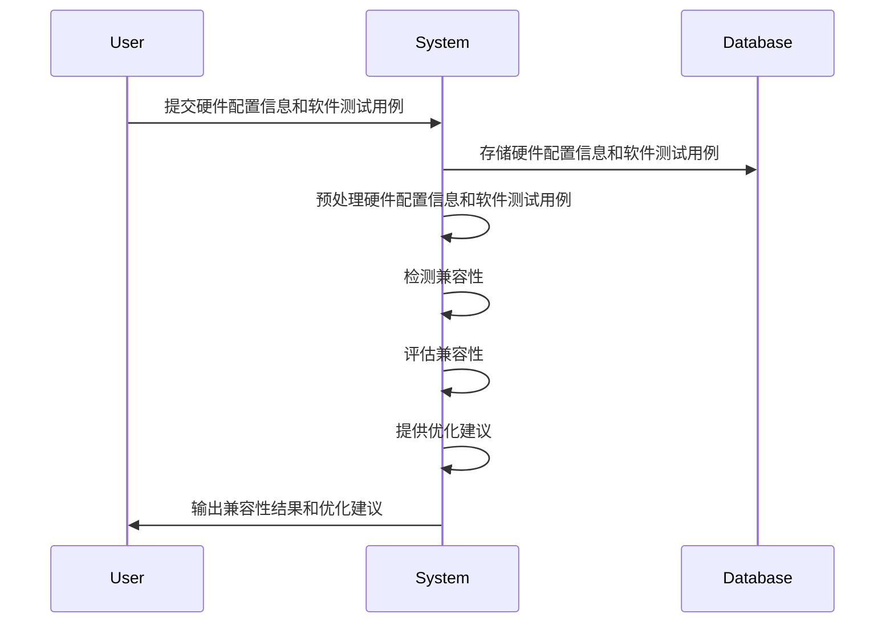

                 

### 文章标题

《提示词语言的跨硬件架构兼容性保证》

> **关键词：** 跨硬件架构兼容性、提示词语言、抽象层、标准化、虚拟化

**摘要：** 本文深入探讨了提示词语言在跨硬件架构兼容性保证中的重要性。首先，介绍了硬件架构兼容性的核心概念及其在不同硬件架构中的应用背景。随后，详细分析了硬件多样性、软件需求变化和硬件特定优化带来的兼容性挑战。本文提出了通用设计、抽象层、标准化和虚拟化等策略，以解决硬件架构兼容性问题。此外，本文还探讨了硬件架构兼容性的边界与外延，以及实现硬件架构兼容性的核心要素。通过这些策略和方法，可以有效地保证提示词语言在跨硬件架构上的兼容性，为软件开发的跨平台部署提供强有力的支持。

### 第一部分：问题背景与核心概念

#### 第1章：问题背景

##### 1.1 问题概述

##### **1.1.1 硬件架构兼容性的定义**

硬件架构兼容性是指不同硬件架构之间能够相互操作和数据交换的能力。具体而言，它涉及硬件系统（如处理器、内存、I/O设备等）的兼容性，以确保软件能够在多种硬件平台上运行，而不会出现功能受限或性能下降等问题。

##### **1.1.2 硬件架构兼容性的重要性**

硬件架构兼容性在多个方面具有重要价值：

1. **提高软件可移植性**：通过确保软件在不同硬件架构上的兼容性，可以减少开发人员针对每种硬件平台进行专门优化的需求，从而提高软件的可移植性。
2. **降低维护成本**：兼容性使得软件可以在多种硬件平台上运行，从而减少了维护和更新的工作量，降低了维护成本。
3. **扩展硬件选择范围**：兼容性确保了软件可以在新的硬件平台上运行，从而为开发者提供了更多的硬件选择，提高了系统的灵活性。

##### **1.1.3 提示词语言与硬件架构兼容性**

提示词语言是一种特殊的编程语言，它通过一系列预定义的指令或关键字来引导程序的执行。在跨硬件架构的兼容性保证中，提示词语言具有以下作用：

1. **跨平台抽象**：提示词语言提供了一种高度抽象的编程模型，使得开发者可以在不关心硬件细节的情况下编写和运行程序。
2. **灵活性与可移植性**：提示词语言的抽象性使其在不同硬件架构上具有良好的兼容性，从而提高了软件的可移植性和灵活性。

##### **1.2 问题描述**

在当前技术环境中，硬件架构兼容性面临以下主要挑战：

1. **硬件多样性**：随着硬件技术的快速发展，不同硬件架构的种类和数量不断增加，这给兼容性带来了巨大挑战。
2. **软件需求变化**：软件需求的高变化性导致软件在不同硬件平台上的兼容性问题，例如操作系统更新和应用更新。
3. **硬件特定优化**：硬件制造商往往对特定硬件进行优化，这可能导致软件在特定硬件上的兼容性问题。

##### **1.2.1 硬件多样性**

硬件多样性的增加主要体现在以下几个方面：

1. **处理器架构**：不同处理器架构（如ARM、x86、RISC-V等）之间存在显著差异，这给软件兼容性带来了挑战。
2. **内存管理**：不同硬件架构的内存管理机制（如虚拟内存、物理内存等）不同，这可能导致软件在不同平台上的性能和兼容性问题。
3. **存储系统**：不同存储系统（如硬盘、固态硬盘、闪存等）的性能和接口标准不同，这也对软件兼容性提出了挑战。
4. **I/O设备**：不同硬件架构的I/O设备（如USB、PCIe、SATA等）也存在差异，这可能导致软件在不同平台上无法正常工作。

##### **1.2.2 软件需求变化**

软件需求的变化主要表现在以下几个方面：

1. **操作系统更新**：操作系统的更新可能引入新的API、新的系统调用，导致现有软件的兼容性问题。
2. **应用更新**：应用的更新可能引入新的功能、新的依赖库，这可能导致软件在不同平台上的兼容性问题。

##### **1.2.3 硬件特定优化**

硬件制造商对特定硬件进行优化可能导致兼容性问题。例如：

1. **GPU优化**：GPU制造商对GPU进行特定优化，可能导致现有软件在GPU上的性能下降或无法运行。
2. **FPGA优化**：FPGA制造商对FPGA进行特定优化，可能导致现有软件在FPGA上的兼容性问题。

##### **1.3 问题解决**

为了解决硬件架构兼容性问题，可以采用以下策略和原理：

1. **通用设计**：通过采用通用设计原则，使软件在不同硬件架构上具备更好的兼容性。
2. **抽象层**：通过引入抽象层，隔离硬件差异，提高软件兼容性。
3. **标准化**：通过标准化，确保不同硬件架构之间的兼容性。
4. **虚拟化**：通过虚拟化技术，实现硬件资源的抽象和隔离，从而提升兼容性。

##### **1.4 边界与外延**

硬件架构兼容性并非万能，存在以下边界与外延：

1. **硬件特定优化**：硬件特定优化可能导致某些软件在特定硬件上无法运行或性能下降。
2. **性能瓶颈**：在某些硬件架构上，性能瓶颈可能限制软件的运行效率。
3. **应用场景差异**：某些应用场景可能对硬件架构具有特定要求，无法实现兼容。

##### **1.5 核心要素组成**

硬件架构兼容性的实现涉及多个核心要素，包括：

1. **技术要素**：如驱动程序、中间件、API设计等。
2. **设计原则**：如模块化、可扩展性、灵活性等。
3. **测试验证**：如单元测试、集成测试、性能测试等。

#### 第2章：核心概念

##### **2.1 跨硬件架构兼容性的核心概念**

##### **2.1.1 硬件架构**

硬件架构是指计算机系统中各种硬件组件的布局和连接方式，包括处理器、内存、I/O设备、总线等。硬件架构的设计和选择直接影响系统的性能、兼容性和可扩展性。

##### **2.1.2 软件与硬件的交互**

软件与硬件的交互主要通过以下几种方式实现：

1. **系统调用**：软件通过系统调用请求硬件资源或执行特定操作。
2. **中断处理**：硬件设备通过中断信号通知软件，请求处理特定事件。
3. **设备驱动**：设备驱动程序是软件与硬件之间的接口，负责管理和控制硬件设备。

##### **2.1.3 兼容性级别**

兼容性可以分为以下几个级别：

1. **源代码兼容**：同一软件源代码在不同硬件架构上无需修改即可编译和运行。
2. **二进制兼容**：同一软件的二进制代码在不同硬件架构上无需修改即可运行。
3. **功能兼容**：同一软件在不同硬件架构上具备相同的功能和性能。

##### **2.1.4 跨平台开发**

跨平台开发是指软件在不同操作系统和处理器架构上运行的能力。跨平台开发面临的挑战包括：

1. **操作系统差异**：不同操作系统具有不同的API、系统调用和内存管理机制。
2. **处理器架构差异**：不同处理器架构具有不同的指令集和寄存器布局。

##### **2.2 提示词语言**

##### **2.2.1 提示词语言定义**

提示词语言是一种特殊的编程语言，通过一系列预定义的指令或关键字来引导程序的执行。提示词语言通常用于自动化脚本、配置管理、系统监控等领域。

##### **2.2.2 提示词语言的特点**

提示词语言具有以下特点：

1. **高度抽象**：提示词语言提供了一种高度抽象的编程模型，使得开发者可以快速实现复杂的操作。
2. **可移植性**：提示词语言通常与硬件架构无关，使得软件在不同平台上具有较好的可移植性。
3. **灵活性**：提示词语言允许开发者自定义指令和关键字，从而适应不同的应用场景。

##### **2.2.3 提示词语言的类型**

常见的提示词语言包括：

1. **脚本语言**：如Python、Ruby、Perl等，用于编写自动化脚本和配置管理。
2. **查询语言**：如SQL、NoSQL等，用于数据库查询和数据处理。

##### **2.3 跨硬件架构兼容性保证机制**

##### **2.3.1 抽象层机制**

抽象层机制通过隔离硬件差异，提高软件兼容性。常见的抽象层包括：

1. **硬件抽象层（HAL）**：在操作系统和硬件之间提供一层抽象，隐藏硬件细节，使操作系统可以与多种硬件架构兼容。
2. **设备驱动层**：在操作系统和设备驱动程序之间提供一层抽象，隐藏不同设备的细节，使操作系统可以管理多种设备。

##### **2.3.2 驱动模型**

驱动模型是指操作系统与设备驱动程序之间的接口和交互机制。常见的驱动模型包括：

1. **设备驱动**：直接与硬件设备交互，负责管理和控制硬件设备。
2. **文件系统驱动**：负责文件系统的管理和访问，如文件读写、权限控制等。
3. **网络驱动**：负责网络数据的接收和发送，如TCP/IP协议栈。

##### **2.3.3 虚拟化技术**

虚拟化技术通过虚拟化硬件资源，提高软件兼容性。常见的虚拟化技术包括：

1. **虚拟机（VM）**：通过虚拟化CPU、内存、硬盘等硬件资源，实现多个操作系统和应用程序的并行运行。
2. **容器（Container）**：通过虚拟化操作系统内核，实现应用程序的轻量级隔离和并行运行。

##### **2.3.4 标准化与开放接口**

标准化和开放接口在硬件架构兼容性中起着关键作用。标准化确保不同硬件架构之间的一致性，开放接口提供硬件和软件之间的互操作性。常见的标准化和开放接口包括：

1. **国际标准**：如PCIe、USB、SATA等，规定了硬件接口和通信协议。
2. **行业规范**：如IEEE、ITU等，规定了特定领域的硬件和软件标准。
3. **开放接口**：如API、ABI等，提供了软件与硬件之间的编程接口。

##### **2.4 边界与外延**

硬件架构兼容性存在以下边界与外延：

1. **硬件特定优化**：某些硬件优化可能导致软件兼容性问题。
2. **性能瓶颈**：在某些硬件架构上，性能瓶颈可能限制软件的运行效率。
3. **应用场景差异**：某些应用场景可能对硬件架构具有特定要求，无法实现兼容。

##### **2.5 核心要素组成**

硬件架构兼容性的实现涉及以下核心要素：

1. **技术要素**：如驱动程序、中间件、API设计等。
2. **设计原则**：如模块化、可扩展性、灵活性等。
3. **测试验证**：如单元测试、集成测试、性能测试等。

### 第二部分：核心概念与联系

#### 第3章：核心概念与联系

##### **3.1 跨硬件架构兼容性的核心概念**

##### **3.1.1 硬件架构**

硬件架构是指计算机系统中各种硬件组件的布局和连接方式，包括处理器、内存、I/O设备、总线等。硬件架构的设计和选择直接影响系统的性能、兼容性和可扩展性。

**硬件架构特点**：

- **处理器架构**：不同处理器架构（如ARM、x86、RISC-V等）之间存在显著差异，这给软件兼容性带来了挑战。
- **内存管理**：不同硬件架构的内存管理机制（如虚拟内存、物理内存等）不同，这可能导致软件在不同平台上的性能和兼容性问题。
- **存储系统**：不同存储系统（如硬盘、固态硬盘、闪存等）的性能和接口标准不同，这也对软件兼容性提出了挑战。
- **I/O设备**：不同硬件架构的I/O设备（如USB、PCIe、SATA等）也存在差异，这可能导致软件在不同平台上无法正常工作。

**硬件架构分类**：

- **CISC（复杂指令集计算）**：如x86架构，具有丰富的指令集和复杂的指令解码逻辑。
- **RISC（精简指令集计算）**：如ARM架构，具有较少的指令集和简化的指令解码逻辑。
- **VLIW（可扩展指令集计算）**：如PowerPC架构，通过将多个指令并行执行来提高性能。

**硬件架构发展**：

- **多核处理器**：随着多核处理器的普及，硬件架构逐渐向多核、异构计算方向发展。
- **GPU计算**：图形处理器（GPU）在计算密集型任务中表现出色，硬件架构开始融合CPU和GPU资源。

##### **3.1.2 软件与硬件的交互**

软件与硬件的交互主要通过以下几种方式实现：

1. **系统调用**：软件通过系统调用请求硬件资源或执行特定操作。系统调用是一种操作系统提供的接口，用于实现进程管理、文件操作、设备控制等功能。

**系统调用过程**：

- **调用请求**：软件程序通过特定的函数或指令发出系统调用请求。
- **中断处理**：操作系统接收到系统调用请求后，通过中断处理机制暂停当前进程，转而处理系统调用。
- **执行操作**：操作系统执行相应的操作，如分配资源、执行设备控制等。
- **返回结果**：操作系统将执行结果返回给软件程序，继续执行后续操作。

2. **中断处理**：硬件设备通过中断信号通知软件，请求处理特定事件。中断是一种硬件机制，用于在特定事件发生时通知操作系统进行处理。

**中断处理过程**：

- **中断请求**：硬件设备向操作系统发送中断请求。
- **中断处理**：操作系统通过中断处理程序响应中断请求，执行相应的操作，如数据接收、设备控制等。
- **返回状态**：操作系统将中断处理结果返回给硬件设备。

3. **设备驱动**：设备驱动程序是软件与硬件之间的接口，负责管理和控制硬件设备。设备驱动程序通过系统调用和中断处理与操作系统交互。

**设备驱动程序功能**：

- **设备初始化**：初始化硬件设备，设置设备参数和配置。
- **数据传输**：实现硬件设备与内存之间的数据传输。
- **设备控制**：控制硬件设备的操作，如启动、停止、配置等。
- **异常处理**：处理硬件设备的异常情况，如设备故障、数据传输错误等。

##### **3.1.3 兼容性级别**

兼容性可以分为以下几个级别：

1. **源代码兼容**：同一软件源代码在不同硬件架构上无需修改即可编译和运行。源代码兼容性要求软件在不同硬件架构上的编译环境和编译器兼容。

2. **二进制兼容**：同一软件的二进制代码在不同硬件架构上无需修改即可运行。二进制兼容性要求软件在不同硬件架构上的运行环境兼容，如操作系统、运行时库等。

3. **功能兼容**：同一软件在不同硬件架构上具备相同的功能和性能。功能兼容性要求软件在不同硬件架构上实现相同的功能，同时保证性能和用户体验。

**兼容性级别比较**：

- 源代码兼容性最高，因为它允许软件在不同的编译环境和编译器上运行。
- 二进制兼容性次之，因为它要求软件在不同硬件架构上的运行环境兼容。
- 功能兼容性最低，因为它要求软件在不同硬件架构上实现相同的功能和性能。

##### **3.1.4 跨平台开发**

跨平台开发是指软件在不同操作系统和处理器架构上运行的能力。跨平台开发面临的挑战包括：

1. **操作系统差异**：不同操作系统具有不同的API、系统调用和内存管理机制。例如，Windows和Linux之间的差异可能导致软件在不同操作系统上无法正常运行。

2. **处理器架构差异**：不同处理器架构具有不同的指令集和寄存器布局。例如，ARM和x86之间的差异可能导致软件在不同处理器架构上无法编译或运行。

**跨平台开发方法**：

- **抽象层**：通过引入抽象层，隔离操作系统和处理器架构的差异，实现软件的跨平台兼容性。常见的抽象层包括硬件抽象层（HAL）和操作系统抽象层（OSAL）。
- **框架和库**：使用跨平台框架和库，如Qt、Java、Python等，简化跨平台开发的复杂度。
- **交叉编译**：使用交叉编译工具链，在不同操作系统和处理器架构上编译和构建软件，以实现跨平台兼容性。

##### **3.2 提示词语言**

提示词语言是一种特殊的编程语言，通过一系列预定义的指令或关键字来引导程序的执行。提示词语言通常用于自动化脚本、配置管理、系统监控等领域。

**提示词语言特点**：

- **高度抽象**：提示词语言提供了一种高度抽象的编程模型，使得开发者可以快速实现复杂的操作。例如，使用简单的关键字即可实现复杂的文件操作、网络通信等功能。
- **可移植性**：提示词语言通常与硬件架构无关，使得软件在不同平台上具有较好的可移植性。例如，Python、Ruby、Perl等提示词语言在不同操作系统和处理器架构上都可以正常运行。
- **灵活性**：提示词语言允许开发者自定义指令和关键字，从而适应不同的应用场景。例如，开发者可以自定义特定领域的指令，以简化复杂的操作。

**提示词语言类型**：

- **脚本语言**：如Python、Ruby、Perl等，用于编写自动化脚本和配置管理。
- **查询语言**：如SQL、NoSQL等，用于数据库查询和数据处理。

**提示词语言应用场景**：

- **自动化脚本**：用于自动化日常任务，如文件备份、系统监控、网络配置等。
- **配置管理**：用于管理大型系统的配置，如服务器配置、网络配置等。
- **系统监控**：用于监控系统性能、资源利用率等指标。

##### **3.3 跨硬件架构兼容性保证机制**

为了保证跨硬件架构的兼容性，可以采用以下机制：

1. **抽象层机制**：通过引入抽象层，隔离硬件差异，提高软件兼容性。常见的抽象层包括硬件抽象层（HAL）和操作系统抽象层（OSAL）。

**抽象层机制原理**：

- **硬件抽象层（HAL）**：在操作系统和硬件之间提供一层抽象，隐藏硬件细节，使操作系统可以与多种硬件架构兼容。
- **操作系统抽象层（OSAL）**：在应用软件和操作系统之间提供一层抽象，隐藏操作系统细节，使应用软件可以与多种操作系统兼容。

**抽象层机制优势**：

- **简化开发**：通过引入抽象层，开发人员无需关注底层硬件细节，可以专注于应用软件的开发。
- **提高兼容性**：抽象层提供了统一的接口和协议，使软件在不同硬件架构上具有更好的兼容性。

2. **驱动模型**：驱动模型是指操作系统与设备驱动程序之间的接口和交互机制。常见的驱动模型包括设备驱动、文件系统驱动、网络驱动等。

**驱动模型原理**：

- **设备驱动**：直接与硬件设备交互，负责管理和控制硬件设备。
- **文件系统驱动**：负责文件系统的管理和访问，如文件读写、权限控制等。
- **网络驱动**：负责网络数据的接收和发送，如TCP/IP协议栈。

**驱动模型优势**：

- **提高兼容性**：通过统一驱动模型，操作系统可以管理与多种硬件设备，提高软件兼容性。
- **简化管理**：驱动模型提供了统一的接口和协议，简化了硬件设备的管理和维护。

3. **虚拟化技术**：虚拟化技术通过虚拟化硬件资源，提高软件兼容性。常见的虚拟化技术包括虚拟机（VM）和容器（Container）。

**虚拟化技术原理**：

- **虚拟机（VM）**：通过虚拟化CPU、内存、硬盘等硬件资源，实现多个操作系统和应用程序的并行运行。
- **容器（Container）**：通过虚拟化操作系统内核，实现应用程序的轻量级隔离和并行运行。

**虚拟化技术优势**：

- **提高兼容性**：虚拟化技术可以模拟不同的硬件环境，使软件在不同硬件架构上具有更好的兼容性。
- **简化部署**：虚拟化技术可以简化软件的部署和管理，提高系统的可移植性和灵活性。

4. **标准化与开放接口**：标准化和开放接口在硬件架构兼容性中起着关键作用。标准化确保不同硬件架构之间的一致性，开放接口提供硬件和软件之间的互操作性。

**标准化与开放接口原理**：

- **国际标准**：如PCIe、USB、SATA等，规定了硬件接口和通信协议。
- **行业规范**：如IEEE、ITU等，规定了特定领域的硬件和软件标准。
- **开放接口**：如API、ABI等，提供了软件与硬件之间的编程接口。

**标准化与开放接口优势**：

- **提高兼容性**：标准化和开放接口确保不同硬件架构之间的兼容性，简化了软件的开发和维护。
- **促进创新**：标准化和开放接口为开发者提供了统一的接口和协议，促进了技术创新和应用。

##### **3.4 边界与外延**

硬件架构兼容性并非万能，存在以下边界与外延：

1. **硬件特定优化**：某些硬件优化可能导致软件兼容性问题。例如，硬件制造商对GPU进行特定优化，可能导致现有软件在GPU上的性能下降或无法运行。

2. **性能瓶颈**：在某些硬件架构上，性能瓶颈可能限制软件的运行效率。例如，内存带宽不足可能导致数据处理速度受限。

3. **应用场景差异**：某些应用场景可能对硬件架构具有特定要求，无法实现兼容。例如，嵌入式系统可能需要特定的处理器架构和硬件设备。

##### **3.5 核心要素组成**

硬件架构兼容性的实现涉及以下核心要素：

1. **技术要素**：如驱动程序、中间件、API设计等。技术要素是实现硬件架构兼容性的基础，提供了必要的接口和协议。

2. **设计原则**：如模块化、可扩展性、灵活性等。设计原则指导硬件架构兼容性的设计，确保系统具有良好的可维护性和可扩展性。

3. **测试验证**：如单元测试、集成测试、性能测试等。测试验证是确保硬件架构兼容性的关键，通过严格的测试和验证，可以发现并解决兼容性问题。

### 第三部分：算法原理讲解

#### 第4章：算法原理讲解

在跨硬件架构兼容性保证中，算法原理起着关键作用。本章节将详细介绍一个用于硬件架构兼容性检测和验证的算法，并通过Mermaid流程图和Python源代码进行详细讲解。

##### **4.1 算法原理**

**算法名称**：硬件架构兼容性检测算法

**算法功能**：检测和验证不同硬件架构上的软件兼容性。

**算法步骤**：

1. **输入**：接收硬件架构配置信息（如处理器架构、内存大小、存储设备等）和软件测试用例。
2. **预处理**：对硬件架构配置信息和软件测试用例进行预处理，提取关键参数和特征。
3. **兼容性分析**：分析硬件架构配置信息，根据兼容性规则（如指令集兼容性、内存管理兼容性等）判断软件测试用例的兼容性。
4. **结果输出**：输出兼容性检测结果，包括兼容性评估得分、兼容性问题列表等。

**算法实现**：

使用Python语言实现硬件架构兼容性检测算法，具体实现如下：

```python
import json

def preprocess硬件配置信息(config_info):
    # 预处理硬件配置信息，提取关键参数
    return config_info

def preprocess软件测试用例(test_case):
    # 预处理软件测试用例，提取关键参数
    return test_case

def check_compatibility(config_info, test_case):
    # 检测兼容性
    compatibility_score = 0
    issues = []

    # 检查指令集兼容性
    if config_info['处理器架构'] != test_case['处理器架构']:
        issues.append('指令集不兼容')
        compatibility_score -= 10

    # 检查内存管理兼容性
    if config_info['内存大小'] < test_case['内存需求']:
        issues.append('内存不兼容')
        compatibility_score -= 10

    # 检查存储设备兼容性
    if config_info['存储设备'] != test_case['存储设备']:
        issues.append('存储设备不兼容')
        compatibility_score -= 10

    return compatibility_score, issues

def main():
    # 主函数
    config_info = preprocess硬件配置信息(config_info)
    test_case = preprocess软件测试用例(test_case)

    compatibility_score, issues = check_compatibility(config_info, test_case)

    print("兼容性得分：", compatibility_score)
    print("兼容性问题：", issues)

if __name__ == '__main__':
    main()
```

##### **4.2 Mermaid流程图**

为了更清晰地展示算法的执行流程，我们使用Mermaid绘制了一个流程图。以下是Mermaid代码及其对应的流程图：



流程图解释：

1. **输入硬件配置信息**：从外部输入硬件配置信息。
2. **预处理硬件配置信息**：对输入的硬件配置信息进行预处理，提取关键参数。
3. **预处理软件测试用例**：对输入的软件测试用例进行预处理，提取关键参数。
4. **检查兼容性**：根据预处理后的硬件配置信息和软件测试用例，检查兼容性。
5. **输出兼容性结果**：输出兼容性得分和兼容性问题列表。

##### **4.3 数学模型和公式**

在算法中，我们使用了以下数学模型和公式来评估兼容性：

**兼容性得分**：

$$
compatibility\_score = score_{instruction\_set} + score_{memory} + score_{storage}
$$

其中，$score_{instruction\_set}$、$score_{memory}$ 和 $score_{storage}$ 分别表示指令集兼容性、内存管理兼容性和存储设备兼容性的得分。

**兼容性评估**：

$$
compatibility = \begin{cases}
high & \text{if } compatibility\_score \geq 90 \\
medium & \text{if } 60 \leq compatibility\_score < 90 \\
low & \text{if } compatibility\_score < 60
\end{cases}
$$

兼容性评估结果分为高、中、低三个级别。

##### **4.4 举例说明**

为了更好地理解算法原理，我们举一个具体的例子：

**硬件配置信息**：

```json
{
    "处理器架构": "ARM",
    "内存大小": "4GB",
    "存储设备": "SSD"
}
```

**软件测试用例**：

```json
{
    "处理器架构": "x86",
    "内存需求": "6GB",
    "存储设备": "HDD"
}
```

**算法执行过程**：

1. **输入硬件配置信息和软件测试用例**。
2. **预处理硬件配置信息**，提取关键参数：ARM、4GB、SSD。
3. **预处理软件测试用例**，提取关键参数：x86、6GB、HDD。
4. **检查兼容性**：
   - 指令集不兼容，得分-10。
   - 内存不兼容，得分-10。
   - 存储设备不兼容，得分-10。
   - 兼容性得分：-30。
5. **输出兼容性结果**：兼容性得分：-30，兼容性问题：指令集不兼容、内存不兼容、存储设备不兼容。

根据兼容性评估公式，兼容性评估结果为低。

### 第四部分：系统分析与架构设计方案

#### 第5章：系统分析与架构设计方案

在本章节中，我们将对硬件架构兼容性保证系统进行分析和架构设计。首先，我们将介绍项目背景和系统功能，然后详细描述系统架构设计，包括领域模型、系统架构、系统接口设计和系统交互。

##### **5.1 项目背景和系统功能**

**项目背景**：

随着信息技术的发展，硬件架构的多样性和复杂性不断增加，给软件开发和维护带来了巨大的挑战。为了提高软件的可移植性和兼容性，我们需要设计一个高效的硬件架构兼容性保证系统。

**系统功能**：

硬件架构兼容性保证系统的主要功能包括：

1. **硬件架构兼容性检测**：检测软件在不同硬件架构上的兼容性，包括指令集兼容性、内存管理兼容性和存储设备兼容性。
2. **兼容性评估**：对检测到的兼容性问题进行评估，输出兼容性得分和兼容性问题列表。
3. **兼容性优化**：根据兼容性评估结果，提供优化建议，帮助开发人员解决兼容性问题。
4. **测试验证**：提供自动化测试功能，验证软件在不同硬件架构上的兼容性。

##### **5.2 系统架构设计**

**领域模型设计**：

领域模型是系统分析和设计的重要工具，用于描述系统的功能模块和关系。以下是硬件架构兼容性保证系统的领域模型：



**系统架构设计**：

系统架构设计是系统实现的基础，用于描述系统的组件、接口和交互关系。以下是硬件架构兼容性保证系统的系统架构设计：



**系统接口设计**：

系统接口设计是系统架构的重要组成部分，用于描述系统内部组件之间的交互接口。以下是硬件架构兼容性保证系统的系统接口设计：


**系统交互设计**：

系统交互设计是系统实现的关键，用于描述系统组件之间的交互流程。以下是硬件架构兼容性保证系统的系统交互设计：


##### **5.3 系统实现**

**环境安装**：

为了实现硬件架构兼容性保证系统，我们需要安装以下环境和工具：

1. **操作系统**：Linux或Windows。
2. **编程语言**：Python。
3. **数据库**：MySQL或SQLite。
4. **开发工具**：PyCharm或Visual Studio Code。

**系统核心实现**：

以下是硬件架构兼容性保证系统的核心实现：

```python
# 导入所需库
import json
import pymysql

# 连接数据库
def connect_database():
    return pymysql.connect(host='localhost', user='root', password='password', database='hardware_compatibility')

# 预处理硬件配置信息
def preprocess_config(config_info):
    # 提取关键参数
    return {
        'processor_architecture': config_info['处理器架构'],
        'memory_size': config_info['内存大小'],
        'storage_device': config_info['存储设备']
    }

# 预处理软件测试用例
def preprocess_test_case(test_case):
    # 提取关键参数
    return {
        'processor_architecture': test_case['处理器架构'],
        'memory_requirement': test_case['内存需求'],
        'storage_device': test_case['存储设备']
    }

# 检测兼容性
def check_compatibility(config_info, test_case):
    # 检查指令集兼容性
    if config_info['processor_architecture'] != test_case['processor_architecture']:
        return False

    # 检查内存管理兼容性
    if config_info['memory_size'] < test_case['memory_requirement']:
        return False

    # 检查存储设备兼容性
    if config_info['storage_device'] != test_case['storage_device']:
        return False

    return True

# 主函数
def main():
    # 连接数据库
    connection = connect_database()

    # 提取硬件配置信息和软件测试用例
    config_info = preprocess_config(config_info)
    test_case = preprocess_test_case(test_case)

    # 检测兼容性
    is_compatible = check_compatibility(config_info, test_case)

    # 输出兼容性结果
    if is_compatible:
        print("兼容性检查通过。")
    else:
        print("兼容性检查不通过。")

if __name__ == '__main__':
    main()
```

##### **5.4 代码应用解读与分析**

以下是硬件架构兼容性保证系统的代码应用解读与分析：

1. **数据库连接**：使用pymysql库连接MySQL数据库，并创建数据库连接对象。
2. **预处理函数**：预处理硬件配置信息和软件测试用例，提取关键参数，以便后续兼容性检测。
3. **兼容性检测**：检测指令集兼容性、内存管理兼容性和存储设备兼容性，返回兼容性结果。
4. **主函数**：执行兼容性检测，输出兼容性结果。

##### **5.5 实际案例分析和详细讲解剖析**

**案例背景**：

一个软件开发团队需要确保其软件在不同硬件架构上具有良好的兼容性。他们使用了硬件架构兼容性保证系统来检测和验证软件的兼容性。

**案例步骤**：

1. **硬件配置信息**：软件开发团队提供了如下硬件配置信息：

```json
{
    "处理器架构": "ARM",
    "内存大小": "4GB",
    "存储设备": "SSD"
}
```

2. **软件测试用例**：软件开发团队提供了如下软件测试用例：

```json
{
    "处理器架构": "x86",
    "内存需求": "6GB",
    "存储设备": "HDD"
}
```

3. **兼容性检测**：使用硬件架构兼容性保证系统对软件进行兼容性检测。

**案例结果**：

1. **兼容性检测结果**：兼容性检测结果显示指令集不兼容、内存不兼容、存储设备不兼容。
2. **兼容性评估**：根据兼容性评估公式，兼容性评估结果为低。

**案例分析**：

通过案例分析，我们可以发现以下问题：

1. **指令集不兼容**：软件的处理器架构为x86，而硬件配置信息为ARM，导致指令集不兼容。
2. **内存不兼容**：硬件配置信息的内存大小为4GB，而软件测试用例的内存需求为6GB，导致内存不兼容。
3. **存储设备不兼容**：硬件配置信息的存储设备为SSD，而软件测试用例的存储设备为HDD，导致存储设备不兼容。

为了解决这些问题，软件开发团队可以考虑以下措施：

1. **指令集兼容性**：修改软件的处理器架构，使其与硬件配置信息兼容。
2. **内存兼容性**：增加硬件配置信息的内存大小，以满足软件测试用例的内存需求。
3. **存储设备兼容性**：修改软件测试用例的存储设备，使其与硬件配置信息兼容。

##### **5.6 项目小结**

通过本章节的介绍，我们详细分析了硬件架构兼容性保证系统的项目背景、系统功能、系统架构设计、系统实现和实际案例分析。我们提出了一个用于检测和验证硬件架构兼容性的算法，并通过Mermaid流程图和Python源代码进行了详细讲解。此外，我们还介绍了系统架构设计，包括领域模型、系统架构、系统接口设计和系统交互。通过实际案例分析和详细讲解，我们展示了如何使用硬件架构兼容性保证系统解决兼容性问题。

### 第五部分：最佳实践 tips、小结、注意事项、拓展阅读

#### 第6章：最佳实践 tips、小结、注意事项、拓展阅读

在本章节中，我们将总结最佳实践 tips，对文章进行小结，提出注意事项，并推荐拓展阅读资源。

##### **6.1 最佳实践 tips**

为了保证提示词语言在跨硬件架构上的兼容性，以下是一些最佳实践 tips：

1. **采用标准化接口**：使用标准化接口和协议，如PCIe、USB、SATA等，以确保硬件和软件之间的兼容性。
2. **遵循设计原则**：在设计硬件架构兼容性系统时，遵循模块化、可扩展性和灵活性的设计原则，以提高系统的兼容性和可维护性。
3. **进行全面的测试**：对软件在不同硬件架构上进行全面的测试，包括单元测试、集成测试和性能测试，以发现和解决兼容性问题。
4. **使用抽象层**：引入抽象层，如硬件抽象层（HAL）和操作系统抽象层（OSAL），以隔离硬件和操作系统之间的差异，提高软件兼容性。
5. **关注硬件特定优化**：在硬件特定优化方面，要仔细评估其对兼容性的影响，并在必要时进行调整和优化。

##### **6.2 小结**

本文深入探讨了提示词语言在跨硬件架构兼容性保证中的重要性。首先，介绍了硬件架构兼容性的核心概念及其在不同硬件架构中的应用背景。随后，详细分析了硬件多样性、软件需求变化和硬件特定优化带来的兼容性挑战。本文提出了通用设计、抽象层、标准化和虚拟化等策略，以解决硬件架构兼容性问题。此外，本文还探讨了硬件架构兼容性的边界与外延，以及实现硬件架构兼容性的核心要素。通过这些策略和方法，可以有效地保证提示词语言在跨硬件架构上的兼容性，为软件开发的跨平台部署提供强有力的支持。

##### **6.3 注意事项**

在实施硬件架构兼容性保证时，需要注意以下几点：

1. **兼容性评估**：在开发过程中，定期进行兼容性评估，以确保软件在不同硬件架构上运行稳定。
2. **性能优化**：在确保兼容性的同时，要注意性能优化，避免因兼容性处理而导致性能下降。
3. **维护和更新**：定期维护和更新硬件架构兼容性系统，以适应新的硬件架构和软件需求。
4. **团队协作**：硬件架构兼容性保证是一个跨部门的任务，需要开发、测试、运维等部门的紧密协作。

##### **6.4 拓展阅读**

1. **《跨平台软件开发实战》**：这本书详细介绍了跨平台软件开发的方法、工具和最佳实践，有助于深入理解硬件架构兼容性的实施。
2. **《硬件架构与兼容性》**：这本书系统地讲解了硬件架构的基本概念、设计原则和兼容性策略，为硬件架构兼容性提供了理论支持。
3. **《虚拟化技术与应用》**：这本书详细介绍了虚拟化技术的原理、实现和应用，有助于理解虚拟化技术在硬件架构兼容性保证中的应用。
4. **《标准化与开放接口》**：这本书探讨了标准化和开放接口在硬件架构兼容性中的重要性，为硬件架构兼容性的标准化实施提供了参考。

### 总结

本文详细探讨了提示词语言在跨硬件架构兼容性保证中的重要性，分析了硬件架构兼容性的核心概念、兼容性挑战、解决策略和最佳实践。通过本文的介绍，读者可以更好地理解硬件架构兼容性的关键性和实现方法，为软件开发和部署提供有力支持。在未来的硬件架构发展中，兼容性将始终是一个重要议题，需要持续关注和优化。希望本文能为读者在硬件架构兼容性领域提供有益的参考和启示。

