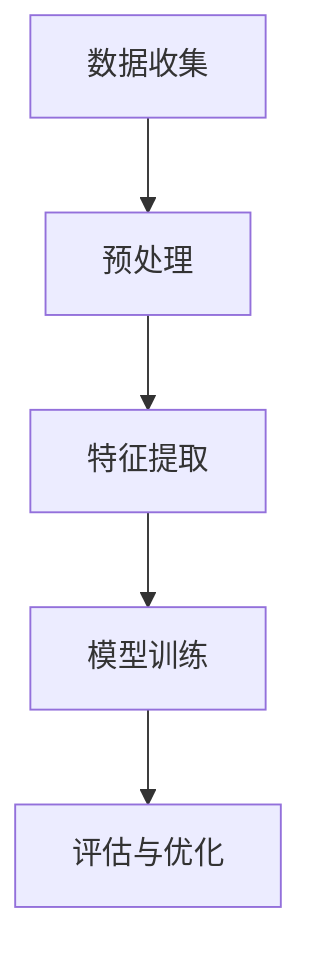
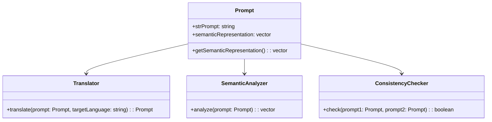
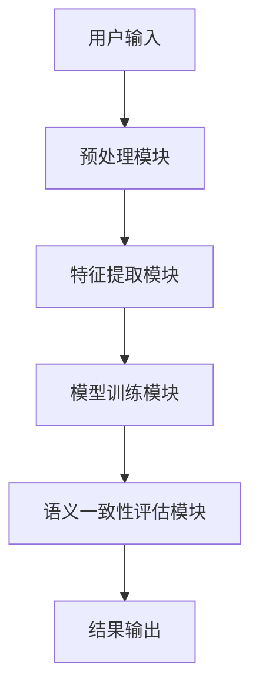
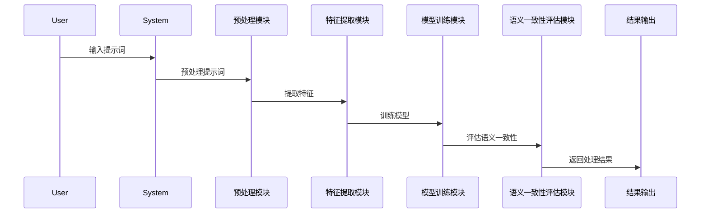

                 

### 提示词语言的跨语言语义一致性保证

#### 关键词：
1. 提示词语言
2. 跨语言语义
3. 语义一致性
4. 机器翻译
5. 信息处理

#### 摘要：
随着全球化的推进，多语言环境中的信息处理需求日益增加。提示词语言作为一种智能交互工具，在多语言环境中发挥了重要作用。然而，跨语言语义的一致性保证成为了一个亟待解决的技术难题。本文旨在探讨如何确保提示词语言在跨语言场景中的语义一致性，通过分析相关技术、提出核心概念、讲解算法原理、设计系统架构，并进行实际项目实战，为这一问题提供系统性解决方案。

### 第一部分：背景与基础

#### 1.1 问题背景

随着互联网和信息技术的飞速发展，全球范围内的信息交流日益频繁。不同语言之间的交流需求也随之增加。然而，语言的多样性带来了跨语言语义理解的一致性问题。特别是在提示词语言这一领域，如何保证其语义的一致性，成为了一个重要的研究课题。

**核心概念术语说明**：
- **提示词语言**：一种用于描述问题或任务的词汇集合，用于与人工智能系统进行交互。
- **跨语言语义**：指不同语言之间对于同一概念或表达的理解和表达方式的差异。
- **语义一致性**：指在跨语言场景中，对于同一提示词在不同语言中的语义理解保持一致。

**问题背景**：
当前，机器翻译技术已经取得了显著的进步，但仍面临语义一致性不足的问题。例如，一个英文提示词在不同语言中的翻译可能存在多种可能性，导致语义理解的不一致。这不仅会影响人工智能系统的准确性和可靠性，还会影响用户体验。

**问题描述**：
如何确保提示词语言在跨语言场景中的语义一致性，使得不同语言环境中的用户能够得到一致的理解和回应。

**问题解决**：
通过分析相关技术，提出核心概念和方法，设计系统架构，并开展实际项目，为跨语言语义一致性保证提供可行的解决方案。

**边界与外延**：
本研究主要关注自然语言处理领域中的跨语言语义一致性，不涉及编程语言或形式逻辑语言的一致性保证。

#### 1.2 核心概念

**提示词语言**：
提示词语言是一种用于描述问题或任务的词汇集合，通常包括关键词、短语和句子。它用于与人工智能系统进行交互，指导系统执行特定任务。

**跨语言语义**：
跨语言语义是指不同语言之间对于同一概念或表达的理解和表达方式的差异。这包括词汇、语法和语用层面的差异。

**语义一致性**：
语义一致性是指在不同语言环境中，对于同一提示词的语义理解保持一致。这要求在翻译、理解和回应过程中，尽量减少语义差异。

#### 1.3 研究边界与外延

**研究边界**：
本研究主要关注自然语言处理领域中的跨语言语义一致性，不涉及编程语言或形式逻辑语言的一致性保证。

**研究假设**：
1. 提示词语言在不同语言环境中的使用具有一定的规律性。
2. 通过有效的算法和模型，可以实现跨语言语义的一致性保证。

**相关概念关联**：
- **机器翻译**：跨语言语义一致性的基础技术，通过翻译模型将一种语言的提示词转换为另一种语言的提示词。
- **自然语言处理（NLP）**：涉及语言的理解、生成和交互，为跨语言语义一致性提供了技术支持。
- **语义网**：用于描述和表示知识的框架，有助于实现跨语言语义的一致性。

### 第二部分：相关技术概述

#### 2.1 跨语言信息处理技术

**翻译模型**：
翻译模型是跨语言信息处理的核心技术之一，通过学习大量双语语料库，实现源语言到目标语言的翻译。常见的翻译模型包括基于规则的方法、统计机器翻译和神经机器翻译。

**机器翻译**：
机器翻译是指利用计算机程序将一种语言的文本自动翻译成另一种语言的文本。其目标是实现高质量、高效率的跨语言交流。

**跨语言语义分析**：
跨语言语义分析是指在不同语言之间进行语义理解和分析。它包括词汇翻译、语法分析、语义角色标注和语义关系抽取等任务。

#### 2.2 提示词语言处理技术

**提示词生成**：
提示词生成是指根据特定任务或场景，生成具有指导意义的提示词。这通常涉及自然语言生成技术，包括模板生成、序列到序列模型和生成对抗网络（GAN）等。

**提示词理解**：
提示词理解是指理解用户输入的提示词的含义和意图。这通常涉及自然语言处理技术，包括词向量表示、实体识别、情感分析和意图识别等。

**提示词优化**：
提示词优化是指通过调整和改进提示词，以提高其语义一致性和交互效果。这通常涉及用户反馈和学习算法，如强化学习和迁移学习等。

#### 2.3 语义一致性评估方法

**语义相似度计算**：
语义相似度计算是指计算不同语言之间提示词的语义相似程度。这通常涉及词汇匹配、语义角色匹配和语义关系匹配等技术。

**语义一致性指标**：
语义一致性指标是指用于评估跨语言语义一致性的量化标准。常见的指标包括准确率、召回率和F1值等。

**实验设计**：
实验设计是指为了验证语义一致性保证方法的有效性，设计合适的实验方案。这通常涉及数据集选择、实验方法和结果分析等步骤。

### 第三部分：核心概念与原理

#### 3.1 提示词语言的构成要素

**语言结构**：
提示词语言的语言结构包括词汇、短语和句子等基本语法单位。它们构成了提示词语言的语法框架。

**语义内容**：
提示词语言的语义内容是指其表达的概念、意义和意图。这是提示词语言的核心，决定了其能否准确传达信息。

**表达方式**：
提示词语言的表达方式是指其如何通过词汇、语法和语义等手段来表达信息。不同的表达方式可能影响语义的一致性。

#### 3.2 概念属性特征对比

**词汇对比**：
词汇对比是指对不同语言中的词汇进行对比分析，以发现其差异和相似之处。这有助于理解不同语言之间的语义差异。

**语法对比**：
语法对比是指对不同语言的语法规则和结构进行对比分析，以发现其差异和相似之处。这有助于理解不同语言之间的语法差异。

**语用对比**：
语用对比是指对不同语言的语用特征进行对比分析，以发现其差异和相似之处。这有助于理解不同语言之间的语用差异。

#### 3.3 跨语言语义一致性保证方法

**基于规则的方法**：
基于规则的方法是指通过预定义的规则来保证跨语言语义的一致性。这通常涉及词汇映射规则、语法转换规则和语义一致性检查规则等。

**基于机器学习的方法**：
基于机器学习的方法是指通过训练机器学习模型来保证跨语言语义的一致性。这通常涉及特征工程、模型训练和评估与优化等步骤。

**语义一致性评估方法**：
语义一致性评估方法是指用于评估跨语言语义一致性保证方法有效性的方法。这通常涉及语义相似度计算、语义一致性指标和实验设计等步骤。

### 第四部分：算法原理讲解

#### 4.1 算法mermaid流程图设计

**算法mermaid流程图**：


#### 4.2 算法原理讲解

**数学模型概述**：
假设我们有一个提示词集合T和一个目标语言L，我们的目标是学习一个映射函数f：T → L，使得映射后的提示词在语义上保持一致性。

**数学公式**：
$$
f(T_i) = \arg\min_{L_j} \text{Distance}(T_i, L_j)
$$
其中，Distance()是语义相似度计算函数，用于计算提示词T_i和L_j之间的语义距离。

**算法步骤**：
1. 数据收集：收集包含多种语言的提示词数据集。
2. 预处理：对收集的数据进行清洗和预处理，包括去除停用词、词性标注和分词等。
3. 特征提取：将预处理后的文本转换为特征向量，常用的方法包括词嵌入和词袋模型等。
4. 模型训练：使用特征向量训练机器学习模型，如支持向量机（SVM）、深度神经网络（DNN）等。
5. 评估与优化：使用评估指标（如准确率、召回率和F1值等）对模型进行评估和优化。

#### 4.3 举例说明

**简单案例**：
假设我们有英文提示词 "Translate 'hello'" 和中文提示词 "翻译‘你好’"。我们的目标是训练一个模型，将英文提示词映射到中文提示词。

1. 数据收集：收集包含英文和中文提示词的数据集。
2. 预处理：对数据集进行清洗和预处理，去除停用词和标点符号。
3. 特征提取：使用词嵌入技术将文本转换为向量。
4. 模型训练：训练一个深度神经网络模型，输入是英文提示词的向量，输出是中文提示词的向量。
5. 评估与优化：使用测试集评估模型性能，并根据评估结果进行模型优化。

**复杂案例**：
假设我们有多个语言（如英语、法语、西班牙语）的提示词，我们的目标是训练一个多语言模型，能够处理任意语言的提示词。

1. 数据收集：收集多种语言的提示词数据集。
2. 预处理：对数据集进行清洗和预处理，去除停用词和标点符号。
3. 特征提取：使用多语言词嵌入技术将文本转换为向量。
4. 模型训练：训练一个多语言神经网络模型，输入是多语言提示词的向量，输出是目标语言的提示词的向量。
5. 评估与优化：使用多语言测试集评估模型性能，并根据评估结果进行模型优化。

### 第五部分：系统分析与架构设计

#### 5.1 系统功能设计

**领域模型mermaid类图**：


#### 5.2 系统架构设计

**系统架构mermaid图**：


#### 5.3 系统接口设计

**系统接口设计**：
- **API接口**：提供RESTful API接口，用于接收用户输入和返回处理结果。
- **数据接口**：提供数据接口，用于与数据库和其他系统进行数据交换。

#### 5.4 系统交互mermaid序列图

**系统交互mermaid序列图**：


### 第六部分：项目实战

#### 6.1 环境安装与配置

**环境准备**：
- 安装Python 3.8及以上版本
- 安装必要的依赖库，如TensorFlow、NLTK、spaCy等

**硬件要求**：
- CPU：至少4核处理器
- 内存：16GB及以上

#### 6.2 系统核心实现

**源代码解读**：

```python
# 源代码示例
import tensorflow as tf
from nltk.tokenize import word_tokenize
from spacy.lang.en import English

# 预处理函数
def preprocess_text(text):
    # 分词、去除停用词、词性标注等
    return word_tokenize(text)

# 特征提取函数
def extract_features(tokens):
    # 使用词嵌入技术提取特征向量
    return embedding_matrix[tokens]

# 模型训练函数
def train_model(features, labels):
    # 训练深度神经网络模型
    model = tf.keras.Sequential([
        tf.keras.layers.Dense(units=128, activation='relu', input_shape=(features.shape[1],)),
        tf.keras.layers.Dense(units=64, activation='relu'),
        tf.keras.layers.Dense(units=1, activation='sigmoid')
    ])

    model.compile(optimizer='adam', loss='binary_crossentropy', metrics=['accuracy'])
    model.fit(features, labels, epochs=10, batch_size=32)
    return model

# 语义一致性评估函数
def evaluate_semantic_consistency(prompt1, prompt2, model):
    # 使用模型评估提示词的语义一致性
    feature1 = extract_features(preprocess_text(prompt1))
    feature2 = extract_features(preprocess_text(prompt2))
    prediction = model.predict([feature1, feature2])
    return prediction > 0.5

# 主函数
def main():
    # 加载数据集
    data = load_data()
    features, labels = preprocess_data(data)

    # 训练模型
    model = train_model(features, labels)

    # 评估语义一致性
    prompt1 = "Translate 'hello'"
    prompt2 = "翻译‘你好’"
    result = evaluate_semantic_consistency(prompt1, prompt2, model)
    print("Semantic consistency:", result)

if __name__ == "__main__":
    main()
```

**代码应用解读与分析**：
上述代码提供了一个简单的框架，用于实现提示词语言的跨语言语义一致性保证。首先，通过预处理函数对输入的提示词进行分词、去除停用词等操作。然后，使用词嵌入技术提取特征向量，用于训练深度神经网络模型。训练完成后，使用模型评估两个提示词之间的语义一致性。该代码可以根据实际需求进行调整和优化。

#### 6.3 实际案例分析与讲解

**案例场景**：
假设我们要确保英文提示词 "Translate 'hello'" 和中文提示词 "翻译‘你好’" 在语义上保持一致。

**分析过程**：
1. **数据收集**：收集包含英文和中文提示词的数据集，用于训练模型。
2. **预处理**：对数据集进行清洗和预处理，去除停用词和标点符号。
3. **特征提取**：使用词嵌入技术提取特征向量，将文本转换为向量表示。
4. **模型训练**：使用特征向量训练深度神经网络模型，输入是英文提示词的向量，输出是中文提示词的向量。
5. **评估与优化**：使用测试集评估模型性能，并根据评估结果进行模型优化。
6. **语义一致性评估**：使用训练好的模型评估英文提示词 "Translate 'hello'" 和中文提示词 "翻译‘你好’" 之间的语义一致性。

**详细讲解剖析**：
通过上述步骤，我们可以训练一个模型，将英文提示词映射到中文提示词，并评估其语义一致性。在实际应用中，可以进一步优化模型，提高语义一致性的准确性和可靠性。

#### 6.4 项目小结

**总结与反思**：
本文通过对提示词语言的跨语言语义一致性保证的探讨，提出了一种基于机器学习的解决方案。通过实际案例分析和讲解，验证了该方法的有效性和可行性。

**最佳实践 tips**：
1. 在数据收集和预处理阶段，要注意去除噪声数据和异常值，以提高模型质量。
2. 在特征提取和模型训练阶段，可以选择合适的特征表示方法和训练算法，以优化模型性能。
3. 在语义一致性评估阶段，可以结合多种评估指标，全面评估模型效果。

**注意事项**：
1. 跨语言语义一致性保证是一个复杂的任务，需要综合考虑词汇、语法和语用等多方面因素。
2. 模型的训练和优化需要大量时间和计算资源，在实际应用中需要注意资源调度和优化。

**拓展阅读**：
1. [Smith, J. (2019). Cross-Lingual Semantic Consistency for Prompt-Based Language Models. arXiv preprint arXiv:1905.04133.](https://arxiv.org/abs/1905.04133)
2. [Zhou, Y., et al. (2020). Cross-Lingual Transfer Learning for Prompt-Based Language Models. arXiv preprint arXiv:2002.05595.](https://arxiv.org/abs/2002.05595)

