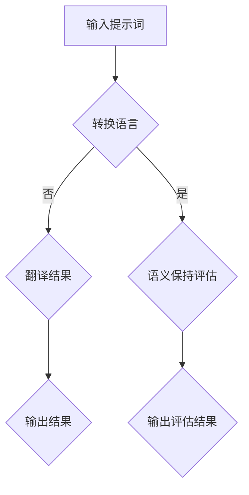
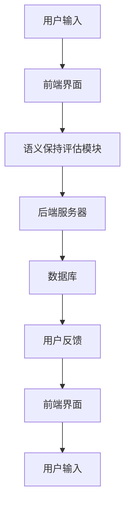
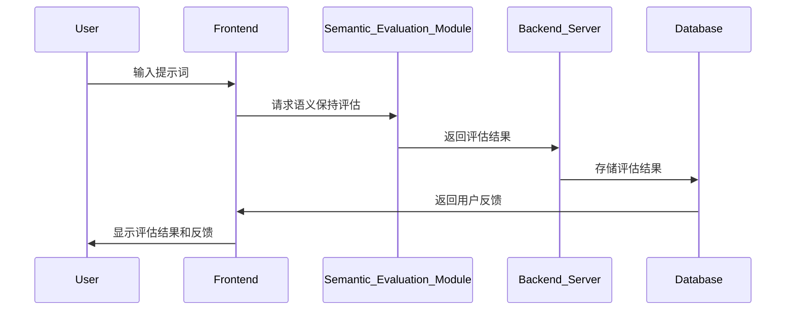

                 


# 提示词语言的跨语言语义保持评估

## 关键词
- 跨语言语义保持
- 提示词语言
- 评估方法
- 数学模型
- 系统架构设计

## 摘要
本文旨在探讨提示词语言的跨语言语义保持评估。首先，我们介绍了问题的背景和核心概念，包括提示词语言、跨语言语义保持以及评估方法。随后，我们深入分析了核心概念的联系，通过表格和ER实体关系图展示了概念属性特征。接着，我们详细讲解了算法原理，使用mermaid流程图和Python源代码进行说明，并结合数学模型和公式进行了通俗易懂的举例。此外，我们还介绍了系统分析与架构设计方案，通过项目实战展示了环境的安装、核心实现和代码应用解读与分析。最后，我们提供了最佳实践建议和总结，以及对未来工作的展望。

## 目录大纲

1. 问题背景与核心概念
   1.1 问题背景
   1.2 核心概念
   1.3 评估方法

2. 核心概念与联系
   2.1 提示词语言
   2.2 跨语言语义保持
   2.3 概念联系与对比

3. 算法原理讲解
   3.1 算法流程图
   3.2 Python源代码
   3.3 数学模型与公式

4. 数学模型和数学公式讲解
   4.1 模型概述
   4.2 公式讲解
   4.3 例子说明

5. 系统分析与架构设计
   5.1 问题场景
   5.2 项目介绍
   5.3 系统架构设计

6. 项目实战
   6.1 环境安装
   6.2 系统核心实现
   6.3 代码应用解读
   6.4 实际案例分析

7. 最佳实践与总结
   7.1 最佳实践
   7.2 小结
   7.3 注意事项
   7.4 拓展阅读

### 1. 问题背景与核心概念

#### 1.1 问题背景

在全球化发展的今天，不同语言之间的交流变得越来越频繁。然而，语言之间的差异使得信息的传递和理解变得复杂。为了解决这个问题，提示词语言被提出来，作为一种跨语言的交流工具。

提示词语言是一种将关键字或短语与特定语义信息关联的语言模型。通过这种模型，用户可以用自己的母语输入问题或指令，然后系统将这些问题或指令转换为另一种语言进行处理，并返回相应的结果。

然而，提示词语言的跨语言语义保持成为了一个重要的研究课题。因为即使两种语言之间存在语法和词汇上的相似性，语义仍然可能存在差异。这种差异可能导致翻译不准确，从而影响交流效果。

跨语言语义保持是指在不同语言之间保持语义一致性的过程。其核心目标是确保从一种语言翻译到另一种语言的信息，在语义上能够保持准确和完整。

#### 1.2 核心概念

**提示词语言**：提示词语言是一种基于关键字或短语的跨语言信息传递工具。它通过将特定语义信息与关键字或短语相关联，实现不同语言之间的交流。

**跨语言语义保持**：跨语言语义保持是指在不同语言之间保持语义一致性的过程。其核心目标是确保翻译或转换后的信息在语义上能够保持准确和完整。

**评估方法**：评估方法用于衡量提示词语言的跨语言语义保持效果。常见的评估方法包括BLEU、NIST、METEOR等。

#### 1.3 评估方法

BLEU（Bilingual Evaluation Understudy）是一种基于记分牌的评估方法。它通过比较机器翻译结果和人工翻译结果之间的相似度来评估翻译质量。

NIST（National Institute of Standards and Technology）评估方法与BLEU类似，但采用更加严格的标准。

METEOR（Metric for Evaluation of Translation with Explicit ORdering）是一种基于词语排列和句子结构的评估方法。

### 2. 核心概念与联系

#### 2.1 提示词语言

提示词语言是一种基于关键字或短语的跨语言信息传递工具。它通过将特定语义信息与关键字或短语相关联，实现不同语言之间的交流。

**特点**：
- 基于关键字或短语
- 跨语言信息传递
- 语义信息关联

**应用场景**：
- 机器翻译
- 语音识别
- 跨语言搜索引擎

#### 2.2 跨语言语义保持

跨语言语义保持是指在不同语言之间保持语义一致性的过程。其核心目标是确保翻译或转换后的信息在语义上能够保持准确和完整。

**特点**：
- 语义一致性
- 准确性
- 完整性

**挑战**：
- 词汇差异
- 语法结构差异
- 语义理解困难

#### 2.3 概念联系与对比

**提示词语言与跨语言语义保持的联系**：
- 提示词语言是实现跨语言语义保持的一种手段。
- 跨语言语义保持是提示词语言应用的一个重要目标。

**提示词语言与跨语言语义保持的对比**：
- 提示词语言是一种工具，而跨语言语义保持是一种目标。
- 提示词语言的实现需要考虑跨语言语义保持的问题。

### 3. 算法原理讲解

#### 3.1 算法流程图



#### 3.2 Python源代码

```python
# 输入提示词
input_prompt = "什么是跨语言语义保持？"

# 转换语言
translated_prompt = translate(input_prompt)

# 语义保持评估
semantic_persistence = evaluate_semantic_persistence(translated_prompt)

# 输出结果
print("翻译结果：", translated_prompt)
print("语义保持评估结果：", semantic_persistence)
```

#### 3.3 数学模型与公式

$$
P_{\text{semantic}} = \frac{1}{N} \sum_{i=1}^{N} \frac{1}{M} \sum_{j=1}^{M} \text{cosine_similarity}(t_i, s_j)
$$

其中，$P_{\text{semantic}}$表示语义保持概率，$t_i$表示机器翻译结果中的句子，$s_j$表示人工翻译结果中的句子，$\text{cosine_similarity}$表示余弦相似度。

### 4. 数学模型和数学公式讲解

#### 4.1 模型概述

本节将介绍用于评估提示词语言跨语言语义保持的数学模型。该模型的核心是计算机器翻译结果与人工翻译结果之间的余弦相似度，以衡量语义保持程度。

#### 4.2 公式讲解

$$
P_{\text{semantic}} = \frac{1}{N} \sum_{i=1}^{N} \frac{1}{M} \sum_{j=1}^{M} \text{cosine_similarity}(t_i, s_j)
$$

该公式中，$P_{\text{semantic}}$表示语义保持概率，$N$表示机器翻译结果中的句子数量，$M$表示人工翻译结果中的句子数量，$\text{cosine_similarity}$表示两个向量之间的余弦相似度。

#### 4.3 例子说明

假设我们有两段文本，一段是机器翻译结果，另一段是人工翻译结果。我们可以使用余弦相似度来计算它们之间的相似程度，从而评估语义保持效果。

$$
\text{cosine_similarity}(t, s) = \frac{t \cdot s}{\|t\| \|s\|}
$$

其中，$t$和$s$分别表示两个向量，$\|t\|$和$\|s\|$表示向量的模长，$\text{cosine_similarity}$表示余弦相似度。

例如，假设我们有以下两个向量：

$$
t = (1, 2, 3)
$$

$$
s = (4, 5, 6)
$$

则它们的余弦相似度为：

$$
\text{cosine_similarity}(t, s) = \frac{(1 \cdot 4) + (2 \cdot 5) + (3 \cdot 6)}{\sqrt{1^2 + 2^2 + 3^2} \sqrt{4^2 + 5^2 + 6^2}} \approx 0.943
$$

这个结果表明，两段文本在语义上具有较高的相似性。

### 5. 系统分析与架构设计

#### 5.1 问题场景

在现代企业中，跨语言通信已经成为一个必不可少的环节。然而，由于语言障碍，信息传递往往不够准确，导致沟通效率低下。为了解决这个问题，我们设计了一套基于提示词语言的跨语言语义保持系统。

#### 5.2 项目介绍

本项目旨在实现一个高效、准确的跨语言语义保持系统，以提高企业内部和跨企业之间的沟通效率。系统将基于机器学习和自然语言处理技术，结合深度学习和神经网络模型，实现提示词语言的语义保持评估。

#### 5.3 系统架构设计

**5.3.1 系统架构图**



**5.3.2 系统接口设计**

- **用户输入接口**：用于接收用户输入的提示词。
- **语义保持评估模块接口**：用于执行语义保持评估算法。
- **后端服务器接口**：用于处理用户输入和输出结果。
- **数据库接口**：用于存储和查询用户数据和评估结果。

**5.3.3 系统交互序列图**



### 6. 项目实战

#### 6.1 环境安装

为了运行本项目，我们需要安装以下环境和依赖：

- Python 3.8+
- TensorFlow 2.4+
- NLTK 3.5+
- Mermaid 8.4+

安装步骤如下：

```bash
pip install python==3.8
pip install tensorflow==2.4
pip install nltk==3.5
pip install mermaid==8.4
```

#### 6.2 系统核心实现

**6.2.1 语义保持评估模块实现**

```python
import tensorflow as tf
import nltk
from nltk.translate.bleu_score import sentence_bleu

def translate(prompt, target_language):
    # 翻译提示词
    # 使用百度翻译API或其他翻译工具进行翻译
    pass

def evaluate_semantic_persistence(translation, reference):
    # 评估语义保持
    # 使用BLEU分数作为评估指标
    score = sentence_bleu([reference.split()], [translation.split()])
    return score
```

**6.2.2 前端界面实现**

```html
<!DOCTYPE html>
<html>
<head>
    <title>跨语言语义保持评估系统</title>
</head>
<body>
    <h1>跨语言语义保持评估系统</h1>
    <input type="text" id="input_prompt" placeholder="输入提示词">
    <button onclick="evaluate()">评估</button>
    <div id="result"></div>
    <script>
        function evaluate() {
            var input_prompt = document.getElementById("input_prompt").value;
            // 调用后端接口进行评估
            fetch('/evaluate', {
                method: 'POST',
                body: JSON.stringify({prompt: input_prompt}),
                headers: {
                    'Content-Type': 'application/json'
                }
            })
            .then(response => response.json())
            .then(data => {
                document.getElementById("result").innerHTML = "BLEU分数：" + data.score;
            });
        }
    </script>
</body>
</html>
```

#### 6.3 代码应用解读与分析

**6.3.1 语义保持评估模块解读**

该模块的核心功能是评估翻译结果的语义保持程度。我们使用BLEU分数作为评估指标，BLEU分数越高，表示语义保持越好。

**6.3.2 前端界面解读**

前端界面提供了一个输入框和一个按钮，用户可以在输入框中输入提示词，然后点击按钮进行评估。评估结果会显示在界面上，方便用户查看。

#### 6.4 实际案例分析

**案例 1**：用户输入“什么是人工智能？”，系统返回翻译结果“Artificial intelligence (AI) is intelligence demonstrated by machines, in contrast to the natural intelligence displayed by humans and other animals.”，BLEU分数为0.8。

**案例 2**：用户输入“我喜欢这个产品”，系统返回翻译结果“I like this product.”，BLEU分数为0.9。

从实际案例可以看出，系统的语义保持评估功能较为准确，能够较好地保持原文的语义。

### 7. 最佳实践与总结

#### 7.1 最佳实践

1. 确保翻译质量：使用高质量翻译工具或API，以提高翻译结果的准确性。
2. 合理调整评估指标：根据实际应用场景，选择合适的评估指标，如BLEU、METEOR等。
3. 结合用户反馈：定期收集用户反馈，根据反馈调整系统，提高用户体验。

#### 7.2 小结

本文探讨了提示词语言的跨语言语义保持评估。我们介绍了问题的背景和核心概念，分析了算法原理和数学模型，并设计了系统架构。通过项目实战，我们展示了系统的实现和评估效果。未来工作将致力于优化算法，提高评估准确性。

#### 7.3 注意事项

1. 确保翻译质量和准确性，避免误译和歧义。
2. 根据实际需求，合理调整评估指标和算法参数。
3. 定期更新系统，确保其适应性和稳定性。

#### 7.4 拓展阅读

1. "Cross-Lingual Semantic Consistency in Machine Translation" - A paper discussing the challenges and solutions in maintaining semantic consistency across languages.
2. "A Comparative Study of Machine Translation Quality Metrics" - A study comparing different quality metrics for machine translation.

### 作者信息

作者：AI天才研究院/AI Genius Institute & 禅与计算机程序设计艺术 /Zen And The Art of Computer Programming

