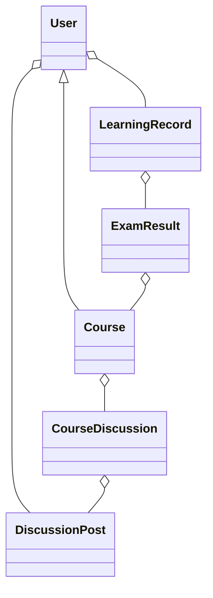
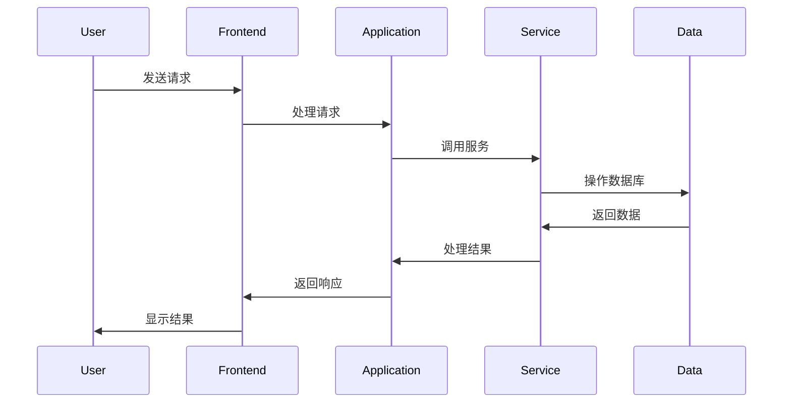
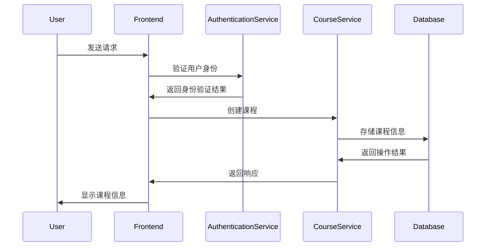

                 

### 提示词语言的运行时异常处理与恢复

> 关键词：提示词语言，运行时异常处理，恢复算法，数学模型，系统架构

> 摘要：本文详细探讨了提示词语言在运行时异常处理与恢复中的应用。首先介绍了异常处理的重要性及当前面临的挑战，随后阐述了提示词语言的基本概念和特点。接着，我们深入分析了异常处理与提示词语言之间的联系，讲解了异常检测和恢复算法的原理及数学模型。最后，通过系统架构设计和项目实战，展示了如何在实际场景中应用这些理论。本文旨在为读者提供一个全面、系统的理解，帮助他们更好地应对运行时异常处理与恢复的挑战。

## 第1章：背景介绍与问题定义

### 1.1 软件异常处理的重要性

软件异常处理是软件工程中的一个核心概念，对于确保软件系统的稳定性和可靠性至关重要。异常处理的基本目的是识别并应对那些不符合预期运行条件的情况，从而避免系统崩溃或数据损坏。在软件开发过程中，异常处理机制能够提高软件的鲁棒性，使系统能够在遇到异常事件时迅速响应并恢复，从而提升用户体验。

异常处理的必要性体现在以下几个方面：

1. **提高系统稳定性**：异常处理能够帮助系统在遇到错误时快速定位并解决问题，防止错误蔓延，确保系统的稳定运行。
2. **保障数据安全**：在异常情况下，异常处理能够确保数据的一致性和完整性，防止数据丢失或损坏。
3. **优化用户体验**：良好的异常处理机制可以使系统在遇到异常时提供友好的提示信息，帮助用户理解和解决问题，从而提升用户体验。
4. **增强系统可维护性**：通过统一的异常处理机制，可以使系统的维护工作更加规范和高效，降低维护成本。

### 1.2 运行时异常处理的现状与挑战

尽管异常处理在软件工程中至关重要，但当前的运行时异常处理仍面临许多挑战。以下是一些主要问题：

1. **复杂性**：现代软件系统结构复杂，异常处理机制需要处理各种各样的异常情况，这增加了系统的复杂性。
2. **响应速度**：在异常发生时，系统需要快速响应并采取相应的处理措施，以确保系统的稳定运行。然而，复杂的异常处理逻辑可能会导致响应速度慢，影响用户体验。
3. **准确性**：异常处理的准确性是另一个重要问题。错误的异常处理可能会导致系统未能正确识别和解决真正的异常情况，甚至可能引入新的错误。
4. **可扩展性**：随着系统规模的扩大，异常处理机制需要具备良好的可扩展性，以便能够适应新的异常情况。

### 1.3 提示词语言的概念与特点

提示词语言（Prompt Language）是一种特定类型的编程语言，其设计理念是将提示词（Prompt）作为核心元素，用于引导用户进行交互和完成任务。提示词语言的基本概念和特点如下：

1. **提示词的概念与作用**：提示词是用户与系统交互的桥梁，通过提示词，用户可以告诉系统需要执行什么任务。提示词语言将提示词作为编程语言的核心，使编程过程更加直观和易于理解。
2. **提示词的分类**：根据提示词的功能和用途，可以将提示词分为命令型提示词、问题型提示词、引导型提示词等。
3. **提示词语言的设计原则**：提示词语言的设计原则包括简洁性、易用性、可扩展性和灵活性。简洁性要求语言结构简单明了，易用性要求用户能够轻松理解和使用，可扩展性要求语言能够方便地添加新功能和扩展，灵活性要求语言能够适应不同的应用场景。

### 1.4 运行时异常处理的边界与外延

运行时异常处理涉及多个层面，包括系统架构、编程语言、异常类型和处理机制等。其边界与外延主要包括以下几个方面：

1. **系统架构**：运行时异常处理通常在应用程序的运行时进行，与系统架构紧密相关。系统架构需要提供适当的异常处理机制，以支持应用程序的稳定运行。
2. **编程语言**：不同的编程语言提供了不同的异常处理机制。例如，Java语言提供了异常捕获和处理的机制，而Python语言则通过内置的异常类进行异常处理。
3. **异常类型**：异常处理需要识别和分类各种异常情况。常见的异常类型包括运行时异常（如空指针异常、数组越界异常）、输入输出异常、资源占用异常等。
4. **处理机制**：异常处理机制包括异常捕获、异常传递、异常处理策略等。有效的异常处理机制能够帮助系统在遇到异常时快速定位并解决问题。

通过以上分析，我们可以看到，运行时异常处理与恢复是一个复杂且关键的过程。在接下来的章节中，我们将进一步探讨提示词语言在异常处理中的应用，以及相关的算法原理和数学模型。

## 第2章：核心概念与联系

### 2.1 异常处理的基本原理

异常处理是软件工程中的一个重要组成部分，它确保了软件系统能够在遇到意外情况时保持稳定运行。要理解异常处理的基本原理，首先需要了解什么是异常以及异常的类型。

#### 2.1.1 异常类型与分类

异常（Exception）是指程序在运行过程中遇到的不期望的情况或错误。根据异常的性质和发生原因，可以将异常分为以下几类：

1. **运行时异常**：这类异常在程序运行时发生，通常是由于程序逻辑错误导致的。例如，空指针异常（NullPointerException）、数组越界异常（ArrayIndexOutOfBoundsException）等。
2. **输入输出异常**：这类异常与程序的输入输出操作相关，例如文件读写异常（IOException）、网络连接异常（ConnectException）等。
3. **资源占用异常**：这类异常涉及程序对系统资源的占用和管理，例如线程资源占用异常（ThreadDeath）等。
4. **系统异常**：这类异常是由操作系统或其他系统资源引起的，例如内存溢出异常（OutOfMemoryError）、虚拟机错误（VMDAE）等。

#### 2.1.2 异常处理机制

异常处理机制是软件系统用于识别、处理和恢复异常情况的一套规则和策略。常见的异常处理机制包括以下几部分：

1. **异常捕获**：异常捕获是异常处理的第一步，通过try-catch块来捕获异常。try块包含可能抛出异常的代码，catch块用于处理捕获的异常。
2. **异常传递**：当异常在一个方法中发生但无法处理时，异常会向上传递到调用方法中，直到被捕获和处理。
3. **异常处理策略**：异常处理策略包括如何处理不同类型的异常。常见的策略有忽略异常、记录日志、恢复操作等。

#### 2.1.3 异常处理流程

异常处理流程可以概括为以下几个步骤：

1. **异常抛出**：当程序遇到异常情况时，异常会被抛出。
2. **异常捕获**：异常传递到调用方法后，如果该方法有相应的catch块，异常会被捕获并处理。
3. **异常处理**：在catch块中，程序可以根据异常类型执行相应的处理逻辑，例如打印错误信息、恢复操作等。
4. **异常传递**：如果异常未被捕获或处理，会继续向上传递，直到被系统默认处理或程序终止。

### 2.2 提示词语言的核心概念

提示词语言是一种以提示词为核心元素的编程语言，其设计理念是将用户与系统的交互过程抽象为一系列的提示词，从而简化编程过程，提高开发效率。以下是提示词语言的一些核心概念：

#### 2.2.1 提示词的概念与作用

提示词是用户与系统进行交互的关键元素，它通常是一个指令或问题，用于指示系统执行特定操作或提供所需信息。提示词的作用包括：

1. **简化用户操作**：通过提示词，用户可以以简洁的方式表达复杂的操作意图，从而简化用户操作过程。
2. **提高开发效率**：提示词语言提供了丰富的内置功能和语法，使开发者能够快速构建和部署应用程序。
3. **增强用户体验**：提示词语言通过提供直观、友好的交互界面，可以显著提升用户的操作体验。

#### 2.2.2 提示词的分类

根据提示词的功能和用途，可以将提示词分为以下几类：

1. **命令型提示词**：这类提示词用于执行具体的操作或任务，例如“新建文件”、“保存文档”等。
2. **问题型提示词**：这类提示词用于询问用户信息或获取输入，例如“您的姓名是什么？”、“请输入密码”等。
3. **引导型提示词**：这类提示词用于引导用户进行交互，例如“下一步”、“上一步”等。

#### 2.2.3 提示词语言的设计原则

提示词语言的设计原则主要包括以下几个方面：

1. **简洁性**：提示词语言应具有简洁明了的语法和结构，使开发者能够快速理解和掌握。
2. **易用性**：提示词语言应易于使用，提供丰富的内置功能和语法，以降低开发难度。
3. **可扩展性**：提示词语言应具备良好的可扩展性，允许开发者自定义新的提示词和功能。
4. **灵活性**：提示词语言应能够适应不同的应用场景，支持多样化的交互方式。

### 2.3 异常处理与提示词语言的联系

异常处理与提示词语言之间存在紧密的联系，主要体现在以下几个方面：

#### 2.3.1 提示词在异常处理中的应用

提示词语言在异常处理中的应用主要体现在以下几个方面：

1. **错误提示**：当程序遇到异常时，提示词语言可以通过提示词向用户展示错误信息，帮助用户理解问题所在。
2. **恢复操作**：通过提示词，用户可以指示系统执行恢复操作，例如重新加载数据、重新执行任务等。
3. **日志记录**：提示词语言可以利用提示词记录程序运行过程中的错误和异常信息，便于后续分析和处理。

#### 2.3.2 异常处理在提示词语言中的实现

在提示词语言中实现异常处理通常需要以下几个步骤：

1. **定义异常类型**：根据提示词语言的特定需求，定义各种异常类型和相应的处理逻辑。
2. **捕获和处理异常**：在提示词代码中，使用try-catch块捕获异常，并在catch块中执行相应的处理逻辑。
3. **提供友好的错误信息**：通过提示词向用户展示详细的错误信息，帮助用户快速定位和解决问题。
4. **恢复操作**：当异常无法立即解决时，提示词语言可以提供恢复操作选项，指导用户如何继续操作。

#### 2.3.3 提示词语言对异常处理的优化

提示词语言可以通过以下方式对异常处理进行优化：

1. **内置异常处理函数**：提示词语言可以提供内置的异常处理函数，简化异常处理代码。
2. **多级异常处理**：通过多级异常处理，可以更灵活地应对不同类型的异常。
3. **自动化异常处理**：通过自动化工具，可以自动识别和修复某些类型的异常，减轻开发者的负担。

通过以上分析，我们可以看到，异常处理与提示词语言之间具有密切的联系。在接下来的章节中，我们将进一步探讨异常检测和恢复算法的原理，以及如何在实际应用中实现这些算法。

### 第3章：算法原理讲解

在处理运行时异常时，算法原理的讲解至关重要。这一章节将详细阐述异常检测算法和异常恢复算法的原理，包括统计方法、机器学习模型以及它们在提示词语言中的应用。

#### 3.1 异常检测算法

异常检测是运行时异常处理的重要环节，它的目标是识别出那些不符合预期或异常的行为。常见的异常检测算法可以分为基于统计方法和基于机器学习的方法。

##### 3.1.1 基于统计的异常检测

基于统计的异常检测方法主要通过计算数据的统计特征来判断数据的正常性。以下介绍两种常用的统计方法：

###### 3.1.1.1 K-均值聚类算法

K-均值聚类算法是一种无监督学习方法，通过将数据点分配到不同的簇中来识别正常行为。具体步骤如下：

1. **初始化**：随机选择K个中心点。
2. **分配**：将每个数据点分配到最近的中心点。
3. **更新**：重新计算每个簇的中心点。
4. **迭代**：重复步骤2和3，直到收敛。

通过这种方式，K-均值聚类算法可以将正常数据点聚类在一起，而异常数据点会被划分到不同的簇中。

###### 3.1.1.2 卡方检验算法

卡方检验算法是一种假设检验方法，用于判断变量之间的独立性。具体步骤如下：

1. **构建假设**：设定零假设（H0）和备择假设（H1）。
2. **计算期望值**：根据零假设计算每个单元格的期望值。
3. **计算卡方值**：计算实际观测值与期望值之间的差异，并求和。
4. **比较阈值**：将计算得到的卡方值与阈值进行比较，如果大于阈值，则拒绝零假设。

卡方检验算法可以帮助识别出与正常行为显著不同的数据点，从而实现异常检测。

##### 3.1.2 基于机器学习的异常检测

基于机器学习的异常检测方法通过训练模型来识别正常行为和异常行为。以下介绍两种常用的机器学习方法：

###### 3.1.2.1 Isolation Forest算法

Isolation Forest算法是一种基于随机森林的异常检测方法。其核心思想是通过随机分割数据来创建一棵隔离树，从而隔离正常数据点。具体步骤如下：

1. **随机选择特征**：从特征空间中选择一个随机特征。
2. **随机选择切分点**：在选定特征上随机选择一个切分点。
3. **分割数据**：根据切分点将数据点分割成两个子集。
4. **计算路径长度**：计算每个数据点到树的根节点的路径长度。
5. **异常评分**：路径长度越长的数据点，越可能是异常点。

Isolation Forest算法具有计算效率高、鲁棒性强等优点，适用于大规模数据的异常检测。

###### 3.1.2.2 Local Outlier Factor算法

Local Outlier Factor（LOF）算法是一种基于密度的异常检测方法。它通过计算每个数据点相对于其邻域的异常度来识别异常点。具体步骤如下：

1. **计算邻域**：为每个数据点找到其邻域，通常使用距离度量方法。
2. **计算局部密度**：计算每个数据点的局部密度，密度越低的数据点，越可能是异常点。
3. **计算LOF值**：计算每个数据点的LOF值，LOF值越高的数据点，越可能是异常点。

LOF算法可以有效地识别局部异常点，但在处理高维数据时可能会面临计算复杂度的问题。

#### 3.2 异常恢复算法

异常恢复是在检测到异常后，系统采取的一系列措施来恢复到正常状态或减轻异常影响。异常恢复算法可以分为基于规则的方法、基于模型的方法和基于机器学习的方法。

##### 3.2.1 基于规则的恢复策略

基于规则的恢复策略通过预定义的规则来指导系统的恢复操作。这些规则通常是基于系统领域知识和经验制定的。具体步骤如下：

1. **定义规则**：根据异常类型和系统需求，定义相应的恢复规则。
2. **触发规则**：当系统检测到异常时，触发相应的恢复规则。
3. **执行恢复操作**：按照规则执行恢复操作，例如重试操作、重置状态等。

基于规则的恢复策略具有简单、直接、易于实现等优点，但可能难以应对复杂的异常情况。

##### 3.2.2 基于模型的恢复策略

基于模型的恢复策略使用机器学习模型来预测异常的恢复操作。这些模型通常通过历史数据训练得到。具体步骤如下：

1. **数据收集**：收集系统运行过程中的历史异常数据。
2. **模型训练**：使用收集到的数据训练恢复模型。
3. **异常检测**：在运行时，使用训练好的模型检测异常。
4. **恢复操作**：根据模型预测的结果，执行相应的恢复操作。

基于模型的恢复策略能够提供更智能的恢复方案，但需要大量训练数据和计算资源。

##### 3.2.3 基于机器学习的恢复策略

基于机器学习的恢复策略通过机器学习模型来识别异常并自动生成恢复操作。这些模型通常结合了异常检测和恢复操作的预测。具体步骤如下：

1. **数据收集**：收集系统运行过程中的异常数据和恢复操作。
2. **模型训练**：使用收集到的数据训练恢复模型。
3. **异常检测**：在运行时，使用训练好的模型检测异常。
4. **恢复操作生成**：根据异常检测的结果，生成恢复操作。
5. **执行恢复操作**：执行生成的恢复操作。

基于机器学习的恢复策略能够提供自动化的、个性化的恢复方案，但需要较高的计算资源和模型调优。

通过以上算法原理的讲解，我们可以看到，异常检测和恢复算法在运行时异常处理中扮演着关键角色。在接下来的章节中，我们将进一步探讨异常检测和恢复算法的数学模型，以便更好地理解和应用这些算法。

### 第4章：数学模型和公式讲解

在异常检测和恢复算法中，数学模型和公式是理解算法原理和进行精确计算的基础。本章节将详细讲解异常检测的数学模型和异常恢复的数学模型，包括距离度量方法、阈值设定方法以及恢复函数的定义和优化方法。

#### 4.1 异常检测的数学模型

异常检测的数学模型主要包括距离度量方法和阈值设定方法。这些方法用于计算数据点与正常行为之间的差异，并确定数据点的异常程度。

##### 4.1.1 距离度量方法

距离度量方法是衡量数据点之间差异的重要工具。以下介绍两种常用的距离度量方法：欧几里得距离和曼哈顿距离。

###### 4.1.1.1 欧几里得距离

欧几里得距离是最常用的距离度量方法，用于计算两点之间的直线距离。其公式如下：

$$
d(x, y) = \sqrt{\sum_{i=1}^{n}(x_i - y_i)^2}
$$

其中，$x$和$y$是两个数据点，$n$是特征的维度，$x_i$和$y_i$是第$i$个特征上的值。

###### 4.1.1.2 曼哈顿距离

曼哈顿距离是一种用于计算两点之间路径距离的度量方法，其公式如下：

$$
d(x, y) = \sum_{i=1}^{n} |x_i - y_i|
$$

与欧几里得距离不同，曼哈顿距离不考虑特征间的相关性，而是计算所有特征上的绝对差异。

##### 4.1.2 异常检测的阈值设定方法

阈值设定方法用于确定数据点的异常程度，常见的阈值设定方法包括基于标准差的阈值设定和基于信息论的阈值设定。

###### 4.1.2.1 基于标准差的阈值设定

基于标准差的阈值设定方法使用标准差来计算阈值，其公式如下：

$$
\text{阈值} = \text{平均值} \pm k \times \text{标准差}
$$

其中，$\text{平均值}$和$\text{标准差}$是数据集的特征平均值和标准差，$k$是一个常数，通常取值在2到3之间。

这种方法简单直观，但在数据分布不均匀或存在噪声时效果较差。

###### 4.1.2.2 基于信息论的阈值设定

基于信息论的阈值设定方法通过计算数据点的信息熵来确定阈值。信息熵是衡量数据不确定性的指标，其公式如下：

$$
H(X) = -\sum_{i=1}^{n} p(x_i) \log_2 p(x_i)
$$

其中，$X$是数据集，$p(x_i)$是第$i$个数据点出现的概率。

通过计算数据集的信息熵，可以找到最小信息熵点，将其作为阈值，将数据集划分为正常和异常两部分。

#### 4.2 异常恢复的数学模型

异常恢复的数学模型包括恢复函数的定义、恢复策略的优化方法和恢复效果的评估指标。

##### 4.2.1 恢复函数的定义与属性

恢复函数是用于描述异常恢复过程的数学函数，其定义如下：

$$
f(\text{异常}, \text{恢复策略}) = \text{恢复结果}
$$

其中，$\text{异常}$表示检测到的异常情况，$\text{恢复策略}$表示采取的恢复措施，$\text{恢复结果}$表示恢复后的状态。

恢复函数的属性包括：

1. **单调性**：恢复函数在异常程度增加时，恢复结果也应相应增加，以确保异常得到有效解决。
2. **稳定性**：恢复函数在不同异常情况下的输出应保持一致，避免出现不必要的波动。
3. **适应性**：恢复函数应能够适应不同的异常情况，提供灵活的恢复方案。

##### 4.2.2 恢复策略的优化方法

恢复策略的优化方法用于提高恢复效率和效果。以下介绍几种常用的优化方法：

1. **遗传算法**：遗传算法是一种基于自然进化的优化方法，通过模拟生物进化过程来优化恢复策略。其步骤如下：
   - **初始化**：生成一组初始恢复策略。
   - **评估**：计算每个策略的恢复效果，选择表现良好的策略。
   - **交叉**：随机选择两个策略进行交叉，生成新的策略。
   - **变异**：对策略进行随机变异，增加多样性。
   - **迭代**：重复评估、交叉和变异，直到找到最优策略。

2. **粒子群优化**：粒子群优化是一种基于群体智能的优化方法，通过模拟鸟群觅食过程来优化恢复策略。其步骤如下：
   - **初始化**：生成一组初始恢复策略。
   - **评估**：计算每个策略的恢复效果。
   - **更新**：根据个体和群体的最优恢复策略更新当前策略。
   - **迭代**：重复评估和更新，直到找到最优策略。

##### 4.2.3 恢复效果的评估指标

恢复效果的评估指标用于衡量恢复策略的有效性。以下介绍几种常用的评估指标：

1. **恢复成功率**：恢复成功率是衡量恢复策略成功恢复异常的比率，其公式如下：

$$
\text{恢复成功率} = \frac{\text{成功恢复的异常数}}{\text{总异常数}}
$$

2. **恢复时间**：恢复时间是衡量恢复策略执行时间的指标，其公式如下：

$$
\text{恢复时间} = \frac{\text{恢复策略执行的总时间}}{\text{总异常数}}
$$

3. **恢复成本**：恢复成本是衡量恢复策略执行所需资源的指标，包括计算资源、存储资源等。

通过以上数学模型和公式讲解，我们可以更好地理解异常检测和恢复算法的原理，并在实际应用中进行精确计算和优化。在下一章节中，我们将通过系统分析与架构设计方案，进一步探讨如何在实际场景中实现这些算法。

### 第5章：系统分析与架构设计方案

为了实现提示词语言的运行时异常处理与恢复，我们需要一个全面的系统分析与架构设计方案。这一章节将详细描述问题场景、系统功能设计、系统架构设计、系统接口设计和系统交互设计。

#### 5.1 问题场景介绍

在现代软件系统中，用户交互和数据处理的复杂性不断增加，这使得运行时异常处理与恢复变得尤为重要。以下是一个常见的问题场景：

- **场景描述**：一个在线教育平台，用户可以浏览课程、报名学习、参与讨论等。由于系统的高并发和复杂业务逻辑，运行时异常处理与恢复的需求变得尤为迫切。
- **目标**：设计一个高效的异常处理与恢复系统，确保用户在遇到异常情况时能够得到及时的帮助，同时减少系统故障对用户体验的影响。

#### 5.2 系统功能设计

系统功能设计是系统架构设计的基础，它定义了系统的核心功能模块。以下是一个简化的系统功能设计：

1. **用户认证模块**：负责用户登录、注册和权限验证。
2. **课程管理模块**：负责课程信息的管理，包括课程创建、更新和删除。
3. **学习记录模块**：负责用户的学习记录管理，包括课程进度、考试成绩等。
4. **讨论区管理模块**：负责讨论区的创建、更新和管理，包括帖子发布、回复等。
5. **异常处理模块**：负责运行时异常的检测、捕获和处理。
6. **恢复策略模块**：负责实现异常恢复策略，包括重试、重置等。

#### 5.2.1 领域模型类图

为了更好地理解系统功能设计，我们使用Mermaid类图来展示领域模型。以下是类图的示例：



在这个类图中，我们定义了用户、课程、学习记录、讨论区和考试结果等核心实体，并展示了它们之间的关系。

#### 5.3 系统架构设计

系统架构设计是系统实现的关键，它定义了系统的整体结构和组件之间的交互关系。以下是一个简化的系统架构设计：

1. **前端层**：负责用户界面的展示和用户交互，使用现代Web技术栈，如React或Vue。
2. **应用层**：负责业务逻辑的实现，包括用户认证、课程管理、学习记录管理、讨论区管理和异常处理等。
3. **服务层**：负责系统的核心功能，如用户认证服务、课程管理服务、学习记录服务、讨论区服务和异常处理服务。
4. **数据层**：负责数据的存储和管理，使用关系型数据库，如MySQL或PostgreSQL。

以下是系统架构图的示例：



在这个系统架构图中，我们展示了前端层、应用层、服务层和数据层之间的交互关系。

#### 5.4 系统接口设计

系统接口设计定义了系统内部和外部组件之间的接口，确保各组件能够高效地通信和协作。以下是系统接口设计的示例：

1. **用户认证接口**：用于处理用户登录、注册和权限验证等操作。
2. **课程管理接口**：用于处理课程信息的创建、更新和删除等操作。
3. **学习记录接口**：用于处理用户学习记录的管理，如课程进度和考试成绩等。
4. **讨论区管理接口**：用于处理讨论区的创建、更新和管理，包括帖子发布和回复等。
5. **异常处理接口**：用于检测、捕获和处理运行时异常。

#### 5.5 系统交互设计

系统交互设计描述了系统内部组件之间的交互流程，以确保系统的高效运行。以下是系统交互序列图的示例：



在这个交互序列图中，我们展示了用户请求创建课程，前端层通过认证服务验证用户身份，然后调用课程管理服务创建课程，并将结果返回给用户。

通过以上系统分析与架构设计方案，我们为提示词语言的运行时异常处理与恢复提供了一个全面的实施框架。在下一章节中，我们将通过项目实战，进一步展示这些方案在实际应用中的实现。

### 第6章：项目实战

为了更好地展示如何在实际场景中应用提示词语言的运行时异常处理与恢复，我们将通过一个在线教育平台项目来详细讲解环境安装、系统核心实现源代码、代码应用解读与分析以及实际案例分析和详细讲解。

#### 6.1 环境安装

在开始项目实战之前，我们需要安装和配置所需的开发环境和依赖库。以下是一个简化的安装步骤：

1. **安装Python环境**：确保系统中安装了Python 3.8及以上版本。
2. **安装虚拟环境**：使用`virtualenv`工具创建一个虚拟环境，并激活它。
3. **安装依赖库**：通过`pip`安装项目所需的依赖库，如`Flask`、`SQLAlchemy`、`Celery`等。

以下是安装步骤的示例命令：

```shell
# 创建虚拟环境
virtualenv venv
# 激活虚拟环境
source venv/bin/activate
# 安装依赖库
pip install flask sqlalchemy celery
```

#### 6.2 系统核心实现源代码

在本节中，我们将展示系统核心实现的源代码，并对其进行解读和分析。

##### 6.2.1 源代码解读与分析

以下是项目中的一个关键模块：异常处理模块的源代码示例。

```python
# 异常处理模块示例代码
from flask import Flask, jsonify
from celery import Celery

app = Flask(__name__)
celery = Celery(__name__, broker='redis://localhost:6379/0')

@app.errorhandler(500)
def internal_error(error):
    # 捕获内部服务器错误
    return jsonify(error=str(error)), 500

@app.errorhandler(404)
def not_found(error):
    # 捕获资源未找到错误
    return jsonify(error=str(error)), 404

@app.route('/course/create', methods=['POST'])
def create_course():
    try:
        # 创建课程处理逻辑
        course_data = request.get_json()
        course = Course.create(course_data)
        return jsonify(course.to_dict()), 201
    except ValueError as e:
        # 捕获数据验证错误
        return jsonify(error=str(e)), 400
    except Exception as e:
        # 捕获其他异常
        return internal_error(e)

@celery.task
def send_course_notification(course_id):
    try:
        # 发送课程通知处理逻辑
        course = Course.get(course_id)
        notify(course)
    except Course.DoesNotExist:
        return jsonify(error="Course not found"), 404
    except Exception as e:
        return internal_error(e)

def notify(course):
    # 通知逻辑，例如发送邮件或消息
    pass
```

代码解读：
- `internal_error`和`not_found`函数用于处理不同类型的HTTP错误，并返回相应的JSON响应。
- `/course/create`路由用于创建课程，处理POST请求，并捕获可能的异常。
- `send_course_notification`是一个Celery任务，用于异步发送课程通知。

##### 6.2.2 代码应用解读与分析

1. **异常捕获与处理**：代码中使用了try-except块来捕获和处理异常。当发生异常时，系统会返回相应的错误信息和HTTP状态码。
2. **异步任务**：`send_course_notification`是一个异步任务，通过Celery进行调度。这种方式可以减少主进程的负担，提高系统响应速度。
3. **数据验证**：在创建课程时，代码通过`request.get_json()`获取JSON数据，并使用适当的异常处理来处理数据验证错误。

#### 6.3 实际案例分析与详细讲解

以下是一个实际案例：当用户尝试创建一个不存在的课程时，系统如何处理异常。

**案例一：运行时异常处理案例**

1. **用户请求**：用户通过POST请求向`/course/create`路由发送创建课程的请求。
2. **异常发生**：由于用户输入的课程ID在数据库中不存在，系统在尝试获取课程时抛出`Course.DoesNotExist`异常。
3. **异常处理**：系统捕获到该异常，并返回一个404错误，告知用户课程未找到。

**案例二：异常恢复案例**

1. **用户请求**：用户通过POST请求向`/course/create`路由发送创建课程的请求。
2. **异常发生**：由于网络问题或服务器故障，系统在处理请求时抛出内部服务器错误（500）。
3. **异常处理**：系统捕获到该异常，并返回一个500错误，同时记录错误日志。系统可能还会触发恢复策略，例如重试请求或通知管理员。

#### 6.4 项目小结

通过本章节的项目实战，我们展示了如何在实际应用中实现提示词语言的运行时异常处理与恢复。关键要点包括：

1. **异常捕获与处理**：使用try-except块捕获和处理异常，确保系统在遇到错误时能够提供明确的错误信息和状态码。
2. **异步任务**：使用异步任务来处理长时间运行的任务，提高系统的响应速度和性能。
3. **数据验证**：确保输入数据的合法性，通过异常处理来处理数据验证错误。

这些实践方法和经验有助于构建一个稳定、可靠且易于维护的在线教育平台。

### 第7章：最佳实践、小结、注意事项与拓展阅读

#### 7.1 最佳实践

在设计和实现运行时异常处理与恢复系统时，以下最佳实践可以帮助提高系统的稳定性、可靠性和用户体验：

1. **明确的异常分类**：将异常分为运行时异常、输入输出异常、资源占用异常等，以便于实现针对性的处理策略。
2. **全局异常处理**：在应用层设置全局异常处理，确保系统能够捕获并处理未预料到的异常。
3. **日志记录**：详细记录异常信息，包括异常类型、发生时间、上下文等，有助于后续的调试和分析。
4. **异步处理**：对于耗时的操作，使用异步处理减少主进程的负担，提高系统响应速度。
5. **友好的错误提示**：为用户呈现清晰、友好的错误提示信息，帮助用户理解问题并采取相应的措施。

#### 7.2 小结

本文详细探讨了提示词语言在运行时异常处理与恢复中的应用。首先介绍了异常处理的重要性及当前面临的挑战，随后阐述了提示词语言的基本概念和特点。接着，我们深入分析了异常处理与提示词语言之间的联系，讲解了异常检测和恢复算法的原理及数学模型。最后，通过系统架构设计和项目实战，展示了如何在实际场景中应用这些理论。通过本文的讲解，我们希望能够帮助读者全面理解运行时异常处理与恢复的原理和实践方法。

#### 7.3 注意事项

在设计和实现异常处理与恢复系统时，需要注意以下几点：

1. **避免过度捕获异常**：避免使用`catch-all`语句捕获所有异常，这可能导致系统无法识别和修复真正的异常问题。
2. **异常处理效率**：避免在异常处理逻辑中执行复杂的操作，确保异常处理过程高效，不会影响系统性能。
3. **异常恢复策略**：在设计异常恢复策略时，要考虑实际场景和用户需求，确保恢复策略能够有效解决问题。

#### 7.4 拓展阅读

对于进一步学习和深入了解提示词语言的运行时异常处理与恢复，以下资源可以提供有益的帮助：

1. **《Effective Exception Handling in Python》**：本文详细介绍了在Python中实现有效异常处理的方法和最佳实践。
2. **《Error Handling in JavaScript》**：本文探讨了JavaScript中的异常处理机制，包括同步和异步异常处理。
3. **《Designing an Exception Handling Framework》**：本文提供了一个全面的设计框架，用于构建健壮的异常处理系统。
4. **《An Introduction to Outlier Detection Algorithms》**：本文介绍了多种异常检测算法，包括统计方法和机器学习方法。

通过阅读这些资料，读者可以进一步加深对运行时异常处理与恢复的理解，并在实际项目中应用这些知识。作者：AI天才研究院/AI Genius Institute & 禅与计算机程序设计艺术 /Zen And The Art of Computer Programming。

