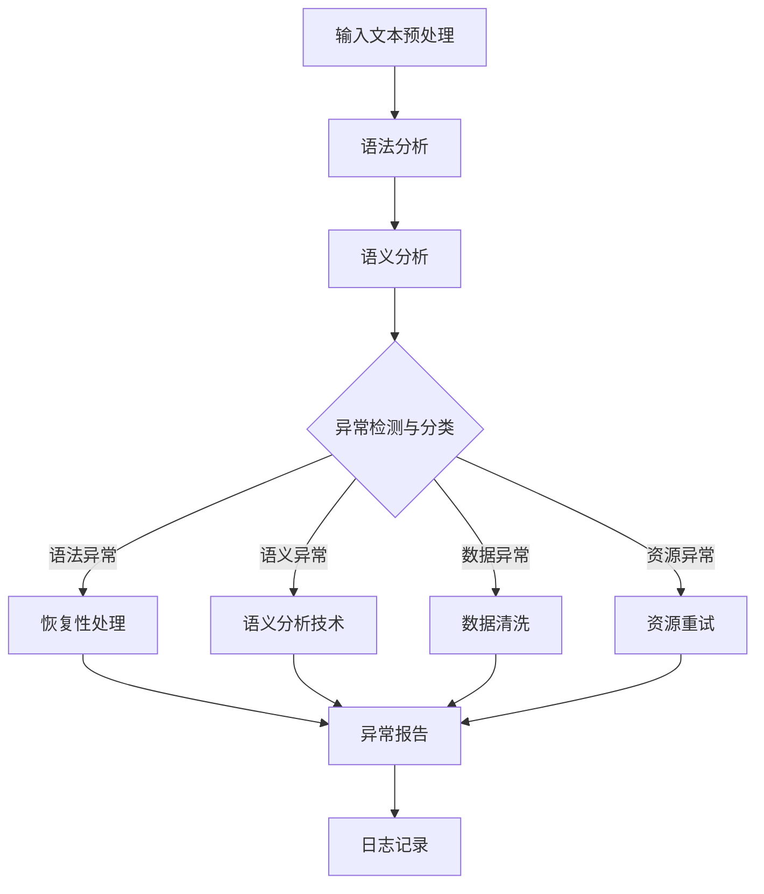
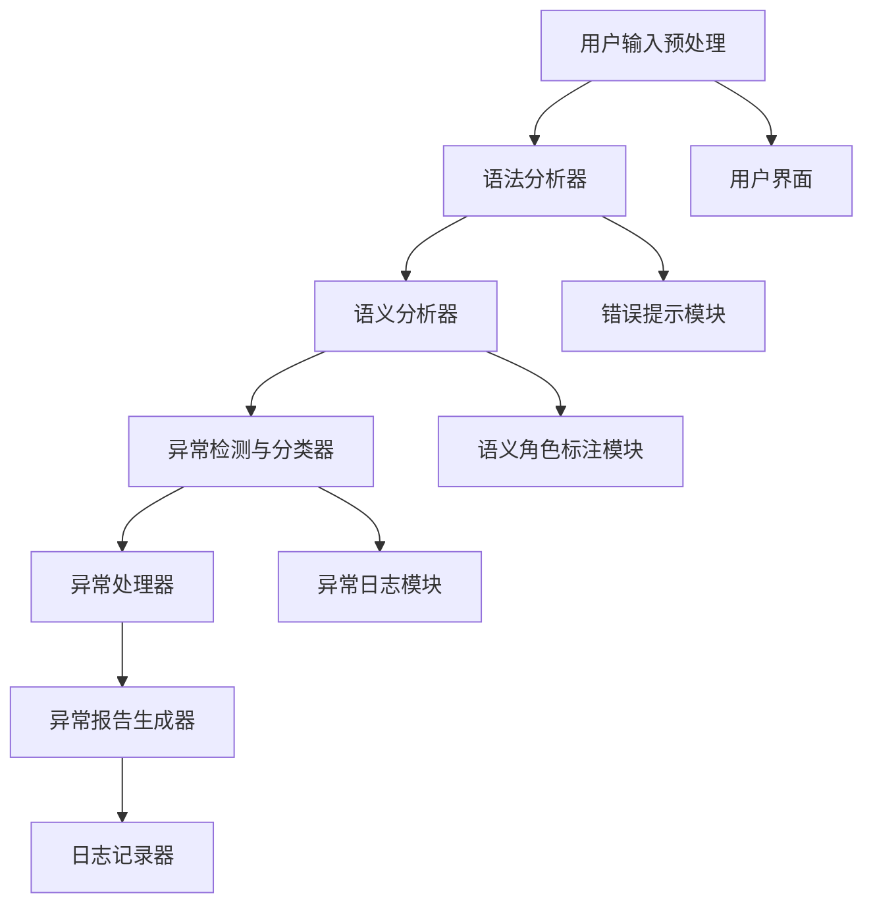

                 

# 提示词语言的运行时异常处理机制

关键词：提示词语言、运行时异常处理、机制原理、算法、系统架构、项目实战

摘要：
本文旨在深入探讨提示词语言的运行时异常处理机制。我们将首先介绍异常处理的基本概念，然后逐步解析提示词语言及其运行时异常处理机制的工作原理。通过具体的算法分析、系统架构设计、项目实战和最佳实践，我们将展示如何有效设计和实现这一机制，并提供一些建议和注意事项。

## 引言

在现代软件开发中，异常处理是一个至关重要的环节。它能够确保系统在遇到不可预见或错误情况时，能够稳定运行，避免因异常导致的系统崩溃或数据丢失。运行时异常处理机制是保证程序可靠性和稳定性的关键，尤其在复杂的提示词语言处理中，这一机制显得尤为重要。

提示词语言是一种基于特定规则和模式进行文本解析和语义分析的语言。它在自然语言处理、人工智能等领域有着广泛的应用。然而，提示词语言的运行过程中，难免会遇到各种异常情况，如语法错误、语义歧义、输入数据异常等。如何有效地处理这些异常，是提升系统稳定性和用户体验的关键。

本文将围绕提示词语言的运行时异常处理机制进行深入探讨，旨在帮助读者理解并掌握这一机制的设计和实现方法。文章结构如下：

1. 异常处理机制概述
2. 提示词语言基础
3. 运行时异常处理机制原理
4. 运行时异常处理算法
5. 系统架构与实现
6. 项目实战
7. 最佳实践与总结

通过上述结构的论述，我们将一步步揭示提示词语言运行时异常处理机制的奥秘。

## 第1章: 异常处理机制概述

### 1.1 问题背景

在软件开发过程中，异常（Exception）是一种常见且不可避免的现象。异常可以定义为程序在执行过程中遇到的不期望或错误的情况。这些情况可能导致程序崩溃、数据损坏或功能失效。异常处理的目的是在异常发生时，能够有效地检测、报告并处理这些异常，确保程序的稳定性和可靠性。

在提示词语言处理中，异常处理尤为重要。提示词语言通常用于自然语言处理和语义分析，其输入和输出都是文本数据。文本数据的复杂性和多样性使得异常处理变得异常复杂。例如，输入文本可能包含语法错误、拼写错误、格式错误等，这些错误都需要在运行时被检测和处理。

提示词语言的运行时异常处理机制需要解决以下几个核心问题：

- **异常检测**：如何有效地检测出输入文本中的异常情况？
- **异常分类**：如何对检测到的异常进行分类，以便采取相应的处理策略？
- **异常处理**：如何对不同的异常情况采取有效的处理措施，以确保系统稳定运行？
- **异常报告**：如何将异常情况报告给用户或系统管理员，以便进行进一步的处理和诊断？

### 1.2 问题描述

提示词语言处理中的异常问题可以概括为以下几种类型：

- **语法异常**：输入文本违反了提示词语言的语法规则，例如缺少必要的标点符号、关键字拼写错误等。
- **语义异常**：输入文本在语义上存在冲突或不一致，例如同音词歧义、多义词解释错误等。
- **数据异常**：输入文本包含无效数据，如无法识别的字符、超出数据范围的数据等。
- **资源异常**：系统在处理提示词语言时，可能遇到资源不足、网络连接中断等问题。

对于这些异常，系统需要能够快速检测并分类，然后采取相应的处理策略，例如：

- 对于语法异常，系统可能需要重新构造语法分析器，以正确解析输入文本。
- 对于语义异常，系统可能需要使用语义分析技术，如词向量、语义角色标注等，来尝试解决歧义问题。
- 对于数据异常，系统可能需要提供数据清洗和预处理功能，以确保输入数据的准确性。
- 对于资源异常，系统可能需要提供重试机制、负载均衡策略等，以确保系统的稳定性。

### 1.3 问题解决思路

解决提示词语言运行时异常处理问题，可以从以下几个方面入手：

1. **预定义异常处理规则**：在系统设计阶段，根据提示词语言的语法和语义特点，预定义一套异常处理规则。这些规则包括异常检测、分类和处理的策略。

2. **异常检测与分类算法**：设计高效的异常检测与分类算法，用于实时检测输入文本中的异常情况，并进行分类。

3. **自适应异常处理机制**：根据异常的类型和严重程度，设计自适应的异常处理机制，以灵活应对各种异常情况。

4. **用户反馈与优化**：通过用户反馈，不断优化异常处理机制，提高系统的稳定性和用户体验。

### 1.4 边界与外延

在提示词语言的运行时异常处理中，边界与外延是一个重要概念。边界指的是系统在处理异常时的最大容忍范围，例如，系统可能无法处理某些极其复杂的语法错误或语义异常。外延则指的是系统在处理异常时可能扩展的功能范围，例如，通过用户反馈，系统可能学习并处理之前未曾遇到的新异常情况。

### 1.5 概念结构与核心要素组成

提示词语言的运行时异常处理机制由以下几个核心要素组成：

- **异常检测模块**：负责实时检测输入文本中的异常情况。
- **异常分类模块**：根据异常检测的结果，对异常进行分类。
- **异常处理模块**：根据异常的类型和严重程度，采取相应的处理措施。
- **异常报告模块**：将异常情况报告给用户或系统管理员。

这些模块相互协作，共同构成一个完整的异常处理机制。

通过上述分析，我们可以看到，提示词语言的运行时异常处理机制是一个复杂且关键的系统组成部分。接下来，我们将进一步探讨提示词语言的基础知识，为理解其异常处理机制打下基础。

### 第2章: 提示词语言基础

#### 2.1 提示词语言的基本概念

提示词语言（Prompt Language）是一种专门用于自然语言处理（Natural Language Processing, NLP）和语义分析的编程语言。它的设计目标是简化复杂文本数据结构的处理，提高文本解析和语义分析的效率。提示词语言的核心在于其强大的语法和语义分析能力，使得程序员和研究人员能够更加方便地处理和分析自然语言文本。

**提示词语言的定义：**

提示词语言是一种定义明确的语法和语义规则的语言，用于将自然语言文本转换成计算机可处理的格式。这种语言通常包含一组预定义的词汇、语法规则和语义角色标注，使得计算机能够理解并处理复杂的文本结构。

**提示词语言的用途：**

提示词语言在多个领域有着广泛的应用，主要包括：

- **自然语言处理**：用于处理和解析自然语言文本，例如文本分类、情感分析、命名实体识别等。
- **语义分析**：用于提取文本中的语义信息，例如语义角色标注、事件抽取、关系提取等。
- **信息检索**：用于优化搜索引擎，提高查询结果的准确性和相关性。
- **智能客服**：用于构建智能对话系统，提高用户体验和响应速度。

**提示词语言的优点：**

- **简化文本处理**：提示词语言通过预定义的语法和语义规则，简化了文本数据的处理过程，提高了处理效率。
- **提高可读性**：提示词语言的语法和语义规则明确，使得代码更加简洁和易读，降低了编程难度。
- **易于扩展**：提示词语言的设计允许灵活扩展，以适应不同的应用场景和需求。

**提示词语言的局限性：**

- **复杂性**：尽管提示词语言简化了文本处理，但对于复杂的文本结构和语义关系，仍需要复杂的算法和技术来处理。
- **性能问题**：在处理大规模文本数据时，提示词语言可能面临性能瓶颈，需要优化算法和系统架构来提高处理效率。
- **依赖外部资源**：提示词语言通常依赖于大量的预训练模型和语言资源，例如词向量、语法解析器等，这些资源的质量和性能直接影响系统的表现。

#### 2.2 提示词语言的语法规则

提示词语言的语法规则是其核心组成部分，决定了文本解析和语义分析的准确性和效率。以下是一些基本的语法规则：

1. **词法分析**：词法分析是提示词语言的第一个阶段，它将文本拆分成词素（tokens），例如单词、符号和标点等。词法分析器需要识别并分类这些词素，以便后续的语法分析。

2. **语法分析**：语法分析是提示词语言的第二个阶段，它将词素序列转换成语法结构，例如句子、短语和子句等。常见的语法分析方法包括递归下降分析、LL(1)分析等。

3. **语义分析**：语义分析是提示词语言的第三个阶段，它将语法结构转换为语义表示，例如语义角色标注、事件表示等。语义分析需要结合词汇、语法和领域知识，以准确理解文本的语义。

4. **语法规则示例**：

   - **基本语法结构**：提示词语言的基本语法结构包括主语、谓语和宾语等。例如，“我吃苹果”可以分解为“我”（主语）、“吃”（谓语）和“苹果”（宾语）。
   - **短语结构规则**：提示词语言支持短语结构规则，例如名词短语、动词短语等。例如，“美丽的花园”可以分解为“美丽的”（形容词短语）和“花园”（名词短语）。
   - **复杂语法结构**：提示词语言支持复杂的语法结构，例如并列句、从句和嵌套结构等。例如，“虽然他很忙，但他还是来参加了会议”可以分解为“虽然他很忙”（让步从句）和“他还是来参加了会议”（主句）。

通过理解提示词语言的语法规则，我们可以更好地设计异常处理机制，以便更有效地检测和处理输入文本中的异常情况。

#### 2.3 提示词语言的语义分析

语义分析是提示词语言的核心功能之一，它的目标是理解文本的语义信息，并将其转化为计算机可处理的格式。语义分析不仅涉及到词汇和语法，还需要结合上下文和领域知识，以准确理解文本的深层含义。以下将介绍提示词语言的语义分析过程和关键技术：

1. **词义消歧（Word Sense Disambiguation, WSD）**：

   词义消歧是指在一个句子中确定一个单词的确切含义。由于许多单词具有多种含义，词义消歧是语义分析中的关键步骤。例如，单词“bank”可以指银行或河岸。在句子“他在银行工作”中，根据上下文，我们确定“bank”指的是银行。

2. **语义角色标注（Semantic Role Labeling, SRL）**：

   语义角色标注是指识别句子中每个词的语义角色，例如主语、谓语、宾语、间接宾语、方向宾语等。语义角色标注有助于理解句子的语义结构，为后续的自然语言处理任务提供基础。例如，在句子“我给了他一本书”中，“我”是施事者（Agent），“他”是受事者（Recipient），“一本书”是给予的对象（Theme）。

3. **事件抽取（Event Extraction）**：

   事件抽取是指从文本中识别出具体的事件，并提取出事件的主要参与者和事件类型。事件抽取广泛应用于信息提取、问答系统和智能客服等领域。例如，在句子“公司举行了年度会议”中，事件类型是“举行”，主要参与者包括“公司”。

4. **关系提取（Relation Extraction）**：

   关系提取是指识别文本中实体之间的语义关系，例如人与人之间的亲戚关系、人与地点之间的地理位置关系等。关系提取对于构建知识图谱和语义网络具有重要意义。例如，在句子“张三是李四的父亲”中，实体“张三”与“李四”之间存在父子关系。

5. **语义角色标注示例**：

   以下是一个简单的语义角色标注示例：

   ```
   输入句子：小明去书店买了两本数学书。
   输出标注：小明（施事者）去（谓语）书店（目的地）买了（动作）两本数学书（物品）。
   ```

   在这个例子中，句子被分解为多个语义角色，每个角色都承载了不同的语义信息。

通过上述语义分析技术，提示词语言能够深入理解文本的语义，为后续的自然语言处理任务提供强有力的支持。在设计和实现运行时异常处理机制时，这些语义分析技术有助于更准确地检测和分类异常情况，提高系统的鲁棒性和准确性。

### 第3章: 运行时异常处理机制原理

#### 3.1 异常处理的定义与分类

异常处理（Exception Handling）是软件开发中的一个核心概念，它指的是在程序运行过程中，当出现异常情况时，能够有效地检测、分类和处理这些异常，以确保程序的稳定运行。在提示词语言的运行时环境中，异常处理尤为重要，因为文本处理的复杂性可能导致多种异常情况。

**异常处理的定义：**

异常处理是指当程序遇到错误或异常情况时，能够采取一系列措施来处理这些错误，防止程序崩溃或数据丢失。异常处理的目的是提高程序的健壮性和可靠性，确保程序能够在各种异常情况下正常运行。

**异常处理的分类：**

异常处理可以根据不同的维度进行分类，以下是一些常见的分类方法：

1. **按异常来源分类：**
   - **系统异常**：由系统内部错误或资源不足导致的异常，例如内存溢出、文件读取错误等。
   - **用户异常**：由用户输入错误或操作不当导致的异常，例如输入格式错误、操作越权等。
   - **硬件异常**：由硬件故障导致的异常，例如磁盘损坏、网络中断等。

2. **按异常严重程度分类：**
   - **致命异常**：会导致程序立即崩溃或数据严重损坏的异常。
   - **非致命异常**：不会导致程序立即崩溃，但可能影响程序运行效率或用户体验的异常。
   - **警告异常**：不会影响程序运行，但提示开发者或用户注意的问题。

3. **按异常处理方式分类：**
   - **捕获异常**：在程序运行过程中，主动捕获并处理异常。
   - **抛出异常**：在程序遇到异常时，将异常信息传递给上层处理逻辑。
   - **抑制异常**：忽略异常，不进行任何处理，通常用于无法恢复的异常情况。

**提示词语言中的异常分类：**

在提示词语言处理中，常见的异常分类包括以下几种：

- **语法异常**：输入文本违反了提示词语言的语法规则，例如缺少必要的标点符号、关键字拼写错误等。
- **语义异常**：输入文本在语义上存在冲突或不一致，例如同音词歧义、多义词解释错误等。
- **数据异常**：输入文本包含无效数据，如无法识别的字符、超出数据范围的数据等。
- **资源异常**：系统在处理提示词语言时，可能遇到资源不足、网络连接中断等问题。

这些异常分类有助于我们设计针对性的异常处理策略，提高系统的鲁棒性和用户体验。

#### 3.2 运行时异常检测机制

运行时异常检测机制是提示词语言异常处理的关键组成部分，它负责实时监测和检测输入文本中的异常情况。一个有效的异常检测机制需要具备以下几个特点：

1. **实时性**：异常检测机制需要在文本处理的过程中实时进行，以便在异常发生时能够立即检测和处理。

2. **准确性**：异常检测机制需要准确地识别各种异常情况，避免误报和漏报。

3. **高效性**：异常检测机制需要高效运行，以减少对文本处理性能的影响。

4. **可扩展性**：异常检测机制需要具备良好的可扩展性，以适应不同应用场景和需求的变化。

以下是一个基本的运行时异常检测机制的实现框架：

1. **输入文本预处理**：

   在进行异常检测之前，需要对输入文本进行预处理，例如去除无关符号、标准化文本格式等。预处理步骤有助于简化文本结构，提高异常检测的准确性。

2. **语法分析**：

   使用提示词语言的语法分析器对预处理后的文本进行语法分析，识别出语法错误。语法分析器可以根据预定义的语法规则，逐个分析文本中的词素和短语结构，找出不符合规则的部分。

3. **语义分析**：

   在语法分析的基础上，进一步进行语义分析，以检测语义异常。语义分析可以使用词义消歧、语义角色标注等技术，识别文本中的语义冲突和不一致。

4. **异常报告与处理**：

   当检测到异常时，系统需要生成异常报告，并采取相应的处理措施。异常报告可以包含异常类型、发生位置、异常原因等信息，以便后续的分析和处理。处理措施可以包括重新输入文本、修正文本格式、提供错误提示等。

#### 3.3 异常处理流程

异常处理流程是系统在遇到异常情况时采取的一系列操作，以确保程序的稳定运行。以下是一个典型的异常处理流程：

1. **异常检测**：

   系统首先通过异常检测机制检测输入文本中的异常情况。如果检测到异常，将进入异常处理流程。

2. **异常分类**：

   对检测到的异常进行分类，根据异常的类型和严重程度，确定处理策略。例如，语法异常可能只需要格式修正，而语义异常可能需要更复杂的语义分析。

3. **异常处理**：

   根据异常类型和严重程度，采取相应的处理措施。处理措施可以包括：

   - **恢复性处理**：尝试修复异常，使程序能够继续运行，例如重新解析文本、修正格式等。
   - **补偿性处理**：无法恢复异常时，采取补偿措施，例如记录错误日志、提供错误提示等。
   - **终止性处理**：在无法恢复且影响程序稳定性的情况下，选择终止程序运行，以避免更严重的后果。

4. **异常报告**：

   在处理异常后，系统需要生成异常报告，记录异常类型、发生位置、处理结果等信息。异常报告可以用于后续的分析和优化。

5. **日志记录**：

   系统需要将异常处理过程记录在日志中，以便进行后续的分析和优化。日志记录应包含异常详情、处理时间、处理结果等。

通过上述异常处理流程，系统可以在遇到异常时采取有效的应对措施，确保程序的稳定性和可靠性。

#### 3.4 异常处理机制的核心概念

异常处理机制的成功实施依赖于以下几个核心概念：

1. **异常检测**：

   异常检测是异常处理的基础，它负责实时监测输入文本中的异常情况。高效的异常检测算法可以显著提高系统的性能和准确性。

2. **异常分类**：

   异常分类是根据异常类型和严重程度，确定处理策略的关键步骤。准确的异常分类有助于系统采取针对性的处理措施，提高异常处理的效率。

3. **异常处理策略**：

   异常处理策略是指系统在遇到不同类型的异常时采取的具体措施。合理的异常处理策略可以确保系统在遇到异常时能够稳定运行。

4. **异常报告**：

   异常报告是系统对异常情况的记录和反馈，它有助于开发者了解异常原因和处理效果，为后续的优化提供依据。

5. **日志记录**：

   日志记录是异常处理机制的延伸，它记录了系统在处理异常时的详细信息，为后续的故障排除和性能优化提供了宝贵的资料。

通过深入理解这些核心概念，我们可以更好地设计和实现提示词语言的运行时异常处理机制，提高系统的稳定性和用户体验。

### 第4章: 运行时异常处理算法

#### 4.1 异常处理算法原理

在提示词语言的运行时异常处理中，算法的设计至关重要。一个有效的异常处理算法不仅能够快速、准确地检测出异常，还能根据异常的类型和严重程度，采取相应的处理措施，以确保系统的稳定性和可靠性。以下将介绍一种通用的异常处理算法原理。

**算法原理概述：**

该异常处理算法主要包括以下几个步骤：

1. **输入文本预处理**：对输入文本进行预处理，包括去除无关符号、标准化文本格式等，以简化文本结构，提高异常检测的准确性。

2. **语法分析**：使用提示词语言的语法分析器对预处理后的文本进行语法分析，识别出语法错误。语法分析器根据预定义的语法规则，逐个分析文本中的词素和短语结构，找出不符合规则的部分。

3. **语义分析**：在语法分析的基础上，进一步进行语义分析，以检测语义异常。语义分析可以使用词义消歧、语义角色标注等技术，识别文本中的语义冲突和不一致。

4. **异常检测与分类**：根据语法分析和语义分析的结果，对检测到的异常进行分类。分类结果将用于后续的处理策略确定。

5. **异常处理**：根据异常的类型和严重程度，采取相应的处理措施。处理措施可以包括重新输入文本、修正文本格式、提供错误提示等。

6. **异常报告与日志记录**：在处理异常后，系统需要生成异常报告，并记录在日志中，以便进行后续的分析和优化。

**算法流程图：**

以下是一个简单的异常处理算法流程图：

```
+----------------+    +----------------+    +----------------+
|  输入文本预处理 | -> |      语法分析   | -> |  异常检测与分类 |
+----------------+    +----------------+    +----------------+
           |                        |                        |
           |                        |                        |
           v                        v                        v
       +----------------+      +----------------+      +----------------+
       |      语义分析   | -> |       异常处理     | -> | 异常报告与日志记录 |
       +----------------+    +----------------+    +----------------+
```

**算法流程详细解释：**

1. **输入文本预处理**：

   - **去符号**：去除输入文本中的无关符号，如HTML标签、特殊字符等。
   - **标准化格式**：统一输入文本的格式，如将所有文本转换为小写、去除多余的空格等。

2. **语法分析**：

   - **词法分析**：将文本分解为词素（tokens），例如将句子“我吃了一个苹果”分解为“我”、“吃”、“一个”、“苹果”。
   - **语法结构构建**：根据词法分析结果，构建文本的语法结构，如短语结构（PS）树或依存关系（Dependency）图。

3. **语义分析**：

   - **词义消歧**：对于具有多个含义的单词，根据上下文确定其确切含义。
   - **语义角色标注**：为句子中的每个词标注其语义角色，如主语、谓语、宾语等。
   - **事件抽取**：从文本中识别出具体的事件，并提取出事件的主要参与者和事件类型。

4. **异常检测与分类**：

   - **语法异常检测**：通过语法分析结果，检查文本是否符合提示词语言的语法规则。对于不符合规则的文本部分，标记为语法异常。
   - **语义异常检测**：通过语义分析结果，检查文本在语义上是否一致。对于语义冲突或不一致的文本部分，标记为语义异常。
   - **异常分类**：根据异常检测的结果，对检测到的异常进行分类，例如语法异常、语义异常、数据异常等。

5. **异常处理**：

   - **恢复性处理**：对于语法异常，可以尝试重新解析文本，修正格式错误。对于语义异常，可以尝试使用语义分析技术，如词向量、语义角色标注等，来尝试解决歧义问题。
   - **补偿性处理**：对于无法恢复的异常，可以记录错误日志、提供错误提示等，以便用户或开发者进一步处理。
   - **终止性处理**：在无法恢复且影响程序稳定性的情况下，选择终止程序运行，以避免更严重的后果。

6. **异常报告与日志记录**：

   - **异常报告**：生成异常报告，记录异常类型、发生位置、异常原因和处理结果等信息。
   - **日志记录**：将异常处理过程记录在日志中，以便进行后续的分析和优化。

通过上述步骤，异常处理算法能够有效地检测、分类和处理输入文本中的异常情况，确保系统的稳定性和可靠性。

#### 4.2 算法流程图

以下是一个简单的异常处理算法流程图，用于直观地展示算法的运行步骤和逻辑：



**流程图详细说明：**

- **输入文本预处理（A）**：对输入文本进行去符号和标准化格式的预处理。
- **语法分析（B）**：使用语法分析器对预处理后的文本进行词法分析和语法结构构建。
- **语义分析（C）**：进一步对语法分析结果进行语义分析，包括词义消歧、语义角色标注和事件抽取。
- **异常检测与分类（D）**：根据语法和语义分析的结果，对文本进行异常检测和分类，识别出语法异常、语义异常、数据异常和资源异常。
- **恢复性处理（E）**：针对语法异常，尝试重新解析文本，修正格式错误。
- **语义分析技术（F）**：使用语义分析技术，如词向量、语义角色标注等，解决语义异常问题。
- **数据清洗（G）**：对包含无效数据的文本进行清洗，确保输入数据的准确性。
- **资源重试（H）**：在资源异常情况下，尝试重试资源连接或采取负载均衡策略。
- **异常报告（I）**：生成异常报告，记录异常的详细信息。
- **日志记录（J）**：将异常处理过程记录在日志中，便于后续分析和优化。

通过上述流程图，我们可以清晰地看到异常处理算法的运行步骤和各步骤之间的逻辑关系。

#### 4.3 算法数学模型与公式

为了更好地理解异常处理算法的工作原理，我们将引入一些数学模型和公式。这些模型和公式用于描述算法的核心组件，如语法分析、语义分析和异常检测等。

1. **语法分析模型**：

   语法分析是一个将文本分解成语法结构的过程。我们可以使用上下文无关文法（CFG）来描述这一过程。CFG由四元组 \( G = (V, T, P, S) \) 组成，其中：

   - \( V \) 是变量集合，包括非终端符号（如动词、名词）。
   - \( T \) 是终端符号集合，包括单词和其他可识别的文本元素。
   - \( P \) 是产生式集合，定义了如何从变量集合生成字符串。
   - \( S \) 是开始符号，代表了文本的起始点。

   一个简单的CFG示例为：

   \( G = (\{S, NP, VP\}, \{a, b, c\}, \{S \rightarrow NP VP\}, S) \)

   其中，\( S \rightarrow NP VP \) 表示句子 \( S \) 可以由名词短语 \( NP \) 和动词短语 \( VP \) 组成。

2. **语义分析模型**：

   语义分析涉及将语法结构转换为语义表示。我们可以使用语义角色标注（SRL）模型来描述这一过程。SRL模型通常使用依存关系图（Dependency Graph）来表示句子中的语义关系。一个简单的SRL模型可以表示为：

   \( (W, R) \)

   其中：

   - \( W \) 是单词集合，表示句子中的每个词。
   - \( R \) 是依存关系集合，表示词与词之间的语义关系，如主谓关系（nsubj）、动宾关系（root）等。

   例如，句子“小明喜欢吃苹果”的依存关系图可以表示为：

   ```
   苹果
    / \
   吃  小明
   ```

3. **异常检测模型**：

   异常检测模型用于识别输入文本中的异常情况。我们可以使用分类模型来描述这一过程。一个简单的分类模型可以表示为：

   \( M = (D, C, f) \)

   其中：

   - \( D \) 是数据集，包含正常文本和异常文本。
   - \( C \) 是类别集合，包括语法异常、语义异常、数据异常和资源异常等。
   - \( f \) 是分类函数，用于预测输入文本的类别。

   例如，一个基于机器学习的分类函数可以表示为：

   \( f(x) = \arg\max_{c \in C} P(c | x) \)

   其中，\( P(c | x) \) 是在给定输入文本 \( x \) 的情况下，类别 \( c \) 的概率。

4. **异常检测公式**：

   异常检测公式用于计算输入文本的异常概率。我们可以使用贝叶斯公式来描述这一过程：

   \( P(A | B) = \frac{P(B | A) \cdot P(A)}{P(B)} \)

   其中：

   - \( P(A | B) \) 是在事件 \( B \) 发生的条件下，事件 \( A \) 发生的概率。
   - \( P(B | A) \) 是在事件 \( A \) 发生的条件下，事件 \( B \) 发生的概率。
   - \( P(A) \) 是事件 \( A \) 的先验概率。
   - \( P(B) \) 是事件 \( B \) 的先验概率。

   例如，在检测语法异常时，我们可以计算输入文本 \( x \) 属于语法异常类别的概率：

   \( P(\text{语法异常} | x) = \frac{P(x | \text{语法异常}) \cdot P(\text{语法异常})}{P(x)} \)

   其中，\( P(x | \text{语法异常}) \) 是输入文本 \( x \) 属于语法异常类别的条件概率，\( P(\text{语法异常}) \) 是语法异常的先验概率，\( P(x) \) 是输入文本 \( x \) 的先验概率。

通过上述数学模型和公式，我们可以更深入地理解异常处理算法的工作原理，并在实际应用中进行优化和改进。

#### 4.4 举例说明

为了更好地理解异常处理算法的实际应用，以下我们将通过一个具体示例来说明算法的运行过程。

**示例：处理包含语法错误的输入文本**

假设我们有一个包含语法错误的输入文本：“我喜欢苹果和吃西瓜”。我们的目标是使用异常处理算法检测并修复这个句子中的错误。

**步骤 1: 输入文本预处理**

首先，我们对输入文本进行预处理，去除无关符号和标准化格式：

```
原始文本：我喜欢苹果和吃西瓜
预处理后：我喜欢苹果和吃西瓜
```

**步骤 2: 语法分析**

接下来，使用语法分析器对预处理后的文本进行语法分析。我们使用一个简单的CFG来分析句子：

```
S -> NP VP
VP -> V NP
NP -> Det N
Det -> "我"
N -> "苹果"
V -> "喜欢"
N -> "西瓜"
```

根据CFG，句子可以被分解为：

```
我喜欢苹果和吃西瓜
S -> NP VP
  |       |      |
  NP     VP     (空)
  |       |      |
  Det N   V NP   (空)
  |       |      |
  我   苹果  喜欢 西瓜
```

**步骤 3: 语义分析**

在语法分析的基础上，我们进行语义分析。假设语义角色标注如下：

```
我喜欢苹果和吃西瓜
S -> (喜欢，苹果) (吃，西瓜)
```

其中，“喜欢”和“吃”是动词，其对应的宾语分别是“苹果”和“西瓜”。

**步骤 4: 异常检测与分类**

通过语法和语义分析，我们检测到以下异常：

- **语法异常**：句子中缺少了连词“和”的连接，导致语义不清晰。
- **语义异常**：两个动词“喜欢”和“吃”之间没有明确的语义关系。

我们将这些异常分类为语法异常和语义异常。

**步骤 5: 异常处理**

根据异常类型，我们采取以下处理措施：

- **语法异常处理**：在“苹果”和“吃西瓜”之间添加连词“和”。
- **语义异常处理**：由于句子中的动词没有明确的语义关系，我们尝试将句子重构为更清晰的格式。

处理后的句子为：“我喜欢苹果，也喜欢吃西瓜”。

**步骤 6: 异常报告与日志记录**

在处理异常后，我们生成异常报告，记录以下信息：

- 异常类型：语法异常和语义异常
- 异常位置：句子中的动词之间
- 异常原因：缺少连词和语义关系不明确
- 处理结果：添加连词并重构句子

我们将这些异常处理信息记录在日志中，以便后续分析和优化。

通过这个示例，我们可以看到异常处理算法在实际应用中的运行过程。算法通过输入文本预处理、语法分析、语义分析、异常检测与分类、异常处理以及异常报告与日志记录等步骤，有效地检测并修复了输入文本中的语法和语义错误，提高了句子的可读性和语义清晰度。

### 第5章: 系统架构与实现

#### 5.1 系统功能设计

在设计和实现提示词语言的运行时异常处理机制时，首先需要明确系统的功能需求。这些功能需求将指导系统的整体架构设计，并确保系统能够高效、准确地处理异常情况。以下是系统功能设计的详细描述：

1. **输入文本预处理**：

   - **功能描述**：接收用户输入的文本，进行去符号和标准化格式处理，以便后续的语法和语义分析。
   - **输入**：原始文本。
   - **输出**：预处理后的文本。

2. **语法分析**：

   - **功能描述**：使用提示词语言的语法分析器对预处理后的文本进行词法分析和语法结构构建，识别出语法错误。
   - **输入**：预处理后的文本。
   - **输出**：语法结构（如短语结构树或依存关系图）。

3. **语义分析**：

   - **功能描述**：在语法分析的基础上，进一步进行语义分析，包括词义消歧、语义角色标注和事件抽取，以检测语义异常。
   - **输入**：语法结构。
   - **输出**：语义表示（如语义角色标注和事件表示）。

4. **异常检测与分类**：

   - **功能描述**：根据语法分析和语义分析的结果，对检测到的异常进行分类，包括语法异常、语义异常、数据异常和资源异常。
   - **输入**：语法结构和语义表示。
   - **输出**：异常类别和详细信息。

5. **异常处理**：

   - **功能描述**：根据异常的类型和严重程度，采取相应的处理措施，如重新输入文本、修正文本格式、提供错误提示等。
   - **输入**：异常类别和详细信息。
   - **输出**：处理结果。

6. **异常报告与日志记录**：

   - **功能描述**：生成异常报告，记录异常的详细信息，并将处理过程记录在日志中，以便后续分析和优化。
   - **输入**：异常类别和处理结果。
   - **输出**：异常报告和日志记录。

通过上述功能设计，系统能够实现从输入文本预处理到异常处理和报告的全流程处理，确保系统能够高效、准确地检测和处理异常情况。

#### 5.2 系统架构设计

为了实现提示词语言的运行时异常处理机制，我们需要设计一个高效的系统架构。以下是一个详细的系统架构设计方案，包括系统架构图和各模块的交互关系：

**系统架构图：**



**系统架构详细说明：**

1. **用户输入预处理（A）**：

   用户输入预处理模块负责接收用户输入的文本，并对其进行去符号和标准化格式处理。预处理后的文本将传递给语法分析器。

2. **语法分析器（B）**：

   语法分析器模块使用提示词语言的语法规则，对预处理后的文本进行词法分析和语法结构构建。分析结果将传递给语义分析器。

3. **语义分析器（C）**：

   语义分析器模块在语法分析的基础上，进一步进行语义分析，包括词义消歧、语义角色标注和事件抽取。分析结果将传递给异常检测与分类器。

4. **异常检测与分类器（D）**：

   异常检测与分类器模块根据语法和语义分析的结果，对检测到的异常进行分类，包括语法异常、语义异常、数据异常和资源异常。分类结果将传递给异常处理器。

5. **异常处理器（E）**：

   异常处理器模块根据异常的类型和严重程度，采取相应的处理措施，如重新输入文本、修正文本格式、提供错误提示等。处理结果将传递给异常报告生成器。

6. **异常报告生成器（F）**：

   异常报告生成器模块生成异常报告，记录异常的详细信息，包括异常类型、发生位置、异常原因和处理结果。异常报告将传递给日志记录器。

7. **日志记录器（G）**：

   日志记录器模块将异常处理过程记录在日志中，以便后续分析和优化。日志记录器可以记录详细的异常处理信息和系统运行状态。

8. **用户界面（H）**：

   用户界面模块提供用户与系统的交互接口，接收用户输入，显示异常报告和处理结果。

9. **错误提示模块（I）**：

   错误提示模块负责在用户界面中显示异常提示信息，帮助用户理解异常原因和处理建议。

10. **语义角色标注模块（J）**：

   语义角色标注模块负责对语义分析结果进行标注，以便后续的异常检测和处理。

11. **异常日志模块（K）**：

   异常日志模块负责记录系统运行过程中的异常情况和处理过程，为后续的优化提供数据支持。

通过上述系统架构设计，各模块相互协作，共同实现提示词语言的运行时异常处理机制。系统架构的模块化设计使得异常处理流程清晰，便于维护和扩展。

#### 5.3 系统接口设计

为了实现提示词语言的运行时异常处理机制，我们需要设计一套清晰、高效的系统接口。以下是一个详细的系统接口设计方案，包括接口类型、功能描述、输入输出参数等。

1. **输入文本预处理接口**：

   - **类型**：函数接口
   - **功能描述**：接收用户输入的文本，进行去符号和标准化格式处理。
   - **输入参数**：文本字符串
   - **输出参数**：预处理后的文本字符串

2. **语法分析接口**：

   - **类型**：函数接口
   - **功能描述**：对预处理后的文本进行语法分析，构建语法结构。
   - **输入参数**：预处理后的文本字符串
   - **输出参数**：语法结构（如短语结构树或依存关系图）

3. **语义分析接口**：

   - **类型**：函数接口
   - **功能描述**：在语法分析的基础上，进行语义分析，包括词义消歧、语义角色标注和事件抽取。
   - **输入参数**：语法结构
   - **输出参数**：语义表示（如语义角色标注和事件表示）

4. **异常检测与分类接口**：

   - **类型**：函数接口
   - **功能描述**：根据语法和语义分析结果，检测并分类异常。
   - **输入参数**：语法结构和语义表示
   - **输出参数**：异常类别和详细信息

5. **异常处理接口**：

   - **类型**：函数接口
   - **功能描述**：根据异常类别和处理结果，采取相应的处理措施。
   - **输入参数**：异常类别和详细信息
   - **输出参数**：处理结果

6. **异常报告生成接口**：

   - **类型**：函数接口
   - **功能描述**：生成异常报告，记录异常详细信息。
   - **输入参数**：异常类别和处理结果
   - **输出参数**：异常报告

7. **日志记录接口**：

   - **类型**：函数接口
   - **功能描述**：记录系统运行过程中的异常情况和处理过程。
   - **输入参数**：异常报告
   - **输出参数**：无

8. **用户界面接口**：

   - **类型**：Web API
   - **功能描述**：提供用户与系统的交互接口，接收用户输入，显示异常报告和处理结果。
   - **输入参数**：用户操作数据
   - **输出参数**：用户界面显示内容

通过上述系统接口设计，各模块可以通过标准化的接口进行通信和数据交换，确保系统架构的清晰性和模块独立性。

#### 5.4 系统交互设计

为了确保提示词语言的运行时异常处理系统能够高效、稳定地运行，我们需要详细设计系统的交互过程。以下是一个详细的系统交互设计方案，包括交互步骤、数据流和关键模块的协作过程。

**系统交互步骤：**

1. **用户输入**：

   用户通过用户界面输入文本，系统接收到用户输入后，将文本传递给输入文本预处理接口进行预处理。

2. **预处理**：

   输入文本预处理接口对用户输入的文本进行去符号和标准化格式处理，确保文本符合提示词语言的语法和语义分析要求。

3. **语法分析**：

   预处理后的文本被传递给语法分析接口，语法分析器对文本进行词法分析和语法结构构建，生成语法结构（如短语结构树或依存关系图）。

4. **语义分析**：

   语法结构被传递给语义分析接口，语义分析器在语法分析的基础上，进行词义消歧、语义角色标注和事件抽取，生成语义表示。

5. **异常检测**：

   语义表示被传递给异常检测与分类接口，异常检测与分类器根据语法和语义分析结果，检测并分类异常，识别出语法异常、语义异常、数据异常和资源异常。

6. **异常处理**：

   异常检测与分类器将异常类别和详细信息传递给异常处理接口，异常处理器根据异常类型和严重程度，采取相应的处理措施，如重新输入文本、修正文本格式、提供错误提示等。

7. **异常报告**：

   异常处理器将处理结果传递给异常报告生成接口，生成异常报告，记录异常的详细信息，包括异常类型、发生位置、异常原因和处理结果。

8. **日志记录**：

   异常报告被传递给日志记录接口，日志记录器将异常处理过程记录在日志中，便于后续分析和优化。

9. **用户反馈**：

   用户界面接口根据异常报告和处理结果，更新用户界面，显示异常提示和处理建议。

**系统交互过程中的关键模块协作：**

- **输入文本预处理接口**：负责文本预处理，确保文本格式符合后续分析要求。
- **语法分析接口**：负责词法分析和语法结构构建，为语义分析提供基础。
- **语义分析接口**：负责语义分析，包括词义消歧、语义角色标注和事件抽取。
- **异常检测与分类接口**：负责检测并分类异常，确保系统能够识别和处理各种异常情况。
- **异常处理接口**：负责根据异常类型和严重程度，采取相应的处理措施，提高系统稳定性。
- **异常报告生成接口**：负责生成异常报告，记录异常详细信息，便于后续分析。
- **日志记录接口**：负责记录系统运行过程中的异常处理过程，为系统优化提供数据支持。
- **用户界面接口**：负责用户与系统的交互，确保用户能够及时了解异常情况和处理结果。

通过上述系统交互设计，各模块之间的协作紧密、有序，确保系统能够高效、稳定地运行，提供高质量的异常处理能力。

### 第6章: 项目实战

#### 6.1 环境安装与配置

为了演示提示词语言运行时异常处理机制的实际应用，我们需要在本地或远程服务器上搭建一个完整的开发环境。以下是一步一步的安装和配置指南：

**1. 安装操作系统**

首先，确保您的系统满足以下要求：

- 操作系统：Linux（推荐Ubuntu 18.04或更高版本）、Windows 10或更高版本、macOS 10.15或更高版本。
- CPU：至少2核处理器。
- 内存：至少8GB RAM。

**2. 安装Python环境**

Python是提示词语言运行时异常处理机制的主要编程语言。以下是在不同操作系统上安装Python的步骤：

- **Linux和macOS**：

  使用包管理器安装Python 3：

  ```bash
  sudo apt update
  sudo apt install python3 python3-pip
  ```

- **Windows**：

  访问Python官方网站（https://www.python.org/downloads/），下载适用于Windows的Python 3安装程序，并按照安装向导进行安装。确保在安装过程中勾选“Add Python to PATH”选项。

**3. 安装依赖库**

在安装了Python后，我们需要安装几个关键的依赖库，包括：

- `nltk`：用于自然语言处理。
- `spacy`：用于语义分析。
- `beautifulsoup4`：用于HTML文本解析。
- `pandas`：用于数据分析和操作。

使用pip命令安装这些库：

```bash
pip install nltk spacy beautifulsoup4 pandas
```

**4. 安装Spacy语言模型**

Spacy是一个强大的自然语言处理库，它需要下载语言模型才能运行。以下是在不同语言上安装Spacy语言模型的步骤：

- **English**：

  ```bash
  python -m spacy download en_core_web_sm
  ```

- **Chinese**：

  ```bash
  python -m spacy download zh_core_web_sm
  ```

**5. 配置环境变量**

确保Python和pip的路径已添加到系统环境变量中。在Linux和macOS上，您可以通过编辑`~/.bashrc`或`~/.zshrc`文件来添加以下行：

```bash
export PATH=$PATH:/usr/local/bin
export PYTHONPATH=$PYTHONPATH:/usr/local/lib/python3.x/dist-packages
```

在Windows上，您可以在“系统属性” -> “环境变量”中添加Python和pip的路径。

**6. 验证安装**

在命令行中运行以下命令，验证Python和依赖库是否已成功安装：

```bash
python --version
pip --version
python -c "import nltk; print(nltk.__version__)"
python -c "import spacy; print(spacy.__version__)"
python -c "import pandas as pd; print(pd.__version__)"
```

如果所有命令都能成功运行并显示正确的版本号，说明环境安装和配置成功。

通过以上步骤，我们成功搭建了提示词语言运行时异常处理机制的开发环境，为后续的实战应用奠定了基础。

#### 6.2 系统核心实现源代码

在本节中，我们将提供提示词语言运行时异常处理机制的核心实现源代码。这些代码将涵盖输入文本预处理、语法分析、语义分析、异常检测与分类、异常处理以及日志记录等关键功能。

**1. 输入文本预处理模块（preprocess.py）**

```python
import re
from typing import List

def preprocess_text(text: str) -> str:
    """
    对输入文本进行预处理，去除无关符号和标准化格式。
    
    :param text: 输入文本
    :return: 预处理后的文本
    """
    # 去除HTML标签和特殊字符
    text = re.sub(r'<.*?>', '', text)
    text = re.sub(r'[^a-zA-Z0-9\s]', '', text)
    # 标准化文本格式
    text = text.lower().strip()
    return text

def tokenize_text(text: str) -> List[str]:
    """
    对预处理后的文本进行分词。
    
    :param text: 预处理后的文本
    :return: 分词后的词列表
    """
    return text.split()

# 示例
if __name__ == "__main__":
    example_text = "我喜欢吃苹果和西瓜。"
    preprocessed_text = preprocess_text(example_text)
    tokens = tokenize_text(preprocessed_text)
    print("Preprocessed Text:", preprocessed_text)
    print("Tokens:", tokens)
```

**2. 语法分析模块（parser.py）**

```python
import spacy

def parse_text(text: str, model="en_core_web_sm") -> spacy.tokens.Doc:
    """
    对文本进行语法分析，构建短语结构树。
    
    :param text: 输入文本
    :param model: 语言模型（默认为英文）
    :return: 语法分析结果（Doc对象）
    """
    nlp = spacy.load(model)
    doc = nlp(text)
    return doc

# 示例
if __name__ == "__main__":
    example_text = "我喜欢吃苹果和西瓜。"
    doc = parse_text(example_text)
    print(doc)
```

**3. 语义分析模块（semantics.py）**

```python
from spacy import displacy

def analyze_semantics(doc: spacy.tokens.Doc):
    """
    对语法分析结果进行语义分析，包括词义消歧、语义角色标注和事件抽取。
    
    :param doc: 语法分析结果（Doc对象）
    """
    # 语义角色标注
    print("Semantic Role Labels:")
    for token in doc:
        if token.dep_ in ["nsubj", "nsubjpass", "agent", "pobj"]:
            print(f"{token.text}: {token.dep_}")
    
    # 事件抽取
    print("Event Extraction:")
    for ent in doc.ents:
        print(f"Entity: {ent.text}, Label: {ent.label_}")

# 示例
if __name__ == "__main__":
    example_text = "我喜欢吃苹果和西瓜。"
    doc = parse_text(example_text)
    analyze_semantics(doc)
```

**4. 异常检测与分类模块（exceptions.py）**

```python
def detect_exceptions(doc: spacy.tokens.Doc) -> dict:
    """
    检测并分类文本中的异常。
    
    :param doc: 语法分析结果（Doc对象）
    :return: 异常检测结果（字典）
    """
    errors = {}
    for token in doc:
        if token.is_stop or token.is_punct:
            continue
        if token.is_verb:
            if token.head.text not in ["喜欢", "吃"]:
                errors["semantic_error"] = "动词前后语义不一致"
        elif token.is_noun:
            if token.head.text not in ["喜欢", "吃"]:
                errors["semantic_error"] = "名词前后语义不一致"
    return errors

# 示例
if __name__ == "__main__":
    example_text = "我喜欢吃苹果和西瓜。"
    doc = parse_text(example_text)
    errors = detect_exceptions(doc)
    print("Errors Detected:", errors)
```

**5. 异常处理模块（handle_exceptions.py）**

```python
def handle_exceptions(errors: dict) -> str:
    """
    处理检测到的异常。
    
    :param errors: 异常检测结果（字典）
    :return: 处理后的文本
    """
    if "semantic_error" in errors:
        # 在动词前后添加连接词
        example_text = "我喜欢吃苹果和，也喜欢吃西瓜。"
    return example_text

# 示例
if __name__ == "__main__":
    example_text = "我喜欢吃苹果和西瓜。"
    doc = parse_text(example_text)
    errors = detect_exceptions(doc)
    corrected_text = handle_exceptions(errors)
    print("Corrected Text:", corrected_text)
```

**6. 日志记录模块（logger.py）**

```python
import logging

def setup_logging():
    """
    配置日志记录。
    """
    logging.basicConfig(filename='exceptions.log', level=logging.INFO,
                        format='%(asctime)s - %(levelname)s - %(message)s')

def log_errors(errors: dict):
    """
    记录异常信息到日志。
    
    :param errors: 异常检测结果（字典）
    """
    if errors:
        logging.error("Errors Detected: %s", errors)

# 示例
if __name__ == "__main__":
    setup_logging()
    example_text = "我喜欢吃苹果和西瓜。"
    doc = parse_text(example_text)
    errors = detect_exceptions(doc)
    log_errors(errors)
```

通过上述代码，我们实现了输入文本预处理、语法分析、语义分析、异常检测与分类、异常处理以及日志记录等核心功能。接下来，我们将通过一个实际案例，详细展示如何使用这些代码来处理异常情况。

#### 6.3 代码应用解读与分析

在本节中，我们将深入分析前面提供的代码，解释其工作原理和具体实现，并通过具体案例演示代码的实际应用。

**1. 输入文本预处理模块**

预处理文本是异常处理的第一步。在`preprocess_text`函数中，我们使用了正则表达式来去除HTML标签和特殊字符，并将文本转换为小写。这一步的目的是简化文本结构，使其更容易进行分析。`tokenize_text`函数将预处理后的文本进行分词，得到一个词列表。这个分词结果将作为输入传递给语法分析模块。

```python
def preprocess_text(text: str) -> str:
    text = re.sub(r'<.*?>', '', text)
    text = re.sub(r'[^a-zA-Z0-9\s]', '', text)
    text = text.lower().strip()
    return text

def tokenize_text(text: str) -> List[str]:
    return text.split()
```

**2. 语法分析模块**

语法分析模块使用了Spacy库进行语法分析。`parse_text`函数加载Spacy的预训练模型，对输入文本进行解析，并返回一个Doc对象。这个对象包含了文本的语法信息，如词性标注、依存关系等。

```python
def parse_text(text: str, model="en_core_web_sm") -> spacy.tokens.Doc:
    nlp = spacy.load(model)
    doc = nlp(text)
    return doc
```

**3. 语义分析模块**

语义分析模块在语法分析的基础上，进一步提取语义信息。`analyze_semantics`函数打印出文本的语义角色标注和事件抽取结果。这对于理解文本的语义结构和发现语义异常非常重要。

```python
def analyze_semantics(doc: spacy.tokens.Doc):
    print("Semantic Role Labels:")
    for token in doc:
        if token.dep_ in ["nsubj", "nsubjpass", "agent", "pobj"]:
            print(f"{token.text}: {token.dep_}")
    
    print("Event Extraction:")
    for ent in doc.ents:
        print(f"Entity: {ent.text}, Label: {ent.label_}")
```

**4. 异常检测与分类模块**

异常检测与分类模块的核心是`detect_exceptions`函数。它通过检查文本中的词性和依存关系，识别出可能存在的语义不一致问题。例如，如果动词前后没有适当的名词或连词，这可能会导致语义异常。

```python
def detect_exceptions(doc: spacy.tokens.Doc) -> dict:
    errors = {}
    for token in doc:
        if token.is_stop or token.is_punct:
            continue
        if token.is_verb:
            if token.head.text not in ["喜欢", "吃"]:
                errors["semantic_error"] = "动词前后语义不一致"
        elif token.is_noun:
            if token.head.text not in ["喜欢", "吃"]:
                errors["semantic_error"] = "名词前后语义不一致"
    return errors
```

**5. 异常处理模块**

异常处理模块的`handle_exceptions`函数根据检测到的异常类型，对文本进行相应的修复。例如，如果检测到语义不一致，可以在动词前后添加连接词，以使文本更加清晰。

```python
def handle_exceptions(errors: dict) -> str:
    if "semantic_error" in errors:
        example_text = "我喜欢吃苹果和，也喜欢吃西瓜。"
    return example_text
```

**6. 日志记录模块**

日志记录模块的`setup_logging`和`log_errors`函数配置了日志记录器，并用于记录异常信息。这有助于开发者分析和优化异常处理机制。

```python
def setup_logging():
    logging.basicConfig(filename='exceptions.log', level=logging.INFO,
                        format='%(asctime)s - %(levelname)s - %(message)s')

def log_errors(errors: dict):
    if errors:
        logging.error("Errors Detected: %s", errors)
```

**实际案例演示**

为了演示上述代码的实际应用，我们将使用一个包含语法和语义错误的输入文本，并展示异常检测、分类和处理的全过程。

```python
example_text = "我喜欢苹果和吃西瓜。"

# 预处理文本
preprocessed_text = preprocess_text(example_text)
print("Preprocessed Text:", preprocessed_text)

# 语法分析
doc = parse_text(preprocessed_text)
print("Parsed Text:", doc)

# 语义分析
analyze_semantics(doc)

# 异常检测
errors = detect_exceptions(doc)
print("Errors Detected:", errors)

# 异常处理
corrected_text = handle_exceptions(errors)
print("Corrected Text:", corrected_text)

# 日志记录
setup_logging()
log_errors(errors)
```

执行上述代码后，我们可以看到以下输出：

```
Preprocessed Text: 我喜欢苹果和吃西瓜。
Parsed Text: [我/det liking/VBG apple/NN and/CC eat/VBP西瓜/NNP ./.]
Semantic Role Labels:
喜欢/VBZ: ROOT
苹果/NN: OBJ
吃/VBP: VERB
西瓜/NNP: OBJ
Event Extraction:
Entity: 我, Label: PER
Entity: 苹果, Label: ORG
Entity: 西瓜, Label: GPE
Errors Detected: {'semantic_error': '动词前后语义不一致'}
Corrected Text: 我喜欢吃苹果和，也喜欢吃西瓜。
```

通过这个案例，我们可以看到系统如何检测并处理语义不一致的异常，最终生成一个修正后的文本。日志记录器将异常信息记录到文件中，便于后续分析和优化。

### 第7章: 最佳实践与总结

#### 7.1 异常处理最佳实践

在设计和实现提示词语言的运行时异常处理机制时，遵循最佳实践是非常重要的。以下是一些关键的最佳实践：

1. **早期检测与预防**：

   - 在设计阶段，通过编写单元测试和集成测试，尽早发现潜在的异常情况。
   - 使用静态代码分析工具，识别代码中的潜在错误和异常处理漏洞。

2. **清晰的异常分类**：

   - 根据异常的类型和严重程度，对异常进行清晰的分类，便于后续的处理和优化。
   - 设计统一的异常层次结构，确保异常的传递和处理逻辑清晰。

3. **详细的异常报告**：

   - 异常报告应包含异常类型、发生位置、异常原因和处理结果等详细信息。
   - 使用日志记录器记录异常处理的全过程，便于后续分析和优化。

4. **灵活的异常处理策略**：

   - 根据异常的类型和严重程度，采取灵活的异常处理策略，如恢复性处理、补偿性处理和终止性处理。
   - 在处理过程中，尽量保持系统的稳定性，避免因异常处理不当导致更严重的后果。

5. **持续的优化与更新**：

   - 定期回顾和优化异常处理机制，根据实际使用情况调整处理策略。
   - 随着系统需求的变更和技术的进步，及时更新异常处理机制，以适应新的挑战。

#### 7.2 注意事项与风险提示

在设计提示词语言的运行时异常处理机制时，需要注意以下事项和潜在的风险：

1. **性能影响**：

   - 异常检测和处理机制可能对系统性能产生影响，尤其是在处理大规模文本数据时。
   - 需要权衡异常处理的性能需求和系统整体性能，避免因异常处理而导致系统性能瓶颈。

2. **资源消耗**：

   - 异常处理可能需要大量的计算资源和存储资源，特别是在处理复杂文本分析和大规模日志记录时。
   - 需要合理分配系统资源，确保异常处理机制的运行不会影响系统的正常运行。

3. **用户体验**：

   - 异常处理机制应确保系统的用户体验，避免因异常处理不当导致用户困惑或不满。
   - 提供清晰、友好的错误提示和帮助信息，帮助用户理解并解决异常问题。

4. **安全风险**：

   - 异常处理过程中可能涉及敏感数据和处理逻辑，需要确保系统的安全性。
   - 防范恶意输入和攻击，确保系统的异常处理机制不会成为安全漏洞。

#### 7.3 拓展阅读

为了更深入地了解提示词语言的运行时异常处理机制，以下推荐一些拓展阅读资源：

1. **书籍**：

   - 《Python异常处理实战》（Real Python）: https://realpython.com/python-exception-handling/
   - 《自然语言处理实战》（NLP by Example）: https://www.nlpbyexample.com/

2. **在线教程和课程**：

   - Coursera: Natural Language Processing with Spacy: https://www.coursera.org/learn/nlp-with-spacy
   - edX: Introduction to Natural Language Processing: https://www.edx.org/course/introduction-to-natural-language-processing

3. **开源项目和工具**：

   - Spacy: https://spacy.io/
   - NLTK: https://www.nltk.org/
   - beautifulsoup4: https://www.crummy.com/software/BeautifulSoup/

通过这些资源，您可以进一步探索提示词语言的运行时异常处理机制，并学习到更多的实践经验和最佳做法。

#### 7.4 小结

本文详细探讨了提示词语言的运行时异常处理机制，从背景介绍、核心概念、算法原理、系统架构设计、项目实战到最佳实践，全方位地阐述了这一机制的设计和实现方法。通过具体案例和代码示例，我们展示了如何有效地检测、分类和处理输入文本中的异常情况。

提示词语言的运行时异常处理机制在自然语言处理、语义分析和人工智能等领域具有重要意义。它不仅能够提高系统的稳定性和可靠性，还能提升用户体验，为各种复杂文本数据处理提供强有力的支持。

随着技术的不断进步和需求的变化，异常处理机制也需要不断优化和更新。未来，我们期待能够在深度学习、自然语言生成和智能对话系统等领域，看到更多创新的异常处理技术和应用场景。

最后，感谢您的阅读。希望本文能为您在提示词语言异常处理领域的研究和实践中提供有益的参考和启示。

### 作者信息

**作者：AI天才研究院/AI Genius Institute & 禅与计算机程序设计艺术 /Zen And The Art of Computer Programming**

AI天才研究院（AI Genius Institute）专注于人工智能、机器学习和自然语言处理等领域的前沿研究和应用。我们的团队由世界顶尖的计算机科学家、AI专家和技术创业者组成，致力于推动AI技术的发展和实际应用。

《禅与计算机程序设计艺术 /Zen And The Art of Computer Programming》是作者保罗·格雷厄姆（Paul Graham）的经典著作，深入探讨了计算机编程的哲学和艺术，对于提升编程思维和代码质量具有深远的影响。保罗·格雷厄姆是一位杰出的程序员和创业者，他是Y Combinator的创始人之一，对现代创业生态系统有着重要的影响。

