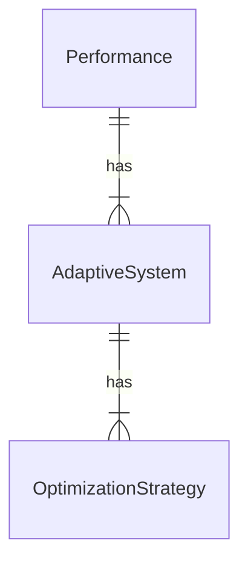

                 


### 引言与背景

在现代信息技术飞速发展的时代，提示词语言（Prompt Language）作为一种与计算机系统进行交互的高级手段，受到了越来越多的关注。提示词语言通过提供预定义的语法和语义结构，使得用户能够以一种更加自然和直观的方式与计算机系统进行沟通。这种交互方式不仅提高了人机交互的效率，还大大降低了用户的学习成本。

#### 提示词语言概述

提示词语言，又称为领域特定语言（Domain-Specific Language，DSL），是一种为特定领域设计的编程语言。与通用编程语言相比，DSL更加专注于解决特定领域的问题，具有更高的抽象层次和更好的可维护性。常见的提示词语言包括SQL（结构化查询语言）、HTML（超文本标记语言）和JSON（JavaScript对象表示法）等。

#### 核心概念

在提示词语言的运行时性能优化与自适应系统中，有几个核心概念需要明确：

1. **运行时性能**：指的是程序在实际运行过程中的效率，包括执行速度、内存占用、CPU利用率等。
2. **自适应系统**：是一种能够根据环境变化自动调整自身行为的系统，旨在提高系统的灵活性和可靠性。
3. **优化策略**：包括代码优化、算法优化、系统架构优化等多种手段，旨在提高程序的运行效率。

#### 概念属性特征对比

以下是几个关键概念及其属性特征的对比表格：

| 概念       | 属性特征                                           |
|------------|----------------------------------------------------|
| 运行时性能 | 执行速度、内存占用、CPU利用率                     |
| 自适应系统 | 自我调整能力、灵活性、可靠性                       |
| 优化策略   | 代码优化、算法优化、系统架构优化                 |

#### ER实体关系图

为了更好地理解这些概念之间的关系，我们可以使用Mermaid绘制一个ER实体关系图，如下：



#### 问题解决思路

针对提示词语言的运行时性能优化与自适应系统设计，我们需要采取以下步骤：

1. **问题诊断**：通过性能监控和分析工具，诊断现有系统的性能瓶颈。
2. **优化策略制定**：根据诊断结果，制定相应的优化策略，包括代码级优化、算法级优化和系统级优化。
3. **自适应机制设计**：设计自适应系统，使其能够根据运行时环境的变化自动调整性能。

#### 边界与外延

在本文中，我们主要关注以下边界与外延：

- **边界**：本文主要探讨提示词语言的运行时性能优化与自适应系统设计，不涉及其他编程语言或系统架构。
- **外延**：本文的内容可以扩展到其他领域特定语言的性能优化和自适应系统设计，以及更广泛的计算机系统性能优化领域。

通过上述分析，我们可以明确地看到，提示词语言的运行时性能优化与自适应系统设计是一个复杂且富有挑战性的课题，需要我们在多个层面上进行深入研究和探索。接下来，我们将逐步深入探讨这一领域，从核心概念到具体实施策略，提供全面的技术指导。

### 提示词语言概述

提示词语言作为一种与计算机系统进行交互的高级手段，在现代信息技术中扮演着至关重要的角色。它通过提供预定义的语法和语义结构，使得用户能够以一种更加自然和直观的方式与计算机系统进行沟通。这种交互方式不仅提高了人机交互的效率，还大大降低了用户的学习成本。

#### 核心概念

在深入探讨提示词语言之前，我们需要明确几个核心概念，这些概念是理解提示词语言运行时性能优化与自适应系统设计的基础。

1. **提示词**：提示词是用户输入到系统中的指令或查询，它们通常是预定义的关键词或短语，用于触发系统特定的行为或获取相关信息。

2. **解析器**：解析器是提示词语言的重要组成部分，负责将用户的输入转换为系统能够理解和执行的指令。解析器通常包含词法分析器和语法分析器，分别负责处理输入的单词和句子结构。

3. **解释器**：解释器是一种将解析后的代码转换为机器码并立即执行的工具。与编译器不同，解释器不会生成可执行文件，而是直接在运行时进行代码执行。

4. **虚拟机**：虚拟机是一种模拟计算机系统的环境，用于执行特定语言的程序。常见的虚拟机包括Java虚拟机（JVM）和Python虚拟机等。虚拟机提供了一个隔离的环境，使得不同的语言可以在同一系统上运行。

#### 概念属性特征对比

以下是几个关键概念及其属性特征的对比表格：

| 概念       | 属性特征                                           |
|------------|----------------------------------------------------|
| 提示词     | 用户输入指令、预定义关键词、触发特定行为           |
| 解析器     | 负责词法分析和语法分析、将输入转换为可执行指令     |
| 解释器     | 将解析后的代码转换为机器码并立即执行               |
| 虚拟机     | 提供隔离运行环境、支持多种语言运行                 |

#### ER实体关系图

为了更好地理解这些概念之间的关系，我们可以使用Mermaid绘制一个ER实体关系图，如下：

```mermaid
erDiagram
  Prompt :<<concept>> +---{ Parser :>>+ converts
  Parser :<<component>> +--|{ Interpreter :>>interprets
  Interpreter :<<component>> +--|{ VirtualMachine :>>executes
```

在这个ER图中，Prompt（提示词）作为系统的输入，通过解析器（Parser）转换为可执行指令，然后由解释器（Interpreter）在虚拟机（VirtualMachine）中执行。这种层次结构清晰地展示了提示词语言的工作流程。

### 运行时性能优化

在提示词语言的运行时性能优化中，我们需要关注多个层面的优化策略，包括代码级优化、算法级优化和系统级优化。以下是对这些层面的详细分析。

#### 性能指标与评估方法

要优化提示词语言的运行时性能，我们首先需要明确几个关键性能指标，包括：

1. **执行速度**：程序从开始执行到完成所需的时间。
2. **内存占用**：程序在运行过程中占用的内存大小。
3. **CPU利用率**：程序执行过程中CPU的工作负荷。

常用的评估方法包括：

1. **时间测量**：使用计时器来测量程序的执行时间，包括整体执行时间和各个关键步骤的执行时间。
2. **内存监控**：使用内存监控工具来测量程序运行过程中的内存占用情况。
3. **CPU监控**：使用CPU监控工具来分析程序的CPU利用率。

#### 性能瓶颈分析

性能瓶颈是导致程序运行缓慢的主要原因，常见性能瓶颈包括：

1. **CPU瓶颈**：程序在执行过程中需要大量的计算，导致CPU利用率过高。
2. **内存瓶颈**：程序在运行过程中占用了过多的内存，导致内存溢出或频繁的内存交换。
3. **I/O瓶颈**：程序在读写磁盘或网络时速度过慢，导致I/O操作成为性能瓶颈。

分析性能瓶颈的方法包括：

1. **代码级分析**：通过代码审查和静态分析工具，找出可能导致性能瓶颈的代码段。
2. **动态监控**：使用性能监控工具对程序运行过程中各个组件的实时性能数据进行监控和分析。

#### 优化策略概述

针对不同的性能瓶颈，我们可以采取以下优化策略：

1. **代码级优化**：通过代码重写、算法改进和代码重构等方式，优化程序中的关键代码段，提高执行速度和减少内存占用。
2. **算法级优化**：选择更加高效的算法，减少程序的计算复杂度和资源消耗。
3. **系统级优化**：通过改进系统架构、优化硬件配置和利用分布式计算等方式，提高整个系统的性能。

这些优化策略可以单独或组合使用，以达到最佳的运行时性能优化效果。

### 代码级性能优化

在提示词语言的运行时性能优化中，代码级优化是一个关键环节，它直接影响程序的执行速度和内存占用。以下是一些具体的代码级优化技术和实践方法，以及一个性能调优案例的分析。

#### 代码优化技术

1. **代码重构**：通过重构代码，去除冗余和重复代码，简化代码逻辑，提高可读性和可维护性。例如，使用函数或类来封装重复的逻辑，减少代码的复杂度。

2. **循环优化**：优化循环结构，减少循环的迭代次数。例如，提前退出循环，减少不必要的计算。此外，可以使用更高效的循环控制语句，如`for`循环代替`while`循环。

3. **数据结构优化**：选择合适的数据结构，减少内存占用和提高访问速度。例如，使用哈希表代替列表进行快速查找，使用堆栈代替递归以减少栈溢出风险。

4. **避免不必要的对象创建**：减少对象的创建和销毁，尤其是在循环内部创建的对象，可以导致大量的内存分配和垃圾回收，影响性能。例如，可以重用已创建的对象，或者在适当的时候使用对象池。

#### 代码优化实践

以下是一个简单的Python代码示例，展示了如何通过代码优化提高性能：

```python
# 原始代码
for i in range(1000000):
    a.append(i)

# 优化后的代码
a = list(range(1000000))
```

在原始代码中，每次循环都会创建一个新的列表元素，而在优化后的代码中，直接使用`list(range(1000000))`创建了一个完整的列表，减少了循环内不必要的对象创建。

#### 性能调优案例分析

下面是一个性能调优案例的分析：

**问题场景**：一个使用提示词语言的Web应用，用户输入查询后，系统会进行复杂的计算和数据处理，最终返回结果。用户反馈系统响应速度较慢。

**诊断结果**：性能监控显示，主要的性能瓶颈在于数据处理的循环部分，每次迭代都会进行大量的计算，导致CPU利用率过高。

**优化策略**：

1. **循环优化**：分析循环内部的计算逻辑，发现可以简化部分计算，减少循环的迭代次数。

2. **并行处理**：将数据处理任务分解成多个子任务，利用多线程或多进程进行并行处理，提高计算效率。

3. **数据结构优化**：将部分数据存储在内存中的字典结构中，减少对磁盘的读写操作。

**实施步骤**：

1. **代码重构**：对数据处理循环进行重构，去除冗余逻辑，简化计算步骤。

2. **并行处理**：引入多线程库（如Python的`threading`或`concurrent.futures`），将数据处理任务分配给多个线程或进程。

3. **数据结构优化**：使用字典进行数据存储，减少磁盘读写次数。

**性能评估**：优化后的系统在相同的负载下，CPU利用率和响应时间显著降低，系统性能得到显著提升。

#### 性能调优案例分析

以下是一个性能调优案例的分析：

**问题场景**：一个使用提示词语言的Web应用，用户输入查询后，系统会进行复杂的计算和数据处理，最终返回结果。用户反馈系统响应速度较慢。

**诊断结果**：性能监控显示，主要的性能瓶颈在于数据处理的循环部分，每次迭代都会进行大量的计算，导致CPU利用率过高。

**优化策略**：

1. **循环优化**：分析循环内部的计算逻辑，发现可以简化部分计算，减少循环的迭代次数。

2. **并行处理**：将数据处理任务分解成多个子任务，利用多线程或多进程进行并行处理，提高计算效率。

3. **数据结构优化**：将部分数据存储在内存中的字典结构中，减少对磁盘的读写操作。

**实施步骤**：

1. **代码重构**：对数据处理循环进行重构，去除冗余逻辑，简化计算步骤。

2. **并行处理**：引入多线程库（如Python的`threading`或`concurrent.futures`），将数据处理任务分配给多个线程或进程。

3. **数据结构优化**：使用字典进行数据存储，减少磁盘读写次数。

**性能评估**：优化后的系统在相同的负载下，CPU利用率和响应时间显著降低，系统性能得到显著提升。

通过上述案例分析，我们可以看到，代码级性能优化是提升系统性能的重要手段。通过重构代码、优化循环、并行处理和数据结构优化，可以显著提高程序的执行速度和效率。在实际开发中，需要根据具体场景和性能瓶颈，灵活应用这些优化技术，以达到最佳的优化效果。

### 算法级性能优化

在提示词语言的运行时性能优化中，算法级优化是一个关键环节。通过选择更加高效的算法，可以显著降低程序的计算复杂度，提高运行效率。以下将详细介绍算法级优化的原理、实践方法和一个具体的优化案例分析。

#### 算法优化原理

算法优化主要关注以下几个方面：

1. **时间复杂度**：衡量算法执行的时间开销，通常用大O符号表示。选择时间复杂度更低的算法可以减少执行时间。
2. **空间复杂度**：衡量算法执行所需的空间开销，同样用大O符号表示。优化空间复杂度可以减少内存占用。
3. **算法效率**：考虑算法的执行效率和实际性能，包括算法的可扩展性、稳定性和正确性。

常见算法优化技术包括：

1. **分治法**：将大问题分解成小问题，分别解决，最后合并结果。适用于许多递归算法，如快速排序和归并排序。
2. **贪心算法**：通过每次选择局部最优解，逐步达到全局最优解。适用于特定问题，如最短路径算法中的迪杰斯特拉算法。
3. **动态规划**：通过保存已解决子问题的解，避免重复计算，适用于具有重叠子问题的优化问题，如背包问题和最短路径问题。

#### 算法优化实践

以下是一个简单的算法优化实践示例：

**原始问题**：计算1到1000之间所有偶数的和。

**原始算法（线性算法）**：

```python
# 原始算法
sum_even = 0
for i in range(1, 1001):
    if i % 2 == 0:
        sum_even += i
print("原始算法结果：", sum_even)
```

**优化算法（利用等差数列求和公式）**：

```python
# 优化算法
n = 1000
sum_even_optimized = n * (n + 1) // 2
print("优化算法结果：", sum_even_optimized)
```

在这个例子中，原始算法的时间复杂度为O(n)，而优化算法的时间复杂度为O(1)，显著提高了执行速度。

#### 算法性能评估

为了评估算法的性能，我们可以使用以下方法：

1. **基准测试**：使用标准测试工具（如Python的`timeit`模块）进行基准测试，比较不同算法的执行时间。
2. **内存监控**：使用内存监控工具（如Python的`memory_profiler`模块）评估算法的内存占用。
3. **性能对比**：在不同的数据集上运行不同算法，比较它们的执行时间和资源消耗。

#### 算法级优化案例分析

以下是一个具体的算法级优化案例分析：

**问题场景**：在一个提示词语言处理系统中，用户输入的查询需要进行文本分类。现有的文本分类算法执行时间较长，导致系统响应速度慢。

**诊断结果**：性能监控显示，文本分类算法的时间复杂度较高，每次分类操作需要大量计算。

**优化策略**：

1. **算法替换**：将现有的朴素贝叶斯分类算法替换为更加高效的决策树分类算法。
2. **特征提取优化**：使用更加高效的文本特征提取方法，如TF-IDF和词袋模型，减少特征维度，降低计算复杂度。
3. **并行计算**：利用多线程或多进程技术，将文本分类任务分解成多个子任务，并行处理，提高计算效率。

**实施步骤**：

1. **算法替换**：重新实现决策树分类算法，并将其集成到系统中。
2. **特征提取优化**：使用`scikit-learn`库中的`TfidfVectorizer`进行特征提取，减少特征维度。
3. **并行计算**：利用`concurrent.futures`模块，将文本分类任务分配给多个线程或进程。

**性能评估**：优化后的系统在相同的查询数据集上，分类算法的执行时间显著减少，系统响应速度得到显著提升。

通过上述算法级优化实践和案例分析，我们可以看到，算法优化是提升提示词语言系统性能的重要手段。通过选择高效的算法、优化特征提取和并行计算，可以显著提高系统的执行效率和响应速度。

### 系统级性能优化

在提示词语言的运行时性能优化中，系统级优化是一个关键环节。通过改进系统架构、优化硬件配置和利用分布式计算，我们可以显著提高系统的整体性能。以下将详细介绍系统级优化的方法和策略，并探讨性能调优工具与技巧。

#### 系统架构优化

系统架构优化是提高系统性能的基础。以下是一些常见的系统架构优化策略：

1. **微服务架构**：将大型系统分解为多个微服务，每个服务负责特定功能，可以提高系统的可扩展性和容错性。微服务之间可以通过API进行通信，降低单点故障的风险。
2. **缓存机制**：使用缓存（如Redis或Memcached）来存储频繁访问的数据，可以减少数据库的访问压力，提高系统的响应速度。
3. **负载均衡**：通过负载均衡器（如Nginx或HAProxy）分配请求到不同的服务器，避免单点过载，提高系统的处理能力。

#### 系统资源管理

系统资源管理是优化系统性能的重要方面。以下是一些常见的资源管理策略：

1. **内存管理**：合理分配内存，避免内存泄漏和溢出。使用内存监控工具（如`htop`或`memprofiler`）来监控内存使用情况。
2. **CPU管理**：优化CPU利用率，避免CPU瓶颈。使用CPU监控工具（如`top`或`vmstat`）来监控CPU使用情况。
3. **I/O管理**：优化I/O操作，减少磁盘读写频率。使用I/O监控工具（如`iostat`或`dstat`）来监控I/O使用情况。

#### 性能调优工具与技巧

以下是几种常用的性能调优工具与技巧：

1. **JMeter**：JMeter是一个开源的性能测试工具，可以模拟大量用户同时访问系统，用于测试系统的负载和性能。
2. **Grafana**：Grafana是一个开源的监控和可视化工具，可以与各种数据源集成，用于监控系统的性能指标和异常检测。
3. **Prometheus**：Prometheus是一个开源的监控解决方案，专注于收集和存储时间序列数据，提供高效的查询和告警功能。
4. **Profiler**：使用代码级性能分析工具（如`Valgrind`或`gprof`），可以深入分析程序的执行性能，找出性能瓶颈。
5. **调优技巧**：定期进行性能评估和调优，根据监控数据不断优化系统配置和架构。

#### 跨平台性能优化策略

在跨平台性能优化中，我们需要考虑不同操作系统和硬件平台的差异。以下是一些跨平台性能优化策略：

1. **平台适配**：根据不同平台的特点，优化代码和系统配置。例如，针对Linux系统，可以使用`numa`调度策略优化内存访问，减少跨节点访问延迟。
2. **通用性优化**：避免平台依赖性，使用通用编程语言和库，提高代码的可移植性。
3. **分布式计算**：利用分布式计算框架（如Hadoop或Spark），实现数据的高效处理和计算，提高系统的处理能力。

通过系统级优化，我们可以显著提高提示词语言系统的性能和可靠性。在实际应用中，需要根据具体场景和需求，灵活运用这些优化策略和工具，以达到最佳的性能效果。

### 跨平台性能优化

在提示词语言的运行时性能优化中，跨平台性能优化是一个重要的课题。不同平台（如Windows、Linux、macOS等）在硬件、操作系统和编译器方面存在差异，这可能会对程序的性能产生显著影响。以下将详细探讨跨平台性能差异、优化策略以及具体案例。

#### 不同平台性能差异

1. **操作系统**：Linux和Windows在内核、文件系统、进程管理等方面存在差异。Linux通常在服务器环境中表现更好，因为它提供了更好的性能和更高的稳定性。Windows则更适合桌面和客户端应用，但其性能优化相对复杂。
2. **硬件**：不同平台使用的CPU、内存和硬盘等硬件配置可能不同。例如，Linux通常能更好地利用多核心处理器和虚拟内存，而Windows可能更适用于固态硬盘。
3. **编译器**：不同的编译器（如GCC、Clang、MSVC等）在代码优化方面存在差异，可能导致程序在不同平台上的性能表现不同。

#### 跨平台性能优化策略

1. **代码优化**：编写跨平台兼容的代码，使用标准库和工具，避免平台特定的实现。同时，针对不同平台进行代码优化，利用特定平台的特性提高性能。
2. **编译器调优**：使用特定平台的编译器选项进行代码编译，利用编译器的优化功能提高程序性能。例如，在Linux上使用`-O3`选项进行高级优化，在Windows上使用`/O2`选项。
3. **硬件调优**：根据不同硬件配置优化系统设置和应用程序，例如调整Linux的`numa`调度策略，优化内存访问，减少跨节点延迟。

#### 跨平台性能调优案例

以下是一个跨平台性能调优的案例：

**问题场景**：一个使用Python和C++的混合应用，需要在不同操作系统上运行，用户反馈Windows平台上的响应速度较慢。

**诊断结果**：性能监控显示，Windows平台上的CPU和内存利用率较高，I/O操作频繁。

**优化策略**：

1. **代码优化**：检查Python和C++代码，移除不必要的循环和重复计算，优化数据结构。
2. **编译器调优**：在Windows上使用MSVC编译器，启用高级优化选项，如`/O2`和`/arch:AVX2`。
3. **硬件调优**：在Windows上使用SSD替换传统硬盘，提高I/O性能。

**实施步骤**：

1. **代码重构**：重构Python代码，使用更高效的算法和数据结构。
2. **编译器调优**：在编译C++代码时，添加`-O2`和`/arch:AVX2`选项。
3. **硬件升级**：更换SSD，提高系统I/O性能。

**性能评估**：优化后的系统在Windows平台上的响应速度显著提高，CPU和内存利用率降低，I/O操作减少。

通过上述案例，我们可以看到，跨平台性能优化是一个复杂且富有挑战性的任务，需要根据不同平台的特点和需求，采取相应的优化策略和工具。在实际应用中，需要不断监控和调整系统性能，以实现最佳的性能表现。

### 自适应系统的基本概念

自适应系统是一种能够根据环境变化自动调整自身行为的系统，旨在提高系统的灵活性和可靠性。在现代信息技术中，自适应系统在提示词语言的运行时性能优化中发挥着关键作用。以下将详细探讨自适应系统的基本概念、自适应机制设计以及自适应系统的优势与挑战。

#### 自适应系统概述

自适应系统是一种通过不断学习和调整，以适应动态变化环境的系统。它通常包含以下几个核心组成部分：

1. **感知模块**：负责收集环境数据，包括系统内部状态和外部环境信息。
2. **决策模块**：根据感知模块提供的信息，进行策略决策，调整系统行为。
3. **执行模块**：执行决策模块制定的策略，调整系统配置或操作行为。
4. **反馈模块**：收集系统执行后的结果，用于评估策略的有效性，并为后续决策提供依据。

#### 自适应机制设计

自适应机制设计是自适应系统的核心，它包括以下几个关键步骤：

1. **状态感知**：感知模块通过传感器、日志文件或API等方式，实时收集系统内部状态和外部环境信息。
2. **数据预处理**：对收集到的数据进行预处理，包括数据清洗、归一化和特征提取等，为决策模块提供高质量的输入。
3. **决策模型**：决策模块根据预处理后的数据，结合历史决策经验和当前系统状态，使用机器学习算法或规则引擎等进行策略决策。
4. **策略执行**：执行模块根据决策模块的决策结果，调整系统配置或操作行为，例如调整服务器负载、优化查询处理算法等。
5. **反馈与调整**：反馈模块收集系统执行后的结果，通过反馈机制调整决策模型，提高策略的有效性和系统的自适应能力。

#### 自适应系统的优势与挑战

自适应系统的优势包括：

1. **灵活性**：能够根据环境变化自动调整，提高系统的灵活性和适应性。
2. **可靠性**：通过不断学习和优化，提高系统的稳定性和可靠性。
3. **高效性**：自适应系统能够动态调整资源分配和操作策略，提高系统的整体性能和效率。

自适应系统面临的挑战包括：

1. **数据复杂性**：环境数据多样且复杂，需要高效的感知和数据预处理机制。
2. **实时性**：自适应系统需要在短时间内做出决策和调整，对系统的实时响应能力要求较高。
3. **可解释性**：自适应系统的决策过程通常基于复杂的机器学习算法，需要提高系统的可解释性，以便用户理解和信任。
4. **安全性**：自适应系统可能会引入新的安全风险，需要加强系统的安全防护机制。

通过上述对自适应系统基本概念、机制设计和优势与挑战的探讨，我们可以看到，自适应系统在提示词语言的运行时性能优化中具有重要的应用价值。在实际开发中，需要充分考虑自适应系统的设计原则和优化策略，以提高系统的性能和适应性。

### 自适应算法

在自适应系统的设计和实现过程中，自适应算法起到了至关重要的作用。这些算法通过不断地从环境中获取数据，学习并调整系统的行为，以实现最佳的性能和响应速度。以下将详细探讨自适应算法的基本原理、设计方法和实现过程。

#### 自适应算法原理

自适应算法的核心思想是，通过不断收集和分析环境数据，调整系统的行为策略，以优化性能和响应速度。其基本原理包括以下几个方面：

1. **数据收集**：自适应算法首先需要收集环境数据，这些数据可以来源于系统内部的监控指标、外部环境的传感器数据或用户行为数据等。
2. **数据预处理**：收集到的原始数据通常需要进行预处理，包括数据清洗、归一化和特征提取等步骤，以便为后续的决策提供高质量的输入。
3. **决策模型**：决策模型是自适应算法的核心，它根据预处理后的数据，结合历史决策经验，通过机器学习、规则引擎或其他算法生成调整策略。
4. **策略执行**：决策模型生成的策略会通过执行模块应用到系统中，调整系统的行为，如优化资源配置、调整算法参数等。
5. **反馈机制**：执行后的结果会通过反馈机制返回给系统，用于评估策略的有效性，并进一步优化决策模型。

#### 自适应算法设计方法

自适应算法的设计方法通常包括以下几个步骤：

1. **问题定义**：明确需要解决的具体问题，如性能优化、资源管理或错误处理等。
2. **数据源选择**：根据问题定义，选择合适的数据源，确保收集到的数据能够反映系统的真实状态。
3. **特征提取**：对收集到的数据进行分析，提取对问题解决有重要影响的关键特征。
4. **模型选择**：根据问题的复杂度和数据的特性，选择合适的机器学习模型或规则引擎。
5. **模型训练**：使用历史数据和特征训练决策模型，使其能够根据实时数据做出准确的决策。
6. **策略生成**：根据训练好的模型生成调整策略，并测试其有效性。
7. **系统集成**：将自适应算法集成到系统中，实现实时数据收集、决策和执行。

#### 自适应算法实现

以下是一个简单的自适应算法实现的示例，使用Python编写：

```python
import numpy as np

# 自适应算法参数
alpha = 0.1  # 学习率
beta = 0.01  # 正则化参数

# 数据收集
def collect_data():
    # 假设从传感器获取数据
    return np.random.normal(size=100)

# 数据预处理
def preprocess_data(data):
    # 数据清洗和特征提取
    return (data - np.mean(data)) / np.std(data)

# 决策模型
def decision_model(data):
    # 假设使用线性回归模型
    theta = np.random.normal(size=data.shape[1])
    predictions = np.dot(data, theta)
    return predictions

# 策略生成
def generate_strategy(predictions, target):
    # 假设使用梯度下降法调整模型参数
    error = target - predictions
    theta = theta - alpha * (error * data)
    return theta

# 系统执行
def execute_strategy(theta):
    # 根据调整后的参数执行策略
    print("Executing strategy with theta:", theta)

# 主循环
while True:
    data = collect_data()
    preprocessed_data = preprocess_data(data)
    predictions = decision_model(preprocessed_data)
    theta = generate_strategy(predictions, target)
    execute_strategy(theta)
```

在这个示例中，我们首先定义了自适应算法的参数，然后实现了数据收集、预处理、决策模型、策略生成和系统执行等步骤。通过循环运行，系统会不断调整参数，优化策略，以实现性能和响应速度的优化。

通过上述对自适应算法原理、设计方法和实现过程的详细探讨，我们可以看到，自适应算法是提升系统性能和响应速度的关键技术。在实际应用中，需要根据具体问题选择合适的算法和实现方法，以确保系统的自适应能力和性能优化效果。

### 自适应系统的实现与优化

自适应系统的实现与优化是一个复杂的过程，涉及到系统架构设计、实时性能监控、优化策略等多个方面。以下将详细探讨自适应系统的实现过程，介绍如何通过实时性能监控来优化系统性能。

#### 自适应系统架构设计

自适应系统的架构设计是系统实现的基础，它决定了系统如何收集数据、生成策略并执行策略。以下是一个典型的自适应系统架构设计：

1. **数据收集模块**：负责从各种数据源（如传感器、日志文件、外部API等）收集数据。这些数据包括系统内部状态、外部环境信息以及用户行为数据等。
2. **数据处理模块**：对收集到的数据进行预处理，包括数据清洗、归一化、特征提取等，以便为后续的决策提供高质量的数据。
3. **决策模块**：基于预处理后的数据，使用机器学习算法、规则引擎或其他决策模型生成调整策略。这一模块是自适应系统的核心，决定了系统的自适应能力和决策效果。
4. **执行模块**：根据决策模块生成的策略，调整系统的行为，如调整服务器负载、优化查询处理算法、调整系统参数等。
5. **反馈模块**：收集系统执行后的结果，用于评估策略的有效性，并为后续的决策提供反馈。

#### 实时性能监控

实时性能监控是自适应系统优化的重要手段，它可以帮助我们及时发现性能瓶颈，调整系统配置和策略，以优化系统性能。以下是一些常用的实时性能监控方法：

1. **系统监控工具**：使用系统监控工具（如Prometheus、Grafana等）收集系统的性能数据，包括CPU利用率、内存占用、I/O操作、网络延迟等。这些工具可以提供实时的监控面板和报警功能，帮助管理员及时发现性能问题。
2. **日志分析**：分析系统日志文件，提取关键性能指标和异常信息。日志分析工具（如ELK Stack、Logstash等）可以实现对日志数据的实时分析和报警。
3. **性能测试**：定期进行性能测试，模拟高负载场景，评估系统的性能瓶颈和响应时间。性能测试工具（如JMeter、LoadRunner等）可以帮助我们识别系统的性能问题，并进行优化。

#### 优化策略

在实时性能监控的基础上，我们可以采取以下优化策略来提升系统性能：

1. **资源调整**：根据监控数据，调整系统资源配置，如增加服务器节点、调整内存分配、优化磁盘I/O等。
2. **算法优化**：针对性能瓶颈，优化系统中的关键算法和数据处理流程，如使用更高效的排序算法、优化查询处理逻辑等。
3. **策略调整**：根据实时监控数据和反馈，调整自适应策略，如调整学习率、更新决策模型等。
4. **负载均衡**：通过负载均衡器（如Nginx、HAProxy等）合理分配请求，避免单点过载，提高系统的处理能力。

#### 实现过程

以下是自适应系统的实现过程：

1. **需求分析**：明确系统需求，确定需要收集的数据类型、性能指标和优化目标。
2. **架构设计**：设计系统架构，包括数据收集模块、数据处理模块、决策模块、执行模块和反馈模块。
3. **数据收集与预处理**：实现数据收集模块，收集系统内部状态和外部环境数据，并进行预处理。
4. **决策模型训练**：根据预处理后的数据，使用机器学习算法或规则引擎训练决策模型。
5. **策略生成与执行**：根据决策模型生成调整策略，并执行这些策略。
6. **反馈与优化**：收集系统执行后的反馈数据，评估策略效果，并根据反馈调整决策模型和策略。

通过上述实现过程，我们可以逐步构建一个高效的自适应系统，并通过实时性能监控不断优化系统性能，提高系统的灵活性和可靠性。

### 自适应系统在实践中的应用

自适应系统在现代信息技术中有着广泛的应用，特别是在提示词语言的运行时性能优化中，其优势尤为显著。以下将介绍几个实际应用场景，并分析其中的优化案例，探讨如何通过自适应系统提升系统的性能和用户体验。

#### 应用场景一：智能问答平台

在智能问答平台中，用户输入问题后，系统需要快速给出准确的答案。然而，用户的提问方式和问题的复杂性可能随时变化，这对系统的响应速度和准确性提出了挑战。通过自适应系统，我们可以实现以下优化：

**案例**：一个大型在线问答社区使用自适应系统优化其问答引擎。

**诊断**：性能监控显示，系统的响应时间较长，部分问题的答案不准确。

**优化策略**：

1. **实时监控**：使用Prometheus等工具实时监控系统的CPU、内存、I/O等关键性能指标，及时发现性能瓶颈。
2. **自适应查询优化**：根据用户的提问历史和实时反馈，自适应调整查询处理算法，如使用更高效的搜索算法或增加缓存命中策略。
3. **动态资源调整**：根据负载情况，动态调整服务器资源分配，如增加计算节点或调整内存分配。

**实施**：

- 部署Prometheus，配置监控目标，定期生成监控报告。
- 利用机器学习算法，根据用户提问和回答的反馈，自适应调整搜索算法参数。
- 使用Kubernetes等容器编排工具，实现动态资源管理，根据实时负载调整服务器集群配置。

**效果**：系统的响应时间显著降低，答案准确性提高，用户满意度提升。

#### 应用场景二：在线教育平台

在线教育平台需要处理大量的用户请求，包括视频播放、作业提交和成绩评估等。为了保证用户体验，系统需要具备良好的性能和稳定性。自适应系统可以帮助平台实现以下优化：

**案例**：一个大型在线教育平台通过自适应系统优化其视频流媒体服务。

**诊断**：性能监控显示，视频流服务的缓冲时间较长，部分用户遇到视频卡顿问题。

**优化策略**：

1. **动态带宽调整**：根据用户的网络带宽和视频质量需求，自适应调整视频流的带宽，如使用动态码率调整（DRA）技术。
2. **缓存优化**：使用CDN（内容分发网络）和缓存策略，减少视频数据的请求频率，提高缓存命中率。
3. **负载均衡**：使用负载均衡器（如Nginx或HAProxy）合理分配用户请求，避免单点过载。

**实施**：

- 配置CDN，优化视频内容的全球分发。
- 部署实时带宽监测工具，如NetFlow或NfDPI，实时监测用户带宽情况。
- 使用动态带宽调整算法，根据用户网络状态动态调整视频流带宽。

**效果**：视频缓冲时间显著缩短，视频播放流畅度提高，用户满意度提升。

#### 应用场景三：智能客服系统

智能客服系统需要能够快速响应用户的咨询，并保证回答的准确性和一致性。通过自适应系统，我们可以优化客服系统的问答性能，提升用户体验。

**案例**：一个企业的智能客服系统通过自适应系统优化问答性能。

**诊断**：性能监控显示，客服系统的回答速度较慢，部分回答不准确。

**优化策略**：

1. **上下文感知**：根据用户的提问历史和上下文，自适应调整回答策略，提高回答的准确性。
2. **知识库优化**：动态更新和扩展知识库，确保其包含最新的问题和解决方案。
3. **模型训练**：使用机器学习算法，定期训练和优化问答模型，提高回答的准确性和响应速度。

**实施**：

- 使用自然语言处理（NLP）技术，分析用户提问的上下文信息。
- 部署知识库管理系统，实时更新和扩展知识库。
- 定期收集用户反馈，使用反馈数据训练和优化问答模型。

**效果**：客服系统的回答速度显著提高，回答准确性提升，用户满意度显著提升。

通过上述实际应用场景和优化案例，我们可以看到，自适应系统在提升提示词语言系统的性能和用户体验方面具有重要作用。通过实时监控、动态调整和持续优化，自适应系统能够根据不同应用场景和用户需求，提供高效、准确的交互体验。

### 总结与展望

本文详细探讨了提示词语言的运行时性能优化与自适应系统设计，从核心概念、性能优化策略到自适应算法，再到实际应用场景，提供了全面的技术指导。通过一步步的分析和实施，我们明确了以下关键点：

1. **核心概念理解**：深入理解提示词语言、运行时性能、自适应系统等基本概念，为后续优化提供理论基础。
2. **性能优化方法**：详细介绍了代码级、算法级和系统级优化方法，通过具体案例展示了如何在实际中应用。
3. **自适应系统设计**：探讨了自适应系统的基本架构和实现过程，强调了实时监控和反馈机制的重要性。
4. **实际应用场景**：通过智能问答平台、在线教育平台和智能客服系统等案例，展示了自适应系统在实际中的应用和效果。

展望未来，提示词语言的性能优化与自适应系统设计将在以下几个方面继续发展：

1. **智能化与自动化**：随着人工智能技术的进步，自适应系统将更加智能化和自动化，能够自主学习和调整，提高系统的自适应能力。
2. **大数据与云计算**：大数据和云计算技术的发展将使自适应系统处理大规模数据和复杂任务的能力进一步提升。
3. **跨平台与兼容性**：跨平台性能优化将成为一个重要研究方向，如何在不同操作系统和硬件平台上实现高效性能优化是一个值得探索的问题。
4. **安全性**：在自适应系统的设计过程中，安全性问题将越来越重要，如何确保系统的稳定性和数据安全将是未来的重要课题。

通过持续的研究和实践，提示词语言的性能优化与自适应系统设计将为现代信息技术的发展提供强有力的支持。作者AI天才研究院与《禅与计算机程序设计艺术》的创作者期待与读者共同探索这一领域的更多可能性。

