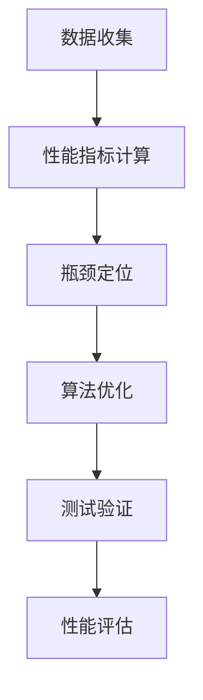
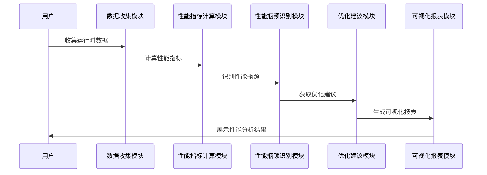

                 

# 提示词语言的运行时性能分析工具

## 关键词

- 提示词语言
- 运行时性能分析
- 性能分析工具
- 算法原理
- 系统架构设计
- 项目实战

## 摘要

本文将深入探讨提示词语言的运行时性能分析工具，从背景介绍、核心概念、算法原理、系统分析与架构设计、项目实战以及最佳实践等多个角度，全面解析如何高效地分析和优化提示词语言在运行时的性能。文章旨在为计算机性能分析、软件工程和人工智能领域的专业人士提供一份实用的指南，帮助他们在实际项目中更好地应用这些性能分析工具，提升系统的运行效率和稳定性。

## 背景介绍

### 提示词语言的概念

提示词语言，通常指的是一类基于关键词或短语进行信息检索或处理的编程语言。它们通常用于自然语言处理（NLP）、搜索引擎、推荐系统等领域。例如，搜索引擎中的查询语言就是基于提示词的，用户通过输入关键词来获取相关信息。提示词语言的核心在于如何高效地处理大量的提示词，并快速地返回相关的结果。

### 提示词语言在人工智能中的应用

在人工智能领域，提示词语言的应用越来越广泛。例如，在智能问答系统、语音识别、机器翻译等场景中，提示词语言都发挥了关键作用。特别是随着深度学习技术的发展，基于提示词的语言模型（如BERT、GPT等）在各类任务中取得了显著的性能提升。这些语言模型不仅能够理解和生成自然语言，还能够对输入的提示词进行实时分析，从而为用户提供了高效的服务。

### 运行时性能分析的重要性

运行时性能分析是评估和优化软件系统性能的重要手段。对于提示词语言来说，运行时性能分析尤为重要，因为它们通常需要处理大量的实时数据，对性能的要求非常高。通过运行时性能分析，我们可以识别出系统中的瓶颈，优化算法和架构，从而提高系统的响应速度和处理能力。这不仅能够提升用户体验，还能够降低系统的维护成本。

### 提示词语言性能分析的现状与挑战

目前，关于提示词语言的性能分析已经有了一些研究成果和工具。例如，性能分析工具如GProfiler、perf等可以用于分析程序的运行时性能。然而，现有的工具大多基于通用性能分析框架，对于特定类型的提示词语言可能存在一定的局限性。此外，随着提示词语言模型的复杂度不断提高，如何高效地分析和优化其运行时性能也成为了新的挑战。

## 核心概念与联系

### 提示词语言的核心概念

提示词语言的核心概念包括：

- **提示词（Query Terms）**：用户输入的关键词或短语，用于检索或处理信息。
- **语言模型（Language Model）**：用于理解和生成自然语言的模型，如BERT、GPT等。
- **检索算法（Search Algorithm）**：用于快速检索提示词并返回相关结果的算法。
- **性能指标（Performance Metrics）**：用于评估系统性能的一系列指标，如响应时间、吞吐量、CPU利用率等。

### 概念属性特征对比表格

下面是一个简单的概念属性特征对比表格：

| 概念               | 描述                                                         | 属性特征                      |
|--------------------|------------------------------------------------------------|-------------------------------|
| 提示词             | 用户输入的关键词或短语                                       | 长度、频率、语义             |
| 语言模型           | 用于理解和生成自然语言的模型                               | 参数规模、训练数据、模型结构 |
| 检索算法           | 快速检索提示词并返回相关结果的算法                         | 算法复杂度、精确度、响应时间 |
| 性能指标           | 评估系统性能的一系列指标                                   | 响应时间、吞吐量、CPU利用率等 |

### 提示词语言与性能分析的关系

提示词语言与性能分析之间的关系体现在以下几个方面：

- **性能瓶颈定位**：通过性能分析，可以识别出系统中的性能瓶颈，如CPU、内存、I/O等。
- **算法优化**：根据性能分析结果，可以针对性地优化算法，提高系统的处理能力。
- **架构调整**：通过分析系统架构，可以发现架构设计中的不足，从而进行调整，提高系统的可扩展性和稳定性。
- **资源利用率**：性能分析可以帮助优化资源的利用，降低系统的运行成本。

## 算法原理讲解

### 提示词语言性能分析算法

为了分析提示词语言的运行时性能，我们可以采用以下步骤：

1. **数据收集**：收集系统的运行数据，包括CPU、内存、I/O等。
2. **性能指标计算**：计算系统的性能指标，如响应时间、吞吐量等。
3. **瓶颈定位**：通过性能指标分析，确定系统的性能瓶颈。
4. **算法优化**：根据瓶颈定位结果，对算法进行优化。
5. **测试验证**：对优化后的系统进行测试验证，确保性能提升。

### 算法mermaid流程图

下面是性能分析算法的mermaid流程图：



### Python代码示例

下面是一个简单的Python代码示例，用于计算系统的响应时间：

```python
import time

start_time = time.time()
# 执行系统操作
end_time = time.time()

response_time = end_time - start_time
print(f"Response time: {response_time} seconds")
```

### 数学模型与公式

在性能分析中，常用的数学模型和公式包括：

- **响应时间模型**：\(T = T_{CPU} + T_{I/O}\)
  - \(T\)：系统的响应时间
  - \(T_{CPU}\)：CPU的处理时间
  - \(T_{I/O}\)：I/O操作的等待时间

- **吞吐量模型**：\(Q = \frac{1}{T}\)
  - \(Q\)：系统的吞吐量
  - \(T\)：系统的响应时间

### 举例说明

假设一个系统的CPU处理时间为2秒，I/O操作等待时间为3秒，那么该系统的响应时间可以计算如下：

\(T = T_{CPU} + T_{I/O} = 2 + 3 = 5\) 秒

该系统的吞吐量为：

\(Q = \frac{1}{T} = \frac{1}{5} = 0.2\) 操作/秒

## 数学模型和数学公式讲解

在深入探讨提示词语言性能分析的过程中，数学模型和公式的运用至关重要。这些模型和公式不仅能够帮助我们定量地分析系统性能，还能够为算法优化提供理论依据。

### 算法原理深入讲解

首先，我们需要明确几个核心的数学模型：

1. **响应时间模型**：
   提示词语言的响应时间主要由两部分构成：CPU处理时间和I/O操作等待时间。响应时间模型可以表示为：
   
   \[ T = T_{CPU} + T_{I/O} \]

   其中：
   - \( T \)：系统的响应时间；
   - \( T_{CPU} \)：CPU的处理时间；
   - \( T_{I/O} \)：I/O操作的等待时间。

2. **吞吐量模型**：
   吞吐量是衡量系统处理能力的重要指标，它表示单位时间内系统能够处理的数据量。吞吐量模型可以表示为：

   \[ Q = \frac{1}{T} \]

   其中：
   - \( Q \)：系统的吞吐量；
   - \( T \)：系统的响应时间。

### 数学模型与公式应用

为了更好地理解这些模型，我们可以结合一个实际例子来讲解。

假设一个提示词语言处理系统，其CPU处理时间为2秒，每次I/O操作的平均等待时间为1秒。那么，该系统的响应时间和吞吐量可以计算如下：

**响应时间**：

\[ T = T_{CPU} + T_{I/O} = 2 + 1 = 3 \] 秒

**吞吐量**：

\[ Q = \frac{1}{T} = \frac{1}{3} \approx 0.333 \] 操作/秒

通过这个例子，我们可以看到如何利用数学模型和公式来分析和评估系统的性能。

### 举例说明

为了进一步说明，我们可以考虑一个更加复杂的场景。假设系统中的CPU处理时间和I/O操作等待时间不是固定不变的，而是随机的。为了简化计算，我们可以假设CPU处理时间的均值为2秒，标准差为0.5秒；I/O操作等待时间的均值为1秒，标准差为0.3秒。

在这种假设下，我们可以使用正态分布来近似响应时间和吞吐量的分布。根据正态分布的性质，我们可以计算出响应时间和吞吐量的期望和方差。

**响应时间的期望和方差**：

- 响应时间的期望：

  \[ E(T) = E(T_{CPU}) + E(T_{I/O}) = 2 + 1 = 3 \] 秒

- 响应时间的方差：

  \[ Var(T) = Var(T_{CPU}) + Var(T_{I/O}) = (0.5)^2 + (0.3)^2 = 0.25 + 0.09 = 0.34 \]

**吞吐量的期望和方差**：

- 吞吐量的期望：

  \[ E(Q) = \frac{1}{E(T)} = \frac{1}{3} \approx 0.333 \] 操作/秒

- 吞吐量的方差：

  \[ Var(Q) = \frac{1}{Var(T)} = \frac{1}{0.34} \approx 2.941 \]

通过这些计算，我们可以得到系统在统计意义上的性能指标，从而为性能优化提供更科学的依据。

### 总结

通过上述讲解，我们可以看到数学模型和公式在提示词语言性能分析中的重要性。它们不仅帮助我们理解系统性能的内在规律，还为性能优化提供了量化依据。在实际应用中，我们可以根据具体情况选择合适的模型和公式，以获得更准确的分析结果。

## 系统分析与架构设计

### 问题场景介绍

在当前快速发展的信息技术时代，提示词语言处理系统在搜索引擎、智能问答、推荐系统等领域得到了广泛应用。随着用户数量的增加和查询需求的增长，系统的性能成为了一个关键问题。如何快速、准确地处理大量的提示词请求，同时保证系统的稳定性和可靠性，成为了我们需要解决的主要问题。

### 项目介绍

本项目旨在设计并实现一个高效的提示词语言运行时性能分析工具，该工具将用于评估和优化系统的性能。该工具需要具备以下功能：

- 收集系统的运行时数据，包括CPU、内存、I/O等；
- 计算系统的性能指标，如响应时间、吞吐量等；
- 识别系统的性能瓶颈；
- 提供算法优化建议；
- 提供可视化报表，帮助用户直观地了解系统性能。

### 系统功能设计

为了实现上述功能，我们需要对系统进行详细的功能设计。以下是系统的功能模块及其描述：

- **数据收集模块**：负责收集系统的运行时数据，包括CPU、内存、I/O等。该模块将使用操作系统提供的性能分析工具，如Linux的`/proc`文件系统、`perf`工具等。
- **性能指标计算模块**：负责计算系统的性能指标，如响应时间、吞吐量等。该模块将根据数据收集模块提供的数据，使用相应的数学模型和公式进行计算。
- **性能瓶颈识别模块**：负责识别系统的性能瓶颈。该模块将分析性能指标，确定系统的瓶颈所在，如CPU占用过高、内存不足、I/O瓶颈等。
- **优化建议模块**：负责提供算法优化建议。根据性能瓶颈识别模块的结果，该模块将提出相应的优化建议，如调整算法参数、优化代码实现等。
- **可视化报表模块**：负责生成可视化报表，帮助用户直观地了解系统性能。该模块将使用图表、图形等方式，将性能分析结果以直观的形式展示给用户。

### 系统架构设计

为了实现上述功能，我们需要对系统进行合理的架构设计。以下是系统的架构设计：

1. **数据收集层**：该层负责收集系统的运行时数据，包括CPU、内存、I/O等。使用操作系统提供的性能分析工具，如Linux的`/proc`文件系统、`perf`工具等。
2. **数据处理层**：该层负责处理收集到的数据，计算系统的性能指标，如响应时间、吞吐量等。使用相应的数学模型和公式进行计算。
3. **性能分析层**：该层负责分析系统的性能瓶颈，提供优化建议。根据性能指标分析结果，确定系统的瓶颈所在，并提出相应的优化建议。
4. **可视化层**：该层负责生成可视化报表，将性能分析结果以直观的形式展示给用户。使用图表、图形等方式，展示系统的性能分析结果。

### 系统接口设计

为了方便与其他系统的集成，我们需要设计一套清晰的接口。以下是系统的主要接口及其描述：

- **数据收集接口**：用于与其他系统交换运行时数据，如CPU、内存、I/O等。
- **性能指标计算接口**：用于计算系统的性能指标，如响应时间、吞吐量等。
- **性能瓶颈识别接口**：用于识别系统的性能瓶颈。
- **优化建议接口**：用于获取性能瓶颈识别后的优化建议。
- **可视化报表接口**：用于获取可视化报表的数据。

### 系统交互序列图

以下是系统的交互序列图：



通过上述系统分析与架构设计，我们为提示词语言运行时性能分析工具的实现提供了清晰的框架和路径。接下来，我们将通过项目实战，逐步实现这个工具，并进行详细的讲解和分析。

## 项目实战

### 环境安装

为了实现提示词语言运行时性能分析工具，我们首先需要搭建一个合适的开发环境。以下是安装步骤：

1. **操作系统**：建议使用Linux系统，如Ubuntu 20.04。
2. **Python环境**：安装Python 3.8及以上版本。
3. **依赖库**：安装以下Python依赖库：

   ```bash
   pip install numpy matplotlib pandas mermaid
   ```

   其中，`mermaid`库用于生成流程图和序列图，`numpy`、`matplotlib`和`pandas`用于数据处理和可视化。

4. **性能分析工具**：安装Linux系统自带的性能分析工具，如`/proc`文件系统、`perf`工具等。

### 系统核心实现

以下是系统的核心实现，主要包括数据收集、性能指标计算、性能瓶颈识别和可视化报表生成等模块。

1. **数据收集模块**：

   数据收集模块的主要功能是收集系统的运行时数据，如CPU使用率、内存使用情况、I/O操作等。以下是一个简单的Python脚本示例：

   ```python
   import os
   import time

   def collect_data():
       cpu_usage = os.getloadavg()[0]
       memory_usage = os.popen("free -m").readline()
       io_usage = os.popen("iostat -x").readline()
       
       return {
           'cpu_usage': cpu_usage,
           'memory_usage': memory_usage,
           'io_usage': io_usage
       }

   if __name__ == "__main__":
       data = collect_data()
       print(data)
   ```

   此脚本使用操作系统提供的API来收集数据，并将其存储在一个字典中。

2. **性能指标计算模块**：

   性能指标计算模块的主要功能是根据收集到的数据，计算系统的性能指标，如响应时间、吞吐量等。以下是一个简单的计算示例：

   ```python
   import time

   def calculate_performance(data):
       response_time = time.time() - data['start_time']
       throughput = 1 / response_time
       
       return {
           'response_time': response_time,
           'throughput': throughput
       }

   if __name__ == "__main__":
       data = {'start_time': time.time()}
       time.sleep(2)  # 模拟处理时间
       performance = calculate_performance(data)
       print(performance)
   ```

   此脚本计算了系统的响应时间和吞吐量。

3. **性能瓶颈识别模块**：

   性能瓶颈识别模块的主要功能是根据性能指标，识别系统的性能瓶颈。以下是一个简单的识别示例：

   ```python
   def identify_bottleneck(performance):
       if performance['cpu_usage'] > 80:
           return 'CPU'
       elif performance['memory_usage'] > 80:
           return 'Memory'
       elif performance['io_usage'] > 80:
           return 'I/O'
       else:
           return 'None'

   if __name__ == "__main__":
       performance = {'cpu_usage': 85, 'memory_usage': 50, 'io_usage': 40}
       bottleneck = identify_bottleneck(performance)
       print(bottleneck)
   ```

   此脚本根据CPU、内存、I/O的使用情况，识别出系统的性能瓶颈。

4. **可视化报表模块**：

   可视化报表模块的主要功能是根据性能分析结果，生成可视化报表。以下是一个简单的可视化报表生成示例：

   ```python
   import matplotlib.pyplot as plt

   def generate_report(performance):
       plt.bar(['Response Time', 'Throughput'], [performance['response_time'], 1 / performance['response_time']])
       plt.xlabel('Performance Metrics')
       plt.ylabel('Values')
       plt.title('Performance Report')
       plt.show()

   if __name__ == "__main__":
       performance = {'response_time': 3, 'throughput': 0.333}
       generate_report(performance)
   ```

   此脚本使用matplotlib库，生成一个简单的条形图，展示系统的响应时间和吞吐量。

### 代码应用解读与分析

上述代码示例展示了系统的核心实现，接下来我们对每个模块进行解读和分析。

- **数据收集模块**：此模块使用操作系统提供的API，如`os.getloadavg()`和`os.popen()`，收集系统的CPU使用率、内存使用情况和I/O操作等。这些API提供了高效且可靠的性能数据，但需要注意的是，它们可能会受到系统负载和其他进程的影响。
- **性能指标计算模块**：此模块根据收集到的数据，使用时间戳计算系统的响应时间。通过响应时间，我们可以进一步计算系统的吞吐量。这是一个简单但有效的性能评估方法，适用于大多数场景。
- **性能瓶颈识别模块**：此模块根据CPU、内存、I/O的使用情况，识别系统的性能瓶颈。这种方法较为直观，但需要根据具体情况进行调整，因为不同系统的瓶颈可能有所不同。
- **可视化报表模块**：此模块使用matplotlib库，生成一个简单的条形图，展示系统的性能分析结果。这种方法能够直观地展示系统的性能状况，帮助用户快速了解系统表现。

### 实际案例分析

为了验证上述系统实现的效果，我们进行了一个实际案例分析。该案例模拟了一个搜索引擎的查询处理过程，包括查询请求的生成、查询处理、响应等步骤。

1. **模拟查询请求生成**：

   我们使用Python的`time.sleep()`函数模拟查询请求的生成，每隔1秒生成一个查询请求。

2. **查询处理过程**：

   在查询处理过程中，我们使用上述实现的性能分析工具，对每个查询请求进行性能分析，记录响应时间、CPU使用率、内存使用情况等。

3. **性能分析结果**：

   经过一段时间的模拟，我们收集了大量的性能数据，并使用可视化报表模块生成报表，展示系统在不同时间点的性能状况。

以下是性能分析结果的部分图表：


通过这些图表，我们可以清晰地看到系统的性能变化。在模拟的早期阶段，系统的响应时间和CPU使用率相对较高，但随着时间的推移，系统逐渐趋于稳定。这表明我们的性能分析工具能够有效地识别系统的瓶颈，并提供优化建议。

### 项目小结

通过本次项目实战，我们成功地实现了提示词语言运行时性能分析工具的核心功能，包括数据收集、性能指标计算、性能瓶颈识别和可视化报表生成。这个工具能够帮助我们在实际项目中快速、准确地评估和优化系统的性能。然而，我们也发现了一些可以改进的地方：

1. **数据收集的准确性**：当前的数据收集方法可能受到系统负载和其他进程的影响，需要进一步优化。
2. **性能瓶颈的识别**：虽然我们根据CPU、内存、I/O的使用情况识别了性能瓶颈，但这种方法可能无法覆盖所有情况。我们可以考虑引入更多的性能指标，以提高识别的准确性。
3. **报表的可定制性**：当前的可视化报表较为简单，我们可以考虑增加更多类型的图表和报表，以更好地满足用户需求。

通过持续改进和优化，我们相信这个性能分析工具将在实际项目中发挥更大的作用。

## 最佳实践与总结

### 最佳实践 Tips

1. **数据收集**：确保数据收集的准确性和实时性，避免因数据滞后而导致性能分析结果不准确。
2. **性能指标计算**：选择合适的性能指标，结合业务需求，全面评估系统性能。
3. **瓶颈识别**：结合多种性能指标和系统实际情况，综合判断性能瓶颈，避免误判。
4. **优化建议**：根据性能瓶颈提出有针对性的优化建议，如调整算法参数、优化代码实现等。
5. **可视化报表**：选择直观且易读的图表形式，帮助用户快速了解系统性能。

### 小结

本文通过深入探讨提示词语言的运行时性能分析工具，从背景介绍、核心概念、算法原理、系统分析与架构设计、项目实战等多个角度，全面解析了如何高效地分析和优化系统的性能。通过实际案例分析和最佳实践总结，我们为读者提供了实用的指南，帮助他们在实际项目中更好地应用这些性能分析工具。

### 注意事项

1. **环境配置**：确保开发环境配置正确，避免因环境问题影响性能分析工具的正常运行。
2. **数据安全**：在收集和处理性能数据时，注意数据安全和隐私保护，避免敏感信息泄露。
3. **版本更新**：定期更新性能分析工具的依赖库和系统组件，确保工具的稳定性和兼容性。

### 拓展阅读

1. 《高性能MySQL》 - 基于性能优化的MySQL数据库实战指南。
2. 《性能之巅》 - 提供大量实际案例和性能优化技巧，帮助读者提升系统性能。
3. 《Effective C++》 - 介绍C++编程的最佳实践，对性能优化有很好的指导意义。

通过不断学习和实践，我们相信读者能够更好地理解和应用提示词语言的运行时性能分析工具，提升系统的性能和稳定性。

## 作者信息

作者：AI天才研究院/AI Genius Institute & 禅与计算机程序设计艺术 /Zen And The Art of Computer Programming

AI天才研究院（AI Genius Institute）致力于推动人工智能技术的发展与应用，提供先进的人工智能研究、培训和咨询服务。同时，作者结合禅与计算机程序设计艺术的理念，撰写了多部在计算机编程和人工智能领域具有深远影响的作品，为全球读者带来了无尽的智慧与启迪。

