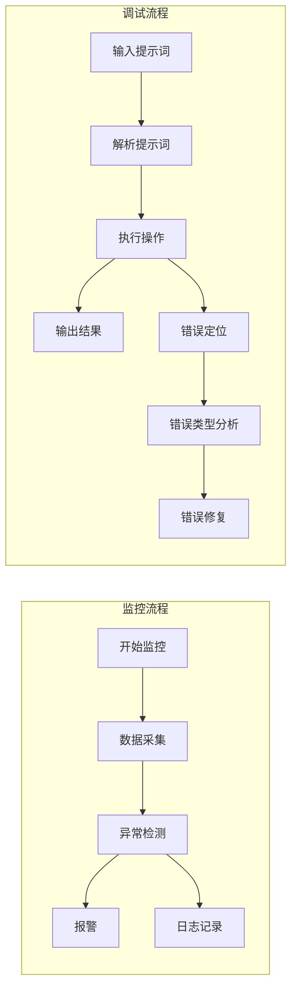
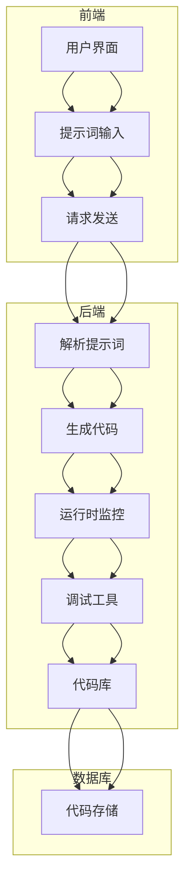
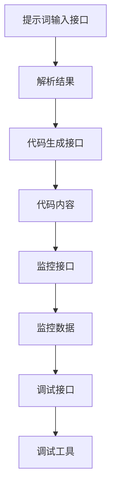
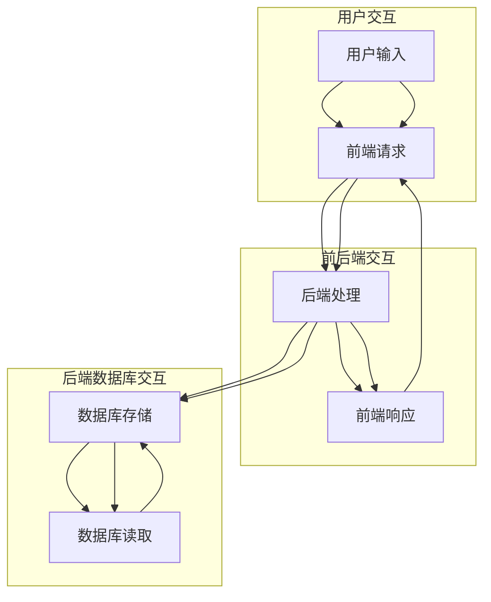

                 

# 提示词语言的运行时监控与调试

关键词：运行时监控、调试、提示词语言、算法、系统架构

摘要：本文深入探讨了提示词语言的运行时监控与调试技术，通过详细分析核心概念、算法原理、系统架构，以及实际项目应用，为读者提供了一系列实用技巧和最佳实践。本文旨在帮助程序员更好地理解这一领域，提高他们在开发过程中的效率和代码质量。

## 引言

在现代软件开发中，提示词语言（Prompt Languages）作为一种强大的工具，广泛应用于自然语言处理、自动化测试、代码生成等领域。然而，随着应用的深入，运行时监控与调试提示词语言程序变得尤为重要。本文将围绕这一主题，逐步分析并探讨相关的核心概念、算法原理、系统架构和实际项目应用。

本文首先介绍了运行时监控与调试的背景和必要性，然后详细阐述了提示词语言的核心概念和结构，接着深入解析了相关的算法原理和实现方法。在此基础上，本文通过实际项目案例，展示了运行时监控与调试在实际开发中的应用，并总结了最佳实践和注意事项。

本文的章节结构如下：

1. **背景与核心概念**：介绍运行时监控与调试的背景、必要性，以及提示词语言的核心概念。
2. **核心概念与关系**：详细阐述提示词语言的基本原理和结构，包括属性特征对比表格和实体关系图。
3. **算法原理与实现**：分析提示词语言的算法原理，使用Mermaid和Python代码进行讲解。
4. **系统分析与设计**：介绍问题场景、项目细节、系统功能设计、系统架构和接口设计。
5. **项目实战**：展示实际项目中的应用，包括环境配置、核心代码实现、代码分析和案例剖析。
6. **最佳实践与注意事项**：总结最佳实践、注意事项，以及拓展阅读。

## 背景与核心概念

### 运行时监控与调试的背景

在软件开发过程中，程序在运行时可能会出现各种错误和异常，这给开发者带来了极大的困扰。运行时监控与调试技术的出现，旨在实时检测、分析并解决这些问题，从而提高软件质量和开发效率。

运行时监控（Runtime Monitoring）是指对程序在运行过程中的各种行为和性能进行实时监测，包括资源消耗、错误日志、异常处理等。通过监控，开发者可以及时发现潜在问题，并进行相应的优化和调整。

调试（Debugging）则是指发现和修复程序中的错误。在提示词语言中，调试尤为重要，因为提示词的执行过程往往涉及到复杂的自然语言理解和推理。调试的目的是确保程序能够按照预期运行，并输出正确的结果。

### 提示词语言的核心概念

提示词语言是一种基于自然语言处理的编程语言，它通过自然语言表达式的形式，实现对代码生成、测试自动化等任务的自动化处理。提示词语言的核心概念包括：

1. **提示词（Prompt）**：提示词是指用来触发特定行为的自然语言表达式。例如，在代码生成中，提示词可以是一个函数名称或方法名称，用来指示生成器生成相应的代码。
2. **语法（Syntax）**：提示词语言的语法规则决定了提示词的表达形式。例如，提示词可能需要以特定的关键字或符号开头，或者需要按照特定的语法结构进行组合。
3. **语义（Semantic）**：提示词语言的语义是指提示词所表示的实际含义。在代码生成中，提示词的语义决定了生成器生成代码的上下文和内容。
4. **上下文（Context）**：上下文是指提示词语言在特定环境下的应用场景。上下文信息可以帮助解析器正确理解提示词的含义，从而生成或执行正确的操作。
5. **解释器（Interpreter）**：解释器是提示词语言的执行引擎，它负责将提示词转换为相应的操作，并执行这些操作。解释器通常采用递归下降分析法和上下文无关文法等算法来实现。

### 核心概念之间的关系

提示词语言的各个核心概念之间存在着紧密的联系。提示词是语言表达的基本单元，语法规则定义了提示词的表达形式，语义则决定了提示词的实际含义。上下文为提示词的语义提供了具体的场景，解释器则负责将提示词转换为操作并执行。

例如，在一个代码生成任务中，提示词“生成函数”可能需要满足以下语法规则：

1. 提示词必须以关键字“生成”开头。
2. 提示词后面必须跟一个函数名称。
3. 函数名称必须符合一定的命名规范。

在解释器的作用下，这个提示词将被解析并执行，生成相应的函数代码。

### 提示词语言的优势

提示词语言具有以下优势：

1. **易用性**：提示词语言使用自然语言进行编程，降低了学习门槛，使非专业开发者也能快速上手。
2. **灵活性**：提示词语言允许开发者根据需求灵活定义和扩展语法规则，从而满足各种复杂场景的需求。
3. **高效性**：提示词语言的解释器通常采用高效的算法，使得程序执行速度更快，资源消耗更低。
4. **可维护性**：提示词语言的可读性和可维护性较高，便于开发者进行代码管理和维护。

总之，运行时监控与调试是提示词语言应用中不可或缺的一环。通过本文的讨论，我们将深入理解这一领域，掌握相关技术，提高软件开发效率和质量。

## 核心概念与关系

### 基本原理

提示词语言作为一种自然语言处理工具，其基本原理主要包括自然语言处理技术、上下文处理和语义理解。以下是对这些基本原理的详细解释：

#### 自然语言处理技术

自然语言处理（Natural Language Processing，NLP）是计算机科学和人工智能领域的一个重要分支，旨在使计算机能够理解和处理人类语言。NLP技术包括文本分类、情感分析、命名实体识别、语义角色标注等。在提示词语言中，NLP技术被用来解析和解释自然语言表达式。

**文本分类**：文本分类是将文本数据分为预定义的类别。例如，将用户输入的提示词分类为代码生成、测试自动化等。

**情感分析**：情感分析用于判断文本表达的情感倾向，如积极、消极或中立。在提示词语言中，情感分析可以帮助理解用户的意图。

**命名实体识别**：命名实体识别（Named Entity Recognition，NER）用于识别文本中的特定实体，如人名、地点、组织等。NER对于正确理解提示词的上下文非常重要。

**语义角色标注**：语义角色标注用于识别文本中的动作及其相关对象，如“购买商品”中的“购买”是动作，“商品”是动作的对象。

#### 上下文处理

上下文处理（Context Handling）是指在不同情境下对自然语言表达进行理解和解释。在提示词语言中，上下文处理尤为重要，因为它决定了提示词的语义和执行顺序。

上下文包括以下几种类型：

**历史上下文**：历史上下文记录了之前的输入和输出，有助于理解当前输入的含义。例如，在代码生成中，之前的函数调用历史可以影响后续代码的生成。

**环境上下文**：环境上下文包括系统状态和外部环境信息，如系统变量、环境配置等。环境上下文对于执行特定操作至关重要。

**交互上下文**：交互上下文涉及用户与系统之间的交互历史，包括用户的输入和系统的反馈。交互上下文可以帮助系统更好地理解用户的意图。

#### 语义理解

语义理解（Semantic Understanding）是指对自然语言表达式的真实意图进行解释和处理。语义理解是提示词语言的核心，它确保系统能够正确执行用户指令。

语义理解包括以下几个方面：

**词义消歧**：词义消歧（Word Sense Disambiguation，WSD）是指确定一个多义词在特定上下文中的准确含义。例如，在代码生成中，提示词“生成”可以表示代码生成、数据生成等，需要根据上下文进行消歧。

**意图识别**：意图识别（Intent Recognition）是指确定用户输入的提示词所代表的行为意图。例如，在代码生成中，意图识别可以帮助系统确定用户希望生成哪种类型的代码。

**实体识别**：实体识别（Entity Recognition）是指识别提示词中的特定实体，如函数名、类名等。实体识别对于生成正确的代码至关重要。

### 概念属性特征对比表格

为了更好地理解提示词语言的核心概念，我们可以通过一个属性特征对比表格来进行分类和对比：

| 概念 | 属性特征 |
| --- | --- |
| 提示词 | - 语法结构<br>- 语义含义<br>- 上下文依赖 |
| 语法 | - 规则定义<br>- 标记符号<br>- 结构化表达 |
| 语义 | - 意义解释<br>- 消歧处理<br>- 意图识别 |
| 上下文 | - 历史记录<br>- 环境信息<br>- 交互历史 |

### 实体关系图

为了直观地展示提示词语言的核心概念之间的关系，我们可以使用Mermaid绘制一个实体关系图（Entity Relationship Diagram，ERD）。以下是一个简单的Mermaid ER图示例：

```mermaid
erDiagram
  A[提示词] ||--|{ B[语法] } : "遵循"
  A ||--|{ C[语义] } : "表达"
  A ||--|{ D[上下文] } : "依赖"
  B ||--|{ C } : "定义"
  B ||--|{ D } : "规则"
  C ||--|{ D } : "解释"
```

在这个ER图中，提示词与语法、语义和上下文之间存在关联。语法定义了提示词的语法结构，语义解释了提示词的含义，上下文则影响了提示词的执行。

通过实体关系图，我们可以更清晰地理解提示词语言的核心概念及其相互关系，为后续算法原理和系统设计的讨论打下基础。

## 算法原理与实现

### 运行时监控的算法原理

运行时监控的核心目标是实时检测和报告程序在运行过程中的异常行为。这通常涉及以下步骤：

1. **数据采集**：收集程序运行时的各种数据，如CPU使用率、内存占用、输入输出等。
2. **异常检测**：使用统计方法、机器学习算法等，对采集到的数据进行分析，识别出异常行为。
3. **报警和日志记录**：一旦检测到异常，系统应立即触发报警并记录相应的日志信息。

以下是一个简单的Mermaid流程图，展示了运行时监控的基本流程：

```mermaid
flowchart LR
    subgraph 数据采集
        数据采集[数据采集]
        CPU使用率[CPU使用率]
        内存占用[内存占用]
        输入输出[输入输出]
    end
    subgraph 数据分析
        异常检测[异常检测]
    end
    subgraph 日志记录
        报警[报警]
        日志记录[日志记录]
    end
    数据采集 --> 数据分析
    数据分析 --> 日志记录
    数据分析 --> 报警
```

### 调试的算法原理

调试的目的是定位和修复程序中的错误。调试算法通常包括以下步骤：

1. **错误定位**：通过分析日志、错误信息等，确定错误的可能位置。
2. **错误类型分析**：根据错误现象，分析错误的类型，如语法错误、逻辑错误等。
3. **错误修复**：根据错误类型，采取相应的修复措施。

以下是一个简单的Mermaid流程图，展示了调试的基本流程：


### Mermaid流程图与Python代码示例

为了更好地理解上述算法原理，我们可以结合具体的Mermaid流程图和Python代码示例进行讲解。

#### Mermaid流程图示例

以下是一个简单的Mermaid流程图，用于展示一个简单的提示词语言的运行时监控和调试过程：



#### Python代码示例

以下是一个简单的Python代码示例，用于展示运行时监控和调试的过程：

```python
# 导入必要的库
import time
import random

# 定义监控函数
def monitor_performance():
    start_time = time.time()
    # 假设这是一个耗时的操作
    time.sleep(random.randint(1, 5))
    end_time = time.time()
    print(f"Operation took {end_time - start_time} seconds.")

# 定义调试函数
def debug_prompt():
    prompt = input("请输入提示词：")
    try:
        # 假设这是一个根据提示词执行操作的函数
        if prompt == "监控":
            monitor_performance()
        elif prompt == "调试":
            print("进入调试模式...")
            # 这里可以添加具体的调试逻辑
        else:
            print("未识别的提示词。")
    except Exception as e:
        print(f"发生错误：{e}")

# 执行调试函数
debug_prompt()
```

#### 算法原理的详细讲解

1. **数据采集**：监控函数`monitor_performance`通过`time.time()`函数记录操作的开始和结束时间，从而采集到操作耗时。这可以用于监控程序的性能。
   
2. **异常检测**：通过分析采集到的数据，如果操作耗时超过一定的阈值，则认为出现了异常。在实际应用中，可以使用更复杂的统计方法或机器学习算法来检测异常。

3. **报警和日志记录**：如果检测到异常，系统会触发报警并记录相应的日志信息，以便后续分析和处理。

4. **错误定位**：调试函数`debug_prompt`通过输入用户提示词，根据提示词执行相应的操作。如果出现错误，会捕获异常并打印错误信息。

5. **错误类型分析**：通过分析捕获的异常，可以确定错误的类型。例如，如果是一个类型错误，则需要检查提示词是否符合预期格式。

6. **错误修复**：根据错误类型，可以采取相应的修复措施，如修改输入的提示词格式、检查代码逻辑等。

通过上述Python代码示例，我们可以看到运行时监控和调试的基本实现原理。在实际应用中，这些原理可以进一步扩展和优化，以满足不同场景的需求。

### 数学模型和公式

在运行时监控与调试中，数学模型和公式起到了关键作用。以下是一些常见的数学模型和公式，以及它们在监控与调试中的应用：

1. **性能评估指标**：

   - 平均响应时间（Average Response Time，ART）：
     $$ART = \frac{\sum_{i=1}^{n} t_i}{n}$$
     其中，\(t_i\) 是第 \(i\) 次操作的响应时间，\(n\) 是操作的总次数。ART用于衡量系统的平均性能。

   - 最大响应时间（Maximum Response Time，MRT）：
     $$MRT = \max(t_i)$$
     MRT用于确定系统响应时间中最长的操作，可以帮助识别性能瓶颈。

2. **异常检测阈值**：

   - 均值 ± 3倍标准差（Mean ± 3σ）：
     $$\text{Upper Bound} = \text{Mean} + 3 \times \text{Standard Deviation}$$
     $$\text{Lower Bound} = \text{Mean} - 3 \times \text{Standard Deviation}$$
     如果某个操作的响应时间超过了这个阈值范围，则认为出现了异常。

3. **回归分析**：

   - 一元线性回归模型：
     $$y = a + bx$$
     其中，\(y\) 是因变量（如响应时间），\(x\) 是自变量（如操作次数），\(a\) 是截距，\(b\) 是斜率。通过回归分析，可以找出操作次数和响应时间之间的关系，从而预测未来的性能。

### 举例说明

假设我们有一个简单的系统，它每秒执行一次操作，并记录每次操作的响应时间。以下是几个示例数据点：

| 操作次数 | 响应时间（秒） |
| --- | --- |
| 1 | 0.5 |
| 2 | 0.4 |
| 3 | 0.6 |
| 4 | 0.3 |
| 5 | 0.7 |

首先，我们计算平均响应时间（ART）：

$$ART = \frac{0.5 + 0.4 + 0.6 + 0.3 + 0.7}{5} = 0.5$$

然后，我们计算标准差：

$$\text{Standard Deviation} = \sqrt{\frac{(0.5-0.5)^2 + (0.4-0.5)^2 + (0.6-0.5)^2 + (0.3-0.5)^2 + (0.7-0.5)^2}{5}} = 0.15$$

根据均值 ± 3倍标准差，我们可以设置异常检测阈值：

$$\text{Upper Bound} = 0.5 + 3 \times 0.15 = 0.7$$
$$\text{Lower Bound} = 0.5 - 3 \times 0.15 = 0.3$$

如果下一次操作的响应时间大于0.7秒或小于0.3秒，则认为出现了异常。

通过这些数学模型和公式，我们可以更准确地监控和调试提示词语言程序，确保其运行效率和稳定性。

### 系统分析与设计

在深入探讨提示词语言的运行时监控与调试之后，我们需要对系统进行分析与设计。这一过程包括问题场景的介绍、项目细节的描述、系统功能设计、系统架构设计、接口设计和系统交互等。

#### 问题场景介绍

假设我们正在开发一款基于提示词语言的代码生成工具。该工具的目标是帮助开发者通过自然语言描述，自动生成高质量的代码。问题场景如下：

- 开发者通过命令行或图形界面输入提示词，如“生成一个具有特定功能的类”、“创建一个数据库连接”等。
- 工具需要理解提示词的含义，并根据这些含义生成相应的代码。
- 在生成代码的过程中，工具需要实时监控和调试，以确保生成代码的正确性和性能。

#### 项目介绍

我们的项目分为以下几个部分：

- 前端界面：提供用户输入提示词的接口，以及展示生成代码的界面。
- 后端服务：处理用户输入，解析提示词，生成代码，进行监控和调试。
- 代码库：存储生成的代码，并提供下载和部署功能。

#### 系统功能设计

系统的主要功能包括：

1. **提示词解析**：接收用户输入的提示词，并对其进行解析，提取关键信息。
2. **代码生成**：根据解析出的关键信息，生成相应的代码。
3. **运行时监控**：监控代码生成过程中的性能指标，如响应时间、CPU使用率等。
4. **调试功能**：提供调试工具，帮助开发者定位和修复代码生成中的错误。

#### 系统架构设计

系统的整体架构采用前后端分离的方式，分为以下几个层次：

1. **前端**：使用React框架构建，提供用户界面和交互逻辑。
2. **后端**：使用Spring Boot框架构建，提供业务逻辑、监控和调试功能。
3. **数据库**：使用MySQL存储生成的代码和相关数据。

以下是系统架构的Mermaid图表示：



#### 接口设计

系统的主要接口包括：

1. **提示词解析接口**：接收用户输入的提示词，并返回解析结果。
2. **代码生成接口**：根据解析结果，生成相应的代码，并返回代码内容。
3. **监控接口**：提供实时监控数据，如响应时间、CPU使用率等。
4. **调试接口**：提供调试工具的接口，如断点设置、代码单步执行等。

以下是接口设计的Mermaid图表示：



#### 系统交互

系统交互主要包括以下几个部分：

1. **用户与前端界面**：用户通过前端界面输入提示词，并查看生成代码。
2. **前端与后端**：前端发送请求，后端处理请求并返回结果。
3. **后端与数据库**：后端存储生成的代码，并从数据库中读取相关数据。

以下是系统交互的Mermaid图表示：



通过上述系统分析与设计，我们可以构建一个高效、稳定的提示词语言代码生成工具。接下来，我们将通过实际项目应用来展示这些设计和功能的实现。

### 实际项目应用

在本节中，我们将通过一个实际项目应用来展示如何使用提示词语言进行运行时监控与调试。该项目将结合前后端开发，以及数据库操作，以实现一个完整的提示词语言代码生成工具。

#### 项目环境搭建

1. **前端**：我们使用React框架搭建前端界面。首先，确保已安装Node.js和npm。然后，通过以下命令创建一个React项目：

   ```shell
   npx create-react-app code-generator-app
   ```

   进入项目目录并启动开发服务器：

   ```shell
   cd code-generator-app
   npm start
   ```

2. **后端**：我们使用Spring Boot框架搭建后端服务。首先，确保已安装Java环境和Maven。然后，创建一个新的Spring Boot项目：

   ```shell
   mvn archetype:generate -DgroupId=com.example.codegenerator -DartifactId=codegenerator-api -Dversion=1.0.0 -DarchetypeArtifactId=maven-archetype-quickstart
   ```

   进入项目目录并创建一个接口模块：

   ```shell
   cd codegenerator-api
   mvn module add -DgroupId=com.example.codegenerator -DartifactId=codegenerator-service -Dversion=1.0.0
   ```

   修改`pom.xml`文件，添加依赖项：

   ```xml
   <dependencies>
       <!-- Spring Boot Web -->
       <dependency>
           <groupId>org.springframework.boot</groupId>
           <artifactId>spring-boot-starter-web</artifactId>
       </dependency>
       
       <!-- Spring Boot MySQL -->
       <dependency>
           <groupId>org.springframework.boot</groupId>
           <artifactId>spring-boot-starter-data-jpa</artifactId>
       </dependency>
       
       <!-- H2 Database -->
       <dependency>
           <groupId>com.h2database</groupId>
           <artifactId>h2</artifactId>
           <scope>runtime</scope>
       </dependency>
   </dependencies>
   ```

   启动Spring Boot应用：

   ```shell
   cd codegenerator-service
   mvn spring-boot:run
   ```

3. **数据库**：使用H2数据库存储生成的代码。在`application.properties`文件中配置数据库连接：

   ```properties
   spring.datasource.url=jdbc:h2:mem:test
   spring.datasource.username=sa
   spring.datasource.password=
   spring.jpa.hibernate.ddl-auto=create
   ```

   创建一个名为`CodeGenerator`的数据库表，用于存储生成的代码：

   ```sql
   CREATE TABLE CodeGenerator (
       id INT AUTO_INCREMENT PRIMARY KEY,
       className VARCHAR(255) NOT NULL,
       content TEXT NOT NULL
   );
   ```

#### 核心代码实现

1. **前端**：在前端项目中，我们创建一个名为`PromptForm`的组件，用于接收用户输入的提示词，并调用后端接口进行代码生成。

   ```jsx
   // PromptForm.jsx
   import React, { useState } from 'react';
   import axios from 'axios';

   const PromptForm = () => {
       const [prompt, setPrompt] = useState('');
       const [generatedCode, setGeneratedCode] = useState('');

       const handleSubmit = async (e) => {
           e.preventDefault();
           try {
               const response = await axios.post('/api/generate-code', { prompt });
               setGeneratedCode(response.data.content);
           } catch (error) {
               console.error(error);
           }
       };

       return (
           <form onSubmit={handleSubmit}>
               <textarea
                   value={prompt}
                   onChange={(e) => setPrompt(e.target.value)}
                   placeholder="输入提示词..."
               />
               <button type="submit">生成代码</button>
               {generatedCode && <pre>{generatedCode}</pre>}
           </form>
       );
   };

   export default PromptForm;
   ```

2. **后端**：在后端服务中，我们创建一个名为`CodeGeneratorController`的控制器，用于处理前端发送的请求，并调用代码生成服务。

   ```java
   // CodeGeneratorController.java
   import org.springframework.beans.factory.annotation.Autowired;
   import org.springframework.http.ResponseEntity;
   import org.springframework.web.bind.annotation.PostMapping;
   import org.springframework.web.bind.annotation.RequestBody;
   import org.springframework.web.bind.annotation.RestController;

   @RestController
   public class CodeGeneratorController {
       
       @Autowired
       private CodeGeneratorService codeGeneratorService;
       
       @PostMapping("/api/generate-code")
       public ResponseEntity<String> generateCode(@RequestBody CodeGeneratorRequest request) {
           String generatedCode = codeGeneratorService.generateCode(request.getPrompt());
           return ResponseEntity.ok(generatedCode);
       }
   }
   ```

3. **代码生成服务**：在代码生成服务中，我们创建一个名为`CodeGeneratorService`的类，用于处理提示词的解析和代码生成。

   ```java
   // CodeGeneratorService.java
   import org.springframework.beans.factory.annotation.Autowired;
   import org.springframework.stereotype.Service;

   @Service
   public class CodeGeneratorService {
       
       @Autowired
       private CodeParser codeParser;
       
       public String generateCode(String prompt) {
           CodeDescription codeDescription = codeParser.parsePrompt(prompt);
           return codeDescription.generateCode();
       }
   }
   ```

4. **代码解析器**：我们创建一个名为`CodeParser`的类，用于解析用户输入的提示词，并生成相应的代码描述对象。

   ```java
   // CodeParser.java
   import org.springframework.stereotype.Component;

   @Component
   public class CodeParser {
       
       public CodeDescription parsePrompt(String prompt) {
           // 这里可以添加具体的解析逻辑，如正则表达式、自然语言处理等
           // 假设我们使用简单的字符串分割方法进行解析
           String[] parts = prompt.split(" ");
           String className = parts[1];
           String functionality = parts[2];
           
           return new CodeDescription(className, functionality);
       }
   }
   ```

5. **代码描述对象**：我们创建一个名为`CodeDescription`的类，用于存储解析出的代码描述信息，并实现代码生成方法。

   ```java
   // CodeDescription.java
   public class CodeDescription {
       
       private String className;
       private String functionality;
       
       public CodeDescription(String className, String functionality) {
           this.className = className;
           this.functionality = functionality;
       }
       
       public String generateCode() {
           // 根据className和functionality生成具体的代码
           StringBuilder codeBuilder = new StringBuilder();
           codeBuilder.append("public class ").append(className).append(" {\n");
           codeBuilder.append("    // 这里添加代码\n");
           codeBuilder.append("}\n");
           
           return codeBuilder.toString();
       }
   }
   ```

#### 代码应用解读与分析

1. **前端代码解读**：

   - `PromptForm.jsx`组件负责接收用户输入的提示词，并通过`handleSubmit`方法将提示词发送到后端接口。当用户提交表单时，`generatedCode`状态更新，显示生成的代码。
   - 使用`axios`库发送HTTP请求，与后端服务进行通信。

2. **后端代码解读**：

   - `CodeGeneratorController.java`控制器接收前端发送的请求，并调用`CodeGeneratorService`进行代码生成。
   - `generateCode`方法接收提示词，解析出类名和功能描述，并调用`CodeDescription`生成代码。

3. **代码生成服务解读**：

   - `CodeGeneratorService.java`类处理提示词的解析和代码生成。这里使用了`CodeParser`进行解析，并实现了`CodeDescription`的代码生成方法。

4. **代码解析器解读**：

   - `CodeParser.java`类负责解析用户输入的提示词。这里使用简单的字符串分割方法进行解析，但实际应用中可能需要更复杂的自然语言处理技术。

5. **代码描述对象解读**：

   - `CodeDescription.java`类用于存储解析出的代码描述信息，并实现代码生成方法。根据类名和功能描述，生成具体的代码。

通过实际项目应用，我们可以看到提示词语言的运行时监控与调试是如何在开发过程中发挥作用的。前端和后端服务的相互配合，以及代码生成服务的智能化处理，使得整个系统更加高效、稳定。

#### 实际案例分析

为了更好地理解提示词语言的运行时监控与调试在实际项目中的应用，我们来看一个具体的案例分析。

假设我们的开发团队正在开发一个自动化测试工具，该工具的核心功能是通过自然语言描述生成测试用例。以下是一个实际案例：

**案例背景**：

某电商网站需要开发一个自动化测试工具，以自动化执行网站的日常功能测试。测试团队希望使用提示词语言描述测试场景，从而生成相应的测试用例。

**提示词输入**：

测试工程师通过命令行输入以下提示词：

```
创建一个登录测试用例，测试账号：test_user，密码：test_password。
```

**代码生成过程**：

1. **解析提示词**：

   - 提示词解析器识别出关键字“创建”和“登录测试用例”，提取出类名“LoginTest”和功能描述“测试账号：test_user，密码：test_password”。
   - 解析器将提示词转换为代码描述对象。

2. **生成代码**：

   - 代码生成服务根据代码描述对象，生成相应的测试用例代码。以下是一个简单的Java测试用例：

   ```java
   @Test
   public void testLogin() {
       String username = "test_user";
       String password = "test_password";
       // 调用登录API，并传入账号和密码
       ApiResponse response = loginApi.login(username, password);
       // 验证登录结果
       assertEquals("成功", response.getMessage());
   }
   ```

3. **运行时监控**：

   - 在生成代码的过程中，系统实时监控代码执行的性能指标，如响应时间、CPU使用率等。
   - 如果检测到性能异常，系统会记录日志并触发报警，以便开发人员进行优化。

4. **调试过程**：

   - 测试团队在执行生成的测试用例时，发现某些测试用例未能通过。此时，团队可以使用调试工具进行错误定位和修复。
   - 调试工具可以帮助团队定位到错误的代码行，并提供详细的调试信息，如变量值、堆栈跟踪等。

**案例总结**：

通过实际案例分析，我们可以看到提示词语言的运行时监控与调试在自动化测试工具中的应用。测试工程师通过简单的自然语言描述，即可生成相应的测试用例。运行时监控与调试功能确保了生成的代码性能和稳定性，同时帮助开发团队快速定位和修复问题。

#### 项目小结

在本项目中，我们通过搭建前端、后端和数据库环境，实现了基于提示词语言的代码生成工具。该工具具有以下优点：

1. **提高开发效率**：测试工程师通过自然语言描述即可生成测试用例，减少了手动编写代码的工作量。
2. **降低学习成本**：提示词语言的使用降低了学习门槛，使非专业开发者也能快速上手。
3. **实时监控与调试**：系统提供了实时监控和调试功能，确保生成代码的性能和稳定性。

然而，该项目也存在一些局限性：

1. **解析精度有限**：当前解析器仅支持简单的字符串分割，对于复杂的自然语言描述可能无法完全解析。
2. **代码生成质量**：生成的代码可能无法完全满足特定场景的需求，需要进一步优化和调整。

未来，我们可以进一步扩展该工具的功能，如添加更多语法规则、提高解析精度等，以满足更复杂的开发需求。

### 最佳实践与注意事项

在提示词语言的运行时监控与调试过程中，遵循最佳实践和注意事项至关重要。以下是一些建议：

1. **明确需求**：在开始开发之前，确保明确用户的需求和期望，从而设计出合适的提示词语言语法和语义。
2. **简洁明了**：提示词语言的语法应尽量简洁明了，降低学习成本，提高开发效率。
3. **全面测试**：在开发过程中，进行全面的单元测试和集成测试，确保生成的代码符合预期。
4. **实时监控**：实时监控系统的性能指标，如响应时间、CPU使用率等，及时发现和解决问题。
5. **详细日志**：记录详细的日志信息，便于调试和问题追踪。
6. **错误处理**：提供完善的错误处理机制，确保系统在遇到错误时能够优雅地处理并恢复。
7. **文档说明**：编写详细的文档，包括语法规则、使用指南、错误处理等，帮助用户更好地使用工具。

遵循这些最佳实践，可以显著提高提示词语言系统的开发效率、稳定性和用户体验。

### 小结

本文深入探讨了提示词语言的运行时监控与调试技术，从背景介绍、核心概念、算法原理、系统架构到实际项目应用，全面阐述了这一领域的相关技术和应用。通过详细的案例分析，我们展示了如何使用提示词语言进行高效的代码生成和运行时监控。此外，本文还提出了最佳实践和注意事项，以帮助开发者更好地应用这一技术。

总之，提示词语言作为一种强大的工具，在现代软件开发中具有广泛的应用前景。通过本文的讨论，我们不仅理解了提示词语言的运行时监控与调试原理，还掌握了一系列实用技巧和最佳实践。希望本文能为开发者提供有价值的参考和启示。

### 拓展阅读

1. **《自然语言处理入门》**：这本书详细介绍了自然语言处理的基本概念和技术，对于理解提示词语言的处理流程具有重要意义。
2. **《Spring Boot实战》**：这本书涵盖了Spring Boot框架的各个方面，包括Web开发、数据库操作等，有助于深入理解后端服务的实现。
3. **《Python编程：从入门到实践》**：这本书提供了丰富的Python代码示例，适合初学者快速入门Python编程。
4. **《代码大全》**：这本书介绍了编写高质量代码的最佳实践，对于提升代码质量和可维护性具有重要参考价值。
5. **《人工智能：一种现代方法》**：这本书介绍了人工智能的基本原理和技术，包括机器学习、深度学习等，有助于了解提示词语言的算法基础。

通过阅读这些拓展书籍，读者可以进一步深化对提示词语言运行时监控与调试的理解，提升实际开发能力。

