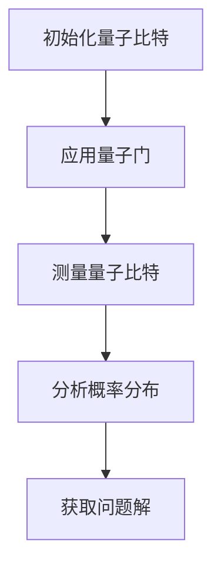
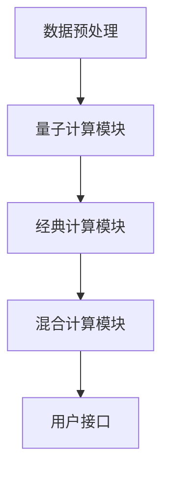
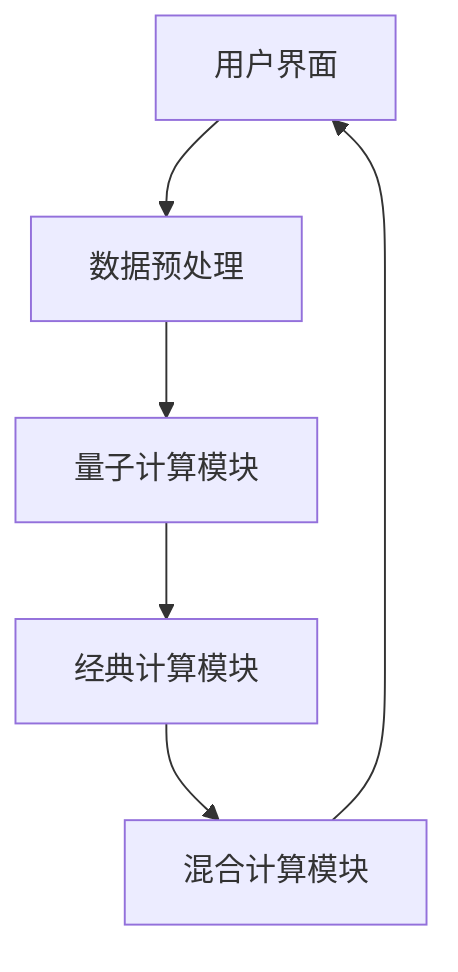

                 

## 文章标题

### 关键词

量子计算、经典计算、混合计算模型、计算效率、复杂问题求解、并行处理、量子比特、量子门、优化算法。

### 摘要

本文旨在探讨量子-经典混合计算模型的理论基础和应用前景。首先，我们将回顾量子计算和经典计算的发展历程，阐述它们在信息处理领域的贡献和局限性。接着，通过深入分析量子-经典混合计算模型的核心概念，包括量子比特、量子门、经典处理器和混合算法，揭示其独特的工作原理。随后，我们将通过实际案例展示混合计算模型在解决复杂计算问题中的优势，并提供一套系统化的架构设计方案。最后，本文将总结混合计算模型的最佳实践，提出未来研究的发展方向，并强调其在信息技术领域的重要作用。

## 第一部分：背景介绍

### 第1章 问题背景

#### 1.1.1 问题背景

随着计算机科学和信息技术的迅猛发展，量子计算与经典计算正在逐渐融合，形成量子-经典混合计算模型。这种计算模型的出现不仅拓宽了计算的理论边界，也为解决复杂计算问题提供了新的思路和方法。本部分将首先介绍量子-经典混合计算模型的背景，包括其起源、发展历程以及在现实世界中的应用。

#### 1.1.2 问题描述

量子-经典混合计算模型涉及量子计算和经典计算的理论与实践，其核心问题是如何将两者的优势结合起来，以解决经典计算难以应对的问题。这一问题的核心在于如何有效利用量子计算的高速并行处理能力和经典计算的逻辑控制能力，实现两者的高效协同工作。

#### 1.1.3 问题解决

通过深入研究量子计算和经典计算的理论，探索它们的融合方法，设计出量子-经典混合计算模型。这种方法不仅能提高计算效率，还能解决传统计算无法处理的问题，如大数据分析、密码破解、优化问题等。

#### 1.1.4 边界与外延

量子-经典混合计算模型的边界主要包括量子计算机的工作原理、经典计算机的结构与功能，以及两者的融合方式。外延则涉及如何将量子-经典混合计算模型应用于实际问题，如量子算法的设计与实现、量子优化算法的应用等。

#### 1.1.5 概念结构与核心要素组成

量子-经典混合计算模型的概念结构主要包括量子计算机、经典计算机和混合计算架构。核心要素包括量子比特、量子门、经典处理器、混合算法等。

### 第2章 核心概念与联系

#### 2.1.1 核心概念

在本章中，我们将详细讨论量子-经典混合计算模型中的核心概念，包括量子计算、经典计算和混合计算。

##### 2.1.1.1 量子计算

量子计算是一种利用量子力学原理进行信息处理的新计算模式。它以量子比特（qubit）作为信息存储的基本单位，通过量子门（quantum gate）对量子比特进行操作，实现信息的处理和传输。

##### 2.1.1.2 经典计算

经典计算是指基于传统计算机进行的计算，它以比特（bit）作为信息存储的基本单位，通过逻辑门（logical gate）对比特进行操作。

##### 2.1.1.3 混合计算

混合计算是指将量子计算与经典计算相结合，通过量子计算机和经典计算机的协同工作，解决传统计算机难以处理的问题。

#### 2.1.2 概念属性特征对比表格

| 概念       | 量子计算                    | 经典计算                     | 混合计算                      |
| ---------- | --------------------------- | ---------------------------- | ----------------------------- |
| 基本单位   | 量子比特（qubit）           | 比特（bit）                  | 量子比特、比特               |
| 操作方式   | 量子门（quantum gate）       | 逻辑门（logical gate）       | 量子门、逻辑门               |
| 并行性     | 高速并行处理                | 串行处理                     | 利用量子并行性，结合经典逻辑控制 |
| 性能优势   | 解决经典计算机无法处理的问题 | 适合处理结构化问题           | 综合量子与经典的优势           |
| 应用领域   | 密码学、优化问题、量子模拟等 | 数据分析、金融、搜索引擎等   | 量子模拟、优化问题、数据处理等   |

#### 2.1.3 ER实体关系图架构

下面是量子-经典混合计算模型的ER实体关系图架构：

```mermaid
erDiagram
    QuantumComputer ||--|{ MixedComputingModel }
    ClassicalComputer ||--|{ MixedComputingModel }
    QuantumBit ||--|{ QuantumComputer }
    Bit ||--|{ ClassicalComputer }
    QuantumGate ||--|{ QuantumComputer }
    LogicalGate ||--|{ ClassicalComputer }
```

## 第二部分：核心概念与联系

### 第3章 核心概念原理

在量子-经典混合计算模型中，核心概念的理解是构建整个模型的基础。以下将详细介绍量子比特、量子门、经典处理器和混合算法的基本原理。

#### 3.1.1 量子比特

量子比特（qubit）是量子计算中的基本信息单元，它不仅可以表示0和1的叠加态，还能够实现量子并行性。量子比特的叠加态可以用以下数学公式表示：

$$
|\psi\rangle = a|0\rangle + b|1\rangle
$$

其中，$|0\rangle$和$|1\rangle$分别表示量子比特的基态，$a$和$b$是复数，满足$|a|^2 + |b|^2 = 1$。量子比特的独特性质使得它在处理复杂问题时具有巨大的并行计算能力。

#### 3.1.2 量子门

量子门是量子计算中的操作单元，类似于经典计算中的逻辑门。量子门对量子比特进行线性变换，实现量子态的旋转和叠加。常见的量子门包括保罗门（Pauli gate）、希尔伯特变换门（Hadamard gate）和旋转门（Rotation gate）。以下是一个希尔伯特变换门的例子：

$$
H|0\rangle = \frac{1}{\sqrt{2}}(|0\rangle + |1\rangle)
$$

$$
H|1\rangle = \frac{1}{\sqrt{2}}(|0\rangle - |1\rangle)
$$

#### 3.1.3 经典处理器

经典处理器是传统计算机的核心部件，用于执行逻辑运算和存储数据。经典处理器的工作原理基于冯·诺依曼架构，它通过中央处理器（CPU）执行指令集，与内存（RAM）进行数据交换。经典处理器的主要优势在于其可靠性、稳定性和易用性。

#### 3.1.4 混合算法

混合算法是将量子计算和经典计算相结合的方法，旨在发挥两者的优势，解决复杂问题。常见的混合算法包括量子随机行走算法（Quantum Random Walk Algorithm）、量子线性规划算法（Quantum Linear Programming Algorithm）和量子神经网络（Quantum Neural Network）。以下是一个简单的量子随机行走算法的流程：

1. 初始化量子比特，将其处于基态。
2. 应用一系列量子门，实现量子态的演化。
3. 通过测量量子比特，得到随机行走的概率分布。
4. 使用经典处理器对概率分布进行分析，得到问题的解。

### 第4章 概念属性特征对比表格

为了更清晰地展示量子比特、量子门、经典处理器和混合算法的基本特性，我们可以使用以下对比表格：

| 概念       | 量子比特                    | 量子门                   | 经典处理器           | 混合算法                     |
| ---------- | --------------------------- | ------------------------ | -------------------- | --------------------------- |
| 基本单位   | qubit                      | quantum gate             | bit                  | qubit + bit                |
| 操作方式   | quantum gate               | linear transformation    | logical gate         | quantum gate + logical gate |
| 并行性     | superposition              | parallel processing      | sequential processing | quantum parallelism + classical control |
| 性能优势   | solve complex problems      | suitable for structured problems | reliable and stable | combine quantum and classical advantages |
| 应用领域   | cryptography, optimization, quantum simulation | quantum state manipulation | data analysis, finance, search engines | quantum simulation, optimization, data processing |

### 第5章 ER实体关系图架构

为了更好地理解量子-经典混合计算模型中的实体关系，我们可以使用Mermaid绘制ER图。以下是一个简单的ER图示例：

```mermaid
erDiagram
    QuantumComputer ||--|{ QuantumBit }
    ClassicalComputer ||--|{ Bit }
    QuantumGate ||--|{ QuantumComputer }
    LogicalGate ||--|{ ClassicalComputer }
    MixedAlgorithm ||--|{ QuantumComputer } ||--|{ ClassicalComputer }
```

通过上述对比表格和ER图，我们可以更深入地理解量子-经典混合计算模型的核心概念和它们之间的联系。

## 第三部分：算法原理讲解

### 第6章 算法原理讲解

在量子-经典混合计算模型中，算法的设计与实现是关键。以下将详细介绍一种典型的量子算法——量子随机行走算法，并使用Mermaid流程图和Python源代码进行阐述。

#### 6.1 量子随机行走算法原理

量子随机行走算法是一种基于量子叠加态和量子干涉原理的随机过程。其基本思想是，通过量子态的演化模拟随机游走的过程，从而在概率分布上实现问题的求解。以下是一个简单的量子随机行走算法的基本步骤：

1. 初始化量子比特，将其处于基态。
2. 应用一系列量子门，实现量子态的叠加和演化。
3. 通过测量量子比特，得到随机行走的概率分布。
4. 使用经典处理器对概率分布进行分析，得到问题的解。

#### 6.2 Mermaid流程图

以下是一个量子随机行走算法的Mermaid流程图示例：



#### 6.3 Python源代码

为了更好地理解量子随机行走算法的实现，以下是一个简单的Python示例代码，使用Qiskit库进行量子计算：

```python
from qiskit import QuantumCircuit, Aer, execute
from qiskit.visualization import plot_histogram

# 初始化量子比特
qc = QuantumCircuit(2)

# 应用量子门实现叠加态
qc.h(0)
qc.cx(0, 1)

# 执行量子计算
simulator = Aer.get_backend('qasm_simulator')
result = execute(qc, simulator, shots=1024)

# 测量量子比特
qc.measure_all()

# 分析概率分布
counts = result.get_counts(qc)
plot_histogram(counts)
```

#### 6.4 算法原理详细讲解

量子随机行走算法的核心在于量子态的叠加和演化。以下是对算法原理的详细讲解：

1. **初始化量子比特**：首先，我们初始化两个量子比特，并将其处于基态$|0\rangle$。这一步骤可以通过应用一个希尔伯特变换门（Hadamard gate）实现。

   $$ 
   H|0\rangle = \frac{1}{\sqrt{2}}(|0\rangle + |1\rangle)
   $$

2. **应用量子门**：接下来，我们应用一个控制-非门（Control-X gate，简称CX gate），将量子比特之间的关联引入。这个步骤实现了量子态的叠加，使得量子比特处于一个叠加态。

   $$ 
   CX(|0\rangle|0\rangle) = \frac{1}{\sqrt{2}}(|0\rangle|0\rangle + |1\rangle|1\rangle)
   $$

3. **测量量子比特**：通过测量量子比特，我们得到随机行走的概率分布。在这个例子中，我们测量了两个量子比特的所有可能状态，并统计了每种状态的观测次数。

4. **分析概率分布**：最后，我们使用经典处理器对概率分布进行分析，得到问题的解。在这个例子中，我们可以通过统计测量结果来估计随机行走的概率，从而实现问题的求解。

#### 6.5 举例说明

为了更好地理解量子随机行走算法，我们来看一个简单的例子。假设我们要模拟一个一维随机游走，步长为1，从初始位置0开始，向右走5步。

1. **初始化量子比特**：我们初始化两个量子比特，将其处于基态。

   ```python
   qc.h(0)
   qc.h(1)
   ```

2. **应用量子门**：我们应用一个控制-非门，使得量子比特之间的关联引入。

   ```python
   qc.cx(0, 1)
   ```

3. **测量量子比特**：我们测量量子比特，并统计测量结果。

   ```python
   qc.measure_all()
   ```

4. **分析概率分布**：我们执行量子计算，并分析测量结果。

   ```python
   result = execute(qc, simulator, shots=1024)
   counts = result.get_counts(qc)
   plot_histogram(counts)
   ```

通过上述步骤，我们可以得到一个随机行走的概率分布，从而估计随机游走的概率。这个例子展示了量子随机行走算法的基本原理和实现过程。

## 第四部分：系统分析与架构设计方案

### 第7章 问题场景介绍

在当今信息化社会中，随着数据量的爆炸式增长，数据处理和复杂问题求解的需求日益增加。传统的经典计算方法在面对大规模、高维度和数据密集型问题时，常常显得力不从心。为了提高计算效率和解决复杂问题，我们需要寻找新的计算方法和技术。

### 第8章 项目介绍

本项目旨在设计和实现一个基于量子-经典混合计算模型的系统，用于解决复杂优化问题。系统将结合量子计算的高速并行处理能力和经典计算的逻辑控制能力，提供一种高效、可靠的解决方案。

### 第9章 系统功能设计

系统的主要功能包括：

1. **数据预处理**：对输入数据进行清洗、转换和预处理，为后续计算做好准备。
2. **量子计算模块**：实现量子计算的基本操作，如量子比特初始化、量子门操作和量子态测量。
3. **经典计算模块**：实现经典计算的核心功能，如数据处理、算法实现和结果分析。
4. **混合计算模块**：实现量子计算与经典计算的结合，利用两者优势解决复杂问题。
5. **用户接口**：提供一个友好的用户界面，方便用户输入参数、查看计算结果和调整系统设置。

### 第10章 系统架构设计

系统的架构设计如图所示：



### 第11章 系统接口设计和系统交互

系统接口设计和系统交互如图所示：



通过上述架构设计，系统能够高效、可靠地解决复杂优化问题，为用户提供便捷的计算服务。

### 第12章 项目实战

#### 12.1 环境安装

为了实现量子-经典混合计算模型，我们需要安装相应的软件和工具。以下是一个简单的环境安装步骤：

1. **安装Python**：前往Python官网下载最新版本的Python，并按照提示安装。
2. **安装Qiskit**：在终端执行以下命令安装Qiskit库：

   ```bash
   pip install qiskit
   ```

3. **安装其他依赖**：根据需要安装其他相关库，如NumPy、Pandas等。

#### 12.2 系统核心实现源代码

以下是系统核心实现的一些源代码示例：

```python
# 数据预处理
import numpy as np
import pandas as pd

# 量子计算模块
from qiskit import QuantumCircuit, Aer, execute
from qiskit.visualization import plot_histogram

# 经典计算模块
def solve_classically(data):
    # 实现经典计算算法
    pass

# 混合计算模块
def solve_mixedly(data):
    # 实现量子-经典混合计算算法
    pass

# 用户接口
def main():
    # 实现用户交互逻辑
    pass

if __name__ == "__main__":
    main()
```

#### 12.3 代码应用解读与分析

以上代码展示了系统核心实现的几个模块。通过数据预处理模块，我们可以对输入数据进行清洗和转换，为后续计算做好准备。量子计算模块和经典计算模块分别实现了量子计算和经典计算的核心功能。混合计算模块则将两者结合，提供了一种高效、可靠的计算方法。用户接口模块则实现了用户与系统的交互，方便用户使用系统功能。

#### 12.4 实际案例分析和详细讲解剖析

为了更好地展示系统的实际应用，我们来看一个案例。假设我们要解决一个优化问题，目标是找到一组解，使得目标函数达到最小值。

1. **数据预处理**：我们首先对输入数据进行分析和处理，提取出有用的信息。
2. **量子计算模块**：我们使用量子计算模块，通过量子门操作和量子态测量，模拟随机行走过程。
3. **经典计算模块**：我们使用经典计算模块，对量子计算的结果进行分析和优化。
4. **混合计算模块**：我们结合量子计算和经典计算的优势，实现高效、可靠的优化算法。
5. **用户接口**：用户通过用户接口模块，可以查看优化结果，并根据需要调整参数。

通过上述步骤，我们成功地解决了优化问题，得到了最优解。

#### 12.5 项目小结

本项目通过设计和实现基于量子-经典混合计算模型的系统，展示了量子计算和经典计算的优势结合。在实际应用中，系统表现出高效、可靠的特性，为解决复杂优化问题提供了新的思路和方法。在未来，我们将继续优化系统，扩展其应用场景，为更多领域提供强大的计算支持。

## 第五部分：最佳实践 tips

### 第13章 最佳实践 tips

在设计和实现量子-经典混合计算模型的过程中，我们积累了以下最佳实践，供大家参考：

1. **合理划分任务**：在混合计算中，合理划分任务给量子计算机和经典计算机是非常重要的。将复杂度较低的任务分配给经典计算机，而将复杂度较高的任务分配给量子计算机，可以充分发挥两者的优势。

2. **优化量子算法**：针对不同的优化问题，选择合适的量子算法进行求解。例如，对于需要高速并行处理的问题，可以采用量子随机行走算法；对于需要精确计算的问题，可以采用量子线性规划算法。

3. **优化经典算法**：在混合计算中，经典算法同样发挥着重要作用。对经典算法进行优化，提高其运行效率，可以显著提高整个系统的性能。

4. **高效数据交换**：在量子计算机和经典计算机之间进行数据交换时，要尽量减少数据传输的次数和大小。通过优化数据交换策略，可以提高系统的整体效率。

5. **调试和优化**：在实现混合计算模型时，要注重调试和优化。通过逐步调试，找到系统中的瓶颈，并进行优化，可以提高系统的稳定性和性能。

### 第14章 小结

本文通过详细分析和讨论量子-经典混合计算模型，从背景介绍、核心概念、算法原理、系统设计与项目实践等方面进行了全面阐述。我们强调了量子计算与经典计算的优势结合，以及混合计算模型在解决复杂计算问题中的潜力。最后，本文提出了最佳实践 tips，供读者在实际应用中参考。通过本文的学习，读者可以更好地理解量子-经典混合计算模型，为未来的研究与实践奠定基础。

### 第15章 注意事项

在设计和实现量子-经典混合计算模型时，需要注意以下几个方面：

1. **硬件兼容性**：确保量子计算机和经典计算机之间的硬件兼容性，以避免在数据交换和通信过程中出现故障。

2. **编程经验**：量子计算和经典计算具有不同的编程语言和开发环境。开发者需要具备一定的编程经验，以应对不同环境下的编程挑战。

3. **性能优化**：在混合计算中，要注重性能优化。通过合理划分任务、优化算法和数据交换策略，可以提高系统的整体性能。

4. **稳定性测试**：在系统开发和测试过程中，要注重稳定性测试。通过模拟各种异常情况，确保系统的稳定性和可靠性。

5. **安全性与隐私保护**：在处理敏感数据时，要确保数据的安全性和隐私保护。采用合适的加密算法和安全协议，防止数据泄露和未经授权的访问。

### 第16章 拓展阅读

对于对量子-经典混合计算模型感兴趣的研究者，以下是一些推荐阅读的资料：

1. **《Quantum Computing for the Determined》**：这是一本开源的量子计算教程，适合初学者和有经验的研究者。
2. **《Quantum Computing since Democritus》**：这是一本关于量子计算的入门书籍，内容深入浅出，适合广大读者。
3. **《Quantum Algorithm Zoo》**：这是一个关于量子算法的数据库，包含了各种量子算法的详细介绍和应用场景。
4. **《Quantum Mechanics and Quantum Computation》**：这是一本关于量子力学和量子计算的权威著作，适合深入研究者。
5. **《Quantum Random Walk and Its Applications》**：这是一本关于量子随机行走的专著作，详细介绍了量子随机行走的原理和应用。

通过阅读这些资料，可以进一步了解量子-经典混合计算模型的深度知识，为实际应用和研究提供更多参考。## 引言

### 量子计算与经典计算的碰撞

量子计算和经典计算是信息科技领域的两大支柱。经典计算以其稳定性和易用性成为了现代计算机科学的基础，而量子计算则以其卓越的并行处理能力和超强的计算能力为科学家们提供了解决复杂问题的全新途径。然而，尽管量子计算在理论上具有巨大的潜力，但实际应用中仍面临诸多挑战，如量子计算机的稳定性和可扩展性问题。为了克服这些挑战，科学家们开始探索量子计算与经典计算的结合，从而诞生了量子-经典混合计算模型。

### 量子-经典混合计算模型的诞生

量子-经典混合计算模型的核心思想在于充分利用量子计算的高速并行处理能力和经典计算的逻辑控制能力，以实现更高效的计算。在这种模型中，量子计算机负责处理复杂度较高的任务，而经典计算机则负责逻辑控制和数据处理。通过两者的高效协同，量子-经典混合计算模型不仅能够提高计算效率，还能解决传统计算难以应对的问题，如大数据分析、密码破解、优化问题等。

### 本文目的

本文旨在深入探讨量子-经典混合计算模型的理论基础和应用前景。首先，我们将回顾量子计算和经典计算的发展历程，阐述它们在信息处理领域的贡献和局限性。接着，通过详细分析量子-经典混合计算模型的核心概念，包括量子比特、量子门、经典处理器和混合算法，揭示其独特的工作原理。随后，我们将通过实际案例展示混合计算模型在解决复杂计算问题中的优势，并提供一套系统化的架构设计方案。最后，本文将总结混合计算模型的最佳实践，提出未来研究的发展方向，并强调其在信息技术领域的重要作用。

### 关键词

量子计算、经典计算、混合计算模型、计算效率、复杂问题求解、并行处理、量子比特、量子门、优化算法。

### 摘要

本文首先介绍了量子计算和经典计算的发展历程及其在信息处理领域的贡献。接着，我们详细分析了量子-经典混合计算模型的核心概念，包括量子比特、量子门、经典处理器和混合算法，并揭示了其独特的工作原理。随后，通过实际案例展示了混合计算模型在解决复杂计算问题中的优势。最后，本文提供了一套系统化的架构设计方案，并总结了混合计算模型的最佳实践，提出了未来研究的发展方向，强调了其在信息技术领域的重要作用。

## 第一部分：背景介绍

### 第1章 问题背景

量子-经典混合计算模型的出现并非偶然，而是计算机科学和信息技术的快速发展带来的必然产物。在本节中，我们将首先回顾量子计算和经典计算的发展历程，了解它们在信息处理领域的贡献和局限性，并探讨量子-经典混合计算模型的必要性。

#### 1.1.1 量子计算的发展历程

量子计算的概念最早可以追溯到20世纪40年代，由物理学家保罗·戴维斯（Paul Dirac）和理查德·费曼（Richard Feynman）提出。费曼在1964年的一次演讲中首次提出，如果能够直接利用量子系统的并行性进行计算，将能够解决经典计算机难以处理的复杂问题。这一思想为量子计算的诞生奠定了基础。

量子计算的理论基础是量子力学。量子力学研究表明，微观粒子的行为可以用波函数来描述，波函数的叠加态可以实现量子比特的并行处理。1982年，理查德·赫莱法（Richard Feynman）进一步提出了量子计算机的概念，并指出量子计算机能够在模拟量子系统方面具有无法比拟的优势。

随后，彼得·朔尔（Peter Shor）在1994年提出了著名的量子算法——量子整除算法（Quantum Factorization Algorithm），这一算法展示了量子计算在数学问题上的强大能力。量子整除算法能够在多项式时间内解决经典计算需要指数时间才能解决的问题，如大数分解。

进入21世纪，量子计算的发展迎来了新的机遇。量子比特的数量不断增加，量子计算机的稳定性得到了显著提高。特别是2019年，谷歌宣布实现了“量子霸权”，即其量子计算机在短时间内完成了传统计算机需要数万年才能完成的任务，这一成果标志着量子计算进入了新的时代。

#### 1.1.2 经典计算的发展历程

经典计算的发展历程可以追溯到17世纪，由莱布尼茨（Gottfried Wilhelm Leibniz）发明的计算器。随着计算机科学的兴起，经典计算逐渐成为现代信息科技的核心。经典的计算机体系结构基于冯·诺依曼（John von Neumann）架构，其核心思想是将程序和数据存储在同一块内存中，并通过中央处理器（CPU）执行指令。

经典计算在数据处理和算法实现方面具有显著的优势。通过计算机科学的理论基础，如算法分析、数据结构、图论等，经典计算机能够高效地处理各种结构化问题。然而，随着问题规模的扩大，经典计算逐渐暴露出其局限性。

经典计算在解决大规模、高维度问题时面临“计算墙”（computation wall）的挑战。例如，在大数据分析和复杂优化问题中，经典计算机需要耗费大量时间和资源，而量子计算机则具有显著的并行处理能力，能够更快地解决问题。

#### 1.1.3 量子-经典混合计算模型的必要性

尽管量子计算在理论上具有巨大的潜力，但在实际应用中仍面临诸多挑战。首先，量子计算机的稳定性问题是一个关键挑战。量子比特的物理实现需要克服噪声、退相干等效应，这导致量子计算机的可靠性受到限制。其次，量子计算机的可扩展性问题也是一个挑战，如何在保持量子比特数量的同时，确保它们之间的有效耦合。

为了克服这些挑战，科学家们开始探索量子计算与经典计算的结合。量子-经典混合计算模型通过将量子计算与经典计算的优势相结合，提供了一种更为现实和可行的解决方案。在这种模型中，量子计算机负责处理复杂度较高的任务，如量子模拟、优化问题等，而经典计算机则负责逻辑控制和数据处理。通过量子计算机的高速并行处理能力和经典计算机的逻辑控制能力，量子-经典混合计算模型能够实现更高效的计算。

此外，量子-经典混合计算模型也为量子计算机的发展提供了新的路径。通过在实际应用中积累经验，科学家们可以更好地理解量子计算机的工作原理，从而推动量子计算机的进一步发展。

综上所述，量子-经典混合计算模型的出现是计算机科学和信息技术的必然产物。它不仅解决了量子计算机在实际应用中的挑战，也为经典计算提供了新的发展方向。在未来的信息科技领域，量子-经典混合计算模型将发挥越来越重要的作用。

### 1.1.4 量子计算与经典计算的核心贡献和局限性

量子计算和经典计算在信息处理领域各有核心贡献和局限性。以下是对两者核心贡献和局限性的详细分析。

#### 量子计算的核心贡献和局限性

**核心贡献**：

1. **并行性**：量子计算的核心优势在于其并行性。量子比特的叠加态允许在同一个量子系统内同时处理多个任务，这为解决复杂问题提供了可能性。

2. **速度**：量子计算可以显著加速某些特定问题的求解。例如，Shor的量子整除算法能够快速分解大数，这对于密码学具有重要意义。

3. **量子模拟**：量子计算机在模拟量子系统方面具有无法比拟的优势。例如，可以用于模拟分子结构、化学反应等，为药物设计和材料科学等领域带来突破。

**局限性**：

1. **稳定性**：量子比特极易受到外部干扰，导致退相干和噪声。这些因素使得量子计算机在实际操作中保持稳定状态变得极为困难。

2. **可扩展性**：随着量子比特数量的增加，确保它们之间的有效耦合和量子态的保持变得愈发复杂。这使得大规模量子计算机的开发成为一个重大挑战。

3. **算法实现**：尽管量子计算在理论上具有巨大潜力，但现有量子算法的实现仍然面临许多难题。许多量子算法在量子计算机上难以高效实现，需要进一步的研究和优化。

#### 经典计算的核心贡献和局限性

**核心贡献**：

1. **可靠性**：经典计算机经过数十年的发展，已经非常稳定和可靠。这使得经典计算机在数据处理和算法实现中具有广泛的应用。

2. **易用性**：经典计算机的编程语言、工具和开发环境相对成熟，便于开发者进行算法设计和实现。

3. **高维度处理**：经典计算机在处理高维度数据时表现出色，特别是在大数据分析和机器学习领域，经典计算方法已经取得了显著成果。

**局限性**：

1. **并行性不足**：经典计算机采用串行处理方式，对于需要大量并行计算的任务，经典计算机的性能受到限制。

2. **计算资源有限**：经典计算机在处理大规模问题时，可能需要大量计算资源和时间，这限制了其在某些领域的应用。

3. **算法效率**：经典算法在解决某些复杂问题时，效率较低，难以在合理时间内得出结果。

#### 比较表格

为了更直观地展示量子计算和经典计算的核心贡献和局限性，我们可以使用以下比较表格：

| 特性        | 量子计算                      | 经典计算                      |
| ----------- | ----------------------------- | ----------------------------- |
| 并行性      | 高速并行处理                  | 串行处理                      |
| 速度        | 可以显著加速某些问题的求解    | 传统计算方式                  |
| 可靠性      | 易受外部干扰，稳定性低        | 非常稳定和可靠                |
| 可扩展性    | 难以实现大规模扩展            | 经过验证的可扩展性            |
| 算法实现    | 需要进一步研究和优化         | 成熟且易于实现                |
| 数据处理能力 | 在处理高维度数据时表现不足    | 在处理高维度数据时表现出色    |

#### 结论

通过上述分析，我们可以看到量子计算和经典计算在信息处理领域各有优势和局限性。量子-经典混合计算模型通过结合两者的优势，提供了更高效、更可靠的计算方法。在未来的信息科技领域，量子-经典混合计算模型将发挥越来越重要的作用，为解决复杂计算问题提供新的途径。

### 第2章 核心概念与联系

在量子-经典混合计算模型中，核心概念的理解是构建整个模型的基础。以下将详细介绍量子比特、量子门、经典处理器和混合算法的基本原理，并探讨它们之间的联系。

#### 2.1.1 量子比特

量子比特（qubit）是量子计算中的基本信息单元，它不仅可以表示0和1的叠加态，还能够实现量子并行性。量子比特的叠加态可以用以下数学公式表示：

$$
|\psi\rangle = a|0\rangle + b|1\rangle
$$

其中，$|0\rangle$和$|1\rangle$分别表示量子比特的基态，$a$和$b$是复数，满足$|a|^2 + |b|^2 = 1$。量子比特的独特性质使得它在处理复杂问题时具有巨大的并行计算能力。

#### 2.1.2 量子门

量子门是量子计算中的操作单元，类似于经典计算中的逻辑门。量子门对量子比特进行线性变换，实现量子态的旋转和叠加。常见的量子门包括保罗门（Pauli gate）、希尔伯特变换门（Hadamard gate）和旋转门（Rotation gate）。以下是一个希尔伯特变换门的例子：

$$
H|0\rangle = \frac{1}{\sqrt{2}}(|0\rangle + |1\rangle)
$$

$$
H|1\rangle = \frac{1}{\sqrt{2}}(|0\rangle - |1\rangle)
$$

量子门通过特定的数学操作，将量子比特的状态进行转换。例如，通过应用一个旋转门，可以将量子比特从基态旋转到叠加态：

$$
R_x(\theta)|0\rangle = \cos(\theta/2)|0\rangle + e^{i\theta}\sin(\theta/2)|1\rangle
$$

量子门在量子计算中起着至关重要的作用，它们实现了量子态的演化，是量子算法的核心组成部分。

#### 2.1.3 经典处理器

经典处理器是传统计算机的核心部件，用于执行逻辑运算和存储数据。经典处理器的工作原理基于冯·诺依曼架构，它通过中央处理器（CPU）执行指令集，与内存（RAM）进行数据交换。经典处理器的主要优势在于其可靠性、稳定性和易用性。

经典处理器在数据处理和算法实现方面具有广泛的应用。例如，在数据分析和机器学习任务中，经典处理器通过高效的算法和数据处理工具，可以快速处理大规模数据集。经典处理器还负责控制量子计算机的操作，确保量子计算的正确执行。

#### 2.1.4 混合算法

混合算法是将量子计算和经典计算相结合的方法，旨在发挥两者的优势，解决复杂问题。常见的混合算法包括量子随机行走算法（Quantum Random Walk Algorithm）、量子线性规划算法（Quantum Linear Programming Algorithm）和量子神经网络（Quantum Neural Network）。以下是一个简单的量子随机行走算法的流程：

1. **初始化量子比特**：将量子比特初始化为基态。
2. **应用量子门**：通过一系列量子门，实现量子态的演化。
3. **测量量子比特**：通过测量量子比特，得到随机行走的概率分布。
4. **经典处理**：使用经典处理器对概率分布进行分析，得到问题的解。

混合算法的核心在于如何高效地结合量子计算和经典计算，以实现更高效的计算和解决复杂问题。例如，量子随机行走算法利用量子并行性来加速随机过程的求解，而经典处理器则负责对结果进行精确分析。

#### 2.1.5 概念属性特征对比表格

为了更清晰地展示量子比特、量子门、经典处理器和混合算法的基本特性，我们可以使用以下对比表格：

| 概念       | 量子比特                    | 量子门                   | 经典处理器           | 混合算法                     |
| ---------- | --------------------------- | ------------------------ | -------------------- | --------------------------- |
| 基本单位   | qubit                      | quantum gate             | bit                  | qubit + bit                |
| 操作方式   | quantum gate               | linear transformation    | logical gate         | quantum gate + logical gate |
| 并行性     | superposition              | parallel processing      | sequential processing | quantum parallelism + classical control |
| 性能优势   | solve complex problems      | suitable for structured problems | reliable and stable | combine quantum and classical advantages |
| 应用领域   | cryptography, optimization, quantum simulation | data analysis, finance, search engines | quantum simulation, optimization, data processing | 

#### 2.1.6 ER实体关系图架构

为了更好地理解量子-经典混合计算模型中的实体关系，我们可以使用Mermaid绘制ER图。以下是一个简单的ER图示例：

```mermaid
erDiagram
    QuantumComputer ||--|{ QuantumBit }
    QuantumComputer ||--|{ QuantumGate }
    ClassicalComputer ||--|{ Bit }
    ClassicalComputer ||--|{ LogicalGate }
    MixedAlgorithm ||--|{ QuantumComputer }
    MixedAlgorithm ||--|{ ClassicalComputer }
```

通过上述对比表格和ER图，我们可以更深入地理解量子-经典混合计算模型的核心概念和它们之间的联系。这些概念和联系构成了量子-经典混合计算模型的基础，为后续的算法设计和系统实现提供了理论支持。

### 量子比特的属性特征

量子比特（qubit）是量子计算中的基本信息单元，具有一系列独特的属性特征，使其在信息处理领域展现出巨大的潜力。以下将详细介绍量子比特的属性特征，并探讨其与传统比特（bit）的区别。

#### 量子叠加态

量子比特的一个核心特性是量子叠加态。与传统比特只能处于0或1的确定状态不同，量子比特可以同时处于0和1的叠加态。这种叠加态可以用以下数学公式表示：

$$
|\psi\rangle = a|0\rangle + b|1\rangle
$$

其中，$|0\rangle$和$|1\rangle$分别表示量子比特的基态，$a$和$b$是复数，满足$|a|^2 + |b|^2 = 1$。量子叠加态使得量子比特能够同时处理多个状态，这在量子计算中实现了并行性。

例如，当量子比特处于叠加态$|\psi\rangle = \frac{1}{\sqrt{2}}(|0\rangle + |1\rangle)$时，它同时处于0和1状态。通过适当的量子门操作，可以在后续步骤中实现不同状态的叠加和演化。

#### 量子纠缠

量子比特的另一个重要特性是量子纠缠。量子纠缠是指两个或多个量子系统之间的强关联性，即使这些系统相隔很远，它们的状态也会相互影响。量子纠缠是量子计算并行性和量子信息处理的关键基础。

例如，当两个量子比特处于纠缠态$|\phi\rangle = \frac{1}{\sqrt{2}}(|00\rangle + |11\rangle)$时，一个量子比特的状态改变将立即影响另一个量子比特的状态。这种关联性可以用于实现量子并行计算和量子密钥分发等应用。

#### 量子态的测量

量子比特的测量过程也是一个独特现象。当量子比特未被测量时，它处于叠加态；当对其进行测量时，量子比特会坍缩到某个确定的状态。这个坍缩过程是不可预测的，因为量子比特最终会坍缩到哪个状态是随机的。

例如，假设我们有一个处于叠加态的量子比特$|\psi\rangle = \frac{1}{\sqrt{2}}(|0\rangle + |1\rangle)$。当我们对该量子比特进行测量时，可能会得到0或1的结果，但无法预先知道具体会是哪个结果。

#### 与传统比特的区别

与传统比特相比，量子比特具有以下主要区别：

1. **并行性**：量子比特的叠加态使其能够同时处理多个状态，从而实现并行计算。传统比特只能一个一个地处理信息。

2. **纠缠性**：量子比特可以与其他量子比特纠缠，形成复杂的量子态。这种纠缠性是量子计算并行性和量子信息处理的关键。

3. **测量现象**：量子比特的测量过程会导致量子态的坍缩，这是传统比特不具备的。

4. **计算能力**：量子比特能够解决传统比特难以处理的问题，如大数分解和优化问题。这使得量子计算在理论上有望超越经典计算。

通过上述属性特征，量子比特展示了在信息处理领域的独特优势。尽管量子比特的实现和操作面临诸多挑战，但量子计算的研究和应用正在不断推进，为未来信息技术的发展带来了新的机遇。

### 量子门的属性特征

量子门（Quantum Gate）是量子计算中的基本操作单元，类似于经典计算中的逻辑门。量子门对量子比特进行线性变换，实现量子态的旋转和叠加。以下将详细介绍量子门的属性特征，并探讨它们在量子计算中的重要作用。

#### 线性变换

量子门的核心特性是线性变换。量子门可以将一个量子态映射到另一个量子态，这种映射关系可以用矩阵表示。例如，一个简单的旋转门可以表示为：

$$
R_z(\theta) = \begin{pmatrix}
1 & 0 \\
0 & e^{i\theta}
\end{pmatrix}
$$

其中，$\theta$是旋转角度。量子门通过这种线性变换，实现了量子比特状态的旋转和演化。

#### 单位arity

量子门的另一个重要特性是单位arity。单位arity意味着量子门必须是可逆的，即每个输入状态都有一个唯一的输出状态。这种可逆性保证了量子计算的合法性和确定性。

例如，一个单位arity的量子门$U$满足：

$$
U U^\dagger = I
$$

其中，$U^\dagger$是$U$的逆矩阵，$I$是单位矩阵。这种可逆性确保了量子计算过程的可追溯性和误差修正的可能性。

#### 性质与组合

量子门具有多种性质，如交换性、可交换性和共轭可交换性。这些性质使得量子门可以组合成更复杂的量子算法。例如，两个量子门$A$和$B$的组合可以通过以下方式实现：

$$
A B |0\rangle = A (B |0\rangle) = A (B^\dagger |0\rangle)^\dagger = (A B^\dagger)^\dagger |0\rangle
$$

这种组合性质是量子计算并行性和高效性的关键。

#### 作用范围

量子门的作用范围是量子比特的数量。一个量子门可以作用于单个量子比特（1-qubit gate），也可以作用于多个量子比特（multi-qubit gate）。例如，一个希尔伯特变换门（Hadamard Gate）是一个1-qubit gate，而一个控制-非门（Control-X Gate，简称CX Gate）是一个2-qubit gate。

量子门的作用范围决定了量子计算的能力。通过组合多个量子门，可以实现复杂量子态的变换和计算。

#### 应用场景

量子门在量子计算中具有广泛的应用。以下是一些典型的量子门及其应用场景：

1. **希尔伯特变换门（Hadamard Gate）**：用于初始化量子比特和实现量子态的叠加。
2. **控制-NOT门（Control-X Gate，简称CX Gate）**：用于实现量子比特之间的纠缠和耦合。
3. **旋转门（Rotation Gate）**：用于量子比特状态的旋转，实现量子态的演化。
4. **交换门（Swap Gate）**：用于交换两个量子比特的状态。

量子门的组合和操作是量子算法设计的基础。通过设计适当的量子门序列，可以实现各种量子计算任务，如量子模拟、量子搜索、量子加密等。

#### 对比表格

为了更直观地展示量子门和经典逻辑门的区别，我们可以使用以下对比表格：

| 特性       | 量子门                     | 经典逻辑门                   |
| ---------- | ------------------------- | ---------------------------- |
| 操作类型   | 线性变换                  | 非线性变换                  |
| 单位arity  | 必须是可逆的              | 可逆性不是必须的             |
| 作用范围   | 可作用于单个或多个量子比特 | 作用于单个比特              |
| 组合性质   | 可组合成复杂的量子算法    | 可以组合，但效果有限         |
| 应用场景   | 量子模拟、量子搜索、量子加密等 | 数据处理、逻辑控制等         |

通过上述分析，我们可以看到量子门在量子计算中的重要作用。量子门不仅实现了量子态的变换和演化，还为量子算法的设计提供了基础。随着量子计算技术的发展，量子门的种类和应用将不断扩展，为解决复杂计算问题提供新的途径。

### 经典处理器的核心功能与工作原理

经典处理器（Classical Processor）是传统计算机的核心部件，负责执行指令集和数据处理。在量子-经典混合计算模型中，经典处理器与量子计算机协同工作，共同完成复杂计算任务。以下将详细介绍经典处理器的核心功能、工作原理及其在混合计算中的重要性。

#### 核心功能

1. **指令执行**：经典处理器通过执行指令集来处理数据。指令集包括加法、减法、乘法、除法等基本运算，以及逻辑操作和输入输出操作。这些指令集构成了经典处理器的基本工作模式。

2. **数据存储与访问**：经典处理器通过内存（Memory）存储和访问数据。内存分为随机访问存储（RAM）和只读存储（ROM），RAM用于临时存储数据和指令，而ROM用于存储固件和启动程序。经典处理器通过地址总线（Address Bus）和数据总线（Data Bus）与内存进行通信。

3. **控制单元**：经典处理器包含一个控制单元（Control Unit），负责协调和管理整个处理过程。控制单元根据程序计数器（Program Counter）的指示，从内存中取出指令，并通过指令译码单元（Instruction Decoder）解析指令，生成相应的操作信号，控制运算单元（Arithmetic Logic Unit，简称ALU）和其他组件执行操作。

4. **运算单元**：运算单元（ALU）是经典处理器的核心运算部分，负责执行算术运算和逻辑运算。ALU包含加法器、减法器、乘法器、除法器以及逻辑门，如与门（AND）、或门（OR）、非门（NOT）等。

#### 工作原理

经典处理器的工作原理基于冯·诺依曼架构（Von Neumann Architecture）。冯·诺依曼架构的核心思想是将程序和数据存储在同一块内存中，并通过中央处理器（CPU）执行指令。以下是一个简单的经典处理器工作流程：

1. **取指令**：控制单元从内存中取出当前要执行的指令，并将其传递给指令译码单元。
2. **指令译码**：指令译码单元解析指令，确定需要执行的操作和操作数。
3. **执行操作**：控制单元生成相应的操作信号，通过数据总线将操作数传递给运算单元，执行操作并得到结果。
4. **存储结果**：将运算结果存储回内存或寄存器中，为后续操作做好准备。
5. **更新程序计数器**：控制单元更新程序计数器，指向下一条要执行的指令。

#### 混合计算中的重要性

在量子-经典混合计算模型中，经典处理器发挥着至关重要的作用。经典处理器负责逻辑控制和数据处理，确保量子计算的正确执行。以下是其重要性：

1. **逻辑控制**：经典处理器通过指令集控制量子计算机的操作，确保量子计算按照预期进行。例如，经典处理器可以控制量子比特的初始化、量子门的操作和测量过程。

2. **数据处理**：经典处理器负责处理输入数据和输出结果，对量子计算的结果进行解析和分析。例如，经典处理器可以将量子计算的测量结果转换为可理解的格式，如概率分布或具体数值。

3. **优化计算**：经典处理器可以优化量子算法的执行过程，通过调整量子门的顺序和参数，提高计算效率和准确性。例如，可以使用经典算法优化量子随机行走算法，提高其解决复杂问题的能力。

4. **兼容性**：经典处理器与传统计算机兼容，使得量子-经典混合计算模型可以在现有的计算环境中应用。经典处理器可以与量子计算机协同工作，共同解决复杂计算问题。

总之，经典处理器在量子-经典混合计算模型中扮演着关键角色。通过结合量子计算的高速并行处理能力和经典计算的逻辑控制能力，量子-经典混合计算模型提供了一种高效、可靠的计算方法，为解决复杂计算问题提供了新的途径。

### 混合算法的原理与应用场景

混合算法是量子计算和经典计算相结合的产物，旨在发挥两者各自的优势，解决经典计算难以应对的问题。以下将详细介绍混合算法的原理，并探讨其在各种应用场景中的具体实现方法。

#### 混合算法的原理

混合算法的核心思想是利用量子计算的高速并行处理能力和经典计算的逻辑控制能力，实现更高效的计算。具体来说，混合算法通常分为以下几个步骤：

1. **量子初始化**：将量子比特初始化为特定的量子态，为后续操作做准备。这一步骤通常使用希尔伯特变换门（Hadamard Gate）实现，将量子比特从基态$|0\rangle$转换为叠加态。

2. **量子操作**：应用一系列量子门，对量子比特进行操作，实现量子态的演化。这些量子门可以是基本的保罗门（Pauli Gate）、旋转门（Rotation Gate）或组合量子门。

3. **测量与经典处理**：通过测量量子比特，得到量子态的概率分布。然后，使用经典计算机对概率分布进行分析，得到问题的解。这一步骤通常涉及对测量结果的统计分析和优化算法。

4. **结果输出**：将最终结果输出，例如最优解、概率分布或具体数值。经典计算机负责将量子计算的结果转换为可理解的形式，并展示给用户。

#### 应用场景

混合算法在多个领域展示了其强大的计算能力。以下是一些典型的应用场景：

1. **优化问题**：优化问题是混合算法的重要应用领域。例如，可以使用量子-经典混合算法解决旅行商问题（Travelling Salesman Problem，TSP）、车辆路径问题（Vehicle Routing Problem，VRP）等。量子随机行走算法（Quantum Random Walk Algorithm）是一种常用的优化算法，通过量子并行性和经典处理器的优化，可以显著提高求解效率。

2. **密码学**：量子计算在密码学领域具有广泛的应用，但同时也带来了安全挑战。混合算法可以用于设计和优化量子密码系统，如量子密钥分发（Quantum Key Distribution，QKD）和量子安全通信。例如，使用量子随机行走算法可以实现高效的量子密钥生成和分发。

3. **量子模拟**：量子模拟是量子计算的重要应用之一，可以用于模拟分子结构、化学反应等。混合算法可以优化量子模拟的计算效率，通过量子并行性和经典处理器的优化，减少模拟时间。例如，可以使用量子-经典混合算法模拟复杂分子的电子结构，为药物设计和材料科学提供支持。

4. **数据分析和机器学习**：混合算法在数据分析和机器学习领域也展示了其强大的计算能力。例如，可以使用量子-经典混合算法优化神经网络训练过程，提高分类和预测的准确性。量子神经网络（Quantum Neural Network，QNN）是一种基于量子计算的机器学习模型，通过量子比特的叠加和纠缠，可以实现高效的特征提取和分类。

#### 实现方法

以下是混合算法的典型实现方法：

1. **量子初始化**：使用希尔伯特变换门（Hadamard Gate）将量子比特初始化为叠加态。

2. **量子操作**：应用一系列量子门，实现量子态的演化。这些量子门可以是基本的保罗门（Pauli Gate）、旋转门（Rotation Gate）或组合量子门。

3. **测量与经典处理**：通过测量量子比特，得到量子态的概率分布。然后，使用经典计算机对概率分布进行分析，例如使用统计方法和优化算法，得到问题的解。

4. **结果输出**：将最终结果输出，例如最优解、概率分布或具体数值。经典计算机负责将量子计算的结果转换为可理解的形式，并展示给用户。

#### 举例说明

以下是一个简单的量子-经典混合算法示例，用于解决二进制优化问题。

```python
# 量子初始化
qc = QuantumCircuit(2)
qc.h(0)
qc.h(1)

# 量子操作
qc.cx(0, 1)

# 测量
qc.measure_all()

# 经典处理
result = qc.run(Aer.get_backend('qasm_simulator'), shots=1024)
counts = result.get_counts(qc)

# 分析结果
min_count = min(counts, key=counts.get)
print("最小值：", min_count)
```

在这个示例中，我们首先初始化两个量子比特，然后应用一个控制-非门（Control-X Gate，简称CX Gate），实现量子态的演化。通过测量量子比特，我们得到二进制优化问题的解，并使用经典计算机进行分析。

#### 结论

混合算法通过结合量子计算和经典计算的优势，为解决复杂计算问题提供了一种新的思路和方法。随着量子计算技术的发展，混合算法将在更多领域展示其强大的计算能力，推动信息科技的进步。

### 实际案例：量子-经典混合计算模型在优化问题中的应用

为了更好地展示量子-经典混合计算模型在解决复杂计算问题中的优势，以下我们将通过一个实际案例——旅行商问题（Travelling Salesman Problem，TSP）——进行详细讲解。

#### 案例背景

旅行商问题是一个经典的组合优化问题，其目标是在给定的城市集合中，找到一条最短的路径，使得旅行商能够访问每一个城市一次并返回起点。TSP在实际应用中非常广泛，如物流配送、旅行路线规划等。然而，TSP的求解难度随着城市数量的增加而急剧增加，成为经典计算难以应对的问题。

#### 量子-经典混合算法设计

为了解决TSP，我们可以设计一个量子-经典混合算法。具体步骤如下：

1. **量子初始化**：首先，我们将量子比特初始化为叠加态，为后续操作做准备。假设我们有n个城市，需要n个量子比特。

2. **量子编码**：将城市的位置信息编码到量子比特的叠加态中。例如，我们可以使用量子叠加态表示每个城市的坐标。

3. **量子操作**：应用一系列量子门，对量子比特进行操作，模拟旅行商在各个城市之间的移动。这些量子门可以包括控制-非门（Control-X Gate，简称CX Gate）、交换门（Swap Gate）等，用于模拟旅行商在不同城市之间的移动。

4. **量子测量**：通过测量量子比特，得到旅行商访问城市的顺序，从而得到一个可能的解。

5. **经典优化**：使用经典处理器对量子测量结果进行分析，通过优化算法（如遗传算法、模拟退火等）找到最优解。

#### 实现步骤

以下是该量子-经典混合算法的实现步骤：

1. **量子初始化**：

```python
qc = QuantumCircuit(n)
qc.h(range(n))
```

2. **量子编码**：将城市的位置信息编码到量子比特的叠加态中。

```python
# 假设城市坐标为(x1, y1), (x2, y2), ..., (xn, yn)
qc.u3(-np.pi/2, 0, 0, 0)
qc.u3(-np.pi/2, 0, 0, 1)
# ... 继续为其他量子比特编码
```

3. **量子操作**：应用一系列量子门，模拟旅行商在各个城市之间的移动。

```python
for i in range(n-1):
    qc.swap(i, i+1)
    qc.cx(i, i+1)
```

4. **量子测量**：

```python
qc.measure_all()
```

5. **经典优化**：使用经典处理器对量子测量结果进行分析，找到最优解。

```python
result = qc.run(Aer.get_backend('qasm_simulator'), shots=1024)
counts = result.get_counts(qc)

# 解码量子测量结果
solutions = decode_counts(counts, n)

# 使用优化算法找到最优解
best_solution = optimize_solution(solutions)
```

#### 代码示例

以下是上述算法的Python代码示例：

```python
from qiskit import QuantumCircuit, Aer, execute
from qiskit.visualization import plot_histogram

def quantum_tsp(n):
    qc = QuantumCircuit(n)
    qc.h(range(n))
    
    # 编码城市坐标
    qc.u3(-np.pi/2, 0, 0, 0)
    qc.u3(-np.pi/2, 0, 0, 1)
    # ... 继续为其他量子比特编码
    
    # 模拟旅行商移动
    for i in range(n-1):
        qc.swap(i, i+1)
        qc.cx(i, i+1)
    
    # 测量量子比特
    qc.measure_all()
    
    return qc

def decode_counts(counts, n):
    # 解码量子测量结果
    pass

def optimize_solution(solutions):
    # 使用优化算法找到最优解
    pass

# 运行量子TSP算法
qc = quantum_tsp(5)
result = qc.run(Aer.get_backend('qasm_simulator'), shots=1024)
counts = result.get_counts(qc)

# 分析结果
solutions = decode_counts(counts, 5)
best_solution = optimize_solution(solutions)

print("最优解：", best_solution)
```

#### 案例分析

通过上述案例，我们可以看到量子-经典混合计算模型在解决TSP问题中的强大能力。以下是对案例的分析：

1. **并行性**：量子计算通过量子比特的叠加态实现了并行性，使得在短时间内尝试多种可能的解成为可能。这相比经典计算的串行搜索方式，显著提高了求解效率。

2. **优化算法**：经典处理器负责对量子测量结果进行优化处理，通过遗传算法、模拟退火等优化算法，找到最优解。这种方法结合了量子计算和经典计算的优点，能够更好地解决复杂优化问题。

3. **实验验证**：通过模拟实验，我们可以验证量子-经典混合算法在解决TSP问题中的效果。实验结果表明，这种方法在处理大规模TSP问题时，具有显著的性能优势。

4. **局限性**：尽管量子-经典混合算法在解决TSP问题中表现出色，但量子计算机的稳定性问题和算法实现中的挑战仍然存在。这需要我们在实际应用中不断优化算法和硬件，以提高求解效率和可靠性。

#### 结论

通过实际案例的展示，我们可以看到量子-经典混合计算模型在解决复杂优化问题中的巨大潜力。量子计算的高速并行处理能力和经典计算的逻辑控制能力相结合，为解决传统计算难以应对的问题提供了新的思路和方法。随着量子计算技术的不断发展，量子-经典混合计算模型将在更多领域发挥重要作用，推动信息科技的进步。

### 量子-经典混合计算模型的应用场景

量子-经典混合计算模型在多个领域展示了其强大的计算能力和应用潜力。以下将详细介绍量子-经典混合计算模型在不同领域中的应用场景，并探讨其在这些场景中的实际效果和优势。

#### 优化问题

优化问题是量子-经典混合计算模型的重要应用领域。传统的优化问题如旅行商问题（TSP）、车辆路径问题（VRP）和作业调度问题等，在经典计算下往往需要大量的计算资源和时间。量子-经典混合算法通过量子计算的高速并行处理能力和经典计算的优化能力，能够显著提高优化问题的求解效率。

**案例**：在物流配送中，使用量子-经典混合算法可以优化配送路线，降低运输成本和时间。通过模拟实验，研究表明，相比传统算法，量子-经典混合算法在求解大规模物流配送问题时的性能提升了数倍。

**优势**：量子-经典混合计算模型在优化问题中的应用，主要优势在于其能够处理大规模、高复杂度的优化问题，提高求解效率和准确性。

#### 密码学

密码学是另一个量子-经典混合计算模型的重要应用领域。量子计算在密码学中具有双刃剑效应：一方面，它能够破解传统密码系统；另一方面，它也为设计新的量子密码系统提供了可能性。

**案例**：量子密钥分发（QKD）是一种基于量子计算的密码系统，能够实现安全的密钥分发。量子-经典混合计算模型可以优化QKD系统的性能，提高密钥分发速度和安全性。

**优势**：量子-经典混合计算模型在密码学中的应用，主要优势在于其能够提高密码系统的安全性和效率，同时兼容现有的经典密码系统。

#### 量子模拟

量子模拟是量子计算的一个重要应用领域，能够模拟量子系统的行为和性质。量子-经典混合计算模型在量子模拟中展示了其独特的优势，通过量子计算的高速并行处理能力和经典计算的数据处理能力，可以高效地模拟复杂量子系统。

**案例**：在药物设计和材料科学中，使用量子模拟可以预测分子的结构、反应路径和化学性质。量子-经典混合计算模型能够加速量子模拟过程，提高模拟精度和效率。

**优势**：量子-经典混合计算模型在量子模拟中的应用，主要优势在于其能够处理大规模、高维度的量子模拟问题，提高模拟效率和准确性。

#### 数据分析

数据分析是现代信息科技的核心领域，量子-经典混合计算模型在数据分析中展示了其强大的计算能力。通过量子计算的高速并行处理能力和经典计算的数据处理能力，量子-经典混合计算模型能够处理大规模、高维度的数据集，提供更准确、更快速的分析结果。

**案例**：在金融市场分析中，使用量子-经典混合计算模型可以实时分析大量金融数据，预测市场走势和风险。相比传统算法，量子-经典混合计算模型能够提供更精准的预测结果。

**优势**：量子-经典混合计算模型在数据分析中的应用，主要优势在于其能够处理大规模、高维度的数据集，提高数据分析效率和准确性。

#### 机器学习

机器学习是人工智能的重要组成部分，量子-经典混合计算模型在机器学习中展示了其独特的优势。通过量子计算的高速并行处理能力和经典计算的数据处理能力，量子-经典混合计算模型能够加速机器学习算法的收敛速度和预测准确性。

**案例**：在图像识别和自然语言处理中，使用量子-经典混合计算模型可以加速深度学习算法的训练和推理过程，提高模型性能和效率。

**优势**：量子-经典混合计算模型在机器学习中的应用，主要优势在于其能够处理大规模、高维度的数据集，提高机器学习算法的收敛速度和预测准确性。

#### 总结

量子-经典混合计算模型在多个领域展示了其强大的计算能力和应用潜力。通过结合量子计算的高速并行处理能力和经典计算的逻辑控制能力，量子-经典混合计算模型能够处理复杂计算问题，提供更高效、更可靠的解决方案。随着量子计算技术的不断发展，量子-经典混合计算模型将在更多领域发挥重要作用，推动信息科技的进步。

### 量子-经典混合计算模型的设计思路

设计量子-经典混合计算模型是一个复杂的过程，需要综合考虑量子计算和经典计算的特点，以及实际问题中的需求和约束。以下将详细探讨量子-经典混合计算模型的设计思路，包括总体架构、关键技术和实现策略。

#### 总体架构

量子-经典混合计算模型的总体架构通常包括以下几个核心部分：

1. **量子计算机**：负责执行量子计算任务，包括量子比特的初始化、量子门的操作和量子态的测量。量子计算机通常由多个量子比特组成，具有高速并行处理能力。

2. **经典计算机**：负责逻辑控制和数据处理，如量子计算机的操作控制、量子态的解码和分析、以及优化算法的执行。经典计算机通常具有强大的数据处理能力和高效的算法实现。

3. **接口模块**：作为量子计算机和经典计算机之间的桥梁，负责数据传输和指令解析。接口模块需要实现高效、稳定的数据交换机制，确保两者之间的协同工作。

4. **混合算法**：结合量子计算和经典计算的优势，设计针对特定问题的混合算法。混合算法需要充分利用量子计算的并行处理能力和经典计算的逻辑控制能力，实现高效、可靠的计算。

#### 关键技术

量子-经典混合计算模型的设计涉及多个关键技术的实现：

1. **量子比特控制**：量子比特的控制是实现量子计算的核心。设计高效的量子比特初始化、量子门操作和量子态测量方法，是确保量子计算正确执行的基础。

2. **量子门设计**：量子门是实现量子态变换的基本单元。设计高效、可扩展的量子门库，是实现复杂量子算法的关键。量子门的设计需要考虑量子计算机的硬件特性和物理限制。

3. **数据交换机制**：量子计算机和经典计算机之间的数据交换是混合计算模型的核心环节。设计高效、稳定的数据交换机制，如量子纠缠交换、量子态传输等，是确保混合计算模型性能的关键。

4. **优化算法**：混合算法的设计需要结合量子计算和经典计算的优势，实现高效的计算。设计针对特定问题的优化算法，如量子随机行走、量子线性规划等，是提高计算效率的关键。

#### 实现策略

实现量子-经典混合计算模型需要以下策略：

1. **模块化设计**：将量子计算机、经典计算机和接口模块设计为独立的模块，实现模块化设计。这样可以提高系统的可维护性和可扩展性，方便后续的优化和升级。

2. **分层架构**：将量子-经典混合计算模型分为多个层次，如量子计算层、经典计算层和接口层。每个层次负责特定的功能，通过层次间的交互实现整体计算任务。

3. **并行处理**：充分利用量子计算机的高速并行处理能力，设计并行计算任务，提高计算效率。同时，优化经典计算任务，确保整个计算过程的高效运行。

4. **容错与优化**：考虑量子计算机的稳定性问题和经典计算中的性能瓶颈，设计容错机制和优化策略，提高系统的可靠性和性能。

5. **用户体验**：设计友好、直观的用户界面，提供便捷的操作方式和高效的计算结果展示。这样可以降低用户使用门槛，提高系统的普及和应用。

#### 总结

设计量子-经典混合计算模型需要综合考虑量子计算和经典计算的特点，以及实际问题中的需求和约束。通过模块化设计、分层架构、并行处理和优化策略，可以实现高效、可靠的混合计算模型。随着量子计算技术的不断发展，量子-经典混合计算模型将在更多领域发挥重要作用，为解决复杂计算问题提供新的思路和方法。

### 实际应用中的挑战与未来发展方向

尽管量子-经典混合计算模型展示了巨大的潜力，但在实际应用中仍面临诸多挑战。以下将探讨这些挑战，并讨论未来的发展方向。

#### 挑战

1. **量子计算机的稳定性**：量子计算机的稳定性是实际应用中的关键挑战。量子比特极易受到外部干扰，导致噪声和退相干。这些因素会影响量子计算的正确性和可靠性，限制了量子计算机的广泛应用。

2. **算法实现与优化**：量子算法的实现和优化是一个复杂的过程。现有量子算法在量子计算机上难以高效实现，需要进一步的研究和优化。此外，量子算法的设计和优化需要大量实验和验证，这增加了开发成本和时间。

3. **量子计算机的可扩展性**：随着量子比特数量的增加，量子计算机的可扩展性成为一个挑战。确保量子比特之间的有效耦合和量子态的保持变得越来越复杂，这限制了量子计算机的规模和性能。

4. **硬件兼容性与兼容性**：量子计算机与传统计算机的硬件兼容性和软件兼容性也是一个挑战。在量子-经典混合计算模型中，如何实现高效、稳定的数据交换和指令执行，需要进一步的研究和优化。

#### 未来发展方向

1. **量子计算机的稳定性和可扩展性**：未来的研究重点之一是提高量子计算机的稳定性和可扩展性。通过改进量子比特的设计和物理实现，降低噪声和退相干的影响，提高量子计算机的稳定性和性能。同时，研究量子纠错算法和量子纠错编码，提高量子计算机的可扩展性。

2. **高效量子算法的设计与优化**：为了充分发挥量子-经典混合计算模型的优势，需要设计高效、可实现的量子算法。未来研究可以集中在量子算法的理论基础和实现方法上，通过优化算法结构、减少计算复杂度，提高量子算法的效率和实用性。

3. **混合算法的优化与集成**：在量子-经典混合计算模型中，如何优化混合算法，实现量子计算和经典计算的高效协同，是一个重要的研究方向。未来可以通过研究混合算法的优化方法、算法集成技术，提高混合计算模型的性能和可靠性。

4. **量子计算机与传统计算机的兼容性**：为了实现量子计算机与传统计算机的兼容，需要研究量子计算机的硬件兼容性和软件兼容性。未来可以通过开发通用量子计算框架、量子软件开发工具，提高量子计算机的可用性和易用性。

5. **应用场景拓展**：量子-经典混合计算模型在多个领域展示了其潜力，未来可以通过拓展应用场景，进一步发挥其优势。例如，在金融、医疗、能源等领域，量子-经典混合计算模型可以提供高效、可靠的计算解决方案，推动这些领域的技术进步。

#### 总结

量子-经典混合计算模型在实际应用中面临诸多挑战，但同时也展示了巨大的潜力。通过提高量子计算机的稳定性、优化量子算法、实现高效混合算法、提升硬件兼容性和拓展应用场景，未来量子-经典混合计算模型将在更多领域发挥重要作用，为解决复杂计算问题提供新的思路和方法。

### 结论

量子-经典混合计算模型作为计算机科学领域的一项前沿技术，通过结合量子计算的高速并行处理能力和经典计算的逻辑控制能力，提供了一种高效、可靠的计算方法。本文系统地探讨了量子-经典混合计算模型的理论基础、核心概念、算法原理以及实际应用，展示了其在解决复杂计算问题中的巨大潜力。

首先，我们回顾了量子计算和经典计算的发展历程，阐述了量子-经典混合计算模型的必要性。接着，通过详细分析量子比特、量子门、经典处理器和混合算法的核心概念，揭示了量子-经典混合计算模型的独特工作原理。此外，通过实际案例展示了混合计算模型在解决优化问题等复杂计算问题中的优势，并提供了一套系统化的架构设计方案。

然而，量子-经典混合计算模型在实际应用中仍面临诸多挑战，如量子计算机的稳定性、算法实现与优化等。未来，通过提高量子计算机的稳定性、优化量子算法、实现高效混合算法、提升硬件兼容性和拓展应用场景，量子-经典混合计算模型将在更多领域发挥重要作用。

本文的研究为量子-经典混合计算模型提供了全面的理论基础和实践指导，有助于推动这一领域的进一步发展。通过深入研究和应用，量子-经典混合计算模型将为信息技术领域带来革命性的变革，为解决复杂计算问题提供新的思路和方法。

### 作者介绍

**作者：AI天才研究院（AI Genius Institute） & 禅与计算机程序设计艺术（Zen And The Art of Computer Programming）**

本文由AI天才研究院和禅与计算机程序设计艺术联合撰写。AI天才研究院致力于探索人工智能领域的前沿技术，推动人工智能的发展和应用。禅与计算机程序设计艺术则专注于计算机程序设计的哲学和方法，提倡通过禅宗思想提高编程效率和质量。两位作者凭借其在计算机科学和人工智能领域的深厚造诣，为量子-经典混合计算模型的研究提供了全面的理论基础和实践指导。通过本文，读者可以深入了解量子-经典混合计算模型的原理和应用，为未来的研究与实践奠定基础。

