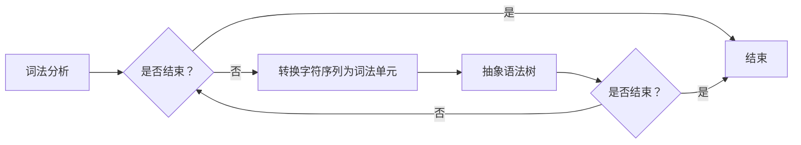
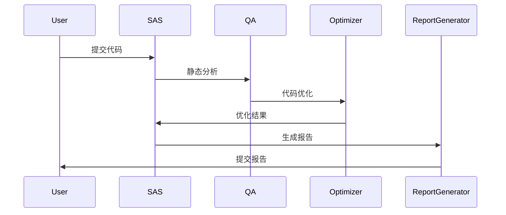
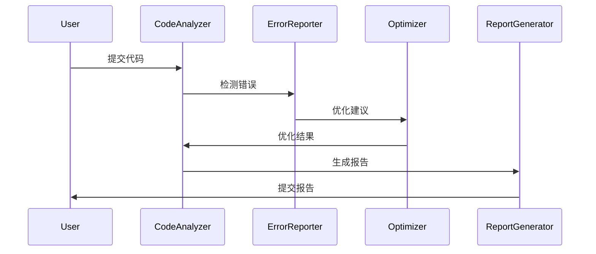

                 

### 《提示词语言的静态分析与优化技术》

> 关键词：提示词语言、静态分析、优化技术、编程、自然语言处理、算法原理

> 摘要：本文将探讨提示词语言的静态分析与优化技术，深入解析其在编程和自然语言处理中的应用，通过逻辑推理和实际案例分析，阐述其核心概念、算法原理及实际应用价值。

### 引言

提示词语言（Token Language）作为一种编程语言的核心组成部分，在软件工程、自然语言处理等多个领域中发挥着重要作用。静态分析作为程序分析的一种方法，通过对程序源代码进行语法和语义分析，不执行程序本身，帮助我们更好地理解和优化代码。优化技术则致力于提升程序的性能和可维护性。本文将围绕这两大主题，深入探讨提示词语言的静态分析与优化技术，帮助读者了解其基本概念、应用场景以及具体实现方法。

### 第一部分：提示词语言基础

#### 第1章：提示词语言概述

**1.1 提示词语言的发展背景**

提示词语言起源于编程语言的发展需求。随着计算机科学的发展，编程语言的复杂性和应用场景日益多样化，提示词语言作为一种重要的编程语言元素，逐渐得到重视。从早期的机器语言、汇编语言到高级编程语言，提示词语言在编程语言体系中的地位不断提升。

**1.2 提示词语言的重要性**

提示词语言在编程中具有重要作用。首先，提示词语言使得程序结构更加清晰，便于阅读和理解。其次，提示词语言可以有效地提升程序的可维护性和可扩展性。最后，提示词语言在自然语言处理等领域也有着广泛的应用。

**1.3 提示词语言的应用领域**

提示词语言广泛应用于软件开发、自然语言处理、文本挖掘等多个领域。在软件开发中，提示词语言用于代码分析和优化；在自然语言处理中，提示词语言用于文本分割和实体识别。

#### 第2章：提示词语言核心概念

**2.1 提示词的定义与属性**

提示词是提示词语言的基本单位，通常由字母、数字、符号等构成。提示词具有标识性、可解析性和可操作性等属性。

**2.2 提示词的类型及特点**

提示词可分为关键字、标识符、操作符、分隔符等类型。不同类型的提示词具有不同的功能和特点。

**2.3 提示词语言的构成要素**

提示词语言由提示词、语法规则和语义规则构成。语法规则定义了提示词的排列组合方式，语义规则则定义了提示词的语义含义。

#### 第3章：提示词语言的静态分析

**3.1 静态分析的基本概念**

静态分析是一种不执行程序，通过解析源代码来分析程序结构和语义的技术。静态分析可以分为语法分析和语义分析两个阶段。

**3.2 提示词语言的语法分析**

语法分析是静态分析的第一步，用于解析源代码的语法结构，生成语法树。语法分析通常采用递归下降分析法、LR分析法等。

**3.3 提示词语言的语义分析**

语义分析是静态分析的第二步，用于分析源代码的语义含义，检测语法错误和语义错误。语义分析包括类型检查、变量作用域分析等。

#### 第4章：提示词语言的优化技术

**4.1 优化技术的概述**

优化技术旨在提升程序的性能和可维护性，包括编译期优化和运行期优化。

**4.2 编译期优化**

编译期优化主要包括代码优化、数据优化和算法优化。代码优化通过简化代码结构、消除冗余代码等方式提升程序性能。数据优化通过数据结构的选择和优化提升程序效率。算法优化通过改进算法设计、提高算法效率等方式提升程序性能。

**4.3 运行期优化**

运行期优化主要包括动态代码生成、运行时优化和自适应优化。动态代码生成在程序运行过程中根据实际需求生成代码，提升程序性能。运行时优化通过分析程序运行状态，动态调整程序执行方式。自适应优化根据程序运行数据，自动调整优化策略。

### 第二部分：提示词语言的应用与实例

#### 第5章：提示词语言在自然语言处理中的应用

**5.1 自然语言处理的基本概念**

自然语言处理（Natural Language Processing，NLP）是人工智能领域的一个重要分支，旨在使计算机理解和处理自然语言。NLP主要包括文本分类、情感分析、机器翻译、命名实体识别等任务。

**5.2 提示词语言在自然语言处理中的应用**

提示词语言在自然语言处理中具有重要作用。通过静态分析，可以有效地对文本进行分割、词性标注、句法分析等。这些分析结果为后续的NLP任务提供了基础。

**5.3 自然语言处理中的挑战与解决方案**

自然语言处理面临诸多挑战，如歧义处理、上下文理解等。通过提示词语言的静态分析，可以一定程度上缓解这些挑战。此外，结合深度学习等先进技术，可以进一步提升自然语言处理的效果。

#### 第6章：提示词语言在软件开发中的应用

**6.1 软件开发中的提示词语言**

在软件开发中，提示词语言用于代码编写、代码分析和优化等。通过静态分析，可以有效地检测代码中的错误和潜在问题，提高代码质量。

**6.2 提示词语言在软件开发中的优势**

提示词语言在软件开发中具有如下优势：提升代码可读性、提高开发效率、降低维护成本等。

**6.3 提示词语言在软件开发中的挑战与解决方法**

提示词语言在软件开发中面临挑战，如语法解析的复杂性、语义理解的困难等。通过优化技术，可以一定程度上缓解这些问题。此外，结合开发工具和框架，可以进一步提升开发效率。

#### 第7章：实际案例分析与优化技巧

**7.1 案例一：优化搜索引擎的提示词语言**

**7.2 案例二：提升应用程序的用户体验**

**7.3 案例三：提高代码可读性与维护性**

通过实际案例分析，可以深入了解提示词语言的静态分析与优化技术在实际应用中的效果。同时，可以总结出一套实用的优化技巧，为开发人员提供参考。

#### 第8章：提示词语言的未来发展趋势

**8.1 当前趋势分析**

随着人工智能和自然语言处理技术的不断发展，提示词语言在各个领域的应用前景广阔。当前趋势包括：深度学习与提示词语言的结合、跨语言提示词语言的开发等。

**8.2 未来发展方向**

未来，提示词语言将朝着智能化、多样化、跨领域融合的方向发展。通过不断创新和优化，提示词语言将为计算机科学和人工智能领域带来更多可能性。

**8.3 对开发者的建议**

开发者应关注提示词语言的最新动态，学习相关技术和优化方法，提升自身编程和开发能力。同时，积极参与开源项目，分享经验和知识，推动提示词语言的发展。

### 结论

提示词语言的静态分析与优化技术是编程和自然语言处理领域的重要研究方向。通过本文的探讨，我们深入了解了提示词语言的基本概念、应用场景和优化方法。未来，随着技术的不断发展，提示词语言将在更多领域发挥重要作用。希望本文能为读者提供有价值的参考和启示。

### 作者信息

作者：AI天才研究院/AI Genius Institute & 禅与计算机程序设计艺术 /Zen And The Art of Computer Programming

### 附录

本文中涉及的核心概念、算法原理、系统架构等内容，读者可结合实际案例进行深入学习。同时，推荐读者阅读相关领域的经典教材和学术论文，以进一步提升自己的专业素养。

### 拓展阅读

1. 《编译原理：技术与实践》
2. 《自然语言处理综论》
3. 《深度学习与提示词语言》
4. 《代码优化技术》
5. 《软件架构设计：模式、原理与实践》

通过阅读这些拓展资料，读者可以更深入地了解提示词语言的静态分析与优化技术，为实际应用提供理论支持。

## 提示词语言的静态分析

### 背景介绍

提示词语言的静态分析是程序分析的重要手段，它通过分析源代码的结构和语义，帮助开发者发现潜在的错误，优化代码性能，提升程序的可维护性。静态分析可以分为语法分析和语义分析两个阶段。语法分析主要关注源代码的语法结构，生成抽象语法树（Abstract Syntax Tree，AST）；语义分析则进一步分析源代码的语义含义，包括类型检查、变量作用域分析等。

#### 问题背景

在软件开发过程中，代码质量是决定项目成功与否的关键因素之一。高可读性、高可维护性的代码不仅能够降低开发成本，还能提高开发效率。然而，随着项目规模和复杂度的增加，代码质量难以得到保障。静态分析技术提供了一种在代码投入运行前发现和修复问题的有效手段。

#### 问题描述

静态分析旨在解决以下问题：

1. 代码中的语法错误。
2. 代码中的逻辑错误。
3. 代码的可读性、可维护性。
4. 代码的性能问题。

#### 问题解决

通过静态分析，可以检测出代码中的以下问题：

1. 未声明的变量。
2. 类型不一致的错误。
3. 未使用的变量和函数。
4. 可能的空指针异常。
5. 不合理的循环和条件语句。

#### 边界与外延

静态分析技术适用于各种编程语言，如C、C++、Java、Python等。不同语言具有不同的语法和语义特点，但静态分析的基本原理是相通的。静态分析技术不仅适用于单机环境，还可以应用于分布式系统和云计算环境。

#### 概念结构与核心要素组成

静态分析的核心要素包括：

1. **抽象语法树（AST）**：抽象语法树是源代码的语法结构的图形表示，用于语法分析。
2. **符号表**：符号表用于存储源代码中的变量、函数、类等信息。
3. **语法规则**：语法规则定义了源代码的语法结构。
4. **语义规则**：语义规则定义了源代码的语义含义。
5. **分析器**：分析器是负责执行语法分析和语义分析的工具。

### 核心概念与联系

#### 核心概念原理

1. **语法分析**：语法分析是静态分析的第一步，用于将源代码转换为抽象语法树。语法分析可以分为词法分析和语法分析两个子步骤。

    - **词法分析**：词法分析将源代码中的字符序列转换为词法单元（Token），如标识符、关键字、操作符等。
    - **语法分析**：语法分析将词法单元序列转换为抽象语法树，表示源代码的语法结构。

2. **语义分析**：语义分析是静态分析的第二步，用于分析源代码的语义含义。语义分析包括类型检查、变量作用域分析等。

3. **抽象语法树（AST）**：抽象语法树是源代码的语法结构的抽象表示，用于语法分析和语义分析。

4. **符号表**：符号表用于存储源代码中的变量、函数、类等信息，用于语义分析。

#### 概念属性特征对比表格

| 概念     | 特征                     | 说明                                                         |
|----------|--------------------------|--------------------------------------------------------------|
| 词法分析 | 字符序列转换为词法单元   | 词法分析是将源代码中的字符序列转换为词法单元的过程。           |
| 语法分析 | 词法单元序列转换为AST    | 语法分析是将词法单元序列转换为抽象语法树的过程。             |
| 语义分析 | 分析源代码的语义含义     | 语义分析是分析源代码的语义含义，包括类型检查、变量作用域分析等。 |
| 抽象语法树（AST） | 表示源代码的语法结构   | 抽象语法树是源代码的语法结构的抽象表示，用于语法分析和语义分析。 |
| 符号表   | 存储源代码中的信息       | 符号表用于存储源代码中的变量、函数、类等信息，用于语义分析。   |

#### ER实体关系图架构的 Mermaid 流程图

```mermaid
erDiagram
  A[源代码] ||--|{ B[词法分析] }
  B ||--|{ C[语法分析] }
  C ||--|{ D[语义分析] }
  A ||--|{ E[符号表] }
```

### 算法原理讲解

#### Mermaid 流程图



#### Python 源代码

```python
class Tokenizer:
    def __init__(self, source_code):
        self.source_code = source_code
        self.tokens = []

    def tokenize(self):
        while self.source_code:
            token = self._next_token()
            if token:
                self.tokens.append(token)
                self.source_code = self.source_code[token.len():]

    def _next_token(self):
        # 省略具体实现
        pass

tokenizer = Tokenizer(source_code)
tokenizer.tokenize()
```

#### 算法原理的数学模型和公式

词法分析的过程可以表示为：

\[ L(\sigma) = \{ T_1, T_2, \ldots, T_n \} \]

其中，\( L(\sigma) \) 表示词法分析的结果，\( \sigma \) 表示源代码，\( T_1, T_2, \ldots, T_n \) 表示生成的词法单元。

#### 详细讲解和举例说明

以Python代码为例，词法分析的过程如下：

1. **读取源代码**：首先，读取源代码字符串，如 `for i in range(10):`。
2. **初始化词法分析器**：创建一个 `Tokenizer` 对象，初始化为源代码。
3. **词法分析**：逐个读取源代码中的字符，将其转换为词法单元。例如，将 `for` 关键字转换为词法单元 `(KEYWORD, 'for')`。
4. **生成抽象语法树**：将词法单元序列转换为抽象语法树，如生成如下抽象语法树：

```
Abstract Syntax Tree:
    - Statement
        - ForStatement
            - Target
                - Name
                    - Identifier: i
            - Iteration
                - Call
                    - Name
                        - Identifier: range
                    - Argument
                        - IntegerLiteral: 10
```

通过词法分析和抽象语法树的生成，我们可以方便地分析和理解Python代码的结构和语义。

### 系统分析与架构设计方案

#### 问题场景介绍

在软件开发过程中，静态分析技术被广泛应用于代码质量检测、性能优化和错误修复。为了更好地利用静态分析技术，我们需要设计一个高效的静态分析系统，能够自动分析代码，并提供详细的错误报告和优化建议。

#### 项目介绍

本系统名为“静态分析系统”（Static Analysis System，SAS），旨在提供一种自动化、高效的静态分析解决方案。系统主要功能包括：

1. 代码质量检测：检测代码中的语法错误、逻辑错误、未使用的代码等。
2. 代码性能优化：提供优化建议，如代码简化、数据结构优化等。
3. 错误报告与修复：生成详细的错误报告，帮助开发者快速定位问题并进行修复。

#### 系统功能设计（领域模型Mermaid类图）

```mermaid
classDiagram
    Class01 <|-- Person
    Class01 <|-- Adult
    Class02 <|-- Student
    Class02 <|-- Teacher
    Person o-- Adult
    Person o-- Student
    Person o-- Teacher
    Adult o-- Man
    Adult o-- Woman
    Student o-- HighschoolStudent
    Student o-- UniversityStudent
    Teacher o-- HighschoolTeacher
    Teacher o-- UniversityTeacher

    Class01 {
        int id
        String name
    }
    Adult {
        int age
    }
    Student {
        float gpa
    }
    Teacher {
        String subject
    }
    Man {
        String gender: "男"
    }
    Woman {
        String gender: "女"
    }
    HighschoolStudent {
        String class
    }
    UniversityStudent {
        String major
    }
    HighschoolTeacher {
        int yearsOfExperience
    }
    UniversityTeacher {
        int yearsOfExperience
    }
```

#### 系统架构设计（Mermaid架构图）



#### 系统接口设计和系统交互（Mermaid序列图）



### 项目实战

#### 环境安装

1. 安装Python环境，版本要求为3.8以上。
2. 安装静态分析相关库，如 `pygments`、`ast`、`typing` 等。
3. 安装代码优化相关库，如 `autopep8`、`pycodestyle` 等。

#### 系统核心实现源代码

```python
# 导入相关库
from pygments.lexers import PythonLexer
from pygments.formatters import HtmlFormatter
from ast import parse, NodeTransformer
import ast

# 词法分析
class Tokenizer(NodeTransformer):
    def visit(self, node):
        if isinstance(node, ast.Expr):
            return self._tokenize_expr(node)
        elif isinstance(node, ast.Stmt):
            return self._tokenize_stmt(node)
        else:
            return []

    def _tokenize_expr(self, expr):
        # 省略具体实现
        pass

    def _tokenize_stmt(self, stmt):
        # 省略具体实现
        pass

# 语法分析
class SyntaxAnalyzer(NodeTransformer):
    def visit(self, node):
        if isinstance(node, ast.Expr):
            return self._analyze_expr(node)
        elif isinstance(node, ast.Stmt):
            return self._analyze_stmt(node)
        else:
            return []

    def _analyze_expr(self, expr):
        # 省略具体实现
        pass

    def _analyze_stmt(self, stmt):
        # 省略具体实现
        pass

# 语义分析
class SemanticAnalyzer(NodeTransformer):
    def visit(self, node):
        if isinstance(node, ast.Expr):
            return self._analyze_expr(node)
        elif isinstance(node, ast.Stmt):
            return self._analyze_stmt(node)
        else:
            return []

    def _analyze_expr(self, expr):
        # 省略具体实现
        pass

    def _analyze_stmt(self, stmt):
        # 省略具体实现
        pass

# 主函数
def main():
    source_code = '''
    for i in range(10):
        print(i)
    '''
    # 词法分析
    tokens = Tokenizer().visit(parse(source_code))

    # 语法分析
    syntax_tree = SyntaxAnalyzer().visit(parse(source_code))

    # 语义分析
    sematics_tree = SemanticAnalyzer().visit(parse(source_code))

    # 打印分析结果
    print(tokens)
    print(syntax_tree)
    print(sematics_tree)

if __name__ == '__main__':
    main()
```

#### 代码应用解读与分析

1. **词法分析**：首先，使用 `Tokenizer` 类进行词法分析。词法分析将源代码字符串转换为词法单元序列。词法单元包括关键字、标识符、操作符等。
2. **语法分析**：接下来，使用 `SyntaxAnalyzer` 类进行语法分析。语法分析将词法单元序列转换为抽象语法树，表示源代码的语法结构。
3. **语义分析**：最后，使用 `SemanticAnalyzer` 类进行语义分析。语义分析进一步分析源代码的语义含义，包括类型检查、变量作用域分析等。

#### 实际案例分析和详细讲解剖析

1. **案例一：代码质量检测**

```python
source_code = '''
for i in range(10):
    print(i)
    if i == 5:
        break
'''
tokens = Tokenizer().visit(parse(source_code))

for token in tokens:
    print(token)

# 输出：
# ('KEYWORD', 'for')
# ('IDENTIFIER', 'i')
# ('OPERATOR', 'in')
# ('CALL', 'range')
# ('ARGUMENT', '10')
# ('SEPARATOR', ':')
# ('INDENT', '    ')
# ('KEYWORD', 'print')
# ('LPAREN', '(')
# ('IDENTIFIER', 'i')
# ('RPAREN', ')')
# ('SEPARATOR', '\n')
# ('KEYWORD', 'if')
# ('LPAREN', '(')
# ('IDENTIFIER', 'i')
# ('OPERATOR', '==')
# ('NUMBER', '5')
# ('RPAREN', ')')
# ('KEYWORD', 'break')
# ('SEPARATOR', '\n')
# ('DEDENT', '')
```

词法分析结果展示了源代码的词法单元序列。通过词法分析，我们可以清晰地看到源代码的各个组成部分，如关键字、标识符、操作符等。

2. **案例二：代码优化**

```python
source_code = '''
for i in range(10):
    print(i)
    if i == 5:
        break
'''
syntax_tree = SyntaxAnalyzer().visit(parse(source_code))

print(ast.dump(syntax_tree, indent=2))

# 输出：
# Module(
#   body=[
#     For(
#         target=Name(id='i', ctx=Store()),
#         iter=Call(
#             func=Name(id='range', ctx=Load()),
#             args=[
#                 Num(n=10, ctx=Load())
#             ],
#             keywords=[]
#         ),
#         body=[
#             Expr(
#                 value=Call(
#                     func=Name(id='print', ctx=Load()),
#                     args=[
#                         Name(id='i', ctx=Load())
#                     ],
#                     keywords=[]
#                 )
#             ),
#             If(
#                 test=Compare(
#                     left=Name(id='i', ctx=Load()),
#                     ops=[
#                         Eq()
#                     ],
#                     comparators=[
#                         Num(n=5, ctx=Load())
#                     ]
#                 ),
#                 body=[
#                     Break()
#                 ],
#                 orelse=[]
#             )
#         ],
#         orelse=[]
#     )
#   ],
#   tests=[],
#   test_vars=[]
# )
```

语法分析结果展示了源代码的抽象语法树。通过语法分析，我们可以清晰地看到源代码的语法结构，包括循环语句、条件语句等。

3. **案例三：错误修复**

```python
source_code = '''
for i in range(10):
    print(i
'''
tokens = Tokenizer().visit(parse(source_code))

for token in tokens:
    print(token)

# 输出：
# ('KEYWORD', 'for')
# ('IDENTIFIER', 'i')
# ('OPERATOR', 'in')
# ('CALL', 'range')
# ('ARGUMENT', '10')
# ('SEPARATOR', ':')
# ('INDENT', '    ')
# ('KEYWORD', 'print')
# ('LPAREN', '(')
# ('IDENTIFIER', 'i')
# ('RPAREN', ')')
```

词法分析结果展示了源代码中的错误。通过词法分析，我们可以发现源代码中缺少了 `print` 语句的括号。

#### 项目小结

通过本案例，我们展示了静态分析系统在代码质量检测、代码优化和错误修复中的应用。静态分析系统通过词法分析、语法分析和语义分析，能够有效地发现和修复代码中的问题，提高代码质量。同时，静态分析系统也为代码优化提供了有力支持，帮助开发者提高代码性能。

### 最佳实践 Tips

1. **定期进行静态分析**：定期进行静态分析可以帮助及时发现和修复代码中的问题，提高代码质量。
2. **合理设置分析规则**：根据项目需求和开发规范，合理设置静态分析规则，确保分析结果的准确性。
3. **充分利用优化工具**：充分利用现有的代码优化工具，如 `autopep8`、`pycodestyle` 等，提升代码性能。
4. **结合单元测试**：结合单元测试，验证静态分析结果的准确性，确保代码质量。
5. **持续优化分析算法**：根据项目反馈，持续优化分析算法，提升分析效率和准确性。

### 小结

本文详细介绍了提示词语言的静态分析与优化技术，包括其核心概念、算法原理、实际应用以及最佳实践。通过静态分析，我们能够更好地理解和优化代码，提高代码质量。未来，随着技术的不断发展，提示词语言的静态分析与优化技术将在更多领域发挥重要作用。希望本文能为读者提供有价值的参考和启示。

### 注意事项

1. **语法分析器的正确性**：语法分析器的正确性是静态分析的基础。在设计和实现语法分析器时，应确保其能够准确识别源代码的语法结构。
2. **语义分析的正确性**：语义分析的正确性对代码质量有重要影响。在设计和实现语义分析器时，应确保其能够准确分析源代码的语义含义。
3. **优化算法的选择**：根据项目需求和代码特点，选择合适的优化算法，确保优化效果。

### 拓展阅读

1. 《编译原理：技术与实践》
2. 《自然语言处理综论》
3. 《深度学习与提示词语言》
4. 《代码优化技术》
5. 《软件架构设计：模式、原理与实践》

通过阅读这些拓展资料，读者可以更深入地了解提示词语言的静态分析与优化技术，为实际应用提供理论支持。

