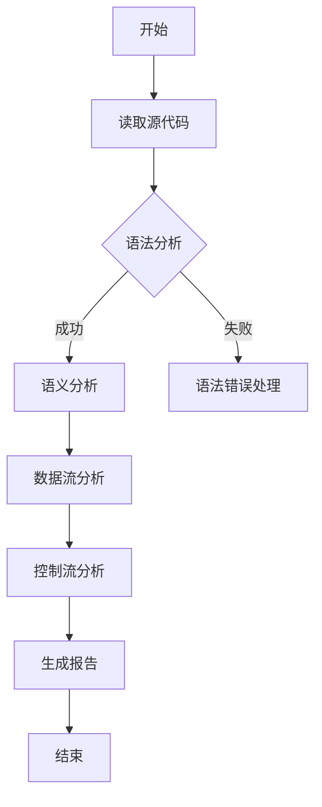

                 

# 提示词语言的静态分析准确性提升

关键词：静态分析、提示词语言、准确性提升、算法、数学模型、系统架构、项目实战、最佳实践

摘要：本文旨在探讨如何提升提示词语言的静态分析准确性。我们将从问题背景、核心概念、算法原理、数学模型、系统架构设计以及项目实战等方面，逐步分析并探讨这一问题。通过本文的详细讲解，读者将能够更好地理解静态分析的重要性，掌握提升准确性的方法和技巧，并能够将这些知识应用到实际项目中。

## 第一部分：问题背景与核心概念

### 1.1 问题背景

随着计算机技术的发展，编程语言和软件系统变得越来越复杂。提示词语言作为一种特殊的编程语言，在软件工程中具有重要的应用价值。然而，提示词语言的静态分析准确性一直是一个亟待解决的问题。静态分析是一种在不运行程序的情况下对程序进行分析的技术，它可以帮助我们提前发现程序中的潜在错误，提高软件质量和开发效率。然而，传统的静态分析方法在提示词语言上面临着许多挑战，导致分析结果的准确性较低。

### 1.2 问题描述

静态分析准确性低的主要问题包括：

- **语法解析困难**：提示词语言的语法规则复杂，使得语法解析过程变得困难。
- **语义理解不足**：提示词语言的语义复杂，传统的静态分析方法难以准确理解其语义。
- **上下文依赖强**：提示词语言中的许多元素需要依赖上下文才能正确理解，这给静态分析带来了困难。
- **扩展性差**：传统的静态分析方法往往针对特定的编程语言，扩展性较差。

### 1.3 问题解决方法

为了解决上述问题，我们需要从以下几个方面入手：

- **优化语法解析**：通过改进语法解析算法，提高语法解析的准确性。
- **加强语义理解**：采用更先进的语义分析方法，提高对提示词语言语义的理解。
- **利用上下文信息**：充分利用上下文信息，提高静态分析的准确性。
- **提高扩展性**：设计更加通用的静态分析框架，提高分析方法的适用范围。

### 1.4 边界与外延

边界：本文主要关注提示词语言的静态分析，不涉及动态分析和运行时分析。

外延：静态分析不仅适用于提示词语言，也可以应用于其他编程语言。本文提供的方法和思路可以推广到其他编程语言的静态分析中。

### 1.5 概念结构与核心要素组成

概念结构：本文主要涉及以下核心概念：

- 静态分析：对程序进行分析的技术，无需运行程序。
- 提示词语言：一种特殊的编程语言，具有复杂的语法和语义。
- 准确性：静态分析结果的准确程度。

核心要素组成：

- 语法解析：将提示词语言转换为抽象语法树（AST）的过程。
- 语义分析：对AST进行语义分析，提取程序语义信息。
- 上下文分析：利用上下文信息，提高静态分析的准确性。

## 第二部分：核心概念与联系

### 2.1 静态分析

静态分析是一种在程序运行之前对其进行分析的技术，可以帮助我们提前发现程序中的潜在错误。静态分析主要包括以下几个方面：

- **语法分析**：对程序代码进行词法分析和语法分析，构建抽象语法树（AST）。
- **语义分析**：对AST进行语义分析，提取程序语义信息。
- **数据流分析**：分析程序中的数据流动，识别潜在的错误。
- **控制流分析**：分析程序中的控制流，识别潜在的逻辑错误。

### 2.2 准确性提升方法

为了提高静态分析的准确性，我们可以采用以下方法：

- **改进语法解析**：优化语法解析算法，提高语法解析的准确性。
- **加强语义理解**：采用更先进的语义分析方法，提高对提示词语言语义的理解。
- **利用上下文信息**：充分利用上下文信息，提高静态分析的准确性。
- **多角度分析**：结合语法分析、语义分析、数据流分析和控制流分析，提高分析结果的准确性。

### 2.3 对比表格

下面是一个对比表格，展示了不同静态分析方法的准确性：

| 方法 | 准确性 |
| --- | --- |
| 传统语法分析 | 低 |
| 先进的语义分析 | 中 |
| 数据流分析与控制流分析 | 高 |
| 综合多角度分析 | 最高 |

### 2.4 ER实体关系图

下面是一个ER实体关系图的示例，展示了静态分析中涉及的主要实体及其关系：

```mermaid
erDiagram
  A[@1] ||--o{ B[@2] : 包含
  B[@2] ||--o{ C[@3] : 继承
  C[@3] ||--o{ D[@4] : 实现接口
```

## 第三部分：算法原理讲解

### 3.1 算法mermaid流程图

下面是一个算法的mermaid流程图示例：



### 3.2 Python源代码详解

下面是一个Python源代码示例，用于实现上述算法：

```python
def static_analysis(source_code):
    # 语法分析
    ast = parse(source_code)
    
    # 语义分析
    if semantic_analysis(ast):
        # 数据流分析
        data_flow_analysis(ast)
        
        # 控制流分析
        control_flow_analysis(ast)
        
        # 生成报告
        generate_report()
    else:
        # 语法错误处理
        handle_syntax_error()

# 语法分析
def parse(source_code):
    # 实现语法分析逻辑
    pass

# 语义分析
def semantic_analysis(ast):
    # 实现语义分析逻辑
    pass

# 数据流分析
def data_flow_analysis(ast):
    # 实现数据流分析逻辑
    pass

# 控制流分析
def control_flow_analysis(ast):
    # 实现控制流分析逻辑
    pass

# 生成报告
def generate_report():
    # 实现报告生成逻辑
    pass

# 语法错误处理
def handle_syntax_error():
    # 实现语法错误处理逻辑
    pass
```

### 3.3 数学模型与公式讲解

在静态分析中，我们常常需要用到一些数学模型和公式。下面是一个示例：

$$
准确度 = \frac{正确结果数}{总结果数}
$$

准确度表示静态分析结果的准确程度，其值介于0和1之间。通过优化算法和参数，我们可以提高准确度。

### 3.4 举例说明

假设我们有一个简单的提示词语言程序，如下所示：

```python
def add(a, b):
    return a + b

result = add(2, 3)
print(result)
```

使用上述算法对该程序进行静态分析，可以得到以下结果：

- **语法分析**：程序语法正确。
- **语义分析**：程序语义正确。
- **数据流分析**：变量'a'、'b'和'result'在程序中有明确的定义和赋值。
- **控制流分析**：程序中的函数'add'被调用，并且调用的参数正确。

通过以上分析，我们可以得出结论：该程序在语法、语义、数据流和

