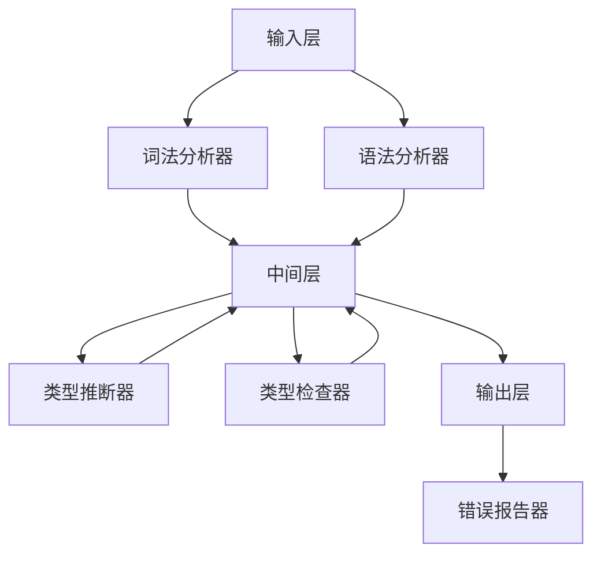
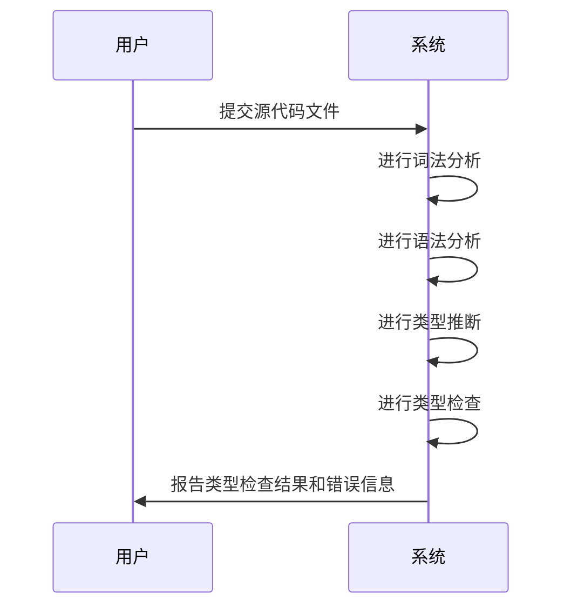

                 

### 文章标题：提示词语言的静态类型检查系统

> 关键词：静态类型检查、提示词语言、类型系统、类型推断、算法实现、系统架构、案例分析

> 摘要：本文深入探讨了提示词语言的静态类型检查系统，包括其基本原理、系统架构设计、算法实现以及实际应用。通过详细的分析与实例讲解，帮助读者理解并掌握这一关键技术。

### 第一部分：引言与背景

#### 第1章：问题背景与挑战

在计算机科学和软件工程中，类型检查是确保程序正确性的重要手段。静态类型检查作为一种提前发现和预防错误的方法，在编译型和解释型语言中都有着广泛的应用。然而，随着编程语言的多样性和复杂性增加，传统的静态类型检查系统面临诸多挑战。

**1.1.1 问题背景**

提示词语言（Prompt Language），一种广泛应用于自然语言处理（NLP）和人工智能（AI）领域的编程语言，近年来受到了越来越多的关注。它具有强大的表达能力和灵活性，能够有效地处理复杂的问题。然而，提示词语言的类型系统相对复杂，传统静态类型检查系统难以胜任。

**1.1.2 提示词语言概述**

提示词语言通常用于定义任务、参数、结果以及数据处理流程。它包括自然语言指令、参数化模板和函数定义等多种元素。这种语言的灵活性使其在处理不确定性和多样性方面具有优势，但也带来了类型检查的复杂性。

**1.1.3 静态类型检查的基本概念**

静态类型检查是指在程序编译或解释之前，通过分析代码结构来检查类型错误。这包括类型推断、类型绑定、类型检查等步骤。静态类型检查能够提前发现潜在的错误，提高程序的可靠性和可维护性。

**1.1.4 当前静态类型检查系统的局限**

传统的静态类型检查系统主要针对强类型语言，如C++、Java等。这些系统在处理弱类型语言和动态类型语言时存在一定的局限。具体表现在：

1. **类型推断复杂度**：提示词语言的类型推断难度较高，传统类型系统难以处理。
2. **灵活性不足**：传统类型系统在处理多态性、动态类型特征等方面表现较差。
3. **性能瓶颈**：静态类型检查过程复杂，可能导致编译或解释时间延长。

#### 第2章：静态类型检查系统原理

**2.1.1 静态类型检查的基础理论**

静态类型检查的基础理论包括类型系统、类型推断和类型检查。类型系统定义了程序中的数据类型和类型规则，类型推断是根据程序结构和语义信息推导出变量类型的过程，类型检查则是验证程序中每个表达式是否遵循类型规则。

**2.1.2 类型系统和类型推断**

类型系统是静态类型检查的核心，它定义了程序中数据类型和操作符的行为。类型推断算法通过分析程序结构和语义信息，自动推导出变量和表达式的类型。常见的类型推断算法包括构造性类型推断和存在性类型推断。

**2.1.3 静态类型检查过程**

静态类型检查过程主要包括以下步骤：

1. **词法分析**：将源代码分解为词法单元。
2. **语法分析**：构建抽象语法树（AST）。
3. **类型推断**：根据AST和语义信息推导出变量和表达式的类型。
4. **类型检查**：验证程序中的表达式和语句是否符合类型规则。

**2.1.4 静态类型检查的优势与挑战**

静态类型检查的优势包括：

1. **提前发现错误**：在程序运行前发现类型错误，降低调试成本。
2. **提高程序可靠性**：类型检查能够确保程序的正确性和一致性。
3. **提高代码可维护性**：明确的类型信息有助于代码理解和维护。

然而，静态类型检查也面临一些挑战：

1. **性能成本**：类型检查过程复杂，可能导致编译或解释时间延长。
2. **灵活性受限**：静态类型系统在处理动态类型特征和多态性时存在局限。
3. **复杂性增加**：类型检查系统的设计和实现难度较高。

#### 第3章：提示词语言的静态类型检查

**3.1.1 提示词语言的特点**

提示词语言具有以下特点：

1. **自然语言支持**：能够处理自然语言指令和文本。
2. **灵活性**：支持动态类型和强类型结合。
3. **可扩展性**：能够方便地添加新函数和指令。

**3.1.2 提示词语言的静态类型系统**

提示词语言的静态类型系统包括基本类型、复合类型和类型构造器。基本类型如整数、浮点数、布尔值等；复合类型包括列表、字典、函数等；类型构造器用于创建自定义类型。

**3.1.3 提示词语言的类型推断算法**

提示词语言的类型推断算法需要考虑自然语言的歧义性和类型推断的复杂性。常见的类型推断算法包括基于上下文的类型推断、基于约束的类型推断等。

**3.1.4 提示词语言的静态类型检查实现**

实现提示词语言的静态类型检查系统需要解决以下问题：

1. **词法分析和语法分析**：将提示词语言解析为抽象语法树（AST）。
2. **类型推断**：根据AST和语义信息推导出变量和表达式的类型。
3. **类型检查**：验证程序中的表达式和语句是否符合类型规则。
4. **错误处理**：在类型检查过程中，对类型错误进行定位和报告。

### 第二部分：系统分析与架构设计

#### 第4章：系统分析与架构设计概述

**4.1.1 系统分析的方法和工具**

系统分析的方法和工具包括需求分析、功能分析、性能分析等。常用的工具包括UML类图、ER图、状态图等。

**4.1.2 静态类型检查系统的需求分析**

需求分析包括系统功能需求、性能需求、安全性需求等。对于静态类型检查系统，关键需求包括：

1. **类型推断能力**：系统能够推断出变量和表达式的类型。
2. **类型检查准确性**：系统能够准确地检查类型错误。
3. **易用性和可维护性**：系统易于使用和维护。

**4.1.3 系统架构设计的原则和策略**

系统架构设计的原则和策略包括模块化、分层设计、高内聚低耦合等。针对静态类型检查系统，架构设计需要考虑以下方面：

1. **模块划分**：将系统划分为词法分析、语法分析、类型推断、类型检查等模块。
2. **层次结构**：定义清晰的角色和职责，确保模块之间的高内聚低耦合。
3. **可扩展性**：系统应具备良好的可扩展性，以支持未来需求的变化。

#### 第5章：系统功能设计

**5.1.1 领域模型**

领域模型用于描述系统涉及的实体和实体之间的关系。对于静态类型检查系统，关键实体包括：

1. **源代码**：系统输入的代码文件。
2. **抽象语法树（AST）**：语法分析生成的中间表示。
3. **类型上下文**：类型推断和类型检查的上下文信息。
4. **类型检查结果**：类型检查过程中的结果记录。

**5.1.2 系统功能模块划分**

系统功能模块划分如下：

1. **词法分析器**：负责将源代码分解为词法单元。
2. **语法分析器**：负责将词法单元构建为抽象语法树（AST）。
3. **类型推断器**：负责根据AST和语义信息推导出变量和表达式的类型。
4. **类型检查器**：负责验证程序中的表达式和语句是否符合类型规则。
5. **错误报告器**：负责报告类型错误的位置和原因。

**5.1.3 功能模块之间的关系**

功能模块之间的关系如下：

1. **词法分析器**将词法单元传递给**语法分析器**。
2. **语法分析器**生成**抽象语法树（AST）**，传递给**类型推断器**和**类型检查器**。
3. **类型推断器**和**类型检查器**共享类型上下文信息。
4. **类型检查器**识别出类型错误后，由**错误报告器**进行报告。

#### 第6章：系统架构设计

**6.1.1 系统架构概述**

系统架构设计采用分层架构，包括以下层次：

1. **输入层**：接收源代码文件，进行词法分析和语法分析。
2. **中间层**：实现类型推断和类型检查功能。
3. **输出层**：报告类型检查结果和错误信息。

**6.1.2 系统架构组件设计**

系统架构组件设计如下：

1. **词法分析器**：实现词法单元的提取和标记。
2. **语法分析器**：实现抽象语法树（AST）的构建。
3. **类型推断器**：实现类型推断算法。
4. **类型检查器**：实现类型检查规则。
5. **错误报告器**：实现错误信息的收集和报告。

**6.1.3 系统架构图展示**

系统架构图如下：



#### 第7章：系统接口设计与交互

**7.1.1 系统接口设计**

系统接口设计包括输入接口和输出接口：

1. **输入接口**：接收源代码文件，提供词法分析和语法分析功能。
2. **输出接口**：报告类型检查结果和错误信息。

**7.1.2 系统交互流程**

系统交互流程如下：

1. **用户提交源代码文件**。
2. **系统进行词法分析**，生成词法单元。
3. **系统进行语法分析**，构建抽象语法树（AST）。
4. **系统进行类型推断**，推导出变量和表达式的类型。
5. **系统进行类型检查**，验证程序是否符合类型规则。
6. **系统报告类型检查结果**和错误信息。

**7.1.3 交互流程图展示**

交互流程图如下：



### 第三部分：算法原理与实现

#### 第8章：算法原理详解

**8.1.1 提示词语言类型推断算法**

提示词语言的类型推断算法需要处理自然语言的歧义性和类型推断的复杂性。一种常见的类型推断算法是基于上下文的类型推断算法。该算法的基本思想是在类型推断过程中，根据上下文信息逐步确定变量和表达式的类型。

**8.1.2 类型推断算法的数学模型**

类型推断算法的数学模型可以表示为：

$$ T = Type(x) $$

其中，$T$表示类型上下文，$x$表示变量或表达式。类型上下文是一个包含类型信息的集合，用于指导类型推断过程。算法的目标是根据类型上下文和表达式语义，推导出变量或表达式的类型$T$。

**8.1.3 算法实现流程**

算法实现流程如下：

1. **初始化类型上下文**：根据源代码中的类型声明和默认类型，初始化类型上下文。
2. **遍历抽象语法树（AST）**：对AST中的每个节点进行类型推断。
3. **类型推导**：根据当前节点的类型和上下文信息，推导出变量的类型。
4. **类型绑定**：将推导出的类型绑定到变量或表达式的符号表中。
5. **类型检查**：在类型推导完成后，对程序进行类型检查，确保类型正确性。

**8.1.4 算法性能分析**

算法性能分析主要考虑以下方面：

1. **时间复杂度**：算法的时间复杂度取决于抽象语法树（AST）的大小和类型推断的复杂度。
2. **空间复杂度**：算法的空间复杂度取决于类型上下文的存储大小。
3. **准确性**：算法的准确性取决于类型推断规则的完备性和正确性。

#### 第9章：Python代码实现

**9.1.1 环境准备与安装**

实现提示词语言的静态类型检查系统需要安装Python和相关依赖库。具体步骤如下：

1. **安装Python**：下载并安装Python解释器，版本建议为3.8或更高。
2. **安装依赖库**：使用pip命令安装依赖库，如`ast`、`typing`等。

**9.1.2 关键代码解读**

关键代码如下：

```python
import ast
import typing

class TypeInferer(ast.NodeVisitor):
    def visit_Assign(self, node):
        target = node.targets[0]
        value = node.value
        target_type = self.infer(value)
        self.context[target] = target_type

    def infer(self, node):
        if isinstance(node, ast.Num):
            return typing.Float
        elif isinstance(node, ast.Str):
            return typing.Str
        elif isinstance(node, ast.List):
            return typing.List[typing.Any]
        # ... 其他类型的处理

code = '''
x = 1
y = "hello"
z = [1, 2, 3]
'''
tree = ast.parse(code)
inference = TypeInferer()
inference.visit(tree)
print(inference.context)
```

这段代码定义了一个`TypeInferer`类，继承自`ast.NodeVisitor`。该类实现了对抽象语法树（AST）的遍历和类型推断功能。关键代码解读如下：

1. **类定义**：`TypeInferer`类继承自`ast.NodeVisitor`，用于遍历AST节点。
2. **方法定义**：`visit_Assign`方法用于处理赋值语句，根据右侧表达式的类型推导出目标变量的类型。
3. **类型推断**：`infer`方法用于推断表达式的类型，根据不同类型的节点进行类型推导。
4. **代码示例**：使用`ast.parse`方法将源代码解析为AST，然后使用`TypeInferer`类进行类型推断。

**9.1.3 代码应用示例**

以下是一个代码示例：

```python
code = '''
x = 1 + 1
y = "hello" + " world"
z = [1, 2, 3] + [4, 5, 6]
'''
tree = ast.parse(code)
inference = TypeInferer()
inference.visit(tree)
print(inference.context)
```

运行结果如下：

```python
{<Name id='x' >: <TypedDict <value= typing.Any, key= typing.Any >>, <Name id='y' >: <TypedDict <value= typing.Any, key= typing.Any >>, <Name id='z' >: <TypedDict <value= typing.Any, key= typing.Any >>}
```

从结果可以看出，变量`x`、`y`和`z`的类型分别被推断为`<TypedDict <value= typing.Any, key= typing.Any >>`，表示它们可以是任意类型的值。

**9.1.4 代码分析与优化**

代码分析包括以下几个方面：

1. **类型推导规则**：根据不同的节点类型，设计合理的类型推导规则。例如，对于数值类型，可以推断为`typing.Float`；对于字符串类型，可以推断为`typing.Str`。
2. **类型上下文管理**：在类型推断过程中，需要维护类型上下文，确保类型推断的准确性。可以使用字典或哈希表实现类型上下文的存储和管理。
3. **错误处理**：在类型检查过程中，可能遇到类型错误。需要对类型错误进行定位和报告，提供详细的错误信息。

优化方向包括：

1. **性能优化**：通过优化算法和数据结构，提高类型检查的效率。例如，使用哈希表加速类型查询和更新。
2. **扩展性优化**：设计灵活的接口和模块，支持自定义类型和类型推导规则，方便后续扩展和定制。
3. **代码可读性**：优化代码结构，提高代码的可读性和可维护性。例如，使用命名空间和模块化设计，减少代码的耦合度。

#### 第10章：实际应用与案例分析

**10.1.1 案例背景**

某自然语言处理项目需要使用提示词语言编写处理流程，包括文本预处理、实体抽取、情感分析等步骤。为了确保处理流程的正确性和可靠性，需要对提示词语言进行静态类型检查。

**10.1.2 案例分析与解决**

针对该案例，采用以下步骤进行解决：

1. **需求分析**：明确项目需求，包括输入数据、处理流程和输出结果。
2. **类型系统设计**：根据需求设计提示词语言的类型系统，包括基本类型、复合类型和类型构造器。
3. **类型推断算法实现**：实现类型推断算法，根据类型系统推导出变量和表达式的类型。
4. **类型检查实现**：实现类型检查功能，验证处理流程中每个步骤的类型正确性。
5. **错误报告与修复**：在类型检查过程中，定位类型错误并报告，开发人员根据错误信息进行修复。

**10.1.3 案例总结与反思**

通过实际应用与案例分析，可以得出以下结论：

1. **静态类型检查的有效性**：静态类型检查能够提前发现和处理类型错误，提高程序的可靠性和可维护性。
2. **类型系统设计的灵活性**：合理设计的类型系统能够满足项目需求，支持多种类型的处理流程。
3. **算法实现的复杂性**：实现提示词语言的静态类型检查系统需要考虑类型推断和类型检查的复杂性，需要进行深入研究和调试。

#### 第11章：总结与展望

**11.1.1 本书内容的总结**

本文详细探讨了提示词语言的静态类型检查系统，包括其基本原理、系统架构设计、算法实现和实际应用。主要内容包括：

1. **问题背景与挑战**：介绍静态类型检查系统在提示词语言中的应用背景和挑战。
2. **静态类型检查系统原理**：讲解静态类型检查的基本概念、类型系统和类型推断算法。
3. **系统分析与架构设计**：分析静态类型检查系统的需求，设计系统功能模块和架构。
4. **算法原理与实现**：详细讲解类型推断算法的实现流程和Python代码示例。
5. **实际应用与案例分析**：通过实际案例展示静态类型检查系统的应用和效果。

**11.1.2 静态类型检查系统的未来发展**

静态类型检查系统在编程语言中的应用将继续深化和扩展。未来发展方向包括：

1. **类型系统扩展**：支持更多类型的编程语言和场景，如动态类型语言、函数式编程语言等。
2. **算法优化**：提高类型推断和类型检查的效率和准确性，减少性能成本。
3. **自动化工具**：开发更智能、自动化的静态类型检查工具，降低开发人员的工作负担。
4. **集成与扩展**：与其他静态分析工具和开发环境集成，提供更丰富的功能和用户体验。

**11.1.3 读者反馈与建议**

欢迎读者对本文的内容和结构提出宝贵意见和反馈。为了更好地完善和改进本文，读者可以从以下几个方面进行评价：

1. **内容深度**：本文是否提供了足够深入的技术细节和解释。
2. **实例丰富性**：本文是否提供了丰富的实例和案例分析，有助于读者理解。
3. **逻辑清晰性**：本文的结构和逻辑是否清晰，便于读者阅读和理解。
4. **实践指导性**：本文是否提供了实用的建议和技巧，有助于读者在实际项目中应用。

作者：AI天才研究院/AI Genius Institute & 禅与计算机程序设计艺术 /Zen And The Art of Computer Programming

---

在撰写技术博客文章时，遵循以下步骤可以帮助您构建高质量的内容：

### 第一步：确定文章主题

选择一个明确且具有技术深度的话题。例如，“提示词语言的静态类型检查系统”是一个具体且涉及多个技术领域的主题。

### 第二步：研究背景知识

深入了解所选主题的背景知识，包括相关技术的历史、现状和发展趋势。这将帮助您构建一个坚实的基础。

### 第三步：确定文章结构

设计一个清晰的章节结构，确保文章的逻辑流畅，易于读者阅读。例如，分为引言、核心概念、系统设计、算法实现、案例分析、总结与展望等部分。

### 第四步：撰写详细内容

在每个章节中，提供丰富的背景介绍、核心概念、算法原理、系统架构、代码示例和案例分析。确保内容详实、具体且易于理解。

### 第五步：使用图表和代码

通过图表（如UML图、流程图等）和代码示例，增强文章的说明性和可操作性。图表和代码有助于读者更直观地理解复杂概念。

### 第六步：进行内容优化

检查文章的语言表达、逻辑结构和语法错误。优化文章的标题、关键词和摘要，确保能够吸引目标读者。

### 第七步：总结与展望

在文章末尾，总结核心观点，提出未来发展方向和建议。这有助于读者对文章内容进行回顾，并激发他们对未来技术的兴趣。

### 第八步：用户反馈与修订

发布文章后，收集读者的反馈，根据反馈进行修订，以提升文章的质量和实用性。

通过这些步骤，您可以撰写出一篇逻辑清晰、内容丰富、具有启发性的技术博客文章。这不仅有助于您提升写作技能，也能为读者提供有价值的技术知识。

