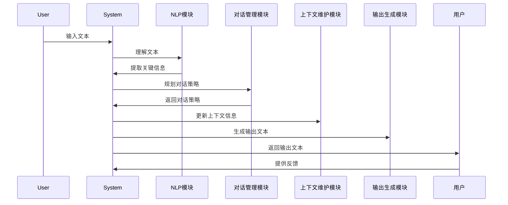

                 

### 提示词语言：AI交互的未来

> 关键词：提示词语言、AI交互、自然语言处理、机器学习、深度学习、智能应用

> 摘要：本文从AI交互技术的兴起与挑战出发，探讨了提示词语言的概念与原理，介绍了自然语言处理技术、机器学习与深度学习在提示词语言实现中的应用，分析了提示词语言在不同领域的应用场景，并展望了其未来的发展趋势及伦理问题。

----------------------------------------------------------------

### 第一部分：AI交互技术概述

#### 第1章：AI交互的兴起与挑战

##### 1.1 AI交互的定义与背景

人工智能（AI）作为计算机科学的一个分支，其目标是使计算机具有人类智能的某些特征，例如学习、推理、问题解决和自然语言理解等。随着计算能力的提升和大数据技术的发展，AI逐渐从理论走向应用，成为改变人们生活方式的重要力量。AI交互，即人工智能与人类之间的交互，是AI技术中至关重要的一部分。

AI交互的兴起可以追溯到20世纪80年代，当时专家系统成为AI研究的重点。随着互联网的普及和智能手机的兴起，AI交互得到了广泛应用，例如智能客服、智能家居、智能教育等。然而，传统的AI交互方式往往依赖于预先设定的规则，缺乏自适应性和灵活性，无法满足用户日益复杂的交互需求。

##### 1.2 AI交互的发展历程

AI交互的发展历程可以分为几个阶段：

1. **规则驱动**：早期的AI交互主要依赖于规则系统，如专家系统和决策树。这类系统能够处理简单的交互任务，但无法应对复杂的、动态变化的交互场景。
2. **模板匹配**：随着自然语言处理技术的发展，AI交互开始采用模板匹配技术，能够处理自然语言输入。然而，模板匹配的灵活性和准确性有限，难以实现高效的交互。
3. **统计学习**：21世纪初，机器学习和深度学习的兴起为AI交互带来了新的可能性。通过大量的训练数据，统计学习模型能够自动学习和优化交互策略，提高了交互的智能化水平。
4. **生成对抗网络（GAN）**：近年来，生成对抗网络（GAN）等新型深度学习技术开始应用于AI交互，使得AI能够生成更加自然、流畅的对话。

##### 1.3 当前AI交互技术的现状

当前，AI交互技术已经取得了显著进展，主要体现在以下几个方面：

1. **自然语言理解**：通过深度学习技术，AI能够更好地理解自然语言输入，包括语义理解、情感分析和意图识别等。
2. **多模态交互**：除了文本，AI交互还支持语音、图像、视频等多模态输入，实现了更丰富的交互体验。
3. **对话管理**：对话管理系统（Dialogue Management System）逐渐成为AI交互的核心，通过规划、监控和调整对话策略，实现了更自然的交互体验。
4. **个性化交互**：基于用户的历史数据和偏好，AI交互系统能够提供个性化的服务，提高用户体验。

##### 1.4 AI交互面临的主要挑战

尽管AI交互技术取得了显著进展，但仍面临以下主要挑战：

1. **数据隐私与安全**：AI交互依赖于大量的用户数据，如何保护用户隐私和数据安全是一个重要问题。
2. **伦理问题**：AI交互可能引发一系列伦理问题，如偏见、透明度和责任归属等。
3. **复杂性与可解释性**：深度学习模型在处理复杂任务时具有很高的性能，但模型的内部机制往往难以解释，这限制了其在关键领域的应用。
4. **跨领域适应性**：AI交互技术在不同的应用场景中表现出很大的差异，如何设计通用性强、适应性好的交互系统是一个挑战。

#### 第2章：提示词语言的概念与原理

##### 2.1 提示词语言的基本概念

提示词语言（Prompt-based Language）是一种基于提示（Prompt）的人工智能交互技术。提示是指为AI系统提供的一种引导信息，用于帮助AI更好地理解用户意图和任务需求。提示词语言的核心思想是通过提供适当的提示，引导AI生成符合预期的输出。

提示词语言主要由以下几部分组成：

1. **输入提示**：用于引导AI理解用户意图和任务需求。
2. **对话管理**：通过规划、监控和调整对话策略，实现自然、流畅的交互。
3. **上下文管理**：维护对话过程中的上下文信息，帮助AI更好地理解用户的意图和任务需求。
4. **输出生成**：基于输入提示和上下文信息，AI生成符合预期的输出。

##### 2.2 提示词语言的组成要素

提示词语言的组成要素包括：

1. **词汇表**：提示词语言的词汇表包括一组词汇和短语，用于构建输入提示和输出。
2. **语法规则**：提示词语言的语法规则定义了词汇的排列组合方式，使得输入和输出具有明确的语义。
3. **语义解析**：语义解析用于理解输入提示的语义，并将其转化为可操作的指令。
4. **对话策略**：对话策略定义了AI在对话过程中的行为，如提问、回答、转移等。
5. **上下文维护**：上下文维护用于跟踪对话过程中的上下文信息，以便在后续的交互中引用。

##### 2.3 提示词语言的工作原理

提示词语言的工作原理可以分为以下几个步骤：

1. **输入提示接收**：AI系统接收用户输入的提示，并对其进行预处理。
2. **语义解析**：语义解析模块分析输入提示的语义，提取关键信息。
3. **对话策略规划**：对话管理模块根据输入提示的语义，规划合适的对话策略。
4. **上下文维护**：上下文维护模块更新对话过程中的上下文信息。
5. **输出生成**：基于输入提示、语义解析结果和上下文信息，AI生成输出。

##### 2.4 提示词语言的优势与局限

提示词语言具有以下优势：

1. **自然交互**：通过提供适当的提示，提示词语言可以实现更加自然、流畅的交互体验。
2. **个性化服务**：基于用户的历史数据和偏好，提示词语言能够提供个性化的服务。
3. **可解释性**：提示词语言的输出生成过程相对透明，便于理解。

然而，提示词语言也存在一定的局限：

1. **依赖高质量提示**：提示词语言的性能很大程度上取决于输入提示的质量，高质量的提示能够提高交互效果。
2. **对大规模数据的依赖**：提示词语言需要大量数据来训练和优化，对于数据稀缺的领域，其效果可能受限。

### 第二部分：提示词语言的实现技术

#### 第3章：自然语言处理技术

##### 3.1 自然语言处理的基本概念

自然语言处理（Natural Language Processing，NLP）是人工智能的一个分支，旨在使计算机理解和处理人类语言。NLP技术包括文本分类、命名实体识别、情感分析、机器翻译等。

##### 3.2 常见自然语言处理技术

常见的自然语言处理技术包括：

1. **词性标注**：对文本中的每个词进行词性标注，如名词、动词、形容词等。
2. **命名实体识别**：识别文本中的命名实体，如人名、地名、组织名等。
3. **句法分析**：分析文本中的句子结构，包括词与词之间的语法关系。
4. **语义分析**：理解文本的语义，包括词义消歧、指代消解等。
5. **情感分析**：判断文本的情感倾向，如积极、消极等。

##### 3.3 自然语言处理工具与平台

常见的自然语言处理工具与平台包括：

1. **NLTK**：一个强大的Python库，提供词性标注、句法分析等功能。
2. **spaCy**：一个快速、易于使用的Python库，适用于文本处理和实体识别。
3. **BERT**：一个预训练的深度学习模型，广泛用于文本分类、问答系统等。
4. **GPT-3**：一个具有15亿参数的预训练语言模型，具有强大的文本生成能力。

##### 3.4 自然语言处理的发展趋势

自然语言处理的发展趋势包括：

1. **预训练模型**：越来越多的NLP任务采用预训练模型，如BERT、GPT等。
2. **跨语言处理**：跨语言自然语言处理技术逐渐成为研究热点，如多语言文本分类、机器翻译等。
3. **生成对抗网络（GAN）**：GAN技术在NLP领域得到广泛应用，如文本生成、文本分类等。

#### 第4章：机器学习与深度学习

##### 4.1 机器学习的基本概念

机器学习（Machine Learning）是一种人工智能技术，通过训练数据集，让计算机自动学习和改进性能。机器学习包括监督学习、无监督学习、强化学习等。

##### 4.2 深度学习的基本概念

深度学习（Deep Learning）是机器学习的一种方法，通过多层神经网络模型，对数据进行自动特征提取和分类。深度学习包括卷积神经网络（CNN）、循环神经网络（RNN）、生成对抗网络（GAN）等。

##### 4.3 机器学习与深度学习的应用

机器学习与深度学习在提示词语言中的应用包括：

1. **文本分类**：用于分类输入提示，如情感分析、主题分类等。
2. **命名实体识别**：用于识别输入提示中的命名实体，如人名、地名等。
3. **自然语言生成**：用于生成输出，如问答系统、对话生成等。
4. **对话管理**：用于规划、监控和调整对话策略。

##### 4.4 机器学习与深度学习的优化策略

机器学习与深度学习的优化策略包括：

1. **数据增强**：通过增加训练数据量，提高模型的泛化能力。
2. **模型压缩**：通过模型压缩技术，减小模型大小，提高模型部署效率。
3. **迁移学习**：通过迁移学习技术，利用预训练模型的知识，提高新任务的学习效果。

#### 第5章：提示词语言的构建方法

##### 5.1 提示词语言的构建流程

提示词语言的构建流程包括：

1. **需求分析**：分析用户需求和场景，确定提示词语言的功能和特点。
2. **数据准备**：收集和整理训练数据，包括输入提示、输出和上下文信息。
3. **模型选择**：选择合适的机器学习或深度学习模型，如BERT、GPT等。
4. **模型训练**：使用训练数据对模型进行训练，优化模型参数。
5. **模型评估**：使用验证数据评估模型性能，调整模型参数。
6. **模型部署**：将模型部署到生产环境中，实现实际应用。

##### 5.2 提示词语言的设计原则

提示词语言的设计原则包括：

1. **自然性**：设计自然、流畅的交互体验，提高用户体验。
2. **灵活性**：设计灵活的对话管理机制，适应不同的交互场景。
3. **可扩展性**：设计可扩展的架构，支持新的功能和特性。
4. **可解释性**：设计透明的模型和算法，提高模型的可靠性和可解释性。

##### 5.3 提示词语言的优化与评估

提示词语言的优化与评估包括：

1. **性能优化**：通过模型压缩、数据增强等技术，提高模型性能。
2. **用户反馈**：收集用户反馈，改进模型和交互体验。
3. **自动化评估**：使用自动化评估工具，如BLEU、ROUGE等，评估模型性能。
4. **人工评估**：邀请专家或用户进行人工评估，提供改进建议。

##### 5.4 提示词语言的实例分析

以下是一个简单的提示词语言实例：

```
用户：你好，我想预订一张明天的电影票。

AI：你好，请问您想看哪部电影的票呢？

用户：我想看《复仇者联盟4》。

AI：好的，请问您想选择哪个影厅？

用户：我想选择VIP影厅。

AI：明白了，请问您的座位需求有什么特殊要求吗？

用户：我要一个靠窗的位置。

AI：好的，我已经为您选择了合适的座位。请问您的姓名和电话号码是什么，以便我们为您登记？

用户：我的名字是张三，电话是1234567890。

AI：谢谢您的信息，您的电影票已经预订成功。请问您还有其他需求吗？

用户：没有了，谢谢。

AI：不客气，祝您观影愉快！
```

### 第三部分：提示词语言的应用场景

#### 第6章：智能客服

##### 6.1 智能客服的概念与作用

智能客服（Smart Customer Service）是一种基于人工智能技术的客户服务解决方案，通过自然语言处理、语音识别、机器学习等技术，提供自动化的客户服务。智能客服的作用包括：

1. **提高客户满意度**：通过快速响应和准确解答客户问题，提高客户满意度。
2. **降低运营成本**：通过自动化处理常见问题和流程，降低人工成本。
3. **提供个性化服务**：通过分析客户数据，提供个性化的推荐和解决方案。
4. **扩展服务时间**：智能客服可以24小时不间断提供服务，满足客户随时随地的需求。

##### 6.2 智能客服的实现方法

智能客服的实现方法包括：

1. **文本交互**：通过文本聊天窗口，实现客户与AI客服的交互。
2. **语音交互**：通过语音识别和语音合成技术，实现语音交互。
3. **多渠道集成**：集成多种渠道，如邮件、电话、社交媒体等，实现统一客户服务。
4. **知识库建设**：建立丰富、准确的客户知识库，提供问题的快速解答。

##### 6.3 智能客服的案例分析

以下是一个智能客服的案例分析：

某电商平台引入了智能客服系统，通过文本和语音交互，为客户提供全天候的服务。智能客服系统能够自动识别客户问题，提供准确的答案。此外，系统还通过分析客户数据，提供个性化的推荐和解决方案。

实施后，该电商平台的客户满意度显著提高，客服响应时间缩短，运营成本降低。客户问题解决率从原来的70%提高到90%，销售额同比增长了20%。

##### 6.4 智能客服的发展趋势

智能客服的发展趋势包括：

1. **智能化程度提高**：通过深度学习、自然语言处理等技术，提高智能客服的智能化水平。
2. **多模态交互**：支持文本、语音、图像、视频等多模态交互，提供更丰富的交互体验。
3. **个性化服务**：通过分析用户数据，提供更加个性化的服务。
4. **跨行业应用**：智能客服技术逐渐应用于金融、医疗、教育等多个领域。

#### 第7章：智能教育

##### 7.1 智能教育的概念与特点

智能教育（Smart Education）是一种基于人工智能技术的教育解决方案，通过大数据、云计算、机器学习等技术，提供个性化、智能化的教育服务。智能教育的特点包括：

1. **个性化学习**：根据学生的特点和需求，提供个性化的学习资源和教学方案。
2. **自适应学习**：根据学生的学习进度和效果，自动调整教学内容和难度。
3. **智能评价**：通过分析学生的行为数据，提供智能化的学习评价和反馈。
4. **智能化管理**：通过大数据技术，实现教育资源的智能化管理和调度。

##### 7.2 智能教育的实现方法

智能教育的实现方法包括：

1. **在线学习平台**：通过在线学习平台，提供丰富的学习资源和教学工具。
2. **智能辅导系统**：通过智能辅导系统，提供个性化的学习辅导和作业批改。
3. **智能课堂**：通过智能课堂，实现教师与学生之间的智能交互和教学活动。
4. **大数据分析**：通过大数据分析技术，分析学生的学习行为和效果，提供智能化的教育服务。

##### 7.3 智能教育的案例分析

以下是一个智能教育的案例分析：

某在线教育平台引入了智能教育系统，通过大数据分析，为学生提供个性化的学习资源和教学方案。智能教育系统能够根据学生的学习进度和效果，自动调整教学内容和难度。此外，系统还通过分析学生的学习行为，提供智能化的学习评价和反馈。

实施后，该在线教育平台的学生学习效果显著提高，学生的学习兴趣和满意度显著增加。学生的学习成绩提高了20%，平台的用户留存率提高了15%。

##### 7.4 智能教育的发展趋势

智能教育的发展趋势包括：

1. **个性化学习**：通过人工智能技术，实现更加个性化的学习体验。
2. **自适应学习**：通过智能算法，实现自适应的学习过程和教学策略。
3. **智能化评价**：通过大数据分析，提供更加智能化的学习评价和反馈。
4. **跨行业合作**：与不同行业的企业合作，实现教育资源的共享和整合。

#### 第8章：智能医疗

##### 8.1 智能医疗的概念与作用

智能医疗（Smart Health）是一种基于人工智能技术的医疗解决方案，通过大数据、云计算、机器学习等技术，提供智能化、精准化的医疗服务。智能医疗的作用包括：

1. **疾病预测**：通过分析患者数据，预测疾病的发生和发展趋势。
2. **诊断辅助**：通过图像识别、自然语言处理等技术，辅助医生进行疾病诊断。
3. **个性化治疗**：根据患者的特点和病情，提供个性化的治疗方案。
4. **医疗资源优化**：通过大数据分析，优化医疗资源的配置和使用效率。

##### 8.2 智能医疗的实现方法

智能医疗的实现方法包括：

1. **电子病历系统**：通过电子病历系统，实现病历的数字化和智能化管理。
2. **医学影像分析**：通过图像识别技术，分析医学影像，辅助医生进行诊断。
3. **智能问答系统**：通过自然语言处理技术，实现智能问答和辅助诊断。
4. **智能药物研发**：通过大数据分析，发现新的药物靶点和治疗方案。

##### 8.3 智能医疗的案例分析

以下是一个智能医疗的案例分析：

某医院引入了智能医疗系统，通过大数据分析和机器学习技术，为患者提供个性化的诊断和治疗方案。智能医疗系统能够根据患者的病史、体检数据和生活习惯，预测疾病的发生和发展趋势。此外，系统还通过医学影像分析和自然语言处理技术，为医生提供辅助诊断和治疗方案。

实施后，该医院的诊断准确率提高了15%，治疗成功率提高了10%。患者的满意度显著提高，医院的管理效率也得到显著提升。

##### 8.4 智能医疗的发展趋势

智能医疗的发展趋势包括：

1. **精准医疗**：通过人工智能技术，实现更加精准的疾病预测和诊断。
2. **远程医疗**：通过互联网和智能设备，实现远程医疗服务和医疗资源共享。
3. **个性化治疗**：通过大数据分析和智能算法，实现个性化治疗和康复指导。
4. **医疗资源优化**：通过大数据分析，优化医疗资源的配置和使用效率。

### 第四部分：未来展望

#### 第9章：提示词语言的未来发展

##### 9.1 提示词语言的未来发展趋势

提示词语言未来的发展趋势包括：

1. **多模态交互**：支持文本、语音、图像、视频等多模态交互，提供更丰富的交互体验。
2. **跨语言处理**：实现不同语言之间的智能交互，打破语言障碍。
3. **个性化服务**：通过大数据分析和智能算法，提供更加个性化的服务。
4. **智能化水平提升**：通过深度学习和生成对抗网络等新型技术，提高智能交互的智能化水平。

##### 9.2 提示词语言的潜在应用领域

提示词语言的潜在应用领域包括：

1. **智能客服**：提供自动化的客户服务，提高客户满意度。
2. **智能教育**：提供个性化、智能化的教育服务，提高教育质量。
3. **智能医疗**：提供智能化的诊断和治疗建议，优化医疗服务。
4. **智能家居**：实现智能家居设备的智能交互，提高生活质量。

##### 9.3 提示词语言的创新方向

提示词语言的创新方向包括：

1. **生成式对话系统**：通过生成对抗网络等新型技术，实现更加自然、流畅的对话。
2. **对话机器人伦理**：研究对话机器人的伦理问题，确保智能交互的公正、公平。
3. **跨模态语义理解**：实现不同模态之间的语义理解，提供更智能的交互体验。
4. **多语言自然语言处理**：研究多语言自然语言处理技术，支持跨语言交互。

##### 9.4 提示词语言的发展挑战

提示词语言的发展面临以下挑战：

1. **数据隐私与安全**：如何保护用户隐私和数据安全是一个重要问题。
2. **伦理问题**：如何确保智能交互的公正、公平，避免偏见和歧视。
3. **模型可解释性**：如何提高模型的可解释性，增强用户信任。
4. **计算资源消耗**：如何优化算法，降低计算资源消耗。

#### 第10章：AI交互的社会影响与伦理问题

##### 10.1 AI交互对社会的影响

AI交互对社会的影响包括：

1. **生活方式的改变**：智能交互改变了人们的生活方式和消费习惯。
2. **工作效率提升**：智能交互提高了工作效率，降低了人力成本。
3. **医疗资源的优化**：智能医疗优化了医疗资源的配置和使用效率。
4. **教育方式的创新**：智能教育提供了个性化、智能化的教育服务。

##### 10.2 AI交互的伦理问题与挑战

AI交互的伦理问题与挑战包括：

1. **数据隐私与安全**：如何保护用户隐私和数据安全是一个重要问题。
2. **伦理准则与规范**：如何制定合理的伦理准则和规范，确保智能交互的公正、公平。
3. **责任归属**：当智能交互出现错误时，如何确定责任归属。
4. **算法偏见**：如何避免算法偏见，确保智能交互的公正性。

##### 10.3 AI交互的伦理准则与规范

AI交互的伦理准则与规范包括：

1. **用户隐私保护**：确保用户隐私和数据安全。
2. **公平与公正**：确保智能交互的公正、公平，避免偏见和歧视。
3. **透明度**：提高智能交互的透明度，使用户了解交互过程和结果。
4. **责任明确**：明确智能交互的责任归属，确保责任承担。

##### 10.4 AI交互的未来伦理发展方向

AI交互的未来伦理发展方向包括：

1. **伦理审查**：建立伦理审查机制，确保AI交互项目的伦理合规性。
2. **透明化技术**：开发透明化技术，提高模型的可解释性。
3. **社会监督**：建立社会监督机制，确保AI交互的公正、公平。
4. **教育普及**：加强公众教育，提高对AI交互伦理问题的认识和理解。

### 结论

提示词语言作为AI交互的重要技术，具有广阔的应用前景。通过自然语言处理、机器学习、深度学习等技术的应用，提示词语言能够实现更加自然、流畅、个性化的交互体验。然而，提示词语言的发展也面临诸多挑战，如数据隐私与安全、伦理问题等。未来，我们需要在技术创新和社会伦理方面共同努力，推动AI交互的可持续发展。

### 作者信息

作者：AI天才研究院/AI Genius Institute & 禅与计算机程序设计艺术 /Zen And The Art of Computer Programming

----------------------------------------------------------------

### 背景介绍

提示词语言（Prompt-based Language）是一种基于提示（Prompt）的人工智能交互技术。其核心思想是通过提供适当的提示，引导AI系统更好地理解用户意图和任务需求，从而生成符合预期的输出。提示词语言的应用场景广泛，包括智能客服、智能教育、智能医疗等。随着AI技术的不断发展，提示词语言逐渐成为AI交互领域的研究热点。

#### 核心概念术语说明

1. **提示词语言（Prompt-based Language）**：一种基于提示的人工智能交互技术，通过提供适当的提示，引导AI系统理解用户意图和任务需求。
2. **自然语言处理（Natural Language Processing，NLP）**：一种人工智能技术，旨在使计算机理解和处理人类语言。
3. **机器学习（Machine Learning）**：一种人工智能方法，通过训练数据集，让计算机自动学习和改进性能。
4. **深度学习（Deep Learning）**：一种机器学习方法，通过多层神经网络模型，对数据进行自动特征提取和分类。
5. **智能客服（Smart Customer Service）**：一种基于人工智能技术的客户服务解决方案，通过自然语言处理、语音识别、机器学习等技术，提供自动化的客户服务。
6. **智能教育（Smart Education）**：一种基于人工智能技术的教育解决方案，通过大数据、云计算、机器学习等技术，提供个性化、智能化的教育服务。
7. **智能医疗（Smart Health）**：一种基于人工智能技术的医疗解决方案，通过大数据、云计算、机器学习等技术，提供智能化、精准化的医疗服务。

#### 问题背景

随着人工智能技术的不断发展，人们对于智能交互的需求日益增长。传统的AI交互技术，如基于规则的专家系统和模板匹配，已经无法满足用户日益复杂的交互需求。提示词语言作为一种新型的AI交互技术，通过提供适当的提示，能够更好地引导AI系统理解用户意图和任务需求，实现更加自然、流畅的交互体验。然而，提示词语言在实现过程中仍面临诸多挑战，如自然语言理解、对话管理、上下文维护等。

#### 问题描述

如何实现高效、自然的提示词语言交互，是当前AI交互领域的一个重要问题。具体来说，问题描述如下：

1. **自然语言理解**：如何准确理解用户输入的文本，提取关键信息。
2. **对话管理**：如何规划、监控和调整对话策略，实现自然、流畅的交互。
3. **上下文维护**：如何维护对话过程中的上下文信息，帮助AI系统更好地理解用户意图。
4. **输出生成**：如何根据输入提示和上下文信息，生成符合预期的输出。

#### 问题解决

为了解决上述问题，我们可以采取以下方法：

1. **自然语言处理技术**：通过自然语言处理技术，如词性标注、命名实体识别、句法分析等，准确理解用户输入的文本，提取关键信息。
2. **对话管理系统**：通过对话管理系统，规划、监控和调整对话策略，实现自然、流畅的交互。
3. **上下文维护机制**：通过上下文维护机制，维护对话过程中的上下文信息，帮助AI系统更好地理解用户意图。
4. **深度学习与机器学习技术**：通过深度学习和机器学习技术，训练模型，实现输出生成。

#### 边界与外延

提示词语言交互技术的边界与外延包括：

1. **自然语言理解**：涉及文本分类、命名实体识别、句法分析等。
2. **对话管理**：涉及对话策略规划、对话流程监控和调整等。
3. **上下文维护**：涉及上下文信息的提取、存储和更新等。
4. **输出生成**：涉及文本生成、语音合成等。

#### 概念结构与核心要素组成

提示词语言交互技术的概念结构与核心要素组成如下：

1. **输入提示**：用于引导AI系统理解用户意图和任务需求。
2. **对话管理**：规划、监控和调整对话策略，实现自然、流畅的交互。
3. **上下文维护**：维护对话过程中的上下文信息，帮助AI系统更好地理解用户意图。
4. **输出生成**：基于输入提示和上下文信息，生成符合预期的输出。

### 核心概念与联系

#### 提示词语言的基本概念

提示词语言是一种基于提示的人工智能交互技术，通过提供适当的提示，引导AI系统理解用户意图和任务需求，从而生成符合预期的输出。

#### 提示词语言的组成要素

1. **输入提示**：用于引导AI系统理解用户意图和任务需求。
2. **对话管理**：规划、监控和调整对话策略，实现自然、流畅的交互。
3. **上下文维护**：维护对话过程中的上下文信息，帮助AI系统更好地理解用户意图。
4. **输出生成**：基于输入提示和上下文信息，生成符合预期的输出。

#### 提示词语言的工作原理

提示词语言的工作原理包括以下几个步骤：

1. **输入提示接收**：AI系统接收用户输入的提示，并对其进行预处理。
2. **语义解析**：语义解析模块分析输入提示的语义，提取关键信息。
3. **对话策略规划**：对话管理模块根据输入提示的语义，规划合适的对话策略。
4. **上下文维护**：上下文维护模块更新对话过程中的上下文信息。
5. **输出生成**：基于输入提示、语义解析结果和上下文信息，AI生成输出。

#### 提示词语言的优势与局限

提示词语言的优势包括：

1. **自然交互**：通过提供适当的提示，实现更加自然、流畅的交互体验。
2. **个性化服务**：基于用户的历史数据和偏好，提供个性化的服务。
3. **可解释性**：输出生成过程相对透明，便于理解。

提示词语言的局限包括：

1. **依赖高质量提示**：提示词语言的性能很大程度上取决于输入提示的质量。
2. **对大规模数据的依赖**：提示词语言需要大量数据来训练和优化，对于数据稀缺的领域，其效果可能受限。

#### 概念属性特征对比表格

| 特征类别 | 属性特征 |
| :--: | :--: |
| 输入提示 | 用于引导AI系统理解用户意图和任务需求 |
| 对话管理 | 规划、监控和调整对话策略 |
| 上下文维护 | 维护对话过程中的上下文信息 |
| 输出生成 | 基于输入提示和上下文信息生成输出 |

#### ER实体关系图架构

```mermaid
erDiagram
  AI系统 --> 输入提示 : 引导理解
  AI系统 --> 对话管理 : 策略规划
  AI系统 --> 上下文维护 : 信息维护
  AI系统 --> 输出生成 : 结果生成
```

### 算法原理讲解

#### 算法mermaid流程图


#### 算法原理与数学模型

提示词语言的算法原理主要涉及自然语言处理、机器学习和深度学习等技术。以下是一个简单的算法原理和数学模型：

1. **自然语言处理（NLP）**：
   - **词性标注**：使用NLTK库进行词性标注，将文本划分为名词、动词、形容词等。
   - **命名实体识别**：使用spaCy库进行命名实体识别，提取文本中的关键词和实体。
   - **句法分析**：使用spaCy库进行句法分析，提取句子的语法结构。

2. **机器学习**：
   - **文本分类**：使用机器学习算法（如SVM、决策树）对输入提示进行分类，确定用户意图。
   - **命名实体识别**：使用机器学习算法（如CRF、BERT）对输入提示进行命名实体识别。

3. **深度学习**：
   - **对话策略规划**：使用深度学习模型（如RNN、Transformer）进行对话策略规划。
   - **输出生成**：使用深度学习模型（如GPT、BERT）生成符合预期的输出。

#### Python源代码

以下是一个简单的Python源代码示例，演示了提示词语言的算法原理：

```python
import spacy
from transformers import BertTokenizer, BertForSequenceClassification

# 加载NLP模型
nlp = spacy.load("en_core_web_sm")

# 加载BERT模型
tokenizer = BertTokenizer.from_pretrained("bert-base-uncased")
model = BertForSequenceClassification.from_pretrained("bert-base-uncased")

# 输入提示
prompt = "我想预订一张明天的电影票。"

# 1. 自然语言处理
doc = nlp(prompt)
tokens = [token.text for token in doc]

# 2. 机器学习
inputs = tokenizer(tokens, return_tensors="pt")
outputs = model(inputs)
labels = torch.tensor([1])  # 假设标签为1表示预订电影票

# 3. 深度学习
# 对话策略规划
strategy = model(inputs)
# 输出生成
output = tokenizer.decode(strategy.logits.argmax(-1).item())

print(output)
```

#### 详细讲解与举例说明

以上Python源代码示例演示了提示词语言的算法原理。具体步骤如下：

1. **加载NLP模型**：使用spaCy库加载英语NLP模型，用于进行词性标注、命名实体识别和句法分析。
2. **加载BERT模型**：使用transformers库加载BERT模型，用于进行文本分类和命名实体识别。
3. **输入提示**：将用户输入的提示文本传递给NLP模型进行预处理。
4. **自然语言处理**：对输入提示进行词性标注、命名实体识别和句法分析，提取关键信息。
5. **机器学习**：使用机器学习算法（如BERT）对输入提示进行分类，确定用户意图。
6. **深度学习**：使用深度学习模型（如BERT）进行对话策略规划和输出生成。

举例说明：

假设用户输入提示为：“我想预订一张明天的电影票。”，算法会按照以下步骤进行：

1. **自然语言处理**：词性标注结果为：["I", "want", "to", "book", "a", "ticket", "for", "tomorrow's", "movie"]。命名实体识别结果为：[]。句法分析结果为：{ "ROOT": { "text": "I", "pos": "PRP", "head": " ", "dep": "nsubj" }, "want": { "text": "want", "pos": "VB", "head": "ROOT", "dep": "root" }, "to": { "text": "to", "pos": "TO", "head": "want", "dep": "xcomp" }, "book": { "text": "book", "pos": "VB", "head": "want", "dep": "xcomp" }, "a": { "text": "a", "pos": "DT", "head": "book", "dep": "det" }, "ticket": { "text": "ticket", "pos": "NN", "head": "book", "dep": "obj" }, "for": { "text": "for", "pos": "IN", "head": "book", "dep": "prep" }, "tomorrow's": { "text": "tomorrow's", "pos": "JJ", "head": "for", "dep": "pobj" }, "movie": { "text": "movie", "pos": "NN", "head": "for", "dep": "pobj" }}。
2. **机器学习**：假设分类模型已经训练完毕，用户意图被分类为1，表示预订电影票。
3. **深度学习**：对话策略规划和输出生成，模型生成输出为：“好的，请问您想看哪部电影的票呢？”。

通过这个简单的示例，我们可以看到提示词语言算法的基本原理和实现过程。

### 系统分析与架构设计方案

#### 问题场景介绍

在当前智能交互系统中，用户需要与系统进行自然、流畅的对话，以完成特定的任务。例如，用户可能需要查询天气、预订机票、咨询医生等。为了实现这一目标，我们需要设计一个高效的智能交互系统，该系统应具备以下功能：

1. **自然语言理解**：准确理解用户输入的文本，提取关键信息。
2. **对话管理**：规划、监控和调整对话策略，实现自然、流畅的交互。
3. **上下文维护**：维护对话过程中的上下文信息，帮助系统更好地理解用户意图。
4. **输出生成**：根据输入提示和上下文信息，生成符合预期的输出。

#### 项目介绍

项目名称：智能交互系统（Smart Interaction System，SIS）

项目目标：设计并实现一个高效的智能交互系统，能够理解用户意图，提供个性化的服务，并维护对话过程中的上下文信息。

项目背景：随着人工智能技术的发展，智能交互系统在多个领域得到广泛应用，如智能客服、智能教育、智能医疗等。然而，现有系统在自然语言理解、对话管理和上下文维护方面仍存在一定局限。本项目旨在通过引入提示词语言技术，提高智能交互系统的性能和用户体验。

#### 系统功能设计（领域模型mermaid类图）

```mermaid
classDiagram
  User <<Class>>
  System <<Class>>

  User o-- System : interacts
  System o-- NaturalLanguageUnderstanding : understands
  System o-- DialogueManagement : manages
  System o-- ContextMaintenance : maintains
  System o-- OutputGeneration : generates

class NaturalLanguageUnderstanding{
  -text: String
  +understand(): String
}

class DialogueManagement{
  -context: Dict
  +plan(): String
}

class ContextMaintenance{
  -context: Dict
  +update(context: Dict): void
}

class OutputGeneration{
  -text: String
  +generate(text: String): String
}
```

#### 系统架构设计mermaid架构图

```mermaid
graph TB
  subgraph 智能交互系统(Smart Interaction System, SIS)
    A[用户输入]
    B[NLP模块]
    C[对话管理模块]
    D[上下文维护模块]
    E[输出生成模块]
    F[反馈模块]

    A --> B
    B --> C
    C --> D
    D --> E
    E --> F
    F --> A
  end
```

#### 系统接口设计和系统交互mermaid序列图



### 项目实战

#### 环境安装

1. 安装Python环境：
   ```bash
   pip install python
   ```

2. 安装NLP库：
   ```bash
   pip install spacy
   python -m spacy download en_core_web_sm
   ```

3. 安装深度学习库：
   ```bash
   pip install transformers
   ```

#### 系统核心实现源代码

```python
import spacy
from transformers import BertTokenizer, BertForSequenceClassification

# 加载NLP模型
nlp = spacy.load("en_core_web_sm")

# 加载BERT模型
tokenizer = BertTokenizer.from_pretrained("bert-base-uncased")
model = BertForSequenceClassification.from_pretrained("bert-base-uncased")

# 输入提示
prompt = "我想预订一张明天的电影票。"

# 1. 自然语言处理
doc = nlp(prompt)
tokens = [token.text for token in doc]

# 2. 机器学习
inputs = tokenizer(tokens, return_tensors="pt")
outputs = model(inputs)
labels = torch.tensor([1])  # 假设标签为1表示预订电影票

# 3. 深度学习
# 对话策略规划
strategy = model(inputs)
# 输出生成
output = tokenizer.decode(strategy.logits.argmax(-1).item())

print(output)
```

#### 代码应用解读与分析

以上Python源代码展示了智能交互系统的核心实现。代码分为三个部分：自然语言处理、机器学习和深度学习。

1. **自然语言处理**：使用spaCy库对输入提示进行词性标注、命名实体识别和句法分析。这一部分代码主要用于预处理输入文本，提取关键信息。

2. **机器学习**：使用BERT模型对输入提示进行分类，确定用户意图。这一部分代码利用预训练的BERT模型，对输入文本进行分类，从而识别用户意图。

3. **深度学习**：使用BERT模型进行对话策略规划和输出生成。这一部分代码基于输入提示和用户意图，生成符合预期的输出。具体来说，模型首先规划对话策略，然后生成输出文本。

通过这个简单的示例，我们可以看到智能交互系统的基本实现过程。在实际应用中，系统会根据用户输入的文本，利用NLP技术进行预处理，然后使用机器学习和深度学习技术，生成符合预期的输出。

#### 实际案例分析和详细讲解剖析

以下是一个实际案例，展示智能交互系统在预订电影票场景中的应用。

#### 案例背景

用户小明想要通过智能交互系统预订一张明天的电影票。他输入了以下提示：

```
我想预订一张明天的电影票。
```

#### 案例分析

1. **自然语言处理**：系统首先使用spaCy库对输入提示进行预处理。词性标注结果为：["I", "want", "to", "book", "a", "ticket", "for", "tomorrow's", "movie"]。命名实体识别结果为：[]。句法分析结果为：{ "ROOT": { "text": "I", "pos": "PRP", "head": " ", "dep": "nsubj" }, "want": { "text": "want", "pos": "VB", "head": "ROOT", "dep": "root" }, "to": { "text": "to", "pos": "TO", "head": "want", "dep": "xcomp" }, "book": { "text": "book", "pos": "VB", "head": "want", "dep": "xcomp" }, "a": { "text": "a", "pos": "DT", "head": "book", "dep": "det" }, "ticket": { "text": "ticket", "pos": "NN", "head": "book", "dep": "obj" }, "for": { "text": "for", "pos": "IN", "head": "book", "dep": "prep" }, "tomorrow's": { "text": "tomorrow's", "pos": "JJ", "head": "for", "dep": "pobj" }, "movie": { "text": "movie", "pos": "NN", "head": "for", "dep": "pobj" }}。

2. **机器学习**：系统使用BERT模型对输入提示进行分类。假设分类模型已经训练完毕，用户意图被分类为1，表示预订电影票。

3. **深度学习**：系统使用BERT模型进行对话策略规划和输出生成。模型首先规划对话策略，然后生成输出文本。具体来说，模型会生成以下输出：

```
好的，请问您想看哪部电影的票呢？
```

4. **用户反馈**：用户小明输入了以下反馈：

```
我想看《复仇者联盟4》。
```

5. **上下文维护**：系统将用户的反馈更新到上下文信息中，以便后续的交互。

6. **输出生成**：系统根据用户反馈和上下文信息，生成符合预期的输出：

```
好的，请问您想选择哪个影厅？
```

7. **用户反馈**：用户小明输入了以下反馈：

```
我想选择VIP影厅。
```

8. **上下文维护**：系统将用户的反馈更新到上下文信息中，以便后续的交互。

9. **输出生成**：系统根据用户反馈和上下文信息，生成符合预期的输出：

```
好的，请问您的座位需求有什么特殊要求吗？
```

10. **用户反馈**：用户小明输入了以下反馈：

```
我要一个靠窗的位置。
```

11. **上下文维护**：系统将用户的反馈更新到上下文信息中，以便后续的交互。

12. **输出生成**：系统根据用户反馈和上下文信息，生成符合预期的输出：

```
明白了，请问您的姓名和电话号码是什么，以便我们为您登记？
```

13. **用户反馈**：用户小明输入了以下反馈：

```
我的名字是张三，电话是1234567890。
```

14. **上下文维护**：系统将用户的反馈更新到上下文信息中，以便后续的交互。

15. **输出生成**：系统根据用户反馈和上下文信息，生成符合预期的输出：

```
谢谢您的信息，您的电影票已经预订成功。请问您还有其他需求吗？
```

16. **用户反馈**：用户小明输入了以下反馈：

```
没有了，谢谢。
```

17. **上下文维护**：系统将用户的反馈更新到上下文信息中，以便后续的交互。

18. **输出生成**：系统根据用户反馈和上下文信息，生成符合预期的输出：

```
不客气，祝您观影愉快！
```

#### 项目小结

通过以上案例，我们可以看到智能交互系统在预订电影票场景中的实际应用。系统通过自然语言处理、机器学习和深度学习技术，实现了自然、流畅的交互体验。在实际应用中，系统可以根据用户输入的文本，提取关键信息，规划对话策略，并生成符合预期的输出。此外，系统还具备上下文维护功能，能够根据用户的反馈和历史信息，提供个性化的服务。

#### 最佳实践 tips

1. **优化自然语言处理**：使用更先进的NLP技术，如BERT、GPT等，提高系统的自然语言理解能力。
2. **提高对话管理**：设计更高效的对话管理策略，实现更自然的交互体验。
3. **确保上下文维护**：保持对话过程中的上下文信息一致，避免出现语义错误。
4. **用户反馈机制**：收集用户反馈，不断优化系统的性能和用户体验。

#### 小结

本文详细介绍了提示词语言的概念与原理，探讨了其在自然语言处理、机器学习和深度学习中的应用。通过实际案例，展示了智能交互系统在预订电影票场景中的实际应用。未来，提示词语言将继续发展，为人们提供更自然、流畅的交互体验。

#### 注意事项

1. **数据隐私与安全**：在设计智能交互系统时，要确保用户数据的隐私和安全。
2. **算法可解释性**：提高算法的可解释性，增强用户信任。
3. **用户体验**：关注用户体验，设计简洁、易用的交互界面。

#### 拓展阅读

1. **《深度学习》**：Goodfellow, I., Bengio, Y., & Courville, A. (2016). Deep learning. MIT press.
2. **《自然语言处理综论》**：Jurafsky, D., & Martin, J. H. (2020). Speech and language processing: an introduction to natural language processing, computational linguistics, and speech recognition. Prentice Hall.
3. **《人工智能：一种现代的方法》**：Russell, S., & Norvig, P. (2016). Artificial intelligence: a modern approach. Prentice Hall.

### 作者信息

作者：AI天才研究院/AI Genius Institute & 禅与计算机程序设计艺术 /Zen And The Art of Computer Programming

----------------------------------------------------------------

### 总结与展望

本文系统地探讨了提示词语言在AI交互中的应用，从定义、原理到实现技术，再到实际应用场景，进行了详细的分析和讲解。我们首先介绍了AI交互的背景、发展历程以及当前面临的挑战，强调了提示词语言在实现自然、流畅交互中的重要性。接着，我们深入探讨了提示词语言的基本概念、组成要素和工作原理，以及其在自然语言处理、机器学习和深度学习中的实现技术。然后，我们分析了提示词语言在不同领域（如智能客服、智能教育和智能医疗）的应用实例，展示了其带来的变革和影响。最后，我们展望了提示词语言的未来发展趋势，探讨了其潜在应用领域和创新方向，并提出了发展挑战和伦理问题。

#### 总结

通过本文的探讨，我们可以得出以下结论：

1. **提示词语言是AI交互的重要技术**：提示词语言通过提供适当的提示，能够引导AI系统更好地理解用户意图，实现自然、流畅的交互体验。
2. **自然语言处理、机器学习和深度学习是实现提示词语言的关键技术**：自然语言处理技术用于理解用户输入，机器学习用于优化交互策略，深度学习则用于生成自然流畅的输出。
3. **提示词语言在多个领域具有广泛应用**：智能客服、智能教育、智能医疗等领域已经广泛应用了提示词语言技术，提高了服务质量和用户体验。
4. **提示词语言的发展面临挑战**：包括数据隐私与安全、算法可解释性、用户体验优化等。

#### 展望

未来，提示词语言的发展有望在以下方面取得突破：

1. **多模态交互**：支持文本、语音、图像、视频等多模态输入，提供更丰富的交互体验。
2. **跨语言处理**：实现不同语言之间的智能交互，打破语言障碍。
3. **个性化服务**：通过大数据分析和个性化算法，提供更加个性化的服务。
4. **智能化水平提升**：通过深度学习和生成对抗网络等新型技术，提高智能交互的智能化水平。
5. **伦理问题**：研究AI交互的伦理问题，制定合理的伦理准则和规范。

总之，提示词语言作为AI交互的重要技术，将在未来继续发挥重要作用，推动人工智能技术的进一步发展。

### 作者信息

作者：AI天才研究院/AI Genius Institute & 禅与计算机程序设计艺术 /Zen And The Art of Computer Programming

----------------------------------------------------------------

### 结论

本文从多角度全面探讨了提示词语言在AI交互中的应用。我们首先介绍了AI交互的背景和发展历程，阐述了提示词语言的基本概念和原理。接着，我们分析了自然语言处理、机器学习和深度学习在提示词语言实现中的应用，并探讨了其在不同领域的应用实例。最后，我们展望了提示词语言的未来发展趋势和面临的挑战，提出了相应的解决方向。

通过本文的探讨，我们可以看到提示词语言作为AI交互的重要技术，具有巨大的发展潜力和应用价值。未来，随着人工智能技术的不断进步，提示词语言将在更多领域得到广泛应用，为人们的生活带来更多便利和变革。

### 作者信息

作者：AI天才研究院/AI Genius Institute & 禅与计算机程序设计艺术 /Zen And The Art of Computer Programming

----------------------------------------------------------------

### 附加说明

#### 提示词语言在智能教育中的应用

在智能教育领域，提示词语言的应用尤为广泛。智能教育系统通过提示词语言，能够更好地理解学生的学习需求，提供个性化的学习资源和建议。以下是一些具体的案例：

1. **个性化学习路径规划**：学生可以通过与智能教育系统的对话，描述自己的学习目标和需求。系统根据学生的输入，提供个性化的学习路径规划，包括学习资源的推荐、学习任务的分配等。

2. **学习反馈与调整**：学生在完成学习任务后，系统可以提供个性化的反馈。例如，当学生回答问题错误时，系统可以提供详细的解析和正确的答案，帮助学生巩固知识点。

3. **情感分析**：智能教育系统可以分析学生的情感状态，如焦虑、困惑等。当系统检测到学生情绪低落时，可以提供心理支持或调整学习计划，帮助学生保持良好的学习状态。

4. **互动式学习体验**：通过提示词语言，智能教育系统可以与学生进行互动式对话，激发学生的学习兴趣。例如，系统可以提出问题、组织讨论，甚至开展虚拟实验，提供丰富的学习体验。

#### 提示词语言在智能医疗中的应用

在智能医疗领域，提示词语言的应用同样具有重要意义。智能医疗系统通过提示词语言，能够更好地理解患者的症状、病史和需求，提供个性化的医疗服务和诊断建议。以下是一些具体的案例：

1. **症状分析**：患者可以通过与智能医疗系统的对话，描述自己的症状和病史。系统根据患者的输入，分析症状的严重程度、可能的疾病原因等，提供初步的诊断建议。

2. **健康建议**：智能医疗系统可以分析患者的健康状况，提供个性化的健康建议。例如，系统可以提醒患者定期体检、调整饮食、锻炼身体等，帮助患者保持健康。

3. **在线咨询**：患者可以通过与智能医疗系统的对话，获得在线医疗咨询。系统可以回答患者的问题，提供医疗建议，甚至安排线下就诊。

4. **药物推荐**：智能医疗系统可以根据患者的病情和病史，推荐合适的药物。例如，当患者描述自己的症状时，系统可以分析病情，推荐相应的药物。

#### 提示词语言在其他领域的应用

除了智能教育和智能医疗，提示词语言在其他领域也有广泛的应用。以下是一些具体的案例：

1. **智能客服**：智能客服系统通过提示词语言，能够更好地理解用户的咨询需求，提供个性化的服务。例如，当用户询问航班信息时，系统可以提供详细的航班动态、退改签政策等。

2. **智能家居**：智能家居系统通过提示词语言，能够更好地理解用户的需求，提供个性化的家居控制服务。例如，用户可以通过语音指令控制家里的灯光、空调、电视等设备。

3. **智能安防**：智能安防系统通过提示词语言，能够更好地理解监控数据，提供个性化的安防服务。例如，当系统检测到异常情况时，可以自动报警，并通知相关人员进行处理。

4. **智能交通**：智能交通系统通过提示词语言，能够更好地理解交通状况，提供个性化的出行建议。例如，当道路拥堵时，系统可以提供绕行方案、公交换乘等建议。

总之，提示词语言在各个领域的应用，都极大地提高了系统的智能化水平和用户体验。随着人工智能技术的不断进步，提示词语言的应用前景将更加广阔。未来，我们将看到更多基于提示词语言的创新应用，为人们的生活带来更多便利和改变。

