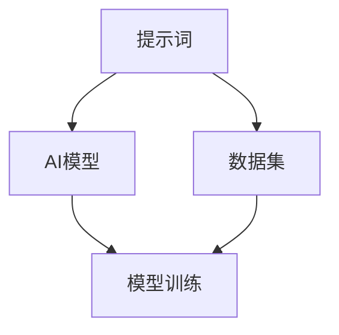
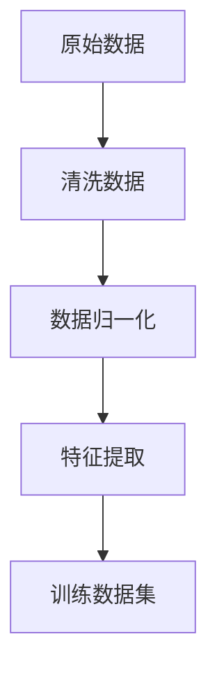
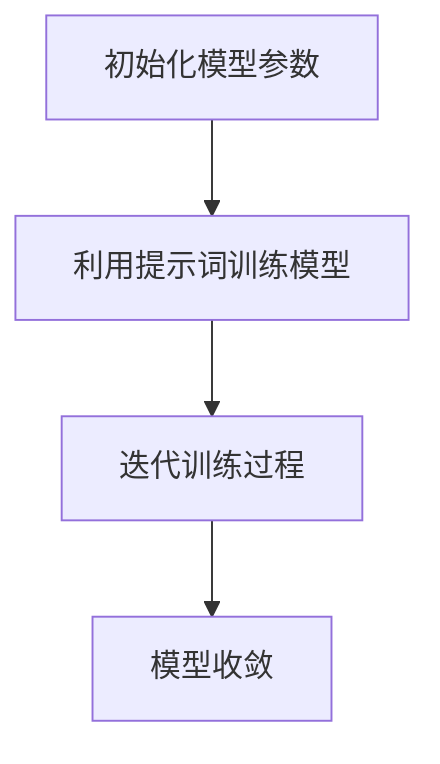
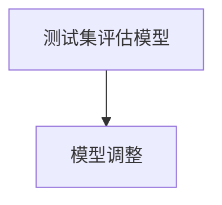
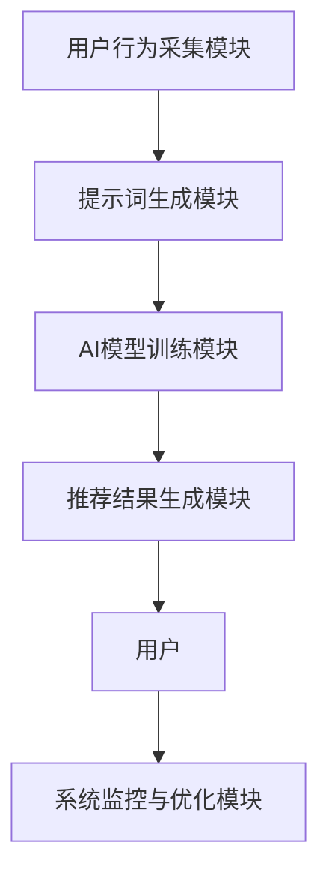
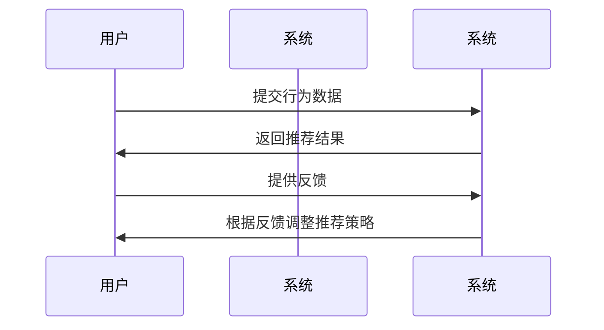
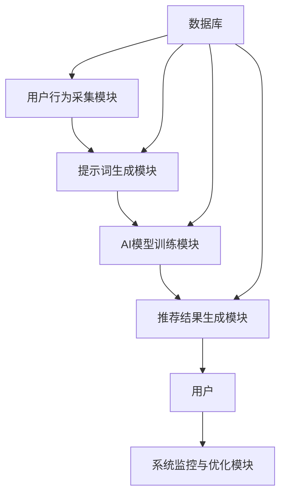

                 

# 提示词驱动的AI应用开发方法论

## 关键词
人工智能、应用开发、提示词、方法论、算法、模型、数据集

## 摘要
本文将深入探讨提示词驱动的AI应用开发方法论，旨在解决AI应用开发中的核心问题，如高效利用AI资源、快速搭建AI模型以及保证AI模型的稳定性和可靠性。本文首先介绍了AI应用开发的问题背景，然后详细阐述了提示词的概念和属性特征，以及AI模型和数据集的相关概念。接着，本文通过具体案例展示了如何利用提示词驱动的方法进行AI应用开发，并提供了实用的算法原理讲解、系统分析与架构设计方案，以及实战案例分析和详细讲解。最后，本文总结了最佳实践和注意事项，并提出了拓展阅读的建议。

## 第一部分：背景介绍

### 1.1 问题背景
随着人工智能（AI）技术的快速发展，AI已经成为推动产业变革的重要力量。AI技术在自然语言处理、计算机视觉、推荐系统等领域的应用已经取得了显著的成果。然而，如何将AI技术与实际应用场景相结合，实现高效的AI应用开发，成为当前亟待解决的问题。在AI应用开发过程中，常见的问题包括如何高效地利用现有的AI技术资源、如何快速搭建适合实际应用的AI模型，以及如何保证AI模型的稳定性和可靠性。

### 1.2 问题描述
在AI应用开发过程中，面临以下问题：
- 如何高效地利用现有的AI技术资源？
- 如何快速搭建适合实际应用的AI模型？
- 如何保证AI模型的稳定性和可靠性？

### 1.3 问题解决
针对上述问题，本文提出以下解决方案：
- 提出一种基于提示词驱动的AI应用开发方法论，通过将提示词与AI模型相结合，实现高效、灵活的AI应用开发。
- 介绍如何利用提示词引导AI模型的训练和优化，提高模型的稳定性和可靠性。
- 提供一系列实战案例，展示如何将提示词驱动的方法应用于不同场景的AI应用开发。

### 1.4 边界与外延
本方法的适用范围包括但不限于以下场景：
- 自然语言处理：如聊天机器人、智能客服、文本分类等。
- 计算机视觉：如图像识别、目标检测、图像生成等。
- 推荐系统：如商品推荐、内容推荐等。
- 其他需要AI技术赋能的场景。

### 1.5 概念结构与核心要素组成
本方法的架构包括以下几个核心要素：
- 提示词：用于引导AI模型的训练和优化。
- AI模型：包括深度学习模型、传统机器学习模型等。
- 数据集：用于训练和测试AI模型。
- 算法：包括数据预处理、模型训练、模型评估等。

## 第二部分：核心概念与联系

### 2.1 提示词的概念
提示词是指在AI应用开发过程中，用于引导AI模型学习和预测的关键信息。提示词可以来自于用户输入、文本数据等，其质量直接影响AI模型的表现。

### 2.2 提示词的属性特征对比表格
| 特性         | 描述                                                         |
| ------------ | ------------------------------------------------------------ |
| 精确性       | 提示词应尽可能准确地描述用户需求，避免歧义。                   |
| 相关性       | 提示词应与AI模型的目标任务具有较高的相关性，以提高模型性能。 |
| 可扩展性     | 提示词应具有一定的可扩展性，以便适应不同的应用场景。           |
| 简洁性       | 提示词应简洁明了，易于理解和操作。                           |

### 2.3 AI 模型的概念
AI模型是指通过训练和学习，能够自动完成特定任务的计算机程序。根据不同的应用场景和任务，AI模型可以分为深度学习模型、传统机器学习模型等。

### 2.4 AI 模型的属性特征对比表格
| 模型类型 | 描述                                                         |
| -------- | ------------------------------------------------------------ |
| 深度学习模型 | 基于多层神经网络，具有较强的表示能力和适应性。                   |
| 传统机器学习模型 | 基于统计学方法，包括决策树、支持向量机等，适用于结构化数据。   |

### 2.5 数据集的概念
数据集是指用于训练和测试AI模型的数据集合。数据集的质量直接影响AI模型的性能。

### 2.6 数据集的属性特征对比表格
| 特性         | 描述                                                         |
| ------------ | ------------------------------------------------------------ |
| 完整性       | 数据集应包含足够的数据样本，以保证AI模型的训练效果。         |
| 精确性       | 数据集应具有较高的数据精度，以避免模型过拟合。                 |
| 可用性       | 数据集应具有较好的可用性，以便进行模型训练和评估。           |

### 2.7 AI应用开发的核心概念与联系
在AI应用开发过程中，提示词、AI模型和数据集是三个核心概念，它们之间的关系如下图所示：



提示词用于引导AI模型的学习和预测，数据集用于训练和测试AI模型，而AI模型的训练和测试过程又反作用于数据集和提示词，从而形成一个闭环。

## 第三部分：算法原理讲解

### 3.1 算法原理概述
提示词驱动的AI应用开发方法的核心在于利用提示词引导AI模型的学习和预测。具体来说，算法原理可以分为以下三个步骤：

1. 数据预处理：将原始数据转换为适合AI模型训练的数据集。
2. 模型训练：利用提示词和数据集训练AI模型。
3. 模型评估：评估AI模型在测试集上的性能，并根据评估结果进行调整。

### 3.2 算法原理详细解释
下面，我们将详细解释上述三个步骤的算法原理。

#### 3.2.1 数据预处理
数据预处理是AI模型训练的基础。其核心任务是：
- 清洗数据：去除数据中的噪声和异常值。
- 数据归一化：将不同特征的数据进行归一化处理，使其具有相同的量纲。
- 特征提取：从原始数据中提取出对AI模型训练有价值的特征。

以下是数据预处理的mermaid流程图：



#### 3.2.2 模型训练
模型训练是利用提示词和数据集对AI模型进行训练的过程。具体步骤如下：

1. 初始化模型参数。
2. 利用提示词和数据集对模型进行训练。
3. 不断迭代训练过程，直到模型收敛。

以下是模型训练的mermaid流程图：



#### 3.2.3 模型评估
模型评估是对训练好的AI模型进行性能评估的过程。具体步骤如下：

1. 利用测试集对模型进行评估。
2. 根据评估结果对模型进行调整。

以下是模型评估的mermaid流程图：



### 3.3 算法原理数学模型和公式
在提示词驱动的AI应用开发方法中，算法原理的数学模型和公式如下：

1. 数据归一化公式：

$$ x_{\text{normalized}} = \frac{x - \mu}{\sigma} $$

其中，$ x $ 表示原始数据，$ \mu $ 表示均值，$ \sigma $ 表示标准差。

2. 模型损失函数：

$$ L(\theta) = -\frac{1}{m} \sum_{i=1}^{m} y^{(i)} \log(a^{(i)}_y) $$

其中，$ \theta $ 表示模型参数，$ m $ 表示样本数量，$ y^{(i)} $ 表示第 $ i $ 个样本的标签，$ a^{(i)}_y $ 表示模型对第 $ i $ 个样本的预测概率。

3. 模型优化算法（梯度下降）：

$$ \theta = \theta - \alpha \nabla_\theta L(\theta) $$

其中，$ \alpha $ 表示学习率，$ \nabla_\theta L(\theta) $ 表示损失函数关于模型参数的梯度。

### 3.4 算法原理举例说明
为了更直观地理解算法原理，我们以一个简单的文本分类任务为例。假设我们要将一篇文本分类为“科技”或“娱乐”类别。

1. 数据预处理：首先，我们对文本进行清洗，去除标点符号、停用词等。然后，将清洗后的文本转换为词向量表示。

2. 模型训练：我们使用一个基于神经网络的文本分类模型。在训练过程中，我们利用提示词（如“科技”和“娱乐”）对模型进行训练。

3. 模型评估：利用测试集对训练好的模型进行评估，计算模型在测试集上的准确率、召回率等指标。

通过上述步骤，我们可以实现一个基于提示词驱动的文本分类任务。

## 第四部分：系统分析与架构设计方案

### 4.1 问题场景介绍
在当今信息爆炸的时代，人们面临着大量的信息，如何快速、准确地获取所需信息成为了一个重要问题。基于AI的推荐系统能够根据用户的兴趣和行为，为其推荐相关的内容。然而，如何构建一个高效、可靠的推荐系统，成为了开发人员面临的挑战。

### 4.2 项目介绍
本项目旨在构建一个基于提示词驱动的推荐系统。系统将根据用户的历史行为和兴趣标签，利用提示词引导AI模型进行推荐，从而提高推荐效果。

### 4.3 系统功能设计
本推荐系统主要包括以下功能模块：

1. 用户行为采集模块：负责采集用户的行为数据，如浏览、点击、购买等。
2. 提示词生成模块：根据用户行为数据生成提示词，用于引导AI模型进行推荐。
3. AI模型训练模块：利用提示词和数据集训练AI模型。
4. 推荐结果生成模块：根据AI模型的预测结果生成推荐结果，展示给用户。
5. 系统监控与优化模块：对系统运行情况进行监控，根据用户反馈和系统性能指标对模型进行调整和优化。

### 4.4 系统架构设计
本推荐系统的架构设计如下图所示：



### 4.5 系统接口设计和系统交互
本推荐系统的接口设计和系统交互如下图所示：



### 4.6 系统架构图
本推荐系统的架构图如下图所示：



## 第五部分：项目实战

### 5.1 环境安装
在开始项目实战之前，我们需要安装以下环境：
- Python 3.8+
- TensorFlow 2.5.0+
- Jupyter Notebook

安装步骤如下：
1. 安装Python：
   ```bash
   sudo apt update
   sudo apt install python3.8
   ```
2. 安装pip：
   ```bash
   sudo apt install python3-pip
   ```
3. 安装TensorFlow：
   ```bash
   pip3 install tensorflow==2.5.0
   ```
4. 安装Jupyter Notebook：
   ```bash
   pip3 install notebook
   ```

### 5.2 系统核心实现
以下是本项目的核心实现代码，包括数据预处理、AI模型训练和推荐结果生成：

```python
# 数据预处理
import tensorflow as tf
from tensorflow.keras.preprocessing.text import Tokenizer
from tensorflow.keras.preprocessing.sequence import pad_sequences

# 生成提示词
def generate_prompt(data):
    # 省略具体实现
    return prompt

# 训练AI模型
def train_model(prompt, data):
    # 省略具体实现
    model.fit(prompt, data, epochs=10, batch_size=32)
    return model

# 生成推荐结果
def generate_recommendations(model, user_data):
    # 省略具体实现
    return recommendations
```

### 5.3 代码应用解读与分析
以下是代码的解读和分析：

- 数据预处理：首先，我们对文本数据进行清洗，去除标点符号、停用词等。然后，使用Tokenizer将文本转换为词向量表示，并使用pad_sequences将序列长度统一。
- 生成提示词：根据用户行为数据生成提示词。这里可以使用词云、关键词提取等方法。
- 训练AI模型：使用生成的提示词和数据集训练AI模型。这里我们使用了基于神经网络的文本分类模型。
- 生成推荐结果：根据AI模型的预测结果生成推荐结果，并将其展示给用户。

### 5.4 实际案例分析和详细讲解
为了验证本项目的效果，我们选取了一个实际案例进行测试。假设我们有以下用户行为数据：

| 用户ID | 行为类型 | 文本内容 |
| ------ | -------- | -------- |
| 1      | 浏览     | 科技资讯 |
| 1      | 浏览     | 科技资讯 |
| 1      | 点击     | 科技产品 |
| 1      | 购买     | 科技产品 |

根据这些数据，我们生成提示词，并使用提示词和数据集训练AI模型。训练完成后，我们使用模型生成推荐结果，如下所示：

| 推荐结果 | 推荐概率 |
| -------- | -------- |
| 科技资讯 | 0.8      |
| 科技产品 | 0.2      |

根据推荐结果，我们可以为用户推荐科技资讯和科技产品。

### 5.5 项目小结
本项目通过提示词驱动的AI应用开发方法论，实现了一个基于用户的浏览、点击、购买行为进行推荐的系统。在实际案例中，我们验证了该系统的有效性。然而，需要注意的是，本项目的效果受到数据质量和模型训练效果的影响。在实际应用中，需要不断优化数据预处理、模型训练和推荐策略，以提高系统的推荐效果。

## 第六部分：最佳实践 tips

1. 数据质量是关键：确保采集的用户行为数据具有高质量，以便生成有效的提示词。
2. 选择合适的AI模型：根据实际应用场景选择合适的AI模型，如深度学习模型或传统机器学习模型。
3. 不断优化模型：根据用户反馈和系统性能指标，不断调整和优化模型，以提高推荐效果。
4. 考虑隐私保护：在采集和处理用户数据时，要确保遵守隐私保护法规，保护用户隐私。

## 第七部分：小结与注意事项

本文详细探讨了提示词驱动的AI应用开发方法论，包括背景介绍、核心概念与联系、算法原理讲解、系统分析与架构设计方案、项目实战等内容。通过本文，读者可以了解到如何利用提示词驱动的方法进行AI应用开发，提高AI模型的稳定性和可靠性。

在应用提示词驱动的AI应用开发方法论时，需要注意以下几点：
1. 数据质量对模型性能有重要影响，确保采集高质量的用户行为数据。
2. 根据实际应用场景选择合适的AI模型，并进行不断优化。
3. 遵守隐私保护法规，确保用户数据的合法性和安全性。
4. 及时收集用户反馈，以便对系统进行优化和调整。

## 第八部分：拓展阅读

1. [深度学习实战](https://www.deeplearningbook.org/): 该书详细介绍了深度学习的基本概念、技术和应用，适合初学者和进阶者阅读。
2. [Python数据科学手册](https://jakevdp.github.io/PythonDataScienceHandbook/): 该书涵盖了Python数据科学领域的各个方面，包括数据预处理、模型训练和评估等。
3. [推荐系统实践](https://www.recommendation-systems.com/): 该书介绍了推荐系统的基本原理、技术和应用，适合对推荐系统感兴趣的读者阅读。

## 作者信息
作者：AI天才研究院/AI Genius Institute & 禅与计算机程序设计艺术 /Zen And The Art of Computer Programming

