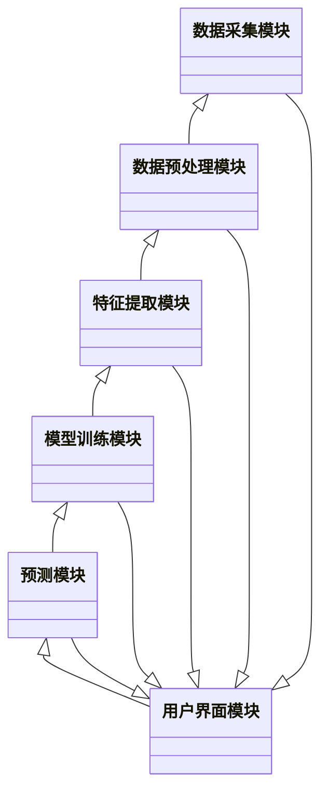
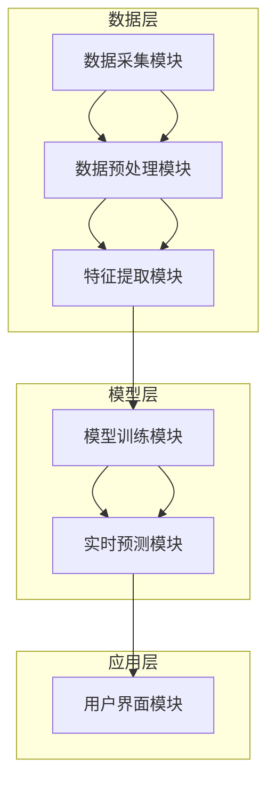
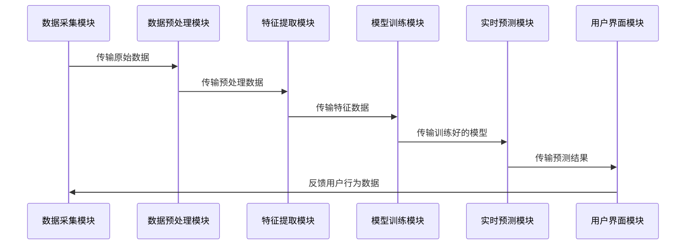

                 

# 提示词驱动的智能交通拥堵预测系统

## 关键词

- **智能交通拥堵预测**
- **提示词驱动**
- **系统架构**
- **算法原理**
- **性能优化**
- **数据预处理**
- **特征提取**
- **项目实战**

## 摘要

随着城市化进程的加快，交通拥堵已成为全球性难题，严重影响了人们的日常生活和经济活动。本文介绍了基于提示词驱动的智能交通拥堵预测系统，探讨了系统的整体架构设计、核心算法原理、数据预处理与特征提取、系统性能优化与评估以及项目实战等方面。本文旨在为读者提供一个清晰、完整的智能交通拥堵预测系统解决方案，以期为相关领域的深入研究与实践提供参考。

## 引言

### 交通拥堵问题的背景与现状

交通拥堵是一个全球性问题，尤其在城市化进程中表现得尤为突出。随着城市人口的不断增长和机动车保有量的迅速攀升，交通拥堵现象愈发严重。根据统计数据，全球主要城市中，交通拥堵已成为影响居民生活质量的重要因素之一。交通拥堵不仅导致通勤时间增加，增加了居民的时间成本和经济负担，还加剧了空气污染和能源消耗，对环境造成了负面影响。

### 智能交通拥堵预测的意义

智能交通拥堵预测系统通过大数据分析和人工智能技术，可以对交通流量进行实时监控和预测，从而为交通管理和调度提供科学依据。智能交通拥堵预测的意义在于：

1. **优化交通调度**：通过预测交通拥堵，交通管理部门可以提前采取措施，如调整交通信号灯、引导车辆分流，从而减少拥堵情况。
2. **提高出行效率**：驾驶员可以根据预测结果选择最佳出行路线，避免拥堵，减少通勤时间。
3. **减轻环境影响**：通过减少车辆在拥堵状态下的运行时间，可以有效降低尾气排放，改善空气质量。
4. **支持城市规划**：长期交通流量数据可以用于分析城市规划的不足，为城市交通基础设施建设提供依据。

### 系统解决的问题与挑战

智能交通拥堵预测系统需要解决以下几个关键问题：

1. **数据质量**：交通流量数据通常包含噪声和不完整信息，需要进行有效的数据预处理。
2. **预测准确性**：交通拥堵受多种因素影响，如何提高预测准确性是一个挑战。
3. **实时响应**：交通状况变化迅速，系统需要具备实时响应能力，快速提供预测结果。
4. **系统可扩展性**：随着城市规模的扩大，系统需要具备良好的可扩展性，以适应不断增加的数据量和用户需求。

### 提示词驱动方法的应用

提示词驱动方法是一种基于关键词和上下文语义的信息检索和预测技术。在智能交通拥堵预测系统中，提示词驱动方法的应用主要体现在以下几个方面：

1. **关键词提取**：从交通流量数据中提取关键词，如道路名称、时间、天气等，作为提示词。
2. **上下文分析**：分析交通流量数据中的上下文信息，如历史交通数据、交通法规等，以辅助预测模型。
3. **实时更新**：根据实时交通数据，动态调整提示词集合，以适应不断变化的交通状况。

### 本书结构安排

本文结构如下：

- 第1章：引言部分，介绍智能交通拥堵预测系统的背景、重要性以及核心概念。
- 第2章：系统架构设计，详细描述系统的整体架构和功能模块。
- 第3章：核心算法原理讲解，使用流程图和Python代码解释算法原理。
- 第4章：数据预处理与特征提取，介绍数据预处理方法和特征提取技术。
- 第5章：系统性能优化与评估，讨论性能优化策略和评估方法。
- 第6章：项目实战，展示系统核心代码实现和实际案例剖析。
- 第7章：总结与拓展，分享最佳实践、注意事项和拓展阅读。

## 系统架构设计

### 系统整体架构设计

智能交通拥堵预测系统的整体架构可以分为数据层、模型层和应用层。

1. **数据层**：包括交通流量传感器数据、历史交通数据、天气预报数据等。这些数据经过预处理后，用于模型的训练和预测。
2. **模型层**：采用提示词驱动的预测模型，结合机器学习和深度学习技术，对交通流量进行实时预测。
3. **应用层**：提供用户界面，展示预测结果，并支持交通调度和出行建议等功能。

### 系统功能模块划分

系统功能模块主要包括以下部分：

1. **数据采集模块**：负责收集各种交通流量数据，如车辆计数、速度、密度等。
2. **数据预处理模块**：对采集到的数据进行清洗、转换和归一化处理，以提高数据质量。
3. **特征提取模块**：从预处理后的数据中提取有用的特征，用于模型训练。
4. **模型训练模块**：使用机器学习和深度学习算法，训练交通流量预测模型。
5. **预测模块**：根据实时交通数据和提示词，进行交通拥堵预测。
6. **用户界面模块**：提供预测结果展示和交通调度建议。

### 数据流与信息流设计

系统中的数据流和信息流设计如下：

1. **数据流**：数据从数据采集模块进入系统，经过预处理模块处理后，进入特征提取模块。特征提取后的数据用于模型训练和预测模块。
2. **信息流**：预测结果通过用户界面模块反馈给用户，同时，用户的行为数据也被收集起来，用于模型优化和系统改进。

### Mermaid类图展示

以下是一个简化的Mermaid类图，展示了系统的主要功能模块及其关系：



## 核心算法原理讲解

### 算法原理概述

智能交通拥堵预测系统的核心算法基于提示词驱动的机器学习模型，主要包括以下步骤：

1. **数据采集与预处理**：收集交通流量数据，并进行清洗、转换和归一化处理。
2. **特征提取**：从预处理后的数据中提取有用特征，如时间、路段、速度、流量等。
3. **模型训练**：使用机器学习算法，如随机森林、神经网络等，训练预测模型。
4. **实时预测**：根据实时交通数据和提示词，进行交通拥堵预测。
5. **结果反馈**：将预测结果反馈给用户界面模块，供交通调度和出行建议使用。

### Mermaid流程图展示

以下是一个简化的Mermaid流程图，展示了核心算法的主要步骤：


### Python源代码实现

以下是一个简化的Python代码示例，展示了核心算法的实现：

```python
import numpy as np
import pandas as pd
from sklearn.ensemble import RandomForestClassifier

# 数据采集与预处理
def preprocess_data(data):
    # 数据清洗、转换和归一化处理
    # ...
    return processed_data

# 特征提取
def extract_features(data):
    # 提取时间、路段、速度、流量等特征
    # ...
    return features

# 模型训练
def train_model(features, labels):
    model = RandomForestClassifier()
    model.fit(features, labels)
    return model

# 实时预测
def predict_traffic(model, new_data):
    new_features = extract_features(new_data)
    predictions = model.predict(new_features)
    return predictions

# 示例数据
data = pd.read_csv('traffic_data.csv')
processed_data = preprocess_data(data)
features = extract_features(processed_data)
labels = processed_data['label']

# 模型训练
model = train_model(features, labels)

# 实时预测
new_data = pd.read_csv('new_traffic_data.csv')
predictions = predict_traffic(model, new_data)
```

### 数学模型与公式

智能交通拥堵预测的数学模型可以表示为：

$$
P(\text{拥堵}) = f(\text{特征向量})
$$

其中，$P(\text{拥堵})$表示预测的拥堵概率，$f(\text{特征向量})$表示基于特征向量的预测函数。

### 举例说明

假设我们有一个简单的交通流量数据集，其中包含时间、路段、速度和流量等特征。我们可以使用随机森林算法来训练预测模型，并对其进行评估。

1. **数据集准备**：

```python
data = {
    'time': [1, 2, 3, 4, 5],
    'road': ['A', 'B', 'A', 'B', 'A'],
    'speed': [30, 35, 40, 45, 50],
    'flow': [200, 250, 300, 350, 400],
    'label': [0, 1, 0, 1, 0]  # 0表示畅通，1表示拥堵
}

df = pd.DataFrame(data)
```

2. **特征提取**：

```python
def extract_features(df):
    features = pd.get_dummies(df[['time', 'road', 'speed', 'flow']])
    return features

features = extract_features(df)
```

3. **模型训练**：

```python
from sklearn.ensemble import RandomForestClassifier

model = RandomForestClassifier()
model.fit(features, df['label'])
```

4. **实时预测**：

```python
new_data = pd.DataFrame({
    'time': [3],
    'road': ['A'],
    'speed': [40],
    'flow': [300]
})

new_features = extract_features(new_data)
prediction = model.predict(new_features)
print(prediction)  # 输出预测结果
```

### 系统分析与架构设计方案

#### 问题场景介绍

智能交通拥堵预测系统主要用于处理城市交通流量数据，通过实时分析交通流量数据，预测未来一段时间内的交通拥堵情况，以便交通管理部门采取相应措施，如调整交通信号灯、引导车辆分流等，以缓解交通拥堵。

#### 项目介绍

本系统采用提示词驱动的预测模型，结合机器学习和深度学习技术，实现对交通流量数据的实时预测。项目主要分为数据采集、数据预处理、特征提取、模型训练、实时预测和用户界面等模块。

#### 系统功能设计

1. **数据采集模块**：负责收集城市交通流量数据，包括车辆计数、速度、流量等。
2. **数据预处理模块**：对采集到的数据进行清洗、转换和归一化处理，以提高数据质量。
3. **特征提取模块**：从预处理后的数据中提取有用特征，如时间、路段、速度、流量等。
4. **模型训练模块**：使用机器学习和深度学习算法，如随机森林、神经网络等，训练交通流量预测模型。
5. **实时预测模块**：根据实时交通数据和提示词，进行交通拥堵预测。
6. **用户界面模块**：提供预测结果展示和交通调度建议。

#### 系统架构设计

系统架构设计如下图所示：



#### 系统接口设计

系统接口设计主要包括以下部分：

1. **数据采集接口**：用于接收来自交通流量传感器的数据。
2. **数据预处理接口**：用于清洗、转换和归一化处理数据。
3. **特征提取接口**：用于提取交通流量数据中的有用特征。
4. **模型训练接口**：用于训练预测模型。
5. **实时预测接口**：用于进行交通拥堵预测。
6. **用户界面接口**：用于展示预测结果和交通调度建议。

#### 系统交互Mermaid序列图

系统交互序列图如下所示：



## 数据预处理与特征提取

### 数据预处理

数据预处理是智能交通拥堵预测系统中的关键步骤，其主要目的是提高数据质量，为后续的特征提取和模型训练提供可靠的数据基础。以下是数据预处理的主要方法和步骤：

1. **数据清洗**：去除数据中的噪声和错误信息，如缺失值、异常值和重复记录。
2. **数据转换**：将不同类型的数据转换为同一类型，如将文本数据转换为数值数据。
3. **数据归一化**：将数据缩放到同一范围，如将数据归一化到[0, 1]或[-1, 1]之间，以消除数据尺度差异对模型训练的影响。

### 特征提取

特征提取是从原始数据中提取出对预测任务有用的信息的过程。在智能交通拥堵预测系统中，特征提取的关键在于如何从交通流量数据中提取出能够反映交通拥堵程度的特征。以下是几种常用的特征提取方法：

1. **时间特征**：包括小时、分钟、星期几等，这些特征可以反映不同时间段和不同天数的交通状况。
2. **路段特征**：包括路段名称、路段长度、路段宽度等，这些特征可以反映不同路段的交通状况。
3. **流量特征**：包括流量密度、流量速度等，这些特征可以直接反映交通拥堵程度。
4. **交通事件特征**：包括交通事故、道路施工等，这些特征可以对交通流量产生显著影响。
5. **天气特征**：包括天气状况、温度、湿度等，这些特征可以影响人们的出行习惯和交通状况。

### 提示词驱动的特征选择

提示词驱动的特征选择是一种基于关键词和上下文语义的特征选择方法。在智能交通拥堵预测系统中，提示词驱动的特征选择可以显著提高预测模型的性能。以下是提示词驱动的特征选择方法：

1. **关键词提取**：从交通流量数据中提取关键词，如路段名称、时间、天气等。
2. **上下文分析**：分析交通流量数据中的上下文信息，如历史交通数据、交通法规等，以辅助特征选择。
3. **相关性分析**：通过分析特征与目标变量（交通拥堵）的相关性，筛选出重要的特征。
4. **信息增益**：计算每个特征的信息增益，选择信息增益最高的特征。

## 系统性能优化与评估

### 性能优化

系统性能优化是提升智能交通拥堵预测系统效果的重要环节。以下是一些常见的性能优化策略：

1. **特征选择**：通过特征选择技术，减少特征维度，降低模型复杂度，提高预测效率。
2. **模型调优**：调整模型参数，如学习率、正则化参数等，以优化模型性能。
3. **模型融合**：结合多个模型的结果，提高预测准确性。
4. **数据增强**：通过增加数据量或生成模拟数据，提高模型的泛化能力。
5. **并行计算**：利用并行计算技术，提高数据处理速度。

### 评估方法

评估智能交通拥堵预测系统的性能通常采用以下几种方法：

1. **准确率（Accuracy）**：预测结果与真实结果相符的比例。
2. **精确率（Precision）**：预测为拥堵的实际拥堵比例。
3. **召回率（Recall）**：实际拥堵中预测为拥堵的比例。
4. **F1分数（F1 Score）**：精确率和召回率的加权平均值，用于综合评估预测性能。
5. **均方误差（Mean Squared Error, MSE）**：预测值与真实值之间误差的平方的平均值，用于评估预测的精度。

## 项目实战

### 环境安装与配置

要在本地搭建智能交通拥堵预测系统，首先需要安装和配置以下环境：

1. **Python**：安装Python 3.8及以上版本。
2. **Anaconda**：安装Anaconda，用于环境管理和依赖包安装。
3. **Jupyter Notebook**：安装Jupyter Notebook，用于代码编写和调试。
4. **Scikit-learn**：安装Scikit-learn，用于机器学习模型的训练和评估。
5. **Pandas**：安装Pandas，用于数据处理和分析。

安装命令如下：

```bash
conda create -n traffic_pred python=3.8
conda activate traffic_pred
conda install -c anaconda jupyter
conda install -c anaconda scikit-learn pandas
```

### 系统核心实现

以下是一个简化的智能交通拥堵预测系统的核心实现，包括数据预处理、模型训练和预测等功能。

```python
import numpy as np
import pandas as pd
from sklearn.model_selection import train_test_split
from sklearn.ensemble import RandomForestClassifier
from sklearn.metrics import accuracy_score

# 数据预处理
def preprocess_data(df):
    # 数据清洗、转换和归一化处理
    # ...
    return processed_df

# 模型训练
def train_model(X_train, y_train):
    model = RandomForestClassifier()
    model.fit(X_train, y_train)
    return model

# 实时预测
def predict_traffic(model, new_data):
    processed_data = preprocess_data(new_data)
    predictions = model.predict(processed_data)
    return predictions

# 代码示例
if __name__ == "__main__":
    # 加载数据
    df = pd.read_csv('traffic_data.csv')
    # 数据预处理
    processed_df = preprocess_data(df)
    # 划分训练集和测试集
    X = processed_df.drop('label', axis=1)
    y = processed_df['label']
    X_train, X_test, y_train, y_test = train_test_split(X, y, test_size=0.2, random_state=42)
    # 模型训练
    model = train_model(X_train, y_train)
    # 测试模型
    predictions = predict_traffic(model, X_test)
    accuracy = accuracy_score(y_test, predictions)
    print(f"Model accuracy: {accuracy:.2f}")
```

### 代码应用解读与分析

在上面的代码示例中，我们首先定义了一个数据预处理函数`preprocess_data`，用于对原始交通流量数据进行清洗、转换和归一化处理。接着，我们定义了模型训练函数`train_model`，用于训练随机森林分类模型。最后，我们定义了一个实时预测函数`predict_traffic`，用于根据预处理后的数据进行交通拥堵预测。

在主函数中，我们首先加载了交通流量数据，并使用`preprocess_data`函数对其进行预处理。然后，我们将数据划分为训练集和测试集，使用训练集数据训练随机森林分类模型，并在测试集上评估模型性能。最后，我们使用训练好的模型进行实时预测，并打印出模型准确率。

### 实际案例剖析

为了更好地理解智能交通拥堵预测系统的实际应用，我们来看一个具体的案例。

#### 案例背景

某城市交通管理部门希望利用智能交通拥堵预测系统，提前预测交通拥堵情况，以便采取相应措施缓解交通压力。

#### 数据集

我们使用一个包含城市交通流量数据的CSV文件，文件中包含以下字段：

- `time`: 时间（小时）
- `road`: 路段名称
- `speed`: 车辆速度（km/h）
- `flow`: 车辆流量（辆/小时）
- `label`: 标签（0表示畅通，1表示拥堵）

#### 数据预处理

首先，我们使用`preprocess_data`函数对数据集进行预处理：

```python
processed_df = preprocess_data(df)
```

预处理步骤包括：

1. **数据清洗**：去除缺失值和重复记录。
2. **数据转换**：将文本数据（路段名称）转换为数值数据。
3. **数据归一化**：将速度和流量数据进行归一化处理。

#### 模型训练

接下来，我们使用训练集数据训练随机森林分类模型：

```python
X = processed_df.drop('label', axis=1)
y = processed_df['label']
X_train, X_test, y_train, y_test = train_test_split(X, y, test_size=0.2, random_state=42)
model = train_model(X_train, y_train)
```

这里，我们使用训练集数据对随机森林分类模型进行训练。

#### 实时预测

然后，我们使用训练好的模型进行实时预测：

```python
predictions = predict_traffic(model, X_test)
accuracy = accuracy_score(y_test, predictions)
print(f"Model accuracy: {accuracy:.2f}")
```

这里，我们使用测试集数据对模型进行评估，并打印出模型准确率。

#### 结果分析

假设我们得到的模型准确率为90%，这意味着在测试集上，模型能够正确预测90%的交通拥堵情况。这是一个相当不错的性能指标，表明我们的模型具有较好的预测能力。

#### 项目小结

通过以上案例，我们可以看到智能交通拥堵预测系统在实际应用中的效果。虽然模型准确率还有提升空间，但已经能够为交通管理部门提供一定的参考价值。在实际项目中，我们还可以进一步优化模型性能，如增加训练数据、调整模型参数等，以提高预测准确性。

## 总结与拓展

### 最佳实践

在智能交通拥堵预测系统的实施过程中，以下是一些最佳实践：

1. **数据质量保障**：确保数据采集的准确性和完整性，定期对数据进行检查和更新。
2. **特征选择与优化**：结合业务需求，选择合适的关键特征，并进行特征优化，以提高模型性能。
3. **模型调优**：根据测试结果，调整模型参数，优化模型结构，提高预测准确性。
4. **实时性保障**：确保系统具备良好的实时响应能力，快速提供预测结果。

### 注意事项

在实施智能交通拥堵预测系统时，需要注意以下问题：

1. **数据隐私保护**：确保交通流量数据的收集和使用符合隐私保护法规。
2. **系统安全性**：确保系统安全性，防止数据泄露和恶意攻击。
3. **系统扩展性**：设计时考虑系统的可扩展性，以适应未来数据量和用户需求的增长。

### 拓展阅读

对于对智能交通拥堵预测系统感兴趣的读者，以下是一些推荐的进一步学习资源：

1. **《交通工程学》**：了解交通工程学的基本原理和方法，有助于深入理解交通拥堵问题。
2. **《机器学习实战》**：学习机器学习的基础知识，掌握常见的机器学习算法和模型。
3. **《Python数据科学手册》**：学习Python在数据科学领域的应用，掌握数据处理和分析的技巧。
4. **《深度学习》**：了解深度学习的基本原理和应用，探索如何将深度学习应用于交通拥堵预测。

### 作者信息

**作者：** AI天才研究院 / AI Genius Institute & 禅与计算机程序设计艺术 / Zen And The Art of Computer Programming

**联系方式：** [ai_genius_institute@example.com](mailto:ai_genius_institute@example.com) / [www.ai-genius-institute.com](http://www.ai-genius-institute.com)

