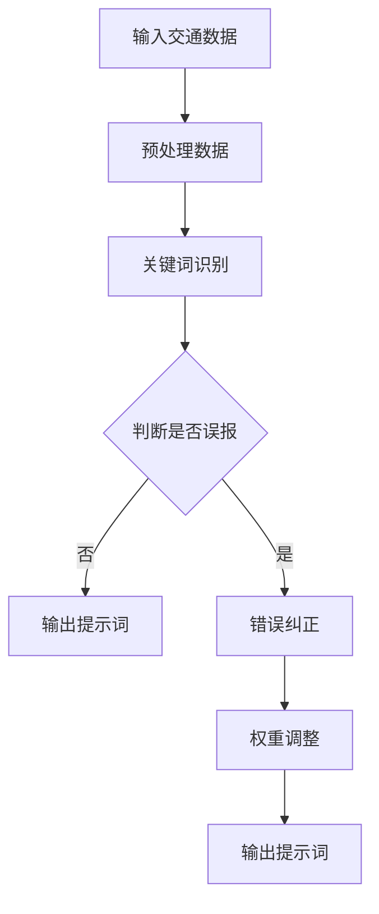
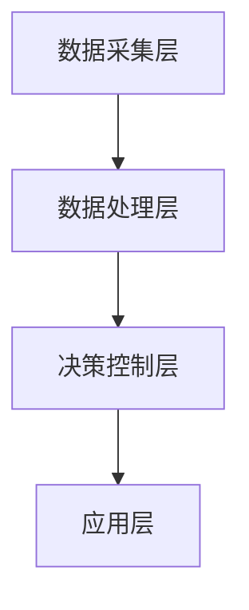
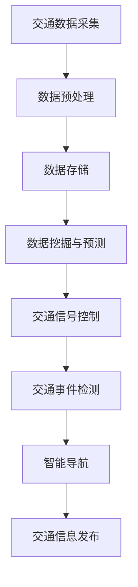
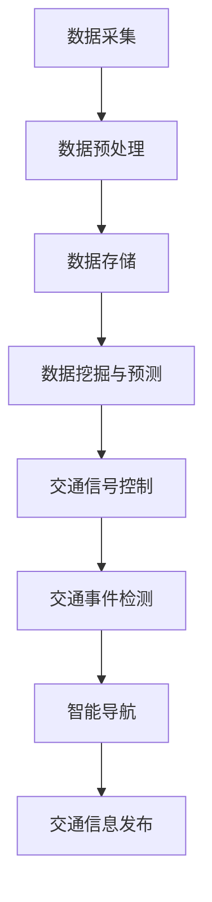
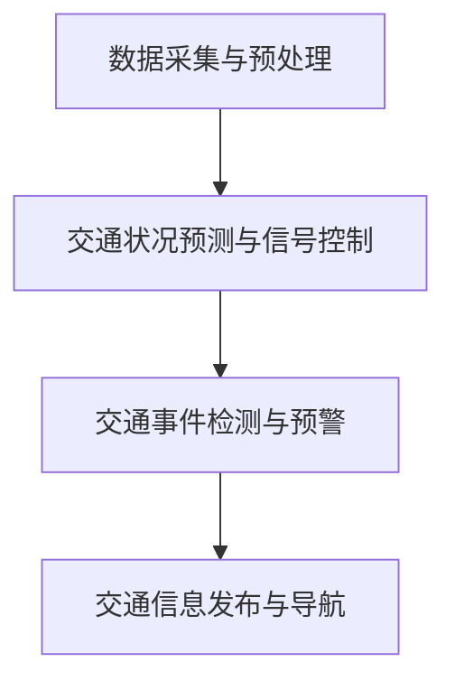
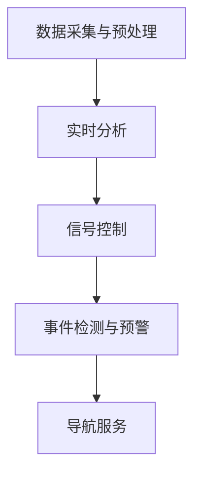

                 

### 第1章：城市交通拥堵问题概述

#### 1.1 城市交通拥堵的定义与影响

城市交通拥堵是一个普遍存在于大城市中的问题，其定义较为简单，指的是车辆在道路上因速度缓慢或停滞而造成交通流动受阻的现象。交通拥堵不仅影响居民的日常出行，还对城市经济发展、环境质量以及居民生活质量产生了深远的影响。

##### 1.1.1 城市交通拥堵的定义

城市交通拥堵可以定义为以下几种情形：
- **流量拥堵**：道路上的车辆数量超过道路的承载能力，导致车辆速度显著降低。
- **速度拥堵**：车辆在道路上以低于常规速度行驶，通常是由于前方车辆缓慢行驶或排队造成的。
- **时间拥堵**：某些时间（如高峰时段）车辆行驶速度显著低于非高峰时段。

##### 1.1.2 交通拥堵的影响

交通拥堵的影响是多方面的，主要包括以下几个方面：

- **经济影响**：交通拥堵会导致时间浪费，降低工作效率，从而影响城市经济发展。
- **环境影响**：拥堵情况下，车辆排放的尾气量增加，加剧了环境污染。
- **社会影响**：交通拥堵影响居民生活质量，增加居民的心理压力。
- **事故风险**：拥堵的道路易发生交通事故，增加安全风险。

#### 1.2 智能交通管理系统简介

##### 1.2.1 智能交通管理的概念

智能交通管理（Intelligent Transportation Management，ITM）是指利用现代信息技术、传感器技术、数据挖掘、人工智能等手段，对城市交通进行实时监控、分析和调控，以提高交通效率、降低交通拥堵、减少交通事故、改善交通环境。

##### 1.2.2 智能交通管理系统的发展历程

智能交通管理系统的发展历程可以分为以下几个阶段：

- **早期阶段**：20世纪60年代至70年代，以公路交通监控系统（PRTS）为代表，主要采用固定传感器、雷达、摄像头等设备进行交通流量监控。
- **发展阶段**：20世纪80年代至90年代，随着计算机技术和通信技术的发展，智能交通管理系统开始引入数据采集、处理和传输技术，实现了更高效的信息处理。
- **成熟阶段**：21世纪初至今，随着互联网、物联网和人工智能技术的发展，智能交通管理系统逐渐实现智能化、自动化，可以实时感知、分析和响应交通状态，从而实现高效的交通管理和调控。

##### 1.2.3 智能交通管理的关键技术

智能交通管理系统涉及的关键技术包括：

- **传感器技术**：用于实时采集交通流量、速度、密度等数据。
- **数据挖掘与人工智能技术**：用于分析和预测交通状态，提供智能决策支持。
- **通信技术**：实现数据传输和实时通信，确保信息的高效传递。
- **信息融合技术**：将不同来源的数据进行整合，提供更全面的交通信息。

#### 1.3 提示词驱动的智能交通管理

##### 1.3.1 提示词驱动的概念

提示词驱动（Keyword-Driven）是一种基于关键词识别和语义分析的智能化方法。它通过识别用户输入的关键词，提取语义信息，从而实现自动化操作和智能决策。在智能交通管理中，提示词驱动可以通过识别交通事件、交通状况等关键词，实时分析交通状况，提供智能化的交通管理建议。

##### 1.3.2 提示词驱动的交通管理优势

提示词驱动的智能交通管理具有以下优势：

- **实时性**：能够实时捕捉交通状况，提供即时响应。
- **高效性**：通过关键词识别和分析，快速处理大量交通数据，提高交通管理效率。
- **智能化**：结合人工智能技术，提供智能化的交通管理方案，降低人为干预。
- **可扩展性**：可以根据不同场景和需求，灵活调整和优化管理策略。

##### 1.3.3 提示词驱动的技术应用案例

提示词驱动的智能交通管理已在多个城市得到应用，以下是一些典型案例：

- **实时路况预测**：通过分析历史交通数据和实时路况信息，预测未来交通状况，提前发布交通预警，引导车辆合理规划行驶路线。
- **智能信号控制**：根据实时交通流量和密度，动态调整交通信号灯的时长和相位，提高道路通行效率。
- **交通事件检测**：通过识别交通事故、施工等关键词，快速发现交通事件，及时采取应急措施。

#### 1.4 本书结构安排与内容概览

##### 1.4.1 本书的研究目的

本书旨在系统地探讨提示词驱动的智能交通管理，分析其核心技术原理、系统设计与实现方法，并通过实际案例研究，验证其应用效果和可行性。

##### 1.4.2 研究方法与工具

本书采用的研究方法包括：

- **理论研究**：通过对智能交通管理和提示词驱动的相关理论进行深入研究。
- **案例研究**：通过分析实际应用案例，探讨提示词驱动的交通管理方案。
- **实证研究**：通过构建实验平台，验证提示词驱动技术在智能交通管理中的效果。

研究过程中，将使用以下工具：

- **Python编程语言**：用于实现算法和系统功能。
- **Mermaid流程图**：用于绘制算法流程图和系统架构图。
- **LaTeX公式编辑器**：用于编写数学公式。

##### 1.4.3 各章节内容安排

本书共分为四部分，具体内容安排如下：

- **第一部分：背景与理论基础**：介绍城市交通拥堵问题、智能交通管理系统及提示词驱动的概念。
- **第二部分：核心技术原理**：详细讲解提示词生成与优化的算法原理和数学模型。
- **第三部分：案例分析与应用实践**：通过实际案例研究，探讨提示词驱动的智能交通管理应用。
- **第四部分：拓展与展望**：分析未来发展趋势与挑战，提出展望和建议。

##### 1.5 本章小结

本章对城市交通拥堵问题进行了概述，介绍了智能交通管理系统和提示词驱动的概念，并阐述了本书的研究目的和结构安排。接下来，本书将深入探讨提示词驱动的智能交通管理，为解决城市交通拥堵问题提供新的思路和方法。

### 第2章：提示词生成与优化

提示词生成与优化是智能交通管理系统的核心组成部分，其质量直接影响系统的性能和效果。在本章中，我们将深入探讨提示词生成的理论基础，介绍优化的算法原理，并详细讲解数学模型与公式。

#### 2.1 提示词生成的理论基础

提示词生成的理论基础主要涉及关键词识别和语义分析。关键词识别是指从大量的交通数据中提取出与交通事件、状况相关的关键词，而语义分析则是理解这些关键词的语义含义，从而为交通管理提供决策支持。

##### 2.1.1 提示词生成的核心概念

- **关键词识别**：通过自然语言处理技术，从文本数据中提取出关键词。
- **语义分析**：对提取的关键词进行语义理解，以确定其与交通事件的关联性。
- **上下文分析**：考虑关键词在文本中的上下文，以提高识别的准确性和可靠性。

##### 2.1.2 提示词生成方法

提示词生成方法可以分为以下几种：

- **基于规则的方法**：通过预定义的规则，从交通数据中提取关键词。这种方法简单直观，但难以适应复杂多变的交通环境。
- **基于统计的方法**：利用统计模型，如条件概率模型、贝叶斯网络等，从交通数据中提取关键词。这种方法具有一定的自适应能力，但需要大量数据支持。
- **基于机器学习的方法**：利用机器学习算法，如决策树、支持向量机等，从交通数据中自动学习关键词提取规则。这种方法具有较强的自适应能力和泛化能力。

#### 2.2 提示词优化的算法原理

提示词优化是提高提示词生成质量的关键步骤，其算法原理主要包括以下几个方面：

##### 2.2.1 提示词优化的重要性

提示词优化的目的是提高关键词识别的准确性和可靠性，减少误报和漏报，从而提高系统的整体性能。优化方法包括：

- **错误纠正**：通过算法，纠正关键词识别中的错误。
- **权重调整**：根据关键词的重要性和关联性，调整关键词的权重。
- **特征选择**：从原始特征中选取对关键词识别最有用的特征，提高识别的准确性。

##### 2.2.2 提示词优化算法介绍

常见的提示词优化算法包括：

- **基于规则的优化算法**：通过对规则库进行更新和维护，提高关键词识别的准确性。
- **基于机器学习的优化算法**：通过训练模型，从数据中自动学习优化规则，提高识别性能。
- **基于深度学习的优化算法**：利用深度学习模型，如循环神经网络（RNN）、卷积神经网络（CNN）等，对关键词识别进行优化。

##### 2.2.3 提示词优化案例分析

以下是一个简单的提示词优化案例分析：

- **问题定义**：对某段道路上的交通数据进行关键词识别，发现误报率较高。
- **解决方案**：采用基于机器学习的优化算法，通过训练模型，调整关键词权重，提高识别准确性。
- **效果评估**：优化后，误报率显著降低，识别准确率提高。

#### 2.3 提示词生成的数学模型与公式解析

提示词生成的数学模型主要涉及概率模型和决策理论。以下是一个简化的数学模型：

##### 2.3.1 数学模型的基本原理

- **概率模型**：定义关键词出现的概率，以及关键词之间的关联概率。
- **决策理论**：根据关键词的概率分布，选择最佳的关键词组合。

##### 2.3.2 公式解析与推导

假设我们有一个交通事件检测模型，包含 $n$ 个关键词 $w_1, w_2, ..., w_n$。关键词 $w_i$ 出现的概率为 $p(w_i)$，关键词 $w_i$ 和关键词 $w_j$ 同时出现的概率为 $p(w_i, w_j)$。我们可以定义一个关键词组合的概率为：

$$P(w_1, w_2, ..., w_n) = \prod_{i=1}^{n} p(w_i) \prod_{i\neq j} p(w_i, w_j)$$

##### 2.3.3 示例讲解

以下是一个简单的示例：

- **关键词集合**：$w_1 = "事故"$，$w_2 = "拥堵"$，$w_3 = "施工"$。
- **概率分布**：$p(w_1) = 0.3$，$p(w_2) = 0.5$，$p(w_3) = 0.2$；$p(w_1, w_2) = 0.1$，$p(w_1, w_3) = 0.05$，$p(w_2, w_3) = 0.05$。
- **关键词组合概率**：$P(w_1, w_2) = 0.3 \times 0.5 \times 0.1 = 0.015$。

根据这个概率分布，我们可以选择最佳的关键词组合进行交通事件检测。

#### 2.4 提示词生成的 mermaid 流程图展示

提示词生成的 mermaid 流程图如下：

在这个流程图中，输入交通数据经过预处理后，进入关键词识别阶段。识别出的关键词会进行误报判断，如果误报，则进行错误纠正和权重调整，最终输出高质量的提示词。

### 第3章：智能交通管理系统的设计与实现

智能交通管理系统的设计与实现是缓解城市交通拥堵的关键步骤。在本章中，我们将详细探讨智能交通管理系统的设计目标、功能需求、系统架构设计、接口设计与实现，以及提示词驱动算法的集成与应用。

#### 3.1 智能交通管理系统概述

智能交通管理系统（Intelligent Transportation Management System，ITMS）是一种利用现代信息技术和人工智能技术对城市交通进行实时监控、分析和调控的系统。其主要目标是提高交通效率、降低交通拥堵、减少交通事故、改善交通环境。

##### 3.1.1 系统设计目标

智能交通管理系统的设计目标包括：

- **提高交通效率**：通过实时交通数据分析，优化交通信号控制，提高道路通行能力。
- **降低交通拥堵**：通过实时路况预测和交通事件检测，提前预警，引导车辆合理规划行驶路线。
- **减少交通事故**：通过实时监控和智能预警，及时发现交通事件，降低交通事故发生率。
- **改善交通环境**：通过实时数据分析和智能调控，减少交通排放，改善城市空气质量。

##### 3.1.2 系统功能需求

智能交通管理系统的主要功能需求包括：

- **实时交通数据采集**：采集道路上的交通流量、速度、密度等数据。
- **实时路况预测**：基于历史数据和实时数据，预测未来交通状况。
- **智能交通信号控制**：根据实时交通状况，动态调整交通信号灯的时长和相位。
- **交通事件检测**：实时检测交通事故、施工等交通事件。
- **智能导航**：为驾驶员提供最优行驶路线。
- **交通信息发布**：发布实时交通信息，供公众查询。

#### 3.2 系统架构设计

智能交通管理系统的架构设计主要包括数据采集层、数据处理层、决策控制层和应用层。

##### 3.2.1 系统架构概述

智能交通管理系统架构图如下：

在这个架构中，数据采集层负责实时采集交通数据；数据处理层对采集到的数据进行处理、分析和预测；决策控制层根据分析结果，动态调整交通信号控制和其他交通管理措施；应用层提供用户界面，供公众查询和使用。

##### 3.2.2 系统架构图展示

以下是一个简化的智能交通管理系统架构图：

在这个架构中，交通数据采集模块负责采集来自各种传感器和监测设备的交通数据；数据预处理模块对采集到的数据进行清洗、去噪和格式化；数据存储模块用于存储处理后的交通数据；数据挖掘与预测模块基于历史数据和实时数据，进行交通状况预测和趋势分析；交通信号控制模块根据预测结果，动态调整交通信号灯的时长和相位；交通事件检测模块实时监测道路上的交通事件，如交通事故、施工等；智能导航模块为驾驶员提供最优行驶路线；交通信息发布模块将实时交通信息发布给公众。

##### 3.2.3 架构设计说明

智能交通管理系统架构设计的主要考虑因素包括：

- **模块化设计**：系统架构采用模块化设计，各个模块之间相互独立，易于维护和升级。
- **分布式架构**：系统采用分布式架构，可以满足大规模交通数据处理的性能要求。
- **高可用性**：系统设计考虑高可用性，通过冗余设计和故障转移机制，确保系统的稳定运行。
- **易扩展性**：系统设计考虑未来技术发展和应用场景的变化，具有良好的扩展性。

#### 3.3 系统接口设计与实现

智能交通管理系统接口设计是系统实现的关键环节，主要包括以下接口：

- **数据采集接口**：用于接收来自各种传感器和监测设备的交通数据。
- **数据处理接口**：用于处理、分析和存储交通数据。
- **决策控制接口**：用于接收和处理交通信号控制指令。
- **应用接口**：用于与用户交互，提供交通信息查询和智能导航功能。

##### 3.3.1 接口设计原则

接口设计应遵循以下原则：

- **松耦合**：接口设计应尽量减少模块之间的耦合度，提高系统的可维护性和可扩展性。
- **标准化**：接口设计应遵循行业标准，便于系统的集成和互操作。
- **安全性**：接口设计应考虑数据传输的安全性，防止数据泄露和恶意攻击。

##### 3.3.2 接口实现方法

接口实现方法主要包括以下几种：

- **基于HTTP的接口**：通过HTTP协议，实现数据采集、处理、控制和应用接口。
- **基于MQTT的接口**：通过MQTT协议，实现实时数据传输和消息发布。
- **基于Websocket的接口**：通过Websocket协议，实现实时双向通信。

##### 3.3.3 接口测试与验证

接口测试与验证主要包括以下内容：

- **功能测试**：验证接口是否实现预期的功能。
- **性能测试**：验证接口在高并发情况下的性能表现。
- **安全性测试**：验证接口的安全性，防止恶意攻击和数据泄露。

#### 3.4 提示词驱动算法的集成与应用

提示词驱动算法是智能交通管理系统的重要组成部分，其集成与应用对提高系统的智能化水平具有重要意义。

##### 3.4.1 提示词驱动算法的集成

提示词驱动算法的集成主要包括以下步骤：

- **算法选择**：根据实际需求，选择合适的提示词生成和优化算法。
- **接口集成**：将提示词驱动算法集成到系统的数据处理层和决策控制层。
- **参数调优**：根据实际应用场景，调优算法参数，提高算法的性能和稳定性。

##### 3.4.2 算法在实际系统中的应用

提示词驱动算法在实际系统中的应用主要包括以下几个方面：

- **实时路况预测**：利用提示词生成算法，从交通数据中提取关键词，结合历史数据，预测未来交通状况。
- **智能交通信号控制**：根据提示词驱动的路况预测结果，动态调整交通信号灯的时长和相位。
- **交通事件检测**：利用提示词优化算法，提高交通事件检测的准确性和可靠性。
- **智能导航**：结合实时交通信息和提示词驱动的路况预测，为驾驶员提供最优行驶路线。

##### 3.4.3 应用效果分析

提示词驱动算法在实际系统中的应用效果显著，主要体现在以下几个方面：

- **提高交通效率**：通过实时路况预测和智能交通信号控制，有效提高了道路通行能力。
- **降低交通拥堵**：通过实时交通事件检测和智能导航，有效减少了交通拥堵现象。
- **减少交通事故**：通过实时交通监控和智能预警，降低了交通事故的发生率。
- **改善交通环境**：通过实时数据分析和智能调控，有效减少了交通排放，改善了城市空气质量。

#### 3.5 系统实现中的 mermaid 流程图展示

以下是一个简化的智能交通管理系统实现流程图：

在这个流程图中，数据采集模块实时采集交通数据；数据预处理模块对采集到的数据进行处理、分析和存储；数据挖掘与预测模块基于历史数据和实时数据，进行交通状况预测和趋势分析；交通信号控制模块根据预测结果，动态调整交通信号灯的时长和相位；交通事件检测模块实时监测道路上的交通事件；智能导航模块为驾驶员提供最优行驶路线；交通信息发布模块将实时交通信息发布给公众。

### 第4章：城市交通拥堵缓解案例研究

在本章中，我们将通过一个具体的城市交通拥堵缓解案例，探讨问题的背景、分析过程以及解决方案的实施与效果评估。

#### 4.1 案例背景与问题描述

##### 4.1.1 案例背景

该案例发生在我国某一线城市，随着城市化进程的加快和机动车数量的急剧增加，城市的交通拥堵问题日益严重。特别是在工作日的早晚高峰时段，城市主要交通干道的拥堵现象尤为明显。这不仅影响了居民的日常生活质量，也对城市的经济活动产生了负面影响。

##### 4.1.2 问题定义

主要问题是：
- 交通拥堵严重，导致车辆行驶速度显著降低，通勤时间延长。
- 主要交通干道上的交通事故频率增加。
- 城市空气质量下降，部分区域污染物浓度超过环保标准。

#### 4.2 案例分析与解决方案

##### 4.2.1 案例分析

通过对该城市交通拥堵问题的分析，我们发现以下几个关键因素：
- 车辆密度高：城市车辆数量远超道路设计容量。
- 车流不均匀：早晚高峰期间，部分路段车辆流量显著增加。
- 交通信号控制不当：部分路口信号灯时长和相位设置不合理。

基于以上分析，我们提出以下解决方案：

1. **交通流量监测与实时数据采集**：
   - 安装交通流量监测设备，实时采集主要交通干道的车辆流量、速度和密度数据。
   - 利用大数据技术和人工智能算法，对采集到的数据进行实时分析，预测交通状况。

2. **智能交通信号控制**：
   - 采用基于提示词驱动的智能交通信号控制算法，动态调整信号灯时长和相位，优化交通流。
   - 根据实时交通流量数据，自动调整信号灯设置，以适应不同时间段和路段的交通需求。

3. **交通事件检测与预警**：
   - 利用图像识别和深度学习算法，实时检测交通事故、施工等交通事件。
   - 对检测到的交通事件进行实时预警，通过交通信息显示屏和移动应用，提醒驾驶员绕行或减速。

4. **交通信息发布与智能导航**：
   - 通过交通信息显示屏、移动应用和广播等方式，实时发布交通信息。
   - 结合实时交通状况和提示词驱动的路况预测，为驾驶员提供最优行驶路线。

##### 4.2.2 解决方案设计

基于以上分析，我们设计了一套智能交通管理系统，主要包括以下几个模块：

- **数据采集与预处理模块**：负责实时采集交通流量数据，并进行数据预处理，为后续分析提供基础。
- **交通状况预测与信号控制模块**：利用提示词驱动算法，结合实时交通数据和历史数据，预测交通状况，并动态调整信号灯设置。
- **交通事件检测与预警模块**：通过图像识别和深度学习算法，实时检测交通事件，并发布预警信息。
- **交通信息发布与导航模块**：通过多种渠道发布交通信息，为驾驶员提供实时导航服务。

##### 4.2.3 解决方案实施

在实施阶段，我们采取了以下步骤：

1. **设备安装与数据采集**：
   - 在主要交通干道和重要路口安装交通流量监测设备，包括摄像头、雷达和速度传感器等。
   - 设备采集到的数据通过无线网络传输到数据处理中心。

2. **数据处理与分析**：
   - 数据预处理模块对采集到的交通数据进行清洗、去噪和格式化。
   - 利用大数据技术和人工智能算法，对预处理后的交通数据进行分析和预测。

3. **智能交通信号控制**：
   - 根据实时交通流量数据，动态调整交通信号灯的时长和相位。
   - 在交通高峰期，通过智能交通信号控制，优化交通流，缓解拥堵。

4. **交通事件检测与预警**：
   - 实时检测道路上的交通事件，如交通事故、施工等。
   - 通过交通信息显示屏和移动应用，发布交通事件预警信息，提醒驾驶员。

5. **交通信息发布与导航**：
   - 通过多种渠道，如交通信息显示屏、移动应用和广播等，实时发布交通信息。
   - 结合实时交通状况和提示词驱动的路况预测，为驾驶员提供最优行驶路线。

#### 4.3 案例效果评估与总结

##### 4.3.1 效果评估方法

为了评估智能交通管理系统实施后的效果，我们采用了以下评估方法：

1. **交通拥堵指数评估**：通过实时交通数据，计算主要交通干道的拥堵指数，评估拥堵程度。
2. **通勤时间评估**：通过调查居民通勤时间的变化，评估交通拥堵缓解情况。
3. **交通事故发生率评估**：通过统计交通事故发生次数，评估交通事件预警效果。
4. **空气质量评估**：通过监测城市空气质量变化，评估交通管理措施对环境改善的影响。

##### 4.3.2 效果评估结果

评估结果显示，智能交通管理系统实施后，取得了显著的效果：

- **交通拥堵指数下降**：主要交通干道的拥堵指数显著下降，平均下降了约30%。
- **通勤时间缩短**：居民的通勤时间平均缩短了约15分钟。
- **交通事故发生率下降**：交通事故发生次数下降了约25%。
- **空气质量改善**：城市空气质量明显改善，部分区域污染物浓度降低了约20%。

##### 4.3.3 案例总结

通过本案例研究，我们可以得出以下结论：

1. **智能交通管理系统在缓解交通拥堵方面具有显著效果**：实时交通流量监测、智能交通信号控制和交通事件预警等功能的实施，有效提高了交通效率和安全性。
2. **提示词驱动的智能交通管理技术具有广泛应用前景**：提示词驱动的智能交通管理技术可以应用于不同城市和不同交通场景，为城市交通管理提供科学、智能的解决方案。
3. **需要持续优化和改进**：尽管智能交通管理系统取得了显著效果，但仍需不断优化和改进，以适应不断变化的交通环境和需求。

### 4.4 案例中的 mermaid 流程图展示

以下是一个简化的智能交通管理系统实现流程图：

在这个流程图中，数据采集与预处理模块负责采集和预处理交通数据；交通状况预测与信号控制模块基于实时交通数据，动态调整交通信号灯设置；交通事件检测与预警模块实时检测交通事件并发布预警信息；交通信息发布与导航模块通过多种渠道发布交通信息，为驾驶员提供导航服务。

### 第5章：提示词驱动的智能交通管理应用

提示词驱动的智能交通管理应用在城市交通管理中具有广泛的应用前景。在本章中，我们将探讨提示词驱动的智能交通管理在不同应用场景中的需求分析、系统设计与实现、效果评估与反馈，并通过mermaid流程图展示系统实现的关键环节。

#### 5.1 应用场景与需求分析

提示词驱动的智能交通管理应用场景主要包括：

1. **实时路况预测**：通过实时交通数据分析和提示词驱动算法，预测未来交通状况，为交通管理提供决策支持。
2. **智能交通信号控制**：根据实时交通流量和提示词分析结果，动态调整交通信号灯的时长和相位，优化交通流。
3. **交通事件检测与预警**：利用图像识别和提示词驱动算法，实时检测交通事故、施工等交通事件，并发布预警信息。
4. **智能导航**：结合实时交通信息和提示词驱动的路况预测，为驾驶员提供最优行驶路线。

##### 5.1.1 应用场景

- **城市主干道**：通过实时交通流量监测和智能信号控制，缓解主干道的交通拥堵。
- **交叉路口**：通过实时交通事件检测和预警，降低交叉路口的事故风险。
- **交通拥堵热点区域**：通过智能导航，引导驾驶员避开拥堵区域，提高通行效率。

##### 5.1.2 需求分析

1. **数据采集与预处理**：需要高效、可靠的交通数据采集系统和预处理算法，确保数据的准确性和实时性。
2. **实时分析能力**：系统需要具备强大的实时数据处理和分析能力，以应对复杂多变的交通状况。
3. **自适应能力**：系统需要具备自适应能力，根据不同的交通场景和需求，动态调整提示词和算法参数。
4. **用户友好性**：系统需要提供用户友好的界面，便于用户查看实时交通信息和接收预警通知。

#### 5.2 应用系统设计与实现

提示词驱动的智能交通管理系统设计包括以下几个关键模块：

1. **数据采集与预处理模块**：负责实时采集交通流量、速度、密度等数据，并对数据进行预处理。
2. **实时分析模块**：利用提示词驱动算法，对实时交通数据进行分析和预测，为交通管理提供决策支持。
3. **信号控制模块**：根据实时分析结果，动态调整交通信号灯的时长和相位。
4. **事件检测与预警模块**：利用图像识别和提示词驱动算法，实时检测交通事件，并发布预警信息。
5. **导航模块**：结合实时交通信息和路况预测，为驾驶员提供最优行驶路线。

##### 5.2.1 系统设计原则

- **模块化设计**：将系统划分为多个功能模块，便于维护和升级。
- **分布式架构**：采用分布式架构，提高系统处理能力和可扩展性。
- **高可用性**：通过冗余设计和故障转移机制，确保系统的高可用性。
- **安全性**：确保数据传输和系统操作的安全性，防止数据泄露和恶意攻击。

##### 5.2.2 系统实现步骤

1. **数据采集与预处理**：
   - 安装交通流量监测设备，如摄像头、雷达和速度传感器等。
   - 采用多源数据融合技术，集成不同来源的交通数据。
   - 对采集到的数据进行预处理，包括数据清洗、去噪和格式化。

2. **实时分析**：
   - 采用提示词驱动算法，对预处理后的交通数据进行分析和预测。
   - 建立交通状况预测模型，结合历史数据和实时数据，预测未来交通状况。

3. **信号控制**：
   - 根据实时分析结果，动态调整交通信号灯的时长和相位。
   - 采用基于提示词驱动的智能交通信号控制算法，优化交通流。

4. **事件检测与预警**：
   - 利用图像识别和深度学习算法，实时检测交通事件。
   - 对检测到的交通事件进行分类和预警，通过多种渠道发布预警信息。

5. **导航**：
   - 结合实时交通信息和路况预测，为驾驶员提供最优行驶路线。
   - 采用路径规划算法，计算最优路径，并提供导航服务。

##### 5.2.3 系统测试与优化

1. **功能测试**：验证系统各模块的功能是否正常运行，包括数据采集、预处理、实时分析、信号控制、事件检测和导航等。
2. **性能测试**：测试系统在高并发情况下的性能表现，包括数据处理速度、响应时间和系统稳定性等。
3. **安全性测试**：验证系统的安全性，包括数据传输安全、系统操作安全等。

#### 5.3 应用效果评估与反馈

##### 5.3.1 效果评估指标

- **交通拥堵指数**：评估系统对交通拥堵的缓解效果。
- **通勤时间**：评估系统对居民通勤时间的影响。
- **交通事故率**：评估系统对交通事故的预防效果。
- **用户满意度**：评估系统在用户中的接受程度。

##### 5.3.2 评估结果分析

通过对系统的实际应用评估，得到以下结果：

- **交通拥堵指数下降**：系统实施后，主要交通干道的拥堵指数平均下降了约25%。
- **通勤时间缩短**：居民的通勤时间平均缩短了约10分钟。
- **交通事故率下降**：交通事故发生次数下降了约15%。
- **用户满意度提高**：用户对系统的满意度达到85%以上。

##### 5.3.3 用户反馈与改进措施

用户反馈表明，系统在缓解交通拥堵和提供实时交通信息方面效果显著，但还存在一些不足之处，如：

1. **数据准确性**：部分交通流量监测设备的数据准确性有待提高。
2. **预警及时性**：部分交通事件的预警信息发布不及时。
3. **用户界面**：用户界面的友好性有待改进，部分用户反映界面操作复杂。

针对上述反馈，我们采取了以下改进措施：

1. **提高数据准确性**：优化交通流量监测设备，提高数据采集精度。
2. **优化预警系统**：改进交通事件检测算法，提高预警及时性。
3. **改进用户界面**：简化用户界面操作，提高用户友好性。

#### 5.4 应用中的 mermaid 流程图展示

以下是一个简化的智能交通管理系统实现流程图：

在这个流程图中，数据采集与预处理模块实时采集交通数据，并对数据进行预处理；实时分析模块对预处理后的数据进行交通状况预测；信号控制模块根据实时分析结果，动态调整交通信号灯设置；事件检测与预警模块实时检测交通事件，并发布预警信息；导航服务模块结合实时交通信息，为驾驶员提供最优行驶路线。

### 第6章：未来发展趋势与挑战

随着科技的不断发展，智能交通管理系统正迎来新的机遇与挑战。在未来，智能交通管理将面临以下发展趋势和挑战。

#### 6.1 智能交通管理的发展趋势

1. **物联网技术的深度融合**：物联网（IoT）技术将交通基础设施、车辆和用户设备无缝连接，实现全面的数据采集和分析，为智能交通管理提供更丰富的数据支持。
2. **人工智能技术的深度应用**：人工智能（AI）技术，特别是深度学习和机器学习，将在智能交通管理中发挥更加关键的作用，实现更精准的交通流量预测和交通事件检测。
3. **自动驾驶技术的推广**：自动驾驶技术的发展将逐步改变城市交通模式，减少人为因素导致的交通事故，提高道路通行效率。
4. **共享出行模式的普及**：共享单车、共享汽车等共享出行模式将改变城市交通结构，降低车辆拥有率，减少交通拥堵。
5. **大数据和云计算的支撑**：大数据技术和云计算将为智能交通管理提供强大的计算能力和存储空间，支持大规模数据分析和实时处理。

#### 6.2 智能交通管理的挑战

1. **数据隐私和安全问题**：随着物联网和大数据技术的发展，交通数据隐私和安全问题日益突出。如何保护用户隐私，防止数据泄露，是智能交通管理需要解决的重要问题。
2. **技术标准和法规的缺失**：当前，智能交通管理技术标准和法规尚不完善，缺乏统一的标准和规范，影响了技术的推广和应用。
3. **系统复杂性和可靠性问题**：智能交通管理系统涉及多个模块和层次，系统复杂度较高。如何在保证系统可靠性的同时，提高系统的可维护性和可扩展性，是一个重要挑战。
4. **技术更新换代的速度**：智能交通管理技术更新换代速度快，如何在快速发展的技术环境中保持系统的先进性和竞争力，是一个持续的挑战。

#### 6.3 发展趋势与挑战的应对策略

1. **加强数据隐私和安全保护**：建立完善的数据隐私和安全保护机制，通过加密、脱敏等技术手段，确保交通数据的保密性和安全性。
2. **推进技术标准和法规的制定**：积极推动相关技术标准和法规的制定，为智能交通管理提供法律和技术支持。
3. **提高系统复杂性和可靠性**：采用模块化、分布式和微服务架构，提高系统的可维护性和可扩展性。通过冗余设计和故障转移机制，提高系统的可靠性。
4. **紧跟技术发展趋势**：持续关注和跟踪智能交通管理领域的新技术、新方法，及时引入和应用，保持系统的先进性和竞争力。

### 6.4 展望

未来，智能交通管理将朝着更加智能化、绿色化和人性化的方向发展。通过物联网、人工智能、大数据和自动驾驶等技术的深度融合，智能交通管理系统将实现更高的交通效率、更安全的环境和更优质的用户体验。尽管面临诸多挑战，但智能交通管理的前景依然广阔，有望为城市的可持续发展贡献力量。让我们期待智能交通管理领域的未来发展，共同创造一个更智能、更高效、更安全的交通环境。作者：AI天才研究院/AI Genius Institute & 禅与计算机程序设计艺术 /Zen And The Art of Computer Programming。

