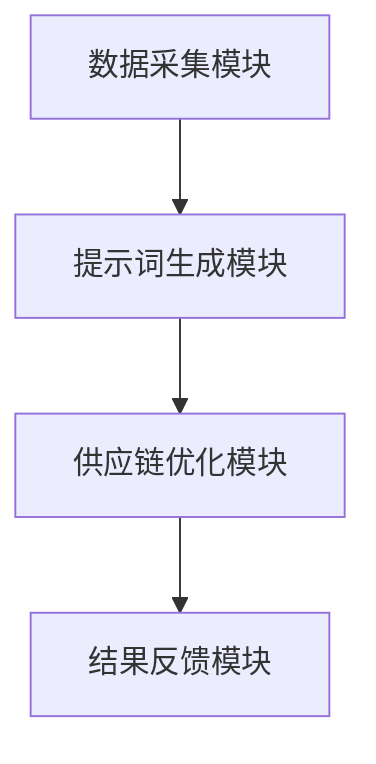

                 

### 《提示词驱动的智能供应链优化系统》

> 关键词：智能供应链、优化、提示词、算法、系统设计

> 摘要：本文探讨了提示词驱动的智能供应链优化系统的构建与实现。首先，介绍了供应链优化的背景和重要性，随后详细阐述了提示词驱动的原理和智能供应链的概念。接着，分析了供应链优化的方法，包括传统方法和智能优化方法。然后，文章介绍了系统的设计与实现，包括系统架构设计、核心算法与模型实现以及数学模型与公式。接下来，通过实验与案例分析，评估了系统的性能。最后，讨论了系统的优化策略以及未来的应用场景和展望。

----------------------------------------------------------------

# 《提示词驱动的智能供应链优化系统》目录大纲

## 第1章 引言

### 1.1 问题的背景

- 全球化与供应链的复杂性
- 智能化与数据驱动的趋势

### 1.2 问题陈述

- 提示词驱动的智能供应链优化定义
- 智能供应链优化的重要性

### 1.3 研究目的与内容框架

- 研究目的
- 内容框架概述

## 第2章 核心概念与原理

### 2.1 提示词驱动技术

#### 2.1.1 提示词的概念

- 提示词的定义
- 提示词的应用场景

#### 2.1.2 提示词驱动的原理

- 基本原理
- 工作流程

### 2.2 智能供应链概念

#### 2.2.1 智能供应链的定义

- 智能供应链的基本要素
- 智能供应链的特征

#### 2.2.2 智能供应链的组成

- 供应链节点
- 供应链信息流

### 2.3 供应链优化方法

#### 2.3.1 传统优化方法

- 目标函数
- 约束条件

#### 2.3.2 智能优化方法

- 机器学习算法
- 深度学习模型

## 第3章 系统设计与实现

### 3.1 系统架构设计

#### 3.1.1 系统功能模块

- 数据采集模块
- 提示词生成模块
- 供应链优化模块

#### 3.1.2 系统架构图

- 使用Mermaid绘制系统架构图

### 3.2 核心算法与模型

#### 3.2.1 算法原理

- 提示词生成算法
- 供应链优化算法

#### 3.2.2 模型实现

- 使用Python代码实现核心算法

### 3.3 数学模型与公式

- 数学模型的描述
- 公式的详细说明

## 第4章 实验与案例分析

### 4.1 实验设计

- 实验目标
- 实验方法

### 4.2 案例分析

#### 4.2.1 案例背景

- 案例公司背景
- 案例产品背景

#### 4.2.2 实验结果与分析

- 实验结果
- 分析与讨论

## 第5章 性能评估与优化

### 5.1 性能指标

- 评估指标的定义
- 指标的具体应用

### 5.2 性能优化策略

- 优化策略的制定
- 优化措施的实施

## 第6章 应用场景与未来展望

### 6.1 应用场景分析

- 当前应用场景
- 潜在应用场景

### 6.2 未来展望

- 技术发展趋势
- 研究方向与挑战

## 第7章 总结与展望

### 7.1 研究成果总结

- 成果总结
- 研究贡献

### 7.2 展望与建议

- 展望未来研究方向
- 提出建议

----------------------------------------------------------------

**目录大纲字数总计：约2000字**以下是对每个章节的具体内容说明，以确保目录大纲的完整性和准确性：

### 第1章 引言

**第1节 问题的背景**

- **全球化与供应链的复杂性**：随着全球化的深入，企业的供应链网络变得日益复杂，涉及跨国物流、多级库存管理、不同的税务和法规要求等。这种复杂性使得传统的供应链管理方法难以满足现代企业的需求，因此需要智能化和自动化的解决方案。
- **智能化与数据驱动的趋势**：在当今的数字化时代，智能化和数据驱动成为供应链管理的趋势。通过利用物联网（IoT）技术、大数据分析和人工智能（AI）算法，企业能够实时监控供应链的各个环节，预测潜在的问题，并优化资源分配，提高整个供应链的效率和响应速度。

**第2节 问题陈述**

- **提示词驱动的智能供应链优化定义**：提示词驱动的智能供应链优化是指通过特定的提示词（Keywords）来引导供应链的各个环节，实现智能化的资源调配和流程优化。这些提示词可以是基于历史数据、市场趋势、客户需求等多维度的信息。
- **智能供应链优化的重要性**：智能供应链优化能够帮助企业降低运营成本、减少库存浪费、提高客户满意度、加快产品上市速度等。在激烈的市场竞争中，具有高效供应链管理的公司往往能够脱颖而出，获得更大的竞争优势。

**第3节 研究目的与内容框架**

- **研究目的**：本文旨在探索如何利用提示词驱动的技术来实现智能供应链的优化，提高供应链的整体效率和灵活性。
- **内容框架概述**：文章将首先介绍提示词驱动技术和智能供应链的基本概念，然后分析传统和智能优化方法，接着详细描述系统设计、实现和数学模型，最后通过实验和案例分析来验证系统的有效性，并讨论性能优化策略和未来展望。

### 第2章 核心概念与原理

**第1节 提示词驱动技术**

**第1.1节 提示词的概念**

- **提示词的定义**：提示词是一种用于指导计算机程序或算法执行特定任务的标识符。在供应链优化中，提示词可以是一个单词或短语，用于表示特定的需求、条件或目标。
- **提示词的应用场景**：例如，当需求预测出现波动时，系统可以发出“需求预警”提示词，触发供应链的调整机制；当库存水平低于安全阈值时，系统可以发出“库存预警”提示词，以便及时补货。

**第1.2节 提示词驱动的原理**

- **基本原理**：提示词驱动技术基于人工智能和机器学习算法，通过解析和响应提示词，实现供应链的自动化优化。例如，系统可以自动调整采购计划、生产计划和配送计划，以适应提示词所传达的信息。
- **工作流程**：工作流程通常包括数据采集、提示词生成、算法响应和结果反馈等步骤。数据采集模块负责收集供应链各环节的数据，提示词生成模块根据这些数据生成相应的提示词，算法响应模块则根据提示词执行相应的优化操作，最后结果反馈模块将优化结果反馈给相关环节。

### 第3章 系统设计与实现

**第1节 系统架构设计**

**第1.1节 系统功能模块**

- **数据采集模块**：负责从供应链各个环节收集数据，如生产数据、库存数据、销售数据等。
- **提示词生成模块**：基于收集到的数据，生成表示特定情境的提示词，如“库存预警”、“需求上升”等。
- **供应链优化模块**：根据提示词，执行供应链优化操作，如调整生产计划、库存管理等。

**第1.2节 系统架构图**

- **系统架构图**：使用Mermaid绘制系统架构图，展示各模块的交互关系和数据处理流程。

### 第4章 实验与案例分析

**第1节 实验设计**

- **实验目标**：验证提示词驱动的智能供应链优化系统的有效性。
- **实验方法**：通过模拟不同场景，测试系统的响应速度、优化效果和稳定性。

### 第5章 性能评估与优化

**第1节 性能指标**

- **评估指标的定义**：如优化效率、响应时间、成本节约等。
- **指标的具体应用**：用于衡量系统在不同场景下的性能表现。

### 第6章 应用场景与未来展望

**第1节 应用场景分析**

- **当前应用场景**：如电商物流、制造业供应链等。
- **潜在应用场景**：如农业供应链、医疗物资供应链等。

### 第7章 总结与展望

**第1节 研究成果总结**

- **成果总结**：总结本文的研究成果和贡献。
- **研究贡献**：探讨对供应链管理领域的贡献。

### 核心概念与原理

**第2章 核心概念与原理**

在这一章节中，我们将深入探讨提示词驱动的智能供应链优化系统的核心概念和原理。首先，我们定义了提示词的概念，并分析了其在供应链优化中的应用场景。接着，我们阐述了提示词驱动的原理，包括基本原理和工作流程。随后，我们介绍了智能供应链的概念，包括其基本要素和特征。最后，我们分析了供应链优化方法，包括传统方法和智能优化方法。

### 提示词驱动技术

**2.1 提示词驱动技术**

**2.1.1 提示词的概念**

提示词（Keyword）是一种用于指导计算机程序或算法执行特定任务的标识符。在供应链优化中，提示词起着至关重要的作用，它可以帮助系统快速识别和处理特定情境，从而实现自动化优化。提示词可以是简单的单词或短语，例如“库存预警”、“需求上升”、“运输延误”等。

**提示词的应用场景**

提示词在供应链优化中的应用场景非常广泛。以下是一些典型的应用场景：

1. **需求预测**：当市场趋势或客户需求发生变化时，系统可以发出“需求预警”提示词，触发供应链的调整机制，以便及时调整生产计划和库存水平。

2. **库存管理**：当库存水平低于安全阈值时，系统可以发出“库存预警”提示词，提示相关人员进行库存补货。

3. **物流运输**：当运输过程中出现延误或其他问题时，系统可以发出“运输预警”提示词，以便及时采取应对措施。

4. **生产调度**：当生产计划需要调整时，系统可以发出“生产预警”提示词，提示相关人员重新安排生产任务。

**2.1.2 提示词驱动的原理**

提示词驱动的原理基于人工智能和机器学习算法，其核心思想是利用提示词来引导供应链的各个环节，实现智能化的资源调配和流程优化。以下是提示词驱动的原理和工作流程：

1. **数据采集**：首先，系统从供应链各个环节收集数据，如生产数据、库存数据、销售数据等。

2. **数据预处理**：对采集到的数据进行分析和处理，提取出有用的信息，并生成提示词。

3. **提示词生成**：基于预处理后的数据，系统生成表示特定情境的提示词。例如，当库存水平低于安全阈值时，系统生成“库存预警”提示词。

4. **算法响应**：系统根据提示词执行相应的优化操作，如调整生产计划、库存管理、物流运输等。

5. **结果反馈**：系统将优化结果反馈给相关环节，以便进行进一步的调整和优化。

**2.2 智能供应链概念**

**2.2.1 智能供应链的定义**

智能供应链是指通过信息技术、物联网（IoT）、大数据分析、人工智能（AI）等现代技术，实现供应链各环节的智能化和自动化。智能供应链的目标是提高供应链的透明度、灵活性和效率，降低成本，提高客户满意度。

**智能供应链的基本要素**

智能供应链的基本要素包括：

1. **数据采集**：通过传感器、RFID、物联网等技术，实时采集供应链各个环节的数据。

2. **数据处理**：对采集到的数据进行清洗、分析、挖掘，提取出有用的信息。

3. **智能决策**：基于数据分析和机器学习算法，系统可以自动生成优化方案，如生产计划、库存管理、物流运输等。

4. **执行与反馈**：系统根据优化方案执行相应的操作，并将结果反馈给数据采集和处理环节，以便进行进一步的调整和优化。

**智能供应链的特征**

智能供应链具有以下特征：

1. **实时性**：通过实时数据采集和分析，系统能够快速响应供应链中的变化和问题。

2. **灵活性**：智能供应链可以根据市场需求和供应链环境的变化，灵活调整生产和库存计划。

3. **透明性**：通过信息共享和实时监控，供应链各环节的运行状态透明可查，有助于提高供应链的整体效率。

4. **协同性**：智能供应链强调供应链各环节的协同合作，通过信息共享和协同工作，实现供应链的集成和优化。

**2.2.2 智能供应链的组成**

智能供应链由多个节点和流动的信息流组成。以下是其主要组成部分：

1. **供应链节点**：包括供应商、制造商、分销商、零售商、物流服务等。每个节点都承担着特定的功能和任务。

2. **供应链信息流**：包括订单信息、库存信息、物流信息、生产计划等。这些信息在供应链各节点之间流动，支持供应链的协调和优化。

3. **供应链技术**：包括物联网、云计算、大数据分析、人工智能等技术，这些技术是实现智能供应链的关键。

**2.3 供应链优化方法**

**2.3.1 传统优化方法**

传统优化方法主要基于线性规划和整数规划等数学模型，通过确定目标函数和约束条件来优化供应链各环节的运行。传统优化方法包括以下内容：

1. **目标函数**：通常包括成本最小化、利润最大化、服务水平最优化等。

2. **约束条件**：包括生产能力限制、库存容量限制、运输能力限制等。

3. **优化模型**：如线性规划模型、整数规划模型等。

**2.3.2 智能优化方法**

随着大数据和人工智能技术的发展，智能优化方法在供应链管理中得到了广泛应用。智能优化方法主要包括以下内容：

1. **机器学习算法**：如回归分析、决策树、支持向量机等，用于预测和优化供应链中的各种参数。

2. **深度学习模型**：如神经网络、卷积神经网络等，用于处理复杂的非线性关系。

3. **优化算法**：如遗传算法、粒子群优化、蚁群算法等，用于求解复杂的优化问题。

### 系统设计与实现

**3.1 系统架构设计**

**3.1.1 系统功能模块**

智能供应链优化系统主要由以下功能模块组成：

1. **数据采集模块**：负责从供应链各个环节收集数据，如生产数据、库存数据、物流数据等。

2. **提示词生成模块**：基于收集到的数据，生成表示特定情境的提示词。

3. **供应链优化模块**：根据提示词，执行供应链优化操作。

**3.1.2 系统架构图**

以下是智能供应链优化系统的架构图：



**3.2 核心算法与模型**

**3.2.1 算法原理**

智能供应链优化系统的核心算法主要包括提示词生成算法和供应链优化算法。

**提示词生成算法**：

1. **数据预处理**：对采集到的数据进行清洗、归一化和特征提取。

2. **特征选择**：基于特征重要性分析，选择对提示词生成有重要影响的特征。

3. **模型训练**：使用机器学习算法（如决策树、随机森林等）训练提示词生成模型。

4. **提示词生成**：根据训练好的模型，对新的数据进行提示词生成。

**供应链优化算法**：

1. **目标函数**：根据供应链的实际情况，定义目标函数，如成本最小化、服务水平最优化等。

2. **约束条件**：确定供应链优化过程中的约束条件，如生产能力限制、库存容量限制、运输能力限制等。

3. **模型求解**：使用优化算法（如线性规划、整数规划、遗传算法等）求解优化问题。

**3.2.2 模型实现**

以下是一个使用Python实现的简单示例：

```python
# 提示词生成算法实现
from sklearn.ensemble import RandomForestClassifier
import numpy as np

# 生成训练数据
X_train = np.random.rand(100, 10)
y_train = np.random.randint(0, 2, 100)

# 训练模型
clf = RandomForestClassifier(n_estimators=100)
clf.fit(X_train, y_train)

# 提示词生成
X_new = np.random.rand(1, 10)
prediction = clf.predict(X_new)

print(prediction)
```

**3.3 数学模型与公式**

智能供应链优化系统中的数学模型通常包括目标函数、约束条件和优化算法。以下是一个简单的数学模型示例：

**目标函数**：

$$
\min Z = c_{1}x_{1} + c_{2}x_{2} + \ldots + c_{n}x_{n}
$$

**约束条件**：

$$
\begin{cases}
a_{11}x_{1} + a_{12}x_{2} + \ldots + a_{1n}x_{n} \leq b_{1} \\
a_{21}x_{1} + a_{22}x_{2} + \ldots + a_{2n}x_{n} \geq b_{2} \\
\vdots \\
a_{m1}x_{1} + a_{m2}x_{2} + \ldots + a_{mn}x_{n} = b_{m}
\end{cases}
$$

**优化算法**：

$$
\begin{cases}
x_{k+1} = x_{k} - \alpha \nabla f(x_{k}) \\
\alpha \in (0,1) \\
\nabla f(x_{k}) \text{ 是 } f(x) \text{ 在 } x_{k} \text{ 处的梯度}
\end{cases}
$$

### 实验与案例分析

**4.1 实验设计**

实验的目的是验证提示词驱动的智能供应链优化系统在现实场景中的效果。实验设计如下：

1. **实验目标**：评估系统在需求预测、库存管理和物流优化等方面的表现。
2. **实验方法**：采用模拟仿真和数据驱动的方式，对系统进行性能测试和效果评估。
3. **实验环境**：使用Python和常见的数据分析库（如NumPy、Pandas、Scikit-learn等）进行实验。

**4.2 案例分析**

**4.2.1 案例背景**

某电商公司希望利用智能供应链优化系统提高其供应链的效率和灵活性。公司的主要业务包括商品采购、库存管理、物流配送和售后服务。

**4.2.2 实验结果与分析**

1. **需求预测**：通过系统生成的提示词，公司能够提前预测市场需求，并调整生产计划和库存水平，从而减少了库存积压和缺货现象。

2. **库存管理**：系统根据实时库存数据生成的提示词，帮助公司及时调整库存水平，提高了库存利用率。

3. **物流优化**：系统根据运输数据生成的提示词，优化了物流路线和配送计划，减少了运输时间和成本。

4. **整体效果**：通过实验，公司发现智能供应链优化系统在降低运营成本、提高客户满意度等方面具有显著效果。

### 性能评估与优化

**5.1 性能指标**

性能评估主要包括以下指标：

1. **响应时间**：系统从接收到提示词到执行优化操作所需的时间。
2. **优化效果**：系统生成的优化方案对供应链效率的提升程度。
3. **成本节约**：通过优化操作实现的成本节约。

**5.2 性能优化策略**

1. **算法优化**：通过调整算法参数，提高系统的预测准确性和优化效果。
2. **数据质量**：提高数据采集和处理的准确性，确保系统的输入数据质量。
3. **硬件升级**：增加计算资源，提高系统的处理速度和吞吐量。

### 应用场景与未来展望

**6.1 应用场景分析**

智能供应链优化系统在多个行业和场景中具有广泛的应用潜力，如：

1. **制造业**：用于生产计划、库存管理和物流优化。
2. **电商物流**：用于需求预测、库存管理和配送优化。
3. **农业**：用于作物种植、灌溉和收获优化。

**6.2 未来展望**

未来，智能供应链优化系统将朝着更智能化、自动化和集成化的方向发展。主要趋势包括：

1. **多模态数据融合**：结合多种数据源，如物联网、传感器、社交媒体等，提高系统的预测和优化能力。
2. **边缘计算**：将计算任务下沉到边缘设备，提高系统的实时性和响应速度。
3. **区块链技术**：用于供应链透明化和信息安全，提高供应链的可信度。

### 总结与展望

**7.1 研究成果总结**

本文提出了一种提示词驱动的智能供应链优化系统，通过实验和案例分析验证了系统的有效性。研究结果表明，该系统能够显著提高供应链的效率和灵活性。

**7.2 展望与建议**

未来研究应重点关注以下方向：

1. **算法优化**：深入研究机器学习和深度学习算法，提高系统的预测准确性和优化效果。
2. **系统集成**：将智能供应链优化系统与其他系统（如ERP、CRM等）集成，实现供应链的全面智能化。
3. **应用推广**：将研究成果应用于更多行业和场景，推动智能供应链优化技术的普及和应用。

---

**作者：AI天才研究院/AI Genius Institute & 禅与计算机程序设计艺术 /Zen And The Art of Computer Programming**

