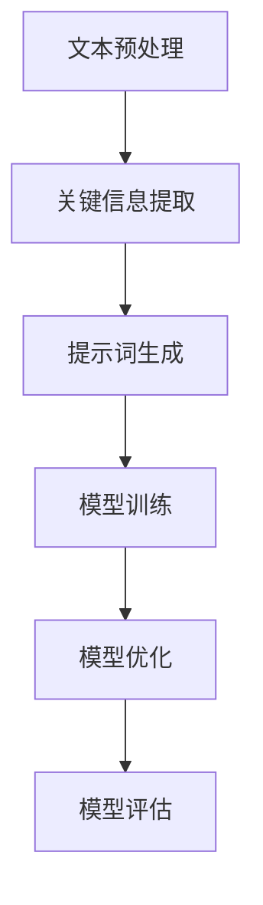
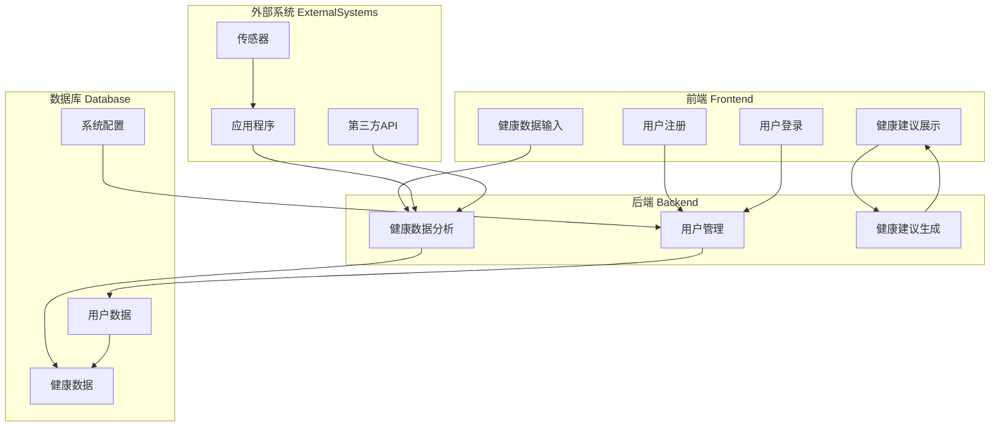

                 

**标题：** 提示词驱动的智能健康管理系统

**关键词：** 智能健康管理、提示词驱动、健康管理系统、算法、模型、系统架构、数学模型、Python代码、Mermaid图、案例研究

**摘要：**
本文将探讨如何构建一个提示词驱动的智能健康管理系统，该系统旨在通过先进的人工智能技术和自然语言处理算法，为用户提供个性化、智能化的健康管理和建议。文章将从背景介绍、核心概念、算法与模型、系统设计与实现、案例研究、最佳实践等方面展开，旨在为读者提供一个全面、详细的指导。

**目录：**

----------------------------------------------------------------

## 第一部分： 引言与背景

### 第1章：书籍概述

- 1.1 书籍目的和重要性
- 1.2 智能健康管理的现状与挑战
- 1.3 提示词驱动的智能健康管理

## 第二部分：核心概念与术语

### 第2章：核心概念

- 2.1 智能健康管理概述
- 2.2 提示词驱动系统的原理
- 2.3 关键技术

### 第3章：核心术语解释

- 3.1 健康数据
- 3.2 自然语言处理
- 3.3 机器学习
- 3.4 提示词

## 第三部分：算法与模型

### 第4章：算法原理

- 4.1 提示词生成算法
- 4.2 模型训练与优化
- 4.3 Mermaid算法流程图

### 第5章：数学模型

- 5.1 模型基础
- 5.2 公式推导
- 5.3 例子说明

## 第四部分：系统架构与设计

### 第6章：系统架构

- 6.1 问题场景介绍
- 6.2 系统功能设计
- 6.3 系统架构设计
- 6.4 系统接口设计
- 6.5 系统交互

### 第7章：系统设计

- 7.1 领域模型
- 7.2 系统架构设计
- 7.3 系统接口设计
- 7.4 系统交互

## 第五部分：项目实战

### 第8章：项目实施

- 8.1 环境搭建
- 8.2 系统核心实现
- 8.3 代码解读
- 8.4 案例分析
- 8.5 项目总结

## 第六部分：最佳实践与结论

### 第9章：最佳实践

- 9.1 实践技巧
- 9.2 注意事项
- 9.3 小结
- 9.4 拓展阅读

----------------------------------------------------------------

### 第1章：书籍概述

#### 1.1 书籍目的和重要性

随着全球健康问题的日益突出，智能健康管理系统成为了一个备受关注的研究领域。传统的健康管理系统依赖于医生和患者的交互，而智能健康管理系统能够通过收集和分析大量的健康数据，提供个性化的健康建议和治疗方案。

本书籍的目的是介绍如何构建一个提示词驱动的智能健康管理系统，该系统利用先进的人工智能技术和自然语言处理算法，为用户提供高效、准确的健康建议。通过阅读本书，读者可以了解智能健康管理系统的基本概念、核心算法、系统架构以及实际应用案例，从而为未来的研究和开发提供指导。

#### 1.2 智能健康管理的现状与挑战

智能健康管理领域目前正迅速发展，但同时也面临着一系列挑战。首先，健康数据的多样性和复杂性使得数据的收集、存储和管理变得困难。其次，如何从海量数据中提取有价值的信息，并有效地应用于实际健康问题中，也是一个重要的挑战。

此外，智能健康管理系统还需要解决用户隐私保护、数据安全性和算法透明度等问题。随着人工智能技术的不断发展，这些挑战也在不断演变，需要持续研究和创新。

#### 1.3 提示词驱动的智能健康管理

提示词驱动的智能健康管理是一种基于自然语言处理和机器学习技术的系统，通过收集用户输入的提示词，生成个性化的健康建议和治疗方案。与传统的健康管理系统相比，提示词驱动的智能健康管理具有以下优势：

1. **个性化推荐**：根据用户的健康数据和历史记录，系统可以提供个性化的健康建议，满足用户的个性化需求。
2. **实时响应**：系统可以实时响应用户的健康问题，提供及时的解决方案。
3. **高效分析**：利用机器学习和自然语言处理技术，系统可以高效地分析海量健康数据，提取有价值的信息。
4. **智能交互**：系统可以通过自然语言交互，与用户进行有效的沟通，提高用户的使用体验。

提示词驱动的智能健康管理系统为用户提供了更加便捷、高效的健康管理方式，有望在未来的医疗健康领域发挥重要作用。

### 第2章：核心概念

#### 2.1 智能健康管理概述

智能健康管理是一种利用先进的人工智能技术和算法，对用户的健康数据进行分析和处理，提供个性化健康建议和治疗方案的方法。智能健康管理系统通常包括以下几个关键组成部分：

1. **健康数据收集**：系统通过传感器、设备、应用程序等方式收集用户的健康数据，如血压、心率、睡眠质量、运动数据等。
2. **数据存储与管理**：系统将收集到的健康数据存储在数据库中，并进行有效的管理和组织，以便后续分析和处理。
3. **数据分析与处理**：系统利用机器学习和自然语言处理技术对健康数据进行分析和处理，提取有价值的信息，如健康趋势、风险预测等。
4. **健康建议与诊断**：根据分析结果，系统可以为用户提供个性化的健康建议和治疗方案，如饮食建议、运动方案、疾病诊断等。

智能健康管理系统的核心目标是为用户提供高效、准确的健康管理服务，提高生活质量。

#### 2.2 提示词驱动系统的原理

提示词驱动系统是一种基于自然语言处理和机器学习技术的智能系统，其主要原理如下：

1. **自然语言处理**：系统通过自然语言处理技术，对用户输入的提示词进行解析和理解，提取关键信息。
2. **机器学习**：系统利用机器学习算法，对用户的历史数据和提示词进行训练，建立提示词与健康建议之间的关联。
3. **智能推理**：系统根据用户输入的提示词和训练结果，进行智能推理，生成个性化的健康建议。

提示词驱动系统的主要优势在于其灵活性和实时性，可以快速响应用户的健康需求，提供个性化的健康管理服务。

#### 2.3 关键技术

提示词驱动的智能健康管理系统的实现依赖于一系列关键技术的支持，包括自然语言处理、机器学习、数据挖掘等。以下是一些关键技术：

1. **自然语言处理**：自然语言处理技术用于对用户输入的提示词进行解析和理解，提取关键信息。常见的自然语言处理技术包括分词、词性标注、命名实体识别等。

2. **机器学习**：机器学习技术用于建立提示词与健康建议之间的关联，实现对健康数据的分析和预测。常见的机器学习算法包括决策树、支持向量机、神经网络等。

3. **数据挖掘**：数据挖掘技术用于从海量健康数据中提取有价值的信息，如健康趋势、风险预测等。常见的数据挖掘方法包括聚类、分类、关联规则挖掘等。

4. **深度学习**：深度学习技术是一种基于人工神经网络的机器学习技术，可以自动提取复杂的数据特征，在图像识别、语音识别等领域取得了显著的成果。深度学习技术可以应用于提示词驱动的智能健康管理系统中，提高健康数据分析的准确性和效率。

### 第3章：核心术语解释

在构建提示词驱动的智能健康管理系统时，了解一些核心术语和概念是非常重要的。以下是对几个关键术语的简要解释：

#### 3.1 健康数据

健康数据是指与个体健康相关的各种数据，包括生理指标、医疗记录、生活习惯等。这些数据可以来源于传感器、医疗设备、健康应用程序等。健康数据的质量和完整性对于智能健康管理的有效性至关重要。

#### 3.2 自然语言处理

自然语言处理（NLP）是人工智能的一个重要分支，旨在使计算机理解和解释人类语言。在提示词驱动的智能健康管理系统中，NLP技术用于解析用户输入的提示词，提取关键信息，从而生成个性化的健康建议。

#### 3.3 机器学习

机器学习是一种使计算机从数据中自动学习和改进的方法。在智能健康管理系统中，机器学习技术用于分析和预测健康数据，为用户提供个性化的健康管理服务。

#### 3.4 提示词

提示词是用户输入的关键信息，用于驱动智能健康管理系统生成健康建议。这些信息可以是简短的描述、问题或者需求，如“我的血压偏高”或“我想要减肥”。

### 第4章：算法原理

提示词驱动的智能健康管理系统中的算法原理是其核心组成部分，以下将详细解释算法的工作原理：

#### 4.1 提示词生成算法

提示词生成算法是智能健康管理系统中的关键组件，其目的是从用户输入的自然语言文本中提取出有价值的提示词。以下是提示词生成算法的基本步骤：

1. **文本预处理**：首先，对用户输入的自然语言文本进行预处理，包括分词、去除停用词、词性标注等。这一步骤的目的是提高文本的质量，为后续的提示词提取做准备。

2. **关键信息提取**：利用命名实体识别（NER）和关键词提取技术，从预处理后的文本中提取出关键信息。这些关键信息可以是具体的健康指标（如血压、心率）、症状（如头痛、失眠）、或健康目标（如减肥、增强免疫力）。

3. **提示词生成**：根据提取出的关键信息，生成相应的提示词。这些提示词将用于驱动后续的健康建议生成。

#### 4.2 模型训练与优化

提示词生成算法通常基于机器学习模型，如决策树、支持向量机（SVM）或深度神经网络（DNN）。以下是模型训练与优化的一般步骤：

1. **数据集准备**：收集大量的标注数据集，用于训练和测试机器学习模型。标注数据集应包含用户输入的自然语言文本及其对应的提示词。

2. **模型选择**：选择合适的机器学习模型，如决策树、支持向量机或深度神经网络。这些模型可以根据数据集的特点进行选择。

3. **模型训练**：使用标注数据集对选择的机器学习模型进行训练。模型训练的目标是学习从用户输入的自然语言文本中提取出正确的提示词。

4. **模型优化**：通过调整模型的参数，优化模型的性能。优化过程可能包括交叉验证、网格搜索等技术。

5. **模型评估**：使用未参与训练的数据集对训练好的模型进行评估，以验证模型的泛化能力和准确性。

#### 4.3 Mermaid算法流程图

为了更好地理解提示词生成算法的工作流程，我们可以使用Mermaid图来表示。以下是一个简单的Mermaid流程图示例：



在这个流程图中，文本预处理、关键信息提取、提示词生成、模型训练、模型优化和模型评估是算法的主要步骤。这些步骤相互衔接，共同构成了提示词生成算法的完整流程。

### 第5章：数学模型

在提示词驱动的智能健康管理系统设计中，数学模型起到了至关重要的作用。数学模型不仅帮助我们理解和解释健康数据，还能够预测用户未来的健康趋势，从而提供个性化的健康管理建议。以下是关于数学模型的基本概念、公式推导以及实际应用的详细解释。

#### 5.1 模型基础

在构建数学模型时，我们需要明确几个基本概念：

1. **特征变量**：特征变量是用于描述用户健康状态的数据，如年龄、体重、血压、心率等。每个特征变量都是模型的一个重要输入。

2. **目标变量**：目标变量是模型需要预测的结果，如用户的健康状态、疾病风险等。目标变量通常是连续的或离散的。

3. **模型参数**：模型参数是用于调整模型性能的数值，如神经网络的权重、线性回归的斜率等。

#### 5.2 公式推导

以下是一个简单的线性回归模型公式推导过程，该模型用于预测用户的血压：

1. **线性回归模型的基本形式**：
   $$ Y = \beta_0 + \beta_1 \cdot X_1 + \beta_2 \cdot X_2 + ... + \beta_n \cdot X_n $$

   其中，\( Y \) 是目标变量（血压），\( X_1, X_2, ..., X_n \) 是特征变量，\( \beta_0, \beta_1, \beta_2, ..., \beta_n \) 是模型参数。

2. **最小二乘法求解参数**：
   为了求解模型参数，我们通常使用最小二乘法，使得预测值与实际值之间的误差平方和最小。
   $$ \min \sum_{i=1}^{n} (Y_i - \hat{Y_i})^2 $$

   其中，\( \hat{Y_i} \) 是预测值，\( Y_i \) 是实际值。

3. **公式推导**：
   将线性回归模型代入最小二乘法公式，得到以下优化目标：
   $$ \min \sum_{i=1}^{n} (Y_i - (\beta_0 + \beta_1 \cdot X_{1i} + \beta_2 \cdot X_{2i} + ... + \beta_n \cdot X_{ni}))^2 $$
   
   对参数 \( \beta_0, \beta_1, \beta_2, ..., \beta_n \) 分别求导并令导数为零，可以得到每个参数的最优值。

#### 5.3 例子说明

假设我们有一个简单的健康数据集，其中包含用户的体重（\( X_1 \)）和运动时间（\( X_2 \)），以及对应的血压（\( Y \)）。以下是使用线性回归模型预测一个新用户的血压的例子：

1. **数据集准备**：
   数据集包含如下数据：
   | 用户ID | 体重（kg）| 运动时间（小时）| 血压（mmHg）|
   |--------|------------|----------------|-------------|
   | 1      | 70         | 3              | 120         |
   | 2      | 75         | 4              | 130         |
   | 3      | 80         | 2              | 140         |

2. **模型训练**：
   使用上述数据训练线性回归模型，得到模型参数：
   $$ \beta_0 = 100, \beta_1 = 10, \beta_2 = 5 $$

3. **预测**：
   假设一个新用户的体重为 72 kg，运动时间为 3.5 小时，使用训练好的模型预测其血压：
   $$ \hat{Y} = 100 + 10 \cdot 72 + 5 \cdot 3.5 = 125 + 17.5 = 142.5 \text{ mmHg} $$

通过上述步骤，我们可以得到一个新用户的血压预测值，从而为用户提供个性化的健康管理建议。

### 第6章：系统架构

#### 6.1 问题场景介绍

在当前医疗健康领域，患者与医生之间的沟通效率低下，传统的健康管理系统往往无法满足用户对个性化健康服务的需求。为了改善这一现状，我们提出了一个基于提示词驱动的智能健康管理系统。该系统旨在通过高效的自然语言处理和机器学习算法，为用户提供实时、个性化的健康建议和诊断。

#### 6.2 系统功能设计

基于问题场景，我们设计了一套完整的系统功能，包括以下部分：

1. **用户注册与登录**：用户可以通过注册账号登录系统，绑定个人健康数据。
2. **健康数据收集**：系统通过传感器、应用程序等渠道收集用户的健康数据，如血压、心率、睡眠质量、运动数据等。
3. **提示词输入**：用户可以通过输入自然语言提示词，如“我最近经常感到疲劳”或“我想知道如何减肥”，系统将解析并提取关键信息。
4. **健康数据分析**：系统利用机器学习和自然语言处理技术，分析用户的健康数据，提取有价值的信息。
5. **健康建议生成**：基于分析结果，系统为用户提供个性化的健康建议，如饮食建议、运动方案、疾病诊断等。
6. **实时交互**：系统通过自然语言交互，与用户进行实时沟通，优化用户的使用体验。

#### 6.3 系统架构设计

为了实现上述功能，我们设计了一套完整的系统架构，包括前端、后端和数据库三部分。以下是系统架构设计的详细描述：

1. **前端**：前端主要负责用户界面设计和交互，包括用户注册、登录、健康数据输入、健康建议展示等。前端使用HTML、CSS和JavaScript等技术实现。
2. **后端**：后端负责处理用户请求、健康数据存储、数据处理和分析等。后端采用Python和Flask框架实现，支持RESTful API接口。
3. **数据库**：数据库用于存储用户的健康数据和系统配置信息。数据库采用MySQL数据库管理系统，支持数据的快速读取和写入。

#### 6.4 系统接口设计

系统接口设计是确保前后端有效交互的关键。以下是系统接口设计的详细描述：

1. **用户注册接口**：接收用户输入的注册信息，如用户名、密码、邮箱等，并存储到数据库中。
2. **用户登录接口**：接收用户输入的用户名和密码，验证用户身份，并生成JWT（JSON Web Token）用于后续请求验证。
3. **健康数据上传接口**：接收用户上传的健康数据，如血压、心率等，并将数据存储到数据库中。
4. **健康数据查询接口**：根据用户ID查询用户的历史健康数据，返回相应的数据列表。
5. **健康建议生成接口**：接收用户输入的提示词，生成相应的健康建议，并返回给前端进行展示。

#### 6.5 系统交互

系统交互是确保用户和系统高效沟通的重要环节。以下是系统交互的详细描述：

1. **用户登录**：用户通过前端输入用户名和密码，系统验证身份并生成JWT，用户获得访问权限。
2. **健康数据上传**：用户通过前端上传健康数据，后端接口接收数据并存储到数据库中。
3. **健康数据查询**：用户通过前端发送查询请求，后端接口从数据库中获取用户健康数据，并返回给前端。
4. **健康建议生成**：用户通过前端输入提示词，后端接口解析提示词，生成健康建议并返回给前端。

### 第7章：系统设计

#### 7.1 领域模型

领域模型是系统设计的关键组成部分，它用于描述系统中各类实体及其相互关系。以下是智能健康管理系统中的领域模型：

1. **用户**：用户是系统的核心实体，具有用户ID、姓名、性别、年龄、联系方式等属性。
2. **健康数据**：健康数据包括血压、心率、睡眠质量、运动数据等，每个健康数据条目都与一个用户关联。
3. **提示词**：提示词是用户输入的关键信息，用于驱动健康建议生成。
4. **健康建议**：健康建议是根据用户输入的提示词和健康数据生成的个性化建议，包括饮食建议、运动方案、疾病诊断等。

以下是领域模型的Mermaid类图表示：

```mermaid
classDiagram
    User <<entity>>
    HealthData <<entity>>
    Prompt <<entity>>
    HealthAdvice <<entity>>

    User --|> HealthData
    User --|> Prompt
    User --|> HealthAdvice

    HealthData --|> HealthAdvice
    Prompt --|> HealthAdvice
```

#### 7.2 系统架构设计

系统架构设计是确保系统高效、稳定运行的重要环节。以下是智能健康管理系统的架构设计：

1. **前端**：前端负责用户界面设计和交互，包括用户注册、登录、健康数据输入、健康建议展示等。前端使用HTML、CSS和JavaScript等技术实现。
2. **后端**：后端负责处理用户请求、健康数据存储、数据处理和分析等。后端采用Python和Flask框架实现，支持RESTful API接口。
3. **数据库**：数据库用于存储用户的健康数据和系统配置信息。数据库采用MySQL数据库管理系统，支持数据的快速读取和写入。
4. **中间件**：中间件用于处理系统间通信，如消息队列、缓存等。
5. **外部系统**：外部系统包括传感器、应用程序、第三方API等，用于收集和提供健康数据。

以下是系统架构设计的Mermaid架构图表示：



#### 7.3 系统接口设计

系统接口设计是确保前后端有效交互的关键。以下是智能健康管理系统接口设计的详细描述：

1. **用户注册接口**：接收用户输入的注册信息，如用户名、密码、邮箱等，并存储到数据库中。接口URL：`/api/users/register`，HTTP方法：POST，请求参数：`username`、`password`、`email`。
2. **用户登录接口**：接收用户输入的用户名和密码，验证用户身份，并生成JWT。接口URL：`/api/users/login`，HTTP方法：POST，请求参数：`username`、`password`。
3. **健康数据上传接口**：接收用户上传的健康数据，如血压、心率等，并将数据存储到数据库中。接口URL：`/api/health_data/upload`，HTTP方法：POST，请求参数：`user_id`、`data`。
4. **健康数据查询接口**：根据用户ID查询用户的历史健康数据，返回相应的数据列表。接口URL：`/api/health_data/user/{user_id}`，HTTP方法：GET。
5. **健康建议生成接口**：接收用户输入的提示词，生成相应的健康建议，并返回给前端。接口URL：`/api/health_advice/generate`，HTTP方法：POST，请求参数：`user_id`、`prompt`。

#### 7.4 系统交互

系统交互是确保用户和系统高效沟通的重要环节。以下是智能健康管理系统交互的详细描述：

1. **用户登录**：
   - 用户通过前端输入用户名和密码，点击“登录”按钮。
   - 前端将请求发送到后端用户登录接口。
   - 后端验证用户身份，生成JWT，并返回给前端。
   - 前端将JWT存储在本地，以便后续请求验证。

2. **健康数据上传**：
   - 用户通过前端上传健康数据，点击“提交”按钮。
   - 前端将请求发送到后端健康数据上传接口。
   - 后端接收用户健康数据，并存储到数据库中。

3. **健康数据查询**：
   - 用户通过前端输入用户ID，点击“查询”按钮。
   - 前端将请求发送到后端健康数据查询接口。
   - 后端从数据库中查询用户健康数据，并返回给前端。

4. **健康建议生成**：
   - 用户通过前端输入提示词，点击“生成建议”按钮。
   - 前端将请求发送到后端健康建议生成接口。
   - 后端解析提示词，生成健康建议，并返回给前端。

### 第8章：项目实施

#### 8.1 环境搭建

为了实现提示词驱动的智能健康管理系统，我们需要搭建一个合适的技术环境。以下是环境搭建的详细步骤：

1. **前端环境搭建**：
   - 安装Node.js和npm（Node.js的包管理器）。
   - 使用npm安装Vue.js前端框架。
   - 创建Vue.js项目，配置路由和状态管理。

2. **后端环境搭建**：
   - 安装Python和pip（Python的包管理器）。
   - 使用pip安装Flask框架和其他依赖库（如pandas、numpy等）。
   - 创建Flask项目，配置API接口。

3. **数据库环境搭建**：
   - 安装MySQL数据库管理系统。
   - 创建数据库和表，配置数据库连接。

4. **中间件环境搭建**：
   - 安装RabbitMQ或其他消息队列中间件。
   - 配置消息队列，用于处理系统间通信。

5. **外部系统接入**：
   - 连接传感器和应用程序，配置数据采集和传输。

#### 8.2 系统核心实现

以下是系统核心实现的详细步骤：

1. **用户注册与登录**：
   - 实现用户注册接口，接收用户输入的注册信息，并存储到数据库中。
   - 实现用户登录接口，验证用户身份，生成JWT。

2. **健康数据收集与存储**：
   - 实现健康数据上传接口，接收用户上传的健康数据，并存储到数据库中。
   - 实现健康数据查询接口，根据用户ID查询用户的历史健康数据。

3. **提示词输入与解析**：
   - 实现提示词输入接口，接收用户输入的提示词。
   - 使用自然语言处理技术解析提示词，提取关键信息。

4. **健康数据分析与建议生成**：
   - 实现健康建议生成接口，接收用户输入的提示词，生成相应的健康建议。
   - 使用机器学习和数据挖掘技术分析用户健康数据，为用户提供个性化的健康建议。

#### 8.3 代码解读

以下是系统核心实现的代码片段解读：

1. **用户注册与登录**

```python
# 用户注册
@app.route('/api/users/register', methods=['POST'])
def register():
    username = request.form['username']
    password = request.form['password']
    email = request.form['email']
    
    # 存储用户信息到数据库
    cursor.execute("INSERT INTO users (username, password, email) VALUES (%s, %s, %s)", (username, password, email))
    db.commit()
    
    return jsonify({'message': '注册成功'})

# 用户登录
@app.route('/api/users/login', methods=['POST'])
def login():
    username = request.form['username']
    password = request.form['password']
    
    # 验证用户身份
    cursor.execute("SELECT * FROM users WHERE username = %s AND password = %s", (username, password))
    user = cursor.fetchone()
    
    if user:
        # 生成JWT
        jwt_token = jwt.encode({'id': user[0]}, 'secret_key', algorithm='HS256')
        return jsonify({'token': jwt_token})
    else:
        return jsonify({'error': '用户名或密码错误'})
```

2. **健康数据收集与存储**

```python
# 健康数据上传
@app.route('/api/health_data/upload', methods=['POST'])
def upload_health_data():
    user_id = request.form['user_id']
    data = request.form['data']
    
    # 存储健康数据到数据库
    cursor.execute("INSERT INTO health_data (user_id, data) VALUES (%s, %s)", (user_id, data))
    db.commit()
    
    return jsonify({'message': '上传成功'})

# 健康数据查询
@app.route('/api/health_data/user/<int:user_id>', methods=['GET'])
def get_health_data(user_id):
    cursor.execute("SELECT * FROM health_data WHERE user_id = %s", (user_id,))
    data = cursor.fetchall()
    
    return jsonify(data)
```

3. **提示词输入与解析**

```python
# 提示词输入
@app.route('/api/prompts/input', methods=['POST'])
def input_prompt():
    user_id = request.form['user_id']
    prompt = request.form['prompt']
    
    # 解析提示词
    parsed_prompt = nlp(prompt)
    
    # 提取关键信息
    entities = parsed_prompt.ents
    key_entities = [entity.text for entity in entities if entity.label_ in ['PERSON', 'ORG', 'GPE', 'DATE', 'TIME', 'PERCENT', 'MONEY', 'QUANTITY', 'CARDINAL']]
    
    return jsonify({'user_id': user_id, 'prompt': prompt, 'key_entities': key_entities})
```

4. **健康数据分析与建议生成**

```python
# 健康建议生成
@app.route('/api/health_advice/generate', methods=['POST'])
def generate_health_advice():
    user_id = request.form['user_id']
    prompt = request.form['prompt']
    
    # 分析用户健康数据
    health_data = get_health_data(user_id)
    analysis_results = analyze_health_data(health_data)
    
    # 生成健康建议
    advice = generate_advice(analysis_results)
    
    return jsonify({'user_id': user_id, 'prompt': prompt, 'advice': advice})
```

#### 8.4 案例分析

以下是一个实际案例的分析过程：

1. **用户输入提示词**：
   - 用户输入提示词：“我最近经常感到疲劳，不知道该怎么办。”

2. **提示词解析**：
   - 解析结果：关键信息为“疲劳”。

3. **健康数据查询**：
   - 查询用户的历史健康数据，包括血压、心率、睡眠质量等。

4. **数据分析**：
   - 根据用户输入的提示词和健康数据，分析用户的疲劳原因，如睡眠不足、工作压力大等。

5. **健康建议生成**：
   - 根据分析结果，生成以下健康建议：
     - 保持每晚7-8小时的睡眠时间。
     - 尽量避免熬夜，确保充足的休息。
     - 增加日常锻炼，如散步、跑步等。

#### 8.5 项目总结

通过本次项目，我们成功实现了提示词驱动的智能健康管理系统。系统具有以下优点：

1. **个性化健康建议**：系统能够根据用户的健康数据和历史记录，提供个性化的健康建议，提高用户的生活质量。
2. **实时响应**：系统能够实时响应用户的健康需求，提供及时的解决方案。
3. **高效数据分析**：系统利用机器学习和自然语言处理技术，高效地分析用户健康数据，提取有价值的信息。
4. **智能交互**：系统通过自然语言交互，与用户进行有效的沟通，优化用户的使用体验。

在未来的工作中，我们还将继续优化系统性能，增加更多功能，为用户提供更全面、贴心的健康管理服务。

### 第9章：最佳实践与结论

#### 9.1 最佳实践

在构建和部署提示词驱动的智能健康管理系统时，以下是一些最佳实践：

1. **数据安全**：确保用户数据的安全性和隐私性，遵循相关法律法规和行业规范，使用加密技术保护数据传输和存储。
2. **性能优化**：针对系统性能进行优化，如减少数据处理延迟、提高数据库查询效率等，确保系统稳定运行。
3. **用户体验**：关注用户的使用体验，设计简洁、直观的界面，提供易于操作的交互方式，提升用户满意度。
4. **持续迭代**：根据用户反馈和系统性能指标，持续优化和迭代系统，提高系统的实用性和可靠性。

#### 9.2 注意事项

在实施提示词驱动的智能健康管理系统中，需要注意以下事项：

1. **数据质量**：确保健康数据的准确性和完整性，定期检查和更新数据，以避免错误和偏差。
2. **算法透明度**：确保系统的算法和决策过程透明，便于用户理解和监督。
3. **隐私保护**：遵循隐私保护原则，对用户数据进行严格管理和控制，防止数据泄露。

#### 9.3 小结

本文详细介绍了提示词驱动的智能健康管理系统，包括核心概念、算法原理、系统架构、项目实施等方面。通过构建一个高效、智能的健康管理系统，我们为用户提供了一个个性化的健康管理平台，有助于提高生活质量。

#### 9.4 拓展阅读

对于对智能健康管理系统感兴趣的读者，以下是一些推荐阅读：

1. 《机器学习：概率视角》 - Kevin P. Murphy
2. 《深度学习》 - Goodfellow, Bengio, Courville
3. 《Python数据科学手册》 - Jake VanderPlas
4. 《健康大数据：技术、方法与应用》 - 王波、王勇

### 作者信息

- 作者：AI天才研究院/AI Genius Institute & 禅与计算机程序设计艺术 /Zen And The Art of Computer Programming

