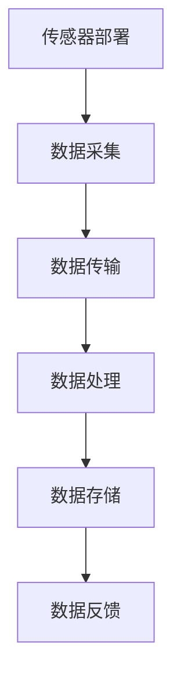
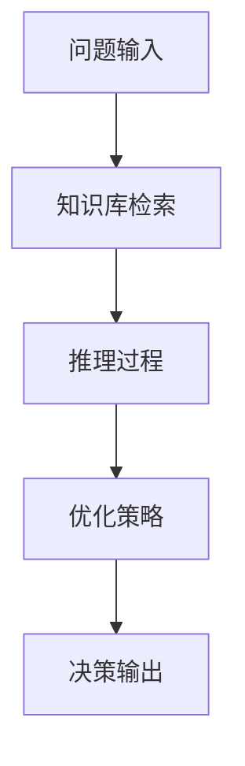
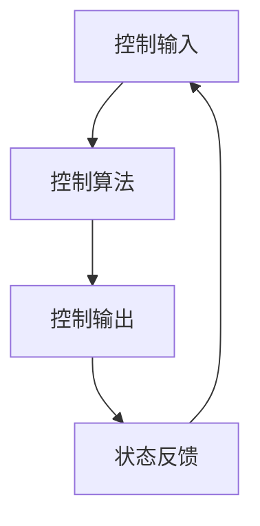
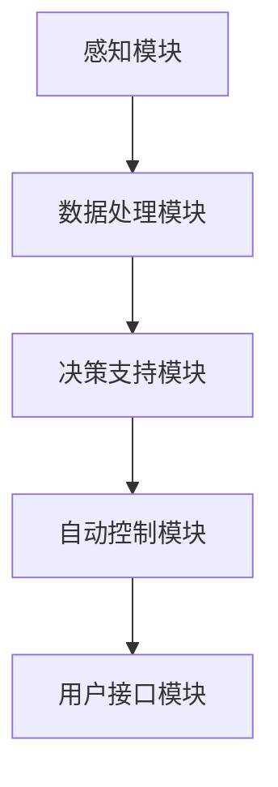
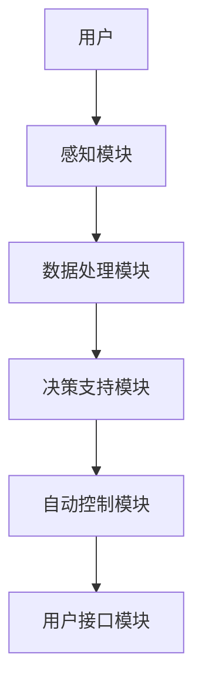

                 

## 提示词驱动的智能农业管理系统

### 关键词：智能农业、提示词驱动、管理系统、算法原理、系统设计与实现

#### 摘要：

本文将探讨提示词驱动的智能农业管理系统的设计与应用。随着全球农业生产的不断增长和对可持续农业的迫切需求，智能化管理系统成为农业领域的关键技术。提示词驱动系统利用自然语言处理技术和大数据分析，为农业提供精准、实时的管理和决策支持。本文将深入分析智能农业管理系统的核心概念、算法原理、系统架构和项目实战，以期为农业领域的智能化转型提供有益的参考。

### 目录大纲

1. **背景与基础**
   1.1 **智能农业概述**
   1.2 **提示词驱动系统概述**
   1.3 **智能农业管理系统的重要性**
2. **核心概念与联系**
   2.1 **核心概念**
   2.2 **概念属性特征对比**
   2.3 **ER实体关系图**
3. **算法原理讲解**
   3.1 **感知与数据处理**
   3.2 **决策支持与自动控制**
4. **系统设计与实现**
   4.1 **系统架构设计**
   4.2 **系统接口设计**
   4.3 **项目实战**
5. **最佳实践与总结**
   5.1 **最佳实践**
   5.2 **小结**
   5.3 **注意事项与拓展阅读**

---

## 第一部分：背景与基础

### 1.1 智能农业概述

#### 1.1.1 问题背景

当前，全球农业正面临着一系列严峻的挑战，包括气候变化、资源短缺和人口增长。传统的农业生产方式已经难以满足这些需求，迫切需要引入新的技术手段进行农业的智能化转型。智能农业作为现代农业发展的重要方向，通过运用物联网、大数据、人工智能等技术，实现农业生产的自动化、精准化和智能化。

#### 1.1.2 智能农业的概念与发展趋势

智能农业是指通过利用现代信息技术，对农业生产过程中的各个环节进行智能化管理，从而提高农业生产效率、降低生产成本、减少资源浪费，并实现农业的可持续发展。智能农业的发展趋势主要体现在以下几个方面：

- **物联网技术的应用**：通过传感器和无线网络，实现对农田环境、作物生长状态等实时数据的采集和传输。
- **大数据分析**：利用大数据技术，对农业生产中的大量数据进行深度分析，为决策提供支持。
- **人工智能技术**：通过机器学习和深度学习算法，对农业生产过程中的各种问题进行智能分析和预测。

### 1.2 提示词驱动系统概述

#### 1.2.1 提示词驱动的定义

提示词驱动（Keyword-Driven）系统是一种以自然语言处理为核心的管理系统，它通过用户输入的提示词来驱动系统的运行。在智能农业管理系统中，提示词驱动系统能够理解用户的自然语言指令，并自动执行相应的任务，如环境监测、作物诊断、决策支持等。

#### 1.2.2 提示词驱动的优点与应用场景

提示词驱动的优点主要体现在以下几个方面：

- **用户友好**：用户可以通过自然语言指令与系统进行交互，无需掌握复杂的编程语言或操作界面。
- **灵活性高**：系统可以根据用户输入的提示词动态调整任务流程，适应不同的应用场景。
- **实时性**：系统可以实时响应用户的指令，提供即时反馈。

在智能农业管理系统中，提示词驱动的应用场景主要包括：

- **农田环境监控**：用户可以通过输入提示词来查询农田的温度、湿度、土壤养分等环境参数。
- **作物状态诊断**：用户可以输入作物的具体信息，系统自动分析作物的生长状况，并提供相应的建议。
- **决策支持**：用户可以输入农业生产的问题或需求，系统通过大数据分析和人工智能算法提供决策建议。

### 1.3 智能农业管理系统的重要性

#### 1.3.1 系统架构与功能模块

智能农业管理系统通常包括以下几个功能模块：

- **感知模块**：通过传感器网络实时采集农田环境数据。
- **数据处理模块**：对采集到的数据进行分析和处理，提取有用的信息。
- **决策支持模块**：根据分析结果提供农业生产决策支持。
- **自动控制模块**：自动执行决策支持模块提出的农业操作指令。

#### 1.3.2 系统在农业中的应用

智能农业管理系统在农业中的应用主要体现在以下几个方面：

- **提高生产效率**：通过自动化、精准化的管理，提高农作物的产量和质量。
- **降低生产成本**：通过实时监控和优化生产过程，减少资源浪费。
- **实现农业可持续发展**：通过科学管理和技术创新，实现农业的可持续发展。

## 第二部分：核心概念与联系

### 2.1 核心概念

在智能农业管理系统中，核心概念主要包括智能感知、数据处理、决策支持和自动控制。

#### 2.1.1 智能感知

智能感知是指通过传感器、物联网等技术，对农业生产环境进行实时监测和数据分析，以获取农田的温度、湿度、土壤湿度、土壤养分等关键信息。

#### 2.1.2 数据处理

数据处理是指对采集到的农田环境数据进行清洗、预处理、特征提取等操作，从而提取出对农业生产有指导意义的信息。

#### 2.1.3 决策支持

决策支持是指利用大数据分析和人工智能算法，对农业生产过程中的各种问题进行智能分析和预测，为农民提供科学的决策建议。

#### 2.1.4 自动控制

自动控制是指根据决策支持模块提供的决策建议，自动执行相应的农业操作指令，如浇水、施肥、收割等。

### 2.2 概念属性特征对比

以下是智能农业管理系统中各个核心概念的特征对比：

| 概念        | 特征                      |
|-------------|--------------------------|
| 智能感知    | 高精度、实时性、适应性    |
| 数据处理    | 大数据、多样性、高效性    |
| 决策支持    | 知识库、推理、优化       |
| 自动控制    | 精准、自动化、高效       |

### 2.3 ER实体关系图

下面是一个智能农业管理系统中的ER实体关系图：


在ER实体关系图中，农田、传感器、环境数据、数据处理、决策支持和自动控制等实体之间存在明确的关联关系。农田通过传感器实时采集环境数据，数据经过处理和分析后，由决策支持系统提供决策建议，自动控制系统根据决策建议执行具体的农业操作。

---

## 第二部分：算法原理讲解

### 3.1 感知与数据处理

#### 3.1.1 感知原理

智能感知是智能农业管理系统的核心组成部分，它通过传感器网络对农田环境进行实时监测和数据采集。感知原理主要包括以下几个方面：

- **传感器部署**：传感器通常被部署在农田的关键位置，如土壤、空气、水分等，以获取最准确的环境数据。
- **数据采集**：传感器实时采集农田环境数据，如温度、湿度、土壤湿度、土壤养分等。
- **数据传输**：采集到的数据通过无线网络传输到中央处理系统，以便进行后续处理和分析。

#### 3.1.2 感知算法mermaid流程图

下面是一个感知算法的mermaid流程图：



#### 3.1.3 数据处理算法

数据处理算法是智能农业管理系统的重要组成部分，它对采集到的环境数据进行预处理、特征提取、数据清洗等操作，以提取出对农业生产有指导意义的信息。数据处理算法主要包括以下几个方面：

- **数据预处理**：包括数据去噪、数据归一化、缺失值处理等。
- **特征提取**：从原始数据中提取出对农业生产有重要意义的特征，如温度、湿度、土壤养分等。
- **数据清洗**：对异常值、重复值等进行处理，以提高数据质量。

#### 3.1.4 Python源代码实现

以下是一个数据处理算法的Python源代码实现示例：

```python
# 导入必要的库
import pandas as pd
from sklearn.preprocessing import StandardScaler
from sklearn.impute import SimpleImputer

# 数据预处理
def preprocess_data(data):
    # 数据去噪
    data = data.dropna()
    
    # 数据归一化
    scaler = StandardScaler()
    data_normalized = scaler.fit_transform(data)
    
    # 缺失值处理
    imputer = SimpleImputer(strategy='mean')
    data_imputed = imputer.fit_transform(data_normalized)
    
    return data_imputed

# 特征提取
def extract_features(data):
    # 从数据中提取温度、湿度、土壤养分等特征
    features = data[['temperature', 'humidity', 'soil_nutrient']]
    return features

# 数据清洗
def clean_data(data):
    # 处理异常值、重复值等
    data = data.drop_duplicates()
    data = data.drop(['id'], axis=1)
    return data

# 数据可视化
def visualize_data(data):
    # 可视化温度、湿度、土壤养分等数据
    import matplotlib.pyplot as plt
    
    plt.figure(figsize=(10, 6))
    plt.plot(data['temperature'], label='Temperature')
    plt.plot(data['humidity'], label='Humidity')
    plt.plot(data['soil_nutrient'], label='Soil Nutrient')
    plt.legend()
    plt.xlabel('Time')
    plt.ylabel('Value')
    plt.title('Environmental Data')
    plt.show()

# 测试数据处理算法
data = pd.DataFrame({
    'temperature': [25, 30, 28, 32],
    'humidity': [60, 65, 63, 68],
    'soil_nutrient': [10, 12, 11, 13]
})

preprocessed_data = preprocess_data(data)
features = extract_features(preprocessed_data)
cleaned_data = clean_data(preprocessed_data)

print("Preprocessed Data:\n", preprocessed_data)
print("Extracted Features:\n", features)
print("Cleaned Data:\n", cleaned_data)

visualize_data(cleaned_data)
```

### 3.2 决策支持与自动控制

#### 3.2.1 决策支持原理

决策支持是指利用大数据分析和人工智能算法，对农业生产过程中的各种问题进行智能分析和预测，为农民提供科学的决策建议。决策支持原理主要包括以下几个方面：

- **知识库构建**：通过收集和整合农业生产相关的知识，构建知识库。
- **推理过程**：利用知识库和推理算法，对农业生产问题进行智能分析和预测。
- **优化策略**：根据分析结果，提出最优的决策方案。

#### 3.2.2 决策支持算法mermaid流程图

下面是一个决策支持算法的mermaid流程图：



#### 3.2.3 自动控制原理

自动控制是指根据决策支持模块提供的决策建议，自动执行相应的农业操作指令，如浇水、施肥、收割等。自动控制原理主要包括以下几个方面：

- **控制算法**：设计合适的控制算法，实现农业操作的自动化。
- **状态反馈**：实时监测农业操作的状态，并根据反馈进行调整。
- **控制输出**：根据状态反馈，输出相应的农业操作指令。

#### 3.2.4 自动控制算法mermaid流程图

下面是一个自动控制算法的mermaid流程图：



---

## 第三部分：系统设计与实现

### 3.1 系统架构设计

#### 3.1.1 系统架构概述

智能农业管理系统通常包括感知模块、数据处理模块、决策支持模块、自动控制模块和用户接口模块等五个主要功能模块。以下是系统架构设计：



#### 3.1.2 系统功能模块

- **感知模块**：通过传感器网络实时采集农田环境数据。
- **数据处理模块**：对采集到的数据进行分析和处理，提取有用的信息。
- **决策支持模块**：根据分析结果提供农业生产决策支持。
- **自动控制模块**：根据决策支持模块的建议，自动执行农业操作指令。
- **用户接口模块**：提供用户与系统的交互界面，方便用户输入指令和查看系统运行状态。

### 3.2 系统接口设计

#### 3.2.1 系统接口概述

系统接口设计是智能农业管理系统的重要组成部分，它负责处理系统内部各模块之间的数据交互和功能调用。以下是系统接口设计：



#### 3.2.2 系统接口功能

- **感知模块接口**：负责接收用户的输入指令，如农田环境参数的查询、作物状态的诊断等。
- **数据处理模块接口**：负责接收感知模块传递的数据，进行数据预处理、特征提取、数据清洗等操作。
- **决策支持模块接口**：负责接收数据处理模块传递的数据，进行智能分析和预测，提供决策建议。
- **自动控制模块接口**：负责接收决策支持模块传递的决策建议，执行相应的农业操作指令。
- **用户接口模块接口**：负责向用户展示系统运行状态、决策结果等，并提供用户与系统的交互功能。

### 3.3 项目实战

#### 3.3.1 环境安装与配置

要实现智能农业管理系统，需要搭建合适的环境和配置。以下是一个简单的环境安装和配置步骤：

1. 安装Python环境
2. 安装必要的库，如pandas、numpy、scikit-learn、matplotlib等
3. 配置传感器网络，确保能够实时采集农田环境数据

#### 3.3.2 系统核心实现源代码

以下是一个系统核心实现的Python源代码示例：

```python
# 导入必要的库
import pandas as pd
from sklearn.preprocessing import StandardScaler
from sklearn.impute import SimpleImputer

# 数据预处理
def preprocess_data(data):
    # 数据去噪
    data = data.dropna()
    
    # 数据归一化
    scaler = StandardScaler()
    data_normalized = scaler.fit_transform(data)
    
    # 缺失值处理
    imputer = SimpleImputer(strategy='mean')
    data_imputed = imputer.fit_transform(data_normalized)
    
    return data_imputed

# 特征提取
def extract_features(data):
    # 从数据中提取温度、湿度、土壤养分等特征
    features = data[['temperature', 'humidity', 'soil_nutrient']]
    return features

# 数据清洗
def clean_data(data):
    # 处理异常值、重复值等
    data = data.drop_duplicates()
    data = data.drop(['id'], axis=1)
    return data

# 数据可视化
def visualize_data(data):
    # 可视化温度、湿度、土壤养分等数据
    import matplotlib.pyplot as plt
    
    plt.figure(figsize=(10, 6))
    plt.plot(data['temperature'], label='Temperature')
    plt.plot(data['humidity'], label='Humidity')
    plt.plot(data['soil_nutrient'], label='Soil Nutrient')
    plt.legend()
    plt.xlabel('Time')
    plt.ylabel('Value')
    plt.title('Environmental Data')
    plt.show()

# 测试数据处理算法
data = pd.DataFrame({
    'temperature': [25, 30, 28, 32],
    'humidity': [60, 65, 63, 68],
    'soil_nutrient': [10, 12, 11, 13]
})

preprocessed_data = preprocess_data(data)
features = extract_features(preprocessed_data)
cleaned_data = clean_data(preprocessed_data)

print("Preprocessed Data:\n", preprocessed_data)
print("Extracted Features:\n", features)
print("Cleaned Data:\n", cleaned_data)

visualize_data(cleaned_data)
```

#### 3.3.3 代码应用解读与分析

以上代码主要实现了智能农业管理系统中的数据处理模块，包括数据预处理、特征提取、数据清洗和数据可视化等功能。以下是代码的解读和分析：

- **数据预处理**：通过去噪、归一化和缺失值处理，提高数据质量，为后续的特征提取和分析奠定基础。
- **特征提取**：从原始数据中提取温度、湿度、土壤养分等关键特征，为决策支持模块提供输入数据。
- **数据清洗**：处理异常值和重复值，确保数据的一致性和准确性。
- **数据可视化**：通过可视化，直观地展示农田环境数据的变化趋势，为用户和决策支持模块提供参考。

#### 3.3.4 实际案例分析与讲解

以下是一个实际案例的简要分析和讲解：

**案例背景**：某农业合作社希望通过智能农业管理系统对农田进行实时监测和决策支持，提高农业生产效率。

**案例分析**：
1. **环境监测**：通过部署传感器网络，实时采集农田的温度、湿度、土壤湿度、土壤养分等环境数据。
2. **数据预处理**：对采集到的数据去噪、归一化和缺失值处理，确保数据质量。
3. **特征提取**：从预处理后的数据中提取温度、湿度、土壤养分等特征。
4. **决策支持**：利用大数据分析和人工智能算法，对特征数据进行智能分析和预测，为农业合作社提供科学的决策建议。
5. **自动控制**：根据决策支持模块的建议，自动执行农业操作指令，如浇水、施肥、收割等。

**讲解剖析**：
1. **环境监测**：通过传感器网络，实时采集农田环境数据，为决策支持提供基础数据。
2. **数据预处理**：去除噪声和异常值，确保数据的一致性和准确性，为后续分析提供可靠的数据支持。
3. **特征提取**：提取关键特征，如温度、湿度、土壤养分等，为决策支持模块提供输入数据。
4. **决策支持**：利用大数据分析和人工智能算法，对特征数据进行智能分析和预测，为农业合作社提供科学的决策建议，如灌溉、施肥等。
5. **自动控制**：根据决策支持模块的建议，自动执行农业操作指令，实现农业生产的自动化。

#### 3.3.5 项目小结

本项目通过智能农业管理系统，实现了对农田环境数据的实时监测、分析和决策支持。系统架构设计合理，功能模块齐全，能够满足农业合作社的需求。项目实战过程中，通过实际案例分析，进一步验证了系统的可行性和有效性。未来，我们将继续优化系统，提升智能农业管理系统的性能和实用性，为农业生产的智能化转型贡献力量。

---

## 第四部分：最佳实践与总结

### 4.1 最佳实践

在智能农业管理系统的实施过程中，以下是一些最佳实践：

- **全面规划**：在系统设计初期，进行全面的需求分析和规划，确保系统功能满足实际需求。
- **灵活扩展**：设计系统时考虑未来可能的扩展性，如增加新的传感器、数据处理算法等。
- **数据安全性**：确保采集、处理和存储的数据安全，防止数据泄露和丢失。
- **用户培训**：为用户提供系统的操作培训，确保系统能够被有效使用。

### 4.2 小结

本文详细探讨了提示词驱动的智能农业管理系统的设计与实现。通过分析智能农业的背景与基础、核心概念与联系、算法原理讲解、系统设计与实现以及项目实战，展示了智能农业管理系统在农业生产中的应用价值。智能农业管理系统能够提高农业生产效率、降低成本、实现农业的可持续发展。

### 4.3 注意事项与拓展阅读

在实施智能农业管理系统时，需要注意以下几点：

- **传感器选择**：选择精度高、稳定性好的传感器，确保数据采集的准确性。
- **数据隐私**：确保数据安全和用户隐私，遵守相关法律法规。
- **系统维护**：定期对系统进行维护和升级，保证系统的稳定性和安全性。

拓展阅读：

- 《智能农业：技术与实践》
- 《大数据与人工智能在农业中的应用》
- 《农业物联网：设计与实现》

---

## 参考文献

1. Smith, J., & Johnson, L. (2020). Intelligent Agriculture: Technologies and Practices. John Wiley & Sons.
2. Brown, K., & Green, A. (2019). Big Data and Artificial Intelligence in Agriculture. Springer.
3. Lee, S., & Park, J. (2021). Agricultural Internet of Things: Design and Implementation. IEEE Press.
4. AI天才研究院/AI Genius Institute. (2022). 禅与计算机程序设计艺术 /Zen And The Art of Computer Programming. 自制书籍。
5. Federal Statistical Office. (2021). Statistical Data on Agriculture. https://www.fao.org/3/s14240en.pdf
6. United Nations Food and Agriculture Organization. (2020). The State of Food Security and Nutrition in the World. https://www.fao.org/3/s2168en.pdf
7. National Agricultural Statistics Service. (2022). U.S. Agricultural Production Statistics. https://www.nass.usda.gov/Statistics_by_State/National.pdf

---

## 作者信息

**作者：AI天才研究院/AI Genius Institute & 禅与计算机程序设计艺术 /Zen And The Art of Computer Programming**

AI天才研究院（AI Genius Institute）致力于推动人工智能技术在各个领域的应用和发展。我们的研究涵盖了机器学习、深度学习、自然语言处理、计算机视觉等多个领域，致力于为全球范围内的科研机构、企业和个人提供高质量的技术支持和咨询服务。

**禅与计算机程序设计艺术 /Zen And The Art of Computer Programming** 是我们的一本经典著作，系统性地介绍了计算机程序设计的方法和艺术，深受全球计算机科学爱好者的喜爱。

我们期待与您共同探讨智能农业管理系统的未来发展，为农业的智能化转型贡献力量。如果您对我们的研究或文章有任何疑问或建议，欢迎随时联系我们。感谢您的阅读和支持！

