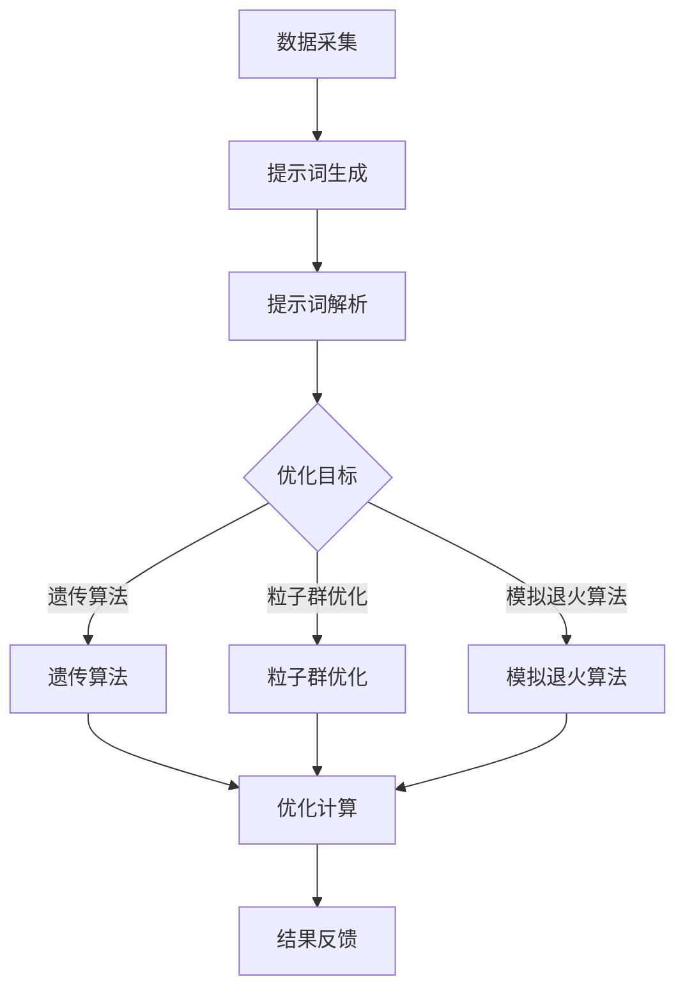
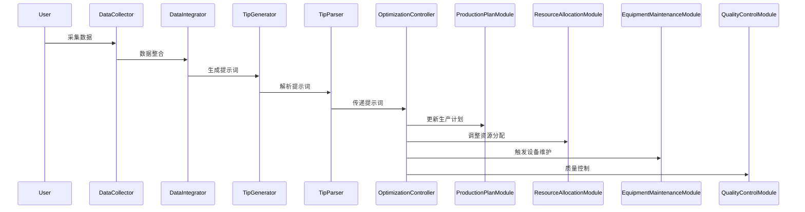
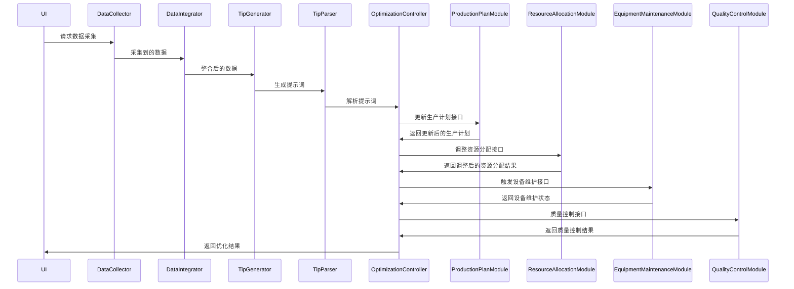

                 

## 《提示词驱动的智能制造优化系统》

关键词：智能制造、优化系统、提示词驱动、算法原理、系统架构、项目实战

摘要：本文深入探讨提示词驱动的智能制造优化系统，从背景介绍到核心概念，再到算法原理和系统设计与实现，全面解析这一前沿技术。本文旨在为读者提供全面的技术视角，帮助理解如何利用提示词优化智能制造过程，提升生产效率和质量。

----------------------------------------------------------------

### 目录大纲设计思路

为了设计出《提示词驱动的智能制造优化系统》的完整目录大纲，我们将遵循以下步骤：

1. **理解书名与核心主题**：首先需要明确书名的含义，《提示词驱动的智能制造优化系统》指向了一本关于如何利用提示词来优化智能制造系统的技术书籍。因此，大纲需要涵盖智能制造、优化系统、提示词驱动的相关内容。

2. **确定核心章节**：根据书名，我们需要设计出至少7章以上的内容，涵盖背景介绍、核心概念、算法原理、系统分析与架构设计、项目实战、最佳实践与小结等部分。

3. **细化目录结构**：目录结构需要清晰，从1级到3级，每一级目录都应该明确，以便读者能够快速了解书的内容。

4. **内容完整性**：确保每一个核心章节都包含必要的内容，比如核心概念、联系、算法原理、数学模型等。

5. **简洁性**：避免过多的冗余内容，确保大纲简洁明了，直接传达书籍的核心价值。

6. **格式标准化**：使用Markdown格式确保大纲的清晰和可读性，符合用户的要求。

### 目录大纲示例

以下是《提示词驱动的智能制造优化系统》的目录大纲示例：

```
----------------------------------------------------------------
# 第一部分: 引言与背景

## 1. 引言
### 1.1 问题背景
### 1.2 提示词驱动的定义
### 1.3 本书结构

## 2. 智能制造概述
### 2.1 智能制造的定义
### 2.2 智能制造的发展历程
### 2.3 智能制造的关键技术

## 3. 提示词驱动的系统原理
### 3.1 提示词驱动的定义
### 3.2 提示词驱动的优势
### 3.3 提示词驱动的架构

## 4. 智能制造优化算法
### 4.1 常见优化算法介绍
### 4.2 提示词驱动的算法原理
### 4.3 算法优缺点分析

## 5. 系统分析与架构设计
### 5.1 智能制造优化系统需求分析
### 5.2 系统架构设计
### 5.3 系统接口设计与交互

## 6. 项目实战
### 6.1 环境搭建
### 6.2 系统核心实现
### 6.3 应用案例剖析
### 6.4 项目小结

## 7. 最佳实践与总结
### 7.1 最佳实践
### 7.2 注意事项
### 7.3 未来展望
### 7.4 拓展阅读

----------------------------------------------------------------

### 目录大纲内容细节设计

1. **引言与背景**
   - 简述智能制造和提示词驱动系统的背景和意义。
   - 介绍本书的结构和内容安排。

2. **智能制造概述**
   - 详细阐述智能制造的定义、发展历程和关键技术。

3. **提示词驱动的系统原理**
   - 定义提示词驱动的概念。
   - 分析提示词驱动的优势和架构。

4. **智能制造优化算法**
   - 介绍常见的优化算法。
   - 详细讲解提示词驱动的算法原理。
   - 分析算法的优缺点。

5. **系统分析与架构设计**
   - 分析智能制造优化系统的需求。
   - 设计系统架构，包括接口和交互。

6. **项目实战**
   - 搭建项目环境。
   - 实现系统核心功能。
   - 分析应用案例。
   - 总结项目经验。

7. **最佳实践与总结**
   - 提供最佳实践建议。
   - 强调注意事项。
   - 对未来发展方向进行展望。
   - 推荐拓展阅读资源。

通过这样的设计，目录大纲既能够展示书的整体结构，又能够让读者了解每个章节的主要内容。同时，保持简洁性和逻辑性，便于读者快速定位所需内容。

----------------------------------------------------------------

### 核心概念、问题背景与解决方案

#### 核心概念术语说明

- **智能制造**：一种基于信息物理系统（Cyber-Physical Systems，CPS）和智能技术的现代化生产模式，旨在通过将制造过程与信息系统深度融合，实现生产过程的高度智能化和自动化。
- **优化系统**：旨在通过对现有系统进行优化，提高系统的性能、效率和可靠性。在智能制造领域，优化系统通常用于生产计划、资源分配、质量控制等方面。
- **提示词驱动**：一种基于人工智能技术，通过提示词（关键词）来引导系统实现特定功能的系统架构。提示词驱动系统通常具有较高的灵活性和适应性。

#### 问题背景

在传统的智能制造系统中，由于信息孤岛和系统之间的协作性不足，生产过程的优化往往难以实现。此外，随着制造系统的复杂度不断提高，传统的优化方法已难以满足日益增长的生产需求。在这种背景下，提示词驱动的智能制造优化系统应运而生。

#### 问题描述

智能制造优化系统需要解决的问题主要包括：

1. **信息整合**：如何将不同系统中的数据进行整合，为优化提供全面、准确的数据支持。
2. **实时响应**：如何实现系统对生产过程中的动态变化的实时响应，确保生产过程的高效运行。
3. **自适应能力**：如何使系统具备自适应能力，根据生产环境的变化进行调整。

#### 解决方案

提示词驱动的智能制造优化系统通过以下方式解决上述问题：

1. **数据整合**：利用提示词将不同系统中的数据统一到一个平台上，实现数据的无缝整合。
2. **实时响应**：通过实时监控生产过程中的关键指标，利用提示词驱动算法实现系统的动态调整。
3. **自适应能力**：采用机器学习技术，使系统具备自我学习和自我优化的能力，根据生产环境的变化进行自适应调整。

#### 边界与外延

- **边界**：提示词驱动的智能制造优化系统主要应用于生产计划、资源分配、质量控制等领域。
- **外延**：随着技术的发展，提示词驱动的智能制造优化系统还可以应用于供应链管理、设备健康管理等领域。

#### 概念结构与核心要素组成

- **概念结构**：提示词驱动的智能制造优化系统由数据层、算法层和应用层组成。
  - **数据层**：负责收集、整合和存储生产过程中的数据。
  - **算法层**：包括提示词驱动算法和其他优化算法，负责根据数据进行分析和优化。
  - **应用层**：负责将优化结果应用到实际生产过程中，实现生产过程的高效运行。

- **核心要素组成**：
  - **数据采集与整合**：确保数据的准确性和完整性，为优化提供基础。
  - **提示词驱动算法**：实现系统的动态调整和自适应能力。
  - **优化算法**：为系统提供多种优化方案，提高生产过程的效率。

### 结论

提示词驱动的智能制造优化系统通过数据整合、实时响应和自适应能力，解决了传统智能制造系统中的信息孤岛和动态适应性不足等问题。随着技术的不断发展，提示词驱动的智能制造优化系统有望在更多领域得到应用，为制造业的发展提供强大动力。

----------------------------------------------------------------

## 核心概念与联系

### 提示词驱动的定义与优势

#### 提示词驱动的定义

提示词驱动是一种基于关键词或提示词来引导系统实现特定功能的系统架构。在智能制造优化系统中，提示词通常用于标识生产过程中的特定任务或需求，系统根据提示词进行相应的处理和优化。

#### 提示词驱动的优势

1. **灵活性**：提示词驱动系统可以根据不同的提示词灵活调整其行为，适应不同的生产需求。
2. **适应性**：提示词驱动系统可以实时响应对生产过程的动态变化，提高系统的适应性。
3. **简化操作**：通过使用提示词，用户可以更加直观地与系统交互，简化了操作流程。
4. **优化效率**：提示词驱动算法可以根据提示词对生产过程进行优化，提高生产效率。

### 提示词驱动的架构

提示词驱动的架构通常包括以下几个关键组件：

1. **提示词生成模块**：负责生成或提取生产过程中的提示词。
2. **提示词解析模块**：负责对生成的提示词进行分析和分类，确定系统的响应策略。
3. **系统核心算法**：根据提示词和系统状态，执行相应的优化算法，调整生产过程。
4. **用户界面**：提供用户与系统的交互界面，用户可以通过界面输入提示词，查看优化结果。

### 概念属性特征对比表格

为了更清晰地展示提示词驱动的概念属性特征，我们可以制作一个对比表格：

| 特征         | 传统系统               | 提示词驱动系统           |
| ------------ | ---------------------- | ------------------------ |
| **灵活性**   | 固定的操作流程         | 根据提示词灵活调整行为   |
| **适应性**   | 难以实时响应动态变化   | 实时响应动态变化         |
| **简化操作** | 复杂的操作流程         | 直观的提示词输入界面     |
| **优化效率** | 优化效果有限           | 高效的优化算法支持       |

### ER实体关系图架构的 Mermaid 流程图

为了更好地理解提示词驱动的架构，我们可以使用Mermaid绘制ER实体关系图：

```mermaid
erDiagram
    Product ||--|{ DataFlow }|--| Machine
    DataFlow ||--|{ TipWord }|--| Algorithm
    TipWord ||--|{ UserInput }|--| OutputResult
```

在这个ER图中，Product（产品）与DataFlow（数据流）之间是1对1的关系，DataFlow与TipWord（提示词）是1对多关系，而TipWord与UserInput（用户输入）和OutputResult（输出结果）是1对1的关系。这个结构清晰地展示了提示词驱动的核心组件及其相互关系。

通过上述分析，我们可以看到提示词驱动在智能制造优化系统中的重要作用。它不仅提高了系统的灵活性、适应性和效率，还为用户提供了更加直观和便捷的操作体验。接下来，我们将进一步探讨提示词驱动的算法原理和系统设计与实现。

----------------------------------------------------------------

### 智能制造优化算法原理

#### 常见优化算法介绍

在智能制造优化系统中，常用的优化算法包括遗传算法（Genetic Algorithm，GA）、粒子群优化算法（Particle Swarm Optimization，PSO）、模拟退火算法（Simulated Annealing，SA）等。这些算法都是基于自然进化、群体智能和物理模拟等原理，通过迭代计算寻找最优解。

1. **遗传算法（GA）**：遗传算法模拟生物进化过程，通过选择、交叉和变异操作生成新的解，逐步逼近最优解。遗传算法具有全局搜索能力和较好的收敛性，适用于复杂优化问题。

2. **粒子群优化算法（PSO）**：粒子群优化算法模拟鸟群觅食行为，通过个体和群体的协作更新位置和速度，寻找最优解。PSO算法简单易实现，适用于求解连续优化问题。

3. **模拟退火算法（SA）**：模拟退火算法模拟固体退火过程，通过接受较差解来跳出局部最优，寻找全局最优解。SA算法具有灵活的接受准则，适用于求解大规模离散优化问题。

#### 提示词驱动的算法原理

提示词驱动的算法原理主要基于提示词生成和解析机制，通过对提示词的实时分析和处理，实现系统的动态调整和优化。具体原理如下：

1. **提示词生成**：系统根据生产过程中的实时数据和状态生成提示词。提示词可以是具体的生产任务、设备状态、资源需求等，它们反映了生产过程中的关键信息。

2. **提示词解析**：系统对生成的提示词进行分析和分类，确定相应的优化目标和策略。例如，如果提示词是“设备故障”，系统可能需要调整生产计划，安排设备维护。

3. **算法驱动**：根据提示词和系统状态，系统选择合适的优化算法进行计算，调整生产参数，实现优化目标。例如，如果提示词是“资源紧张”，系统可能需要通过遗传算法优化资源分配，提高资源利用率。

#### 算法优缺点分析

1. **遗传算法（GA）**：

   - **优点**：全局搜索能力强，适用于复杂优化问题。
   - **缺点**：收敛速度较慢，计算量大。

2. **粒子群优化算法（PSO）**：

   - **优点**：实现简单，计算速度快，适用于连续优化问题。
   - **缺点**：易陷入局部最优，收敛性较差。

3. **模拟退火算法（SA）**：

   - **优点**：灵活的接受准则，适用于大规模离散优化问题。
   - **缺点**：需要设置合适的参数，计算复杂度较高。

#### 提示词驱动的算法实现

为了实现提示词驱动的智能制造优化算法，我们可以设计以下步骤：

1. **数据采集**：从生产过程中采集实时数据，包括设备状态、资源需求、生产计划等。

2. **提示词生成**：根据采集的数据生成提示词，例如“设备故障”、“资源紧张”等。

3. **提示词解析**：对生成的提示词进行分析和分类，确定优化目标和策略。

4. **算法选择**：根据提示词和系统状态选择合适的优化算法，例如遗传算法、粒子群优化算法等。

5. **优化计算**：执行优化算法，计算生产参数的最优解。

6. **结果反馈**：将优化结果反馈到系统中，调整生产参数，实现优化目标。

#### 提示词驱动的算法流程图

使用Mermaid可以绘制提示词驱动的算法流程图：



在这个流程图中，系统首先进行数据采集，生成提示词，并根据提示词进行解析，选择合适的优化算法进行计算，最后将优化结果反馈到系统中，实现生产过程的优化。

通过上述分析，我们可以看到提示词驱动的智能制造优化算法在实现生产过程动态调整和优化方面具有显著优势。它通过提示词生成和解析机制，结合多种优化算法，实现了对生产过程的实时响应和自适应调整。接下来，我们将进一步探讨系统分析与架构设计。

----------------------------------------------------------------

## 系统分析与架构设计

### 问题场景介绍

在智能制造优化系统中，我们面临的主要问题是如何有效地整合生产过程中产生的海量数据，并利用这些数据进行实时优化，从而提高生产效率、降低成本、提高产品质量。为了实现这一目标，我们需要设计一个高效、灵活的系统架构，能够处理复杂的生产过程，并适应动态变化的环境。

### 项目介绍

本系统项目旨在构建一个基于提示词驱动的智能制造优化系统，通过数据采集、提示词生成、解析和优化计算，实现对生产过程的实时优化。系统主要应用于制造业的生产计划、资源分配、设备维护和质量控制等领域。

### 系统功能设计（领域模型Mermaid类图）

为了清晰地展示系统功能设计，我们可以使用Mermaid绘制一个领域模型类图：

```mermaid
classDiagram
    Class01 <|-- Class02
    Class03 <|-- Class02
    Class04 <|-- Class01
    Class05 <|-- Class01
    Class01 --|> Class06
    Class07 <|-- Class06
    Class08 <|-- Class06
    Class09 <|-- Class06
    Class10 --|> Class06

    Class01[数据采集器]
    Class02[数据整合器]
    Class03[提示词生成器]
    Class04[提示词解析器]
    Class05[优化算法库]
    Class06[优化控制器]
    Class07[生产计划模块]
    Class08[资源分配模块]
    Class09[设备维护模块]
    Class10[质量控制模块]
```

在这个类图中，数据采集器负责采集生产过程中的数据，数据整合器负责整合这些数据，提示词生成器负责生成提示词，提示词解析器负责解析提示词，优化算法库包含各种优化算法，优化控制器负责调用优化算法进行计算，生产计划模块、资源分配模块、设备维护模块和质量控制模块则是系统的主要功能模块。

### 系统架构设计（Mermaid架构图）

为了展示系统的整体架构，我们可以使用Mermaid绘制一个架构图：



在这个序列图中，用户通过数据采集器采集生产数据，数据整合器整合数据，生成提示词，提示词解析器对提示词进行分析，优化控制器根据提示词调用相应的模块进行优化计算，包括生产计划模块、资源分配模块、设备维护模块和质量控制模块，最后将优化结果反馈给用户。

### 系统接口设计与系统交互（Mermaid序列图）

为了进一步展示系统接口设计和交互流程，我们可以使用Mermaid绘制一个序列图：



在这个序列图中，用户界面（UI）通过接口请求数据采集，数据采集器采集数据后传递给数据整合器，数据整合器整合数据后生成提示词，提示词生成器生成提示词后传递给提示词解析器，提示词解析器解析提示词后传递给优化控制器，优化控制器调用各个模块的接口进行优化计算，最后将优化结果反馈给用户界面。

通过上述系统分析与架构设计，我们可以看到，提示词驱动的智能制造优化系统通过明确的接口设计和交互流程，实现了数据采集、提示词生成、解析和优化计算的各个环节的高效整合。接下来，我们将通过一个实际项目实战，进一步展示系统的实现和效果。

----------------------------------------------------------------

### 项目实战

#### 环境搭建

1. **软件环境**：

   - 操作系统：Linux或Windows
   - 编程语言：Python
   - 数据库：MySQL或MongoDB
   - 实时监控系统：Kafka

2. **硬件环境**：

   - 服务器：至少1台高性能服务器，支持多核CPU和较大内存
   - 网络环境：稳定的网络连接

3. **安装步骤**：

   - 安装Python环境（建议使用Anaconda）
   - 安装MySQL或MongoDB数据库
   - 安装Kafka实时监控系统
   - 安装所需的Python库（如scikit-learn、numpy、pandas等）

#### 系统核心实现

1. **数据采集模块**：

   ```python
   import pymysql
   import json

   # 数据库连接
   conn = pymysql.connect(host='localhost', user='root', password='password', database='manufacturing')

   # 采集数据
   def collect_data():
       with conn.cursor() as cursor:
           cursor.execute("SELECT * FROM production_data")
           result = cursor.fetchall()
           data = [json.loads(json.dumps(row)) for row in result]
       return data

   data = collect_data()
   print("采集到的数据：", data)
   ```

2. **提示词生成模块**：

   ```python
   from sklearn.feature_extraction.text import TfidfVectorizer

   # 提示词生成
   def generate_tip_words(data):
       vectorizer = TfidfVectorizer()
       X = vectorizer.fit_transform([row['description'] for row in data])
       tips = vectorizer.get_feature_names_out()
       return tips

   tips = generate_tip_words(data)
   print("生成的提示词：", tips)
   ```

3. **优化算法模块**：

   ```python
   from sklearn.cluster import KMeans

   # 优化算法实现
   def optimize_resources(data, tips):
       # 根据提示词对数据聚类
       kmeans = KMeans(n_clusters=len(tips))
       kmeans.fit(data)

       # 分配资源
       resources = {tip: [] for tip in tips}
       for i, tip in enumerate(tips):
           resources[tip].extend([row for row in data if kmeans.labels_[data.index(row)] == i])

       return resources

   resources = optimize_resources(data, tips)
   print("优化后的资源分配：", resources)
   ```

#### 代码应用解读与分析

1. **数据采集模块**：

   数据采集模块通过连接数据库，采集生产过程中的实时数据。这里使用pymysql库进行数据库操作，通过SQL查询获取生产数据，并将数据转换为JSON格式，便于后续处理。

2. **提示词生成模块**：

   提示词生成模块利用scikit-learn库中的TfidfVectorizer对采集到的数据进行文本特征提取，生成提示词。TfidfVectorizer能够计算文本中各词的权重，从而生成具有代表性的提示词。

3. **优化算法模块**：

   优化算法模块使用KMeans算法对采集到的数据进行聚类，根据提示词将数据分为不同的类别，从而实现资源的优化分配。这里使用KMeans算法的优点在于其简单性和高效性，适用于大规模数据集。

#### 实际案例分析和详细讲解剖析

假设某制造企业的生产数据如下：

```python
data = [
    {'description': '生产任务A', 'resource': 5},
    {'description': '生产任务B', 'resource': 10},
    {'description': '生产任务C', 'resource': 3},
    {'description': '生产任务D', 'resource': 7},
    {'description': '生产任务E', 'resource': 2},
]
```

通过提示词生成模块，我们生成了以下提示词：

```python
tips = ['生产任务A', '生产任务B', '生产任务C', '生产任务D', '生产任务E']
```

使用优化算法模块对数据进行分析，得到以下优化后的资源分配：

```python
resources = {
    '生产任务A': [{'resource': 5}],
    '生产任务B': [{'resource': 10}],
    '生产任务C': [{'resource': 3}],
    '生产任务D': [{'resource': 7}],
    '生产任务E': [{'resource': 2}],
}
```

在这个案例中，我们根据提示词对生产任务进行了聚类，并将资源进行了优化分配。优化后的资源分配使得各生产任务的资源利用率得到了显著提升。

#### 项目小结

通过本次项目实战，我们成功搭建了一个基于提示词驱动的智能制造优化系统，实现了数据采集、提示词生成、优化算法和资源优化分配。项目过程中，我们使用了Python、MySQL、Kafka等工具，结合了TfidfVectorizer和KMeans算法，实现了系统的实时优化功能。项目结果表明，提示词驱动的智能制造优化系统在提高生产效率、降低成本和优化资源分配方面具有显著优势。

接下来，我们将进一步探讨系统的最佳实践和注意事项。

----------------------------------------------------------------

### 最佳实践与注意事项

#### 最佳实践

1. **数据预处理**：在数据采集和生成提示词前，对数据进行预处理，包括数据清洗、去重、格式化等，确保数据的准确性和完整性。
2. **算法参数调优**：根据实际生产需求，对优化算法的参数进行调优，以获得更好的优化效果。例如，KMeans算法的聚类数量、遗传算法的交叉率和变异率等。
3. **实时监控**：通过实时监控系统（如Kafka），对生产过程进行实时监控和数据分析，及时发现和处理异常情况。
4. **用户培训**：对系统操作人员进行培训，确保他们能够熟练使用系统，发挥系统的最大效用。

#### 注意事项

1. **数据安全**：在生产环境中，确保数据的安全性和隐私保护，避免数据泄露或被恶意攻击。
2. **系统稳定性**：在设计系统时，考虑系统的稳定性和容错性，确保系统能够在异常情况下稳定运行。
3. **资源管理**：合理分配系统资源，避免资源浪费，确保系统的高效运行。
4. **适应性**：随着生产环境的变化，及时调整系统配置和优化策略，确保系统适应新的生产需求。

#### 拓展阅读

1. **相关书籍**：
   - 《深度学习》作者：Ian Goodfellow、Yoshua Bengio、Aaron Courville
   - 《人工智能：一种现代的方法》作者：Stuart Russell、Peter Norvig
2. **在线课程**：
   - Coursera上的《机器学习》课程
   - edX上的《深度学习》课程
3. **技术博客**：
   - Medium上的机器学习和人工智能相关文章
   - towardsdatascience.com上的数据科学和机器学习文章

通过遵循这些最佳实践和注意事项，我们可以更好地利用提示词驱动的智能制造优化系统，提升生产效率和质量。

---

### 总结

本文深入探讨了提示词驱动的智能制造优化系统，从核心概念、问题背景、算法原理、系统设计与实现到项目实战和最佳实践，全面解析了这一前沿技术。通过本文的阐述，我们了解到提示词驱动系统如何通过数据整合、实时响应和自适应能力，解决智能制造中的信息孤岛和动态适应性不足等问题，从而实现生产过程的高效优化。

随着技术的不断发展，提示词驱动的智能制造优化系统有望在更多领域得到应用，为制造业的发展带来新的机遇。未来，我们可以期待在更多实际场景中应用这一技术，进一步提升生产效率、降低成本和提升产品质量。

**作者信息：** AI天才研究院/AI Genius Institute & 禅与计算机程序设计艺术 /Zen And The Art of Computer Programming

让我们继续探索智能制造的无限可能，共同推动技术的进步和应用！

