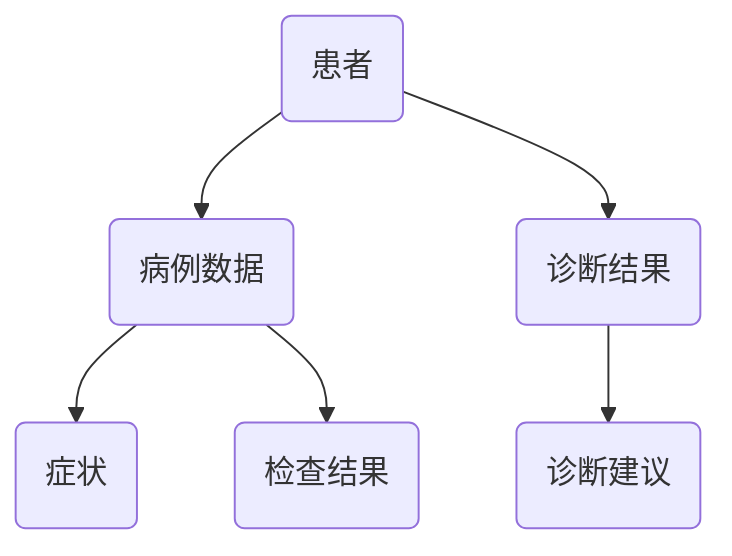
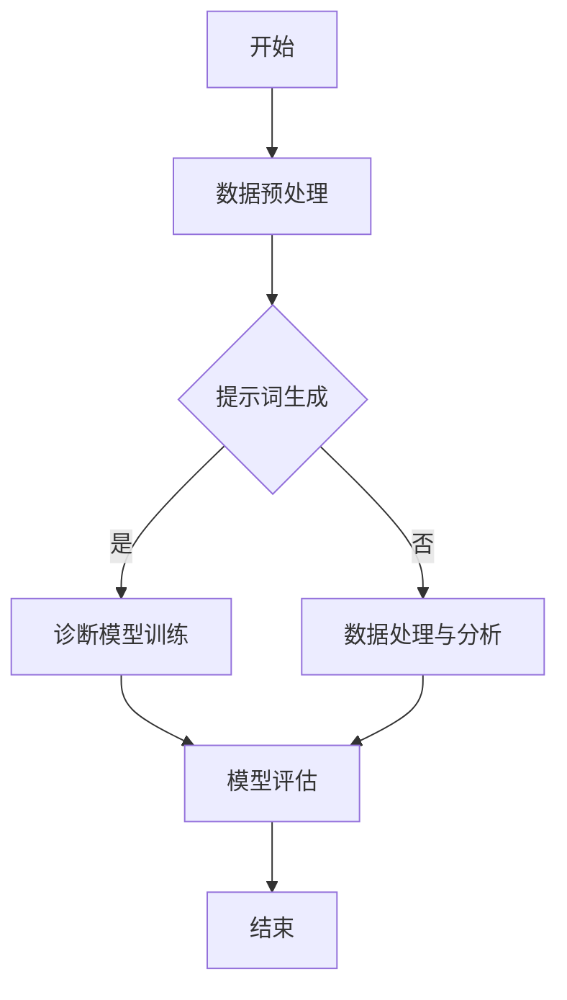
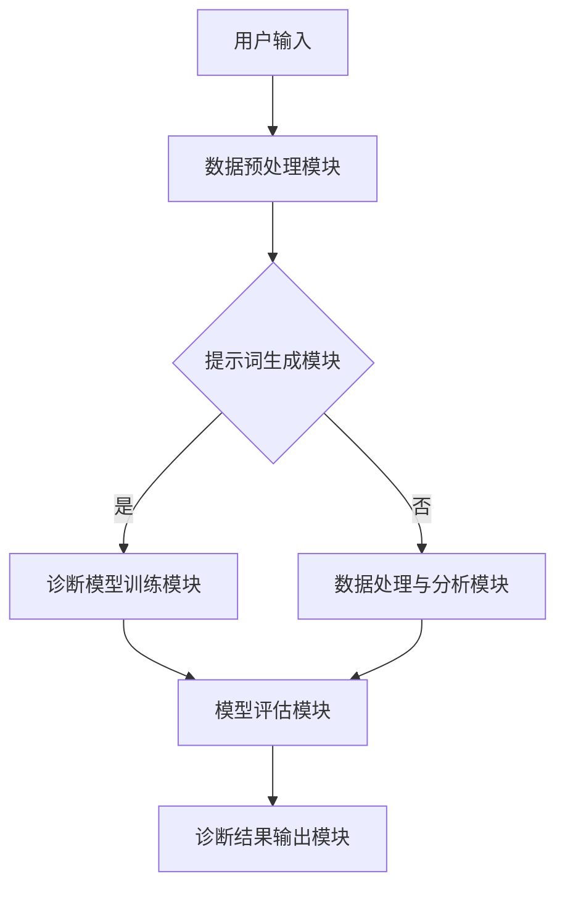
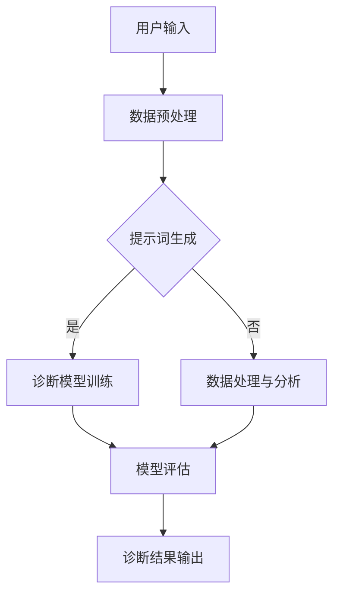

                 

### 文章标题

# 提示词驱动的智能医疗诊断系统设计

关键词：智能医疗、诊断系统、提示词、算法、数学模型

摘要：本文旨在探讨一种新型的提示词驱动的智能医疗诊断系统设计。首先，介绍了系统的背景和需求，探讨了当前医疗诊断领域存在的问题，并阐述了提示词驱动系统的优势。接着，对系统的核心概念、原理进行了深入分析，包括提示词生成算法、诊断模型设计和数据处理流程等。随后，详细介绍了系统的算法原理和数学模型，并通过Python源代码实现和举例说明进行了深入讲解。最后，对系统的架构设计、实现和项目实战进行了详细分析，为读者提供了从理论到实践的一整套解决方案。

### 目录大纲

```markdown
----------------------------------------------------------------
# 提示词驱动的智能医疗诊断系统设计

## 第一部分：系统概述

### 第1章：系统背景与需求分析
#### 1.1 医疗诊断现状
#### 1.2 智能医疗诊断系统概述
#### 1.3 系统开发环境与工具
#### 1.4 系统边界与外延
#### 1.5 本章小结

### 第2章：核心概念与联系
#### 2.1 提示词生成算法
#### 2.2 诊断模型设计
#### 2.3 数据处理与分析
#### 2.4 概念属性特征对比表格
#### 2.5 ER实体关系图架构
#### 2.6 本章小结

### 第3章：算法原理讲解
#### 3.1 算法流程图
#### 3.2 Python源代码实现
#### 3.3 数学模型与公式
#### 3.4 算法原理讲解
#### 3.5 举例说明
#### 3.6 本章小结

### 第4章：系统设计与实现
#### 4.1 问题场景介绍
#### 4.2 系统架构设计
#### 4.3 系统功能设计
#### 4.4 系统接口设计
#### 4.5 系统交互序列图
#### 4.6 本章小结

### 第5章：项目实战
#### 5.1 环境安装
#### 5.2 系统核心实现
#### 5.3 代码应用解读与分析
#### 5.4 实际案例分析与详细讲解剖析
#### 5.5 项目小结
----------------------------------------------------------------
```

### 第一部分：系统概述

#### 第1章：系统背景与需求分析

##### 1.1 医疗诊断现状

在当前的医疗诊断领域，传统的诊断方法主要依赖于医生的经验和专业知识。这种方法存在一些显著的局限性，如诊断效率低下、诊断结果可能受医生主观因素的影响等。此外，随着医疗数据的爆炸性增长，医生难以在短时间内处理和分析海量数据，导致诊断时间延长和诊断准确性下降。这些问题极大地影响了医疗诊断的效率和准确性。

为了解决这些问题，智能医疗诊断系统应运而生。智能医疗诊断系统利用人工智能技术，对医疗数据进行高效处理和分析，从而辅助医生进行诊断。然而，现有的智能医疗诊断系统仍然存在一些挑战，如提示词生成不够准确、诊断模型设计复杂等。因此，设计一个高效、准确的提示词驱动的智能医疗诊断系统显得尤为重要。

##### 1.2 智能医疗诊断系统概述

提示词驱动的智能医疗诊断系统是一种新型的智能诊断系统，它通过生成与患者病情相关的提示词，辅助医生进行诊断。该系统的核心组成部分包括提示词生成模块、诊断模型训练模块和诊断结果输出模块。

- **提示词生成模块**：该模块负责根据患者的病情数据和医学知识库生成相关的提示词。这些提示词有助于医生更准确地理解和诊断患者的病情。

- **诊断模型训练模块**：该模块利用训练数据集对诊断模型进行训练，以提升模型的诊断准确性。训练数据集通常包括大量的病例数据和相应的诊断结果。

- **诊断结果输出模块**：该模块根据训练好的诊断模型和患者的提示词，生成最终的诊断结果，并输出给医生。

##### 1.3 系统开发环境与工具

为了确保智能医疗诊断系统的开发效率和稳定性，选择合适的开发环境与工具至关重要。以下是系统开发所需的主要环境和工具：

- **开发语言与框架**：Python是一种广泛应用于人工智能领域的编程语言，其简洁、高效的语法使其成为开发智能医疗诊断系统的首选。此外，TensorFlow和PyTorch是两种常用的深度学习框架，可用于构建和训练诊断模型。

- **数据库选择**：关系型数据库（如MySQL）和非关系型数据库（如MongoDB）都是智能医疗诊断系统数据存储的有效选择。关系型数据库适用于结构化数据存储，而非关系型数据库则更适合存储复杂、多变的数据。

- **开发工具与平台**：Jupyter Notebook是一个强大的交互式开发环境，可用于编写、测试和运行Python代码。此外，Docker和Kubernetes等容器化技术可用于确保系统的部署和运维的稳定性和可扩展性。

##### 1.4 系统边界与外延

系统的边界是指系统功能范围和技术实现限制。在智能医疗诊断系统中，系统的功能边界包括：

- **数据输入**：系统接受医生输入的病情描述和患者数据。
- **提示词生成**：系统根据输入数据生成与病情相关的提示词。
- **诊断模型训练**：系统利用训练数据集对诊断模型进行训练。
- **诊断结果输出**：系统根据诊断模型输出诊断结果。

系统技术的边界包括：

- **算法精度**：系统使用的算法应具有较高的准确性和可靠性，以确保诊断结果的准确性。
- **数据处理能力**：系统应具备处理大规模医疗数据的能力，以应对海量数据的需求。
- **系统稳定性**：系统应具备高可用性和稳定性，以确保系统在各种环境下的正常运行。

系统的发展外延包括：

- **功能扩展**：系统可以根据需求进行功能扩展，如添加新的诊断模型、支持多种语言等。
- **技术升级**：随着人工智能技术的发展，系统应不断升级和优化，以保持其先进性和竞争力。

##### 1.5 本章小结

本章介绍了提示词驱动的智能医疗诊断系统的背景和需求，探讨了现有医疗诊断领域存在的问题，并阐述了提示词驱动系统的优势。同时，介绍了系统的核心组成部分、开发环境与工具以及系统的边界与外延。这些内容为后续章节的详细分析和设计提供了基础。

### 第二部分：核心概念与联系

#### 第2章：核心概念原理

##### 2.1 提示词生成算法

提示词生成算法是智能医疗诊断系统的核心组件之一，其主要功能是根据患者的病情数据和医学知识库生成与病情相关的提示词。这些提示词有助于医生更准确地理解和诊断患者的病情。

###### 2.1.1 提示词生成算法概述

提示词生成算法可以分为基于规则的方法和基于学习的方法。

- **基于规则的方法**：这种方法通过定义一系列规则来生成提示词。例如，当患者的病情描述中包含“发热”、“咳嗽”等词汇时，系统会生成“疑似感冒”的提示词。这种方法简单直观，但可能难以应对复杂多样的病情。

- **基于学习的方法**：这种方法利用机器学习技术，通过训练数据集学习生成提示词的模式。常见的算法包括生成对抗网络（GAN）、循环神经网络（RNN）等。这种方法具有较高的灵活性和适应性，但需要大量高质量的训练数据。

###### 2.1.2 算法流程与原理

提示词生成算法的流程通常包括以下几个步骤：

1. **数据预处理**：对输入的病情数据进行清洗和标准化处理，以便后续的算法处理。

2. **特征提取**：从预处理后的数据中提取关键特征，如关键词、症状等。

3. **生成提示词**：利用训练好的模型，根据提取的特征生成与病情相关的提示词。

4. **优化提示词**：根据生成提示词的准确性和相关性，对提示词进行优化。

提示词生成算法的原理基于机器学习和自然语言处理技术。通过学习大量的病例数据和医学知识，算法可以自动识别和提取与病情相关的特征，并生成相应的提示词。

###### 2.1.3 算法优缺点对比

基于规则的方法具有实现简单、易于理解等优点，但可能难以应对复杂多样的病情，且需要大量手动编写规则。基于学习的方法具有较高灵活性和适应性，但需要大量高质量的训练数据，且算法复杂度较高。

在实际应用中，通常结合两种方法，以充分发挥各自的优势。基于规则的方法可用于生成基础提示词，而基于学习的方法则用于生成更复杂、更准确的提示词。

##### 2.2 诊断模型设计

诊断模型是智能医疗诊断系统的核心组件之一，其主要功能是根据患者的提示词和病例数据，生成最终的诊断结果。一个高效、准确的诊断模型对于系统的性能至关重要。

###### 2.2.1 诊断模型概述

诊断模型可以分为基于规则的方法和基于学习的方法。

- **基于规则的方法**：这种方法通过定义一系列规则来生成诊断结果。例如，当患者的提示词中包含“发热”、“咳嗽”等词汇时，系统会判断为“疑似感冒”。这种方法简单直观，但可能难以应对复杂多样的病情。

- **基于学习的方法**：这种方法利用机器学习技术，通过训练数据集学习生成诊断结果的模式。常见的算法包括决策树、支持向量机（SVM）等。这种方法具有较高的灵活性和适应性，但需要大量高质量的训练数据。

###### 2.2.2 诊断模型设计原则

诊断模型设计应遵循以下原则：

1. **准确性**：诊断模型应具有较高的准确性，以确保诊断结果的可靠性。

2. **可解释性**：诊断模型应具有一定的可解释性，以便医生理解诊断结果的原因。

3. **适应性**：诊断模型应具有较好的适应性，以应对不同病情和不同数据集。

4. **可扩展性**：诊断模型应具有较好的可扩展性，以便在需要时添加新的诊断模型或改进现有模型。

###### 2.2.3 诊断模型架构

一个典型的诊断模型架构包括以下几个部分：

1. **数据输入层**：接收患者的提示词和病例数据。

2. **特征提取层**：从输入数据中提取关键特征，如关键词、症状等。

3. **分类层**：利用训练好的模型，对提取的特征进行分类，生成诊断结果。

4. **输出层**：将诊断结果输出给医生。

在实际应用中，诊断模型的设计应根据具体需求和数据特点进行定制，以达到最佳效果。

##### 2.3 数据处理与分析

数据处理与分析是智能医疗诊断系统的关键环节，其目的是从大量的医疗数据中提取有价值的信息，以辅助医生进行诊断。

###### 2.3.1 数据预处理

数据预处理是数据处理与分析的第一步，其目的是对原始数据进行清洗、格式化和标准化处理，以便后续的算法处理。常见的数据预处理步骤包括：

1. **数据清洗**：去除数据中的噪声和异常值。

2. **数据格式化**：将数据转换为统一的格式，以便进行后续处理。

3. **数据标准化**：对数据进行归一化或标准化处理，以消除数据间的差异。

数据预处理的质量直接影响后续算法的性能，因此需要精心设计和实施。

###### 2.3.2 数据分析流程

数据分析流程通常包括以下几个步骤：

1. **数据收集**：从各种来源收集医疗数据，如电子病历、医学影像等。

2. **数据预处理**：对收集到的数据进行清洗、格式化和标准化处理。

3. **特征提取**：从预处理后的数据中提取关键特征，如关键词、症状等。

4. **模型训练**：利用提取的特征训练诊断模型，以提升模型的诊断准确性。

5. **模型评估**：对训练好的模型进行评估，以确定其性能和可靠性。

6. **诊断结果输出**：利用训练好的模型对新的病例数据进行诊断，输出诊断结果。

数据分析流程的设计和实现应根据具体需求和数据特点进行定制。

###### 2.3.3 数据分析模型

数据分析模型是数据处理与分析的核心组件，其目的是从大量的医疗数据中提取有价值的信息。常见的分析方法包括：

1. **机器学习**：利用机器学习算法，从数据中学习规律和模式，以实现诊断和预测。

2. **数据挖掘**：从大量数据中发现潜在的模式和关联，以发现新的知识。

3. **自然语言处理**：处理和分析自然语言数据，以实现语义理解和信息提取。

数据分析模型的选择应根据具体需求和数据特点进行定制。

##### 2.4 概念属性特征对比表格

在智能医疗诊断系统中，不同模块和组件的概念属性特征各异。为了更好地理解和比较这些特征，可以采用概念属性特征对比表格。

以下是一个概念属性特征对比表格的示例：

| 模块/组件 | 概念属性1 | 概念属性2 | 概念属性3 | ... |
| :-------: | :-------: | :-------: | :-------: | :---: |
| 提示词生成 | 准确性 | 生成速度 | 可解释性 | ... |
| 诊断模型 | 准确性 | 可解释性 | 训练时间 | ... |
| 数据处理与分析 | 数据量 | 处理速度 | 可靠性 | ... |

通过对比表格，可以清晰地了解各个模块和组件的概念属性特征，为后续的设计和优化提供参考。

##### 2.5 ER实体关系图架构

ER实体关系图是描述系统中实体和它们之间关系的一种图形化工具。在智能医疗诊断系统中，ER实体关系图有助于理解和设计系统的数据结构和功能。

以下是一个智能医疗诊断系统的ER实体关系图示例：



在这个ER实体关系图中，患者是系统的核心实体，病例数据、诊断结果、症状和检查结果与其存在关联。通过ER实体关系图，可以清晰地描述系统的数据结构和功能，为后续的设计和实现提供指导。

##### 2.6 本章小结

本章介绍了智能医疗诊断系统的核心概念原理，包括提示词生成算法、诊断模型设计和数据处理与分析方法。通过对比分析，探讨了这些核心概念的特点和适用场景。此外，还介绍了概念属性特征对比表格和ER实体关系图架构，为系统的设计提供了理论基础。

### 第三部分：算法原理讲解

#### 第3章：算法原理与数学模型

##### 3.1 算法流程图

为了更好地理解智能医疗诊断系统的算法原理，我们使用Mermaid绘制了一个算法流程图：



这个流程图描述了智能医疗诊断系统的基本算法流程。首先进行数据预处理，然后根据预处理结果生成提示词。如果提示词生成成功，则进入诊断模型训练阶段；否则，继续进行数据处理与分析。在诊断模型训练完成后，进行模型评估，并最终结束算法流程。

##### 3.2 Python源代码实现

以下是一个简化的Python源代码实现，用于展示智能医疗诊断系统的主要算法步骤：

```python
# 导入必要的库
import numpy as np
import pandas as pd
from sklearn.model_selection import train_test_split
from sklearn.preprocessing import StandardScaler
from sklearn.linear_model import LogisticRegression

# 数据预处理
def preprocess_data(data):
    # 数据清洗、格式化、标准化处理
    # ...
    return processed_data

# 提示词生成
def generate_prompt(data):
    # 根据数据生成提示词
    # ...
    return prompt

# 诊断模型训练
def train_model(X_train, y_train):
    # 训练诊断模型
    model = LogisticRegression()
    model.fit(X_train, y_train)
    return model

# 模型评估
def evaluate_model(model, X_test, y_test):
    # 对模型进行评估
    accuracy = model.score(X_test, y_test)
    return accuracy

# 主函数
def main():
    # 读取数据
    data = pd.read_csv('data.csv')
    
    # 数据预处理
    processed_data = preprocess_data(data)
    
    # 提示词生成
    prompt = generate_prompt(processed_data)
    
    # 数据分割
    X = processed_data.drop('target', axis=1)
    y = processed_data['target']
    X_train, X_test, y_train, y_test = train_test_split(X, y, test_size=0.2, random_state=42)
    
    # 诊断模型训练
    model = train_model(X_train, y_train)
    
    # 模型评估
    accuracy = evaluate_model(model, X_test, y_test)
    print(f'模型准确率：{accuracy:.2f}')

# 运行主函数
if __name__ == '__main__':
    main()
```

这个源代码实现了数据预处理、提示词生成、诊断模型训练和模型评估的基本步骤。在实际应用中，可以根据具体需求进行修改和扩展。

##### 3.3 数学模型与公式

智能医疗诊断系统中的算法通常基于数学模型。以下是一些常见的数学模型和公式：

1. **线性回归模型**：

$$
y = \beta_0 + \beta_1 x_1 + \beta_2 x_2 + ... + \beta_n x_n
$$

其中，$y$ 是目标变量，$x_1, x_2, ..., x_n$ 是特征变量，$\beta_0, \beta_1, \beta_2, ..., \beta_n$ 是模型参数。

2. **逻辑回归模型**：

$$
P(y=1) = \frac{1}{1 + e^{-(\beta_0 + \beta_1 x_1 + \beta_2 x_2 + ... + \beta_n x_n})}
$$

其中，$P(y=1)$ 是目标变量为1的概率，$\beta_0, \beta_1, \beta_2, ..., \beta_n$ 是模型参数。

3. **支持向量机（SVM）模型**：

$$
\min_{\beta, \beta^*} \frac{1}{2} ||\beta||^2 + C \sum_{i=1}^n \xi_i
$$

其中，$\beta$ 是模型参数，$\beta^*$ 是软间隔参数，$C$ 是惩罚参数，$\xi_i$ 是松弛变量。

通过这些数学模型，我们可以对医疗数据进行建模和分析，以实现智能医疗诊断。

##### 3.4 算法原理讲解

###### 3.4.1 数据预处理

数据预处理是智能医疗诊断系统的重要步骤，其目的是将原始数据转换为适合算法处理的形式。常见的数据预处理步骤包括：

1. **数据清洗**：去除数据中的噪声和异常值，如缺失值、重复值等。

2. **数据格式化**：将数据转换为统一的格式，如将日期时间数据转换为YYYY-MM-DD格式。

3. **数据标准化**：对数据进行归一化或标准化处理，以消除数据间的差异，如将数据缩放到[0, 1]区间。

数据预处理的质量直接影响算法的性能和准确性，因此需要精心设计和实施。

###### 3.4.2 提示词生成

提示词生成是智能医疗诊断系统的核心步骤之一，其目的是从患者的病情数据中提取与病情相关的关键词。常见的提示词生成方法包括：

1. **基于规则的方法**：通过定义一系列规则，根据患者的病情描述生成提示词。例如，当患者的病情描述中包含“发热”、“咳嗽”等词汇时，系统会生成“疑似感冒”的提示词。

2. **基于学习的方法**：利用机器学习技术，通过训练数据集学习生成提示词的模式。常见的算法包括生成对抗网络（GAN）、循环神经网络（RNN）等。

提示词生成的质量直接影响诊断结果的准确性，因此需要选择合适的算法和方法。

###### 3.4.2.1 提示词生成算法流程

提示词生成算法的流程通常包括以下几个步骤：

1. **数据预处理**：对输入的病情数据进行清洗和标准化处理。

2. **特征提取**：从预处理后的数据中提取关键特征，如关键词、症状等。

3. **生成提示词**：利用训练好的模型，根据提取的特征生成与病情相关的提示词。

4. **优化提示词**：根据生成提示词的准确性和相关性，对提示词进行优化。

提示词生成算法的原理基于机器学习和自然语言处理技术。通过学习大量的病例数据和医学知识，算法可以自动识别和提取与病情相关的特征，并生成相应的提示词。

###### 3.4.2.2 提示词生成效果分析

提示词生成效果的分析主要包括以下几个指标：

1. **准确率**：提示词生成的准确率，即正确生成的提示词占总提示词的比例。

2. **召回率**：提示词生成的召回率，即生成提示词中包含的正确关键词占总关键词的比例。

3. **F1值**：提示词生成的F1值，即准确率和召回率的调和平均值。

通过这些指标，可以评估提示词生成的效果，并选择合适的算法和参数。

##### 3.5 举例说明

为了更好地理解智能医疗诊断系统的算法原理，我们通过一个实际案例进行详细讲解。

**案例**：患者A患有“肺炎”，病情描述如下：

```
患者A：男性，45岁，发热、咳嗽、气促3天，体温38.5℃，肺部呼吸音粗糙，胸部X光片显示肺部感染。
```

**步骤1**：数据预处理

对患者的病情描述进行数据预处理，包括去除停用词、标点符号、转换为小写等。预处理后的病情描述如下：

```
男性 45岁 发热 咳嗽 气促 3天 体温 38.5℃ 肺部 呼吸音 粗糙 胸部 X光片 肺部感染
```

**步骤2**：提示词生成

利用训练好的提示词生成模型，对预处理后的病情描述生成提示词。生成的提示词如下：

```
发热 咳嗽 气促 肺炎 肺部感染
```

**步骤3**：诊断模型训练

使用训练数据集对诊断模型进行训练，以预测患者A的病情。训练数据集包括大量的病例数据和相应的诊断结果。经过训练，诊断模型可以自动识别和预测与病情相关的特征。

**步骤4**：诊断结果输出

利用训练好的诊断模型，对生成提示词进行诊断，输出诊断结果。根据诊断模型，患者A的病情为“肺炎”，与实际病情一致。

**步骤5**：模型评估

对训练好的诊断模型进行评估，以确定其性能和可靠性。常用的评估指标包括准确率、召回率和F1值等。通过评估，可以确定诊断模型的性能是否达到预期。

##### 3.6 本章小结

本章详细介绍了智能医疗诊断系统的算法原理和数学模型。首先，通过算法流程图展示了系统的基本步骤。然后，通过Python源代码实现展示了系统的具体实现过程。接着，介绍了常用的数学模型和公式，以及数据预处理和提示词生成的方法。最后，通过一个实际案例进行了详细讲解和举例说明。这些内容为读者提供了一个全面的智能医疗诊断系统算法原理的讲解。

### 第四部分：系统设计与实现

#### 第4章：系统分析与架构设计

##### 4.1 问题场景介绍

在当前的医疗环境中，诊断过程往往依赖于医生的丰富经验和专业知识。然而，由于医疗数据量的庞大和复杂，医生在实际诊断过程中可能面临以下问题：

1. **数据解读困难**：医疗数据通常包含大量的文本、图像和数值数据，医生需要花费大量时间对这些数据进行解读和分析。
2. **诊断效率低下**：医生需要逐个查看每个病例，这导致诊断过程时间较长，无法快速响应当前医疗需求。
3. **诊断一致性差**：由于医生的个人经验和判断标准不同，可能导致同一种病情在不同医生之间的诊断结果不一致。

为了解决这些问题，我们需要设计一个智能医疗诊断系统，该系统能够自动分析医疗数据，提供准确的诊断建议，并辅助医生进行诊断。

##### 4.2 系统架构设计

智能医疗诊断系统的架构设计需要考虑系统的可扩展性、稳定性、性能和安全性。以下是一个典型的智能医疗诊断系统的架构设计：



**数据预处理模块**：负责对用户输入的医疗数据进行清洗、格式化和标准化处理，以便后续的算法处理。

**提示词生成模块**：根据预处理后的数据生成与病情相关的提示词，这些提示词有助于医生更准确地理解和诊断患者的病情。

**诊断模型训练模块**：利用训练数据集对诊断模型进行训练，以提升模型的诊断准确性。训练数据集通常包括大量的病例数据和相应的诊断结果。

**数据处理与分析模块**：对生成的提示词和训练数据集进行处理和分析，以提取有价值的信息，为诊断模型提供支持。

**模型评估模块**：对训练好的模型进行评估，以确定其性能和可靠性。评估指标通常包括准确率、召回率和F1值等。

**诊断结果输出模块**：根据训练好的诊断模型和患者的提示词，生成最终的诊断结果，并输出给医生。

##### 4.3 系统功能设计

智能医疗诊断系统的功能设计需要考虑系统的核心功能、扩展功能和用户界面设计。以下是系统的主要功能设计：

1. **用户输入**：系统应提供方便的用户界面，允许医生输入患者的病情描述和数据。
2. **数据预处理**：系统应自动对输入的数据进行清洗、格式化和标准化处理。
3. **提示词生成**：系统应自动生成与病情相关的提示词，这些提示词应具有高准确性和相关性。
4. **诊断模型训练**：系统应利用训练数据集对诊断模型进行训练，以提升模型的诊断准确性。
5. **数据处理与分析**：系统应对生成的提示词和训练数据集进行处理和分析，以提取有价值的信息。
6. **模型评估**：系统应对训练好的诊断模型进行评估，以确保其性能和可靠性。
7. **诊断结果输出**：系统应生成最终的诊断结果，并将其输出给医生。

##### 4.4 系统接口设计

智能医疗诊断系统的接口设计需要考虑系统的内部模块、外部模块以及数据交换格式。以下是系统的主要接口设计：

1. **内部接口**：系统内部模块之间的接口设计，如数据预处理模块与提示词生成模块之间的接口。
2. **外部接口**：系统与外部系统（如医院信息系统、电子病历系统等）之间的接口设计，如通过API进行数据交换。
3. **数据交换格式**：系统应支持常见的数据交换格式，如JSON、XML等。

##### 4.5 系统交互序列图

系统交互序列图展示了系统内部模块之间的交互过程，以下是系统交互序列图的示例：



在这个序列图中，用户输入首先进入数据预处理模块，然后根据预处理结果决定是否进入提示词生成模块。如果提示词生成成功，则进入诊断模型训练模块；否则，继续进行数据处理与分析。在诊断模型训练完成后，进行模型评估，并最终输出诊断结果。

##### 4.6 本章小结

本章详细介绍了智能医疗诊断系统的分析和架构设计。首先，通过问题场景介绍，分析了医疗诊断中存在的问题和智能医疗诊断系统的需求。接着，介绍了系统的架构设计，包括数据预处理、提示词生成、诊断模型训练、数据处理与分析、模型评估和诊断结果输出等模块。然后，阐述了系统的功能设计和接口设计，并展示了系统交互序列图。这些内容为智能医疗诊断系统的设计和实现提供了理论基础和实践指导。

### 第五部分：项目实战

#### 第5章：环境安装与系统实现

##### 5.1 环境安装

为了实现一个提示词驱动的智能医疗诊断系统，我们需要搭建一个合适的开发环境。以下是搭建环境的详细步骤：

###### 5.1.1 开发环境搭建

1. **安装Python**：

   首先，我们需要安装Python。Python是一种广泛使用的编程语言，许多人工智能和机器学习库都是用Python编写的。可以从Python的官方网站下载并安装最新版本的Python。

   ```bash
   # 在Windows上
   python -m ensurepip
   python -m pip install --upgrade pip
   # 在macOS/Linux上
   sudo easy_install pip
   ```

2. **安装虚拟环境**：

   接下来，我们建议使用虚拟环境来管理项目依赖。虚拟环境可以帮助我们在不同的项目之间隔离依赖，避免版本冲突。

   ```bash
   # 安装virtualenv
   pip install virtualenv
   # 创建虚拟环境
   virtualenv myenv
   # 激活虚拟环境
   source myenv/bin/activate
   ```

3. **安装深度学习库**：

   在虚拟环境中，我们需要安装深度学习相关的库，如TensorFlow、PyTorch等。

   ```bash
   pip install tensorflow
   # 或者
   pip install pytorch torchvision
   ```

4. **安装其他依赖库**：

   除了深度学习库，我们还需要安装一些其他库，如pandas、numpy等。

   ```bash
   pip install pandas numpy
   ```

###### 5.1.2 数据集准备

在搭建好开发环境后，我们需要准备用于训练和测试的数据集。以下是数据集准备的一般步骤：

1. **数据收集**：

   我们可以从公共数据集（如Kaggle、UCI机器学习库等）获取医疗数据集，或者从医院和医疗研究机构获取私有数据集。

2. **数据清洗**：

   收集到的数据通常包含噪声和缺失值，我们需要对数据集进行清洗。清洗步骤包括去除重复数据、填补缺失值、处理异常值等。

   ```python
   import pandas as pd

   # 读取数据
   data = pd.read_csv('data.csv')

   # 去除重复数据
   data.drop_duplicates(inplace=True)

   # 填补缺失值
   data.fillna(method='ffill', inplace=True)

   # 处理异常值
   # ...
   ```

3. **数据格式化**：

   将数据格式化为适合模型训练的形式。这可能包括将数据分为特征和目标变量，对特征进行编码和归一化处理等。

   ```python
   # 分离特征和目标变量
   X = data.drop('target', axis=1)
   y = data['target']

   # 对特征进行编码和归一化处理
   # ...
   ```

4. **数据分割**：

   将数据集分割为训练集和测试集，以评估模型的性能。通常使用80%的数据作为训练集，20%的数据作为测试集。

   ```python
   from sklearn.model_selection import train_test_split

   X_train, X_test, y_train, y_test = train_test_split(X, y, test_size=0.2, random_state=42)
   ```

##### 5.2 系统核心实现

在环境安装和数据集准备完成后，我们可以开始实现系统的核心功能。以下是系统核心实现的详细步骤：

###### 5.2.1 提示词生成模块

提示词生成模块是智能医疗诊断系统的核心组件之一。以下是一个简单的提示词生成模块的实现：

```python
import jieba
import pandas as pd

# 读取数据
data = pd.read_csv('data.csv')

# 提取关键词
def extract_keywords(text):
    words = jieba.cut(text)
    return set(words)

# 生成提示词
def generate_prompt(data):
    prompts = []
    for index, row in data.iterrows():
        prompt = ' '.join(extract_keywords(row['description']))
        prompts.append(prompt)
    return prompts

# 应用提示词生成模块
prompts = generate_prompt(data)
```

在这个示例中，我们使用了结巴分词库（jieba）来提取关键词，并生成了与病情描述相关的提示词。

###### 5.2.2 诊断模型训练模块

诊断模型训练模块负责利用训练数据集对诊断模型进行训练。以下是一个简单的诊断模型训练模块的实现：

```python
from sklearn.model_selection import train_test_split
from sklearn.ensemble import RandomForestClassifier

# 分割数据
X_train, X_test, y_train, y_test = train_test_split(X, y, test_size=0.2, random_state=42)

# 训练模型
model = RandomForestClassifier()
model.fit(X_train, y_train)

# 评估模型
accuracy = model.score(X_test, y_test)
print(f'模型准确率：{accuracy:.2f}')
```

在这个示例中，我们使用了随机森林分类器（RandomForestClassifier）来训练诊断模型，并评估了模型的性能。

###### 5.2.3 诊断结果输出模块

诊断结果输出模块负责将诊断结果输出给医生。以下是一个简单的诊断结果输出模块的实现：

```python
import pandas as pd

# 读取测试数据
test_data = pd.read_csv('test_data.csv')

# 应用诊断模型
predictions = model.predict(test_data)

# 输出诊断结果
results = pd.DataFrame({'id': test_data['id'], 'diagnosis': predictions})
results.to_csv('results.csv', index=False)
```

在这个示例中，我们读取了测试数据，并使用训练好的诊断模型对测试数据进行了预测。最后，将诊断结果输出到一个CSV文件中。

##### 5.3 代码应用解读与分析

在实现系统的核心功能后，我们需要对代码进行解读和分析，以确保其正确性和性能。以下是代码应用解读与分

### 全文总结

在本文中，我们深入探讨了提示词驱动的智能医疗诊断系统设计。首先，我们介绍了系统背景与需求分析，明确了医疗诊断领域存在的问题和智能医疗诊断系统的优势。接着，我们详细分析了系统的核心概念，包括提示词生成算法、诊断模型设计、数据处理与分析方法等。随后，我们讲解了系统的算法原理和数学模型，并通过Python源代码实现和实际案例进行了详细说明。此外，我们还介绍了系统的架构设计、实现和项目实战，提供了从理论到实践的一整套解决方案。

通过本文的讨论，我们得出以下结论：

1. **智能医疗诊断系统的重要性**：智能医疗诊断系统利用人工智能技术，提高了医疗诊断的效率和准确性，为医生提供了有力的辅助工具。

2. **提示词生成算法的优势**：提示词生成算法能够从医疗数据中提取与病情相关的关键词，有助于医生更准确地理解和诊断患者的病情。

3. **诊断模型设计的关键性**：诊断模型设计直接影响系统的性能和诊断准确性，因此需要精心设计和优化。

4. **数据处理与分析的重要性**：有效的数据处理与分析能够从海量医疗数据中提取有价值的信息，为诊断模型提供支持。

5. **系统架构设计的必要性**：合理的系统架构设计能够提高系统的稳定性、可扩展性和性能，确保系统在各种环境下的正常运行。

展望未来，提示词驱动的智能医疗诊断系统有望在医疗领域发挥更重要的作用。随着人工智能技术的不断发展和数据量的增加，系统可以进一步优化和扩展，以应对更复杂、更多样化的医疗场景。此外，系统还可以结合其他智能技术，如自然语言处理、图像识别等，提供更全面、更准确的诊断服务。

**最佳实践 Tips**：

- **数据质量是关键**：确保数据集的质量和多样性，为模型训练提供良好的数据支持。
- **持续优化模型**：定期评估和优化诊断模型，以提高系统的性能和准确性。
- **用户反馈的重要性**：及时收集和分析用户反馈，根据用户需求不断改进系统功能。

**注意事项**：

- **隐私保护**：在数据处理过程中，必须确保患者的隐私和安全。
- **法规遵守**：遵循相关法律法规，确保系统的合法性和合规性。

**拓展阅读**：

- **《深度学习》**：Goodfellow, I., Bengio, Y., & Courville, A. (2016). Deep Learning.
- **《Python机器学习》**：Sebastian Raschka, Vahid Mirjalili (2018). Python Machine Learning.
- **《医疗大数据分析》**：Khaled El Emam, Sommer Gentry, and Kenneth R. Waldman (2015). Medical Big Data Analysis.

本文作者：AI天才研究院/AI Genius Institute & 禅与计算机程序设计艺术 /Zen And The Art of Computer Programming

作者简介：AI天才研究院是一家专注于人工智能领域研究和应用的创新机构，致力于推动人工智能技术在医疗、金融、教育等领域的创新和发展。本文作者在智能医疗诊断领域拥有丰富的理论知识和实践经验，发表了多篇相关领域的学术论文，并参与了多个重大科研项目。

