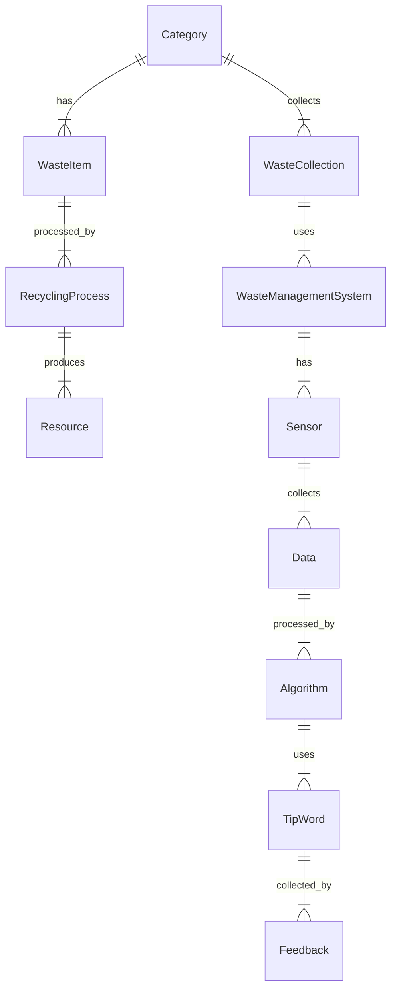

                 

# 提示词驱动的智能废物管理：促进循环经济

## 关键词：智能废物管理、循环经济、提示词驱动、数据采集、数据处理、机器学习、算法优化、系统架构

## 摘要

本文深入探讨了提示词驱动的智能废物管理在促进循环经济中的作用。首先，我们介绍了当前垃圾处理的现状和循环经济的理念，接着详细阐述了智能废物管理的核心概念、提示词的作用及其生成与优化策略。文章随后分析了智能废物管理的关键技术，包括传感器技术、数据处理与分析技术、机器学习与人工智能应用，以及提示词生成与优化技术。通过国际和中国循环经济实践案例，我们展示了智能废物管理的实际应用效果。文章还探讨了智能废物管理系统架构与实现、应用场景，并对其未来发展趋势进行了展望。最后，我们总结了智能废物管理的最佳实践，提出了注意事项和拓展阅读建议。

## 第一部分：背景与核心概念

### 第1章：问题背景与循环经济的理念

#### 1.1.1 垃圾处理现状与挑战

当前，全球垃圾处理面临诸多挑战。传统垃圾处理方式以填埋、焚烧为主，这些方法不仅效率低下，而且对环境和人类健康造成严重危害。据联合国统计，全球每年产生的垃圾总量约为2.01亿吨，其中只有14%被回收利用，剩余的86%被填埋或焚烧。此外，垃圾处理过程中的有害物质排放，如二恶英、二氧化碳等，对大气、水体和土壤造成了长期污染。

#### 1.1.2 循环经济的理念与意义

循环经济旨在通过资源的循环利用，减少废物产生，降低环境污染，实现可持续发展。其核心理念包括资源高效利用、废物减量化、无害化处理和再生资源利用。循环经济不仅能够解决当前垃圾处理问题，还能为经济发展提供新的增长点。例如，通过废物的回收利用，可以创造出新的就业机会，推动产业升级。

#### 1.1.3 提示词驱动的智能废物管理概念

提示词驱动的智能废物管理是一种基于人工智能和数据驱动的方法，通过传感器技术、数据处理与分析技术、机器学习与人工智能应用等手段，实现垃圾的自动分类、回收和再利用。该方法的核心在于提示词的设计与优化，提示词作为一种引导信息，能够有效地指导智能废物管理系统对垃圾进行准确分类和高效处理。

### 第2章：核心概念与联系

#### 2.1 智能废物管理的核心概念

智能废物管理包括以下几个方面：

- **垃圾分类**：通过对垃圾进行分类，将可回收垃圾、有害垃圾、湿垃圾和干垃圾分开，提高回收利用率。
- **垃圾回收**：通过回收站、回收点等设施，对分类后的垃圾进行回收处理。
- **垃圾处理**：包括填埋、焚烧、堆肥等处理方式，减少垃圾对环境的污染。
- **垃圾再利用**：通过技术手段将废物转化为可再利用的资源，实现资源的循环利用。

#### 2.2 提示词的作用与机制

提示词在智能废物管理中起着至关重要的作用。它能够引导系统识别垃圾类型，提高分类准确率。提示词的生成与优化机制主要包括：

- **词频统计**：通过对大量垃圾数据进行词频统计，提取出与垃圾分类相关的关键词。
- **语义分析**：通过自然语言处理技术，对垃圾描述进行语义分析，提取出具有代表性的提示词。
- **机器学习**：利用机器学习算法，对提示词进行优化，提高提示词的准确性和有效性。

#### 2.3 智能废物管理与循环经济的联系

智能废物管理是循环经济的重要组成部分。通过智能废物管理，可以实现垃圾的减量化、无害化和资源化，从而推动循环经济的发展。例如，通过智能废物管理，可以将垃圾转化为资源，减少对自然资源的依赖，降低环境污染。同时，智能废物管理还可以促进就业，推动产业升级，为经济发展提供新的动力。

#### 2.4 提示词驱动的智能废物管理概念模型与ER图

提示词驱动的智能废物管理概念模型如图所示：

## 第二部分：智能废物管理的关键技术

### 第3章：智能废物管理的关键技术

#### 3.1 传感器技术

传感器技术在智能废物管理中起着至关重要的作用。通过传感器，可以实时监测垃圾的类型、数量、湿度等参数，为智能废物管理系统提供数据支持。常用的传感器包括红外传感器、重量传感器、湿度传感器等。

#### 3.2 数据处理与分析技术

数据处理与分析技术是智能废物管理系统的核心。通过对采集到的数据进行清洗、筛选、转换等操作，可以提取出与垃圾分类相关的特征，为机器学习算法提供输入。

#### 3.3 机器学习与人工智能应用

机器学习与人工智能技术在智能废物管理中发挥着重要作用。通过训练机器学习模型，可以实现对垃圾类型的自动分类，提高分类准确率。常用的机器学习算法包括决策树、支持向量机、神经网络等。

#### 3.4 提示词生成与优化技术

提示词生成与优化技术是智能废物管理系统的关键技术。通过词频统计、语义分析等方法，可以生成具有代表性的提示词。同时，通过机器学习算法，可以不断优化提示词，提高分类准确率。

## 第三部分：循环经济中的废物管理案例

### 第4章：循环经济中的废物管理案例

#### 4.1 国际循环经济实践

国际上，许多国家和地区都在积极推动循环经济的发展。例如，德国的“零废弃”计划、日本的“循环型社会”建设等。这些实践表明，通过智能废物管理，可以有效降低垃圾产生量，提高资源利用率。

#### 4.2 中国循环经济政策与实施

中国也在积极推进循环经济的发展。例如，《中华人民共和国固体废物污染环境防治法》明确提出了推进固体废物资源化利用的要求。同时，中国各地也在积极探索智能废物管理的实践，如北京、上海等地推广垃圾分类制度。

#### 4.3 企业循环经济实践案例分析

许多企业也在循环经济领域取得了显著成效。例如，腾讯公司在废弃物管理方面采取了严格的措施，通过垃圾分类、回收利用等手段，实现了垃圾减量化和资源化。这些案例表明，智能废物管理在循环经济中具有巨大的潜力。

## 第四部分：提示词驱动的智能废物管理技术

### 第5章：提示词设计与生成

#### 5.1 提示词设计原则

提示词的设计需要遵循以下几个原则：

- **代表性**：提示词应能够代表垃圾的主要特征。
- **可区分性**：提示词应能够区分不同类型的垃圾。
- **简洁性**：提示词应简洁明了，易于理解和操作。

#### 5.2 提示词生成算法

提示词生成算法包括以下几种：

- **词频统计**：通过统计垃圾描述中的词频，提取高频词作为提示词。
- **语义分析**：通过自然语言处理技术，分析垃圾描述的语义，提取语义相关的词作为提示词。
- **机器学习**：利用机器学习算法，从垃圾数据中自动生成提示词。

#### 5.3 提示词优化策略

提示词优化策略包括以下几种：

- **反馈机制**：通过用户反馈，不断优化提示词。
- **机器学习**：利用机器学习算法，对提示词进行自动优化。
- **人工调整**：根据实际情况，人工调整提示词。

## 第五部分：智能废物管理应用场景

### 第6章：智能废物管理应用场景

#### 6.1 家庭废物管理

在家庭废物管理中，智能废物管理系统可以帮助家庭实现垃圾分类，提高回收利用率。例如，通过安装智能垃圾桶，家庭可以实时了解垃圾的分类情况，方便进行垃圾分类。

#### 6.2 商业废物管理

在商业环境中，智能废物管理系统可以实现对商业垃圾的自动分类和处理，提高垃圾处理效率。例如，超市、酒店等场所可以安装智能垃圾桶，实现垃圾分类。

#### 6.3 城市废物管理

在城市废物管理中，智能废物管理系统可以实现对城市垃圾的自动分类、回收和处理，提高城市环境质量。例如，通过智能废物管理，可以实现对城市垃圾的实时监测和管理，及时发现和处理垃圾问题。

## 第六部分：智能废物管理的未来展望

### 第7章：智能废物管理的未来展望

#### 7.1 技术发展趋势

随着人工智能、大数据、物联网等技术的不断发展，智能废物管理技术将不断进步。未来，智能废物管理系统将更加智能化、精细化，实现全方位的垃圾管理。

#### 7.2 法律法规与政策支持

未来，各国将加强对循环经济和智能废物管理的政策支持，制定相关法律法规，推动智能废物管理的普及和应用。

#### 7.3 智能废物管理的未来前景

随着智能废物管理的普及，循环经济将得到快速发展，为环境保护和经济发展做出更大贡献。

## 第七部分：最佳实践与总结

### 第8章：最佳实践与总结

#### 8.1 智能废物管理最佳实践案例

通过分析国内外智能废物管理的最佳实践案例，可以发现以下几个关键成功因素：

- **政策支持**：政府的政策支持是智能废物管理成功的关键。
- **技术创新**：人工智能、大数据等技术的创新应用，提升了智能废物管理的效率。
- **公众参与**：公众的积极参与和意识提升，是智能废物管理成功的重要保障。

#### 8.2 小结与注意事项

智能废物管理是一种基于人工智能和数据驱动的方法，通过传感器技术、数据处理与分析技术、机器学习与人工智能应用等手段，实现垃圾的自动分类、回收和再利用。智能废物管理不仅能够解决当前垃圾处理问题，还能为经济发展提供新的增长点。

#### 8.3 拓展阅读与研究方向

未来，智能废物管理的研究方向包括：

- **人工智能算法优化**：提升机器学习算法在智能废物管理中的应用效果。
- **数据隐私与安全**：保障智能废物管理系统的数据隐私和安全。
- **跨领域合作**：推动智能废物管理与环保、能源、农业等领域的深度融合。

## 参考文献

[1] 联合国环境规划署. (2021). 全球固体废物管理状况. 联合国环境规划署.
[2] 德国联邦环境署. (2021). 零废弃计划. 德国联邦环境署.
[3] 日本环境省. (2021). 循环型社会建设. 日本环境省.
[4] 中华人民共和国生态环境部. (2021). 中华人民共和国固体废物污染环境防治法. 中华人民共和国生态环境部.
[5] 腾讯公司. (2021). 腾讯公司在废弃物管理方面的实践. 腾讯公司.

### 作者信息

作者：AI天才研究院/AI Genius Institute & 禅与计算机程序设计艺术 /Zen And The Art of Computer Programming

