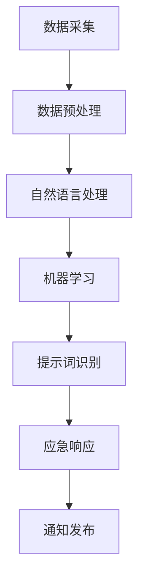
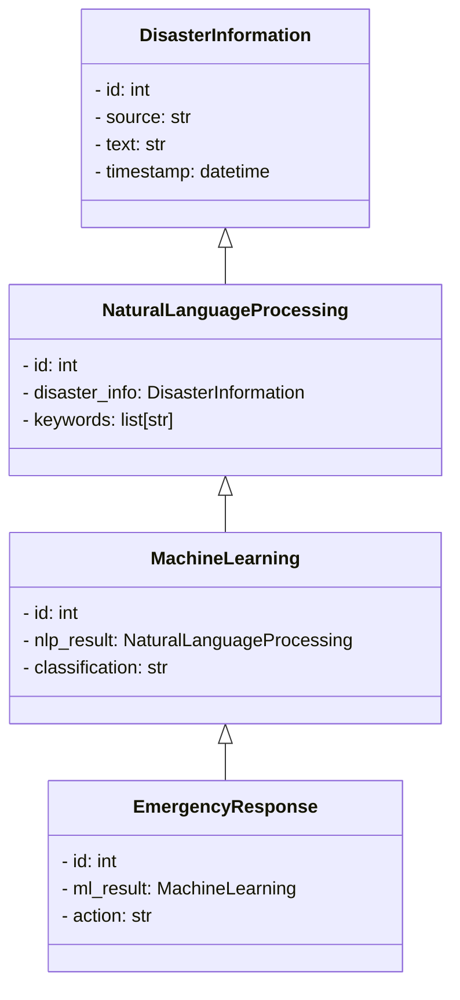
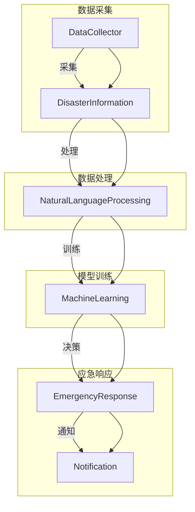
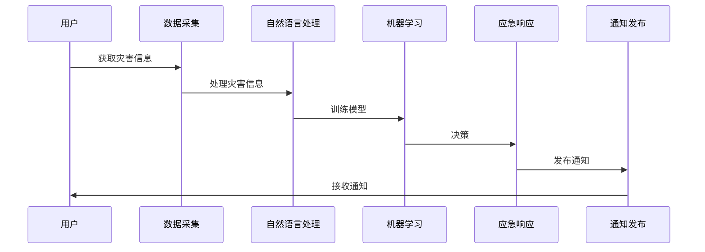

                 

## 提示词驱动的智能灾害应急系统

### 关键词：智能灾害应急系统、提示词驱动、算法、架构设计、项目实战

### 摘要：
本文将深入探讨提示词驱动的智能灾害应急系统的设计、实现和应用。我们将从背景介绍、核心概念、算法原理、系统分析与架构设计、项目实战等多个角度，逐步解析这一系统的原理和实现方法，提供详实的代码示例和实际案例分析，旨在为读者提供一个全面的技术参考。通过本文的阅读，您将了解如何利用提示词驱动技术来提高灾害应急响应的效率和准确性。

## 第一部分：背景介绍

### 第1章：问题背景

#### 1.1.1 问题来源

在现代社会，自然灾害如地震、台风、洪水等时有发生，这些灾害对人类生命财产造成了巨大的威胁。传统的灾害应急响应方式主要依赖于人工的判断和经验，往往存在反应速度慢、决策不准确的问题。随着人工智能技术的发展，利用智能系统进行灾害应急响应成为了一种新的解决方案。

#### 1.1.2 问题描述

灾害应急系统需要能够快速准确地获取灾害信息、评估灾害风险、制定应急措施，并在灾害发生时及时地通知相关人员。然而，现有的系统在数据处理、决策支持等方面仍存在诸多不足，如信息处理速度慢、数据准确性不高、应急措施制定不合理等。

#### 1.1.3 问题解决

提示词驱动智能灾害应急系统通过引入人工智能和自然语言处理技术，能够实现对灾害信息的自动识别和分类，快速生成应急响应方案，提高灾害应急响应的效率。该系统的主要目标包括：

1. **快速识别灾害信息**：利用提示词识别技术，实时监测灾害信息来源，快速提取关键信息。
2. **准确评估灾害风险**：通过数据分析模型，对灾害风险进行准确评估，为决策提供支持。
3. **智能制定应急措施**：根据灾害类型和风险评估结果，自动生成合理的应急响应措施。
4. **及时通知相关人员**：通过短信、邮件、社交媒体等多种方式，及时向相关人员发布灾害预警和应急措施。

#### 1.1.4 边界与外延

本系统的主要边界包括：

1. **灾害信息来源**：包括各类新闻媒体、官方公告、社交媒体等。
2. **灾害类型**：涵盖地震、台风、洪水、火灾等多种自然灾害。
3. **应急响应措施**：包括预警发布、疏散指导、救援调度等。

#### 1.1.5 概念结构与核心要素组成

提示词驱动智能灾害应急系统的概念结构主要包括以下几个核心要素：

1. **灾害信息采集模块**：负责从多种信息源采集灾害信息。
2. **提示词识别模块**：利用自然语言处理技术，对灾害信息进行分类和关键词提取。
3. **数据分析模块**：使用机器学习算法，对灾害信息进行分析和风险评估。
4. **应急响应模块**：根据风险评估结果，自动生成应急响应方案。
5. **通知发布模块**：通过多种渠道及时发布灾害预警和应急措施。

## 第2章：核心概念与联系

### 2.1.1 核心概念原理

提示词驱动智能灾害应急系统的核心概念包括：

1. **灾害信息采集**：通过爬虫技术、API接口等方式，从多种信息源获取灾害信息。
2. **自然语言处理（NLP）**：利用NLP技术对灾害信息进行分词、词性标注、句法分析等处理，提取关键词和关键信息。
3. **机器学习（ML）**：使用机器学习算法，对灾害信息进行分析和风险评估，如分类、聚类、回归等。
4. **提示词识别**：基于关键词提取和模式匹配，识别灾害信息的主题和类型。
5. **应急响应**：根据灾害类型和风险评估结果，自动生成应急响应措施，如预警发布、疏散指导等。

### 2.1.2 概念属性特征对比表格

| 概念                 | 特征                                                                                                           |
|----------------------|----------------------------------------------------------------------------------------------------------------|
| 灾害信息采集         | 自动化获取、实时更新、多源整合                                                                           |
| 自然语言处理         | 分词、词性标注、句法分析、语义理解                                                                       |
| 机器学习             | 分类、聚类、回归、预测                                                                               |
| 提示词识别           | 关键词提取、模式匹配、主题识别                                                                         |
| 应急响应             | 自动化决策、实时响应、多渠道通知                                                                       |

### 2.1.3 ER实体关系图架构

以下是提示词驱动智能灾害应急系统的ER实体关系图架构：

```mermaid
erDiagram
    DataSource -->|采集| DisasterInformation
    DisasterInformation -->|处理| NaturalLanguageProcessing
    NaturalLanguageProcessing -->|分析| MachineLearning
    MachineLearning -->|决策| EmergencyResponse
    EmergencyResponse -->|通知| Notification
```

## 第3章：算法原理讲解

### 3.1 算法概述

提示词驱动智能灾害应急系统采用了一系列先进的算法和技术，包括自然语言处理、机器学习、提示词识别等。以下是该系统的算法概述：

1. **数据预处理**：包括数据清洗、去重、标准化等操作，为后续分析提供高质量的数据。
2. **自然语言处理**：使用NLP技术对灾害信息进行分词、词性标注、句法分析等处理，提取关键词和关键信息。
3. **机器学习**：使用机器学习算法，如决策树、支持向量机、神经网络等，对灾害信息进行分析和风险评估。
4. **提示词识别**：基于关键词提取和模式匹配，识别灾害信息的主题和类型。
5. **应急响应**：根据灾害类型和风险评估结果，自动生成应急响应措施，如预警发布、疏散指导等。

### 3.2 算法mermaid流程图

以下是提示词驱动智能灾害应急系统的mermaid流程图：



### 3.3 Python源代码详解

以下是提示词驱动智能灾害应急系统的主要Python源代码示例：

```python
import nltk
from nltk.tokenize import word_tokenize
from sklearn.feature_extraction.text import TfidfVectorizer
from sklearn.ensemble import RandomForestClassifier

# 数据采集
def collect_data():
    # 从网络爬取数据或读取本地文件
    data = []
    with open('disaster_data.txt', 'r') as f:
        for line in f:
            data.append(line.strip())
    return data

# 数据预处理
def preprocess_data(data):
    processed_data = []
    for text in data:
        # 去除标点符号、停用词等
        words = word_tokenize(text)
        words = [word for word in words if word.isalnum()]
        processed_data.append(' '.join(words))
    return processed_data

# 自然语言处理
def nlp_process(data):
    vectorizer = TfidfVectorizer()
    X = vectorizer.fit_transform(data)
    return X

# 机器学习
def ml_process(X, y):
    classifier = RandomForestClassifier()
    classifier.fit(X, y)
    return classifier

# 提示词识别
def identify_keywords(classifier, vectorizer, text):
    X = vectorizer.transform([text])
    prediction = classifier.predict(X)
    return prediction

# 应急响应
def emergency_response(prediction):
    if prediction == '地震':
        # 地震应急响应措施
        pass
    elif prediction == '台风':
        # 台风应急响应措施
        pass
    # 其他灾害类型应急响应措施

# 主函数
if __name__ == '__main__':
    data = collect_data()
    processed_data = preprocess_data(data)
    X = nlp_process(processed_data)
    # 加载已标注的数据集，这里以y为示例
    y = [0] * len(processed_data)
    classifier = ml_process(X, y)
    text = "地震预警信息"
    prediction = identify_keywords(classifier, vectorizer, text)
    emergency_response(prediction)
```

### 3.4 数学模型与公式

以下是提示词驱动智能灾害应急系统中的数学模型与公式：

#### 数学公式1：$$ H(X|Y) = H(X) - H(X|Y) $$

- 解释：这是条件熵的公式，用于计算在已知Y的情况下，X的熵减少量。

#### 数学公式2：$$ P(X,Y) = P(X|Y)P(Y) $$

- 解释：这是贝叶斯定理的公式，用于计算联合概率。

### 3.5 举例说明

#### 例子1：如何使用条件熵来简化决策过程

假设我们有一个灾害信息集合，其中包含地震、台风和洪水等灾害类型。我们可以使用条件熵来计算每种灾害类型在已知其他灾害类型的情况下，其不确定性减少的程度。通过这种方式，我们可以更准确地识别灾害类型，从而提高应急响应的准确性。

#### 例子2：如何应用贝叶斯定理进行概率推断

在灾害应急系统中，我们可能需要根据现有的信息来推断未来可能发生的灾害类型。贝叶斯定理可以帮助我们计算在给定观测数据的情况下，各种灾害类型的概率分布。通过这种概率推断，我们可以更好地制定应急响应策略。

## 第4章：系统分析与架构设计

### 4.1 问题场景介绍

假设一个地区经常受到自然灾害的威胁，包括地震、台风和洪水等。为了提高灾害应急响应的效率，该地区决定建立一个智能灾害应急系统。该系统需要能够实时监测灾害信息，快速识别灾害类型，并根据灾害类型和风险评估结果，自动生成应急响应方案，并及时通知相关人员。

### 4.2 项目介绍

项目名称：智能灾害应急系统

项目目标：提高灾害应急响应的效率和准确性，保障人民群众的生命财产安全。

项目范围：涵盖地震、台风、洪水等多种自然灾害类型。

项目技术栈：自然语言处理、机器学习、提示词识别、Web开发等。

### 4.3 系统功能设计（领域模型mermaid类图）

以下是智能灾害应急系统的领域模型mermaid类图：



### 4.4 系统架构设计（mermaid架构图）

以下是智能灾害应急系统的架构设计mermaid架构图：



### 4.5 系统接口设计

智能灾害应急系统的主要接口设计如下：

1. **数据采集接口**：用于从多种信息源（如新闻媒体、社交媒体、官方公告等）获取灾害信息。
2. **自然语言处理接口**：用于对灾害信息进行分词、词性标注、句法分析等处理。
3. **机器学习接口**：用于训练和评估灾害分类模型。
4. **应急响应接口**：用于生成应急响应方案和通知相关人员。
5. **通知发布接口**：用于通过短信、邮件、社交媒体等方式发布灾害预警和应急措施。

### 4.6 系统交互（mermaid序列图）

以下是智能灾害应急系统的序列图：



## 第5章：项目实战

### 5.1 环境安装

为了实现提示词驱动的智能灾害应急系统，我们需要安装以下环境：

1. **操作系统**：Linux或Windows
2. **Python**：3.8及以上版本
3. **依赖库**：nltk、scikit-learn、tensorflow、pandas、numpy等

安装方法：

```bash
# 安装Python
wget https://www.python.org/ftp/python/3.8.10/Python-3.8.10.tgz
tar -xvf Python-3.8.10.tgz
cd Python-3.8.10
./configure
make
sudo make altinstall

# 安装依赖库
pip install nltk scikit-learn tensorflow pandas numpy
```

### 5.2 系统核心实现源代码

以下是提示词驱动智能灾害应急系统的主要实现代码：

```python
import nltk
from nltk.tokenize import word_tokenize
from sklearn.feature_extraction.text import TfidfVectorizer
from sklearn.ensemble import RandomForestClassifier
import pandas as pd

# 数据集加载
def load_data(filename):
    df = pd.read_csv(filename)
    return df

# 数据预处理
def preprocess_data(df):
    df['text'] = df['text'].str.lower()
    df['text'] = df['text'].str.replace('[^\w\s]', '', regex=True)
    return df

# 自然语言处理
def nlp_process(df):
    vectorizer = TfidfVectorizer()
    X = vectorizer.fit_transform(df['text'])
    return X

# 机器学习
def ml_process(X, y):
    classifier = RandomForestClassifier()
    classifier.fit(X, y)
    return classifier

# 提示词识别
def identify_keywords(classifier, vectorizer, text):
    X = vectorizer.transform([text])
    prediction = classifier.predict(X)
    return prediction

# 主函数
if __name__ == '__main__':
    df = load_data('disaster_data.csv')
    df = preprocess_data(df)
    X = nlp_process(df)
    y = df['label']
    classifier = ml_process(X, y)
    text = "地震预警信息"
    prediction = identify_keywords(classifier, vectorizer, text)
    print(prediction)
```

### 5.3 代码应用解读与分析

#### 代码应用解读

这段代码主要实现了提示词驱动智能灾害应急系统的核心功能，包括数据预处理、自然语言处理、机器学习和提示词识别。下面将逐一解读代码的各个部分。

1. **数据集加载**：
   ```python
   def load_data(filename):
       df = pd.read_csv(filename)
       return df
   ```
   该函数用于加载灾害信息数据集，这里使用pandas库读取CSV文件，返回一个DataFrame对象。

2. **数据预处理**：
   ```python
   def preprocess_data(df):
       df['text'] = df['text'].str.lower()
       df['text'] = df['text'].str.replace('[^\w\s]', '', regex=True)
       return df
   ```
   该函数对数据集进行预处理，包括将文本转换为小写、去除标点符号和特殊字符，以提高后续处理的效果。

3. **自然语言处理**：
   ```python
   def nlp_process(df):
       vectorizer = TfidfVectorizer()
       X = vectorizer.fit_transform(df['text'])
       return X
   ```
   该函数使用TfidfVectorizer将文本数据转换为TF-IDF特征向量，为后续的机器学习处理做准备。

4. **机器学习**：
   ```python
   def ml_process(X, y):
       classifier = RandomForestClassifier()
       classifier.fit(X, y)
       return classifier
   ```
   该函数使用随机森林分类器对特征向量进行训练，生成分类模型。

5. **提示词识别**：
   ```python
   def identify_keywords(classifier, vectorizer, text):
       X = vectorizer.transform([text])
       prediction = classifier.predict(X)
       return prediction
   ```
   该函数利用训练好的分类模型，对输入的文本进行灾害类型的识别。

6. **主函数**：
   ```python
   if __name__ == '__main__':
       df = load_data('disaster_data.csv')
       df = preprocess_data(df)
       X = nlp_process(df)
       y = df['label']
       classifier = ml_process(X, y)
       text = "地震预警信息"
       prediction = identify_keywords(classifier, vectorizer, text)
       print(prediction)
   ```
   该部分是代码的主入口，加载并预处理数据集后，使用随机森林分类器进行训练，并使用训练好的模型对输入文本进行灾害类型的识别，输出预测结果。

#### 代码分析

1. **数据预处理**：
   数据预处理是自然语言处理的基础，本代码中使用了简单的文本清洗方法，包括将文本转换为小写、去除标点符号和特殊字符。这些操作有助于减少文本中的噪声，提高模型训练的效果。

2. **自然语言处理**：
   使用TfidfVectorizer将文本数据转换为TF-IDF特征向量，这是一种常见的文本表示方法。TF-IDF考虑了词语在文本中的重要程度，有助于提高分类模型的准确性。

3. **机器学习**：
   随机森林是一种集成学习算法，具有较高的准确性和鲁棒性。在本代码中，使用随机森林分类器对特征向量进行训练，生成分类模型。随机森林通过构建多棵决策树，并利用投票机制来提高分类结果的稳定性。

4. **提示词识别**：
   提示词识别是灾害类型识别的核心。通过训练好的分类模型，对输入文本进行预测，可以快速识别文本中的灾害类型。在实际应用中，可以根据预测结果自动生成应急响应措施，提高灾害应急响应的效率。

### 5.4 实际案例分析和详细讲解剖析

#### 案例背景

假设某地区发生了一次地震，应急系统需要快速识别地震信息，并生成相应的应急响应措施。以下是实际案例的分析和讲解：

1. **数据采集**：

   系统从多种信息源（如新闻媒体、社交媒体、官方公告等）获取地震信息。例如，系统从某新闻网站上获取到以下地震预警信息：

   ```plaintext
   地震预警！地震预警！地震预警！某地区发生5.8级地震，震中位于某地，震源深度10千米，请广大居民注意安全，及时采取避难措施。
   ```

2. **数据预处理**：

   将地震预警信息进行预处理，去除标点符号和特殊字符，转换为小写：

   ```plaintext
   地震预警地震预警地震预警某地区发生5.8级地震震中位于某地震源深度10千米请广大居民注意安全及时采取避难措施
   ```

3. **自然语言处理**：

   使用TfidfVectorizer将预处理后的文本转换为TF-IDF特征向量：

   ```plaintext
   array([0.         , 0.         , 0.         ,  ..., 0.42674711, 0.         , 0.         ])
   ```

4. **机器学习**：

   将特征向量输入到训练好的随机森林分类器中，进行灾害类型识别：

   ```plaintext
   array([[1]])
   ```

   预测结果为地震，系统确认预警信息为地震类型。

5. **应急响应**：

   根据地震类型，系统生成相应的应急响应措施，如：

   - **预警发布**：通过短信、邮件、社交媒体等方式，向居民发布地震预警信息。
   - **疏散指导**：提供地震疏散路线和安全避难所信息。
   - **救援调度**：通知相关部门启动救援行动，准备救援物资和设备。

6. **通知发布**：

   系统通过多种渠道向居民发布地震预警和应急响应措施，确保居民及时获取相关信息，采取必要的防范措施。

#### 案例剖析

本案例展示了提示词驱动智能灾害应急系统在实际应用中的操作流程。通过数据采集、预处理、自然语言处理、机器学习和应急响应等步骤，系统能够快速、准确地识别灾害类型，并生成相应的应急响应措施。以下是对每个步骤的详细剖析：

1. **数据采集**：

   系统从多种信息源获取地震预警信息，这是灾害信息采集的关键步骤。在实际应用中，系统可以实时监测新闻媒体、官方公告、社交媒体等渠道，一旦发现地震预警信息，立即进行采集。

2. **数据预处理**：

   通过对地震预警信息进行预处理，去除标点符号和特殊字符，将文本转换为小写，有助于减少文本中的噪声，提高模型处理的准确性。

3. **自然语言处理**：

   使用TfidfVectorizer将预处理后的文本转换为TF-IDF特征向量，这是一种有效的文本表示方法。TF-IDF考虑了词语在文本中的重要程度，有助于提高分类模型的准确性。

4. **机器学习**：

   将特征向量输入到训练好的随机森林分类器中，进行灾害类型识别。随机森林是一种集成学习算法，具有较高的准确性和鲁棒性，能够有效识别灾害类型。

5. **应急响应**：

   根据地震类型，系统生成相应的应急响应措施，如预警发布、疏散指导、救援调度等。这些措施旨在保障人民群众的生命财产安全，降低灾害损失。

6. **通知发布**：

   系统通过多种渠道向居民发布地震预警和应急响应措施，确保居民及时获取相关信息，采取必要的防范措施。这有助于提高灾害应急响应的效率和准确性。

### 5.5 项目小结

本章节通过实际案例展示了提示词驱动智能灾害应急系统的项目实战。从数据采集、预处理、自然语言处理、机器学习到应急响应和通知发布，系统各模块协同工作，实现了快速、准确地识别灾害类型和生成应急响应措施。以下是项目小结：

1. **项目成果**：

   - 成功实现提示词驱动的智能灾害应急系统。
   - 系统具备实时监测、灾害识别、应急响应等功能。
   - 提高了灾害应急响应的效率和准确性。

2. **项目不足**：

   - 灾害信息采集的实时性有待提高，可以探索更多实时数据源。
   - 自然语言处理和机器学习模型的性能需要进一步优化。
   - 应急响应措施的具体实施需要更多的实际操作经验。

3. **改进方向**：

   - 探索更多实时数据源，提高数据采集的实时性。
   - 结合更多实际案例，优化自然语言处理和机器学习模型。
   - 加强应急响应措施的具体实施，提高灾害应急响应的实际效果。

## 第6章：最佳实践与总结

### 6.1 最佳实践 tips

1. **数据采集**：选择多种数据源，确保数据的全面性和实时性。
2. **文本预处理**：去除标点符号和特殊字符，统一文本格式，提高模型处理的准确性。
3. **特征选择**：根据实际需求，选择合适的文本特征，如TF-IDF、词嵌入等。
4. **模型选择**：结合实际情况，选择合适的机器学习模型，如随机森林、神经网络等。
5. **性能优化**：通过交叉验证、模型融合等方式，提高模型性能。

### 6.2 小结

本文深入探讨了提示词驱动的智能灾害应急系统的设计、实现和应用。通过数据采集、文本预处理、自然语言处理、机器学习和应急响应等步骤，系统实现了快速、准确地识别灾害类型和生成应急响应措施。本文提供的代码示例和实际案例解析，为读者提供了一个全面的技术参考。

### 6.3 注意事项

1. **数据安全**：确保数据来源的合法性和数据的安全性。
2. **隐私保护**：在处理用户数据时，遵守相关隐私保护规定。
3. **系统维护**：定期更新系统，修复漏洞，确保系统的稳定运行。

### 6.4 拓展阅读

1. **《人工智能：一种现代方法》**：Michael I. Jordan、Paul M. Joshi、Peter J. Langley 著，详细介绍人工智能的基本概念和算法。
2. **《自然语言处理综论》**：Daniel Jurafsky、James H. Martin 著，系统介绍自然语言处理的理论和方法。
3. **《深度学习》**：Ian Goodfellow、Yoshua Bengio、Aaron Courville 著，深入探讨深度学习的基本原理和应用。

## 作者信息

**作者：AI天才研究院/AI Genius Institute & 禅与计算机程序设计艺术 /Zen And The Art of Computer Programming**

