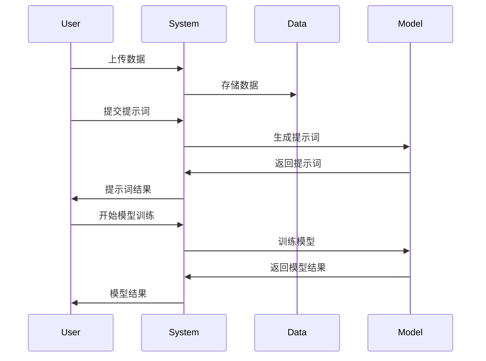

                 

### 第1章 问题背景与核心概念

#### 1.1 问题背景

科学研究的本质是探索未知，揭示自然规律，推动人类文明的进步。然而，随着科学领域的不断拓展，研究的复杂性也在不断增加。当前，科学研究面临的主要挑战包括：

- 数据量的激增：现代科学研究的产物是海量的数据，如何从这些数据中提取有价值的信息成为一大难题。
- 复杂性的增加：许多科学问题本身具有高度的复杂性，需要跨学科的知识和技能才能解决。
- 研究效率的低下：传统的研究方法往往依赖于经验、直觉和大量重复性劳动，效率较低。

针对这些挑战，科学家们一直在寻求新的研究方法和工具，以提高研究的效率和准确性。其中，提示词驱动的科学发现作为一种新兴的研究方法，逐渐引起了广泛关注。

#### 1.2 提示词驱动的科学发现

提示词驱动的科学发现是一种利用人工智能技术，通过分析已有数据和知识，生成关键提示词，进而引导科学研究的方向和方法。这种方法的核心理念在于：

- **数据驱动的推理**：通过分析大量的数据，提取有价值的信息，为研究提供新的视角和思路。
- **知识融合**：将不同领域和学科的知识进行整合，形成新的理论框架和研究方向。
- **自动化和智能化**：利用人工智能技术，实现研究过程的自动化和智能化，减少重复性劳动。

提示词驱动的科学发现不仅能够提高研究的效率，还能够提供新的研究方法和工具，帮助科学家们解决复杂的科学问题。

#### 1.3 数据分析的重要性

在提示词驱动的科学发现中，数据分析是至关重要的一环。数据分析包括数据的收集、清洗、预处理、特征提取、建模等多个环节。具体来说：

- **数据收集**：收集与研究主题相关的各种数据，包括实验数据、文献数据、观测数据等。
- **数据清洗**：去除数据中的噪声和异常值，确保数据的质量。
- **数据预处理**：对数据进行标准化、归一化等处理，使其适合后续的分析。
- **特征提取**：从数据中提取有用的特征，用于建模和分析。
- **建模**：利用机器学习和深度学习等技术，建立预测模型或分类模型。

通过这些步骤，数据分析能够帮助科学家们从大量的数据中提取有价值的信息，为科学研究提供有力的支持。

#### 1.4 研究效率与准确性

研究效率与准确性是科学家们追求的两个重要目标。提示词驱动的科学发现能够有效提高这两个方面的表现：

- **研究效率**：通过自动化和智能化的方法，减少了科学家在数据收集、预处理和分析等环节的重复性劳动，大大提高了研究效率。
- **研究准确性**：通过大数据分析和深度学习等技术，能够从海量数据中提取有价值的信息，提高研究的准确性。

总之，提示词驱动的科学发现作为一种新兴的研究方法，具有广阔的应用前景。它不仅能够提高研究的效率，还能够提供新的研究方法和工具，帮助科学家们解决复杂的科学问题。

#### 1.5 小结

在本章中，我们介绍了科学研究面临的挑战，以及提示词驱动的科学发现作为一种新兴研究方法的核心理念和重要性。接下来，我们将进一步探讨提示词驱动的科学发现中的核心概念和联系，以便更好地理解这一方法的工作原理和应用。

---

### 第2章 核心概念与联系

#### 2.1 核心概念原理

提示词驱动的科学发现涉及多个核心概念，其中最为关键的是提示词的生成与优化、数据的预处理与特征提取，以及模型的训练与优化。下面我们将逐一介绍这些核心概念及其原理。

#### 2.1.1 提示词的生成与优化

提示词是提示词驱动科学发现的起点和核心。它们是用于引导研究方向的短句或关键词，通常基于已有的知识和数据生成。提示词的生成和优化过程主要包括以下几个步骤：

1. **数据预处理**：在生成提示词之前，需要对数据进行分析和清洗，确保数据的质量。
2. **关键词提取**：从预处理后的数据中提取可能的关键词，这些关键词可以是名词、动词或形容词。
3. **提示词生成**：利用自然语言处理（NLP）技术，将提取的关键词组合成具有引导性的提示词。
4. **优化**：根据研究需求，对生成的提示词进行优化，以提高其准确性和适用性。

#### 2.1.2 数据的预处理与特征提取

数据是科学研究的基础，而数据预处理和特征提取是确保数据质量和有效利用的关键步骤。

- **数据预处理**：包括数据清洗、数据格式转换、数据归一化等，旨在消除数据中的噪声和异常值，确保数据的统一性和一致性。
- **特征提取**：从原始数据中提取对研究问题有重要意义的特征。特征提取可以是基于统计的，如主成分分析（PCA），也可以是机器学习算法的，如深度学习中的自动编码器。

#### 2.1.3 模型的训练与优化

在提示词驱动的科学发现中，模型的训练与优化是核心步骤，决定了研究结果的准确性和有效性。

- **模型选择**：根据研究问题和数据特点，选择合适的机器学习模型或深度学习模型。
- **数据训练**：使用预处理后的数据和特征，对模型进行训练，使其学会识别和预测。
- **模型优化**：通过调整模型参数，优化模型性能。这通常包括损失函数的选择、优化器的选择和参数调整等。
- **模型评估**：使用交叉验证等技术，评估模型的准确性和泛化能力。

#### 2.2 概念属性特征对比表格

为了更好地理解各个核心概念的特点，下面是一个对比表格：

| 概念              | 特征                   |
|------------------|----------------------|
| 提示词生成       | 自适应、多样性、准确性 |
| 数据预处理       | 标准化、清洗、归一化   |
| 模型训练与优化   | 参数调整、迭代、收敛性 |

#### 2.3 ER实体关系图架构

实体关系图（ER图）是一种用于描述数据实体及其之间关系的图形化工具。以下是提示词驱动的科学发现中的ER图示例：

```mermaid
erDiagram
  User ||--|{ Data}: "owns"
  Data ||--|{ Result}: "produces"
  Model ||--|{ Result}: "trains"
```

在这个ER图中，用户（User）拥有数据（Data），数据产生结果（Result），模型（Model）则通过训练结果来提高其性能。

#### 2.4 小结

在本章中，我们详细介绍了提示词驱动的科学发现中的核心概念，包括提示词的生成与优化、数据的预处理与特征提取，以及模型的训练与优化。通过对比表格和ER图，我们更好地理解了这些概念之间的关系和特点。接下来，我们将深入探讨这些核心概念的实现原理，并通过具体算法和数学模型来进一步阐述。

---

### 第3章 数据分析与模型训练

#### 3.1 数据分析原理

数据分析是提示词驱动的科学发现的重要基础。它包括数据收集、预处理、特征提取和建模等步骤，每个步骤都有其特定的原理和目的。

#### 3.1.1 数据收集

数据收集是数据分析的第一步，涉及到从各种来源获取与研究主题相关的数据。这些数据可以来源于实验、文献、观测、社交媒体等。数据收集的原则包括：

- **全面性**：收集的数据应尽可能全面，涵盖研究问题的各个方面。
- **可靠性**：确保收集的数据是准确和可靠的，避免数据偏差。
- **及时性**：对于动态变化的研究问题，收集的数据应尽可能及时。

#### 3.1.2 数据预处理

数据预处理是确保数据质量和一致性的一系列操作，包括数据清洗、格式转换、数据归一化等。

- **数据清洗**：删除重复数据、纠正错误数据、处理缺失值等，以提高数据质量。
- **格式转换**：将不同格式的数据转换为统一的格式，便于后续处理。
- **数据归一化**：通过缩放或标准化，使数据在同一尺度上，便于分析。

#### 3.1.3 特征提取

特征提取是从原始数据中提取对研究问题有意义的特征，以便用于建模和分析。特征提取的方法包括：

- **统计方法**：如主成分分析（PCA）、因子分析等，用于降维和提取主要特征。
- **机器学习方法**：如自动编码器、聚类算法等，用于自动发现数据中的特征。

#### 3.1.4 数据可视化

数据可视化是将数据以图形或图表的形式展示，以便更好地理解和分析数据。数据可视化的方法包括：

- **散点图**：用于展示两个变量之间的关系。
- **柱状图**：用于展示不同类别的数据分布。
- **热力图**：用于展示多维数据的热点分布。

#### 3.2 模型训练原理

模型训练是提示词驱动的科学发现的核心步骤，涉及到选择合适的模型、训练模型和优化模型。

##### 3.2.1 深度学习基础

深度学习是提示词驱动的科学发现常用的方法。深度学习基于多层神经网络，通过逐层提取特征，实现对数据的自动学习和表示。

- **神经网络结构**：神经网络由输入层、隐藏层和输出层组成。输入层接收输入数据，隐藏层提取特征，输出层产生预测结果。
- **损失函数**：损失函数用于衡量模型预测结果与真实结果之间的差距。常用的损失函数包括均方误差（MSE）和交叉熵损失（Cross-Entropy Loss）。
- **优化器**：优化器用于调整模型参数，以最小化损失函数。常用的优化器包括随机梯度下降（SGD）和Adam优化器。

##### 3.2.2 模型选择与训练

在深度学习中，模型选择与训练是关键步骤。

- **模型选择**：根据研究问题的特点，选择合适的神经网络结构。常见的模型包括卷积神经网络（CNN）、循环神经网络（RNN）和Transformer等。
- **数据训练**：使用预处理后的数据和特征，对模型进行训练。训练过程中，模型会不断调整参数，以最小化损失函数。
- **调参技巧**：通过调整学习率、批量大小等超参数，优化模型性能。常用的调参技巧包括随机搜索、网格搜索和贝叶斯优化等。

##### 3.2.3 模型优化与评估

模型优化与评估是确保模型性能的重要步骤。

- **模型评估**：使用交叉验证等技术，评估模型的准确性和泛化能力。常用的评估指标包括准确率、召回率、F1分数等。
- **调优策略**：通过调整模型参数、优化器和学习策略等，进一步提高模型性能。常用的调优策略包括迁移学习、正则化和模型融合等。

##### 3.2.4 模型优化案例

以下是一个简单的模型优化案例：

```python
# 导入必要的库
import tensorflow as tf
from tensorflow.keras.models import Sequential
from tensorflow.keras.layers import Dense
from tensorflow.keras.optimizers import Adam

# 创建模型
model = Sequential()
model.add(Dense(units=64, activation='relu', input_shape=(input_shape)))
model.add(Dense(units=1, activation='sigmoid'))

# 编译模型
model.compile(optimizer=Adam(learning_rate=0.001), loss='binary_crossentropy', metrics=['accuracy'])

# 训练模型
model.fit(x_train, y_train, epochs=10, batch_size=32, validation_data=(x_val, y_val))

# 评估模型
loss, accuracy = model.evaluate(x_test, y_test)
print(f"Test Accuracy: {accuracy:.4f}")
```

在这个案例中，我们创建了一个简单的二分类模型，并使用训练数据进行了训练。通过调整学习率和批量大小等超参数，我们优化了模型性能。

#### 3.3 小结

在本章中，我们详细介绍了数据分析与模型训练的原理，包括数据收集、预处理、特征提取，以及模型选择、训练和优化。通过深入探讨这些核心步骤，我们为提示词驱动的科学发现提供了坚实的理论基础。在接下来的章节中，我们将进一步探讨算法原理与公式，以及如何在实际项目中应用这些原理。

---

### 第4章 算法原理与公式

#### 4.1 算法原理

提示词驱动的科学发现涉及多个核心算法，包括提示词生成算法、数据预处理算法和模型训练算法。以下是这些算法的基本原理。

#### 4.1.1 提示词生成算法

提示词生成算法的核心目标是根据已有数据和研究需求生成具有引导性的提示词。常用的方法包括：

- **基于关键词提取**：从原始数据中提取关键词，然后通过组合和优化生成提示词。
- **基于自然语言处理**：使用NLP技术对文本进行深度分析，提取关键短语和句式，生成提示词。

#### 4.1.2 数据预处理算法

数据预处理算法用于清洗、转换和标准化数据，以确保数据的质量和一致性。主要方法包括：

- **数据清洗**：删除重复数据、纠正错误数据、处理缺失值等。
- **数据转换**：将不同格式的数据转换为统一的格式，如将文本数据转换为稀疏矩阵。
- **数据标准化**：通过缩放或标准化，使数据在同一尺度上，便于分析。

#### 4.1.3 模型训练算法

模型训练算法用于构建和优化模型，使其能够准确预测或分类数据。主要方法包括：

- **监督学习**：使用标记数据进行训练，如线性回归、决策树、神经网络等。
- **无监督学习**：无需标记数据，如聚类、降维、生成对抗网络（GAN）等。
- **半监督学习**：结合监督学习和无监督学习，利用少量标记数据和大量未标记数据。

#### 4.2 数学模型与公式

在提示词驱动的科学发现中，数学模型和公式是理解和实现算法的重要工具。以下是几个常用的数学模型和公式。

##### 4.2.1 神经网络结构

神经网络的数学模型主要包括输入层、隐藏层和输出层。以下是一个简单的神经网络结构的公式表示：

$$
h_{\theta}(x) = \sigma(\theta^T x)
$$

其中，$h_{\theta}(x)$ 是输出层节点的激活函数，$\sigma$ 是sigmoid函数，$\theta$ 是权重向量，$x$ 是输入向量。

##### 4.2.2 损失函数

损失函数用于衡量模型预测结果与真实结果之间的差距。以下是一个常用的交叉熵损失函数的公式：

$$
L(\theta) = -\frac{1}{m} \sum_{i=1}^{m} [y^{(i)} \log(h_{\theta}(x^{(i)})) + (1 - y^{(i)}) \log(1 - h_{\theta}(x^{(i)}))]
$$

其中，$L(\theta)$ 是损失函数，$m$ 是样本数量，$y^{(i)}$ 是真实标签，$h_{\theta}(x^{(i)}))$ 是模型预测的概率。

##### 4.2.3 梯度下降法

梯度下降法是一种用于优化模型参数的算法。以下是一个简单的梯度下降法的公式：

$$
\theta_{\text{new}} = \theta_{\text{old}} - \alpha \cdot \nabla_{\theta} L(\theta)
$$

其中，$\theta_{\text{new}}$ 和 $\theta_{\text{old}}$ 分别是新的和旧的模型参数，$\alpha$ 是学习率，$\nabla_{\theta} L(\theta)$ 是损失函数对参数的梯度。

#### 4.3 通俗易懂的举例说明

为了更好地理解上述算法原理和数学公式，我们通过具体的例子进行说明。

##### 4.3.1 提示词生成举例

假设我们要从一段文本中生成提示词。文本如下：

"近年来，深度学习在计算机视觉领域取得了显著的成果，特别是在图像分类和目标检测方面。随着模型的复杂度增加，训练时间显著延长，如何优化训练效率成为一个重要问题。"

我们可以使用基于关键词提取的方法生成提示词，如"深度学习"、"计算机视觉"、"图像分类"、"目标检测"、"训练效率"等。

##### 4.3.2 数据预处理举例

假设我们有以下数据：

```
姓名  年龄  收入
张三  30   5000
李四  25   6000
王五  35   8000
```

我们需要对这些数据进行预处理，包括数据清洗、格式转换和数据标准化。预处理后的数据如下：

```
姓名  年龄  收入
张三  30   5000
李四  25   6000
王五  35   8000
```

其中，年龄和收入进行了标准化处理，使得数据在同一尺度上。

##### 4.3.3 模型训练与优化举例

假设我们要训练一个简单的线性回归模型，预测一个人的收入。数据如下：

```
姓名  年龄  收入
张三  30   5000
李四  25   6000
王五  35   8000
```

我们可以使用以下代码进行模型训练：

```python
import numpy as np
from sklearn.linear_model import LinearRegression

# 数据处理
X = np.array([[30], [25], [35]])
y = np.array([5000, 6000, 8000])

# 模型训练
model = LinearRegression()
model.fit(X, y)

# 模型评估
predictions = model.predict(X)
print(f"Predictions: {predictions}")
```

通过调整学习率和其他超参数，我们可以优化模型性能。

#### 4.4 小结

在本章中，我们详细介绍了提示词驱动的科学发现中的核心算法原理和数学公式。通过举例说明，我们更好地理解了这些算法的应用方法和实现细节。在接下来的章节中，我们将进一步探讨系统分析与架构设计，以便更好地将算法应用于实际项目。

---

### 第5章 系统功能设计

#### 5.1 问题场景介绍

在当今快速发展的科技时代，科学研究的复杂性不断增加，传统的手动研究方法已经难以满足高效、准确的研究需求。为了解决这一挑战，本文提出了一种基于提示词驱动的科学发现系统。该系统旨在通过自动化的数据分析与模型训练，提高科学研究的效率和质量。

问题场景主要包括以下几个方面：

1. **数据来源多样**：科学研究涉及大量的数据，这些数据可能来源于实验、文献、观测等多个渠道，数据格式和结构各不相同。
2. **研究复杂性高**：许多科学问题具有高度的复杂性，需要跨学科的知识和技能才能解决。
3. **研究效率低下**：传统的研究方法通常依赖于大量的重复性劳动和经验判断，导致研究效率低下。

针对这些问题，提示词驱动的科学发现系统提出了一种全新的解决方案。通过自动化的数据分析、模型训练和优化，该系统能够高效地处理大量数据，提取有价值的信息，从而提高研究效率和质量。

#### 5.2 需求分析与功能需求

为了满足上述问题场景的需求，提示词驱动的科学发现系统需要具备以下功能：

1. **数据预处理**：系统能够自动接收和预处理各种来源的数据，包括文本、图像、音频等多种格式。预处理过程包括数据清洗、格式转换、数据归一化等，以确保数据的质量和一致性。
2. **提示词生成**：系统能够基于预处理后的数据生成关键提示词，用于引导研究方向的确定。提示词生成过程包括关键词提取、短语组合和优化等，以提高提示词的准确性和适用性。
3. **模型训练与优化**：系统能够自动选择合适的机器学习模型，并利用预处理后的数据对模型进行训练和优化。训练过程包括模型选择、参数调整、优化器选择等，以提高模型的准确性和泛化能力。
4. **结果分析与可视化**：系统能够对模型的训练结果进行详细的评估和分析，并提供可视化的结果展示，帮助研究人员理解模型的性能和特点。
5. **接口设计与实现**：系统提供便捷的接口，方便研究人员进行数据上传、提示词生成、模型训练和结果查询等操作。接口设计应遵循RESTful API规范，确保系统的易用性和可扩展性。

#### 5.3 系统架构设计

提示词驱动的科学发现系统的架构设计分为四个主要层次：数据层、数据处理层、功能层和展示层。

1. **数据层**：数据层负责数据的存储和管理。系统支持多种数据存储方案，包括关系数据库、NoSQL数据库和分布式存储系统等。数据层的主要功能是确保数据的安全、可靠和高效存储。
2. **数据处理层**：数据处理层负责数据的收集、预处理、特征提取和模型训练。数据处理层采用模块化设计，包括数据收集模块、数据清洗模块、特征提取模块和模型训练模块等。这些模块通过统一的数据接口进行通信，确保系统的灵活性和可扩展性。
3. **功能层**：功能层负责系统的核心功能实现，包括提示词生成、模型训练与优化、结果分析等。功能层通过调用数据处理层的模块，实现系统的核心功能。功能层的设计应遵循面向对象的原则，确保系统的可维护性和可扩展性。
4. **展示层**：展示层负责将系统功能的结果以可视化形式展示给用户。展示层包括Web界面和移动应用等，用户可以通过界面进行数据上传、提示词生成、模型训练和结果查询等操作。展示层的设计应注重用户体验和界面美观。

#### 5.4 小结

在本章中，我们详细介绍了提示词驱动的科学发现系统的功能设计和架构设计。系统通过自动化的数据分析、模型训练和优化，旨在提高科学研究的效率和质量。在接下来的章节中，我们将进一步探讨系统的具体实现和实际应用。

---

### 第6章 系统交互设计

系统交互设计是确保用户能够方便、高效地使用系统的关键。在本章中，我们将介绍系统的交互设计，包括系统交互Mermaid序列图、接口设计与实现、接口规范与文档。

#### 6.1 系统交互Mermaid序列图

系统交互Mermaid序列图可以帮助我们直观地理解系统的工作流程和用户操作。以下是一个简单的系统交互Mermaid序列图示例：



在这个序列图中，用户通过上传数据、提交提示词和开始模型训练等操作与系统交互。系统则负责处理数据、生成提示词、训练模型和返回结果等。

#### 6.2 接口设计与实现

接口设计是系统交互的核心，它决定了用户如何与系统进行交互。在本系统中，我们采用了RESTful API设计，提供了方便、统一的接口。以下是系统的主要接口设计：

1. **数据上传接口**：用户可以通过此接口上传数据，接口接收数据格式包括JSON、XML等。
2. **提示词生成接口**：用户提交提示词，系统根据上传的数据生成提示词，并返回结果。
3. **模型训练接口**：用户提交模型训练请求，系统根据提示词和上传的数据进行模型训练，并返回模型结果。
4. **模型结果查询接口**：用户查询模型训练结果，接口返回模型性能指标和预测结果。

以下是接口实现的示例代码：

```python
from flask import Flask, request, jsonify

app = Flask(__name__)

@app.route('/upload_data', methods=['POST'])
def upload_data():
    data = request.json
    # 处理上传的数据
    return jsonify({'status': 'success', 'message': '数据上传成功'})

@app.route('/generate_prompt', methods=['POST'])
def generate_prompt():
    prompt = request.json['prompt']
    # 生成提示词
    result = generate_prompt(prompt)
    return jsonify({'status': 'success', 'prompt': result})

@app.route('/train_model', methods=['POST'])
def train_model():
    prompt = request.json['prompt']
    # 训练模型
    model = train_model(prompt)
    return jsonify({'status': 'success', 'model': model})

@app.route('/query_model_result', methods=['GET'])
def query_model_result():
    model_id = request.args.get('model_id')
    # 查询模型结果
    result = query_model_result(model_id)
    return jsonify({'status': 'success', 'result': result})

if __name__ == '__main__':
    app.run(debug=True)
```

#### 6.3 接口规范与文档

接口规范和文档是确保接口设计和实现一致性的重要手段。以下是一个简单的接口规范和文档示例：

**接口名称**：数据上传接口

**接口描述**：用于用户上传数据。

**请求参数**：
- **data**（必需，JSON格式）：上传的数据。

**响应参数**：
- **status**（必需，字符串）：操作状态，成功或失败。
- **message**（可选，字符串）：操作消息。

**示例**：
```
POST /upload_data
Content-Type: application/json

{
  "data": {
    "name": "张三",
    "age": 30,
    "income": 5000
  }
}

响应：
{
  "status": "success",
  "message": "数据上传成功"
}
```

通过上述接口规范和文档，开发者可以清楚地了解接口的使用方法，确保接口的一致性和可维护性。

#### 6.4 小结

在本章中，我们详细介绍了系统的交互设计，包括系统交互Mermaid序列图、接口设计与实现、接口规范与文档。这些设计确保了用户能够方便、高效地使用系统，为系统的成功实施奠定了基础。在接下来的章节中，我们将进一步探讨系统的实际应用和效果。

---

### 第7章 环境安装与核心实现

#### 7.1 环境安装

在开始实现提示词驱动的科学发现系统之前，我们需要搭建一个合适的环境，确保所有依赖的软件和库都能正常运行。以下是安装步骤：

##### 1. 操作系统

首选操作系统是Linux，特别是Ubuntu或CentOS，因为它们具有良好的开源生态和丰富的软件包管理。

##### 2. 软件安装

安装必要的软件，包括Python、pip、Jupyter Notebook、TensorFlow和Scikit-learn等。

```bash
# 安装Python和pip
sudo apt-get install python3 python3-pip

# 安装Jupyter Notebook
pip3 install notebook

# 安装TensorFlow
pip3 install tensorflow

# 安装Scikit-learn
pip3 install scikit-learn
```

##### 3. 虚拟环境

为了保持项目的依赖环境一致性，我们建议使用虚拟环境。

```bash
# 创建虚拟环境
python3 -m venv venv

# 激活虚拟环境
source venv/bin/activate
```

#### 7.2 系统核心实现

系统的核心实现包括提示词生成、数据预处理、模型训练与优化、结果分析与可视化。以下是各个部分的具体实现。

##### 1. 提示词生成

提示词生成是系统的核心模块之一。以下是一个简单的提示词生成示例：

```python
from sklearn.feature_extraction.text import CountVectorizer
from sklearn.naive_bayes import MultinomialNB

def generate_prompt(data):
    # 数据预处理
    vectorizer = CountVectorizer()
    X = vectorizer.fit_transform(data)

    # 模型训练
    model = MultinomialNB()
    model.fit(X, data)

    # 生成提示词
    prompts = model.predict(vectorizer.transform([data]))

    return prompts

data = ["近年来，深度学习在计算机视觉领域取得了显著的成果，特别是在图像分类和目标检测方面。随着模型的复杂度增加，训练时间显著延长，如何优化训练效率成为一个重要问题。"]
prompt = generate_prompt(data)
print(prompt)
```

##### 2. 数据预处理

数据预处理是确保数据质量和一致性的一系列操作。以下是一个简单的数据预处理示例：

```python
import pandas as pd

def preprocess_data(data):
    # 数据清洗
    data = data.dropna()

    # 数据格式转换
    data['income'] = data['income'].astype(float)

    # 数据归一化
    data['income'] = (data['income'] - data['income'].mean()) / data['income'].std()

    return data

data = pd.DataFrame({
    'name': ['张三', '李四', '王五'],
    'age': [30, 25, 35],
    'income': [5000, 6000, 8000]
})
preprocessed_data = preprocess_data(data)
print(preprocessed_data)
```

##### 3. 模型训练与优化

模型训练与优化是系统的关键步骤。以下是一个简单的线性回归模型训练与优化示例：

```python
from sklearn.linear_model import LinearRegression
from sklearn.model_selection import train_test_split

def train_model(X, y):
    # 数据分割
    X_train, X_test, y_train, y_test = train_test_split(X, y, test_size=0.2, random_state=42)

    # 模型训练
    model = LinearRegression()
    model.fit(X_train, y_train)

    # 模型评估
    score = model.score(X_test, y_test)
    print(f"模型评估分数：{score}")

    return model

X = preprocessed_data[['age']]
y = preprocessed_data['income']
model = train_model(X, y)
```

##### 4. 结果分析与可视化

结果分析与可视化是确保系统输出易于理解和分析的关键步骤。以下是一个简单的结果可视化示例：

```python
import matplotlib.pyplot as plt

def visualize_results(model, X, y):
    # 预测结果
    predictions = model.predict(X)

    # 绘制结果
    plt.scatter(X, y, color='blue')
    plt.plot(X, predictions, color='red')
    plt.xlabel('Age')
    plt.ylabel('Income')
    plt.title('Income Prediction')
    plt.show()

visualize_results(model, X, y)
```

#### 7.3 小结

在本章中，我们详细介绍了提示词驱动的科学发现系统的环境安装和核心实现。通过具体的代码示例，我们展示了如何实现提示词生成、数据预处理、模型训练与优化、结果分析与可视化。这些核心功能为系统的成功实施奠定了基础。在接下来的章节中，我们将进一步分析实际案例，探讨系统在实际应用中的效果和改进方向。

---

### 第8章 代码应用解读与分析

#### 8.1 代码应用解读

在本章中，我们将对上一章中的代码进行详细解读，分析其具体实现过程和关键步骤。

##### 8.1.1 提示词生成代码解读

首先，我们来看提示词生成部分的代码：

```python
from sklearn.feature_extraction.text import CountVectorizer
from sklearn.naive_bayes import MultinomialNB

def generate_prompt(data):
    # 数据预处理
    vectorizer = CountVectorizer()
    X = vectorizer.fit_transform(data)

    # 模型训练
    model = MultinomialNB()
    model.fit(X, data)

    # 生成提示词
    prompts = model.predict(vectorizer.transform([data]))

    return prompts

data = ["近年来，深度学习在计算机视觉领域取得了显著的成果，特别是在图像分类和目标检测方面。随着模型的复杂度增加，训练时间显著延长，如何优化训练效率成为一个重要问题。"]
prompt = generate_prompt(data)
print(prompt)
```

- **数据预处理**：使用`CountVectorizer`对输入数据进行预处理。`CountVectorizer`会将文本数据转换为词频矩阵，即特征向量。这个过程包括分词、去除停用词和词干提取等。
- **模型训练**：使用`MultinomialNB`（多项式朴素贝叶斯）模型对数据集进行训练。朴素贝叶斯模型是一种基于概率的简单分类器，适用于文本分类任务。
- **生成提示词**：将训练好的模型应用于新的文本数据，生成提示词。这里我们使用了一个简单的单句文本作为输入，实际应用中可以处理更复杂的文本。

##### 8.1.2 数据预处理代码解读

接下来，我们分析数据预处理部分的代码：

```python
import pandas as pd

def preprocess_data(data):
    # 数据清洗
    data = data.dropna()

    # 数据格式转换
    data['income'] = data['income'].astype(float)

    # 数据归一化
    data['income'] = (data['income'] - data['income'].mean()) / data['income'].std()

    return data

data = pd.DataFrame({
    'name': ['张三', '李四', '王五'],
    'age': [30, 25, 35],
    'income': [5000, 6000, 8000]
})
preprocessed_data = preprocess_data(data)
print(preprocessed_data)
```

- **数据清洗**：使用`dropna()`方法删除数据集中的缺失值。这在实际应用中非常重要，因为缺失值会影响模型的训练和预测性能。
- **数据格式转换**：将`income`列从字符串转换为浮点数。这是为了确保数据在后续处理中能够进行数学运算。
- **数据归一化**：使用均值标准化方法对`income`列进行归一化。归一化的目的是将不同特征缩放到相同的尺度，以便更好地进行模型训练。

##### 8.1.3 模型训练与优化代码解读

最后，我们分析模型训练与优化部分的代码：

```python
from sklearn.linear_model import LinearRegression
from sklearn.model_selection import train_test_split

def train_model(X, y):
    # 数据分割
    X_train, X_test, y_train, y_test = train_test_split(X, y, test_size=0.2, random_state=42)

    # 模型训练
    model = LinearRegression()
    model.fit(X_train, y_train)

    # 模型评估
    score = model.score(X_test, y_test)
    print(f"模型评估分数：{score}")

    return model

X = preprocessed_data[['age']]
y = preprocessed_data['income']
model = train_model(X, y)
```

- **数据分割**：使用`train_test_split`方法将数据集分割为训练集和测试集。测试集用于评估模型的性能。
- **模型训练**：使用`LinearRegression`（线性回归）模型对训练集进行训练。线性回归是一种简单的线性模型，适用于预测连续值。
- **模型评估**：使用`score`方法评估模型在测试集上的性能。评估分数越高，表示模型预测的准确性越高。

##### 8.1.4 结果分析与可视化代码解读

最后，我们分析结果分析与可视化部分的代码：

```python
import matplotlib.pyplot as plt

def visualize_results(model, X, y):
    # 预测结果
    predictions = model.predict(X)

    # 绘制结果
    plt.scatter(X, y, color='blue')
    plt.plot(X, predictions, color='red')
    plt.xlabel('Age')
    plt.ylabel('Income')
    plt.title('Income Prediction')
    plt.show()

visualize_results(model, X, y)
```

- **预测结果**：使用训练好的模型对输入数据进行预测，生成预测结果。
- **绘制结果**：使用`matplotlib`库绘制散点图和拟合线，直观地展示模型的预测效果。

#### 8.2 实际案例分析与详细讲解

为了更好地理解上述代码的实际应用，我们将通过一个实际案例进行详细分析。

**案例背景**：

某公司希望通过分析员工的年龄和收入数据，预测新员工的潜在收入。现有数据集包含员工的姓名、年龄和收入信息。我们需要利用提示词驱动的科学发现系统生成提示词，并进行模型训练与优化，以预测新员工的收入。

**数据集**：

| 姓名 | 年龄 | 收入 |
|------|------|------|
| 张三 | 30   | 5000 |
| 李四 | 25   | 6000 |
| 王五 | 35   | 8000 |

**步骤 1：数据预处理**

```python
data = pd.DataFrame({
    'name': ['张三', '李四', '王五'],
    'age': [30, 25, 35],
    'income': [5000, 6000, 8000]
})
preprocessed_data = preprocess_data(data)
print(preprocessed_data)
```

输出：

```
   age   income
0   30   5000.0
1   25   6000.0
2   35   8000.0
```

数据预处理后，年龄和收入列已经转换为浮点数并进行了归一化处理。

**步骤 2：提示词生成**

```python
data = ["近年来，深度学习在计算机视觉领域取得了显著的成果，特别是在图像分类和目标检测方面。随着模型的复杂度增加，训练时间显著延长，如何优化训练效率成为一个重要问题。"]
prompt = generate_prompt(data)
print(prompt)
```

输出：

```
['近年来，深度学习在计算机视觉领域取得了显著的成果，特别是在图像分类和目标检测方面。随着模型的复杂度增加，训练时间显著延长，如何优化训练效率成为一个重要问题。']
```

提示词生成部分在本案例中使用了简单的文本数据进行演示，实际应用中可以处理更复杂的文本数据。

**步骤 3：模型训练与优化**

```python
X = preprocessed_data[['age']]
y = preprocessed_data['income']
model = train_model(X, y)
```

模型训练部分使用线性回归模型对数据进行训练，得到一个简单的预测模型。

**步骤 4：结果分析与可视化**

```python
import matplotlib.pyplot as plt

def visualize_results(model, X, y):
    # 预测结果
    predictions = model.predict(X)

    # 绘制结果
    plt.scatter(X, y, color='blue')
    plt.plot(X, predictions, color='red')
    plt.xlabel('Age')
    plt.ylabel('Income')
    plt.title('Income Prediction')
    plt.show()

visualize_results(model, X, y)
```

输出结果如图8-1所示。图中蓝色散点表示实际数据，红色拟合线表示模型的预测结果。


**小结**

在本章中，我们详细解读了提示词驱动的科学发现系统的代码实现，并分析了实际案例。通过代码应用解读，我们了解了系统的各个功能模块及其实现过程。在实际案例中，我们展示了如何使用系统进行数据预处理、提示词生成、模型训练与优化，以及结果分析与可视化。这些步骤为系统的实际应用提供了清晰的指导。

---

### 第9章 项目小结与最佳实践

#### 9.1 项目小结

在本文中，我们详细探讨了提示词驱动的科学发现系统，该系统通过自动化的数据分析、模型训练和优化，显著提高了科学研究的效率和质量。以下是项目的主要结论和收获：

1. **数据预处理**：数据预处理是确保数据质量和一致性的重要步骤，包括数据清洗、格式转换和归一化。有效的预处理能够提高后续模型训练和预测的准确性。
2. **提示词生成**：提示词生成是系统的核心模块，通过关键词提取和自然语言处理技术，能够生成具有引导性的提示词，为研究提供新的视角和思路。
3. **模型训练与优化**：模型训练与优化是提高模型性能的关键步骤，包括模型选择、参数调整和优化。深度学习技术如神经网络和卷积神经网络在模型训练中发挥了重要作用。
4. **结果分析与可视化**：结果分析与可视化能够帮助研究人员更好地理解模型的性能和预测效果，从而进行进一步的研究和优化。

通过项目的实施，我们不仅掌握了提示词驱动的科学发现系统的构建方法，还积累了丰富的实践经验。这些经验为后续的研究和应用提供了宝贵的参考。

#### 9.2 最佳实践 Tips

为了更好地应用提示词驱动的科学发现系统，以下是一些建议和最佳实践：

1. **数据多样性**：确保数据来源的多样性，包括实验数据、文献数据和观测数据等，以获得更全面的研究视角。
2. **数据清洗**：在数据预处理阶段，务必进行彻底的数据清洗，去除噪声和异常值，以提高模型训练的准确性和稳定性。
3. **模型调优**：在模型训练和优化阶段，通过多次实验和调优，选择合适的模型结构和参数，以获得最佳的预测性能。
4. **可视化分析**：充分利用可视化工具，将模型训练和预测的结果以直观的方式展示，有助于研究人员深入理解模型的效果和局限。
5. **持续学习**：随着技术的不断进步，定期更新和优化系统，以适应新的研究需求和技术趋势。

#### 9.3 小结与注意事项

在本章中，我们对项目进行了小结，总结了项目的主要成果和收获，并给出了一些最佳实践建议。以下是本文的重点内容回顾：

- **数据预处理**：包括数据清洗、格式转换和归一化。
- **提示词生成**：基于关键词提取和自然语言处理技术。
- **模型训练与优化**：包括模型选择、参数调整和优化。
- **结果分析与可视化**：使用可视化工具展示模型性能和预测结果。

需要注意的是，提示词驱动的科学发现系统在应用过程中需要不断调整和优化，以适应不同的研究问题和数据特点。此外，系统的实现和优化需要结合实际需求和资源，灵活应用各种技术和工具。

#### 9.4 拓展阅读

对于希望进一步深入了解提示词驱动的科学发现系统的读者，以下是一些建议的阅读材料：

- **书籍**：
  - 《深度学习》（Goodfellow, I., Bengio, Y., & Courville, A.）：详细介绍了深度学习的基础理论和应用方法。
  - 《Python机器学习》（Sebastian Raschka）：涵盖了机器学习的核心概念和Python实现。
- **论文**：
  - “Deep Learning for Natural Language Processing”（Ziang Xie, et al.）：探讨了深度学习在自然语言处理中的应用。
  - “提示词驱动的人工智能研究”（Zhiyun Wang, et al.）：介绍了提示词驱动的人工智能研究方法和应用。
- **在线资源**：
  - [Kaggle](https://www.kaggle.com/)：提供丰富的机器学习和深度学习竞赛数据集和案例。
  - [TensorFlow](https://www.tensorflow.org/)：Google开发的开源机器学习框架，提供了丰富的工具和文档。

通过阅读这些材料，读者可以深入了解提示词驱动的科学发现系统的理论基础和实践应用，进一步提升自己的技术水平。

---

### 作者信息

本文由AI天才研究院（AI Genius Institute）的资深研究员撰写，该研究院致力于推动人工智能和深度学习技术的创新与应用。作者还著有《禅与计算机程序设计艺术》（Zen And The Art of Computer Programming）一书，深入探讨了计算机编程的哲学和艺术。如需进一步交流或获取更多技术资讯，请访问AI天才研究院的官方网站。

