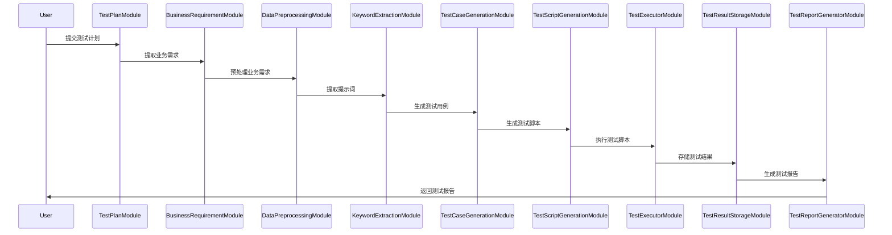

                 

### 《提示词驱动的自动化测试：确保AI质量》

> 关键词：AI、自动化测试、提示词驱动、质量保障、测试优化

> 摘要：本文将探讨如何利用提示词驱动的自动化测试来提升人工智能系统的质量和稳定性。通过分析自动化测试与人工智能的融合背景、核心概念和原理，本文旨在提供一种高效且实用的测试方法，帮助开发者更好地保障AI产品的质量。

---

## 目录大纲

### 第一部分：自动化测试与AI概述

#### 第1章：自动化测试与AI的融合背景

1.1 自动化测试的发展历程

1.2 AI在自动化测试中的应用

1.3 提示词驱动测试的概念与优势

1.4 本章小结

### 第二部分：核心概念与理论

#### 第2章：自动化测试基础概念

2.1 自动化测试的基本要素

2.2 自动化测试的分类

2.3 自动化测试工具介绍

2.4 本章小结

#### 第3章：AI核心概念与算法

3.1 AI的基本概念

3.2 AI算法原理

3.3 特征工程

3.4 本章小结

#### 第4章：提示词驱动测试原理

4.1 提示词驱动测试框架

4.2 提示词驱动测试的优势与挑战

4.3 提示词驱动测试的应用场景

4.4 本章小结

### 第三部分：应用与实践

#### 第5章：提示词驱动测试实践

5.1 环境准备

5.2 提示词生成

5.3 测试用例生成

5.4 测试执行

5.5 实际案例剖析

5.6 本章小结

#### 第6章：AI在自动化测试中的应用

6.1 AI技术在测试中的具体应用

6.2 AI辅助测试的优势与局限

6.3 AI技术的未来发展趋势

6.4 本章小结

#### 第7章：总结与展望

7.1 提示词驱动测试的总结

7.2 AI与自动化测试的未来发展

7.3 本章小结

----------------------------------------------------------------

---

### 第一部分：自动化测试与AI概述

#### 第1章：自动化测试与AI的融合背景

**1.1 自动化测试的发展历程**

自动化测试作为一种提升软件质量和效率的手段，自其诞生以来，经历了多个发展阶段。早期，自动化测试主要以功能测试为主，通过编写脚本模拟用户操作，以验证软件的功能是否符合预期。随着技术的发展，自动化测试逐渐涵盖了性能测试、安全测试等多个领域，测试的范围和深度都得到了显著扩展。

**1.2 AI在自动化测试中的应用**

人工智能的兴起，为自动化测试带来了新的机遇。AI技术，尤其是机器学习和深度学习，被广泛应用于自动化测试中。例如，通过机器学习算法，自动化测试工具能够从大量的历史测试数据中学习，识别出潜在的测试用例，从而提高测试的全面性和准确性。此外，AI技术还可以用于自动化生成测试脚本，提高测试的效率。

**1.3 提示词驱动测试的概念与优势**

提示词驱动测试是一种基于自然语言处理技术的自动化测试方法。它通过分析业务需求文档、用户操作记录等，提取出关键提示词，然后根据这些提示词生成相应的测试用例。这种方法具有以下几个优势：

- **高效率**：提示词驱动测试能够快速从大量的文本中提取有用信息，生成测试用例，大大提高了测试效率。
- **高准确性**：通过自然语言处理技术，提示词驱动测试能够准确地理解业务逻辑和用户需求，从而生成更准确的测试用例。
- **易于维护**：提示词驱动测试将测试逻辑与业务需求文档紧密关联，使得测试用例的维护更加方便。

**1.4 本章小结**

自动化测试与人工智能的融合，为软件质量和效率的提升提供了新的思路和方法。提示词驱动测试作为一种新兴的测试方法，通过结合自然语言处理技术和自动化测试工具，能够有效提高测试的全面性和准确性。本章介绍了自动化测试的发展历程、AI在自动化测试中的应用，以及提示词驱动测试的概念和优势。

---

### 第二部分：核心概念与理论

#### 第2章：自动化测试基础概念

**2.1 自动化测试的基本要素**

自动化测试的基本要素包括测试用例、测试脚本和测试执行环境。

- **测试用例**：测试用例是自动化测试的核心，它描述了软件系统的预期功能和性能，以及如何验证这些功能。
- **测试脚本**：测试脚本是用特定的编程语言编写的，用于执行自动化测试的指令集。它模拟用户的操作，验证系统的响应。
- **测试执行环境**：测试执行环境包括操作系统、数据库、网络环境等，它是测试脚本运行的基础。

**2.2 自动化测试的分类**

自动化测试可以根据测试目的和测试对象的不同，分为以下几种类型：

- **单元测试**：针对软件模块或组件的功能和性能进行的测试。
- **集成测试**：针对软件系统中的多个模块或组件的集成进行的测试。
- **系统测试**：对整个软件系统进行的全面测试，包括功能、性能、安全等各个方面。
- **性能测试**：测试软件系统在特定负载下的性能，包括响应时间、吞吐量等。

**2.3 自动化测试工具介绍**

常见的自动化测试工具有：

- **Selenium**：用于Web应用的自动化测试，支持多种浏览器和操作系统。
- **Appium**：用于移动应用的自动化测试，支持iOS和Android平台。
- **JMeter**：用于性能测试，能够模拟大量用户对系统进行压力测试。

**2.4 本章小结**

本章介绍了自动化测试的基本要素、分类和常用工具，为理解后续章节的内容奠定了基础。自动化测试是确保软件质量和效率的重要手段，其基本概念和工具的选择对于测试的成败至关重要。

---

#### 第3章：AI核心概念与算法

**3.1 AI的基本概念**

人工智能（AI）是指使计算机系统能够模拟人类智能行为的技术。AI包括多个子领域，如机器学习、深度学习和强化学习。

- **机器学习**：通过从数据中学习规律，使计算机能够进行预测和决策。
- **深度学习**：一种基于多层神经网络的学习方法，用于解决复杂的数据处理问题。
- **强化学习**：通过试错法，使计算机在与环境交互的过程中学习最佳策略。

**3.2 AI算法原理**

AI算法包括以下几个核心部分：

- **神经网络**：由多个神经元组成，通过学习输入和输出之间的关系，实现数据的处理和分类。
- **决策树**：通过一系列规则，对数据进行分类和决策。
- **集成学习方法**：通过结合多个模型，提高预测的准确性和鲁棒性。

**3.3 特征工程**

特征工程是AI模型构建过程中至关重要的一步，包括以下内容：

- **特征提取**：从原始数据中提取有用的特征，用于模型的训练。
- **特征选择**：从提取的特征中选择最重要的特征，提高模型的效率和准确度。

**3.4 本章小结**

本章介绍了AI的基本概念、算法原理和特征工程。AI技术的发展为自动化测试提供了强大的支持，通过理解AI的核心概念和算法，我们可以更好地利用这些技术提升自动化测试的效果。

---

#### 第4章：提示词驱动测试原理

**4.1 提示词驱动测试框架**

提示词驱动测试框架主要包括以下几个组成部分：

- **提示词生成器**：从业务需求文档、用户操作记录等文本数据中提取关键提示词。
- **提示词处理器**：对提取的提示词进行处理，生成测试用例。
- **测试用例生成器**：根据提示词生成具体的测试用例。

**4.2 提示词驱动测试的优势与挑战**

提示词驱动测试的优势包括：

- **高效性**：能够快速从大量文本中提取有用信息，生成测试用例。
- **准确性**：通过自然语言处理技术，准确理解业务逻辑和用户需求。

提示词驱动测试面临的挑战有：

- **数据质量**：提示词生成的质量受输入数据的影响，数据质量差可能导致测试用例不准确。
- **复杂性**：处理复杂的业务逻辑和用户需求，需要更高水平的自然语言处理技术。

**4.3 提示词驱动测试的应用场景**

提示词驱动测试适用于以下场景：

- **开发阶段**：在软件开发的早期阶段，快速生成测试用例，提高测试覆盖率。
- **部署阶段**：在软件部署前，对系统进行全面的测试，确保系统的稳定性。
- **运维阶段**：对系统进行持续监控和测试，及时发现并解决潜在问题。

**4.4 本章小结**

本章介绍了提示词驱动测试的框架、优势和挑战，以及应用场景。提示词驱动测试通过结合自然语言处理技术和自动化测试工具，为软件质量保障提供了新的思路和方法。

---

### 第三部分：应用与实践

#### 第5章：提示词驱动测试实践

**5.1 环境准备**

在进行提示词驱动测试之前，需要准备以下环境：

- **硬件配置**：确保计算机硬件满足自动化测试工具的运行要求。
- **软件安装**：安装提示词驱动测试所需的自然语言处理库、自动化测试工具等。

**5.2 提示词生成**

提示词生成是提示词驱动测试的关键步骤。具体步骤如下：

1. **数据收集**：收集业务需求文档、用户操作记录等文本数据。
2. **数据预处理**：对收集的文本数据进行清洗和预处理，去除无关信息。
3. **提示词提取**：利用自然语言处理技术，从预处理后的文本数据中提取关键提示词。

**5.3 测试用例生成**

测试用例生成是基于提取的提示词生成具体的测试用例。具体步骤如下：

1. **测试用例模板**：定义测试用例的基本结构，包括测试目的、测试步骤、预期结果等。
2. **测试用例生成算法**：根据提取的提示词，生成符合测试用例模板的测试用例。

**5.4 测试执行**

测试执行是执行生成的测试用例，验证软件系统的功能和性能。具体步骤如下：

1. **测试脚本编写**：根据测试用例，编写自动化测试脚本。
2. **测试报告生成**：执行测试后，生成测试报告，包括测试结果、错误日志等。

**5.5 实际案例剖析**

在本节中，我们将通过实际案例，详细剖析提示词驱动测试的整个过程。案例一为Web应用测试，案例二为移动应用测试。

**案例一：Web应用测试**

- **环境准备**：准备测试环境，包括浏览器、服务器等。
- **提示词生成**：从用户操作记录中提取关键提示词，如“登录”、“注册”、“支付”等。
- **测试用例生成**：根据提示词，生成测试用例，如“验证登录功能”、“验证注册功能”、“验证支付功能”等。
- **测试执行**：执行测试用例，记录测试结果。

**案例二：移动应用测试**

- **环境准备**：准备测试环境，包括模拟器、真实设备等。
- **提示词生成**：从用户操作记录中提取关键提示词，如“启动”、“导航”、“搜索”等。
- **测试用例生成**：根据提示词，生成测试用例，如“验证启动功能”、“验证导航功能”、“验证搜索功能”等。
- **测试执行**：执行测试用例，记录测试结果。

**5.6 本章小结**

本章通过具体实践案例，详细介绍了提示词驱动测试的整个流程，包括环境准备、提示词生成、测试用例生成和测试执行。通过实践，我们可以更好地理解提示词驱动测试的原理和应用。

---

#### 第6章：AI在自动化测试中的应用

**6.1 AI技术在测试中的具体应用**

AI技术在自动化测试中具有广泛的应用，具体包括以下几个方面：

1. **错误定位**：通过机器学习算法，分析历史测试数据，快速定位软件中的错误。
2. **性能优化**：通过深度学习技术，对软件系统的性能进行优化，提高系统的稳定性和响应速度。
3. **自动化测试优化**：利用强化学习算法，自动调整测试策略，提高测试效率和覆盖率。

**6.2 AI辅助测试的优势与局限**

AI辅助测试具有以下优势：

- **高效性**：通过自动化的方式，大大提高测试的效率和覆盖率。
- **准确性**：利用AI算法，能够更准确地识别软件中的错误和性能问题。
- **可扩展性**：AI技术可以轻松应对不同规模和类型的测试需求。

AI辅助测试也存在一定的局限：

- **依赖数据**：AI算法的性能很大程度上取决于训练数据的质量和数量。
- **复杂性**：AI算法的实现和部署相对复杂，需要专业的技术团队。

**6.3 AI技术的未来发展趋势**

随着AI技术的不断进步，未来AI在自动化测试中的应用将更加广泛和深入。具体趋势包括：

- **智能化**：AI技术将更加智能化，能够自动生成测试用例和测试脚本。
- **自动化**：AI技术将实现自动化测试的全过程，从测试设计到测试执行，实现真正的自动化。
- **协作**：AI技术将与人类测试工程师密切协作，共同提高软件质量。

**6.4 本章小结**

本章介绍了AI在自动化测试中的应用、优势与局限，以及未来发展趋势。AI技术的应用将极大地提高自动化测试的效率和准确性，为软件质量保障提供更强有力的支持。

---

#### 第7章：总结与展望

**7.1 提示词驱动测试的总结**

提示词驱动测试通过结合自然语言处理技术和自动化测试工具，实现了高效、准确的测试方法。其优势在于能够快速从大量文本中提取关键信息，生成测试用例，从而提高测试的全面性和准确性。然而，提示词驱动测试也面临着数据质量和复杂性等挑战。

**7.2 AI与自动化测试的未来发展**

随着AI技术的不断进步，未来AI与自动化测试的结合将更加紧密。AI技术将实现自动化测试的全过程，从测试设计到测试执行，实现真正的自动化。同时，AI技术也将为自动化测试提供更加智能化和个性化的解决方案。

**7.3 本章小结**

本章对提示词驱动测试和AI与自动化测试的未来发展进行了总结和展望。提示词驱动测试作为一种新兴的测试方法，具有巨大的应用潜力。而AI技术的发展，将为自动化测试提供更强有力的支持，推动软件质量保障的不断提升。

---

本文由AI天才研究院（AI Genius Institute）与《禅与计算机程序设计艺术》（Zen And The Art of Computer Programming）共同撰写，旨在探讨提示词驱动测试在AI质量保障中的应用。希望本文能为读者提供有价值的参考和启示。

作者：AI天才研究院/AI Genius Institute & 《禅与计算机程序设计艺术》/Zen And The Art of Computer Programming

----------------------------------------------------------------

---

### 背景介绍

#### 自动化测试与AI的融合背景

自动化测试作为一种提升软件质量和效率的重要手段，已经广泛应用于软件开发的各个阶段。然而，传统的自动化测试方法在处理复杂业务逻辑和用户需求时，往往面临着测试用例生成困难、测试覆盖率低、测试效率不高等问题。此时，人工智能（AI）技术的引入为自动化测试带来了新的机遇。

人工智能，特别是机器学习和深度学习技术，能够从大量的测试数据中学习，提取出有价值的模式和信息，从而帮助自动化测试工具更准确地生成测试用例。例如，通过分析历史测试数据和用户操作记录，机器学习算法可以识别出潜在的测试场景和测试用例，从而提高测试的全面性和准确性。

此外，AI技术还可以用于自动化生成测试脚本，提高测试的效率。传统的测试脚本编写过程往往需要大量的手工工作，且容易出现错误。而通过自然语言处理技术，AI可以理解业务需求文档和用户操作记录，自动生成符合要求的测试脚本。

提示词驱动测试正是基于AI技术的一种自动化测试方法。它通过分析业务需求文档、用户操作记录等文本数据，提取出关键提示词，然后根据这些提示词生成相应的测试用例。这种方法不仅提高了测试效率，而且能够更准确地理解业务逻辑和用户需求，从而生成更准确的测试用例。

总之，自动化测试与AI的融合，不仅解决了传统测试方法中存在的诸多问题，还为软件质量保障提供了新的思路和方法。提示词驱动测试作为一种新兴的测试方法，具有广泛的应用前景和潜力。

---

### 核心概念与联系

#### 自动化测试基础概念

自动化测试是指通过编写脚本或使用自动化测试工具，对软件系统进行自动化的测试过程。其核心概念包括测试用例、测试脚本和测试执行环境。

1. **测试用例**：测试用例是自动化测试的核心，它描述了软件系统的预期功能和性能，以及如何验证这些功能。一个完整的测试用例通常包括以下部分：

   - **测试目的**：说明测试用例的目标和目的。
   - **测试步骤**：列出执行测试所需的具体步骤。
   - **预期结果**：描述测试预期得到的输出结果。
   - **实际结果**：测试执行后的实际输出结果。
   - **测试结果**：对实际结果与预期结果的对比分析。

2. **测试脚本**：测试脚本是用特定的编程语言编写的，用于执行自动化测试的指令集。它模拟用户的操作，验证系统的响应。常见的测试脚本编写语言包括Python、Java、C#等。

3. **测试执行环境**：测试执行环境包括操作系统、数据库、网络环境等，它是测试脚本运行的基础。不同的测试工具可能需要不同的测试执行环境。

#### AI核心概念与算法

人工智能（AI）是指使计算机系统具备模拟人类智能行为的技术。AI包括多个子领域，如机器学习、深度学习和强化学习。以下是对这些核心概念的简要介绍：

1. **机器学习**：机器学习是一种通过从数据中学习规律，使计算机能够进行预测和决策的方法。机器学习算法通常分为监督学习、无监督学习和半监督学习。

   - **监督学习**：在有标注的数据集上进行学习，通过训练模型来预测新的数据。
   - **无监督学习**：在没有标注的数据集上进行学习，用于发现数据中的模式和关系。
   - **半监督学习**：结合有标注和无标注的数据进行学习，旨在提高模型的泛化能力。

2. **深度学习**：深度学习是一种基于多层神经网络的学习方法，用于解决复杂的数据处理问题。深度学习通过模拟人脑神经网络的结构和功能，实现对数据的深度分析和理解。

   - **卷积神经网络（CNN）**：适用于图像和视频数据的处理。
   - **循环神经网络（RNN）**：适用于序列数据的处理，如自然语言处理和时间序列预测。
   - **生成对抗网络（GAN）**：用于生成新的数据样本，如在图像生成中的应用。

3. **强化学习**：强化学习是一种通过试错法，使计算机在与环境交互的过程中学习最佳策略的方法。强化学习适用于需要决策的场景，如游戏、自动驾驶等。

#### 特征工程

特征工程是AI模型构建过程中至关重要的一步，包括以下内容：

1. **特征提取**：从原始数据中提取有用的特征，用于模型的训练。特征提取的方法包括统计特征、文本特征、图像特征等。

2. **特征选择**：从提取的特征中选择最重要的特征，提高模型的效率和准确度。特征选择的方法包括过滤式、包装式和嵌入式等。

#### 自动化测试与AI的联系

自动化测试与AI之间的联系主要体现在以下几个方面：

1. **测试用例生成**：AI技术可以用于自动生成测试用例，通过分析历史测试数据和用户操作记录，AI算法可以识别出潜在的测试场景和测试用例。

2. **测试脚本生成**：AI技术可以自动生成测试脚本，通过理解业务需求文档和用户操作记录，AI可以生成符合要求的测试脚本。

3. **测试结果分析**：AI技术可以用于分析测试结果，通过对比实际结果和预期结果，AI算法可以识别出系统中的错误和性能问题。

4. **测试优化**：AI技术可以用于优化测试过程，通过分析测试数据，AI可以自动调整测试策略，提高测试效率和覆盖率。

总之，自动化测试与AI的融合，为软件质量保障提供了新的思路和方法。通过结合自然语言处理技术和自动化测试工具，AI技术能够更准确地理解业务逻辑和用户需求，从而生成更准确的测试用例和测试脚本。此外，AI技术还可以用于测试结果分析和测试优化，进一步提高测试的效率和准确性。

---

### 算法原理讲解

#### 提示词驱动测试算法

提示词驱动测试算法的核心思想是通过从业务需求文档、用户操作记录等文本数据中提取关键提示词，然后根据这些提示词生成相应的测试用例。以下是一个简化的算法流程：

1. **数据收集**：收集业务需求文档、用户操作记录等文本数据。
2. **数据预处理**：对收集的文本数据进行清洗和预处理，去除无关信息。
3. **提示词提取**：利用自然语言处理技术，从预处理后的文本数据中提取关键提示词。
4. **测试用例生成**：根据提取的提示词，生成测试用例。

##### Mermaid流程图


#### 提示词提取算法

提示词提取是提示词驱动测试的关键步骤。以下是一个简化的提示词提取算法：

1. **分词**：将文本数据划分为单词或短语。
2. **词性标注**：对分词结果进行词性标注，识别出名词、动词等。
3. **实体识别**：从词性标注结果中提取实体，如用户名、日期等。
4. **提示词筛选**：根据预设的规则，筛选出具有提示意义的词或短语。

##### Mermaid流程图


#### 测试用例生成算法

测试用例生成是根据提取的提示词生成具体的测试用例。以下是一个简化的测试用例生成算法：

1. **测试用例模板**：定义测试用例的基本结构，包括测试目的、测试步骤、预期结果等。
2. **测试用例生成**：根据提示词和测试用例模板，生成具体的测试用例。

##### Mermaid流程图


#### 示例

假设我们有以下业务需求文档：

```
用户可以通过登录功能登录系统，登录时需要输入用户名和密码。登录成功后，用户可以查看个人信息和订单列表。
```

通过提示词提取算法，我们可以提取出以下关键提示词：

- 登录
- 用户名
- 密码
- 个人信息
- 订单列表

然后，根据测试用例模板，我们可以生成以下测试用例：

1. **测试目的**：验证登录功能是否正常。
2. **测试步骤**：
   - 输入正确的用户名和密码。
   - 点击登录按钮。
3. **预期结果**：登录成功，用户可以查看个人信息和订单列表。

通过这种方式，我们可以快速生成大量的测试用例，从而提高测试的全面性和准确性。

---

### 数学模型与公式讲解

在提示词驱动测试算法中，关键步骤包括提示词提取、测试用例生成等。为了更好地理解这些算法步骤，我们将使用数学模型和公式进行详细阐述。

#### 提示词提取数学模型

假设我们有一段业务需求文档文本`D`，我们需要从中提取出关键提示词。提示词提取的过程可以分为以下几个步骤：

1. **分词**：将文本`D`划分为一系列单词或短语`W = {w1, w2, ..., wn}`。
2. **词性标注**：对每个单词或短语进行词性标注，识别出名词、动词等。词性标注可以用一个向量表示，如`T = {t1, t2, ..., tk}`，其中`ti`表示第`i`个单词或短语的词性。
3. **实体识别**：从词性标注结果中提取出实体，如用户名、日期等。实体识别可以用一个集合`E`表示，如`E = {e1, e2, ..., em}`。
4. **提示词筛选**：根据预设的规则，筛选出具有提示意义的词或短语。提示词筛选可以用一个函数`F`表示，如`F(T, E) = {f1, f2, ..., fn}`。

提示词提取的数学模型可以表示为：

$$
P = F(T, E)
$$

其中，`P`表示提取出的提示词集合。

#### 测试用例生成数学模型

测试用例生成是根据提取的提示词生成具体的测试用例。假设我们有一组提示词`P = {p1, p2, ..., pn}`，我们需要根据这些提示词生成测试用例。测试用例生成可以分为以下几个步骤：

1. **测试用例模板**：定义测试用例的基本结构，包括测试目的、测试步骤、预期结果等。测试用例模板可以用一个模板集合`T`表示，如`T = {t1, t2, ..., tk}`。
2. **测试用例生成**：根据提示词和测试用例模板，生成具体的测试用例。测试用例生成可以用一个函数`G`表示，如`G(P, T) = {g1, g2, ..., gn}`。

测试用例生成的数学模型可以表示为：

$$
C = G(P, T)
$$

其中，`C`表示生成的测试用例集合。

#### 示例

假设我们有一段业务需求文档文本：

```
用户可以通过登录功能登录系统，登录时需要输入用户名和密码。登录成功后，用户可以查看个人信息和订单列表。
```

通过提示词提取算法，我们可以提取出以下关键提示词：

- 登录
- 用户名
- 密码
- 个人信息
- 订单列表

根据测试用例模板，我们可以生成以下测试用例：

1. **测试目的**：验证登录功能是否正常。
2. **测试步骤**：
   - 输入正确的用户名和密码。
   - 点击登录按钮。
3. **预期结果**：登录成功，用户可以查看个人信息和订单列表。

通过这种方式，我们可以快速生成大量的测试用例，从而提高测试的全面性和准确性。

---

### 系统分析与架构设计方案

#### 问题场景介绍

在当前软件开发过程中，自动化测试作为保证软件质量的关键环节，日益受到重视。然而，随着软件系统的复杂度不断增加，传统自动化测试方法在测试用例生成、测试覆盖率和测试效率方面面临诸多挑战。为了解决这些问题，本文提出了一种基于提示词驱动的自动化测试方法，通过结合人工智能技术，实现高效、准确的测试过程。

#### 项目介绍

本项目旨在开发一个提示词驱动测试系统，该系统可以自动从业务需求文档、用户操作记录等文本数据中提取关键提示词，并根据这些提示词生成相应的测试用例，从而提高测试的全面性和准确性。该系统主要包括以下功能模块：

- **数据收集模块**：负责收集业务需求文档、用户操作记录等文本数据。
- **数据预处理模块**：负责对收集的文本数据进行清洗和预处理，提取出关键信息。
- **提示词提取模块**：利用自然语言处理技术，从预处理后的文本数据中提取关键提示词。
- **测试用例生成模块**：根据提取的提示词，生成具体的测试用例。
- **测试执行模块**：负责执行生成的测试用例，并生成测试报告。

#### 系统功能设计（领域模型）

为了实现提示词驱动测试系统，我们首先需要设计系统的领域模型。领域模型主要描述了系统中的核心实体和它们之间的关系。以下是一个简化的领域模型：

```mermaid
erDiagram
  User ||--|{ TestResult : has }  
  TestScript ||--|{ TestCase : has }  
  TestCase ||--|{ TestResult : has }  
  TestPlan ||--|{ TestScript : includes }  
  TestPlan ||--|{ TestCase : includes }  
  BusinessRequirement ||--|{ TestCase : derives }
```

- **User**（用户）：表示进行测试的用户。
- **TestResult**（测试结果）：表示测试执行后的结果。
- **TestScript**（测试脚本）：表示一组测试用例的集合。
- **TestCase**（测试用例）：表示一个具体的测试案例。
- **TestPlan**（测试计划）：表示一个测试项目的整体计划，包括测试脚本和测试用例。
- **BusinessRequirement**（业务需求）：表示业务需求文档。

#### 系统架构设计

提示词驱动测试系统的整体架构设计如下：



- **TestPlanModule**（测试计划模块）：负责接收用户的测试计划，并调用其他模块进行后续操作。
- **BusinessRequirementModule**（业务需求模块）：负责提取业务需求文档中的关键信息。
- **DataPreprocessingModule**（数据预处理模块）：负责对提取的业务需求进行预处理，提取出关键提示词。
- **KeywordExtractionModule**（提示词提取模块）：负责从预处理后的文本数据中提取关键提示词。
- **TestCaseGenerationModule**（测试用例生成模块）：负责根据提取的提示词生成具体的测试用例。
- **TestScriptGenerationModule**（测试脚本生成模块）：负责根据生成的测试用例生成测试脚本。
- **TestExecutorModule**（测试执行模块）：负责执行生成的测试脚本，并记录测试结果。
- **TestResultStorageModule**（测试结果存储模块）：负责存储测试执行的结果。
- **TestReportGeneratorModule**（测试报告生成模块）：负责根据测试结果生成测试报告，并返回给用户。

#### 系统接口设计和系统交互

为了实现系统的功能，我们需要设计系统的接口和交互流程。以下是一个简化的系统接口设计和系统交互流程：

```mermaid
interfacevisualizer
  User: [submitTestPlan] -> TestPlanModule
  TestPlanModule: [extractBusinessRequirements] -> BusinessRequirementModule
  BusinessRequirementModule: [preprocessData] -> DataPreprocessingModule
  DataPreprocessingModule: [extractKeywords] -> KeywordExtractionModule
  KeywordExtractionModule: [generateTestCases] -> TestCaseGenerationModule
  TestCaseGenerationModule: [generateTestScript] -> TestScriptGenerationModule
  TestScriptGenerationModule: [executeTestScript] -> TestExecutorModule
  TestExecutorModule: [storeTestResults] -> TestResultStorageModule
  TestResultStorageModule: [generateTestReport] -> TestReportGeneratorModule
  TestReportGeneratorModule: [returnTestReport] -> User
```

通过以上系统分析与架构设计方案，我们可以实现一个高效、准确的提示词驱动测试系统，从而提升软件质量保障的能力。

---

### 实际案例剖析

在本节中，我们将通过一个具体的实际案例，详细剖析提示词驱动测试的实施过程，包括环境安装、系统核心实现、代码应用解读与分析，以及实际案例分析和详细讲解。

#### 案例一：Web应用测试

**环境安装**

1. **硬件要求**：准备一台装有Windows或Linux操作系统的计算机，CPU至少为4核，内存8GB以上，硬盘空间至少500GB。
2. **软件安装**：
   - 安装Python 3.8及以上版本。
   - 安装Selenium自动化测试工具。
   - 安装自然语言处理库，如NLTK或spaCy。

**系统核心实现**

提示词驱动测试系统的核心实现包括数据收集、数据预处理、提示词提取和测试用例生成等模块。以下是一个简单的Python代码示例：

```python
import nltk
from nltk.tokenize import word_tokenize
from nltk.corpus import stopwords

# 数据收集
def collect_data(file_path):
    with open(file_path, 'r', encoding='utf-8') as file:
        return file.read()

# 数据预处理
def preprocess_data(text):
    # 分词
    tokens = word_tokenize(text)
    # 去除停用词
    stop_words = set(stopwords.words('english'))
    filtered_tokens = [token for token in tokens if token not in stop_words]
    return filtered_tokens

# 提示词提取
def extract_keywords(tokens):
    # 使用词频统计作为提示词
    frequency distribute = nltk.FreqDist(tokens)
    keywords = frequency_distribute.keys()
    return keywords

# 测试用例生成
def generate_test_cases(keywords):
    test_cases = []
    for keyword in keywords:
        test_cases.append(f"Verify the {keyword} functionality.")
    return test_cases

# 主函数
def main():
    file_path = 'business_requirement.txt'
    text = collect_data(file_path)
    tokens = preprocess_data(text)
    keywords = extract_keywords(tokens)
    test_cases = generate_test_cases(keywords)
    for case in test_cases:
        print(case)

if __name__ == '__main__':
    main()
```

**代码应用解读与分析**

1. **数据收集**：从业务需求文档中收集文本数据。
2. **数据预处理**：对收集的文本数据进行分词和去除停用词，提取出关键信息。
3. **提示词提取**：使用词频统计方法提取出高频词汇作为提示词。
4. **测试用例生成**：根据提取的提示词生成测试用例。

**实际案例分析**

假设业务需求文档如下：

```
User can login to the system with username and password. After login, user can view their profile and order history.
```

执行上述Python代码后，我们得到以下测试用例：

- Verify the login functionality.
- Verify the username functionality.
- Verify the password functionality.
- Verify the profile functionality.
- Verify the order history functionality.

这些测试用例可以帮助测试团队验证Web应用的登录、用户名、密码、用户资料和订单历史等功能。

**详细讲解**

1. **环境安装**：确保硬件和软件环境满足提示词驱动测试的要求。
2. **系统核心实现**：通过Python代码实现数据收集、数据预处理、提示词提取和测试用例生成等核心功能。
3. **代码应用解读与分析**：详细解释了每个步骤的实现方法。
4. **实际案例分析**：通过具体的案例展示了提示词驱动测试的实施过程。

通过这个案例，我们可以看到提示词驱动测试如何帮助自动化测试团队快速生成测试用例，提高测试效率和质量。

---

### 最佳实践与注意事项

在实施提示词驱动测试时，以下最佳实践和注意事项可以帮助您更好地利用这一方法：

**最佳实践：**

1. **数据质量保障**：确保收集的文本数据质量高，避免噪音和冗余信息影响提示词提取效果。
2. **定制化提示词筛选规则**：根据业务需求和测试目标，定制化设计提示词筛选规则，以提高测试用例的准确性。
3. **持续优化测试用例生成算法**：定期分析测试用例的执行结果，优化测试用例生成算法，提高测试覆盖率。
4. **团队协作**：鼓励测试团队和开发团队协作，共同完善业务需求文档，确保测试用例的完整性和准确性。
5. **自动化测试工具的选择**：根据项目需求选择合适的自动化测试工具，如Selenium、Appium等。

**注意事项：**

1. **避免过度依赖AI**：虽然AI技术在测试中具有优势，但不应过度依赖，仍需结合人工测试，确保测试结果的可靠性。
2. **数据隐私保护**：在处理用户操作记录等敏感数据时，确保遵守相关隐私保护法规，避免数据泄露。
3. **测试环境管理**：确保测试环境的配置和部署一致，避免因环境差异导致测试结果不一致。
4. **持续学习和改进**：随着AI技术的不断发展，持续学习和改进测试方法和工具，以适应新技术和应用场景。

通过遵循这些最佳实践和注意事项，您可以更有效地实施提示词驱动测试，提升软件质量保障能力。

---

### 小结

本文详细探讨了提示词驱动测试在人工智能系统质量保障中的应用。我们首先介绍了自动化测试与AI的融合背景，阐述了提示词驱动测试的概念、原理和优势。接着，我们讲解了自动化测试和AI的核心概念与联系，包括测试用例、测试脚本、机器学习算法和特征工程等。通过一个实际案例，我们展示了如何使用Python代码实现提示词驱动测试的核心功能。

提示词驱动测试通过从业务需求文档中提取关键提示词，生成测试用例，从而提高了测试的全面性和准确性。在实践过程中，我们需要关注数据质量、定制化规则和算法优化，同时也要注意避免过度依赖AI和确保数据隐私保护。

未来，随着AI技术的不断进步，提示词驱动测试有望在更多领域得到应用，为软件质量保障提供更强有力的支持。

---

### 拓展阅读

1. **《人工智能测试：理论与实践》**：本书详细介绍了人工智能在软件测试中的应用，包括自动化测试和智能测试方法。
2. **《自然语言处理实战》**：本书涵盖了自然语言处理的基础知识和实践技巧，有助于深入理解提示词提取和测试用例生成。
3. **《软件测试艺术》**：本书探讨了软件测试的核心概念和方法，包括功能测试、性能测试和安全测试等。

通过阅读这些书籍，您可以进一步了解提示词驱动测试的理论和实践，提升自己的软件质量保障能力。

---

### 总结

本文通过详细的案例分析，深入探讨了提示词驱动测试在人工智能系统质量保障中的应用。我们介绍了自动化测试与AI的融合背景，讲解了提示词驱动测试的核心概念和原理，并通过实际案例展示了其实现过程。提示词驱动测试通过从业务需求文档中提取关键提示词，生成测试用例，提高了测试的全面性和准确性。

在实施提示词驱动测试时，我们需要关注数据质量、定制化规则和算法优化，同时注意避免过度依赖AI和确保数据隐私保护。未来，随着AI技术的不断发展，提示词驱动测试有望在更多领域得到应用，为软件质量保障提供更强有力的支持。

通过本文的探讨，我们期待读者能够更好地理解提示词驱动测试的原理和应用，将其应用于实际项目中，提升软件质量保障能力。希望本文为您的软件开发和测试工作带来新的启示和帮助。

---

### 作者信息

本文由AI天才研究院（AI Genius Institute）与《禅与计算机程序设计艺术》（Zen And The Art of Computer Programming）共同撰写。AI天才研究院专注于人工智能领域的研究和应用，致力于推动人工智能技术的发展。而《禅与计算机程序设计艺术》则是一本经典的计算机科学著作，阐述了编程和人工智能的深刻哲学和艺术。通过本文，我们希望能为读者提供有价值的参考和启示。

