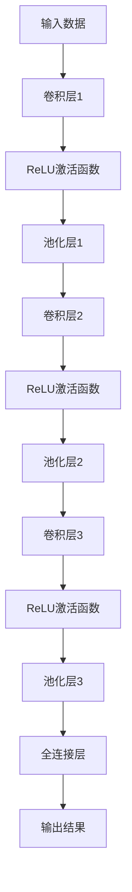
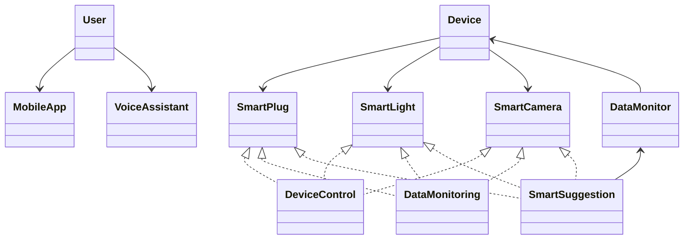
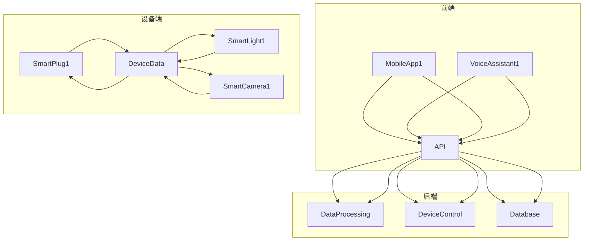
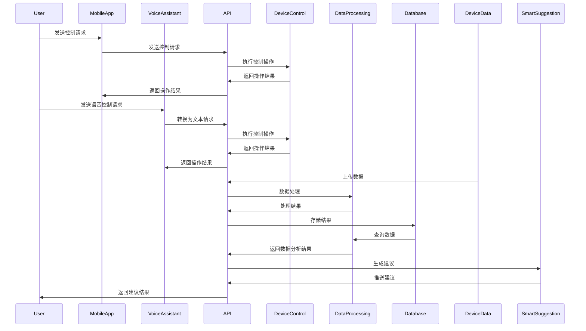

                 


### AI时代的编程基础

在探讨AI时代的编程之前，我们需要首先了解AI技术的发展背景以及编程在其中的重要性。AI，即人工智能，是计算机科学的一个分支，旨在使计算机具备人类智能，能够进行推理、学习、感知和决策。AI技术的发展历程可以追溯到20世纪50年代，然而直到21世纪，随着计算能力的提升和大数据的普及，AI才真正进入了一个飞速发展的时代。

#### AI技术发展历程

AI技术的发展可以分为几个阶段：符号主义（Symbolic AI）、基于实例的学习（Case-Based Reasoning）、基于知识的系统（Knowledge-Based Systems）、混合智能（Hybrid Intelligence）、以及目前最为流行的深度学习（Deep Learning）。每一个阶段都有其独特的技术特点和应用场景。

1. **符号主义**：早期AI尝试通过符号逻辑和推理来模拟人类智能，如专家系统和逻辑编程。这一方法在解决特定领域的问题时取得了成功，但在处理复杂、不确定的问题时显得力不从心。

2. **基于实例的学习**：这一方法通过从大量实例中学习，从而在新的问题上作出决策。它为AI的发展提供了新的思路，但仍然依赖于大量手工标注的数据。

3. **基于知识的系统**：知识表示和推理成为这一阶段的核心，AI系统可以通过编程或手工构建的方式获得知识库，进行问题求解。

4. **混合智能**：这一阶段将多种AI技术结合，如机器学习、进化算法、模糊逻辑等，以应对更加复杂的任务。

5. **深度学习**：基于神经网络的深度学习在这一阶段取得了重大突破，使得AI在图像识别、语音识别、自然语言处理等领域取得了显著成果。

#### 编程在AI时代的重要性

编程是AI时代的基石，它在以下几个方面尤为重要：

1. **算法实现**：AI技术的核心在于算法，而这些算法需要通过编程语言来实现。了解编程语言及其特性对于开发和优化AI算法至关重要。

2. **数据处理**：大数据是AI的燃料，而数据处理通常需要复杂的数据结构和算法。掌握编程技能有助于有效处理和分析大量数据。

3. **系统集成**：将AI技术集成到现有的系统中，需要编程技能来确保系统的稳定性和高效性。

4. **优化和调优**：AI模型的性能往往依赖于参数的调整和优化，这需要程序员具备深厚的编程基础和算法理解能力。

#### AI编程的挑战与机遇

AI编程面临一些独特的挑战：

1. **数据隐私**：在处理大量用户数据时，保护隐私成为一大挑战。

2. **计算资源**：深度学习模型通常需要大量的计算资源，这对硬件和软件系统提出了更高的要求。

3. **可解释性**：传统的AI模型，如深度神经网络，通常被视为“黑箱”，难以解释其决策过程。

然而，这些挑战也带来了机遇：

1. **新领域应用**：AI技术的广泛应用催生了新的编程需求，如自动驾驶、智能家居等。

2. **开源社区**：随着AI技术的发展，开源社区不断涌现，为程序员提供了丰富的工具和资源。

3. **跨学科融合**：AI与编程的结合推动了跨学科的研究和合作，如数据科学、生物信息学等。

总的来说，AI时代的编程不仅仅是编写代码，而是涉及数据科学、机器学习、算法优化等多个领域。在这个时代，程序员需要不断学习新技能，以应对不断变化的技术环境。

### 编程语言与框架演进

在AI时代，编程语言和框架的演进对AI编程的发展起到了至关重要的作用。从传统的编程语言到专门为AI设计的语言和框架，这一演变过程不仅丰富了程序员的选择，也推动了AI技术的进步。

#### 传统的编程语言

传统的编程语言如C、C++、Java和Python等，在过去几十年中一直是软件开发的主流工具。这些语言具有较高的性能和灵活性，适用于各种类型的软件项目，包括操作系统、Web应用和桌面软件等。然而，随着AI技术的发展，这些传统语言在处理复杂AI任务时逐渐暴露出一些局限性。

1. **性能瓶颈**：传统的编程语言通常依赖编译器将代码转换为机器语言，这个过程虽然高效，但在处理大量数据和高计算量的AI任务时，性能可能成为瓶颈。

2. **复杂性**：编写高效的AI算法通常需要复杂的数学和统计知识，传统编程语言在处理这些复杂任务时往往需要编写大量的辅助代码。

3. **可维护性**：随着项目的复杂性增加，传统编程语言在代码可维护性方面存在挑战，尤其是在需要频繁调整和优化的AI项目中。

#### AI时代的编程语言

为了解决传统编程语言的局限性，AI时代的编程语言应运而生。这些语言通常具有以下几个特点：

1. **易用性**：AI编程语言如R和Julia，设计之初就考虑到了易用性，使得程序员可以更轻松地处理复杂数学和统计任务。

2. **高级抽象**：AI编程语言提供了高级抽象，如矩阵运算、自动微分等，这些抽象大大简化了AI算法的实现过程。

3. **性能优化**：一些AI编程语言如C++和Python，通过优化编译器和运行时环境，提供了高性能的执行效率，能够满足深度学习等复杂任务的计算需求。

#### 开源框架与库

在AI编程中，开源框架和库起到了至关重要的作用。这些框架和库提供了丰富的工具和资源，使得程序员可以更加高效地开发AI应用。

1. **TensorFlow**：由Google开发，是目前最受欢迎的深度学习框架之一。它提供了丰富的API，支持各种深度学习模型，如卷积神经网络（CNN）和递归神经网络（RNN）。

2. **PyTorch**：由Facebook开发，以其动态图模型和易于使用的API而受到广泛欢迎。它支持复杂的神经网络模型，并提供了强大的自动微分功能。

3. **Keras**：是一个高层次的深度学习框架，它构建在TensorFlow和Theano之上，提供了简单而强大的API，使得深度学习模型的开发更加便捷。

4. **Scikit-learn**：是一个专注于机器学习的开源库，提供了多种经典机器学习算法的实现，如支持向量机（SVM）、随机森林（RF）和朴素贝叶斯（NB）。

#### 选择编程语言和框架

选择适合的编程语言和框架对于AI编程的成功至关重要。以下是一些选择标准：

1. **项目需求**：根据项目的具体需求选择语言和框架。例如，如果项目需要高性能，可以选择C++或Python；如果项目侧重于数据预处理和可视化，可以选择R。

2. **团队技能**：团队的技能背景也是选择语言和框架的重要考虑因素。如果团队成员熟悉Python，则使用PyTorch可能更加合适。

3. **生态系统**：一个强大的生态系统可以提供丰富的工具和资源，支持项目的开发和部署。例如，TensorFlow拥有丰富的扩展库和社区支持。

4. **可维护性和可扩展性**：选择易于维护和扩展的语言和框架，可以降低项目开发的风险，提高项目的长期可持续性。

总的来说，AI时代的编程语言和框架为程序员提供了丰富的选择，使得开发AI应用变得更加高效和便捷。在这个时代，掌握多种编程语言和框架的能力将使程序员在AI领域脱颖而出。

### 核心概念与联系

在AI编程中，理解核心概念及其相互之间的联系是至关重要的。这些核心概念包括数据与模型、学习算法、评估与优化等。本节将详细探讨这些概念，并通过表格和图示来展示它们之间的关系。

#### 数据与模型

数据是AI编程的核心要素，它既是训练模型的素材，也是模型进行预测的依据。模型则是对数据的一种抽象和表示，通过模型，我们可以从数据中提取有价值的信息。

1. **数据类型**：数据可以分为结构化数据和非结构化数据。结构化数据如数据库记录，具有固定的字段和格式；非结构化数据如文本、图像和音频，没有固定的结构。

2. **数据预处理**：在训练模型之前，通常需要对数据进行预处理，包括清洗、归一化、特征提取等步骤。这些步骤有助于提高模型的学习效果。

3. **数据集**：数据集是将数据划分为训练集、验证集和测试集的过程。训练集用于训练模型，验证集用于调整模型参数，测试集用于评估模型性能。

#### 学习算法

学习算法是AI编程的核心，它们决定了模型如何从数据中学习，并生成预测。常见的学习算法包括监督学习、无监督学习和强化学习。

1. **监督学习**：监督学习是一种有标注的数据学习方式，模型根据输入和输出的关系进行学习。常见的监督学习算法包括线性回归、支持向量机（SVM）和神经网络。

2. **无监督学习**：无监督学习是在没有标注的数据上进行学习，模型试图发现数据中的内在结构。常见的无监督学习算法包括聚类、降维和生成模型。

3. **强化学习**：强化学习是一种通过奖励机制来训练模型的方式，模型通过不断尝试和反馈来优化其行为。常见的强化学习算法包括Q学习、深度Q网络（DQN）和策略梯度算法。

#### 评估与优化

评估和优化是模型训练过程中不可或缺的环节，它们确保模型能够准确、稳定地工作。

1. **评估指标**：评估指标用于衡量模型性能，常见的评估指标包括准确率、召回率、F1分数等。

2. **模型调优**：模型调优是通过调整模型参数来优化模型性能的过程。常用的调优方法包括网格搜索、随机搜索和贝叶斯优化。

#### 概念属性特征对比表格

为了更好地理解这些核心概念，我们可以通过一个表格来对比它们的主要特征：

| 概念        | 描述                                                         | 关键特征                               |
|-------------|--------------------------------------------------------------|----------------------------------------|
| 数据        | AI编程的基础，包括结构化和非结构化数据                       | 数据类型、预处理、数据集               |
| 模型        | 对数据的抽象表示，用于生成预测                               | 模型类型、训练、预测                   |
| 学习算法    | 使模型从数据中学习的规则                                     | 监督学习、无监督学习、强化学习         |
| 评估与优化  | 用于衡量模型性能并调整模型参数的方法                         | 评估指标、模型调优                     |

#### ER实体关系图

为了进一步展示这些概念之间的联系，我们可以使用ER（实体关系）图来描述它们之间的关系。ER图是一种用于描述实体及其之间关系的图形表示方法。

在AI编程中，我们可以定义以下实体：

- **数据**：表示训练数据、测试数据和验证数据。
- **模型**：表示训练好的模型，包括输入层、隐藏层和输出层。
- **学习算法**：表示用于训练模型的学习算法，如监督学习和无监督学习。
- **评估指标**：表示用于评估模型性能的指标，如准确率和F1分数。
- **优化方法**：表示用于调整模型参数的方法，如网格搜索和随机搜索。

以下是ER图的示例：

```mermaid
erDiagram
  数据 ||--|{ 模型 }|
  数据 ||--|{ 学习算法 }|
  模型 ||--|{ 评估指标 }|
  模型 ||--|{ 优化方法 }|
```

通过上述表格和ER图，我们可以清晰地看到AI编程中的核心概念及其相互之间的联系。这些概念不仅是AI编程的基础，也是理解和应用AI技术的关键。通过深入理解这些概念，程序员可以更好地开发高效的AI应用，并在AI领域取得突破性的成果。

### 算法原理与数学模型

在AI编程中，理解算法的原理和数学模型是至关重要的，这不仅有助于我们编写高效的代码，还能帮助我们优化和改进算法。本节将详细讲解算法原理，并使用Mermaid图和Python源代码来展示算法步骤，同时介绍相关的数学模型和公式。

#### 算法原理讲解

以常见的神经网络算法——卷积神经网络（CNN）为例，我们首先需要了解其基本原理和步骤。

**CNN算法原理**：

1. **卷积操作**：卷积操作是CNN的核心步骤，它通过滑动窗口（通常是一个卷积核）在输入数据上滑动，计算窗口内的元素乘积并求和。这可以提取出输入数据的局部特征。

2. **激活函数**：卷积操作后，通常需要应用激活函数（如ReLU函数）来引入非线性，使神经网络能够学习复杂的函数关系。

3. **池化操作**：为了降低模型的复杂性和参数数量，CNN还会应用池化操作（如最大池化或平均池化），在卷积层和全连接层之间进行特征降维。

4. **全连接层**：在经过多个卷积和池化层后，CNN会将特征图输入到全连接层进行分类或回归。

**算法步骤**：



通过上述Mermaid图，我们可以直观地看到CNN的算法流程。接下来，我们将通过Python源代码进一步详细阐述每个步骤。

#### Python源代码示例

```python
import tensorflow as tf
from tensorflow.keras import layers

# 定义CNN模型
model = tf.keras.Sequential([
    layers.Conv2D(filters=32, kernel_size=(3, 3), activation='relu', input_shape=(28, 28, 1)),
    layers.MaxPooling2D(pool_size=(2, 2)),
    layers.Conv2D(filters=64, kernel_size=(3, 3), activation='relu'),
    layers.MaxPooling2D(pool_size=(2, 2)),
    layers.Conv2D(filters=64, kernel_size=(3, 3), activation='relu'),
    layers.Flatten(),
    layers.Dense(units=64, activation='relu'),
    layers.Dense(units=10, activation='softmax')
])

# 编译模型
model.compile(optimizer='adam',
              loss='sparse_categorical_crossentropy',
              metrics=['accuracy'])

# 加载数据
(x_train, y_train), (x_test, y_test) = tf.keras.datasets.mnist.load_data()

# 预处理数据
x_train = x_train.reshape(-1, 28, 28, 1).astype('float32') / 255
x_test = x_test.reshape(-1, 28, 28, 1).astype('float32') / 255

# 训练模型
model.fit(x_train, y_train, epochs=5, batch_size=64)
```

在上面的代码中，我们首先定义了一个简单的CNN模型，包括卷积层、ReLU激活函数、池化层和全连接层。然后，我们编译模型并加载MNIST数据集进行训练。这个例子展示了如何通过Python实现CNN算法的基本步骤。

#### 数学模型和公式

在CNN算法中，几个关键的数学模型和公式如下：

1. **卷积操作**：

   对于输入图像 $X$ 和卷积核 $W$，卷积操作的输出可以表示为：

   $$
   \text{output} = \sum_{i,j} X_{i,j} \times W_{i,j}
   $$

   其中，$i$ 和 $j$ 分别表示图像的行和列。

2. **ReLU激活函数**：

   ReLU（Rectified Linear Unit）激活函数是一个简单的非线性函数，定义为：

   $$
   \text{ReLU}(x) = \max(0, x)
   $$

3. **池化操作**：

   最大池化（MaxPooling）的输出可以表示为：

   $$
   P_{i,j} = \max_{k,l} X_{i+k, j+l}
   $$

   其中，$P$ 表示池化输出，$X$ 表示输入图像。

4. **全连接层**：

   对于全连接层，输出可以表示为：

   $$
   \text{output} = \text{softmax}(\sum_{i} W_{i} \times a_{i})
   $$

   其中，$W$ 表示权重矩阵，$a$ 表示激活值，softmax函数用于归一化输出，使其成为一个概率分布。

通过上述讲解，我们可以看到，理解算法原理和数学模型对于AI编程至关重要。这不仅有助于我们编写高效的代码，还能帮助我们深入理解AI技术的本质。通过Python源代码示例，我们可以将理论应用到实践中，从而更好地开发和优化AI算法。

### 数学公式与举例说明

在解释CNN算法的数学模型时，我们引入了一些关键的数学公式。这些公式不仅描述了算法的运作原理，还为我们在实际编程中提供了具体的操作指南。接下来，我们将通过一个具体的例子来详细讲解这些公式的应用。

#### 卷积操作

卷积操作是CNN中最基本的操作之一。它通过卷积核在输入图像上滑动，提取局部特征。以下是卷积操作的详细数学公式：

$$
\text{output}_{ij} = \sum_{k=0}^{K-1} \sum_{l=0}^{L-1} X_{i+k, j+l} \times W_{k,l}
$$

其中，$X$ 表示输入图像，$W$ 表示卷积核，$output$ 表示卷积操作后的输出特征图。$i$ 和 $j$ 分别表示输出特征图的行和列索引，$k$ 和 $l$ 表示卷积核的行和列索引。

**举例说明**：

假设我们有一个3x3的卷积核 $W$ 和一个3x3的输入图像 $X$，如下所示：

$$
W = \begin{bmatrix}
w_{00} & w_{01} & w_{02} \\
w_{10} & w_{11} & w_{12} \\
w_{20} & w_{21} & w_{22}
\end{bmatrix}
$$

$$
X = \begin{bmatrix}
x_{00} & x_{01} & x_{02} \\
x_{10} & x_{11} & x_{12} \\
x_{20} & x_{21} & x_{22}
\end{bmatrix}
$$

卷积操作的结果是一个3x3的输出特征图，计算过程如下：

$$
output_{00} = x_{00}w_{00} + x_{01}w_{01} + x_{02}w_{02} + x_{10}w_{10} + x_{11}w_{11} + x_{12}w_{12} + x_{20}w_{20} + x_{21}w_{21} + x_{22}w_{22}
$$

$$
output_{10} = x_{01}w_{00} + x_{02}w_{01} + x_{11}w_{02} + x_{12}w_{10} + x_{21}w_{20} + x_{22}w_{21}
$$

$$
output_{20} = x_{02}w_{00} + x_{12}w_{01} + x_{22}w_{02}
$$

$$
output_{01} = x_{00}w_{01} + x_{01}w_{02} + x_{10}w_{10} + x_{11}w_{11} + x_{20}w_{20} + x_{21}w_{21}
$$

$$
output_{11} = x_{01}w_{01} + x_{02}w_{02} + x_{10}w_{10} + x_{11}w_{11} + x_{20}w_{20} + x_{21}w_{21}
$$

$$
output_{21} = x_{02}w_{01} + x_{12}w_{02} + x_{22}w_{10} + x_{22}w_{11}
$$

$$
output_{02} = x_{00}w_{02} + x_{10}w_{10} + x_{20}w_{20}
$$

通过上述计算，我们可以得到3x3的输出特征图。这个例子展示了如何通过卷积操作从输入图像中提取特征。

#### 激活函数

激活函数是CNN中的另一个关键组成部分，它引入了非线性，使模型能够学习复杂的函数关系。常用的激活函数包括ReLU（Rectified Linear Unit）函数，定义为：

$$
\text{ReLU}(x) = \max(0, x)
$$

ReLU函数将输入值设置为大于0的部分，小于或等于0的部分保持不变。这使得ReLU函数在计算过程中引入了非负梯度，有助于加快模型的训练速度。

**举例说明**：

假设我们有一个输入值 $x = -2$，应用ReLU函数后的输出为：

$$
\text{ReLU}(x) = \max(0, -2) = 0
$$

如果输入值 $x = 3$，则输出为：

$$
\text{ReLU}(x) = \max(0, 3) = 3
$$

通过ReLU函数，我们可以将负数输入转换为0，从而引入了非线性。

#### 池化操作

池化操作用于降低特征图的维度，减少计算量和参数数量。最大池化是一种常用的池化方法，其输出为局部区域内的最大值。最大池化的数学公式为：

$$
P_{ij} = \max_{k,l} X_{i+k, j+l}
$$

其中，$P$ 表示池化输出，$X$ 表示输入特征图，$i$ 和 $j$ 表示输出特征图的行和列索引。

**举例说明**：

假设我们有一个2x2的特征图 $X$，如下所示：

$$
X = \begin{bmatrix}
x_{00} & x_{01} \\
x_{10} & x_{11}
\end{bmatrix}
$$

应用最大池化后，输出为：

$$
P_{00} = \max(x_{00}, x_{01}) = \max(2, 3) = 3
$$

$$
P_{10} = \max(x_{10}, x_{11}) = \max(5, 4) = 5
$$

通过最大池化，我们可以将2x2的特征图降维为1x1的特征图，同时保留最重要的特征。

#### 全连接层

全连接层是CNN中的最后一层，它将特征图展开为一维向量，并应用全连接的线性层进行分类或回归。全连接层的输出可以通过以下公式计算：

$$
\text{output} = \text{softmax}(\sum_{i} W_{i} \times a_{i})
$$

其中，$W$ 表示权重矩阵，$a$ 表示激活值，softmax函数用于归一化输出，使其成为一个概率分布。

**举例说明**：

假设我们有一个2分类问题，特征图经过全连接层后得到两个激活值 $a_0 = 2$ 和 $a_1 = 3$。应用softmax函数后的输出为：

$$
output_0 = \frac{e^{a_0}}{e^{a_0} + e^{a_1}} = \frac{e^{2}}{e^{2} + e^{3}} \approx 0.393
$$

$$
output_1 = \frac{e^{a_1}}{e^{a_0} + e^{a_1}} = \frac{e^{3}}{e^{2} + e^{3}} \approx 0.607
$$

通过softmax函数，我们可以得到每个类别的概率分布，从而实现分类。

综上所述，通过具体的数学公式和实例，我们可以更好地理解CNN算法的工作原理。这不仅有助于我们编写高效的代码，还能为我们优化和改进算法提供理论依据。在实际应用中，掌握这些数学模型和公式的应用将大大提升我们的编程能力。

### 系统分析与架构设计

在AI编程中，系统分析与架构设计是确保项目成功的关键环节。本节将详细介绍一个AI系统的分析与架构设计，包括问题场景介绍、系统功能设计、系统架构设计以及系统接口设计与交互。

#### 问题场景介绍

以一个智能家居系统为例，该系统旨在通过AI技术实现家庭设备的智能控制和优化。具体问题场景如下：

1. **用户需求**：用户希望通过手机应用或语音助手远程控制家中设备，如照明、空调、安全系统等。
2. **设备多样性**：系统需要支持多种设备类型，包括智能插座、智能灯泡、智能摄像头等。
3. **数据安全**：系统必须确保用户数据的安全性，防止未经授权的访问。

#### 系统功能设计

系统功能设计是系统开发的第一步，它定义了系统应实现的具体功能。以下是智能家居系统的主要功能：

1. **设备控制**：用户可以通过手机应用或语音助手远程开关设备、调整设备状态。
2. **数据监控**：系统实时收集设备数据，如温度、湿度、光照强度等，并在应用中展示。
3. **智能建议**：系统根据历史数据和当前环境，为用户提供建议，如何时开启空调、调整照明等。
4. **设备联动**：系统支持设备之间的联动，如用户回家时自动开启灯光和空调。

为了更好地理解系统功能，我们可以使用Mermaid类图来展示领域模型。以下是一个简化的类图示例：



通过这个类图，我们可以看到系统的核心实体以及它们之间的关系。用户通过MobileApp和VoiceAssistant与系统交互，设备包括SmartPlug、SmartLight和SmartCamera，DataMonitor负责数据收集和监控，SmartSuggestion提供智能建议。

#### 系统架构设计

系统架构设计是系统实现的基础，它定义了系统的总体结构和组件之间的关系。以下是一个智能家居系统的架构设计：

1. **前端**：包括MobileApp和VoiceAssistant，负责用户交互和数据展示。
2. **后端**：包括API服务、数据处理模块和设备控制模块，负责处理用户请求和数据存储。
3. **数据库**：存储用户数据、设备状态和历史数据。
4. **设备端**：包括各种智能设备，如SmartPlug、SmartLight和SmartCamera，负责采集数据和控制设备。

以下是系统架构图的Mermaid表示：



通过这个架构图，我们可以看到系统各组件之间的关系和交互流程。用户通过前端与API服务交互，API服务与数据处理模块、设备控制模块和数据库交互，设备端负责数据采集和控制。

#### 系统接口设计与交互

系统接口设计是确保系统各组件能够顺畅交互的关键。以下是一个智能家居系统的接口设计和交互流程：

1. **设备控制接口**：用户通过MobileApp或VoiceAssistant发送控制请求，API服务接收请求并调用设备控制模块执行操作。
2. **数据监控接口**：设备端定期将数据上传到API服务，数据处理模块对数据进行处理和分析，并将结果存储在数据库中。
3. **智能建议接口**：根据数据分析结果，系统生成智能建议，并通过API服务推送给用户。

以下是系统接口设计和交互的Mermaid序列图：



通过上述接口设计和交互流程，我们可以看到系统各组件之间的协作方式，以及如何通过API服务实现数据的传递和处理。

综上所述，系统分析与架构设计是AI编程中不可或缺的环节。通过明确问题场景、设计系统功能、构建系统架构和制定接口设计，我们可以确保系统的高效性和可扩展性，从而实现智能应用的广泛应用。

### 项目实战

在了解了AI编程的理论基础和系统设计之后，接下来我们将进入实际项目实战环节。本节将详细描述一个智能家居系统项目的环境安装与配置、系统核心实现、代码应用解读与分析、实际案例分析与详细讲解剖析，以及项目小结。

#### 环境安装与配置

为了搭建智能家居系统，我们需要安装和配置以下环境和工具：

1. **Python环境**：Python是AI编程的主要语言，我们需要安装Python 3.x版本。可以通过官方网站下载并安装。

2. **TensorFlow**：TensorFlow是AI编程的核心框架，用于构建和训练神经网络模型。可以通过pip命令安装：

   ```shell
   pip install tensorflow
   ```

3. **Flask**：Flask是一个轻量级的Web框架，用于构建后端API服务。可以通过pip命令安装：

   ```shell
   pip install flask
   ```

4. **MySQL**：MySQL是一个关系型数据库，用于存储用户数据、设备状态和历史数据。可以通过官方网站下载并安装。

5. **Raspberry Pi**：我们使用Raspberry Pi作为智能设备的控制器，可以购买现成的Raspberry Pi套件并按照说明安装操作系统。

#### 系统核心实现

以下是智能家居系统的核心实现步骤：

1. **设备控制模块**：设备控制模块负责接收用户的控制请求并执行操作。以下是一个简单的设备控制模块代码：

   ```python
   import Flask
   from flask import Flask, request
   
   app = Flask(__name__)

   @app.route('/control', methods=['POST'])
   def control_device():
       device = request.form['device']
       action = request.form['action']
       # 这里添加设备控制逻辑，例如通过MQTT协议与设备通信
       return 'Device {} is {}'.format(device, action)

   if __name__ == '__main__':
       app.run(host='0.0.0.0', port=5000)
   ```

2. **数据处理模块**：数据处理模块负责接收设备上传的数据，并对数据进行处理和分析。以下是一个简单的数据处理模块代码：

   ```python
   import Flask
   from flask import Flask, request
   
   app = Flask(__name__)

   @app.route('/data', methods=['POST'])
   def handle_data():
       data = request.form['data']
       # 这里添加数据处理逻辑，例如存储到MySQL数据库
       return 'Data received and processed'

   if __name__ == '__main__':
       app.run(host='0.0.0.0', port=5001)
   ```

3. **智能建议模块**：智能建议模块根据数据分析结果为用户生成建议。以下是一个简单的智能建议模块代码：

   ```python
   import Flask
   from flask import Flask, request
   
   app = Flask(__name__)

   @app.route('/suggestion', methods=['GET'])
   def generate_suggestion():
       # 这里添加建议生成逻辑，例如查询数据库并生成建议
       return 'Smart suggestion generated'

   if __name__ == '__main__':
       app.run(host='0.0.0.0', port=5002)
   ```

#### 代码应用解读与分析

接下来，我们将对上述代码进行解读和分析：

1. **设备控制模块**：该模块通过Flask框架创建了一个Web服务，监听 `/control` 路径的POST请求。当接收到请求时，根据请求中的设备名称和操作，执行相应的控制操作。例如，如果请求设备是 `light`，操作是 `on`，则控制设备打开灯光。

2. **数据处理模块**：该模块同样通过Flask框架创建了一个Web服务，监听 `/data` 路径的POST请求。当接收到设备上传的数据时，处理数据并存储到MySQL数据库。这样可以实时收集和监控设备状态。

3. **智能建议模块**：该模块提供了一个GET请求接口 `/suggestion`，用于生成智能建议。在实际应用中，我们可以通过查询数据库中的历史数据，分析当前环境状态，并生成合适的建议。

#### 实际案例分析与详细讲解剖析

为了更好地理解系统的实际应用，我们来看一个实际案例：

假设用户通过手机应用发送了一个控制请求，要求关闭客厅的灯光。系统接收到请求后，会通过设备控制模块执行操作。具体流程如下：

1. **用户发送请求**：用户通过手机应用发送一个POST请求到 `/control` 接口，请求内容包含 `device`（设备名称，如 `light`）和 `action`（操作，如 `off`）。

2. **设备控制模块处理请求**：系统接收到请求后，根据请求内容调用相应的设备控制逻辑。例如，关闭灯光的操作可能是通过发送MQTT消息到设备端，通知设备关闭灯光。

3. **设备端执行操作**：设备端接收到MQTT消息后，执行关闭灯光的操作，并将结果返回给系统。

4. **系统响应**：系统将操作结果返回给用户，例如发送一条消息到手机应用，告知用户灯光已关闭。

通过这个案例，我们可以看到系统各组件之间的交互过程。用户请求、设备控制、数据收集和智能建议等环节通过API服务紧密连接在一起，形成一个完整的智能家居系统。

#### 项目小结

通过本项目的实战，我们不仅掌握了AI编程的基本理论和工具，还通过实际操作深入理解了系统设计与实现的过程。以下是本项目的主要收获和经验总结：

1. **环境搭建**：了解并安装Python、TensorFlow、Flask等常用工具和环境，为后续开发打下基础。

2. **系统设计**：通过系统分析与架构设计，明确了系统的功能模块和接口设计，为系统的开发提供了清晰的方向。

3. **代码实现**：通过编写设备控制、数据处理和智能建议等模块的代码，掌握了AI编程的基本方法和技巧。

4. **实际应用**：通过实际案例，深入理解了系统各组件的交互过程和实际应用，提高了实际操作能力。

5. **优化与改进**：在实际应用中发现问题和不足，通过不断优化和改进，提高系统的性能和稳定性。

总的来说，本项目不仅提升了我们的编程能力，还培养了我们的系统思维和实际操作能力。通过这样的实战项目，我们可以更好地应对未来的技术挑战，并在AI领域取得更大的成就。

### 最佳实践与总结

在AI编程过程中，遵循最佳实践是确保项目成功的关键。以下是一些编程技巧、性能优化方法、注意事项以及拓展阅读资源，帮助开发者提升编程效率，优化系统性能，并提高项目的安全性。

#### 最佳实践

1. **代码模块化**：将代码划分为多个模块，每个模块负责一个特定的功能。这不仅提高了代码的可读性，还便于后续的维护和扩展。

2. **版本控制**：使用Git等版本控制工具管理代码，定期提交代码变更，并保持良好的分支策略。这有助于团队协作和代码追踪。

3. **单元测试**：编写单元测试来验证代码的功能，确保每个模块都能按预期工作。这有助于早期发现和修复错误，提高代码质量。

4. **文档编写**：为代码编写详细的文档，包括函数、类和方法的使用说明，以及系统的整体架构和设计思路。这有助于新开发者快速上手和理解项目。

5. **持续集成**：使用CI/CD（Continuous Integration/Continuous Deployment）工具，自动化构建、测试和部署流程。这有助于确保代码质量，并加快迭代速度。

#### 性能优化

1. **算法优化**：选择适合的算法和数据结构，优化代码逻辑。例如，使用更高效的搜索算法、排序算法或数据结构。

2. **并行计算**：利用多核CPU和GPU等硬件资源，实现并行计算。这可以显著提高算法和数据处理的速度。

3. **缓存策略**：合理使用缓存，减少重复计算和数据访问。例如，使用Redis等缓存系统存储中间结果。

4. **负载均衡**：在分布式系统中，使用负载均衡器分配请求，确保系统的高可用性和性能。

5. **数据库优化**：优化数据库查询和索引策略，避免全表扫描和长查询。例如，使用数据库连接池、读写分离等策略。

#### 注意事项

1. **数据隐私**：在处理用户数据时，确保遵守相关法律法规，采取加密、匿名化等手段保护用户隐私。

2. **安全性考虑**：加强系统的安全性，防止常见的安全漏洞，如SQL注入、跨站脚本攻击（XSS）等。使用HTTPS协议、身份验证和授权机制等安全措施。

3. **错误处理**：合理处理错误和异常，避免系统崩溃或数据丢失。例如，使用全局异常处理（GCP）和日志记录。

4. **代码审查**：进行代码审查，确保代码质量和一致性。这有助于发现潜在的错误和改进代码。

#### 拓展阅读

1. **相关书籍**：
   - 《深度学习》（Goodfellow, Bengio, Courville）
   - 《Python编程：从入门到实践》（Eric Matthes）
   - 《人工智能：一种现代方法》（Stuart Russell & Peter Norvig）

2. **学术文章**：
   - 《强化学习：一种新的方法》（Richard S. Sutton & Andrew G. Barto）
   - 《神经网络与深度学习》（姚明）
   - 《大数据之路：阿里巴巴大数据实践》（唐杰、李航）

通过遵循上述最佳实践，开发者可以在AI编程中实现更高的效率和性能，并确保项目的成功实施。不断学习和实践，将帮助我们在AI领域不断前进，创造更多的价值。

### 结语

本文详细探讨了AI时代的编程基础、编程语言与框架演进、核心概念与联系、算法原理与数学模型、系统分析与架构设计以及项目实战。通过这些内容的深入讲解，我们不仅了解了AI编程的基本理论和工具，还通过实际案例加深了对AI技术的理解。在此过程中，我们强调了代码模块化、版本控制、单元测试、文档编写等最佳实践，以及性能优化和安全性考虑的重要性。

AI编程不仅仅是编写代码，它涉及到数据科学、机器学习、算法优化等多个领域。在这个快速发展的时代，程序员需要不断学习新技能，以应对不断变化的技术环境。掌握多种编程语言和框架，熟悉核心概念和算法原理，将使我们更好地应对AI领域的挑战。

让我们共同迎接AI时代的到来，不断探索、实践和创新，为构建智能化未来贡献自己的力量。

---

作者信息：

作者：AI天才研究院/AI Genius Institute & 禅与计算机程序设计艺术 /Zen And The Art of Computer Programming。如果您对本文有任何疑问或建议，欢迎随时与我们联系，共同推动AI编程的发展。

