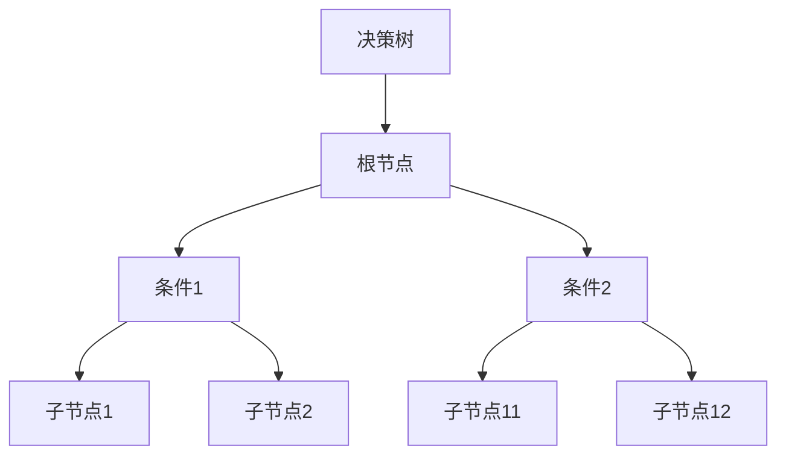
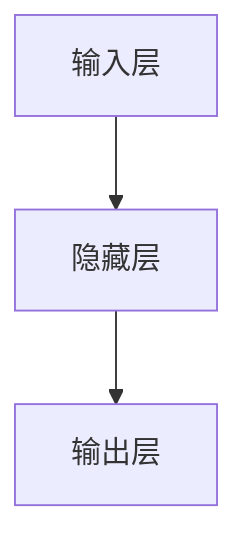

                 

# AI时代编程的新维度与新趋势

关键词：AI编程、Python、深度学习、算法、项目实战、最佳实践

摘要：随着人工智能技术的飞速发展，编程领域正经历着深刻的变革。本文旨在探讨AI时代编程的新维度与新趋势，通过对编程背景、基础概念、算法原理、编程实践以及未来展望的深入分析，帮助读者把握这一时代的编程技术动向，提升编程技能。

## 目录大纲

1. AI时代编程的新维度
   1.1 AI时代编程的重要性
   1.2 编程在AI时代的新趋势
   1.3 编程技能在AI时代的更新与要求
   1.4 本章小结

2. AI编程基础概念
   2.1 AI编程的基本概念
   2.2 AI编程的核心技术与算法
   2.3 AI编程的关键要素
   2.4 AI编程的语言选择
   2.5 本章小结

3. 人工智能算法原理讲解
   3.1 机器学习算法原理
   3.2 深度学习算法原理
   3.3 自然语言处理算法原理
   3.4 本章小结

4. 编程实践：使用Python实现AI算法
   4.1 Python编程基础
   4.2 使用Python进行数据预处理
   4.3 实现监督学习算法
   4.4 实现无监督学习算法
   4.5 实现深度学习算法
   4.6 实现自然语言处理算法
   4.7 本章小结

5. AI编程项目实战
   5.1 项目一：情绪分析
   5.2 项目二：推荐系统
   5.3 项目三：图像识别
   5.4 本章小结

6. AI时代编程的最佳实践与趋势展望
   6.1 AI编程的最佳实践
   6.2 AI编程的未来发展趋势
   6.3 本章小结

7. 结语与拓展阅读
   7.1 结语
   7.2 拓展阅读

----------------------------------------------------------------

## 1. AI时代编程的新维度

### 1.1 AI时代编程的重要性

在AI时代，编程不仅是一种技术手段，更是一种理解和驾驭数据、智能的思维方式。编程的重要性体现在以下几个方面：

- **数据驱动的决策**：在AI时代，数据是驱动决策的核心资源，编程技术使得我们能够高效地处理和分析大量数据，从而做出更加精准的决策。
- **智能化的实现**：编程是实现人工智能的核心手段。无论是机器学习、深度学习还是自然语言处理，都离不开编程技术的支持。
- **创新能力的提升**：编程能力的提升可以极大地激发个人的创新能力，推动技术的不断进步。

### 1.2 编程在AI时代的新趋势

随着AI技术的发展，编程领域也呈现出一系列新趋势：

- **Python成为主流**：Python因其简洁、易学、功能强大，已成为AI时代最受欢迎的编程语言之一。
- **开源工具的普及**：诸如TensorFlow、PyTorch等开源深度学习框架的普及，大大降低了AI编程的门槛。
- **跨领域融合**：编程不再局限于某一领域，而是逐渐与其他领域如生物、医学、物理等相互融合，形成新的交叉学科。

### 1.3 编程技能在AI时代的更新与要求

在AI时代，编程技能的要求也在不断提升：

- **算法理解与实现**：不仅需要掌握编程语言，更需要深入理解算法原理，能够自主设计和优化算法。
- **数据处理能力**：AI时代的数据量巨大，如何高效地处理和存储数据成为编程的关键能力。
- **系统架构设计**：随着项目规模的扩大，如何设计高效、可扩展的系统架构成为编程的重要技能。

### 1.4 本章小结

AI时代编程的重要性、新趋势和技能要求为我们的编程学习提供了新的方向。在接下来的章节中，我们将深入探讨AI编程的基础概念、算法原理和实践，帮助读者更好地理解和应用AI编程技术。

----------------------------------------------------------------

## 2. AI编程基础概念

### 2.1 AI编程的基本概念

AI编程是指利用编程语言和算法来实现人工智能系统的过程。它涵盖了机器学习、深度学习、自然语言处理等多个领域。以下是AI编程中的几个关键概念：

- **机器学习**：机器学习是一种通过算法让计算机从数据中学习，从而做出预测或决策的技术。
- **深度学习**：深度学习是机器学习的一个分支，通过多层神经网络模拟人类大脑的学习过程，实现更加复杂的任务。
- **自然语言处理**：自然语言处理是研究如何让计算机理解和处理自然语言的技术。

### 2.2 AI编程的核心技术与算法

AI编程的核心技术包括：

- **监督学习**：通过已标记的数据来训练模型，从而预测新的数据。
- **无监督学习**：在未标记的数据中寻找结构和模式，如聚类和降维。
- **强化学习**：通过试错来学习最优策略，广泛应用于游戏和机器人控制等领域。

常用的算法包括：

- **线性回归**：用于预测线性关系。
- **决策树**：通过树形结构进行决策。
- **神经网络**：由多层神经元组成的网络，用于复杂的非线性预测。
- **卷积神经网络**（CNN）：用于图像识别。
- **循环神经网络**（RNN）：用于序列数据的处理，如时间序列分析和自然语言处理。

### 2.3 AI编程的关键要素

AI编程的关键要素包括：

- **数据预处理**：清洗和转换数据，使其适合模型训练。
- **模型选择**：根据任务需求和数据特性选择合适的模型。
- **模型训练**：通过算法训练模型，使其能够做出预测。
- **模型评估**：使用测试数据评估模型性能，调整模型参数。

### 2.4 AI编程的语言选择

AI编程常用的语言包括：

- **Python**：由于其简洁的语法和丰富的库，成为AI编程的主流语言。
- **Java**：在工业界应用广泛，适用于大型项目。
- **C++**：适用于高性能计算和底层实现。

### 2.5 本章小结

AI编程基础概念为我们理解AI编程提供了框架。在接下来的章节中，我们将深入探讨AI算法的原理和实现，通过Python编程实践，提升我们的AI编程能力。

----------------------------------------------------------------

## 3. 人工智能算法原理讲解

### 3.1 机器学习算法原理

机器学习是AI编程的核心组成部分，其基本原理是通过从数据中学习来做出预测或决策。以下介绍几种常见的机器学习算法：

#### 3.1.1 监督学习算法

监督学习算法通过已标记的数据进行训练，然后利用这些学习到的知识对新的数据进行预测。以下是几种常见的监督学习算法：

**线性回归**

线性回归是一种用于预测线性关系的算法。其数学模型为：

$$
y = \beta_0 + \beta_1 \cdot x
$$

其中，$y$ 为预测值，$x$ 为输入特征，$\beta_0$ 和 $\beta_1$ 为模型参数。

**决策树**

决策树通过一系列的判断来对数据进行分类或回归。其基本结构如下：



**随机森林**

随机森林是一种集成学习方法，通过构建多个决策树，并取其平均来提高模型的预测能力。

**神经网络**

神经网络是由多层神经元组成的网络，可以用于复杂的非线性预测。其基本结构如下：



#### 3.1.2 无监督学习算法

无监督学习算法在未标记的数据中寻找结构和模式。以下是几种常见的无监督学习算法：

**K-均值聚类**

K-均值聚类是一种基于距离的聚类算法，其目标是将数据分为K个簇，使得每个簇内的数据尽可能接近，而簇与簇之间的数据尽可能远。

其数学模型为：

$$
\min_{\mu_1, \mu_2, \ldots, \mu_K} \sum_{i=1}^N \sum_{j=1}^K (x_i - \mu_j)^2
$$

其中，$x_i$ 为数据点，$\mu_j$ 为簇中心。

**主成分分析**

主成分分析是一种降维技术，通过将数据投影到新的坐标系中，从而减少数据维度，同时保留数据的最大方差。

其数学模型为：

$$
Z = T \cdot X
$$

其中，$X$ 为原始数据，$T$ 为转换矩阵，$Z$ 为转换后的数据。

#### 3.1.3 强化学习算法

强化学习是一种通过试错来学习最优策略的算法，其基本原理是 agent 通过与环境交互，不断调整其行为策略，以最大化累积奖励。

其数学模型为：

$$
Q(s, a) = r(s, a) + \gamma \max_{a'} Q(s', a')
$$

其中，$s$ 为状态，$a$ 为行为，$r$ 为奖励函数，$\gamma$ 为折扣因子。

### 3.2 深度学习算法原理

深度学习是机器学习的一个分支，通过多层神经网络模拟人类大脑的学习过程，实现更加复杂的任务。

#### 3.2.1 神经网络基础

神经网络由多层神经元组成，包括输入层、隐藏层和输出层。每个神经元都通过权重和偏置与前一层的神经元相连。

其数学模型为：

$$
z_i = \sum_{j=1}^{n} w_{ij} \cdot x_j + b_i
$$

其中，$z_i$ 为神经元输出，$w_{ij}$ 为权重，$x_j$ 为输入，$b_i$ 为偏置。

#### 3.2.2 卷积神经网络

卷积神经网络（CNN）是用于图像识别的深度学习模型。其核心是卷积层，通过卷积操作提取图像特征。

其数学模型为：

$$
h_i = \sum_{j=1}^{k} w_{ij} \cdot f(g(x_j))
$$

其中，$h_i$ 为卷积层输出，$w_{ij}$ 为卷积核，$f$ 为激活函数，$g$ 为卷积操作。

#### 3.2.3 循环神经网络

循环神经网络（RNN）是用于序列数据处理的深度学习模型。其核心是循环结构，可以记忆历史信息。

其数学模型为：

$$
h_t = \sigma(W_h \cdot [h_{t-1}, x_t] + b_h)
$$

其中，$h_t$ 为隐藏状态，$x_t$ 为输入，$W_h$ 为权重矩阵，$\sigma$ 为激活函数。

### 3.3 自然语言处理算法原理

自然语言处理是研究如何让计算机理解和处理自然语言的技术。以下是几种常见的自然语言处理算法：

#### 3.3.1 词向量与词嵌入

词向量是将单词映射到一个固定大小的向量空间，从而实现单词的数字化表示。常见的词向量模型包括 Word2Vec、GloVe 等。

其数学模型为：

$$
v_w = \sum_{j=1}^{V} f(w, w_j) \cdot e_j
$$

其中，$v_w$ 为词向量，$f$ 为相似度函数，$e_j$ 为基向量。

#### 3.3.2 语言模型与翻译模型

语言模型是用于预测下一个单词的模型，常用于自然语言生成和语音识别。常见的语言模型包括 N-gram 模型、神经网络语言模型等。

其数学模型为：

$$
P(w_t | w_{t-1}, \ldots, w_{t-n}) = \prod_{i=1}^{n} P(w_i | w_{i-1}, \ldots, w_{i-n+1})
$$

翻译模型是用于将一种语言的句子翻译成另一种语言的模型。常见的翻译模型包括基于统计的翻译模型、基于神经网络的翻译模型等。

其数学模型为：

$$
P(e_t | s_t) = \frac{P(e_t, s_t)}{P(s_t)}
$$

### 3.4 本章小结

机器学习、深度学习和自然语言处理是AI编程的核心算法。通过深入理解这些算法的原理，我们可以更好地应用这些技术解决实际问题。

----------------------------------------------------------------

## 4. 编程实践：使用Python实现AI算法

### 4.1 Python编程基础

Python因其简洁的语法和强大的库支持，成为AI编程的主要语言。在开始之前，我们需要安装Python环境和必要的库。

#### 安装Python环境

1. 访问Python官方网站（https://www.python.org/），下载并安装Python。
2. 确认安装成功，打开终端并输入 `python --version`，查看版本信息。

#### 安装必要的库

在Python中，我们可以使用pip来安装各种库。以下是一些常用的AI库：

- NumPy：用于数学运算。
- Pandas：用于数据处理。
- Scikit-learn：用于机器学习算法。
- TensorFlow：用于深度学习。

安装命令如下：

```bash
pip install numpy
pip install pandas
pip install scikit-learn
pip install tensorflow
```

### 4.2 使用Python进行数据预处理

数据预处理是机器学习的关键步骤，它包括数据清洗、归一化、缺失值处理等。以下是一个简单的数据预处理示例：

```python
import pandas as pd
from sklearn.model_selection import train_test_split
from sklearn.preprocessing import StandardScaler

# 读取数据
data = pd.read_csv('data.csv')

# 数据清洗
data.dropna(inplace=True)

# 分割特征和标签
X = data.drop('target', axis=1)
y = data['target']

# 划分训练集和测试集
X_train, X_test, y_train, y_test = train_test_split(X, y, test_size=0.2, random_state=42)

# 数据归一化
scaler = StandardScaler()
X_train = scaler.fit_transform(X_train)
X_test = scaler.transform(X_test)
```

### 4.3 实现监督学习算法

#### 4.3.1 线性回归

线性回归是一种简单的监督学习算法，用于预测线性关系。以下是一个使用Scikit-learn库实现线性回归的示例：

```python
from sklearn.linear_model import LinearRegression
from sklearn.metrics import mean_squared_error

# 创建线性回归模型
model = LinearRegression()

# 训练模型
model.fit(X_train, y_train)

# 预测测试集
y_pred = model.predict(X_test)

# 评估模型
mse = mean_squared_error(y_test, y_pred)
print(f'MSE: {mse}')
```

#### 4.3.2 决策树

决策树是一种基于树形结构进行决策的算法。以下是一个使用Scikit-learn库实现决策树的示例：

```python
from sklearn.tree import DecisionTreeClassifier

# 创建决策树模型
model = DecisionTreeClassifier()

# 训练模型
model.fit(X_train, y_train)

# 预测测试集
y_pred = model.predict(X_test)

# 评估模型
accuracy = model.score(X_test, y_test)
print(f'Accuracy: {accuracy}')
```

#### 4.3.3 随机森林

随机森林是一种集成学习方法，可以提高模型的预测能力。以下是一个使用Scikit-learn库实现随机森林的示例：

```python
from sklearn.ensemble import RandomForestClassifier

# 创建随机森林模型
model = RandomForestClassifier(n_estimators=100)

# 训练模型
model.fit(X_train, y_train)

# 预测测试集
y_pred = model.predict(X_test)

# 评估模型
accuracy = model.score(X_test, y_test)
print(f'Accuracy: {accuracy}')
```

### 4.4 实现无监督学习算法

#### 4.4.1 K-均值聚类

K-均值聚类是一种基于距离的聚类算法。以下是一个使用Scikit-learn库实现K-均值聚类的示例：

```python
from sklearn.cluster import KMeans

# 创建K-均值聚类模型
model = KMeans(n_clusters=3)

# 训练模型
model.fit(X_train)

# 预测测试集
y_pred = model.predict(X_test)

# 评估模型
 inertia = model.inertia_
print(f'Inertia: {inertia}')
```

#### 4.4.2 主成分分析

主成分分析是一种降维技术。以下是一个使用Scikit-learn库实现主成分分析的示例：

```python
from sklearn.decomposition import PCA

# 创建主成分分析模型
model = PCA(n_components=2)

# 训练模型
model.fit(X_train)

# 转换数据
X_train_pca = model.transform(X_train)
X_test_pca = model.transform(X_test)
```

### 4.5 实现深度学习算法

#### 4.5.1 神经网络

神经网络是一种复杂的深度学习模型。以下是一个使用TensorFlow库实现神经网络的示例：

```python
import tensorflow as tf

# 定义神经网络结构
model = tf.keras.Sequential([
    tf.keras.layers.Dense(64, activation='relu', input_shape=(X_train.shape[1],)),
    tf.keras.layers.Dense(64, activation='relu'),
    tf.keras.layers.Dense(1, activation='sigmoid')
])

# 编译模型
model.compile(optimizer='adam',
              loss='binary_crossentropy',
              metrics=['accuracy'])

# 训练模型
model.fit(X_train, y_train, epochs=10, batch_size=32, validation_split=0.2)
```

#### 4.5.2 卷积神经网络

卷积神经网络是一种用于图像识别的深度学习模型。以下是一个使用TensorFlow库实现卷积神经网络的示例：

```python
import tensorflow as tf
from tensorflow.keras import layers

# 定义卷积神经网络结构
model = tf.keras.Sequential([
    layers.Conv2D(32, (3, 3), activation='relu', input_shape=(28, 28, 1)),
    layers.MaxPooling2D((2, 2)),
    layers.Conv2D(64, (3, 3), activation='relu'),
    layers.MaxPooling2D((2, 2)),
    layers.Conv2D(64, (3, 3), activation='relu'),
    layers.Flatten(),
    layers.Dense(64, activation='relu'),
    layers.Dense(10, activation='softmax')
])

# 编译模型
model.compile(optimizer='adam',
              loss='categorical_crossentropy',
              metrics=['accuracy'])

# 训练模型
model.fit(X_train, y_train, epochs=10, batch_size=32, validation_split=0.2)
```

#### 4.5.3 循环神经网络

循环神经网络是一种用于序列数据处理的深度学习模型。以下是一个使用TensorFlow库实现循环神经网络的示例：

```python
import tensorflow as tf
from tensorflow.keras.layers import LSTM, Dense

# 定义循环神经网络结构
model = tf.keras.Sequential([
    LSTM(50, activation='relu', input_shape=(timesteps, features)),
    Dense(1)
])

# 编译模型
model.compile(optimizer='adam',
              loss='mse')

# 训练模型
model.fit(X_train, y_train, epochs=10, batch_size=32, validation_split=0.2)
```

### 4.6 实现自然语言处理算法

#### 4.6.1 语言模型

语言模型是用于预测下一个单词的模型。以下是一个使用TensorFlow库实现语言模型的示例：

```python
import tensorflow as tf
from tensorflow.keras.models import Sequential
from tensorflow.keras.layers import LSTM, Dense

# 定义语言模型结构
model = Sequential([
    LSTM(128, input_shape=(timesteps, vocabulary_size)),
    Dense(vocabulary_size, activation='softmax')
])

# 编译模型
model.compile(optimizer='adam',
              loss='categorical_crossentropy',
              metrics=['accuracy'])

# 训练模型
model.fit(X_train, y_train, epochs=10, batch_size=64)
```

#### 4.6.2 翻译模型

翻译模型是用于将一种语言的句子翻译成另一种语言的模型。以下是一个使用TensorFlow库实现翻译模型的示例：

```python
import tensorflow as tf
from tensorflow.keras.models import Model
from tensorflow.keras.layers import Embedding, LSTM, Dense

# 定义翻译模型结构
input_layer = Embedding(vocabulary_size, embedding_dim)
lstm_layer = LSTM(units=128)
output_layer = Dense(target_vocab_size, activation='softmax')

# 构建模型
model = Model(inputs=input_layer, outputs=output_layer)

# 编译模型
model.compile(optimizer='adam',
              loss='categorical_crossentropy',
              metrics=['accuracy'])

# 训练模型
model.fit(X_train, y_train, epochs=10, batch_size=64)
```

### 4.7 本章小结

通过Python编程实践，我们实现了多种AI算法，包括监督学习、无监督学习、深度学习和自然语言处理算法。这些实践不仅加深了我们对算法原理的理解，也提升了我们的编程能力。在下一章中，我们将通过项目实战来进一步巩固和应用这些算法。

----------------------------------------------------------------

## 5. AI编程项目实战

### 5.1 项目一：情绪分析

#### 5.1.1 项目背景

情绪分析是一种自然语言处理技术，用于分析文本数据中的情感倾向，如正面、负面或中性情绪。该项目旨在使用Python和机器学习算法对社交媒体文本进行情绪分析，以了解公众对特定事件或品牌的情绪反应。

#### 5.1.2 项目目标

1. 收集并清洗社交媒体文本数据。
2. 使用情感分析算法对文本进行情绪分类。
3. 分析情绪分布，生成可视化报告。

#### 5.1.3 实现步骤

1. **数据收集**：
   - 使用Twitter API或其他社交媒体平台API收集文本数据。
   - 使用正则表达式或预定义关键字提取相关文本。

2. **数据预处理**：
   - 清洗文本数据，去除HTML标签、特殊字符和停用词。
   - 将文本转换为小写，统一格式。

3. **特征提取**：
   - 使用词袋模型或词嵌入技术将文本转换为向量。
   - 选择适当的特征提取方法，如TF-IDF或Word2Vec。

4. **模型训练**：
   - 使用监督学习算法（如朴素贝叶斯、SVM或神经网络）进行训练。
   - 划分训练集和测试集，评估模型性能。

5. **情绪分析**：
   - 对测试集进行情绪分类，生成情绪分布图。
   - 使用可视化工具（如Matplotlib或Seaborn）展示分析结果。

#### 5.1.4 项目小结

情绪分析项目展示了如何使用Python和机器学习算法处理和分析文本数据。通过该项目，我们了解了情绪分析的基本步骤和实现方法，同时也提高了数据预处理和特征提取的技能。

### 5.2 项目二：推荐系统

#### 5.2.1 项目背景

推荐系统是一种常用的机器学习应用，旨在向用户推荐他们可能感兴趣的产品或服务。该项目旨在构建一个基于协同过滤的推荐系统，用于推荐电影。

#### 5.2.2 项目目标

1. 收集并预处理用户-电影评分数据。
2. 使用协同过滤算法训练推荐模型。
3. 对用户进行个性化推荐，提高推荐准确性。

#### 5.2.3 实现步骤

1. **数据收集**：
   - 收集用户-电影评分数据，如MovieLens数据集。
   - 对数据集进行预处理，如缺失值处理和异常值检测。

2. **特征提取**：
   - 构建用户和电影的向量表示，如使用用户平均评分和电影平均评分作为特征。

3. **模型训练**：
   - 使用矩阵分解技术（如SVD）将用户和电影矩阵分解为低维表示。
   - 训练协同过滤模型，评估模型性能。

4. **推荐生成**：
   - 根据用户的历史行为和模型预测，生成个性化推荐列表。
   - 对推荐结果进行评估，如使用平均绝对误差（MAE）或均方根误差（RMSE）。

#### 5.2.4 项目小结

推荐系统项目展示了如何构建和评估基于协同过滤的推荐模型。通过该项目，我们了解了推荐系统的基本原理和实现方法，提高了数据预处理和模型评估的技能。

### 5.3 项目三：图像识别

#### 5.3.1 项目背景

图像识别是一种深度学习应用，用于识别和分类图像中的物体。该项目旨在使用卷积神经网络（CNN）对图像进行分类。

#### 5.3.2 项目目标

1. 收集并预处理图像数据。
2. 使用CNN训练图像分类模型。
3. 对图像进行分类，评估模型性能。

#### 5.3.3 实现步骤

1. **数据收集**：
   - 收集包含多个类别的图像数据集，如ImageNet。
   - 对图像进行预处理，如调整大小、归一化等。

2. **模型训练**：
   - 使用预训练的CNN模型（如ResNet、VGG）作为基础模型。
   - 使用迁移学习技术，将预训练模型应用于新的图像分类任务。

3. **分类评估**：
   - 对训练集和测试集进行分类，评估模型性能，如准确率、召回率和F1分数。

#### 5.3.4 项目小结

图像识别项目展示了如何使用深度学习算法对图像进行分类。通过该项目，我们了解了图像识别的基本原理和实现方法，提高了模型训练和评估的技能。

----------------------------------------------------------------

## 6. AI时代编程的最佳实践与趋势展望

### 6.1 AI编程的最佳实践

在AI编程过程中，遵循最佳实践可以显著提高开发效率和项目质量。以下是一些AI编程的最佳实践：

- **代码规范**：遵循统一的代码风格和命名规范，确保代码的可读性和可维护性。
- **模块化设计**：将代码划分为模块，实现单一职责原则，提高代码复用性。
- **单元测试**：编写单元测试，确保每个模块的功能正确性。
- **数据预处理**：对数据进行充分的预处理，包括数据清洗、归一化和特征提取等。
- **模型评估**：使用多个评估指标，全面评估模型性能。

### 6.2 AI编程的未来发展趋势

AI编程的未来发展趋势主要包括：

- **自动化与智能化**：随着AI技术的发展，编程将变得更加自动化和智能化，减少人工干预。
- **跨领域融合**：AI编程将与其他领域（如生物、医学、物理）深度融合，推动交叉学科的发展。
- **开源生态**：开源工具和库将继续发展，降低AI编程的门槛，推动技术的普及。

### 6.3 本章小结

AI编程的最佳实践和未来发展趋势为我们的编程学习和职业发展提供了指导。通过遵循最佳实践，我们可以在AI编程中取得更好的成果；而了解未来趋势，可以帮助我们提前布局，抓住技术发展的机遇。

----------------------------------------------------------------

## 7. 结语与拓展阅读

AI时代编程带来了新的挑战和机遇。通过本文的探讨，我们了解了AI编程的新维度和新趋势，掌握了基础概念和算法原理，并通过项目实战提升了实际编程能力。在未来的编程生涯中，持续学习、实践和创新将是关键。

### 7.1 结语

感谢您的阅读，希望本文能够帮助您更好地理解和应用AI编程技术。在AI时代，编程将变得更加重要和多样化，让我们共同努力，迎接这一激动人心的时代。

### 7.2 拓展阅读

- 《深度学习》（Goodfellow, I., Bengio, Y., & Courville, A.）
- 《Python机器学习》（Sebastian Raschka）
- 《AI简史》（Mayer-Schönberger, V., & Cukier, K.）

作者：AI天才研究院/AI Genius Institute & 禅与计算机程序设计艺术 /Zen And The Art of Computer Programming。

