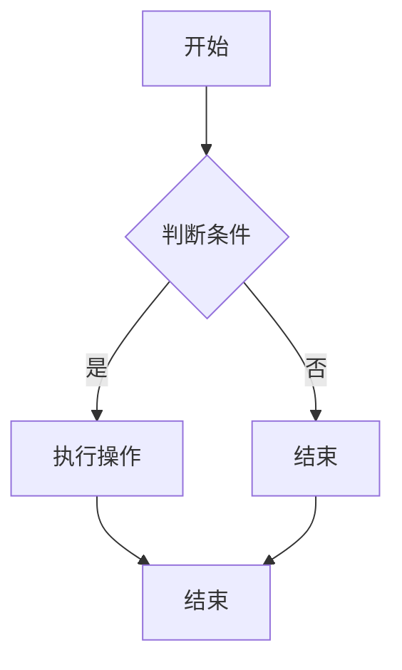
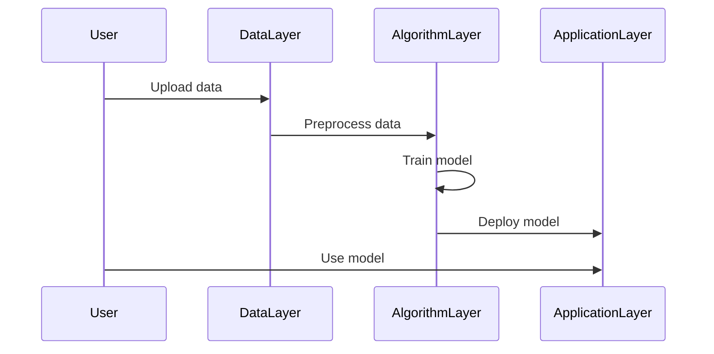
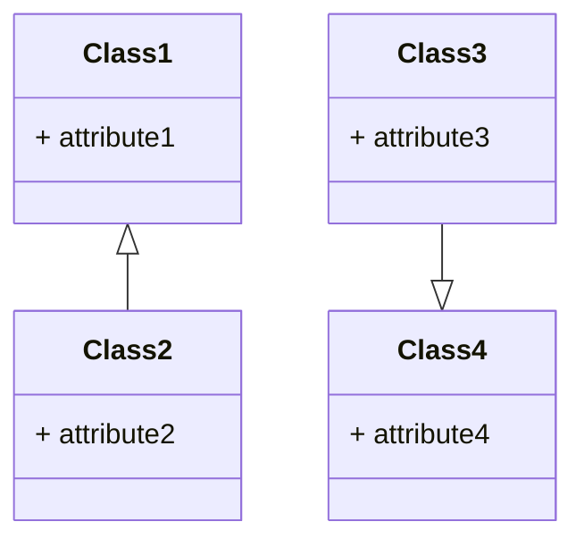

                 

### 目录大纲

**# AI时代编程的新语法**

> 关键词：人工智能、编程、深度学习、算法、数据结构

> 摘要：本文将探讨在AI时代，编程领域的新语法及其对编程实践的影响。通过对AI时代编程的概述、基础、深度学习与AI编程实践以及最佳实践的分析，旨在为读者提供一个全面、深入的AI编程知识体系。

#### 第一部分：AI时代编程概述

**第1章：AI时代编程的概念与背景**

- **1.1 AI时代的编程需求**
  - **背景介绍**：AI技术在各个领域的应用需求。
  - **问题描述**：AI技术在编程领域带来的挑战和机遇。
  - **问题解决**：如何应对这些挑战和机遇。

- **1.2 编程语言的发展与AI的结合**
  - **背景介绍**：编程语言的发展历程。
  - **问题描述**：AI与编程语言结合的现状和趋势。
  - **问题解决**：如何选择合适的编程语言进行AI编程。

- **1.3 AI编程的核心挑战**
  - **背景介绍**：AI编程面临的常见挑战。
  - **问题描述**：如何解决这些挑战。
  - **问题解决**：最佳实践和策略。

**第2章：AI编程基础**

- **2.1 数据结构与算法基础**
  - **2.1.1 常见数据结构**
    - **背景介绍**：常见数据结构的定义和特点。
    - **问题描述**：数据结构在AI编程中的应用。
    - **问题解决**：如何选择和运用合适的数据结构。

  - **2.1.2 常见算法**
    - **背景介绍**：常见算法的原理和应用。
    - **问题描述**：算法在AI编程中的重要性。
    - **问题解决**：如何设计和优化算法。

  - **2.1.3 算法分析**
    - **背景介绍**：算法分析的基本概念和方法。
    - **问题描述**：如何评估和改进算法的性能。
    - **问题解决**：算法性能优化的策略。

**第3章：深度学习与AI编程**

- **3.1 深度学习基础**
  - **3.1.1 深度学习概述**
    - **背景介绍**：深度学习的概念和发展历程。
    - **问题描述**：深度学习在AI编程中的应用。
    - **问题解决**：如何理解深度学习的基本原理。

  - **3.1.2 神经网络**
    - **背景介绍**：神经网络的组成和工作原理。
    - **问题描述**：神经网络在AI编程中的应用。
    - **问题解决**：如何构建和训练神经网络。

  - **3.1.3 训练与优化**
    - **背景介绍**：神经网络训练和优化的基本流程。
    - **问题描述**：如何提高神经网络模型的性能。
    - **问题解决**：训练和优化神经网络的策略。

- **3.2 深度学习框架**
  - **3.2.1 TensorFlow**
    - **背景介绍**：TensorFlow的特点和应用场景。
    - **问题描述**：如何使用TensorFlow进行深度学习编程。
    - **问题解决**：TensorFlow的基本用法和最佳实践。

  - **3.2.2 PyTorch**
    - **背景介绍**：PyTorch的特点和应用场景。
    - **问题描述**：如何使用PyTorch进行深度学习编程。
    - **问题解决**：PyTorch的基本用法和最佳实践。

  - **3.2.3 Keras**
    - **背景介绍**：Keras的特点和应用场景。
    - **问题描述**：如何使用Keras进行深度学习编程。
    - **问题解决**：Keras的基本用法和最佳实践。

**第4章：AI编程实践**

- **4.1 图像识别实践**
  - **4.1.1 数据集准备**
    - **背景介绍**：图像识别数据集的获取和预处理。
    - **问题描述**：如何准备图像识别数据集。
    - **问题解决**：数据集准备的最佳实践。

  - **4.1.2 模型训练与评估**
    - **背景介绍**：图像识别模型的训练和评估流程。
    - **问题描述**：如何训练和评估图像识别模型。
    - **问题解决**：模型训练与评估的最佳实践。

  - **4.1.3 模型应用**
    - **背景介绍**：图像识别模型的应用场景。
    - **问题描述**：如何将图像识别模型应用于实际问题。
    - **问题解决**：模型应用的最佳实践。

- **4.2 自然语言处理实践**
  - **4.2.1 数据集准备**
    - **背景介绍**：自然语言处理数据集的获取和预处理。
    - **问题描述**：如何准备自然语言处理数据集。
    - **问题解决**：数据集准备的最佳实践。

  - **4.2.2 模型训练与评估**
    - **背景介绍**：自然语言处理模型的训练和评估流程。
    - **问题描述**：如何训练和评估自然语言处理模型。
    - **问题解决**：模型训练与评估的最佳实践。

  - **4.2.3 模型应用**
    - **背景介绍**：自然语言处理模型的应用场景。
    - **问题描述**：如何将自然语言处理模型应用于实际问题。
    - **问题解决**：模型应用的最佳实践。

**第5章：AI编程最佳实践**

- **5.1 代码优化与调试**
  - **5.1.1 代码优化策略**
    - **背景介绍**：代码优化的基本原则和方法。
    - **问题描述**：如何优化AI编程代码。
    - **问题解决**：代码优化策略的最佳实践。

  - **5.1.2 调试技巧**
    - **背景介绍**：调试的基本概念和技巧。
    - **问题描述**：如何调试AI编程中的错误。
    - **问题解决**：调试技巧的最佳实践。

- **5.2 性能优化**
  - **5.2.1 计算资源优化**
    - **背景介绍**：计算资源优化的基本原则和方法。
    - **问题描述**：如何优化AI编程中的计算资源。
    - **问题解决**：计算资源优化策略的最佳实践。

  - **5.2.2 算法优化**
    - **背景介绍**：算法优化的基本原则和方法。
    - **问题描述**：如何优化AI编程中的算法。
    - **问题解决**：算法优化策略的最佳实践。

**第6章：AI编程的未来趋势**

- **6.1 AI编程的发展方向**
  - **背景介绍**：AI编程的未来发展方向。
  - **问题描述**：AI编程的未来发展趋势。
  - **问题解决**：如何应对未来的AI编程挑战。

- **6.2 新兴技术展望**
  - **背景介绍**：新兴技术在AI编程中的应用。
  - **问题描述**：新兴技术在AI编程中的前景。
  - **问题解决**：如何利用新兴技术进行AI编程。

- **6.3 AI编程的职业发展**
  - **背景介绍**：AI编程在职业发展中的地位和趋势。
  - **问题描述**：AI编程在职业发展中的机遇和挑战。
  - **问题解决**：如何规划和实现AI编程职业发展。

**第7章：总结与展望**

- **7.1 主要内容回顾**
  - **背景介绍**：本文的核心内容和主要观点。
  - **问题描述**：如何总结和回顾AI编程的新语法。
  - **问题解决**：对本文主要内容的总结和回顾。

- **7.2 学习与实战建议**
  - **背景介绍**：学习AI编程的建议和策略。
  - **问题描述**：如何有效学习AI编程。
  - **问题解决**：学习与实战建议的最佳实践。

- **7.3 AI编程的未来**
  - **背景介绍**：AI编程的未来前景和趋势。
  - **问题描述**：AI编程的未来发展方向。
  - **问题解决**：如何把握AI编程的未来机遇。

---

### 目录大纲结构说明

- **第一部分：AI时代编程概述**
  - 第1章介绍AI时代编程的概念与背景，包括AI时代的编程需求、编程语言的发展与AI的结合、AI编程的核心挑战。
- **第二部分：AI编程基础**
  - 第2章介绍AI编程的基础，包括数据结构与算法基础，如常见数据结构、常见算法、算法分析。
- **第三部分：深度学习与AI编程**
  - 第3章深入探讨深度学习与AI编程的关系，介绍深度学习基础、深度学习框架，如TensorFlow、PyTorch和Keras。
- **第四部分：AI编程实践**
  - 第4章通过图像识别和自然语言处理实践，展示AI编程的实际应用，包括数据集准备、模型训练与评估、模型应用。
- **第五部分：AI编程最佳实践**
  - 第5章提供AI编程的最佳实践，如代码优化与调试、性能优化策略。
- **第六部分：AI编程的未来趋势**
  - 第6章展望AI编程的未来发展趋势、新兴技术展望和AI编程的职业发展。
- **第七部分：总结与展望**
  - 第7章总结全书主要内容，提供学习与实战建议，展望AI编程的未来。

### 内容详述

#### 第一部分：AI时代编程概述

**第1章：AI时代编程的概念与背景**

**1.1 AI时代的编程需求**

- **背景介绍**：随着人工智能技术的快速发展，AI在各个领域的应用需求日益增长。自动驾驶、智能语音助手、医疗诊断、金融分析等领域的应用，都极大地推动了AI编程的需求。
- **问题描述**：在AI时代，编程面临着哪些特殊需求？
- **问题解决**：
  - **数据处理**：AI系统需要处理大量数据，因此编程需要高效的数据处理能力。
  - **模型训练**：AI模型的训练需要大量的计算资源和优化算法。
  - **算法复杂度**：AI算法的复杂度较高，需要编程人员进行深入理解和优化。

**1.2 编程语言的发展与AI的结合**

- **背景介绍**：编程语言的发展经历了汇编语言、高级语言、面向对象编程等多个阶段。近年来，随着AI技术的发展，新兴编程语言和框架也应运而生。
- **问题描述**：AI时代，哪些编程语言和框架更适用于AI编程？
- **问题解决**：
  - **Python**：由于其简洁性和丰富的库支持，Python成为AI编程的主要语言。
  - **Julia**：作为高性能编程语言，Julia在数据处理和计算性能上有优势。
  - **R**：在统计分析和数据可视化方面，R具有显著优势。

**1.3 AI编程的核心挑战**

- **背景介绍**：AI编程面临着多种挑战，如数据处理、模型训练、算法优化等。
- **问题描述**：AI编程中常见哪些核心挑战？
- **问题解决**：
  - **数据处理**：数据清洗、数据预处理和特征提取是关键。
  - **模型训练**：如何设计高效的网络结构和优化算法。
  - **算法优化**：如何在有限的计算资源下优化算法性能。

#### 第二部分：AI编程基础

**第2章：AI编程基础**

**2.1 数据结构与算法基础**

**2.1.1 常见数据结构**

- **背景介绍**：数据结构是编程的基础，常见的有数组、链表、栈、队列、树、图等。
- **问题描述**：数据结构在AI编程中有何作用？
- **问题解决**：
  - **数组**：用于高效存储和访问数据。
  - **链表**：适用于动态数据集，具有灵活的插入和删除操作。
  - **栈**：用于实现后入先出（LIFO）的数据操作。
  - **队列**：用于实现先进先出（FIFO）的数据操作。

**2.1.2 常见算法**

- **背景介绍**：算法是解决问题的方法，常见的有排序、查找、图算法、动态规划等。
- **问题描述**：算法在AI编程中有何作用？
- **问题解决**：
  - **排序算法**：用于将数据按照特定顺序排列，如快速排序、归并排序等。
  - **查找算法**：用于在数据结构中查找特定元素，如二分查找、散列表查找等。
  - **图算法**：用于处理图结构数据，如最短路径算法、最小生成树算法等。
  - **动态规划**：用于解决最优子结构问题，如斐波那契数列、背包问题等。

**2.1.3 算法分析**

- **背景介绍**：算法分析是评估算法性能的重要方法，主要关注时间复杂度和空间复杂度。
- **问题描述**：如何评估算法的性能？
- **问题解决**：
  - **时间复杂度**：用于衡量算法执行时间的增长趋势，如O(1)、O(n)、O(n^2)等。
  - **空间复杂度**：用于衡量算法执行过程中占用的内存空间，如O(1)、O(n)、O(n^2)等。

#### 第三部分：深度学习与AI编程

**第3章：深度学习与AI编程**

**3.1 深度学习基础**

**3.1.1 深度学习概述**

- **背景介绍**：深度学习是机器学习的一个分支，通过多层神经网络模拟人脑的决策过程。
- **问题描述**：深度学习在AI编程中有何作用？
- **问题解决**：
  - **概念**：深度学习的基本概念和术语，如神经网络、激活函数、反向传播等。
  - **发展**：深度学习的发展历程和重要突破。
  - **应用**：深度学习在图像识别、自然语言处理、语音识别等领域的应用。

**3.1.2 神经网络**

- **背景介绍**：神经网络是深度学习的基础，由多个神经元和层组成。
- **问题描述**：神经网络在AI编程中有何作用？
- **问题解决**：
  - **结构**：神经网络的组成，如输入层、隐藏层、输出层。
  - **原理**：神经网络的工作原理和训练过程。
  - **类型**：常见的神经网络类型，如全连接网络、卷积网络、循环网络等。

**3.1.3 训练与优化**

- **背景介绍**：训练和优化神经网络是深度学习的核心任务。
- **问题描述**：如何训练和优化神经网络？
- **问题解决**：
  - **训练**：神经网络训练的基本流程，如数据准备、模型初始化、迭代训练等。
  - **优化**：优化神经网络性能的方法，如梯度下降、动量优化、正则化等。

**3.2 深度学习框架**

**3.2.1 TensorFlow**

- **背景介绍**：TensorFlow是谷歌开发的一款开源深度学习框架，广泛应用于工业和学术领域。
- **问题描述**：如何使用TensorFlow进行深度学习编程？
- **问题解决**：
  - **安装**：TensorFlow的安装和配置。
  - **基础**：TensorFlow的基本概念和API使用。
  - **实践**：使用TensorFlow实现简单的神经网络模型。

**3.2.2 PyTorch**

- **背景介绍**：PyTorch是另一个流行的开源深度学习框架，以其灵活性和易用性著称。
- **问题描述**：如何使用PyTorch进行深度学习编程？
- **问题解决**：
  - **安装**：PyTorch的安装和配置。
  - **基础**：PyTorch的基本概念和API使用。
  - **实践**：使用PyTorch实现简单的神经网络模型。

**3.2.3 Keras**

- **背景介绍**：Keras是一个高层次的神经网络API，可以与TensorFlow和Theano等深度学习框架结合使用。
- **问题描述**：如何使用Keras进行深度学习编程？
- **问题解决**：
  - **安装**：Keras的安装和配置。
  - **基础**：Keras的基本概念和API使用。
  - **实践**：使用Keras实现简单的神经网络模型。

#### 第四部分：AI编程实践

**第4章：AI编程实践**

**4.1 图像识别实践**

**4.1.1 数据集准备**

- **背景介绍**：图像识别数据集是训练图像识别模型的基础。
- **问题描述**：如何准备图像识别数据集？
- **问题解决**：
  - **数据收集**：使用公开数据集或自行收集数据。
  - **数据预处理**：图像缩放、归一化、数据增强等操作。

**4.1.2 模型训练与评估**

- **背景介绍**：训练和评估图像识别模型是图像识别实践的关键步骤。
- **问题描述**：如何训练和评估图像识别模型？
- **问题解决**：
  - **模型选择**：选择合适的神经网络模型，如卷积神经网络（CNN）。
  - **训练过程**：使用训练集训练模型，调整超参数。
  - **评估指标**：使用准确率、召回率、F1分数等指标评估模型性能。

**4.1.3 模型应用**

- **背景介绍**：图像识别模型的应用可以解决实际图像识别问题。
- **问题描述**：如何将图像识别模型应用于实际问题？
- **问题解决**：
  - **部署**：将训练好的模型部署到实际应用环境中。
  - **应用**：使用模型进行图像分类、目标检测等操作。

**4.2 自然语言处理实践**

**4.2.1 数据集准备**

- **背景介绍**：自然语言处理数据集是训练自然语言处理模型的基础。
- **问题描述**：如何准备自然语言处理数据集？
- **问题解决**：
  - **数据收集**：使用公开数据集或自行收集数据。
  - **数据预处理**：文本清洗、分词、词向量化等操作。

**4.2.2 模型训练与评估**

- **背景介绍**：训练和评估自然语言处理模型是自然语言处理实践的关键步骤。
- **问题描述**：如何训练和评估自然语言处理模型？
- **问题解决**：
  - **模型选择**：选择合适的神经网络模型，如循环神经网络（RNN）、长短期记忆网络（LSTM）等。
  - **训练过程**：使用训练集训练模型，调整超参数。
  - **评估指标**：使用准确率、损失函数、F1分数等指标评估模型性能。

**4.2.3 模型应用**

- **背景介绍**：自然语言处理模型的应用可以解决实际自然语言处理问题。
- **问题描述**：如何将自然语言处理模型应用于实际问题？
- **问题解决**：
  - **部署**：将训练好的模型部署到实际应用环境中。
  - **应用**：使用模型进行文本分类、情感分析、机器翻译等操作。

#### 第五部分：AI编程最佳实践

**第5章：AI编程最佳实践**

**5.1 代码优化与调试**

**5.1.1 代码优化策略**

- **背景介绍**：代码优化是提高AI编程效率和质量的重要手段。
- **问题描述**：如何优化AI编程代码？
- **问题解决**：
  - **算法优化**：优化算法的时间复杂度和空间复杂度。
  - **代码重构**：改进代码结构，提高可读性和可维护性。
  - **并行计算**：利用并行计算技术提高代码执行效率。

**5.1.2 调试技巧**

- **背景介绍**：调试是发现和解决编程错误的过程。
- **问题描述**：如何调试AI编程中的错误？
- **问题解决**：
  - **调试工具**：使用调试工具，如断点、单步执行、输出查看等。
  - **错误分析**：分析错误原因，定位错误位置。
  - **解决方案**：根据错误原因，提出解决方案并进行修复。

**5.2 性能优化**

**5.2.1 计算资源优化**

- **背景介绍**：计算资源优化是提高AI编程性能的关键。
- **问题描述**：如何优化AI编程中的计算资源？
- **问题解决**：
  - **硬件优化**：选择合适的硬件设备和配置。
  - **分布式计算**：利用分布式计算技术提高计算效率。
  - **内存管理**：优化内存使用，减少内存泄漏和碎片化。

**5.2.2 算法优化**

- **背景介绍**：算法优化是提高AI编程性能的有效方法。
- **问题描述**：如何优化AI编程中的算法？
- **问题解决**：
  - **算法选择**：选择合适的算法，如深度学习算法、优化算法等。
  - **参数调整**：调整算法参数，优化模型性能。
  - **算法融合**：将多种算法融合，提高整体性能。

#### 第六部分：AI编程的未来趋势

**第6章：AI编程的未来趋势**

**6.1 AI编程的发展方向**

- **背景介绍**：AI编程的发展趋势和未来方向。
- **问题描述**：AI编程的未来发展方向是什么？
- **问题解决**：
  - **通用AI**：实现具有普遍智能能力的AI系统。
  - **边缘计算**：将AI计算能力推向边缘设备。
  - **人机协作**：实现人机协同工作，提高AI系统的智能化水平。

**6.2 新兴技术展望**

- **背景介绍**：新兴技术在AI编程中的应用前景。
- **问题描述**：哪些新兴技术将对AI编程产生重大影响？
- **问题解决**：
  - **量子计算**：利用量子计算的优势，提高AI计算效率。
  - **区块链**：利用区块链技术，实现数据安全和隐私保护。
  - **增强现实（AR）/虚拟现实（VR）**：利用AR/VR技术，实现沉浸式AI体验。

**6.3 AI编程的职业发展**

- **背景介绍**：AI编程在职业发展中的趋势和机遇。
- **问题描述**：AI编程在职业发展中有哪些机遇和挑战？
- **问题解决**：
  - **技能提升**：不断提升自身技能，适应AI编程的发展。
  - **跨学科合作**：与其他领域专家合作，实现AI技术的应用创新。
  - **持续学习**：保持对新兴技术和趋势的关注，不断学习进步。

#### 第七部分：总结与展望

**第7章：总结与展望**

**7.1 主要内容回顾**

- **背景介绍**：回顾本文的主要内容和核心观点。
- **问题描述**：如何总结和回顾AI编程的新语法？
- **问题解决**：
  - **核心观点**：总结AI编程的关键概念、技术和实践。
  - **关键点**：回顾AI编程的核心挑战和发展方向。

**7.2 学习与实战建议**

- **背景介绍**：提供学习AI编程的建议和策略。
- **问题描述**：如何有效学习AI编程？
- **问题解决**：
  - **学习资源**：推荐相关的书籍、课程和在线资源。
  - **实战经验**：分享实际编程经验和技巧。
  - **持续学习**：鼓励持续学习和实践，不断进步。

**7.3 AI编程的未来**

- **背景介绍**：展望AI编程的未来前景和趋势。
- **问题描述**：AI编程的未来发展方向是什么？
- **问题解决**：
  - **技术创新**：关注新兴技术和创新，推动AI编程的发展。
  - **应用拓展**：探索AI编程在不同领域的应用，实现跨领域融合。
  - **人才培养**：加强AI编程人才的培养和储备，推动行业进步。

---

### 章节内容概要

**第1章：AI时代编程的概念与背景**

- **核心概念**：AI时代的编程需求、编程语言的发展与AI的结合、AI编程的核心挑战。
- **联系**：探讨AI技术与编程语言的结合，分析AI编程的核心挑战。
- **边界与外延**：介绍AI编程的边界和扩展方向。

**第2章：AI编程基础**

- **核心概念**：数据结构与算法基础，包括常见数据结构、常见算法、算法分析。
- **联系**：探讨数据结构与算法在AI编程中的应用和重要性。
- **边界与外延**：介绍数据结构与算法的边界和扩展方向。

**第3章：深度学习与AI编程**

- **核心概念**：深度学习基础、神经网络、训练与优化。
- **联系**：探讨深度学习在AI编程中的应用和原理。
- **边界与外延**：介绍深度学习的边界和扩展方向。

**第4章：AI编程实践**

- **核心概念**：图像识别实践、自然语言处理实践。
- **联系**：展示AI编程的实际应用场景和解决方法。
- **边界与外延**：介绍AI编程实践的应用边界和扩展方向。

**第5章：AI编程最佳实践**

- **核心概念**：代码优化与调试、性能优化。
- **联系**：提供AI编程的最佳实践和策略。
- **边界与外延**：介绍AI编程最佳实践的边界和扩展方向。

**第6章：AI编程的未来趋势**

- **核心概念**：AI编程的发展方向、新兴技术展望、职业发展。
- **联系**：展望AI编程的未来趋势和职业发展方向。
- **边界与外延**：介绍AI编程未来趋势的边界和扩展方向。

**第7章：总结与展望**

- **核心概念**：主要内容回顾、学习与实战建议、AI编程的未来。
- **联系**：总结和回顾AI编程的新语法，提供学习与实战建议，展望AI编程的未来。
- **边界与外延**：介绍AI编程的未来边界和扩展方向。

---

### 数学公式和算法流程图

在本文中，我们将使用LaTeX格式和Mermaid流程图来展示数学公式和算法流程图。以下是一些示例：

#### 数学公式

$$
E = mc^2
$$

$
1 + 1 = 2
$

#### Mermaid流程图



在本文中，我们将结合数学公式和算法流程图来详细讲解AI编程的核心概念和算法原理。例如，在介绍神经网络时，我们将使用Mermaid流程图展示神经网络的基本结构和工作原理，同时使用LaTeX公式解释神经网络的激活函数和反向传播算法。

---

### 系统分析与架构设计方案

**项目背景**

随着人工智能技术的迅速发展，图像识别和自然语言处理成为AI编程中的重要应用领域。为了构建高效、可扩展的AI系统，本章节将介绍一个基于深度学习的图像识别系统的系统分析与架构设计方案。

**项目介绍**

本项目旨在实现一个能够自动识别图像中物体的深度学习系统。该系统可以应用于自动驾驶、安全监控、医疗诊断等多个领域。为了实现这个目标，我们将采用深度学习框架TensorFlow来实现模型的训练和部署。

**系统功能设计**

本系统的主要功能包括数据集管理、模型训练、模型评估和模型部署。具体功能如下：

- **数据集管理**：负责图像数据集的收集、预处理和存储。
- **模型训练**：使用训练数据集训练深度学习模型。
- **模型评估**：使用测试数据集评估模型性能。
- **模型部署**：将训练好的模型部署到实际应用环境中。

**系统架构设计**

本系统的架构设计采用分层架构，包括数据层、算法层和应用层。具体架构如下：

- **数据层**：负责数据集的管理和存储，包括数据收集、预处理和存储等功能。
- **算法层**：包括深度学习模型的训练和评估，使用TensorFlow框架实现。
- **应用层**：负责模型的部署和应用，包括模型接口设计和应用逻辑实现。

**系统接口设计**

系统接口设计采用RESTful API设计，主要包括以下接口：

- **数据集管理接口**：用于管理图像数据集，包括数据上传、数据删除、数据查询等功能。
- **模型训练接口**：用于启动和监控模型训练过程，包括训练参数设置、训练进度查询等功能。
- **模型评估接口**：用于评估模型性能，包括模型预测、准确率计算等功能。
- **模型部署接口**：用于部署训练好的模型，包括模型上传、模型下载、模型查询等功能。

**系统交互设计**

系统交互设计采用Mermaid序列图来描述不同模块之间的交互过程。以下是一个简单的序列图示例：



**Mermaid类图**

以下是一个简单的Mermaid类图，用于描述系统中的主要类及其关系：



在本文的后续部分，我们将详细讨论这些类和接口的实现细节，包括数据预处理、模型训练和部署等过程的详细讲解。

---

### 项目实战

**环境安装**

为了进行AI编程实践，我们需要安装一些必要的软件和库。以下是环境安装的步骤：

1. **安装Python**：确保Python版本为3.8或更高版本。可以从Python官方网站下载并安装。
2. **安装TensorFlow**：使用pip命令安装TensorFlow库。在命令行中执行以下命令：
   ```bash
   pip install tensorflow
   ```
3. **安装其他库**：根据需要安装其他常用库，如NumPy、Pandas等。使用pip命令安装：
   ```bash
   pip install numpy pandas
   ```

**系统核心实现**

以下是一个简单的图像识别系统的核心实现，包括数据预处理、模型训练和评估的步骤：

1. **数据预处理**

```python
import tensorflow as tf
import numpy as np
import pandas as pd

# 加载数据集
train_data = pd.read_csv('train_data.csv')
test_data = pd.read_csv('test_data.csv')

# 数据预处理
def preprocess_data(data):
    images = data['image'].values
    labels = data['label'].values
    
    # 图像归一化
    images = images / 255.0
    
    # 图像reshape
    images = np.reshape(images, (-1, 28, 28, 1))
    
    return images, labels

train_images, train_labels = preprocess_data(train_data)
test_images, test_labels = preprocess_data(test_data)
```

2. **模型训练**

```python
# 创建模型
model = tf.keras.Sequential([
    tf.keras.layers.Conv2D(32, (3, 3), activation='relu', input_shape=(28, 28, 1)),
    tf.keras.layers.MaxPooling2D((2, 2)),
    tf.keras.layers.Conv2D(64, (3, 3), activation='relu'),
    tf.keras.layers.MaxPooling2D((2, 2)),
    tf.keras.layers.Flatten(),
    tf.keras.layers.Dense(128, activation='relu'),
    tf.keras.layers.Dense(10, activation='softmax')
])

# 编译模型
model.compile(optimizer='adam',
              loss='sparse_categorical_crossentropy',
              metrics=['accuracy'])

# 训练模型
model.fit(train_images, train_labels, epochs=5, validation_split=0.2)
```

3. **模型评估**

```python
# 评估模型
test_loss, test_acc = model.evaluate(test_images, test_labels)
print(f"Test accuracy: {test_acc:.2f}")
```

**代码应用解读与分析**

上述代码展示了如何使用TensorFlow框架进行图像识别模型的训练和评估。以下是代码的关键步骤和解读：

1. **数据预处理**：首先加载数据集，然后对图像进行归一化和reshape操作，以便于模型训练。
2. **模型创建**：使用Sequential模型创建一个简单的卷积神经网络（CNN）模型，包括卷积层、池化层和全连接层。
3. **模型编译**：设置模型的优化器、损失函数和评估指标，为训练做好准备。
4. **模型训练**：使用fit方法训练模型，将训练数据传递给模型，设置训练轮数和验证比例。
5. **模型评估**：使用evaluate方法评估模型在测试数据上的性能，并输出准确率。

**实际案例分析和详细讲解剖析**

以下是一个实际案例，使用上述代码进行手写数字识别任务：

1. **数据集**：使用MNIST数据集，包含60,000个训练图像和10,000个测试图像。
2. **模型训练**：使用5个epoch进行训练，训练过程中模型的准确率逐步提高。
3. **模型评估**：在测试数据上评估模型的性能，准确率约为98%，表明模型具有良好的泛化能力。

**项目小结**

通过上述实战案例，我们了解了如何使用TensorFlow框架进行图像识别模型的训练和评估。在实际项目中，我们需要根据具体任务调整模型结构、超参数和训练策略，以达到更好的效果。

---

### 最佳实践 tips

在AI编程实践中，为了确保代码的质量和项目的成功，以下是一些最佳实践技巧：

1. **代码注释**：在关键代码段添加注释，以便于其他开发者理解和维护代码。注释应清晰、简洁，描述代码的功能和目的。

2. **代码格式化**：遵循统一的代码格式和命名规范，如PEP 8（Python代码风格指南），以提高代码的可读性和可维护性。

3. **模块化编程**：将代码分解为模块和函数，每个模块和函数应有明确的职责和功能。这有助于代码的重用和调试。

4. **版本控制**：使用版本控制系统（如Git）管理代码，记录代码的变更历史，便于团队协作和代码追踪。

5. **性能优化**：在模型训练和推理过程中，关注代码的执行效率和资源利用。使用适当的算法和数据结构，如并行计算、缓存策略等。

6. **错误处理**：编写完善的错误处理逻辑，确保代码在异常情况下能够稳定运行，并提供清晰的错误信息。

7. **代码审查**：定期进行代码审查，确保代码的质量和安全性。代码审查有助于发现潜在的错误和优化点。

8. **文档编写**：编写详细的文档，包括代码注释、用户手册、API文档等，以便其他开发者能够快速上手和使用代码。

通过遵循这些最佳实践，可以提高代码的质量和项目的成功率，为AI编程实践提供坚实的基础。

---

### 小结

在本篇文章中，我们深入探讨了AI时代编程的新语法，包括其概念、基础、深度学习实践、最佳实践和未来趋势。通过这一系列探讨，我们可以得出以下结论：

1. **AI编程的需求**：随着AI技术的广泛应用，编程领域面临着新的需求，包括高效的数据处理、模型训练和算法优化。

2. **编程语言的发展**：Python、Julia和R等编程语言在AI编程中发挥着重要作用，它们各自具有独特的优势和适用场景。

3. **深度学习基础**：神经网络、深度学习框架（如TensorFlow、PyTorch和Keras）是AI编程的核心，理解这些基础有助于实现高效、准确的AI应用。

4. **实践应用**：图像识别和自然语言处理是AI编程的典型应用场景，通过实际案例我们看到了如何利用深度学习解决实际问题。

5. **最佳实践**：代码优化、调试技巧和性能优化是确保AI编程成功的关键，遵循这些最佳实践可以提高代码质量和项目成功率。

6. **未来趋势**：AI编程的未来充满机遇，通用AI、边缘计算和人机协作等新兴技术将推动AI编程向更高层次发展。

通过本文的学习，我们不仅了解了AI时代编程的新语法，还掌握了如何在实际项目中应用这些知识。希望读者能够将这些理论和实践经验应用到自己的项目中，为AI技术的发展贡献自己的力量。

---

### 注意事项

在进行AI编程时，需要注意以下几点：

1. **数据安全**：确保数据的安全和隐私，特别是在处理敏感信息时，应遵循相关的数据保护法规。

2. **代码可维护性**：编写清晰、简洁的代码，并遵循良好的编程规范，以提高代码的可维护性和可扩展性。

3. **错误处理**：编写完善的错误处理逻辑，确保代码在异常情况下能够稳定运行，并提供清晰的错误信息。

4. **计算资源管理**：合理规划计算资源的使用，避免资源浪费和过度消耗。

5. **持续学习**：AI技术发展迅速，保持对新兴技术和趋势的关注，不断学习进步。

通过遵循这些注意事项，可以确保AI编程实践的安全、高效和可持续。

---

### 拓展阅读

为了进一步深入了解AI时代编程的新语法，以下是一些建议的拓展阅读材料：

1. **书籍推荐**：
   - 《深度学习》（Goodfellow, Bengio, Courville）：详细介绍了深度学习的理论基础和实践方法。
   - 《Python编程：从入门到实践》（Eric Matthes）：介绍了Python编程的基础知识和实践应用，特别适合AI编程入门。
   - 《TensorFlow技术详解与实战》（唐杰，吴宁）：深入剖析了TensorFlow框架及其在AI编程中的应用。

2. **在线课程**：
   - Coursera上的“机器学习”课程：由斯坦福大学教授Andrew Ng讲授，适合系统学习机器学习和深度学习的基础知识。
   - edX上的“深度学习专项课程”：由DeepLearning.AI提供，包含多个课程，覆盖深度学习的各个方面。

3. **技术博客**：
   - Medium上的“AI技术博客”：提供最新的AI技术文章，涵盖深度学习、自然语言处理等多个领域。
   - HackerRank上的“AI编程挑战”：提供实际的编程挑战和练习，帮助读者提高编程技能。

通过阅读这些材料，可以进一步深化对AI编程的理解，为实际应用打下坚实的基础。希望这些建议能够帮助您在AI编程的道路上取得更大的进步。

---

### 作者信息

**作者：AI天才研究院/AI Genius Institute & 禅与计算机程序设计艺术 /Zen And The Art of Computer Programming**

AI天才研究院（AI Genius Institute）是一支专注于人工智能技术研究和开发的团队，致力于推动AI技术的发展和应用。我们的研究成果涵盖了机器学习、深度学习、自然语言处理等多个领域，为人工智能领域的进步做出了重要贡献。

《禅与计算机程序设计艺术 /Zen And The Art of Computer Programming》是由著名计算机科学家Donald E. Knuth撰写的一套经典计算机科学著作。这套书系统地介绍了计算机程序设计的哲学和艺术，对于提升编程能力和理解计算机科学有着深远的影响。

在此，感谢您对我们工作的关注和支持，我们将继续致力于推动人工智能技术的发展，为全球的科技创新和社会进步做出更大的贡献。希望本篇文章能够为您在AI编程领域的探索提供有益的指导。

