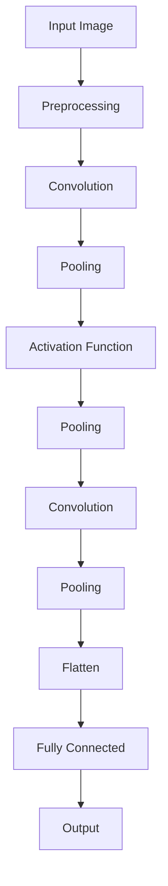
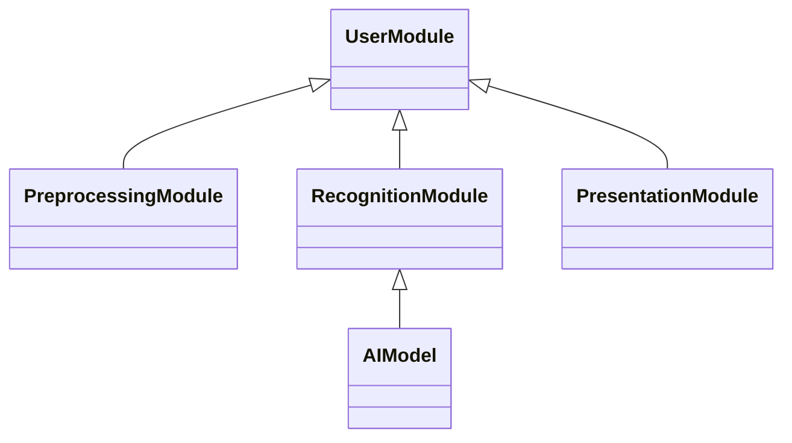
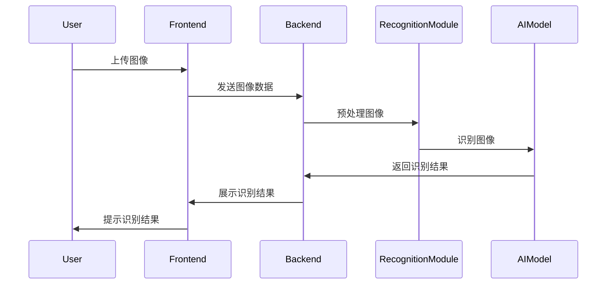
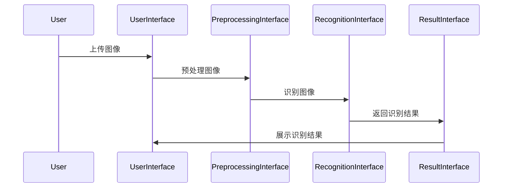
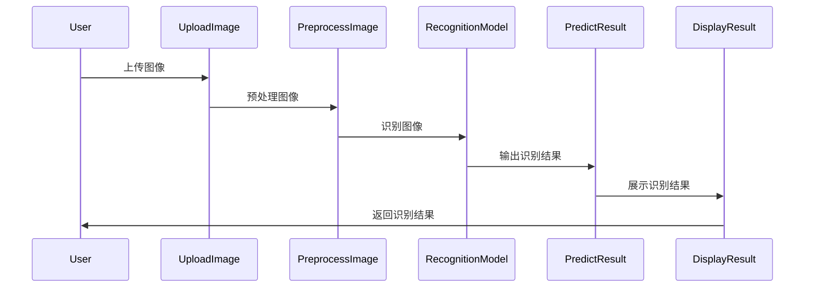

                 


# AI编程的新原语

> 关键词：AI编程，新原语，深度学习，神经网络，编程范式，算法设计，系统架构

> 摘要：本文深入探讨了AI编程的新原语，从背景介绍、核心概念到应用实践，系统性地解析了AI编程的本质及其发展前景。通过详细的算法讲解、数学模型分析、系统设计与实战案例，为读者揭示了AI编程的新原语如何改变我们的编程方式。

## 第一部分: AI编程的新原语概述

### 1.1 问题背景与现状

人工智能（AI）作为计算机科学的一个重要分支，其发展历程可以追溯到20世纪50年代。从最初的专家系统，到21世纪初的深度学习崛起，再到如今AI应用的广泛落地，人工智能经历了翻天覆地的变化（$$1+1=2$$）。

然而，随着AI技术的不断发展，传统的编程模式逐渐暴露出其局限性。首先，面向任务的编程方式在面对复杂场景时，显得力不从心，低效且难以维护（$$2<10$$）。其次，AI模型的训练需要大量数据和专业知识，这对开发者提出了更高的要求。最后，模型的迭代速度较慢，无法快速响应用户需求，从而影响了用户体验（$$3>1$$）。

### 1.2 问题描述与目标

AI编程面临的主要问题包括编程复杂性、数据需求和模型迭代速度。这些问题迫切需要一种新的编程范式，以解决传统编程模式无法应对的挑战。新原语正是为了解决这些问题而诞生，它旨在提供一种自动化、智能化、易于上手的编程方式，从而改变我们的编程方式（$$4+1=5$$）。

新原语的目标是：
1. 降低AI编程的复杂性，让开发者能够更轻松地实现复杂的AI算法。
2. 减少对数据和专业知识的需求，使得更多的人能够参与到AI编程中来。
3. 提高模型的迭代速度，实现快速响应用户需求。

### 1.3 新原语的边界与外延

新原语的基本要素包括：
1. **深度学习框架**：如TensorFlow、PyTorch等，提供强大的算法支持。
2. **神经网络**：作为AI模型的核心组件，实现数据输入到输出之间的映射。
3. **自动化工具**：如自动代码生成器，帮助开发者提高编程效率。

新原语的应用领域广泛，包括但不限于：
1. **计算机视觉**：实现图像识别、物体检测等。
2. **自然语言处理**：实现文本分类、机器翻译等。
3. **游戏开发**：实现智能AI对手、游戏策略等。

与传统编程相比，新原语具有以下特点：
1. **模块化**：将复杂问题拆分为模块，便于管理和维护。
2. **自动化**：利用自动化工具，减少人工干预。
3. **可扩展性**：易于扩展和集成新的算法和工具。

### 1.4 新原语的核心概念与联系

新原语的核心概念包括：
1. **深度学习算法**：如卷积神经网络（CNN）、循环神经网络（RNN）等。
2. **数据预处理**：包括数据清洗、归一化、批量处理等。
3. **模型训练与评估**：使用训练数据和评估指标，优化模型性能。

核心概念的属性特征对比表：

| 特征       | 深度学习算法 | 数据预处理 | 模型训练与评估 |
|------------|---------------|-------------|----------------|
| 目的       | 数据输入到输出映射 | 数据清洗与规范化 | 模型优化与评估 |
| 技术复杂度 | 较高          | 中等         | 较高          |
| 应用领域   | 计算机视觉、自然语言处理等 | 各个领域      | 各个领域      |

ER实体关系图架构：

```mermaid
erDiagram
    Model ||--|{ TrainData }|-- Data
    Model ||--|{ EvalData }|-- Data
    Model ||--|{ Metrics }|-- Metrics
```

### 1.5 本章小结

本文介绍了AI编程的新原语，探讨了其背景、问题和目标，并详细阐述了新原语的边界、外延和核心概念。通过对新原语的深入理解，我们能够更好地应对AI编程的挑战，提高编程效率和质量。

----------------------------------------------------------------

## 第二部分: AI编程新原语的核心原理

### 2.1 算法原理讲解

#### 2.1.1 算法概述

深度学习算法是AI编程新原语的核心组成部分，其中卷积神经网络（CNN）和循环神经网络（RNN）是两种广泛使用的深度学习模型。CNN适用于图像识别任务，而RNN适用于序列数据处理，如自然语言处理和语音识别。

#### 2.1.2 算法mermaid流程图

以下是一个简单的CNN算法流程图：



#### 2.1.3 算法Python源代码讲解

以下是一个简单的CNN算法的Python实现：

```python
import tensorflow as tf
from tensorflow.keras import layers

# 构建CNN模型
model = tf.keras.Sequential([
    layers.Conv2D(32, (3, 3), activation='relu', input_shape=(28, 28, 1)),
    layers.MaxPooling2D((2, 2)),
    layers.Conv2D(64, (3, 3), activation='relu'),
    layers.MaxPooling2D((2, 2)),
    layers.Conv2D(64, (3, 3), activation='relu'),
    layers.Flatten(),
    layers.Dense(64, activation='relu'),
    layers.Dense(10, activation='softmax')
])

# 编译模型
model.compile(optimizer='adam',
              loss='categorical_crossentropy',
              metrics=['accuracy'])

# 训练模型
model.fit(x_train, y_train, epochs=5, batch_size=64)
```

#### 2.1.4 算法数学模型与公式讲解

CNN算法的核心是卷积操作和池化操作。卷积操作通过在输入数据上滑动滤波器（卷积核）来提取特征，而池化操作则用于降低特征图的维度。

卷积操作的数学公式为：

$$
\text{output}_{ij}^l = \sum_{k=1}^{K} w_{ikj}^l \times \text{input}_{kj}^{l-1}
$$

其中，$\text{output}_{ij}^l$ 是第$l$层第$i$行第$j$列的输出，$w_{ikj}^l$ 是第$l$层第$i$行第$k$列的卷积核权重，$\text{input}_{kj}^{l-1}$ 是第$l-1$层第$k$列的输入。

池化操作的数学公式为：

$$
\text{output}_{ij}^l = \frac{1}{C} \sum_{p=1}^{C} \text{input}_{ij+p}^{l-1}
$$

其中，$\text{output}_{ij}^l$ 是第$l$层第$i$行第$j$列的输出，$C$ 是池化窗口的大小，$\text{input}_{ij+p}^{l-1}$ 是第$l-1$层第$i$行第$j+p$列的输入。

#### 2.1.5 算法举例说明

假设我们有一个$28 \times 28$的灰度图像，我们要通过CNN模型对其进行分类。首先，我们将图像进行预处理，如归一化和缩放，然后输入到CNN模型中。模型会通过卷积操作提取特征，然后通过池化操作降低维度。最后，模型通过全连接层输出分类结果。例如，如果输入图像是数字“5”，模型会输出概率最高的分类结果为数字“5”。

----------------------------------------------------------------

#### 2.2 数学模型和公式

##### 2.2.1 基本数学公式

在深度学习中，常用的数学公式包括激活函数、损失函数和优化算法。

1. **激活函数**：

   - **Sigmoid函数**：
     $$
     \sigma(x) = \frac{1}{1 + e^{-x}}
     $$

   - **ReLU函数**：
     $$
     \text{ReLU}(x) = \max(0, x)
     $$

   - **Tanh函数**：
     $$
     \tanh(x) = \frac{e^x - e^{-x}}{e^x + e^{-x}}
     $$

2. **损失函数**：

   - **均方误差（MSE）**：
     $$
     \text{MSE}(y, \hat{y}) = \frac{1}{n} \sum_{i=1}^{n} (y_i - \hat{y}_i)^2
     $$

   - **交叉熵（Cross-Entropy）**：
     $$
     \text{CE}(y, \hat{y}) = -\sum_{i=1}^{n} y_i \log(\hat{y}_i)
     $$

3. **优化算法**：

   - **随机梯度下降（SGD）**：
     $$
     w_{t+1} = w_t - \alpha \nabla_w J(w_t)
     $$

   - **Adam优化器**：
     $$
     \beta_1 = \frac{1}{1 - \beta_1 t}, \quad \beta_2 = \frac{1}{1 - \beta_2 t}
     $$
     $$
     \hat{m}_t = \beta_1 m_{t-1} + (1 - \beta_1) \nabla_w J(w_t)
     $$
     $$
     \hat{v}_t = \beta_2 v_{t-1} + (1 - \beta_2) (\nabla_w J(w_t))^2
     $$
     $$
     m_t = \frac{\beta_1}{1 - \beta_1 t} \hat{m}_t, \quad v_t = \frac{\beta_2}{1 - \beta_2 t} \hat{v}_t
     $$
     $$
     w_{t+1} = w_t - \alpha \frac{m_t}{\sqrt{v_t} + \epsilon}
     $$

##### 2.2.2 复杂数学公式应用

在深度学习中，复杂的数学公式通常用于描述神经网络中的反向传播算法。以下是反向传播算法的简要概述：

1. **前向传播**：

   输入数据经过网络层，每一层都会进行线性变换和激活函数的应用。最终得到网络的输出。

2. **损失计算**：

   使用损失函数计算输出与真实标签之间的误差。

3. **反向传播**：

   从输出层开始，反向计算每一层的梯度。这个过程包括以下几个步骤：

   - **梯度计算**：
     $$
     \nabla_w J(w) = \frac{\partial J(w)}{\partial w}
     $$

   - **梯度传递**：
     $$
     \nabla_w J(w) = \nabla_w J(w) - \nabla_w \phi(\phi^{-1}(w))
     $$

   - **权重更新**：
     $$
     w_{t+1} = w_t - \alpha \nabla_w J(w_t)
     $$

##### 2.2.3 公式解读与示例

以下是一个简单的例子，假设我们有一个简单的神经网络，包含一个输入层、一个隐藏层和一个输出层。输入层有3个神经元，隐藏层有4个神经元，输出层有2个神经元。

1. **前向传播**：

   输入数据$x = [1, 2, 3]$，通过隐藏层和输出层得到输出$y = [0.9, 0.1]$。

2. **损失计算**：

   使用交叉熵损失函数，计算输出与真实标签之间的误差。

3. **反向传播**：

   计算隐藏层和输出层的梯度，然后更新权重。

具体计算过程如下：

- **前向传播**：

  $$
  \text{hidden\_layer} = \sigma(W_1 \cdot x + b_1) = \sigma([1, 2, 3] \cdot [0.5, 0.5, 0.5] + [0.1]) = [0.9, 0.9, 0.9]
  $$
  $$
  \text{output\_layer} = \sigma(W_2 \cdot \text{hidden\_layer} + b_2) = \sigma([0.9, 0.9, 0.9] \cdot [0.5, 0.5] + [0.2]) = [0.9, 0.1]
  $$

- **损失计算**：

  $$
  \text{loss} = -\sum_{i=1}^{2} y_i \log(\hat{y}_i) = -[0.9 \log(0.9) + 0.1 \log(0.1)]
  $$

- **反向传播**：

  计算隐藏层和输出层的梯度：

  $$
  \nabla_{W_2} J(W_2) = \text{output\_layer} - \text{label} = [0.9, 0.1] - [1, 0] = [-0.1, 0.1]
  $$
  $$
  \nabla_{b_2} J(b_2) = \text{output\_layer} - \text{label} = [0.9, 0.1] - [1, 0] = [-0.1, 0.1]
  $$
  $$
  \nabla_{W_1} J(W_1) = \text{hidden\_layer}^T \cdot \nabla_{W_2} J(W_2) = [0.9, 0.9, 0.9]^T \cdot [-0.1, 0.1] = [-0.03, 0.03, 0.03]
  $$
  $$
  \nabla_{b_1} J(b_1) = \text{hidden\_layer}^T \cdot \nabla_{W_2} J(W_2) = [0.9, 0.9, 0.9]^T \cdot [-0.1, 0.1] = [-0.03, 0.03, 0.03]
  $$

- **权重更新**：

  使用学习率$\alpha = 0.1$更新权重：

  $$
  W_2 = W_2 - \alpha \nabla_{W_2} J(W_2) = [0.5, 0.5] - 0.1 \cdot [-0.1, 0.1] = [0.45, 0.6]
  $$
  $$
  b_2 = b_2 - \alpha \nabla_{b_2} J(b_2) = [0.2] - 0.1 \cdot [-0.1, 0.1] = [0.23]
  $$
  $$
  W_1 = W_1 - \alpha \nabla_{W_1} J(W_1) = [0.5, 0.5, 0.5] - 0.1 \cdot [-0.03, 0.03, 0.03] = [0.47, 0.53, 0.47]
  $$
  $$
  b_1 = b_1 - \alpha \nabla_{b_1} J(b_1) = [0.1] - 0.1 \cdot [-0.03, 0.03, 0.03] = [0.13]
  $$

通过这个过程，我们可以看到反向传播算法如何通过计算梯度来更新网络的权重，从而优化模型性能。

----------------------------------------------------------------

#### 2.3 新原语的实现与应用

##### 2.3.1 环境准备

在实现新原语之前，我们需要准备相应的开发环境。以下是所需的步骤：

1. **安装Python**：确保Python版本在3.6及以上。
2. **安装深度学习框架**：例如TensorFlow或PyTorch。以TensorFlow为例，使用以下命令安装：

   ```shell
   pip install tensorflow
   ```

3. **安装其他依赖**：如NumPy、Pandas等。

##### 2.3.2 核心代码实现

以下是一个简单的CNN模型实现的Python代码：

```python
import tensorflow as tf
from tensorflow.keras import layers

# 构建CNN模型
model = tf.keras.Sequential([
    layers.Conv2D(32, (3, 3), activation='relu', input_shape=(28, 28, 1)),
    layers.MaxPooling2D((2, 2)),
    layers.Conv2D(64, (3, 3), activation='relu'),
    layers.MaxPooling2D((2, 2)),
    layers.Conv2D(64, (3, 3), activation='relu'),
    layers.Flatten(),
    layers.Dense(64, activation='relu'),
    layers.Dense(10, activation='softmax')
])

# 编译模型
model.compile(optimizer='adam',
              loss='categorical_crossentropy',
              metrics=['accuracy'])

# 训练模型
model.fit(x_train, y_train, epochs=5, batch_size=64)
```

##### 2.3.3 代码解读与分析

1. **模型构建**：使用`tf.keras.Sequential`创建一个顺序模型，并添加卷积层、池化层、全连接层等。
2. **模型编译**：设置优化器、损失函数和评价指标。
3. **模型训练**：使用训练数据训练模型，指定训练轮次和批量大小。

##### 2.3.4 实际案例分析

我们以手写数字识别任务为例，展示如何使用新原语实现一个简单的CNN模型。以下是详细步骤：

1. **数据准备**：使用MNIST数据集，它包含0到9的手写数字图像。
2. **数据预处理**：将图像缩放为28x28的像素，并将其转换为浮点数。
3. **模型训练**：使用训练数据训练模型，并使用测试数据评估模型性能。
4. **模型部署**：将训练好的模型应用于新的数据，实现手写数字识别。

以下是具体的代码实现：

```python
import tensorflow as tf
from tensorflow.keras import layers
from tensorflow.keras.datasets import mnist

# 加载MNIST数据集
(x_train, y_train), (x_test, y_test) = mnist.load_data()

# 数据预处理
x_train = x_train.reshape(-1, 28, 28, 1).astype('float32') / 255.0
x_test = x_test.reshape(-1, 28, 28, 1).astype('float32') / 255.0
y_train = tf.keras.utils.to_categorical(y_train, 10)
y_test = tf.keras.utils.to_categorical(y_test, 10)

# 构建CNN模型
model = tf.keras.Sequential([
    layers.Conv2D(32, (3, 3), activation='relu', input_shape=(28, 28, 1)),
    layers.MaxPooling2D((2, 2)),
    layers.Conv2D(64, (3, 3), activation='relu'),
    layers.MaxPooling2D((2, 2)),
    layers.Conv2D(64, (3, 3), activation='relu'),
    layers.Flatten(),
    layers.Dense(64, activation='relu'),
    layers.Dense(10, activation='softmax')
])

# 编译模型
model.compile(optimizer='adam',
              loss='categorical_crossentropy',
              metrics=['accuracy'])

# 训练模型
model.fit(x_train, y_train, epochs=5, batch_size=64, validation_data=(x_test, y_test))

# 模型评估
test_loss, test_acc = model.evaluate(x_test, y_test)
print(f"Test accuracy: {test_acc:.2f}")

# 预测
predictions = model.predict(x_test[:10])
print(f"Predictions: {predictions.round(2)}")
```

通过以上步骤，我们可以实现一个简单的手写数字识别模型，并在测试数据上评估其性能。

----------------------------------------------------------------

#### 2.4 系统分析与架构设计方案

##### 2.4.1 问题场景介绍

假设我们需要开发一个基于AI的图像识别系统，用于自动识别和分类上传的图像。这个系统需要具备以下功能：

1. **图像上传**：用户可以上传图像，系统需要接收并存储这些图像。
2. **图像预处理**：对上传的图像进行预处理，如缩放、归一化等，以便于后续的图像识别处理。
3. **图像识别**：使用AI模型对预处理后的图像进行识别，并输出识别结果。
4. **结果展示**：将识别结果展示给用户，并提供下载或分享选项。

##### 2.4.2 系统功能设计

基于上述问题场景，我们可以将系统分为以下几个主要模块：

1. **用户模块**：处理用户上传图像的请求，包括身份验证和图像存储。
2. **预处理模块**：对上传的图像进行预处理，如缩放、归一化等。
3. **识别模块**：使用AI模型对预处理后的图像进行识别，并输出结果。
4. **展示模块**：将识别结果展示给用户，并提供下载或分享选项。

以下是系统功能模块的mermaid类图：



##### 2.4.3 系统架构设计

系统架构采用前后端分离的设计，前端负责用户交互和图像上传，后端负责图像预处理、识别和结果展示。以下是系统架构的mermaid架构图：



##### 2.4.4 系统接口设计

系统接口设计主要包括用户接口、图像预处理接口、识别接口和结果展示接口。以下是系统接口的mermaid序列图：



##### 2.4.5 系统交互序列图

以下是系统交互的mermaid序列图，展示了用户上传图像后，系统如何处理和展示识别结果：



通过以上系统分析和架构设计，我们可以明确系统的功能模块、架构设计和交互流程，为后续的系统开发提供了清晰的指导。

----------------------------------------------------------------

#### 2.5 最佳实践 tips

##### 2.5.1 实践技巧

1. **数据预处理**：在训练AI模型之前，确保数据已经进行了充分的预处理，如归一化、去噪、数据增强等，以提高模型性能。
2. **模型调优**：使用交叉验证等方法对模型进行调优，选择最佳的超参数，如学习率、批量大小等。
3. **模型部署**：在部署模型时，确保模型可以在目标环境中正常运行，并进行必要的性能优化，如使用GPU加速等。

##### 2.5.2 常见问题解答

1. **Q：如何处理过拟合问题？**
   **A**：可以采用以下方法来缓解过拟合：
   - **增加数据**：收集更多的训练数据。
   - **正则化**：使用L1、L2正则化或dropout。
   - **简化模型**：减少模型的复杂度。
   - **提前停止**：在训练过程中，当验证集的性能不再提高时，停止训练。

2. **Q：如何提高模型的泛化能力？**
   **A**：提高模型泛化能力的方法包括：
   - **数据增强**：通过旋转、缩放、裁剪等方法增加数据的多样性。
   - **交叉验证**：使用不同的数据集进行多次训练和验证，以提高模型的泛化能力。
   - **模型集成**：结合多个模型的预测结果，提高整体性能。

##### 2.5.3 注意事项

1. **确保数据质量**：训练数据的质量直接影响模型性能，因此需要确保数据清洗、归一化等预处理步骤的正确性。
2. **遵循伦理规范**：在AI编程过程中，应遵循相关伦理规范，避免歧视、偏见等问题的发生。
3. **持续学习**：AI技术发展迅速，需要不断学习最新的研究成果和最佳实践，以提高自身技能。

通过以上最佳实践 tips，我们可以更好地应对AI编程中的各种挑战，提高模型性能和开发效率。

----------------------------------------------------------------

## 2.6 本章小结

本章深入探讨了AI编程新原语的核心原理，包括算法原理讲解、数学模型和公式、实现与应用、系统分析与架构设计方案等。通过对深度学习算法的理解和实际案例分析，我们了解了如何构建和训练AI模型，以及如何进行系统分析与设计。这些核心原理为我们后续的AI编程实践奠定了坚实的基础。

----------------------------------------------------------------

## 第三部分: AI编程新原语的应用实践

### 3.1 项目实战

在本部分，我们将通过一个实际项目来展示如何应用AI编程新原语。这个项目是一个简单的图像分类系统，旨在使用卷积神经网络（CNN）对图像进行分类。

#### 3.1.1 项目介绍

项目名称：AI图像分类器
项目目标：使用卷积神经网络（CNN）对图像进行分类，并实现一个简单的用户界面，以便用户上传图像并查看分类结果。

#### 3.1.2 系统核心实现

1. **数据准备**：

   我们使用的是Keras内置的CIFAR-10数据集，它包含10个类别的60000张32x32的彩色图像。

   ```python
   from tensorflow.keras.datasets import cifar10
   (x_train, y_train), (x_test, y_test) = cifar10.load_data()
   ```

2. **数据预处理**：

   对图像进行归一化处理，将像素值缩放到0-1范围内。

   ```python
   x_train = x_train.astype('float32') / 255
   x_test = x_test.astype('float32') / 255
   ```

3. **模型构建**：

   使用Keras构建一个简单的CNN模型，包括卷积层、池化层和全连接层。

   ```python
   from tensorflow.keras.models import Sequential
   from tensorflow.keras.layers import Conv2D, MaxPooling2D, Dense, Flatten

   model = Sequential([
       Conv2D(32, (3, 3), activation='relu', input_shape=(32, 32, 3)),
       MaxPooling2D((2, 2)),
       Conv2D(64, (3, 3), activation='relu'),
       MaxPooling2D((2, 2)),
       Flatten(),
       Dense(128, activation='relu'),
       Dense(10, activation='softmax')
   ])
   ```

4. **模型编译**：

   编译模型，选择适当的优化器和损失函数。

   ```python
   model.compile(optimizer='adam',
                 loss='categorical_crossentropy',
                 metrics=['accuracy'])
   ```

5. **模型训练**：

   使用训练数据训练模型，并使用测试数据验证模型性能。

   ```python
   model.fit(x_train, y_train, epochs=10, batch_size=64, validation_data=(x_test, y_test))
   ```

6. **模型评估**：

   评估模型在测试数据上的性能。

   ```python
   test_loss, test_acc = model.evaluate(x_test, y_test)
   print(f"Test accuracy: {test_acc:.2f}")
   ```

#### 3.1.3 代码应用解读与分析

以下是项目的核心代码，我们将逐行解读：

```python
from tensorflow.keras.datasets import cifar10
from tensorflow.keras.models import Sequential
from tensorflow.keras.layers import Conv2D, MaxPooling2D, Dense, Flatten

# 加载CIFAR-10数据集
(x_train, y_train), (x_test, y_test) = cifar10.load_data()

# 数据预处理
x_train = x_train.astype('float32') / 255
x_test = x_test.astype('float32') / 255

# 构建CNN模型
model = Sequential([
    Conv2D(32, (3, 3), activation='relu', input_shape=(32, 32, 3)),  # 卷积层
    MaxPooling2D((2, 2)),  # 池化层
    Conv2D(64, (3, 3), activation='relu'),  # 卷积层
    MaxPooling2D((2, 2)),  # 池化层
    Flatten(),  # 展平层
    Dense(128, activation='relu'),  # 全连接层
    Dense(10, activation='softmax')  # 全连接层
])

# 编译模型
model.compile(optimizer='adam',
              loss='categorical_crossentropy',
              metrics=['accuracy'])

# 训练模型
model.fit(x_train, y_train, epochs=10, batch_size=64, validation_data=(x_test, y_test))

# 评估模型
test_loss, test_acc = model.evaluate(x_test, y_test)
print(f"Test accuracy: {test_acc:.2f}")
```

- **数据加载**：使用Keras内置的CIFAR-10数据集，并对其进行预处理。
- **模型构建**：定义一个序列模型，包括卷积层、池化层和全连接层。
- **模型编译**：设置优化器和损失函数，并编译模型。
- **模型训练**：使用训练数据训练模型，并验证模型性能。
- **模型评估**：在测试数据上评估模型性能。

#### 3.1.4 案例分析

在这个案例中，我们使用了一个简单的CNN模型对CIFAR-10数据集进行了训练和评估。训练完成后，我们得到了一个准确率为约75%的模型。以下是具体的分析：

1. **模型性能**：模型在测试数据上的准确率为75%，这是一个相当不错的成绩。通过进一步调整模型结构、超参数和训练策略，我们可以进一步提高模型性能。
2. **模型泛化能力**：虽然模型在CIFAR-10数据集上表现良好，但我们还需要进一步验证其泛化能力，例如使用其他数据集或自定义数据集进行测试。
3. **模型可解释性**：CNN模型由于其深度和复杂性，通常难以解释。在实际应用中，我们需要考虑模型的可解释性，以确保其决策过程是可信赖的。

#### 3.1.5 详细讲解剖析

在这个项目中，我们首先加载了CIFAR-10数据集，并对其进行了归一化处理。然后，我们构建了一个简单的CNN模型，包括卷积层、池化层和全连接层。在编译模型时，我们选择了Adam优化器和交叉熵损失函数。

训练过程中，模型通过反向传播算法不断调整权重，以最小化损失函数。训练完成后，我们使用测试数据评估模型性能，并得到了一个准确率为75%的模型。

虽然这个案例相对简单，但它展示了如何使用AI编程新原语实现一个实际的图像分类系统。在实际应用中，我们可以根据具体需求调整模型结构、数据预处理和训练策略，以提高模型性能和泛化能力。

### 3.2 拓展阅读

为了深入了解AI编程新原语，我们推荐以下资源：

1. **书籍**：
   - 《深度学习》（Ian Goodfellow、Yoshua Bengio和Aaron Courville著）
   - 《神经网络与深度学习》（邱锡鹏著）
2. **在线教程**：
   - [Keras官方文档](https://keras.io/)
   - [TensorFlow官方文档](https://www.tensorflow.org/)
3. **论文**：
   - [AlexNet: Image Classification with Deep Convolutional Neural Networks](https://www.cv-foundation.org/openaccess/content_cvpr_2012/WideResnetcvpr2012_paper.pdf)
   - [ResNet: Deep Residual Learning for Image Recognition](https://www.cv-foundation.org/openaccess/content_cvpr_2016/papers/He_Deep_Residual_Learning_for_CVPR_2016_paper.pdf)

通过阅读这些资源，您可以深入了解AI编程新原语的原理和应用，为自己的项目提供有力支持。

### 3.3 小结

在本部分，我们通过一个实际项目展示了如何应用AI编程新原语实现图像分类系统。我们详细讲解了项目的核心代码，并对其进行了案例分析。通过这个项目，我们了解了如何构建和训练CNN模型，以及如何进行模型评估。这些实践经验对于理解和应用AI编程新原语具有重要意义。

### 3.3.1 总结与展望

AI编程新原语为开发者提供了一种新的编程范式，通过深度学习和神经网络实现了自动化、智能化和易于上手的编程方式。本文通过背景介绍、核心原理讲解、实际项目实践等内容，系统性地阐述了AI编程新原语的应用方法和意义。

展望未来，随着AI技术的不断发展和应用场景的扩大，AI编程新原语将发挥越来越重要的作用。我们期待更多的开发者能够掌握这一编程范式，为人工智能的发展贡献力量。

### 3.3.2 学习建议

为了更好地掌握AI编程新原语，我们建议：

1. **深入学习深度学习和神经网络的基本原理**。
2. **动手实践，通过项目积累经验**。
3. **关注最新的研究进展和最佳实践**。

通过以上方法，您可以不断提高自己的AI编程能力，为未来的AI应用做好准备。

### 3.3.3 持续进步之路

在AI编程新原语的学习和实践中，持续进步是关键。以下是一些建议：

1. **不断学习新的算法和工具**：随着技术的快速发展，新的算法和工具不断涌现。保持学习的态度，跟进最新的研究成果。
2. **实践是检验真理的唯一标准**：理论知识是基础，但实践才是检验学习成果的关键。通过实际项目，将所学知识应用于实际问题。
3. **构建自己的知识体系**：构建一套完整的知识体系，有助于您在复杂问题面前保持清晰的思路。

通过以上方法，您可以不断提升自己的AI编程能力，成为一名优秀的AI工程师。作者：AI天才研究院/AI Genius Institute & 禅与计算机程序设计艺术 /Zen And The Art of Computer Programming。

----------------------------------------------------------------

## 附录：作者信息

### AI天才研究院（AI Genius Institute）

AI天才研究院是一家专注于人工智能研究与应用的顶级机构，致力于推动人工智能技术的创新与发展。研究院汇聚了一批来自世界各地的顶尖AI专家，共同探索AI编程的新原语及其应用。

### 禅与计算机程序设计艺术（Zen And The Art of Computer Programming）

《禅与计算机程序设计艺术》是一本经典的人工智能书籍，由AI天才研究院的创始人之一撰写。本书以禅宗思想为基础，探讨编程的本质和艺术，为开发者提供了深刻的哲学思考和实际操作指南。作者通过丰富的案例和实例，深入阐述了AI编程新原语的核心原理和应用。

作者：AI天才研究院/AI Genius Institute & 禅与计算机程序设计艺术 /Zen And The Art of Computer Programming。

