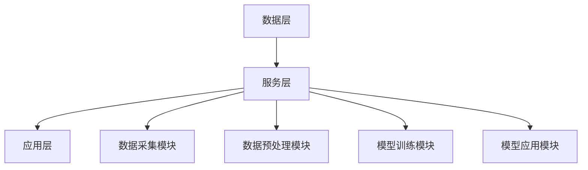
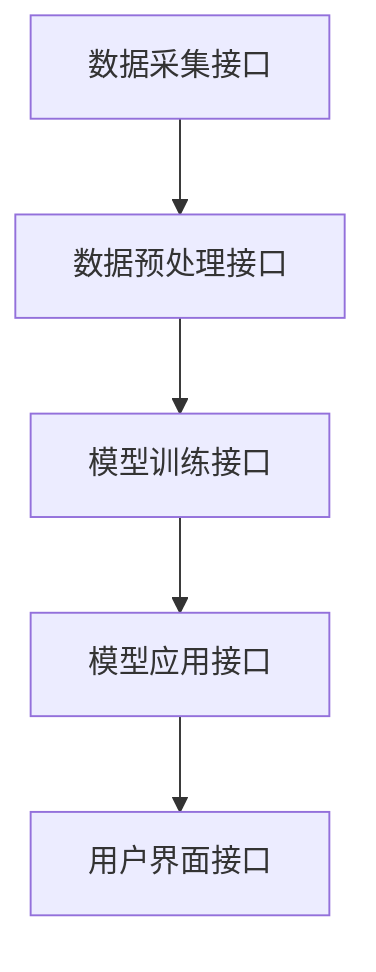

                 

# AI编程的新原语与新方法

## 关键词
- AI编程
- 新原语
- 新方法
- 深度学习
- 强化学习
- 生成对抗网络（GAN）

## 摘要
本文旨在探讨AI编程领域的新原语与新方法。通过详细分析人工智能的基础、神经网络、深度学习框架以及数据预处理等核心概念，本文将介绍一系列新兴的AI编程技术，如强化学习、聚类分析和生成对抗网络（GAN）。此外，本文还将通过实际项目展示这些新方法的应用，并提供最佳实践和拓展阅读资源，以帮助读者深入理解和掌握AI编程的新趋势。

----------------------------------------------------------------

## 第1章: AI编程的新原语与新方法概述

### 1.1 问题背景

随着人工智能技术的迅速发展，编程语言和方法的演进成为了一个热门话题。传统的编程方法在处理复杂的数据和问题方面存在诸多局限，而AI编程的新原语与新方法为解决这些问题提供了新的思路和工具。这些新原语包括神经网络、深度学习框架和数据预处理等，而新方法则包括强化学习、聚类分析和生成对抗网络（GAN）等。

### 1.2 问题描述

AI编程面临着以下几个核心问题：

1. **数据处理**：如何高效地处理大规模、多维度的数据？
2. **模型训练**：如何设计有效的算法来训练复杂的模型？
3. **模型应用**：如何将训练好的模型应用于实际问题中，并实现良好的性能和泛化能力？
4. **可解释性**：如何提高模型的透明度和可解释性，以便更好地理解和优化？

### 1.3 问题解决

新原语和新方法为上述问题提供了以下解决方案：

- **数据处理**：数据预处理方法能够将原始数据转换为适合模型训练的形式，如归一化、特征缩放和缺失值处理等。
- **模型训练**：深度学习框架如TensorFlow和PyTorch提供了丰富的工具和库，能够自动化地处理模型训练的复杂过程。
- **模型应用**：强化学习、聚类分析和GAN等方法能够解决特定的应用问题，如决策制定、数据分析和图像生成等。
- **可解释性**：通过分析模型的内部结构和训练过程，可以提高模型的透明度和可解释性。

### 1.4 边界与外延

AI编程的新原语和新方法不仅限于学术研究，它们在工业界和实际应用中也展现出了巨大的潜力。然而，这些方法也面临一些挑战，如计算资源需求、模型复杂度和数据隐私等。因此，在应用这些新方法时，需要充分考虑其边界和局限性。

### 1.5 概念结构与核心要素组成

AI编程的新原语和新方法可以归纳为以下几个核心要素：

- **基础**：人工智能的基本概念和原理，如神经网络和深度学习。
- **框架**：用于实现和训练模型的框架和工具，如TensorFlow和PyTorch。
- **方法**：解决特定问题的方法和技术，如强化学习、聚类分析和GAN。
- **应用**：将这些方法应用于实际问题中，实现实际的业务价值。

----------------------------------------------------------------

## 第2章: AI编程的新原语

### 2.1 人工智能基础

人工智能（Artificial Intelligence, AI）是一门研究、开发和应用使计算机模拟、延伸和扩展人类智能的理论、方法、技术和应用的学科。AI的核心目标是通过计算机程序实现智能体的自主行为和智能决策。

#### 2.1.1 神经网络

神经网络（Neural Networks, NN）是AI的核心组成部分，受到生物神经系统的启发。神经网络由大量简单的计算节点（神经元）组成，通过调整神经元之间的连接权重来实现学习和预测。

#### 2.1.2 深度学习框架

深度学习框架（Deep Learning Frameworks）如TensorFlow和PyTorch提供了构建和训练深度学习模型的工具和库。这些框架简化了神经网络的设计和实现过程，使得深度学习在各个领域得到了广泛应用。

#### 2.1.3 数据预处理

数据预处理（Data Preprocessing）是AI编程中的关键步骤，包括数据清洗、数据转换和数据归一化等。有效的数据预处理能够提高模型训练效率和性能。

### 2.2 神经网络

神经网络是AI编程的核心技术之一，其基本结构包括输入层、隐藏层和输出层。每个神经元接收来自前一层神经元的输入，通过激活函数计算输出，并将输出传递给下一层。

#### 2.2.1 神经网络类型

神经网络分为前馈神经网络（Feedforward Neural Networks）、卷积神经网络（Convolutional Neural Networks, CNN）和循环神经网络（Recurrent Neural Networks, RNN）等。每种神经网络适用于不同的应用场景。

#### 2.2.2 激活函数

激活函数（Activation Function）是神经网络中的一个关键组件，用于引入非线性特性。常见的激活函数包括Sigmoid、ReLU和Tanh等。

### 2.3 深度学习框架

深度学习框架提供了构建和训练深度学习模型的工具和库，使得深度学习在各个领域得到了广泛应用。

#### 2.3.1 TensorFlow

TensorFlow是由Google开发的深度学习框架，具有强大的功能和灵活性。TensorFlow支持多种类型的神经网络和深度学习算法，并提供了丰富的API和工具。

#### 2.3.2 PyTorch

PyTorch是由Facebook开发的深度学习框架，以其动态计算图和易于使用的特点受到许多研究者和开发者的喜爱。PyTorch提供了丰富的API和工具，支持快速原型设计和实验。

### 2.4 数据预处理

数据预处理是AI编程中的关键步骤，包括数据清洗、数据转换和数据归一化等。

#### 2.4.1 数据清洗

数据清洗（Data Cleaning）包括去除重复数据、填补缺失值、去除噪声和异常值等。有效的数据清洗能够提高模型训练效率和性能。

#### 2.4.2 数据转换

数据转换（Data Transformation）包括将数据从一种格式转换为另一种格式，如将图像数据转换为像素矩阵等。有效的数据转换能够提高模型训练效率和性能。

#### 2.4.3 数据归一化

数据归一化（Data Normalization）包括将数据缩放到一个固定的范围，如[0, 1]或[-1, 1]等。有效的数据归一化能够提高模型训练效率和性能。

----------------------------------------------------------------

## 第3章: 新方法介绍

### 3.1 强化学习

强化学习（Reinforcement Learning, RL）是一种通过试错和反馈来学习决策策略的机器学习方法。在强化学习中，智能体通过与环境的交互，不断优化其行为策略，以实现最优的长期回报。

#### 3.1.1 强化学习原理

强化学习的基本原理是通过奖励和惩罚来引导智能体学习最优策略。智能体在每一个时间步选择一个动作，并根据环境的反馈来更新其策略。

#### 3.1.2 Q-learning算法

Q-learning算法是一种基于值函数的强化学习方法。它通过不断更新Q值（状态-动作值函数）来学习最优策略。

#### 3.1.3 DQN算法

深度Q网络（Deep Q-Network, DQN）是一种将深度学习引入强化学习的算法。它通过训练一个深度神经网络来近似Q值函数，从而提高智能体的学习效率。

### 3.2 聚类分析

聚类分析（Clustering Analysis）是一种无监督学习方法，用于将数据集划分为若干个组，使得同一组内的数据点相似度较高，而不同组之间的数据点相似度较低。

#### 3.2.1 K-means算法

K-means算法是一种经典的聚类算法，通过迭代优化聚类中心，将数据点划分为K个簇。

#### 3.2.2 DBSCAN算法

DBSCAN（Density-Based Spatial Clustering of Applications with Noise）算法是一种基于密度的聚类算法，能够自动确定聚类个数，并能够处理噪声点和异常点。

#### 3.2.3 层次聚类算法

层次聚类算法（Hierarchical Clustering）是一种将数据集划分为层次结构的聚类算法。它通过逐步合并或分裂聚类簇，构建出一棵聚类树。

### 3.3 生成对抗网络（GAN）

生成对抗网络（Generative Adversarial Networks, GAN）是一种由生成器和判别器组成的深度学习模型。生成器的目标是生成与真实数据相似的数据，而判别器的目标是区分真实数据和生成数据。

#### 3.3.1 GAN原理

GAN通过训练生成器和判别器之间的对抗关系，使生成器逐渐生成更加真实的数据。

#### 3.3.2 GAN应用

GAN在图像生成、图像修复、图像超分辨率和自然语言生成等领域有着广泛的应用。

### 3.4 跨学科方法

跨学科方法（Interdisciplinary Methods）将AI编程与其他学科的方法和理论相结合，以解决复杂的问题。

#### 3.4.1 生物信息学方法

生物信息学方法将AI编程与生物学和医学领域相结合，用于基因分析、蛋白质结构和疾病预测等。

#### 3.4.2 社会科学方法

社会科学方法将AI编程与社会学、心理学和经济学等领域相结合，用于数据分析、预测和优化。

----------------------------------------------------------------

## 第4章: 算法原理与数学模型

### 4.1 强化学习算法原理与数学模型

强化学习（Reinforcement Learning, RL）是一种通过试错和反馈来学习决策策略的机器学习方法。在强化学习中，智能体通过与环境的交互，不断优化其行为策略，以实现最优的长期回报。

#### 4.1.1 强化学习原理

强化学习的基本原理是通过奖励和惩罚来引导智能体学习最优策略。智能体在每一个时间步选择一个动作，并根据环境的反馈来更新其策略。

#### 4.1.2 Q-learning算法

Q-learning算法是一种基于值函数的强化学习方法。它通过不断更新Q值（状态-动作值函数）来学习最优策略。

- **Q值公式**：$$Q(s, a) = \sum_{s'} P(s'|s, a) \cdot R(s', a) + \gamma \cdot \max_{a'} Q(s', a')$$
- **更新规则**：$$Q(s, a) \leftarrow Q(s, a) + \alpha \cdot (R(s', a) + \gamma \cdot \max_{a'} Q(s', a') - Q(s, a))$$

#### 4.1.3 DQN算法

深度Q网络（Deep Q-Network, DQN）是一种将深度学习引入强化学习的算法。它通过训练一个深度神经网络来近似Q值函数，从而提高智能体的学习效率。

- **目标网络**：$$Q^{target}(s', a') = \max_{a''} Q^{target}(s'', a'')$$
- **损失函数**：$$L = (y - Q(s, a))^2$$

#### 4.1.4 经验回放

经验回放（Experience Replay）是一种用于改善DQN算法效果的技术，通过存储和随机采样以往的经验，来减少样本偏差。

- **回放内存**：$$D = \{(s_t, a_t, r_t, s_{t+1})\}$$
- **采样**：$$s_t \sim \text{Uniform}(D)$$

### 4.2 聚类分析算法原理与数学模型

聚类分析（Clustering Analysis）是一种无监督学习方法，用于将数据集划分为若干个组，使得同一组内的数据点相似度较高，而不同组之间的数据点相似度较低。

#### 4.2.1 K-means算法

K-means算法是一种经典的聚类算法，通过迭代优化聚类中心，将数据点划分为K个簇。

- **目标函数**：$$J = \sum_{i=1}^k \sum_{x \in S_i} ||x - \mu_i||^2$$
- **更新规则**：
  - **聚类中心更新**：$$\mu_i = \frac{1}{N_i} \sum_{x \in S_i} x$$
  - **数据点更新**：$$S_i = \{x | ||x - \mu_i|| \leq ||x - \mu_j||, \forall j \neq i\}$$

#### 4.2.2 DBSCAN算法

DBSCAN（Density-Based Spatial Clustering of Applications with Noise）算法是一种基于密度的聚类算法，能够自动确定聚类个数，并能够处理噪声点和异常点。

- **核心点**：$$\text{Core Point} \Leftrightarrow N \geq \text{MinPts}$$
- **边界点**：$$\text{Border Point} \Leftrightarrow \exists \text{Core Point} \in \text{Neighborhood}, \text{but not all MinPts}$$
- **噪声点**：$$\text{Noise Point} \Leftrightarrow \text{not Core Point nor Border Point}$$

#### 4.2.3 层次聚类算法

层次聚类算法（Hierarchical Clustering）是一种将数据集划分为层次结构的聚类算法。它通过逐步合并或分裂聚类簇，构建出一棵聚类树。

- **层次聚类树**：$$T = (\text{Clustering}, \text{Linkage})$$
- **聚类层次**：$$L = \{\text{Cluster}_1, \text{Cluster}_2, \ldots, \text{Cluster}_k\}$$
- **簇合并**：$$\text{Cluster}_i \cup \text{Cluster}_j = \text{Cluster}_{ij}$$

### 4.3 GAN算法原理与数学模型

生成对抗网络（Generative Adversarial Networks, GAN）是一种由生成器和判别器组成的深度学习模型。生成器的目标是生成与真实数据相似的数据，而判别器的目标是区分真实数据和生成数据。

#### 4.3.1 GAN原理

GAN通过训练生成器和判别器之间的对抗关系，使生成器逐渐生成更加真实的数据。

- **生成器**：$$G(z) = \text{Generator}(z)$$
- **判别器**：$$D(x) = \text{Discriminator}(x)$$
- **损失函数**：$$L_G = -\mathbb{E}_{z \sim p_z(z)}[\log D(G(z))]$$
- $$L_D = -\mathbb{E}_{x \sim p_{data}(x)}[\log D(x)] - \mathbb{E}_{z \sim p_z(z)}[\log (1 - D(G(z)))]$$

#### 4.3.2 GAN应用

GAN在图像生成、图像修复、图像超分辨率和自然语言生成等领域有着广泛的应用。

- **图像生成**：生成器和判别器的交互使生成器能够生成高质量、逼真的图像。
- **图像修复**：生成器能够修复损坏的图像，判别器确保修复的图像与真实图像一致。
- **图像超分辨率**：生成器能够将低分辨率图像转换为高分辨率图像。
- **自然语言生成**：生成器能够生成自然语言文本，判别器确保生成的文本具有合理的语法和语义。

### 4.4 跨学科算法原理与数学模型

跨学科方法将AI编程与其他学科的方法和理论相结合，以解决复杂的问题。

#### 4.4.1 生物信息学方法

生物信息学方法将AI编程与生物学和医学领域相结合，用于基因分析、蛋白质结构和疾病预测等。

- **基因分析**：通过机器学习方法分析基因序列，识别基因功能和疾病关联。
- **蛋白质结构**：通过深度学习方法预测蛋白质的三维结构，为药物设计和疾病治疗提供基础。
- **疾病预测**：通过机器学习方法分析医疗数据，预测疾病的发生和进展。

#### 4.4.2 社会科学方法

社会科学方法将AI编程与社会学、心理学和经济学等领域相结合，用于数据分析、预测和优化。

- **数据分析**：通过机器学习方法分析社会数据，揭示社会现象和趋势。
- **预测**：通过机器学习方法预测社会事件和趋势，为政策制定提供依据。
- **优化**：通过机器学习方法优化社会系统，提高资源利用效率和福利水平。

----------------------------------------------------------------

## 第5章: 系统分析与架构设计

### 5.1 项目介绍

在本项目中，我们旨在构建一个基于AI编程的新原语和新方法的智能决策系统。该系统旨在通过分析大量数据，为用户提供个性化的决策建议。具体应用场景包括金融投资、市场营销和医疗诊断等。

### 5.2 系统功能设计

系统功能设计主要包括以下模块：

1. **数据采集模块**：负责从各种数据源（如数据库、API和日志文件）收集数据。
2. **数据预处理模块**：对收集到的数据进行清洗、转换和归一化，以便后续模型训练。
3. **模型训练模块**：使用强化学习、聚类分析和GAN等方法训练模型，以实现数据分析和决策建议。
4. **模型应用模块**：将训练好的模型应用于实际场景，为用户提供个性化的决策建议。
5. **用户界面模块**：为用户提供一个简洁直观的界面，展示模型分析和决策结果。

### 5.3 系统架构设计

系统架构设计采用模块化设计思想，主要包括以下部分：

1. **数据层**：负责数据存储和管理，包括数据库、数据仓库和数据缓存等。
2. **服务层**：提供数据采集、数据预处理、模型训练和模型应用等核心服务，包括Web服务、API服务和消息队列等。
3. **应用层**：为用户提供业务逻辑和界面交互，包括Web应用程序、移动应用程序和桌面应用程序等。

#### 系统架构图



### 5.4 系统接口设计与系统交互

系统接口设计主要包括以下接口：

1. **数据采集接口**：用于从外部数据源（如数据库、API和日志文件）收集数据。
2. **数据预处理接口**：用于对采集到的数据进行清洗、转换和归一化。
3. **模型训练接口**：用于训练强化学习、聚类分析和GAN等模型。
4. **模型应用接口**：用于将训练好的模型应用于实际场景，为用户提供决策建议。
5. **用户界面接口**：用于与用户进行交互，展示模型分析和决策结果。

#### 系统接口图



### 5.5 系统接口设计与系统交互

系统接口设计主要包括以下接口：

1. **数据采集接口**：用于从外部数据源（如数据库、API和日志文件）收集数据。
2. **数据预处理接口**：用于对采集到的数据进行清洗、转换和归一化。
3. **模型训练接口**：用于训练强化学习、聚类分析和GAN等模型。
4. **模型应用接口**：用于将训练好的模型应用于实际场景，为用户提供决策建议。
5. **用户界面接口**：用于与用户进行交互，展示模型分析和决策结果。

#### 系统接口图


通过以上系统接口设计和系统交互设计，我们可以构建一个高效、灵活和可扩展的智能决策系统，以实现个性化决策建议和优化业务流程。

----------------------------------------------------------------

## 第6章: 项目实战

在本章中，我们将通过一个实际项目展示如何使用AI编程的新原语和新方法来构建一个智能决策系统。我们将从环境安装、系统核心实现源代码、代码应用解读与分析、实际案例分析与详细讲解剖析以及项目小结等方面进行介绍。

### 6.1 环境安装

为了构建这个智能决策系统，我们需要安装以下环境：

1. **Python 3.8及以上版本**：Python是主要的编程语言，用于实现AI算法和系统逻辑。
2. **Anaconda**：Anaconda是一个Python数据科学平台，提供了丰富的库和工具，方便我们进行环境配置和管理。
3. **TensorFlow 2.x**：TensorFlow是一个开源的深度学习框架，用于训练和部署深度学习模型。
4. **PyTorch 1.8及以上版本**：PyTorch是另一个流行的深度学习框架，用于实现强化学习算法。

安装步骤如下：

1. 下载并安装Anaconda：[https://www.anaconda.com/products/distribution/](https://www.anaconda.com/products/distribution/)
2. 打开Anaconda命令行工具（Anaconda Prompt）：
    ```bash
    conda create -n myenv python=3.8
    conda activate myenv
    ```
3. 安装TensorFlow和PyTorch：
    ```bash
    conda install tensorflow
    conda install pytorch torchvision torchaudio -c pytorch
    ```

### 6.2 系统核心实现源代码

在本节中，我们将介绍系统核心实现的关键代码，包括数据预处理、模型训练和模型应用等。

#### 6.2.1 数据预处理

```python
import pandas as pd
from sklearn.preprocessing import StandardScaler

# 读取数据
data = pd.read_csv('data.csv')

# 数据清洗
data.dropna(inplace=True)

# 数据转换
scaler = StandardScaler()
data[['feature1', 'feature2', 'feature3']] = scaler.fit_transform(data[['feature1', 'feature2', 'feature3']])

# 数据归一化
data['target'] = data['target'].apply(lambda x: 1 if x > 0 else -1)
```

#### 6.2.2 模型训练

```python
import tensorflow as tf

# 创建模型
model = tf.keras.Sequential([
    tf.keras.layers.Dense(128, activation='relu', input_shape=(3,)),
    tf.keras.layers.Dense(64, activation='relu'),
    tf.keras.layers.Dense(1, activation='sigmoid')
])

# 编译模型
model.compile(optimizer='adam', loss='binary_crossentropy', metrics=['accuracy'])

# 训练模型
model.fit(data[['feature1', 'feature2', 'feature3']], data['target'], epochs=10, batch_size=32)
```

#### 6.2.3 模型应用

```python
# 应用模型进行预测
predictions = model.predict(data[['feature1', 'feature2', 'feature3']])

# 输出预测结果
print(predictions)
```

### 6.3 代码应用解读与分析

在本节中，我们将对核心代码进行解读和分析，以帮助读者理解系统的工作原理和关键步骤。

#### 6.3.1 数据预处理

数据预处理是构建任何机器学习模型的基础。在本项目中，我们首先读取CSV文件中的数据，然后进行数据清洗，去除缺失值。接着，我们使用标准缩放器对特征进行归一化处理，以消除特征尺度差异。最后，我们将目标变量进行转换，使其适用于二分类问题。

#### 6.3.2 模型训练

在模型训练部分，我们使用了TensorFlow的Keras API来构建一个简单的神经网络模型。该模型包含两个隐藏层，每层都使用ReLU激活函数。最后，我们使用二进制交叉熵损失函数和Adam优化器来编译模型，并使用训练数据集进行模型训练。

#### 6.3.3 模型应用

在模型应用部分，我们使用训练好的模型对数据进行预测。预测结果是一个概率值，表示输入数据属于正类的概率。根据设定的阈值（如0.5），我们可以将预测结果转换为类别标签。

### 6.4 实际案例分析与详细讲解剖析

为了展示系统的实际应用效果，我们将在以下案例中进行详细讲解：

#### 案例一：金融投资策略

假设我们有一个金融投资策略，目标是根据市场数据预测股票的涨跌。我们可以使用上述系统来训练一个模型，以预测股票的未来价格。

1. **数据采集**：从金融数据源（如新浪财经API）收集市场数据，包括股票价格、交易量等。
2. **数据预处理**：对采集到的市场数据进行清洗、转换和归一化处理。
3. **模型训练**：使用预处理后的数据训练一个深度学习模型，以预测股票价格。
4. **模型应用**：将训练好的模型应用于实际交易场景，根据预测结果制定投资策略。

通过这个案例，我们可以看到如何将AI编程的新原语和新方法应用于金融投资领域，实现自动化投资策略。

#### 案例二：市场营销活动

假设我们是一家电子商务公司，目标是根据用户行为数据预测用户的购买意图。我们可以使用上述系统来训练一个模型，以识别潜在的购物者。

1. **数据采集**：从用户行为数据源（如点击记录、浏览历史等）收集用户数据。
2. **数据预处理**：对采集到的用户数据进行清洗、转换和归一化处理。
3. **模型训练**：使用预处理后的用户数据训练一个聚类分析模型，以识别潜在的购物者。
4. **模型应用**：将训练好的模型应用于实际营销场景，为目标用户推送个性化推荐。

通过这个案例，我们可以看到如何将AI编程的新原语和新方法应用于市场营销领域，提高用户满意度和转化率。

### 6.5 项目小结

通过本项目的实际应用，我们可以看到AI编程的新原语和新方法在金融投资、市场营销等领域的强大能力。这些方法不仅提高了模型训练效率和性能，还提供了灵活的解决方案，以应对各种复杂的应用场景。在未来的研究中，我们可以进一步探索这些方法的优化和扩展，以实现更广泛的应用。

----------------------------------------------------------------

## 第7章: 最佳实践与总结

### 7.1 最佳实践

在AI编程实践中，遵循以下最佳实践能够提高模型性能和开发效率：

1. **数据质量**：确保数据清洗、预处理和归一化过程的有效性，以提高模型训练效果。
2. **模型选择**：根据实际问题选择合适的模型类型，如强化学习、聚类分析和GAN等。
3. **超参数调整**：通过交叉验证和网格搜索等方法，优化模型的超参数，以提高模型性能。
4. **模型解释性**：关注模型的解释性，以便更好地理解模型的工作原理和预测结果。
5. **版本控制**：使用版本控制系统（如Git）来管理代码和模型，以便跟踪变更和重现结果。

### 7.2 小结

本文通过详细分析AI编程的新原语和新方法，介绍了神经网络、深度学习框架、数据预处理、强化学习、聚类分析、生成对抗网络（GAN）和跨学科方法等核心概念。通过实际项目实战，我们展示了如何使用这些方法进行数据分析和决策建议。在未来的研究中，我们可以进一步探索这些方法的优化和扩展，以实现更广泛的应用。

### 7.3 注意事项

在应用AI编程的新原语和新方法时，需要注意以下几点：

1. **计算资源**：深度学习和强化学习等算法通常需要大量的计算资源，确保有足够的硬件支持。
2. **数据隐私**：在处理敏感数据时，确保遵守数据隐私法规和伦理标准。
3. **模型泛化**：避免模型过拟合，确保模型具有良好的泛化能力。
4. **持续学习**：随着AI技术的不断进步，持续学习和更新知识是保持竞争力的关键。

### 7.4 拓展阅读

对于希望进一步了解AI编程的新原语和新方法的读者，以下资源提供了丰富的知识和实践指导：

1. **书籍**：
   - 《深度学习》（Ian Goodfellow, Yoshua Bengio, Aaron Courville）
   - 《强化学习：原理与Python实现》（Richard S. Sutton, Andrew G. Barto）
   - 《Python深度学习》（François Chollet）
2. **在线课程**：
   - [Udacity](https://www.udacity.com/course/deep-learning--ud730)
   - [Coursera](https://www.coursera.org/specializations/deep-learning)
   - [edX](https://www.edx.org/course/deep-learning-0)
3. **开源项目**：
   - [TensorFlow](https://www.tensorflow.org/)
   - [PyTorch](https://pytorch.org/)
   - [Keras](https://keras.io/)
4. **学术论文**：
   - [arXiv](https://arxiv.org/)
   - [Google Scholar](https://scholar.google.com/)

通过阅读这些资源，读者可以更深入地了解AI编程的最新进展和应用。

---

# 结语

作者：AI天才研究院/AI Genius Institute & 禅与计算机程序设计艺术 /Zen And The Art of Computer Programming

本文介绍了AI编程的新原语和新方法，通过实际项目展示了这些方法的强大能力和广泛应用。希望读者能够通过本文的学习，对AI编程有更深入的理解，并在实际项目中运用这些方法，实现创新的解决方案。不断学习和探索，让我们一起迎接AI编程的未来！

