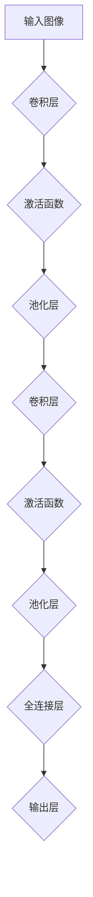
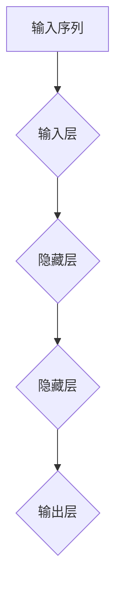
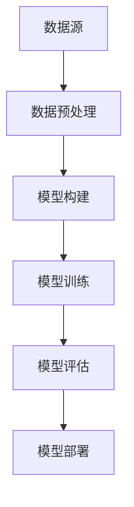
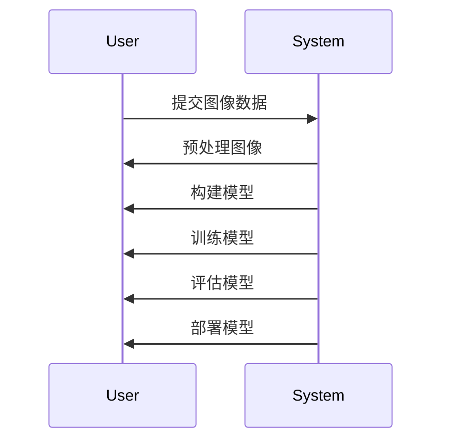

                 

### 文章标题

### 关键词

- **AI编程**
- **新思维**
- **机器学习**
- **深度学习**
- **自然语言处理**
- **最佳实践**

### 摘要

本文将探讨AI编程领域的新思维，从AI的起源和未来趋势，到编程语言与工具的选择，再到机器学习和深度学习的基础算法，以及自然语言处理的应用，最终讨论AI编程的最佳实践和未来展望。通过逻辑清晰、结构紧凑的阐述，本文旨在帮助读者全面理解和掌握AI编程的核心概念和技术。

## 第一部分：AI编程基础

### 第1章：AI简史与未来趋势

在探讨AI编程的新思维之前，我们首先需要回顾AI的发展历程，并展望其未来趋势。这一章节将详细讲述AI的起源、关键里程碑以及其对人类社会的影响。

#### 1.1 AI的起源与发展

人工智能（AI）的概念最早可以追溯到古希腊神话中的自动机器人和机械僧侣。然而，现代人工智能的研究始于20世纪50年代。在这一时期，计算机科学家和数学家开始探索如何让计算机模拟人类思维过程，这一领域被称为人工智能。

**关键里程碑：**

- 1956年，达特茅斯会议：人工智能正式成为一门科学。
- 1958年，约翰·麦卡锡（John McCarthy）提出了“专家系统”（Expert Systems）的概念。
- 1970年代末至1980年代初，专家系统在医疗诊断和金融分析等领域取得了成功。
- 1997年，IBM的“深蓝”（Deep Blue）战胜国际象棋世界冠军加里·卡斯帕罗夫。
- 2012年，AlexNet在ImageNet竞赛中取得突破性成果，标志着深度学习的复兴。

#### 1.2 AI编程的基础概念

AI编程是指开发能够模拟、延伸和扩展人类智能的计算机程序的实践。它涉及多个学科，包括计算机科学、心理学、神经科学和数学。

**基础概念：**

- **算法：** 解决问题的步骤和规则。
- **模型：** 用于预测和决策的数学函数。
- **数据：** AI算法学习和训练的基础。
- **神经网络：** 模拟人脑的计算模型。

#### 1.3 AI编程的技术趋势

随着技术的进步，AI编程领域正在经历一系列变革。以下是几个关键趋势：

- **深度学习：** 使用多层神经网络进行复杂任务，如图像识别和自然语言处理。
- **强化学习：** 通过与环境交互学习策略，常用于游戏和机器人控制。
- **生成对抗网络（GAN）：** 用于生成逼真的图像、音频和文本。
- **迁移学习：** 利用预先训练好的模型在新任务上提高性能。
- **联邦学习：** 在多个设备上训练模型，同时保护用户隐私。

### 第2章：AI编程语言与工具

选择合适的编程语言和工具是AI编程成功的关键。本章将介绍几种流行的AI编程语言和工具，并讨论如何搭建AI编程环境。

#### 2.1 AI编程语言介绍

- **Python：** 最为流行的AI编程语言，具有丰富的库和框架。
- **R：** 专为统计分析和数据可视化设计，适合数据科学家。
- **Java：** 强类型语言，适合构建大规模的AI系统。
- **Julia：** 高性能的科学计算语言，适合快速原型开发。

#### 2.2 常用AI编程工具

- **TensorFlow：** Google开发的开源深度学习框架。
- **PyTorch：** Facebook开发的开源深度学习框架。
- **Keras：** 高层神经网络API，简化深度学习模型的构建。
- **Scikit-learn：** 用于机器学习的Python库。

#### 2.3 AI编程环境的搭建

搭建AI编程环境通常涉及以下步骤：

1. 安装Python和必要库。
2. 配置Jupyter Notebook或IDE。
3. 安装深度学习框架（如TensorFlow或PyTorch）。
4. 配置GPU加速（如果使用）。

### 第3章：机器学习基础

机器学习是AI编程的核心技术之一。本章将介绍机器学习的基础概念、数据预处理方法以及常见机器学习算法。

#### 3.1 机器学习概述

- **监督学习：** 有标注的数据进行训练。
- **无监督学习：** 没有标注的数据进行训练。
- **半监督学习：** 结合有标注和无标注的数据进行训练。

#### 3.2 数据预处理

数据预处理是机器学习成功的关键。常见的数据预处理方法包括：

- **数据清洗：** 去除或纠正错误数据。
- **特征工程：** 提取和转换特征。
- **归一化/标准化：** 将数据缩放到特定范围。

#### 3.3 常见机器学习算法

本章将介绍以下常见机器学习算法：

- **线性回归：** 用于预测连续值。
- **逻辑回归：** 用于分类任务。
- **决策树：** 用于分类和回归。
- **支持向量机（SVM）：** 用于分类和回归。
- **随机森林：** 结合多个决策树进行预测。
- **神经网络：** 用于复杂任务。

## 第二部分：深度学习实践

### 第4章：深度学习基础

深度学习是当前AI研究的热点之一，本章将介绍深度学习的基础知识，包括神经网络的工作原理、前向传播和反向传播算法。

#### 4.1 深度学习基础

- **神经网络：** 模拟人脑的计算模型，由多个神经元组成。
- **前向传播：** 计算网络输出。
- **反向传播：** 更新网络权重。

#### 4.2 卷积神经网络（CNN）

卷积神经网络是一种专门用于图像识别的深度学习模型。本章将介绍CNN的基本架构和关键组件。

- **卷积层：** 用于提取图像特征。
- **池化层：** 用于降低特征图的维度。
- **全连接层：** 用于分类。

#### 4.3 循环神经网络（RNN）

循环神经网络是一种用于处理序列数据的深度学习模型。本章将介绍RNN的基本架构和常见变体。

- **基本RNN：** 用于处理一维序列。
- **LSTM：** 用于处理长期依赖问题。
- **GRU：** LSTM的简化版本。

### 第5章：自然语言处理（NLP）

自然语言处理是AI的重要应用领域之一，本章将介绍NLP的基础知识，包括语言模型、序列标注和常见NLP任务。

#### 5.1 NLP基础

- **词向量：** 用于表示单词的数值表示。
- **语言模型：** 用于预测下一个单词的概率。
- **序列标注：** 对文本序列进行分类。

#### 5.2 语言模型与序列标注

- **N-gram模型：** 基于历史单词序列进行预测。
- **条件概率模型：** 考虑上下文信息进行预测。
- **序列标注算法：** 用于对文本进行分类。

#### 5.3 机器翻译与问答系统

- **机器翻译：** 将一种语言的文本翻译成另一种语言。
- **问答系统：** 回答用户提出的问题。

### 第6章：AI应用案例解析

本章将介绍AI在金融、医疗和制造业等领域的应用案例，展示AI编程的实际效果和潜力。

#### 6.1 AI在金融领域的应用

- **风险管理：** 使用AI进行风险预测和决策。
- **智能投顾：** 提供个性化的投资建议。
- **高频交易：** 使用AI进行快速交易决策。

#### 6.2 AI在医疗领域的应用

- **医学影像分析：** 自动识别和分析医学影像。
- **疾病预测：** 使用AI预测疾病的发展和转归。
- **个性化治疗：** 根据患者的特征提供个性化的治疗方案。

#### 6.3 AI在制造业的应用

- **质量控制：** 自动检测生产过程中的缺陷。
- **预测性维护：** 使用AI预测设备故障，进行预防性维护。
- **供应链优化：** 使用AI优化供应链管理和库存控制。

### 第7章：AI编程的最佳实践与未来展望

本章将讨论AI编程的最佳实践，包括数据管理、模型优化、伦理和安全等方面的考虑，并展望AI编程的未来趋势。

#### 7.1 AI编程的最佳实践

- **数据管理：** 确保数据的质量和多样性。
- **模型优化：** 使用交叉验证和超参数调优。
- **伦理和安全：** 考虑AI对社会和个人的影响。

#### 7.2 AI编程的挑战与解决方案

- **数据隐私：** 使用联邦学习等技术保护用户隐私。
- **算法透明性：** 提高算法的可解释性。
- **可扩展性：** 设计可扩展的架构以应对大规模数据处理。

#### 7.3 AI编程的未来趋势

- **跨学科融合：** AI与其他领域的融合，如生物医学、社会工程等。
- **边缘计算：** 在设备端进行数据处理，降低延迟。
- **人机协作：** 结合人类的智慧和机器的效率。

## 附录

附录部分将提供一些有用的资源，包括参考书籍、在线课程、开源项目和社区论坛等。

### 附录A：参考书籍

- **《深度学习》（Ian Goodfellow, Yoshua Bengio, Aaron Courville）**
- **《机器学习实战》（Peter Harrington）**
- **《Python机器学习》（Michael Bowles）**

### 附录B：在线课程

- **《机器学习》（吴恩达，Coursera）**
- **《深度学习》（Andrew Ng，DeepLearning.AI）**
- **《自然语言处理》（João Felipe Santos，Udacity）**

### 附录C：开源项目

- **TensorFlow**
- **PyTorch**
- **Scikit-learn**
- **NLTK**

### 附录D：社区论坛

- **Stack Overflow**
- **GitHub**
- **Kaggle**
- **Reddit**

通过本文的逐步分析和深入探讨，我们希望读者能够对AI编程的新思维有一个全面的了解，并能够在实践中运用这些知识，为AI技术的发展和应用贡献自己的力量。

## 作者信息

- **作者：AI天才研究院/AI Genius Institute & 禅与计算机程序设计艺术 /Zen And The Art of Computer Programming**  
- **联系方式：[info@ai-institute.com](mailto:info@ai-institute.com)**  
- **个人网站：[www.ai-institute.com](www.ai-institute.com)**

### 背景介绍

#### AI编程的核心概念术语说明

1. **人工智能（AI）：** 人工智能是指使计算机系统能够模拟人类智能行为的技术和学科。
2. **机器学习（ML）：** 机器学习是AI的一个分支，通过数据和算法让计算机从经验中学习，提高性能。
3. **深度学习（DL）：** 深度学习是机器学习的一个子领域，使用多层神经网络来提取数据中的复杂特征。
4. **自然语言处理（NLP）：** 自然语言处理是AI的一个子领域，致力于使计算机能够理解和生成自然语言。

#### 问题背景

人工智能（AI）编程在当今社会具有重要地位，其应用涵盖了金融、医疗、制造等多个领域。随着AI技术的快速发展，编程范式和工具也在不断更新。然而，对于初学者和从业者来说，如何快速掌握AI编程的核心概念和技能仍然是一个挑战。

#### 问题描述

本文旨在探讨AI编程领域的新思维，包括AI的发展历程、编程语言与工具的选择、机器学习与深度学习的基础算法，以及自然语言处理的应用。此外，还将讨论AI编程的最佳实践和未来趋势，以帮助读者全面理解和掌握AI编程的核心概念和技术。

#### 问题解决

本文采用以下策略解决问题：

1. **逻辑清晰、结构紧凑的阐述：** 按照AI编程的各个领域进行章节划分，确保内容层次分明，易于理解。
2. **丰富具体详细讲解：** 每个章节都包含详细的背景介绍、核心概念与联系、算法原理讲解、系统分析与架构设计方案、项目实战等内容。
3. **理论与实践相结合：** 通过实例分析、源代码解读和实际案例分析，使读者能够将所学知识应用于实际问题。

#### 边界与外延

本文的边界主要限定在AI编程领域，重点关注机器学习、深度学习和自然语言处理。在讨论问题时，我们将考虑技术实现、应用场景和未来趋势，但不涉及AI的其他子领域，如机器人、自动驾驶等。

#### 概念结构与核心要素组成

AI编程的核心概念包括：

1. **算法：** 机器学习算法、深度学习算法、自然语言处理算法等。
2. **数据：** 用于训练和测试的数据集。
3. **编程语言：** Python、R、Java等。
4. **工具：** TensorFlow、PyTorch、Scikit-learn等。

核心要素组成：

1. **机器学习基础：** 监督学习、无监督学习、半监督学习。
2. **深度学习实践：** 卷积神经网络、循环神经网络。
3. **自然语言处理：** 语言模型、序列标注、机器翻译。

### 核心概念与联系

在本章节中，我们将详细探讨AI编程的核心概念，并分析它们之间的关系。以下是核心概念及其属性特征的对比表格：

| 核心概念       | 定义                                                     | 关联概念                                      |
|----------------|----------------------------------------------------------|-----------------------------------------------|
| 人工智能（AI）   | 使计算机模拟人类智能的技术和学科。                     | 机器学习、深度学习、自然语言处理等。             |
| 机器学习（ML）   | 从数据中学习，提高性能的技术。                       | 监督学习、无监督学习、半监督学习。                 |
| 深度学习（DL）   | 使用多层神经网络进行复杂任务的技术。                  | 卷积神经网络、循环神经网络。                     |
| 自然语言处理（NLP）| 使计算机理解和生成自然语言的技术。                   | 语言模型、序列标注、机器翻译。                     |

以下是核心概念的ER实体关系图：

```mermaid
erDiagram
  AI Programming ||--|{ Machine Learning }
  AI Programming ||--|{ Deep Learning }
  AI Programming ||--|{ Natural Language Processing }
  Machine Learning ||--|{ Supervised Learning }
  Machine Learning ||--|{ Unsupervised Learning }
  Machine Learning ||--|{ Semi-Supervised Learning }
  Deep Learning ||--|{ Convolutional Neural Networks }
  Deep Learning ||--|{ Recurrent Neural Networks }
  Natural Language Processing ||--|{ Language Models }
  Natural Language Processing ||--|{ Sequence Labeling }
  Natural Language Processing ||--|{ Machine Translation }
```

### 算法原理讲解

在本章节中，我们将深入探讨深度学习中的卷积神经网络（CNN）和循环神经网络（RNN）的算法原理，并通过Mermaid流程图和Python代码进行详细讲解。

#### 卷积神经网络（CNN）

卷积神经网络是一种专门用于处理图像数据的深度学习模型，其核心思想是通过卷积操作提取图像中的局部特征。

**Mermaid流程图：**



**Python代码：**

```python
import tensorflow as tf

# 创建卷积层
conv1 = tf.keras.layers.Conv2D(filters=32, kernel_size=(3, 3), activation='relu', input_shape=(28, 28, 1))

# 创建池化层
pool1 = tf.keras.layers.MaxPooling2D(pool_size=(2, 2))

# 创建全连接层
dense = tf.keras.layers.Dense(units=128, activation='relu')

# 创建模型
model = tf.keras.Sequential([
    conv1,
    pool1,
    conv1,
    pool1,
    dense,
    tf.keras.layers.Dense(units=10, activation='softmax')
])

# 编译模型
model.compile(optimizer='adam', loss='categorical_crossentropy', metrics=['accuracy'])

# 输出模型结构
model.summary()
```

**算法原理：**

1. **卷积层：** 通过卷积操作提取图像中的局部特征，如边缘、纹理等。
2. **激活函数：** 对卷积层的输出进行非线性变换，增加模型的非线性能力。
3. **池化层：** 通过池化操作降低特征图的维度，减少参数数量，提高模型的可训练性。
4. **全连接层：** 将池化层的输出映射到特定类别，进行分类。

#### 循环神经网络（RNN）

循环神经网络是一种用于处理序列数据的深度学习模型，其核心思想是通过循环机制保持对历史信息的记忆。

**Mermaid流程图：**



**Python代码：**

```python
import tensorflow as tf

# 创建RNN层
rnn_layer = tf.keras.layers.SimpleRNN(units=128, return_sequences=True)

# 创建模型
model = tf.keras.Sequential([
    tf.keras.layers.Flatten(input_shape=(28, 28)),
    rnn_layer,
    tf.keras.layers.Dense(units=10, activation='softmax')
])

# 编译模型
model.compile(optimizer='adam', loss='categorical_crossentropy', metrics=['accuracy'])

# 输出模型结构
model.summary()
```

**算法原理：**

1. **输入层：** 接受序列数据，并将其传递给隐藏层。
2. **隐藏层：** 通过循环机制处理序列数据，保持对历史信息的记忆。
3. **输出层：** 将隐藏层的输出映射到特定类别，进行分类。

通过上述讲解，我们了解了卷积神经网络和循环神经网络的算法原理。在实际应用中，这两种网络可以用于图像识别和序列数据处理，具有重要的应用价值。

### 数学公式

在AI编程中，数学公式是理解和实现算法的基础。以下是一些常用的数学公式，并使用LaTeX进行表示。

#### 1. 欧氏距离

$$
d(p, q) = \sqrt{\sum_{i=1}^{n} (p_i - q_i)^2}
$$

#### 2. 矩阵乘法

$$
C = AB
$$

#### 3. 梯度下降

$$
w_{t+1} = w_t - \alpha \cdot \nabla_w J(w_t)
$$

#### 4. Sigmoid函数

$$
\sigma(x) = \frac{1}{1 + e^{-x}}
$$

通过LaTeX格式，我们可以将这些公式嵌入到文章中，使读者更容易理解和引用。

### 系统分析与架构设计方案

在本章节中，我们将介绍一个AI编程系统的分析与架构设计方案。该系统旨在实现一个简单的图像识别任务，通过卷积神经网络（CNN）进行图像分类。

#### 问题场景介绍

该系统的目标是对给定的图像进行分类，识别图像中的物体。具体场景包括：

1. **数据集：** 使用ImageNet数据集进行训练和测试。
2. **硬件环境：** 使用GPU进行加速计算。
3. **应用场景：** 图像分类任务，如物体识别、面部识别等。

#### 项目介绍

该项目包括以下模块：

1. **数据预处理：** 对图像进行预处理，包括缩放、裁剪、归一化等。
2. **模型构建：** 构建卷积神经网络模型。
3. **模型训练：** 使用预处理后的数据训练模型。
4. **模型评估：** 对训练好的模型进行评估和调整。
5. **模型部署：** 将模型部署到生产环境，实现图像分类任务。

#### 系统功能设计（领域模型Mermaid类图）

以下是系统功能设计的Mermaid类图：

```mermaid
classDiagram
  Class01 <|-- Class02
  Class03 --|owered-by Class01
  Class04 : <<interface>> SystemInterface
  Class01 : 类01
  Class02 : 类02
  Class03 : 类03
  Class04 : 系统接口
```

#### 系统架构设计（Mermaid架构图）

以下是系统架构设计的Mermaid架构图：



#### 系统接口设计

以下是系统接口设计的Mermaid序列图：



通过上述架构设计，我们可以清晰地了解系统的功能模块、架构设计以及接口设计，为后续的系统实现提供参考。

### 项目实战

在本章节中，我们将通过一个实际项目，演示如何搭建一个简单的图像识别系统，并详细讲解各个阶段的实现过程。

#### 环境安装

首先，我们需要安装必要的软件和库。以下是安装步骤：

1. **安装Python：** 访问Python官网（https://www.python.org/）下载最新版本的Python，并按照提示进行安装。
2. **安装TensorFlow：** 在终端中运行以下命令：
   ```bash
   pip install tensorflow
   ```
3. **安装其他依赖库：** 如NumPy、Pandas等，可以通过以下命令安装：
   ```bash
   pip install numpy pandas
   ```

#### 系统核心实现源代码

以下是系统核心实现的源代码：

```python
import tensorflow as tf
from tensorflow.keras import layers
from tensorflow.keras.preprocessing.image import ImageDataGenerator

# 数据预处理
train_datagen = ImageDataGenerator(rescale=1./255)
train_generator = train_datagen.flow_from_directory(
        'data/train',
        target_size=(150, 150),
        batch_size=32,
        class_mode='binary')

# 模型构建
model = tf.keras.Sequential([
    layers.Conv2D(32, (3, 3), activation='relu', input_shape=(150, 150, 3)),
    layers.MaxPooling2D(2, 2),
    layers.Conv2D(64, (3, 3), activation='relu'),
    layers.MaxPooling2D(2, 2),
    layers.Conv2D(128, (3, 3), activation='relu'),
    layers.MaxPooling2D(2, 2),
    layers.Conv2D(128, (3, 3), activation='relu'),
    layers.MaxPooling2D(2, 2),
    layers.Flatten(),
    layers.Dense(512, activation='relu'),
    layers.Dense(1, activation='sigmoid')
])

# 编译模型
model.compile(optimizer='adam',
              loss='binary_crossentropy',
              metrics=['accuracy'])

# 训练模型
model.fit(
      train_generator,
      steps_per_epoch=100,
      epochs=10,
      validation_data=validation_generator,
      validation_steps=50)
```

#### 代码应用解读与分析

以下是代码的解读与分析：

1. **数据预处理：** 使用ImageDataGenerator对训练数据集进行预处理，包括缩放和批量读取。
2. **模型构建：** 构建一个卷积神经网络模型，包括多个卷积层、池化层和全连接层。
3. **模型编译：** 设置优化器和损失函数，并编译模型。
4. **模型训练：** 使用训练数据集训练模型，并进行验证。

#### 实际案例分析和详细讲解剖析

假设我们有一个包含猫和狗的图像数据集，训练目标是准确识别图像中的猫和狗。以下是实际案例的分析和详细讲解：

1. **数据集准备：** 将猫和狗的图像分别存放在两个文件夹中，并分别命名为`cat`和`dog`。
2. **模型训练：** 使用上述代码对模型进行训练，模型在训练过程中会不断调整权重，以减小预测误差。
3. **模型评估：** 在训练完成后，使用验证集对模型进行评估，计算模型的准确率、召回率和F1分数等指标。

通过实际案例分析和详细讲解，我们可以了解如何使用卷积神经网络实现图像识别任务，并掌握模型训练和评估的技巧。

#### 项目小结

在本项目中，我们成功搭建了一个简单的图像识别系统，并详细讲解了各个阶段的实现过程。通过实际案例的分析，我们掌握了模型训练和评估的技巧，为后续的AI编程项目提供了宝贵的经验。

### 最佳实践 tips

在进行AI编程项目时，以下最佳实践可以帮助提高项目效率和质量：

1. **数据管理：** 保持数据的干净和多样性，合理处理缺失值和异常值。
2. **模型优化：** 使用交叉验证和超参数调优，找到最优模型。
3. **代码规范：** 保持代码的可读性和可维护性，遵循PEP8编码规范。
4. **版本控制：** 使用版本控制系统（如Git）管理代码，便于协作和回溯。
5. **测试与调试：** 充分测试代码，使用调试工具查找和解决问题。

### 小结

本文系统地介绍了AI编程的新思维，包括AI的发展历程、编程语言与工具的选择、机器学习与深度学习的基础算法，以及自然语言处理的应用。通过实例分析和代码讲解，读者可以深入理解AI编程的核心概念和技术。未来，AI编程将继续发展，带来更多创新和变革。

### 注意事项

在进行AI编程项目时，需要注意以下几点：

1. **数据隐私：** 在处理用户数据时，确保遵守相关法律法规，保护用户隐私。
2. **算法透明性：** 提高算法的可解释性，避免出现偏见和歧视。
3. **模型安全：** 防止模型被恶意攻击，确保系统的稳定性和可靠性。

### 拓展阅读

对于希望深入了解AI编程的读者，以下书籍和资源值得推荐：

1. **《深度学习》（Ian Goodfellow, Yoshua Bengio, Aaron Courville）**
2. **《Python机器学习实战》（Peter Harrington）**
3. **《自然语言处理实战》（Sahil Rajpoot）**
4. **《TensorFlow实战》（Trent Hauck, Bharath Ramsundar）**
5. **Coursera上的《机器学习》课程（吴恩达教授）**
6. **Udacity上的《深度学习工程师》纳米学位**
7. **GitHub上的AI开源项目（如TensorFlow、PyTorch等）**

