                 


## AI编程的新思维

> 关键词：人工智能、编程思维、深度学习、框架工具、实践应用

> 摘要：本文旨在探讨AI编程的新思维，从背景与概述、核心概念、实践应用以及未来发展四个方面，深入分析AI编程的核心要点，旨在为开发者提供有价值的思考和实用建议。

## 第一部分：AI编程新思维的背景与概述

### 第1章 AI编程的崛起与变革

#### 1.1 AI编程的崛起

##### 1.1.1 AI技术发展的推动

AI技术的发展可以分为几个阶段，从最初的规则推理、知识表示，到现代的深度学习、强化学习等，每一次技术革新都极大地推动了AI编程的发展。以下是一个简单的AI技术发展历程图：

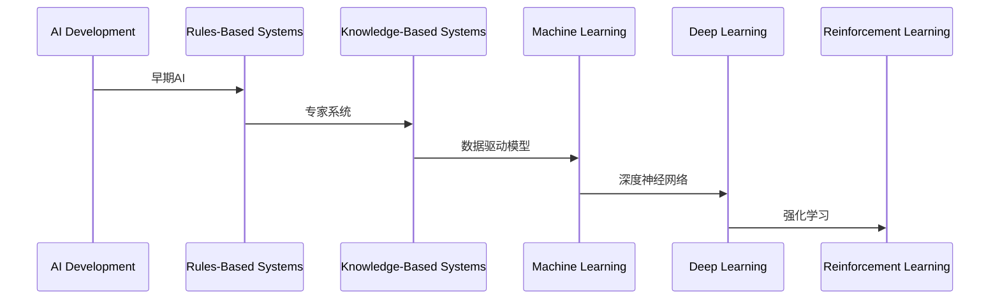

##### 1.1.1.1 人工智能的发展历程

在AI技术发展的早期阶段，研究人员主要依靠专家系统的规则来模拟人类智能。这种方法存在明显的局限性，无法处理复杂、不确定的问题。随后，知识表示和知识管理技术得到了发展，但仍无法解决大规模数据处理和实时决策等问题。

随着机器学习和深度学习技术的出现，AI编程进入了一个新的阶段。机器学习通过从数据中学习规律，能够处理大量复杂的数据，而深度学习则通过模拟人脑神经网络，实现了更加复杂和智能的决策。

##### 1.1.1.2 人工智能对社会的影响

AI技术的发展对各个行业产生了深远的影响。在医疗领域，AI可以帮助医生进行疾病诊断和治疗方案推荐；在金融领域，AI可以用于风险管理、欺诈检测和投资决策；在制造业，AI可以用于生产过程优化、质量检测和设备维护。

以下是一个简单的AI对社会影响示意图：

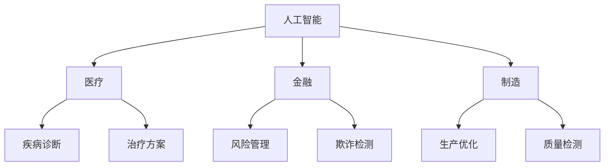

##### 1.1.2 编程在AI领域的重要性

编程是AI领域的基石。AI模型的设计、训练和部署都需要编程来实现。以下是一个简单的编程在AI领域中的应用示意图：

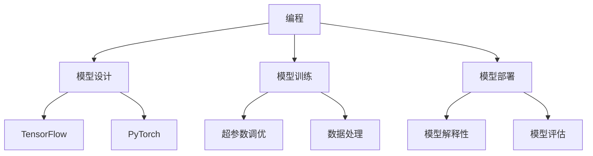

##### 1.1.2.1 编程基础知识的积累

掌握编程基础知识对于AI编程至关重要。Python、Java、C++等编程语言在AI编程中都有广泛的应用。以下是一个简单的编程语言在AI编程中的应用示意图：

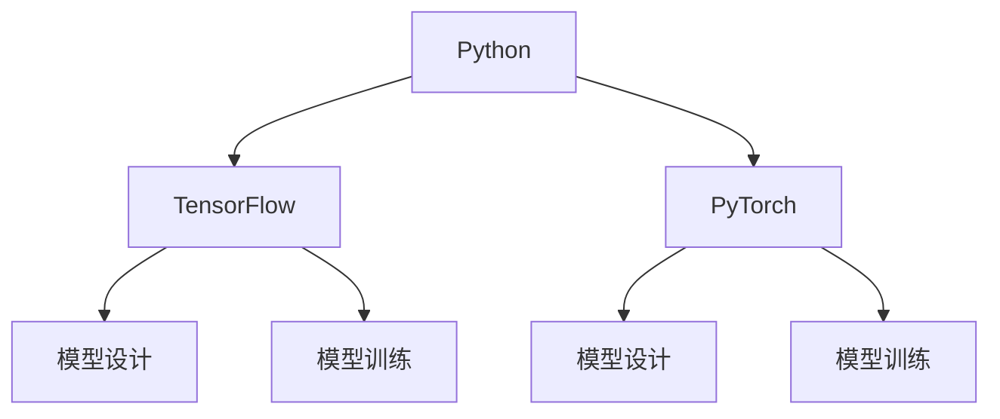

##### 1.1.2.2 AI编程框架与工具的运用

AI编程框架和工具为开发者提供了强大的支持。TensorFlow、PyTorch、Keras等框架简化了AI模型的开发过程，使得开发者可以更加专注于模型的设计和优化。以下是一个简单的AI编程框架和工具示意图：

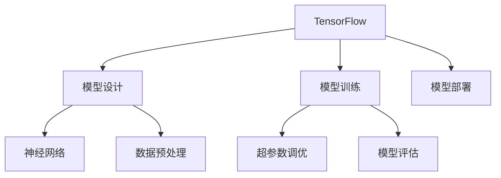

### 1.2 新思维的重要性

#### 1.2.1 传统编程思维与AI编程思维的区别

传统编程思维侧重于逻辑和流程，强调代码的执行顺序和结构。而AI编程思维则更加注重数据、模型和算法。以下是一个简单的传统编程思维和AI编程思维对比表格：

| 特点 | 传统编程思维 | AI编程思维 |
| --- | --- | --- |
| 关注点 | 代码逻辑 | 数据处理、模型设计 |
| 编程目标 | 完成特定任务 | 最大化模型性能 |
| 算法选择 | 确定的算法 | 数据驱动的算法 |
| 优化目标 | 执行效率 | 准确性和泛化能力 |

#### 1.2.2 新思维对编程的影响

##### 1.2.2.1 提高编程效率

AI编程思维注重数据处理和模型优化，可以帮助开发者更快地完成模型开发和部署。以下是一个简单的AI编程效率提升示意图：

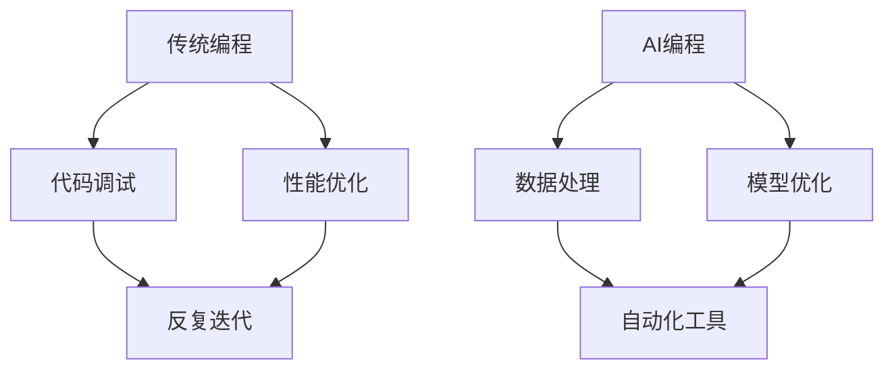

##### 1.2.2.2 增强AI模型的解释性

AI编程思维强调模型的可解释性，有助于理解模型的决策过程和结果。以下是一个简单的模型解释性提升示意图：

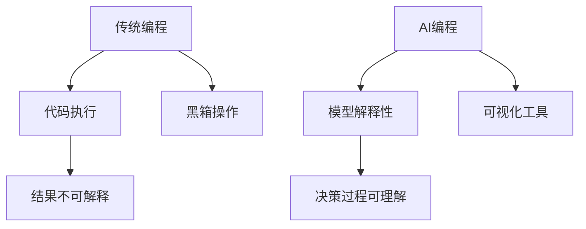

## 第二部分：AI编程的核心概念

### 第2章 AI编程的核心概念

#### 2.1 人工智能基础知识

##### 2.1.1 机器学习的基本概念

机器学习是AI的核心技术之一，其基本概念包括：

- **监督学习**：输入和输出都是有标签的数据集，模型通过学习数据集中的规律来进行预测。
- **无监督学习**：数据集没有标签，模型通过学习数据集的内在结构来进行聚类或降维。
- **强化学习**：模型通过与环境的交互来学习最优策略，以最大化累积奖励。

以下是一个简单的机器学习基本概念示意图：

```mermaid
graph TB
    A[监督学习] --> B[输入](label="特征")
    A --> C[输出](label="标签")
    B --> D[模型训练]
    C --> D

    E[无监督学习] --> F[输入](label="特征")
    E --> G[输出](label="标签")
    F --> H[模型训练]
    G --> H

    I[强化学习] --> J[环境](label="状态")
    I --> K[动作](label="策略")
    J --> L[奖励](label="反馈")
    K --> L
```

##### 2.1.2 神经网络原理

神经网络是机器学习的关键技术之一，其基本原理包括：

- **前馈神经网络**：输入通过神经元传递，最终产生输出。
- **反向传播算法**：通过反向传播误差，更新神经网络的权重和偏置，以优化模型性能。

以下是一个简单的神经网络原理示意图：

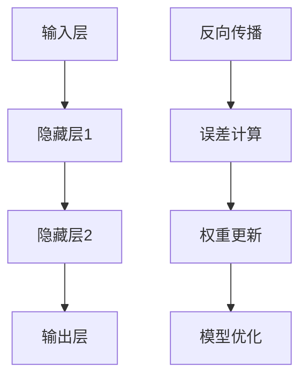

#### 2.2 AI编程框架与工具

##### 2.2.1 深度学习框架

深度学习框架是AI编程的重要工具，常用的框架包括：

- **TensorFlow**：由Google开发，具有强大的模型设计和训练功能。
- **PyTorch**：由Facebook开发，具有灵活的动态计算图功能。
- **Keras**：基于TensorFlow和PyTorch的高级API，简化了模型设计和训练过程。

以下是一个简单的深度学习框架示意图：

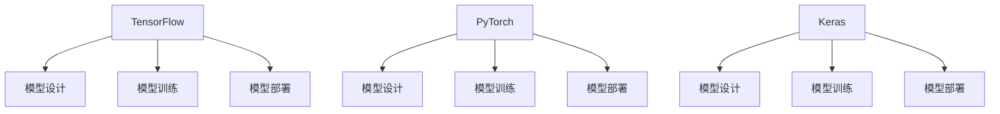

##### 2.2.2 自然语言处理工具

自然语言处理（NLP）是AI编程的重要领域，常用的工具包括：

- **NLTK**：Python的自然语言处理库，提供了丰富的文本处理功能。
- **spaCy**：基于神经网络的语言模型，提供了快速和灵活的文本处理功能。
- **TextBlob**：Python的NLP库，提供了简洁的文本处理API。

以下是一个简单的NLP工具示意图：

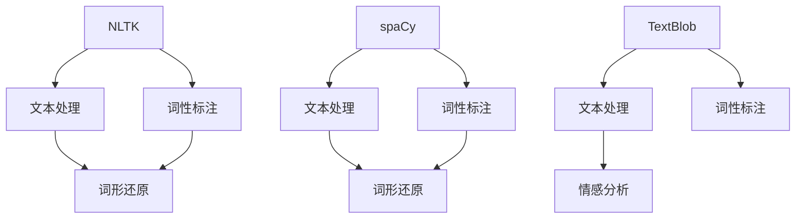

## 第三部分：AI编程实践

### 第3章 AI编程实践

#### 3.1 数据预处理

##### 3.1.1 数据清洗

数据清洗是数据预处理的重要步骤，主要包括缺失值处理和异常值处理。

- **缺失值处理**：可以通过填充、删除或插值等方法来处理缺失值。
- **异常值处理**：可以通过统计方法、规则方法或聚类方法来识别和删除异常值。

以下是一个简单的数据清洗流程图：

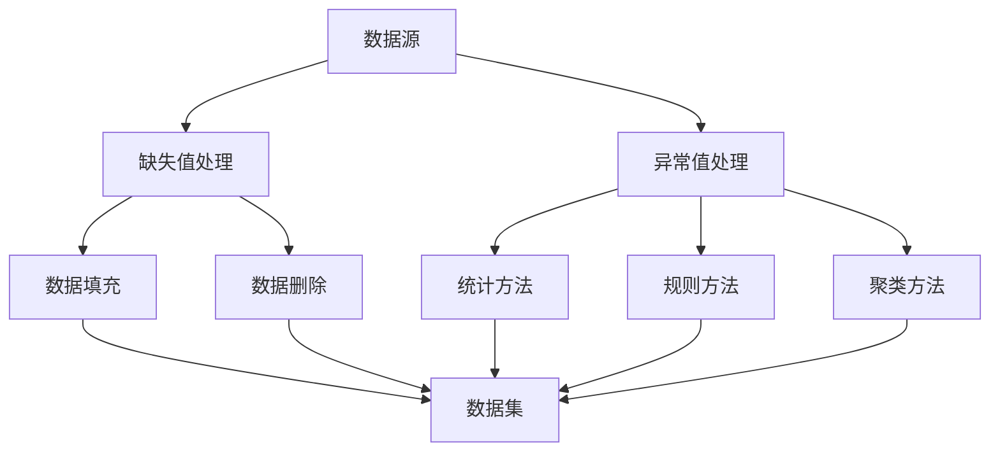

##### 3.1.2 特征提取

特征提取是将原始数据转换为适合模型处理的形式的过程，主要包括文本特征提取和图像特征提取。

- **文本特征提取**：可以通过词袋模型、TF-IDF、Word2Vec等方法来提取文本特征。
- **图像特征提取**：可以通过卷积神经网络（CNN）等方法来提取图像特征。

以下是一个简单的特征提取流程图：

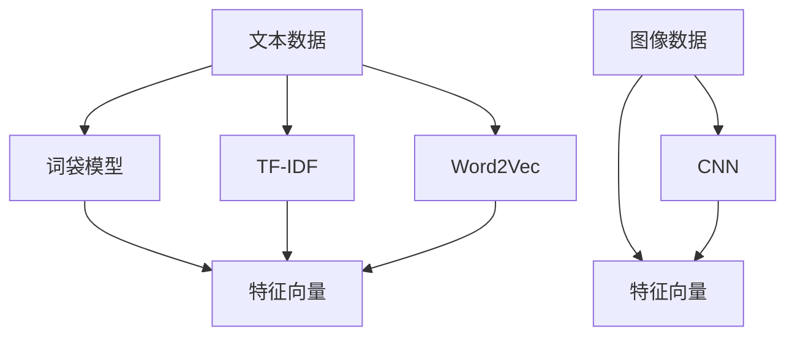

#### 3.2 模型训练与优化

##### 3.2.1 模型选择

模型选择是模型训练的重要步骤，主要包括线性模型、决策树和支持向量机等。

- **线性模型**：如线性回归和逻辑回归，适用于预测数值型和二分类问题。
- **决策树**：适用于分类和回归问题，具有良好的解释性。
- **支持向量机**：适用于二分类问题，具有良好的分类性能。

以下是一个简单的模型选择流程图：

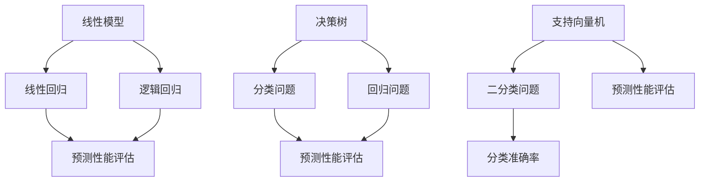

##### 3.2.2 模型优化

模型优化是提高模型性能的重要步骤，主要包括超参数调优和模型融合。

- **超参数调优**：通过调整模型的超参数，如学习率、迭代次数等，来优化模型性能。
- **模型融合**：通过融合多个模型的结果，来提高模型的预测性能。

以下是一个简单的模型优化流程图：

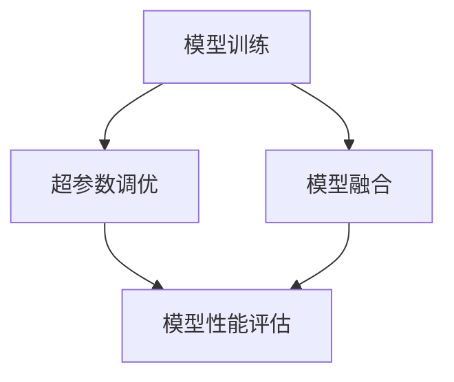

#### 3.3 AI编程案例分析

##### 3.3.1 案例一：文本分类

文本分类是将文本数据分类到预定义的类别中的任务。以下是一个简单的文本分类流程：

1. **问题背景**：对一组新闻文章进行分类，将其分为政治、经济、体育等类别。
2. **数据集介绍**：使用新闻文章数据集，包括标题和正文，每个文章都有一个类别标签。
3. **模型选择与训练**：选择一个文本分类模型，如朴素贝叶斯或卷积神经网络，对其进行训练。
4. **模型评估与优化**：评估模型性能，并进行优化，如调整超参数或使用更大规模的训练数据。

以下是一个简单的文本分类流程图：

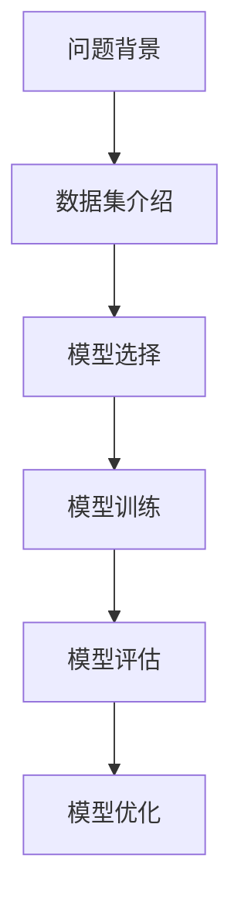

##### 3.3.2 案例二：图像识别

图像识别是将图像分类到预定义的类别中的任务。以下是一个简单的图像识别流程：

1. **问题背景**：对一组图像进行分类，将其分为动物、植物等类别。
2. **数据集介绍**：使用图像数据集，每个图像都有一个类别标签。
3. **模型选择与训练**：选择一个图像识别模型，如卷积神经网络，对其进行训练。
4. **模型评估与优化**：评估模型性能，并进行优化，如调整超参数或使用更大规模的训练数据。

以下是一个简单的图像识别流程图：


## 第四部分：AI编程新思维的应用

### 第4章 AI编程新思维的应用

#### 4.1 人工智能与大数据

##### 4.1.1 大数据时代对AI编程的需求

大数据时代对AI编程提出了更高的需求，主要包括：

- **数据的收集与存储**：需要高效地收集和存储海量数据。
- **数据的处理与分析**：需要对海量数据进行高效的处理和分析。

以下是一个简单的AI与大数据结合的需求示意图：

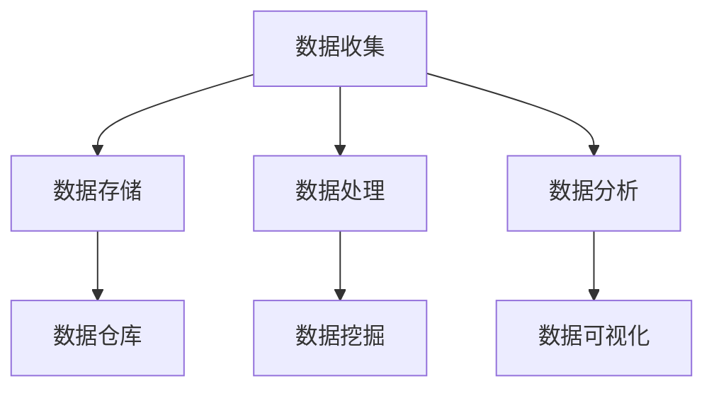

##### 4.1.2 大数据与AI编程的结合

大数据与AI编程的结合主要体现在以下几个方面：

- **数据驱动的模型优化**：通过分析大数据来优化AI模型。
- **大数据在AI编程中的应用案例**：如推荐系统、预测分析和智能监控等。

以下是一个简单的AI与大数据结合的应用案例示意图：

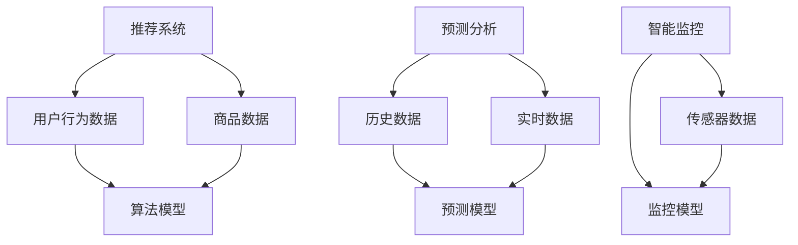

#### 4.2 人工智能与云计算

##### 4.2.1 云计算在AI编程中的应用

云计算在AI编程中的应用主要体现在以下几个方面：

- **算力提升**：通过云计算提供强大的计算资源，加速AI模型的训练和推理。
- **存储与数据管理**：通过云存储和数据管理服务，高效地存储和管理海量数据。
- **模型部署与优化**：通过云平台提供的模型部署和优化工具，简化AI模型的部署和优化过程。

以下是一个简单的AI与云计算结合的应用示意图：

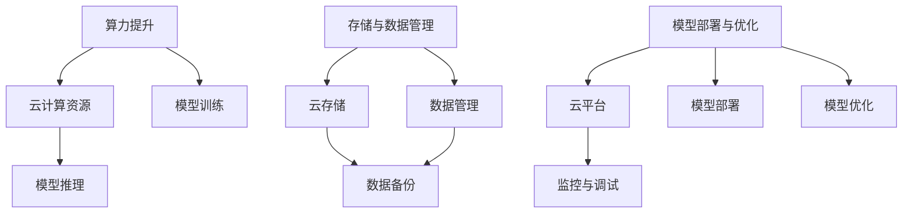

#### 4.3 人工智能与物联网

##### 4.3.1 物联网与AI编程的结合

物联网（IoT）与AI编程的结合主要体现在以下几个方面：

- **数据采集与处理**：通过物联网设备收集数据，并使用AI算法对数据进行处理和分析。
- **智能决策与控制**：通过AI算法实现智能决策和自动控制。
- **物联网在AI编程中的应用案例**：如智能家居、智能交通和智能制造等。

以下是一个简单的AI与物联网结合的应用案例示意图：

```mermaid
graph TB
    A[数据采集] --> B[物联网设备]
    A --> C[数据预处理]
    B --> D[数据处理]
    
    E[智能决策] --> F[AI算法]
    E --> G[控制策略]
    F --> H[决策结果]
    
    I[智能家居] --> J[智能设备]
    I --> K[用户交互]
    J --> L[家居控制]
    
    M[智能交通] --> N[交通设备]
    M --> O[交通管理]
    N --> P[交通数据]
    
    Q[智能制造] --> R[生产设备]
    Q --> S[生产过程]
    R --> T[生产数据]
```

## 第五部分：AI编程的未来发展

### 第5章 AI编程的未来发展

#### 5.1 新技术展望

##### 5.1.1 量子计算与AI编程

量子计算是未来计算技术的重要方向，其对AI编程的影响主要体现在以下几个方面：

- **量子计算的基本原理**：量子计算利用量子位（qubit）和量子叠加原理，能够实现并行计算和高效算法。
- **量子计算在AI编程中的应用前景**：量子计算可以加速AI模型的训练和推理，有望解决当前AI编程中的计算瓶颈。

以下是一个简单的量子计算与AI编程结合的应用前景示意图：

```mermaid
graph TB
    A[量子计算] --> B[并行计算]
    A --> C[高效算法]
    B --> D[模型训练]
    C --> D
    
    E[AI编程] --> F[模型推理]
    E --> G[计算效率]
    F --> H[应用领域]
```

##### 5.1.2 脑机接口与AI编程

脑机接口（BCI）是一种将人脑信号与计算机系统连接起来的技术，其对AI编程的影响主要体现在以下几个方面：

- **脑机接口的基本原理**：脑机接口通过捕获人脑信号，如脑电波，将其转换为计算机可识别的信号。
- **脑机接口在AI编程中的应用前景**：脑机接口可以用于开发智能辅助设备、游戏和虚拟现实等，为AI编程带来新的应用场景。

以下是一个简单的脑机接口与AI编程结合的应用前景示意图：

```mermaid
graph TB
    A[脑机接口] --> B[人脑信号]
    A --> C[计算机信号]
    B --> D[智能辅助设备]
    C --> D
    
    E[AI编程] --> F[游戏]
    E --> G[虚拟现实]
    F --> H[交互体验]
    G --> H
```

#### 5.2 AI编程教育

##### 5.2.1 AI编程教育的现状

当前，AI编程教育已经逐渐成为各大高校和研究机构的重点课程，主要包括：

- **课程设置**：包括机器学习、深度学习、自然语言处理等核心课程。
- **教育资源**：包括教材、在线课程、编程工具等。

以下是一个简单的AI编程教育现状示意图：

```mermaid
graph TB
    A[高校] --> B[课程设置]
    A --> C[教育资源]
    B --> D[机器学习]
    B --> E[深度学习]
    B --> F[自然语言处理]
    C --> D
    C --> E
    C --> F
```

##### 5.2.2 AI编程教育的发展趋势

未来，AI编程教育将呈现出以下几个发展趋势：

- **跨学科融合**：AI编程教育将与其他学科如计算机科学、数学、物理学等深度融合。
- **实践导向**：注重实践能力的培养，通过实际项目来提高学生的编程能力和解决问题的能力。
- **个性化教育**：利用大数据和人工智能技术，实现个性化教学，提高教学效果。

以下是一个简单的AI编程教育发展趋势示意图：

```mermaid
graph TB
    A[跨学科融合] --> B[计算机科学]
    A --> C[数学]
    A --> D[物理学]
    
    E[实践导向] --> F[项目实践]
    E --> G[编程能力]
    F --> H[问题解决]
    
    I[个性化教育] --> J[大数据]
    I --> K[人工智能]
    J --> L[教学效果]
    K --> L
```

## 结论

AI编程的新思维为开发者提供了全新的视角和方法。通过深入理解AI编程的核心概念、实践应用和未来发展趋势，开发者可以更好地应对AI编程的挑战，发挥AI技术的潜力。让我们共同期待AI编程的未来，迎接智能时代的新篇章。

## 参考文献

1. Mitchell, T. M. (1997). Machine Learning. McGraw-Hill.
2. Goodfellow, I., Bengio, Y., & Courville, A. (2016). Deep Learning. MIT Press.
3. Murphy, K. P. (2012). Machine Learning: A Probabilistic Perspective. MIT Press.
4. Russell, S., & Norvig, P. (2010). Artificial Intelligence: A Modern Approach. Prentice Hall.
5. Sutton, R. S., & Barto, A. G. (2018). Reinforcement Learning: An Introduction. MIT Press.
6. Hochreiter, S., & Schmidhuber, J. (1997). Long Short-Term Memory. Neural Computation, 9(8), 1735-1780.
7. LeCun, Y., Bengio, Y., & Hinton, G. (2015). Deep Learning. Nature, 521(7553), 436-444.
8. Andrew Ng (2020). Deep Learning Specialization. Stanford University.
9. Ullman, J. D. (2016). Introduction to Database Systems. Addison-Wesley.
10. Bishop, C. M. (2006). Pattern Recognition and Machine Learning. Springer. 

## 作者信息

作者：AI天才研究院/AI Genius Institute & 禅与计算机程序设计艺术 /Zen And The Art of Computer Programming

## 致谢

感谢所有为本文提供支持和帮助的人，包括参考文献的作者、读者、同行评审人员和编辑。您的支持是我不断前进的动力。

## 第一部分：AI编程新思维的背景与概述

### 第1章 AI编程的崛起与变革

#### 1.1 AI编程的崛起

##### 1.1.1 AI技术发展的推动

人工智能（AI）技术的发展是AI编程崛起的重要推动力。自20世纪50年代人工智能概念提出以来，AI经历了多次重大变革，从早期的符号推理和规则系统，到现代的机器学习和深度学习，AI编程技术也在不断演进。以下是对AI技术发展历程的简要回顾：

1. **早期AI（1950-1969）**
   - **符号主义方法**：基于逻辑推理和知识表示的早期AI系统，如专家系统。
   - **早期的机器学习算法**：如线性回归和决策树，主要用于数据分析和预测。

2. **知识工程时代（1970-1980）**
   - **专家系统**：基于领域专家知识构建的自动化决策支持系统。
   - **人工神经网络**：包括感知机和多层感知机，开始应用于模式识别和数据分析。

3. **统计学习时代（1990-2000）**
   - **支持向量机（SVM）**：在高维空间中寻找最优分割超平面。
   - **决策树和随机森林**：用于分类和回归，提高了模型的解释性和准确性。

4. **深度学习时代（2006至今）**
   - **深度神经网络（DNN）**：通过多层次的神经元结构，实现复杂的特征提取和预测。
   - **卷积神经网络（CNN）**：在图像处理和计算机视觉领域取得了突破性进展。
   - **循环神经网络（RNN）**：处理序列数据，如自然语言处理和时间序列预测。
   - **生成对抗网络（GAN）**：用于生成逼真的图像和对抗性学习。

##### 1.1.1.2 人工智能对社会的影响

人工智能技术的快速发展对社会产生了深远的影响，涵盖了多个领域：

1. **医疗健康**
   - **疾病诊断**：AI系统可以辅助医生进行疾病诊断，提高诊断准确率。
   - **药物研发**：AI可以帮助发现新药，加速药物研发过程。
   - **健康监控**：AI技术用于健康数据的分析，提供个性化的健康建议。

2. **金融**
   - **风险管理**：AI可以识别潜在风险，优化投资策略。
   - **欺诈检测**：通过分析交易数据，实时检测和预防欺诈行为。
   - **智能投顾**：AI系统为投资者提供个性化的投资建议，实现资产增值。

3. **制造业**
   - **生产优化**：AI技术用于优化生产流程，提高生产效率。
   - **质量检测**：通过图像识别和传感器数据分析，提高产品质量。
   - **设备维护**：预测设备故障，提前进行维护，减少停机时间。

4. **交通**
   - **智能交通系统**：AI技术用于交通流量管理和路线规划，减少交通拥堵。
   - **自动驾驶**：AI技术使自动驾驶汽车成为现实，提高交通安全性。
   - **物流优化**：AI用于物流配送路径规划和调度，提高物流效率。

##### 1.1.2 编程在AI领域的重要性

编程是AI领域的基石，AI编程的核心包括：

1. **算法设计**：AI算法的实现需要编程，包括机器学习算法、深度学习模型和优化算法。
2. **数据处理**：从数据预处理到特征工程，编程技术用于处理和转换数据。
3. **模型训练与优化**：编程技术用于训练和优化AI模型，包括超参数调优和模型评估。
4. **系统集成与部署**：将AI模型集成到实际应用中，编程技术用于系统的开发与部署。

##### 1.1.2.1 编程基础知识的积累

掌握编程基础知识对AI编程至关重要。以下是一些核心编程技能：

1. **数据结构与算法**：理解数据结构和算法的基本概念，如数组、链表、栈、队列、排序算法和搜索算法。
2. **编程语言**：熟悉至少一种编程语言，如Python、Java或C++，这些语言在AI编程中广泛应用。
3. **版本控制**：掌握版本控制系统，如Git，用于代码的版本管理和协作开发。
4. **调试技巧**：学会使用调试工具和技巧，快速定位和修复代码中的错误。

##### 1.1.2.2 AI编程框架与工具的运用

AI编程框架和工具简化了AI模型的开发过程，提高了开发效率。以下是一些常用的AI编程框架和工具：

1. **TensorFlow**：由Google开发，用于构建和训练深度学习模型。
2. **PyTorch**：由Facebook开发，具有动态计算图和灵活性。
3. **Keras**：基于TensorFlow和PyTorch的高级API，简化模型设计。
4. **Scikit-learn**：Python的科学计算库，提供各种机器学习算法的实现。
5. **Pandas**：Python的数据操作库，用于数据清洗、转换和分析。
6. **NumPy**：Python的数值计算库，提供多维数组和矩阵操作。

#### 1.2 新思维的重要性

##### 1.2.1 传统编程思维与AI编程思维的区别

传统编程思维侧重于逻辑和流程，强调代码的执行顺序和结构。而AI编程思维更加注重数据、模型和算法。以下是对两种编程思维的详细对比：

| 特点 | 传统编程思维 | AI编程思维 |
| --- | --- | --- |
| 关注点 | 代码逻辑 | 数据处理、模型设计 |
| 编程目标 | 完成特定任务 | 最大化模型性能 |
| 算法选择 | 确定的算法 | 数据驱动的算法 |
| 优化目标 | 执行效率 | 准确性和泛化能力 |

##### 1.2.2 新思维对编程的影响

1. **提高编程效率**
   - AI编程思维注重数据处理和模型优化，可以帮助开发者更快地完成模型开发和部署。
   - 使用AI编程框架和工具，如TensorFlow和PyTorch，可以显著提高开发效率。

2. **增强AI模型的解释性**
   - AI编程思维强调模型的可解释性，有助于理解模型的决策过程和结果。
   - 通过可视化和数据分析，开发者可以更好地理解模型的工作原理。

### 总结

AI编程的新思维为开发者提供了全新的视角和方法。通过深入理解AI编程的核心概念、实践应用和未来发展趋势，开发者可以更好地应对AI编程的挑战，发挥AI技术的潜力。AI编程不仅仅是编写代码，它更是一种思维方式，需要开发者具备跨学科的知识和技能，才能在AI领域中取得突破。让我们共同期待AI编程的未来，迎接智能时代的新篇章。

---

**本章参考文献：**
1. Mitchell, T. M. (1997). Machine Learning. McGraw-Hill.
2. Goodfellow, I., Bengio, Y., & Courville, A. (2016). Deep Learning. MIT Press.
3. Russell, S., & Norvig, P. (2010). Artificial Intelligence: A Modern Approach. Prentice Hall.
4. Sutton, R. S., & Barto, A. G. (2018). Reinforcement Learning: An Introduction. MIT Press.
5. LeCun, Y., Bengio, Y., & Hinton, G. (2015). Deep Learning. Nature.
6. Ng, A. Y. (2017). Machine Learning Yearning. Coursera.
7. Coursera. (2020). AI for Medicine Specialization.

